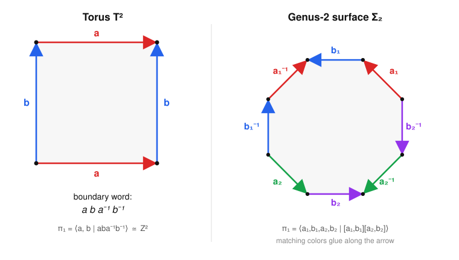

# Algebraic Topology · Lesson 2.6: Van Kampen in the wild

> ⏱ ~15 min · Module 2: Covering Spaces & Seifert–van Kampen · Builds on: [2.5 Seifert–van Kampen](02-05-seifert-van-kampen.md), [2.4 Free groups & presentations](02-04-free-groups-presentations.md) · Unlocks: [Module 3, 3.1 Simplicial & Δ-complexes](03-01-simplicial-delta-complexes.md)

## Why this matters

In [Lesson 2.5](02-05-seifert-van-kampen.md) van Kampen was a theorem about *two open pieces*. In practice you almost never hunt for open sets by hand — you look at a space's **cell structure** and read the group straight off the page. This lesson turns van Kampen into a reflex: a picture of a polygon with arrows on its edges becomes a group presentation in ten seconds. That reflex is how surfaces get classified, how the group $\langle a,b \mid aba^{-1}b^{-1}\rangle$ of the torus becomes the workhorse example of everything downstream, and how a knot diagram becomes an algebraic fingerprint of the knot. It is also the bridge to homology: **abelianize the group you read off, and you have $H_1$** — the same cell structure you used here reappears in Module 3 as a chain complex.

## The idea

Build a space one cell at a time and watch what each cell does to loops.

- A single **0-cell** is a point: $\pi_1$ is trivial.
- Adding a **1-cell** (an edge from the point back to itself) glues in a loop. One 1-cell gives a circle, $\pi_1=\mathbb{Z}$. Several 1-cells give a wedge of circles, and $\pi_1$ is *free* on them — no loop is forced to equal any product of the others.
- Adding a **2-cell** means glueing a disk onto the 1-skeleton along some loop $w$. A disk is fillable, so the loop $w$ that bounds it can now be contracted *through the disk*: $w$ becomes trivial. The 2-cell doesn't add a generator — it adds a **relation** $w=1$.

So a connected complex with **one 0-cell** has

$$\pi_1 = \big\langle\ \text{one generator per 1-cell}\ \big|\ \text{one relator per 2-cell, = its boundary word}\ \big\rangle.$$

Generators come from 1-cells, relators come from how 2-cells are attached, and — because a disk's boundary is 1-dimensional — cells of dimension $\ge 3$ are invisible to $\pi_1$. That's the whole method.

## The formal version

Everything rests on one clean special case of van Kampen.

**Attaching a 2-cell.** Let $Y$ be path-connected and let $X=Y\cup_\varphi e^2$ be the space obtained by glueing a 2-disk $D^2$ to $Y$ along its boundary via $\varphi\colon S^1\to Y$. Let $w=[\varphi]\in\pi_1(Y)$ be the class of the attaching loop. Then
$$\pi_1(X)\;\cong\;\pi_1(Y)\big/\langle\!\langle w\rangle\!\rangle,$$
where $\langle\!\langle w\rangle\!\rangle$ is the **normal closure** of $w$ (the smallest normal subgroup containing it).

*In words:* filling in a disk along a loop kills that loop — and kills every conjugate of it too, since it must die from every basepoint.

*Proof.* Let $U=X\setminus\{p\}$ with $p$ the center of the new 2-cell; $U$ deformation-retracts onto $Y$, so $\pi_1(U)\cong\pi_1(Y)$. Let $V$ be the open 2-cell, an open disk, so $\pi_1(V)=1$. Then $U\cap V$ is a punctured disk, homotopy equivalent to $S^1$, with $\pi_1(U\cap V)\cong\mathbb{Z}$ generated by a loop $\gamma$ around $p$. Under $U\cap V\hookrightarrow U$, $\gamma\mapsto w$; under $U\cap V\hookrightarrow V$, $\gamma\mapsto 1$. Van Kampen's pushout gives $\pi_1(X)=\big(\pi_1(Y)\ast 1\big)\big/N$, where $N$ is generated by the relations $i_{U*}(\gamma)=i_{V*}(\gamma)$, i.e. $w=1$. Normally generated by $w$, that quotient is exactly $\pi_1(Y)/\langle\!\langle w\rangle\!\rangle$. $\blacksquare$

**The cell-complex presentation.** Let $X$ be a connected CW complex with a **single 0-cell**. Its 1-skeleton $X^1$ is a wedge of circles, so $\pi_1(X^1)$ is free on the 1-cells $\{a_i\}$. Attaching the 2-cells $\{e^2_j\}$ along loops with boundary words $\{w_j\}$ and applying the box above once per 2-cell,
$$\boxed{\ \pi_1(X)\;=\;\langle\, a_i \ \mid\ w_j \,\rangle.\ }$$

*In words:* each 1-cell is a generator; each 2-cell's attaching loop, spelled out as a word in the 1-cells, is a relator.

**Surfaces from polygons.** A closed surface is a polygon with edges glued in pairs; its edge-word (read once around the boundary) is the single 2-cell's relator, provided all polygon corners get identified to one 0-cell — which they do for the standard words. This gives, instantly:

| Surface | Polygon word | $\pi_1$ | 
|---|---|---|
| Torus $T^2$ | $aba^{-1}b^{-1}$ | $\langle a,b\mid aba^{-1}b^{-1}\rangle\cong\mathbb{Z}^2$ |
| $\mathbb{RP}^2$ | $a^2$ | $\langle a\mid a^2\rangle\cong\mathbb{Z}/2$ |
| Klein bottle $K$ | $abab^{-1}$ | $\langle a,b\mid abab^{-1}\rangle$ (nonabelian) |
| Genus-$g$ $\Sigma_g$ | $\prod_{i=1}^g[a_i,b_i]$ | $\big\langle a_1,b_1,\dots,a_g,b_g \ \big|\ \textstyle\prod_i[a_i,b_i]\big\rangle$ |

Here $[a,b]=aba^{-1}b^{-1}$ is the commutator. The torus is the $g=1$ case.

**Abelianize to get $H_1$ (Module 3 preview).** For any path-connected $X$, the **Hurewicz theorem** says $H_1(X)\cong\pi_1(X)^{\mathrm{ab}}$ — homology in degree 1 is the abelianization of $\pi_1$. So the *same* presentation, read in the abelian world (every $[a,b]$ collapses to $0$, order of letters stops mattering), hands you $H_1$ for free. You'll rebuild $H_1$ from scratch in [3.4](03-04-cw-cellular-homology.md) via this exact cell structure — this is a first look at the punchline.

## Picture

The torus is a square with opposite edges glued in the *same* direction; walking its boundary once spells $aba^{-1}b^{-1}$. The genus-2 surface is a regular octagon whose eight edges are glued in four pairs, spelling $[a_1,b_1][a_2,b_2]$. In each, matching colors are the same 1-cell and the arrow fixes its orientation; every black dot is the single shared 0-cell.

## Worked examples

**Example 1 (mechanical — read $\pi_1$ off the torus square).** The square has one 0-cell (all four corners identify), two 1-cells $a,b$ (opposite edges glued in pairs), and one 2-cell filling the interior. Walking the boundary counterclockwise reads $w=aba^{-1}b^{-1}$. Hence
$$\pi_1(T^2)=\langle a,b\mid aba^{-1}b^{-1}\rangle.$$
The relator $aba^{-1}b^{-1}=1$ says $ab=ba$: the two generators commute. A free group on two generators modulo "they commute" is exactly the free *abelian* group $\mathbb{Z}^2$. So $\pi_1(T^2)\cong\mathbb{Z}^2$, matching the two independent loops (around the tube, around the hole) you can see on a doughnut.

**Example 2 (why you'd care — the Klein bottle is *not* the torus).** Same square, same two 1-cells, but now glue the top edge to the bottom with a *flip*, giving boundary word $w=abab^{-1}$:
$$\pi_1(K)=\langle a,b\mid abab^{-1}\rangle.$$
Rearrange the relator $abab^{-1}=1$ to $bab^{-1}=a^{-1}$: conjugating $a$ by $b$ inverts it. That is emphatically *not* $ab=ba$, so this group is **nonabelian** — it is the semidirect product $\mathbb{Z}\rtimes\mathbb{Z}$. Already $\pi_1$ alone certifies $K\not\cong T^2$: one group is abelian, the other isn't.

Now abelianize to see $H_1$. In the abelian world the relator $abab^{-1}$ becomes $a+b+a-b=2a$, so the only surviving relation is $2a=0$:
$$H_1(K)\cong\pi_1(K)^{\mathrm{ab}}=\langle a,b\mid 2a=0,\ a+b=b+a\rangle\cong\mathbb{Z}/2\ \oplus\ \mathbb{Z}.$$
The torus gave $H_1(T^2)=\mathbb{Z}^2$ (no torsion). The lone $\mathbb{Z}/2$ is the algebraic shadow of the Klein bottle's non-orientability — you'll meet it again as the boundary map "$\times 2$" in cellular homology.

## A one-paragraph knot-complement taste

The same "generators-and-relations-from-a-picture" trick computes $\pi_1(S^3\setminus K)$ for a knot $K$ directly from a **knot diagram**, via the **Wirtinger presentation**: take one generator for each *arc* (a strand between two undercrossings) and one relation at each *crossing* (the overstrand $c$ conjugates one under-arc to the next, $c\,a\,c^{-1}=b$). For the **trefoil** — three arcs, three crossings — this collapses to
$$\pi_1(S^3\setminus \text{trefoil})=\langle x,y\mid xyx=yxy\rangle,$$
the three-strand braid group in disguise. It is *nonabelian*, so the trefoil's complement is genuinely different from the unknot's (a solid torus, $\pi_1=\mathbb{Z}$) — the group *proves* the trefoil is knotted. Yet abelianize and the relation $xyx=yxy$ becomes $x=y$: everything collapses to a single $\mathbb{Z}$, so $H_1=\mathbb{Z}$ for *every* knot complement. Homology can't see knotting; $\pi_1$ can. That gap is the reason $\pi_1$ earns its keep even after homology arrives.

## Watch out

- **You might think** every polygon word gives a group with that many generators, **but** the theorem needs a *single* 0-cell. If corners split into several 0-cells, first collapse a spanning tree of the 1-skeleton (it's contractible, so $\pi_1$ is unchanged) to reduce to one vertex; only then read off generators. For the standard surface words all corners already merge, so you're safe.
- **You might think** higher cells matter, **but** attaching a 3-cell (or higher) never changes $\pi_1$: its boundary $S^2$ is simply connected, so it imposes no relation. $\pi_1$ sees only the 2-skeleton. (This is exactly why $\pi_1(S^n)=1$ for $n\ge 2$.)
- **You might think** killing $w$ kills only $w$, **but** it kills the whole *normal closure* $\langle\!\langle w\rangle\!\rangle$ — every conjugate $gwg^{-1}$ dies too. A relation in a group is inherently a statement about a conjugacy class, which is why presentations quotient by normal closures, not by subgroups.

## One-liner

> One 0-cell, one generator per edge, one relator per glued-in disk — a surface's picture *is* its group presentation, and abelianizing that presentation is already $H_1$.

## Problems

**P1 (🟢)** Consider the 2-complex $X$ with one 0-cell, one 1-cell $a$, and one 2-cell attached along the loop $a^3$ (a "$3$-fold projective plane"). Compute $\pi_1(X)$ and its abelianization $H_1(X)$. What familiar surface does the analogous $a^2$ complex give?

**P2 (🟡)** Abelianize the genus-2 relation $[a_1,b_1][a_2,b_2]$ and show $\pi_1(\Sigma_2)^{\mathrm{ab}}\cong\mathbb{Z}^4$. Then state $H_1(\Sigma_g)$ for general $g$, and explain in one line why the single relator contributes nothing after abelianizing.

**P3 (🔴, optional)** Show the trefoil group $G=\langle x,y\mid xyx=yxy\rangle$ is nonabelian by constructing a surjection $G\twoheadrightarrow S_3$ (the symmetric group on 3 letters). *Hint:* try $x\mapsto(1\,2)$, $y\mapsto(2\,3)$; check the relation holds and that the images don't commute.

Solutions

**P1** One 0-cell $\Rightarrow$ one generator $a$; the single 2-cell along $a^3$ contributes the relator $a^3$. So
$$\pi_1(X)=\langle a\mid a^3\rangle\cong\mathbb{Z}/3.$$
This group is already abelian, so $H_1(X)\cong\mathbb{Z}/3$ as well (abelianizing changes nothing). Replacing $a^3$ by $a^2$ gives $\langle a\mid a^2\rangle\cong\mathbb{Z}/2$, which is $\pi_1(\mathbb{RP}^2)$ — the real projective plane, a disk with antipodal boundary points glued, one cell in each dimension $0,1,2$. (In general $\langle a\mid a^n\rangle\cong\mathbb{Z}/n$, the "pseudo-projective plane" or Moore space $M(\mathbb{Z}/n,1)$.)

**P2** Write the relator additively. Each commutator abelianizes to
$$[a_i,b_i]=a_ib_ia_i^{-1}b_i^{-1}\ \longmapsto\ a_i+b_i-a_i-b_i=0,$$
so $[a_1,b_1][a_2,b_2]\mapsto 0+0=0$. The relation reads $0=0$ — vacuous. Thus the abelianization is free abelian on the four generators $a_1,b_1,a_2,b_2$:
$$\pi_1(\Sigma_2)^{\mathrm{ab}}\cong\mathbb{Z}^4.$$
By Hurewicz $H_1(\Sigma_2)\cong\mathbb{Z}^4$, and in general $H_1(\Sigma_g)\cong\mathbb{Z}^{2g}$ (a $4g$-gon has $2g$ edge-generators and one relator). The relator contributes nothing because it is a product of commutators, and *every* commutator is trivial once the group is made abelian — that is precisely what "abelian" means.

**P3** Take $\sigma=(1\,2)$ and $\tau=(2\,3)$ in $S_3$. Check the relation $xyx=yxy$ maps to $\sigma\tau\sigma=\tau\sigma\tau$. Composing right-to-left:
$$\sigma\tau\sigma=(1\,2)(2\,3)(1\,2)=(1\,3),\qquad \tau\sigma\tau=(2\,3)(1\,2)(2\,3)=(1\,3).$$
They agree, so $x\mapsto\sigma,\ y\mapsto\tau$ respects the relation and extends to a homomorphism $\phi\colon G\to S_3$. Its image contains the two transpositions $(1\,2),(2\,3)$, which generate all of $S_3$, so $\phi$ is surjective. Finally $\sigma\tau=(1\,2\,3)\ne(1\,3\,2)=\tau\sigma$, so the images don't commute; if $G$ were abelian its homomorphic image $S_3$ would be too. Hence $G$ is nonabelian, and the trefoil is genuinely knotted. (Its abelianization is still $\mathbb{Z}$, since $S_3^{\mathrm{ab}}=\mathbb{Z}/2$ is just a further quotient — homology never sees this.)

## Flashback

**From [Lesson 2.5](02-05-seifert-van-kampen.md) (Seifert–van Kampen):** Compute $\pi_1\big(T^2\vee S^1\big)$, the torus with a circle wedged on at a point. Give a presentation and say whether the group is free, abelian, or neither.

Solution

Split by van Kampen at the wedge point: let $A$ be an open neighborhood deformation-retracting onto the torus $T^2$ and $B$ one retracting onto the circle $S^1$, with $A\cap B$ a small contractible neighborhood of the wedge point ($\pi_1=1$). Because the intersection is simply connected, van Kampen's amalgamated product is an ordinary **free product**:
$$\pi_1(T^2\vee S^1)\cong\pi_1(T^2)\ast\pi_1(S^1)=\mathbb{Z}^2\ast\mathbb{Z}=\langle a,b\mid aba^{-1}b^{-1}\rangle\ast\langle c\rangle=\langle a,b,c\mid aba^{-1}b^{-1}\rangle.$$
It is **not free** (the relation $ab=ba$ survives, and free groups have no relations) and **not abelian** (the new generator $c$ commutes with nothing — in a free product only the identity is shared, so $ac\ne ca$). Abelianizing gives $H_1=\mathbb{Z}^3$: the wedge just adds one more free $\mathbb{Z}$ summand.

## Connections

- **Backward:** this is [2.5](02-05-seifert-van-kampen.md)'s van Kampen theorem applied one cell at a time, expressed in the presentation language of [2.4](02-04-free-groups-presentations.md). The genus-2 case is Boss problem 2, and its abelianization-mod-2 double cover ties back to the Galois correspondence of [2.3](02-03-deck-transformations-galois.md).
- **Forward:** the *same* cell structure becomes a chain complex in [3.1](03-01-simplicial-delta-complexes.md)–[3.4](03-04-cw-cellular-homology.md); the Hurewicz fact $H_1=\pi_1^{\mathrm{ab}}$ used here is proved properly once homology exists, and the Klein bottle's $\mathbb{Z}/2$ reappears as a cellular boundary map "$\times 2$".
- **Sideways ([abstract-algebra](../../abstract-algebra/syllabus.md)):** reading a space as generators-and-relations, and recognizing free products and amalgamations, is group-presentation theory — the topology is a machine for *producing* presentations. The Wirtinger presentation makes knot theory a branch of combinatorial group theory in the same spirit.
