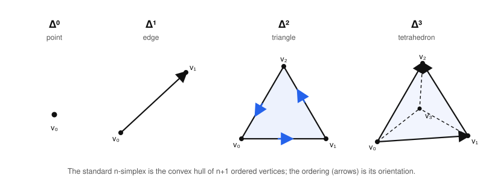
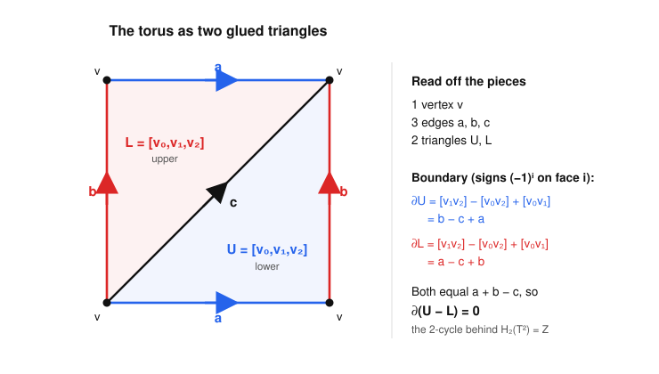

# Algebraic Topology · Lesson 3.1: Simplicial & $\Delta$-complexes

> ⏱ ~15 min · Module 3: Homology · Builds on: [1.1 Homotopy of maps](01-01-homotopy-of-maps.md), [2.6 Van Kampen in the wild](02-06-van-kampen-in-the-wild.md) · Unlocks: [3.2 Simplicial homology](03-02-simplicial-homology.md)

## Why this matters

The fundamental group was powerful but stubborn: it only sees one-dimensional holes, it's usually nonabelian, and deciding whether two presentations describe the same group can be undecidable. Homology fixes all three problems at once — it sees holes in *every* dimension, it lands in abelian groups, and it is genuinely *computable*. But to compute anything you first need spaces made of standardized, bookkeepable parts. That is this lesson: we cut a space into **simplices** (points, edges, triangles, tetrahedra…) glued along their faces, and we equip each piece with an **orientation**. The signs that orientation forces on the faces are already, in embryo, the boundary operator $\partial$ that Lesson 3.2 turns into homology. Get the signs right here and everything downstream is just linear algebra.

## The idea

A simplex is the simplest possible shape in each dimension: the "fattest" thing you can build from a handful of points. Zero points' worth of fat is a **point**; two points give a **segment**; three (not collinear) give a filled **triangle**; four give a solid **tetrahedron**. In general $n+1$ points in "general position" span the $n$-dimensional simplex $\Delta^n$ — the convex hull, the set of all weighted averages of the vertices.

Two moves generate everything:

- **Take a face.** Delete one vertex and keep the simplex spanned by the rest. Drop a vertex of a triangle and you get one of its three edges; drop a vertex of a tetrahedron and you get one of its four triangular faces. A face is a lower-dimensional simplex sitting inside the boundary.
- **Glue along faces.** Build a big space by taking a pile of simplices and identifying some of their faces with each other — edge to edge, triangle to triangle — by the obvious affine (linear) matching. A hollow tetrahedron surface is four triangles glued edge to edge; the torus, as we'll see, is *two* triangles glued cleverly.

The one non-cosmetic ingredient is **orientation**. Order the vertices $v_0, v_1, \dots, v_n$; that ordering is the orientation, drawn as arrows on the edges. It matters because when you take the boundary of an oriented simplex, its faces inherit orientations, and they come with *signs*: the $i$-th face enters with a $(-1)^i$. Those alternating signs are exactly what will make "the boundary of a boundary is zero," the identity that homology is built on. Orientation is not decoration — it is the seed of $\partial$.

## The formal version

**The standard $n$-simplex.** Order $n+1$ points $v_0, \dots, v_n$ (the *vertices*). The simplex they span is
$$\Delta^n = [v_0, \dots, v_n] = \Big\{\, \textstyle\sum_{i=0}^n t_i v_i \ :\ t_i \ge 0,\ \sum_i t_i = 1 \,\Big\},$$
the set of *convex combinations* of the vertices; the numbers $(t_0,\dots,t_n)$ are the **barycentric coordinates** of a point. The abstract model uses $v_i = e_i$, the standard basis vectors of $\mathbb{R}^{n+1}$.

*In words:* $\Delta^n$ is the solid triangle-in-$n$-dimensions — every point is a weighted average of the $n+1$ corners, with the weights summing to $1$.

$\Delta^0$ is a point, $\Delta^1 = [v_0,v_1]$ an edge, $\Delta^2$ a filled triangle, $\Delta^3$ a solid tetrahedron.

**Faces and face maps.** For each $i$ delete the vertex $v_i$; the remaining vertices span the $i$-th **face**, the $(n-1)$-simplex
$$[v_0, \dots, \widehat{v_i}, \dots, v_n],$$
where the hat means "omit." Setting the barycentric coordinate $t_i = 0$ defines the affine, order-preserving inclusion $d_i \colon \Delta^{n-1} \hookrightarrow \Delta^n$, the **$i$-th face map**, whose image is that face. An $n$-simplex has exactly $n+1$ faces, one per vertex you can drop.

*In words:* a face is what you get by throwing away one corner; $d_i$ is the recipe that glues the smaller simplex in as the face "opposite $v_i$."

**$\Delta$-complex.** A $\Delta$-**complex** structure on a space $X$ is a collection of maps $\sigma_\alpha \colon \Delta^{n_\alpha} \to X$ (one for each *cell*, $n_\alpha$ its dimension) such that:

1. each $\sigma_\alpha$ restricted to the open simplex (interior) is injective, and every point of $X$ is in the image of exactly one such open-simplex restriction;
2. each restriction of $\sigma_\alpha$ to a face of $\Delta^{n_\alpha}$ is one of the maps $\sigma_\beta \colon \Delta^{n_\alpha - 1} \to X$ — i.e. faces are themselves cells of the structure, via the face maps $d_i$;
3. $X$ has the quotient topology: a set is open iff its preimage under every $\sigma_\alpha$ is open.

*In words:* $X$ is assembled from standard simplices by affinely gluing them along whole faces, and the faces of a cell are again cells.

This is a mild loosening of a **simplicial complex** (the more rigid classical notion, where every simplex is determined by its vertex *set* and any two simplices meet in a common face). A $\Delta$-complex is allowed to glue a simplex's faces *to itself* or to fold several vertices together — which is exactly what lets the torus be built from two triangles instead of the dozens a genuine simplicial complex demands.

**Orientation and the induced boundary.** The vertex ordering $v_0 < \dots < v_n$ *is* the orientation of $[v_0,\dots,v_n]$. The boundary of the oriented simplex is the signed formal sum of its faces
$$\partial[v_0,\dots,v_n] \;=\; \sum_{i=0}^{n} (-1)^i\,[v_0,\dots,\widehat{v_i},\dots,v_n].$$

*In words:* to take the boundary, list all faces in vertex order and alternate their signs $+,-,+,-,\dots$; the sign $(-1)^i$ on the $i$-th face is the **induced (boundary) orientation**. This one formula, read as a homomorphism on formal sums of simplices, is the boundary operator that opens Lesson 3.2 — and the alternating signs are precisely what forces $\partial \circ \partial = 0$.

## Picture

The standard simplices, with their vertex orderings drawn as arrows (the orientation):

And the worked construction of the torus from two oriented triangles, with the edge identifications and the resulting boundaries:

## Worked examples

**Example 1 (mechanical — faces of a $2$-simplex, with signs).** Take the oriented triangle $\Delta^2 = [v_0,v_1,v_2]$. Dropping each vertex in turn gives the three edges, and the formula assigns each a sign:
$$\partial[v_0,v_1,v_2] = \underbrace{[v_1,v_2]}_{i=0,\ +} \;-\; \underbrace{[v_0,v_2]}_{i=1,\ -} \;+\; \underbrace{[v_0,v_1]}_{i=2,\ +}.$$
Trace it as arrows: the boundary orientation runs $v_0 \to v_1 \to v_2 \to v_0$ once around. The edge $[v_0,v_1]$ (arrow $v_0\to v_1$) and the edge $[v_1,v_2]$ (arrow $v_1\to v_2$) point *with* that circulation and get $+$; the edge $[v_0,v_2]$ points $v_0\to v_2$, i.e. *against* the $v_2\to v_0$ leg of the loop, so it appears as $-[v_0,v_2]$. The sign is bookkeeping for "does the face's own orientation agree with the way the boundary sweeps past it."

A quick sanity check of the pattern one dimension down: $\partial[v_0,v_1] = [v_1] - [v_0]$ (head minus tail), and $\partial[v_0] = 0$. In Lesson 3.2 you'll verify $\partial(\partial[v_0,v_1,v_2]) = 0$ by expanding — every vertex-pair term cancels against its twin.

**Example 2 (why you'd care — a $\Delta$-structure on the torus).** The torus $T^2 = S^1 \times S^1$ is the square $[0,1]^2$ with opposite edges glued *straight across* (no flip): left-to-right on top matches left-to-right on bottom, and similarly for the sides. Follow the figure. All four corners get identified to a **single vertex** $v$. The two horizontal edges become one edge $a$ (oriented rightward); the two vertical edges become one edge $b$ (oriented upward). Cut the square along its diagonal $c$ (from the bottom-left corner to the top-right, oriented that way) into a lower triangle $U$ and an upper triangle $L$. That is the entire structure:

$$\textbf{1 vertex } v, \qquad \textbf{3 edges } a,b,c, \qquad \textbf{2 triangles } U, L.$$

Now orient the triangles by the vertex orders shown and take boundaries with the sign rule. Writing $U = [v_0,v_1,v_2]$ with $(v_0,v_1,v_2)$ = (bottom-left, bottom-right, top-right):
$$\partial U = [v_1,v_2] - [v_0,v_2] + [v_0,v_1] = b - c + a,$$
since the right edge $[v_1,v_2]$ is $b$, the diagonal $[v_0,v_2]$ is $c$, and the bottom edge $[v_0,v_1]$ is $a$. For $L = [v_0,v_1,v_2]$ = (bottom-left, top-left, top-right):
$$\partial L = [v_1,v_2] - [v_0,v_2] + [v_0,v_1] = a - c + b,$$
the top edge $a$, the diagonal $c$, and the left edge $b$. **Both boundaries equal $a + b - c$.** Therefore
$$\partial(U - L) = 0.$$
That nonzero combination of triangles with vanishing boundary is a **$2$-cycle** — it detects the two-dimensional hole of the torus, and it is exactly what makes $H_2(T^2) \cong \mathbb{Z}$ when we compute in 3.2. Notice too that $\partial a = \partial b = \partial c = v - v = 0$ (every edge is a loop at the one vertex), so all three edges are $1$-cycles — a hint that $H_1(T^2)$ will be rank $2$ once we quotient out the boundary $a+b-c = \partial U$. Two triangles, and the whole homology of the torus is already latent in the picture.

Two more standard structures worth knowing:
- **Circle $S^1$:** one $0$-simplex $v$ and one $1$-simplex $e = [v_0,v_1]$ whose *both* endpoints are glued to $v$. This is a legal $\Delta$-complex but **not** a simplicial complex (a simplicial edge must have two distinct vertices) — the cleanest illustration of why we bothered to generalize.
- **$\mathbb{RP}^2$:** the square with edge word $abab$ (both edge-pairs glued with a flip). The four corners collapse to *two* vertices; cut by a diagonal into two triangles, giving $2$ vertices, $3$ edges, $2$ triangles, so Euler characteristic $2 - 3 + 2 = 1 = \chi(\mathbb{RP}^2)$. Its homology — with the famous $\mathbb{Z}/2$ torsion — is the target of Module 3's boss problem.

## Watch out

- **You might think** the boundary of $[v_0,v_1,v_2]$ is just "its three edges." **Actually** it is the three edges *with alternating signs*, $[v_1,v_2] - [v_0,v_2] + [v_0,v_1]$. Drop the signs and $\partial\partial = 0$ fails, and homology collapses. The $(-1)^i$ is the whole point of orienting.
- **You might think** a $\Delta$-complex is the same as a simplicial complex. **Actually** a $\Delta$-complex is looser: it lets a simplex have repeated vertices after gluing (the circle's single edge is a loop; the torus needs only two triangles). A simplicial complex forbids this and would need a much finer triangulation — at least $7$ triangles for the torus.
- **You might think** you can reorder the vertices freely. **Actually** a transposition of two vertices flips the orientation: $[v_1,v_0] = -[v_0,v_1]$ as oriented simplices, and an odd permutation negates the whole thing while an even one leaves it fixed. Pin down one ordering per cell and keep it.
- **You might think** the diagonal $c$ is an artifact you could omit. **Actually** you need it: gluing must be along genuine simplices, and an un-cut square is not a simplex. The diagonal is a real $1$-cell of the structure, which is why it appears in $\partial U$ and $\partial L$.

## One-liner

> Chop a space into ordered simplices glued along faces, and the alternating signs $(-1)^i$ that orientation forces on those faces *are* the boundary operator — homology is just what happens when you take that seriously.

## Problems

**P1 (🟢)** Write out $\partial[v_0,v_1,v_2,v_3]$ for the oriented $3$-simplex (tetrahedron) as a signed sum of its four triangular faces, using the sign rule.

**P2 (🟡)** Give the **Klein bottle** its standard $\Delta$-structure: the square with edge word $abab^{-1}$ (top and bottom both $a$ rightward; the two vertical edges are $b$ but glued with a flip), cut by the diagonal $c$ from bottom-left to top-right into triangles $U = [\text{BL},\text{BR},\text{TR}]$ and $L = [\text{BL},\text{TL},\text{TR}]$. First determine how many vertices the four corners collapse to. Then compute $\partial U$ and $\partial L$ in terms of $a,b,c$, and find the integer combination $mU + nL$ (if any) that is a $2$-cycle.

**P3 (🔴, optional)** A $\Delta$-complex has $V$ vertices, $E$ edges, and $F$ triangles (no higher cells). Its Euler characteristic is $\chi = V - E + F$. Using the structures in this lesson, compute $\chi$ for the circle, the torus, and $\mathbb{RP}^2$. Then, granting the fact that $\chi = \sum_n (-1)^n \operatorname{rank} H_n$ (proved in Module 3), and knowing $H_0 = \mathbb{Z}$ for each connected space, use your torus answer to predict $\operatorname{rank} H_1(T^2)$ — and check it against Example 2.

Solutions

**P1** Drop each vertex in turn, sign $(-1)^i$:
$$\partial[v_0,v_1,v_2,v_3] = [v_1,v_2,v_3] - [v_0,v_2,v_3] + [v_0,v_1,v_3] - [v_0,v_1,v_2].$$
Four faces, signs $+,-,+,-$. (One can now check $\partial\partial[v_0,v_1,v_2,v_3]=0$ by expanding each $\partial$ of a triangle and watching the $\binom{4}{2}=6$ edge-terms cancel in pairs — the general mechanism of Lesson 3.2.)

**P2** *Vertices.* Label corners BL, BR, TL, TR. Edge $a$ identifies bottom (BL$\to$BR) with top (TL$\to$TR), both rightward: so BL$\sim$TL and BR$\sim$TR. Edge $b$ identifies left and right, but with a flip ($b^{-1}$): the left edge oriented BL$\to$TL is glued to the right edge oriented TR$\to$BR, so BL$\sim$TR and TL$\sim$BR. Chaining: BL$\sim$TL, BL$\sim$TR, TL$\sim$BR gives BL$\sim$BR$\sim$TL$\sim$TR — all four corners collapse to a **single vertex** $v$ (just like the torus). Hence $\partial a = \partial b = \partial c = 0$.

*Boundaries.* With $U = [\text{BL},\text{BR},\text{TR}]$: $[v_1v_2]=[\text{BR},\text{TR}]$ is the right edge, $[v_0v_2]=[\text{BL},\text{TR}]$ is the diagonal $c$, $[v_0v_1]=[\text{BL},\text{BR}]$ is the bottom $a$. The Klein-bottle gluing sends the right edge (oriented BR$\to$TR = *upward*) to the *reverse* of $b$ (recall left BL$\to$TL is $b$, glued to right TR$\to$BR, so BR$\to$TR $= -b$). Thus
$$\partial U = (-b) - c + a = a - b - c.$$
With $L = [\text{BL},\text{TL},\text{TR}]$: $[v_1v_2]=[\text{TL},\text{TR}]$ is the top edge $a$, $[v_0v_2]=[\text{BL},\text{TR}]=c$, $[v_0v_1]=[\text{BL},\text{TL}]$ is the left edge $b$. So
$$\partial L = a - c + b.$$
Now seek $m,n$ with $\partial(mU+nL)=0$: 
$$m(a-b-c)+n(a+b-c) = (m+n)a + (n-m)b - (m+n)c = 0$$
forces $m+n = 0$ and $n-m = 0$, hence $m=n=0$. **There is no nonzero $2$-cycle** — consistent with $H_2(\text{Klein bottle}) = 0$ (the Klein bottle is non-orientable: unlike the torus, no consistent orientation of the two triangles agrees along the glued edges). Contrast the torus, where $U-L$ worked precisely because both boundaries were equal.

**P3** *Euler characteristics.*
- Circle: $V=1$, $E=1$, $F=0 \Rightarrow \chi = 1-1+0 = 0$.
- Torus: $V=1$, $E=3$, $F=2 \Rightarrow \chi = 1-3+2 = 0$.
- $\mathbb{RP}^2$: $V=2$, $E=3$, $F=2 \Rightarrow \chi = 2-3+2 = 1$.

*Predicting $\operatorname{rank} H_1(T^2)$.* Using $\chi = \operatorname{rank} H_0 - \operatorname{rank} H_1 + \operatorname{rank} H_2$ with $\chi(T^2)=0$, $\operatorname{rank} H_0 = 1$ (connected), and $\operatorname{rank} H_2 = 1$ (the cycle $U-L$ from Example 2 generates a $\mathbb{Z}$):
$$0 = 1 - \operatorname{rank} H_1 + 1 \ \Longrightarrow\ \operatorname{rank} H_1(T^2) = 2.$$
This matches Example 2's observation that $a$ and $b$ are the two independent $1$-cycles surviving after $a+b-c=\partial U$ is killed — the torus has two independent loops, exactly the two generators of $\pi_1(T^2)\cong\mathbb{Z}^2$. (For $\mathbb{RP}^2$ the same accounting gives $1 = 1 - \operatorname{rank}H_1 + \operatorname{rank}H_2$, so $\operatorname{rank}H_1 = \operatorname{rank}H_2$; both turn out to be $0$ over the rationals — the $\mathbb{Z}/2$ is pure torsion, invisible to rank, which is the boss problem's punchline.)

## Flashback

**From Lesson 1.1 (Homotopy of maps):** Let $X$ be the "theta" space $\theta$ — a circle with an extra chord across it (equivalently, the letter $\theta$). Show $X$ is *not* contractible, but that deleting the interior of the chord (leaving the bare circle) is a deformation retract of a suitable subspace; more concretely, show the closed annulus $A = \{\, 1 \le |z| \le 2 \,\} \subset \mathbb{R}^2$ deformation retracts onto its inner circle $S^1$, and conclude $A \simeq S^1$ (homotopy equivalent). Is $A$ contractible?

Solution

Define $r_t \colon A \to A$ for $t \in [0,1]$ by radially sliding each point inward toward the unit circle:
$$r_t(z) = \big(1 + (1-t)(|z|-1)\big)\,\frac{z}{|z|}.$$
At $t=0$, $r_0(z) = z$ (the identity on $A$). At $t=1$, $r_1(z) = z/|z|$, which lands on the inner circle $|z|=1$. Each $r_t$ is continuous in $(t,z)$ (note $|z|\ge 1 > 0$, so $z/|z|$ is well-defined and continuous), and for every $t$ and every $z$ already on the inner circle ($|z|=1$) we get $r_t(z) = z$ — the inner circle stays fixed throughout. So $r_t$ is a **deformation retraction** of $A$ onto $S^1$, and a space is homotopy equivalent to any deformation retract of it, giving $A \simeq S^1$. $\blacksquare$

$A$ is **not contractible.** If it were, it would be homotopy equivalent to a point, and homotopy equivalence is transitive, so $S^1 \simeq A \simeq \{\text{pt}\}$ would force $S^1$ to be contractible. But $\pi_1(S^1) \cong \mathbb{Z} \ne 0$ (Lesson 1.4), whereas a contractible space has trivial $\pi_1$ — contradiction. The annulus has the same "one-dimensional hole" as the circle it retracts onto; deformation retraction preserves that hole, and homology (this module) will measure it as $H_1(A) \cong H_1(S^1) \cong \mathbb{Z}$.

## Connections

- **Backward (1.1, 2.6):** homotopy equivalence (1.1) is the equivalence relation homology will respect — a $\Delta$-structure is a concrete handle for computing invariants of a space up to that relation. The surface polygons of 2.6 (the torus and genus-$g$ octagon glued from edges) are the *same* pictures, now read as $\Delta$-complexes: van Kampen extracted $\pi_1$ from the $1$-skeleton and the $2$-cells; homology will extract $H_*$ from the very same cells, but abelianized and in every dimension.
- **Forward (3.2):** the boundary formula $\partial[v_0,\dots,v_n] = \sum_i (-1)^i[\dots\widehat{v_i}\dots]$ becomes a homomorphism $\partial_n \colon C_n \to C_{n-1}$ between free abelian **chain groups**; Lesson 3.2 proves $\partial_{n-1}\partial_n = 0$ and defines $H_n = \ker\partial_n / \operatorname{im}\partial_{n+1}$. The torus cycle $U-L$ found here is the generator of $H_2(T^2)$ you'll confirm there. Lesson 3.4 replaces $\Delta$-cells with more efficient CW cells (one cell per dimension for $\mathbb{RP}^2$).
- **Sideways (abstract-algebra):** just as van Kampen produced a group *presentation* $\langle a,b \mid aba^{-1}b^{-1}\rangle$ for $\pi_1(T^2)$ from the same two triangles, homology will produce its **abelianization** $\mathbb{Z}^2$ — the passage from a nonabelian presentation to a free abelian group is exactly the abelianization functor from [abstract-algebra](../../abstract-algebra/syllabus.md), and it is why homology is the "abelian shadow" of homotopy.
- **Sideways ([topology](../../topology/syllabus.md)):** condition (3) of the definition — $X$ carries the quotient topology from its simplices — is the quotient-topology gluing you met in point-set topology; a $\Delta$-complex is a quotient of a disjoint union of standard simplices by an affine face-identification.
