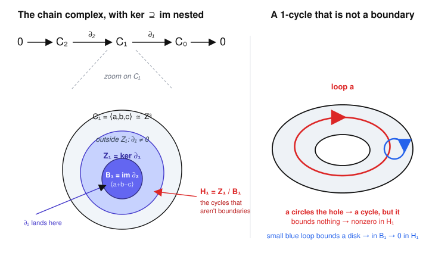

# Algebraic Topology · Lesson 3.2: Simplicial homology

> ⏱ ~15 min · Module 3: Homology · Builds on: [3.1 Simplicial & $\Delta$-complexes](03-01-simplicial-delta-complexes.md) · Unlocks: [3.3 Singular homology](03-03-singular-homology.md)

## Why this matters

The fundamental group is powerful but temperamental: it only sees dimension-1 holes, it's usually nonabelian, and computing it means running van Kampen by hand. Homology fixes all three problems at once. It detects holes in *every* dimension, the groups are abelian (so finitely generated ones are completely classified), and — the miracle you're about to build — the whole thing reduces to linear algebra over $\mathbb{Z}$: write down two matrices, take a kernel modulo an image, done. This lesson turns the combinatorial gadget from [3.1](03-01-simplicial-delta-complexes.md) into computable groups $H_n$, and every homology computation you meet later (spheres, projective spaces, the degree of a map) is a variation on the torus calculation at the end.

## The idea

A hole is something you can *loop around but not fill in*. Homology makes that literal in two steps.

First, a **cycle**: a formal combination of oriented simplices with no boundary — a loop of edges that closes up, a shell of triangles that seals shut. Cycles are the candidate "things surrounding a hole."

Second, a **boundary**: a cycle that is the edge of something one dimension higher — the perimeter of a filled-in region. A boundary surrounds nothing; the hole it might have enclosed has been plugged.

The holes are the cycles that are *not* boundaries. A loop around the central hole of a torus is a cycle (it closes up) but it bounds no disk on the surface (the hole is really there) — so it survives. A small loop on the torus that bounds a little patch is a cycle too, but a boring one; it gets quotiented away. **Homology is cycles modulo boundaries**, and the entire construction hangs on one algebraic fact: *the boundary of a boundary is zero*, which guarantees every boundary is automatically a cycle, so the quotient makes sense.

## The formal version

Fix a $\Delta$-complex $X$ (Lesson [3.1](03-01-simplicial-delta-complexes.md)): a space built from oriented $n$-simplices whose faces are glued by simplicial maps, each simplex carrying an ordering $[v_0,\dots,v_n]$ of its vertices that fixes its orientation.

**Definition (chain group).** The $n$-th **chain group** $C_n(X)$ is the free abelian group on the set of $n$-simplices of $X$. An element — an **$n$-chain** — is a finite formal sum $\sum_\alpha m_\alpha \sigma_\alpha$ with $m_\alpha \in \mathbb{Z}$, one integer per $n$-simplex $\sigma_\alpha$.

*In words:* $C_n$ is "integer combinations of the $n$-dimensional pieces"; the coefficient counts how many times, and with which orientation ($\pm$), you traverse each piece.

**Definition (boundary operator).** The **boundary** $\partial_n \colon C_n(X) \to C_{n-1}(X)$ is the homomorphism determined on a single simplex by
$$
\partial_n[v_0,\dots,v_n] \;=\; \sum_{i=0}^{n} (-1)^i\,[v_0,\dots,\widehat{v_i},\dots,v_n],
$$
where $\widehat{v_i}$ means the vertex $v_i$ is deleted; each summand is the $i$-th face, taken with sign $(-1)^i$, and $\partial_n$ extends to all chains by linearity.

*In words:* the boundary of a simplex is the alternating sum of the faces you get by dropping one vertex at a time — the signs are exactly what make the faces' induced orientations cancel where they meet.

Two low-degree sanity checks. An edge $[v_0,v_1]$ has $\partial_1[v_0,v_1] = [v_1] - [v_0]$ ("head minus tail"). A triangle has $\partial_2[v_0,v_1,v_2] = [v_1,v_2] - [v_0,v_2] + [v_0,v_1]$, the three edges traversed so they run head-to-tail around the boundary.

**Theorem (the fundamental identity).** $\;\partial_{n-1}\circ\partial_n = 0\;$ for all $n$.

*In words:* applying boundary twice always gives zero — the edge of a region has no edge of its own.

*Proof.* Apply $\partial_{n-1}$ to each face and expand. Writing $\sigma = [v_0,\dots,v_n]$,
$$
\partial_{n-1}\partial_n\sigma
= \sum_{i} (-1)^i \,\partial_{n-1}[\dots,\widehat{v_i},\dots]
= \sum_{j<i}(-1)^{i}(-1)^{j}[\dots\widehat{v_j}\dots\widehat{v_i}\dots]
\;+\; \sum_{j>i}(-1)^{i}(-1)^{j-1}[\dots\widehat{v_i}\dots\widehat{v_j}\dots].
$$
In the second sum the exponent is $j-1$, not $j$: once $v_i$ is gone, the vertex $v_j$ (with $j>i$) has shifted down one slot. Now fix any pair of deleted vertices $v_p, v_q$ with $p<q$. The resulting simplex $[\dots\widehat{v_p}\dots\widehat{v_q}\dots]$ appears **twice**: once from the first sum with $(i,j)=(q,p)$, contributing sign $(-1)^{q+p}$, and once from the second sum with $(i,j)=(p,q)$, contributing sign $(-1)^{p+q-1}$. These are negatives of one another, so the two occurrences cancel. Every term cancels in such a pair, hence the total is $0$. $\blacksquare$

The identity has one consequence that is the whole point. If $c = \partial_{n+1}b$ is a boundary, then $\partial_n c = \partial_n\partial_{n+1}b = 0$, so $c$ is a cycle. Therefore:
$$
\operatorname{im}\partial_{n+1} \;\subseteq\; \ker\partial_n .
$$

**Definitions (cycles, boundaries, homology).**
$$
Z_n = \ker\partial_n \ \ (\textbf{cycles}), \qquad
B_n = \operatorname{im}\partial_{n+1} \ \ (\textbf{boundaries}), \qquad
H_n(X) = Z_n / B_n .
$$
By the inclusion above $B_n \subseteq Z_n$, and both are subgroups of the abelian group $C_n$, so the quotient is a genuine abelian group — the **$n$-th simplicial homology group**. A class $[z] \in H_n$ is a cycle considered up to adding boundaries; $[z] = 0$ exactly when $z$ bounds.

*In words:* $H_n$ = ($n$-dimensional cycles) / (the ones that are merely boundaries) = the honest $n$-dimensional holes.

**$H_0$ counts path-components.** Here $\partial_0 = 0$, so $Z_0 = C_0$ (every vertex chain is a cycle), while $B_0 = \operatorname{im}\partial_1$ is spanned by all differences $[w]-[v]$ over edges $v\to w$. Two vertices are equal in the quotient iff joined by a path of edges — i.e. iff they lie in the same path-component. Hence $H_0(X)$ is **free abelian on the set of path-components**: one $\mathbb{Z}$ per connected piece.

## Picture

The complex $\cdots\to C_2\xrightarrow{\partial_2}C_1\xrightarrow{\partial_1}C_0\to 0$ runs across the top. Zooming in on $C_1$: the boundaries $B_1=\operatorname{im}\partial_2$ (core) sit inside the cycles $Z_1=\ker\partial_1$ (band) — that nesting *is* the identity $\partial^2=0$ — inside all of $C_1$. The quotient $H_1 = Z_1/B_1$ is the leftover band: cycles that aren't boundaries. On the torus, the red loop $a$ circling the central hole is such a survivor; the small blue loop bounds a disk, so it lives in $B_1$ and dies in homology.

## Worked examples

**Example 1 (the circle, warm-up).** Give $S^1$ the $\Delta$-structure with one vertex $v$ and one edge $a$ (a loop). Then $C_0=\mathbb{Z}\langle v\rangle$, $C_1=\mathbb{Z}\langle a\rangle$, and all higher $C_n=0$. The only boundary map is $\partial_1 a = [v]-[v] = 0$. So $\partial_1 = 0$, giving $Z_1 = C_1 = \mathbb{Z}$, $B_1 = 0$, and $Z_0 = C_0 = \mathbb{Z}$, $B_0 = \operatorname{im}\partial_1 = 0$. Hence
$$
H_0(S^1) = \mathbb{Z}, \qquad H_1(S^1) = \mathbb{Z}, \qquad H_n(S^1)=0\ (n\ge 2).
$$
One component, one 1-dimensional hole — the loop $a$ generates it. Exactly what you'd hope.

**Example 2 (the torus — the calculation everything imitates).** Take the standard square-with-identifications $\Delta$-structure on the torus $T$ from Lesson [3.1](03-01-simplicial-delta-complexes.md): all four corners glued to a single vertex $v$; three edges $a$ (bottom = top), $b$ (left = right), and the diagonal $c$; and two triangles, the lower $L=[v_0,v_1,v_2]$ and upper $U=[v_0,v_1',v_2]$, cut by $c$. So
$$
C_0 = \mathbb{Z}\langle v\rangle \cong \mathbb{Z}, \qquad C_1 = \mathbb{Z}\langle a,b,c\rangle \cong \mathbb{Z}^3, \qquad C_2 = \mathbb{Z}\langle U,L\rangle \cong \mathbb{Z}^2.
$$

*The maps.* Every edge runs from $v$ to $v$, so $\partial_1 a=\partial_1 b=\partial_1 c = [v]-[v]=0$; thus $\partial_1 = 0$. For the triangles, read off the three faces of each with signs $(+,-,+)$. Both triangles have bottom/left/top edges $a,b$ and the shared diagonal $c$, oriented so that
$$
\partial_2 L = a + b - c, \qquad \partial_2 U = a + b - c.
$$
(Concretely $\partial_2[v_0,v_1,v_2] = [v_1,v_2]-[v_0,v_2]+[v_0,v_1]$; matching each face to $a,b,c$ gives $b - c + a$ for the lower triangle and $a - c + b$ for the upper — the same element.)

*Homology, degree by degree.*

- $H_0$: $\partial_0=0$ so $Z_0=\mathbb{Z}$; $B_0=\operatorname{im}\partial_1 = 0$. So $H_0(T) = \mathbb{Z}$ — one component. ✓

- $H_1$: since $\partial_1=0$, $Z_1 = C_1 = \mathbb{Z}^3 = \langle a,b,c\rangle$. Boundaries $B_1 = \operatorname{im}\partial_2 = \mathbb{Z}\langle a+b-c\rangle$, an infinite cyclic subgroup. Thus
$$
H_1(T) = \frac{\mathbb{Z}\langle a,b,c\rangle}{\mathbb{Z}\langle a+b-c\rangle}.
$$
The relation $a+b-c = 0$ lets us solve $c = a+b$ and delete $c$ as a generator, leaving $\langle a,b\rangle$ free: $H_1(T) \cong \mathbb{Z}^2$. (Formally, $(1,1,-1)$ is a primitive vector, so quotienting $\mathbb{Z}^3$ by it yields torsion-free $\mathbb{Z}^2$.) The two surviving generators are the meridian and longitude loops. ✓

- $H_2$: no 3-simplices, so $B_2 = 0$ and $H_2 = Z_2 = \ker\partial_2$. Compute $\partial_2(mU + nL) = (m+n)(a+b-c)$, which vanishes iff $m+n=0$. So $\ker\partial_2 = \mathbb{Z}\langle U - L\rangle \cong \mathbb{Z}$, and
$$
H_2(T) = \mathbb{Z},
$$
generated by $U-L$ — the two triangles assembled with matching orientations into the whole torus surface. This $H_2 \ne 0$ is homology detecting the 2-dimensional "void" that $\pi_1$ is blind to. ✓

Collecting: $H_0(T)=\mathbb{Z},\ H_1(T)=\mathbb{Z}^2,\ H_2(T)=\mathbb{Z}$, and $0$ above. Compare $S^1\times S^1$: this is precisely $H_*(S^1)\otimes H_*(S^1)$ term by term (the Künneth pattern) — a coincidence worth filing away for later.

## Watch out

- **You might think orientation is optional bookkeeping — it's the whole engine.** Drop the $(-1)^i$ signs and $\partial^2$ is no longer $0$: the quotient $H_n$ would be meaningless. The alternating signs are exactly the arrangement that makes double-drops cancel in pairs.
- **You might think "cycle" means "loop."** In degree $1$ yes, but a cycle is *any* chain with zero boundary — a $2$-cycle is a closed shell of triangles, a $0$-cycle is any vertex chain. And a boundary is *automatically* a cycle ($B_n\subseteq Z_n$); the content of $H_n$ is which cycles fail to be boundaries.
- **You might think homology depends on the chosen $\Delta$-structure.** It doesn't — different triangulations of the same space give isomorphic $H_n$ (this is a theorem, proved once you have singular homology in [3.3](03-03-singular-homology.md) and its agreement with the simplicial version). That independence is what lets you pick the *smallest* structure, as with the two-triangle torus.
- **You might read $H_1=\mathbb{Z}^2$ as "$\pi_1$."** For the torus $\pi_1 = \mathbb{Z}^2$ too, but that is a coincidence of abelianness: in general $H_1$ is the **abelianization** of $\pi_1$, so nonabelian information is lost (a fact you'll prove for singular $H_1$ later).

## One-liner

> Build the free abelian groups on your simplices, connect them with the signed-face boundary $\partial$ (whose square is zero precisely because double-drops cancel), and read off the holes as $H_n=\ker\partial_n/\operatorname{im}\partial_{n+1}$ — cycles that refuse to bound.

## Problems

**P1 (🟢)** Give the $2$-sphere $S^2$ the $\Delta$-structure of the boundary of a tetrahedron: $4$ vertices $v_0,v_1,v_2,v_3$, $6$ edges, $4$ triangular faces. Compute $H_0(S^2)$ by writing down $Z_0$ and $B_0$ explicitly (you need only the $0$- and $1$-simplices), and confirm $H_0 = \mathbb{Z}$.

**P2 (🟡)** Let $X$ be the "theta graph": two vertices $v,w$ joined by three edges $a,b,c$, each oriented from $v$ to $w$. Write $C_1=\mathbb{Z}^3$, $C_0=\mathbb{Z}^2$, compute the matrix of $\partial_1$, and find $H_0(X)$ and $H_1(X)$. Interpret $\operatorname{rank} H_1$ as a count of independent loops.

**P3 (🔴, optional)** The Klein bottle $K$ has the same two-triangle $\Delta$-structure as the torus but with one edge-gluing reversed, giving $\partial_2 U = a + b - c$ and $\partial_2 L = a - b + c$ (edges $a,b,c$; single vertex $v$; $\partial_1=0$). Compute $H_0(K), H_1(K), H_2(K)$. You should find torsion in $H_1$ and $H_2=0$ — explain in one line why the vanishing $H_2$ says $K$ is non-orientable.

Solutions

**P1** Here $\partial_0=0$, so $Z_0 = C_0 = \mathbb{Z}\langle v_0,v_1,v_2,v_3\rangle \cong \mathbb{Z}^4$. Each edge $e$ from $v_i$ to $v_j$ has $\partial_1 e = [v_j]-[v_i]$, so $B_0 = \operatorname{im}\partial_1$ is spanned by all such differences. Because the $1$-skeleton is connected, we can reach every vertex from $v_0$ by edges, so $[v_1]-[v_0],\,[v_2]-[v_0],\,[v_3]-[v_0]$ all lie in $B_0$; these three are independent, and every difference is a combination of them, so $B_0 \cong \mathbb{Z}^3$. In the quotient all four vertex classes collapse to $[v_0]$:
$$
H_0(S^2) = C_0/B_0 = \mathbb{Z}^4/\mathbb{Z}^3 \cong \mathbb{Z},
$$
generated by $[v_0]$. (This is the general principle in action: $H_0$ is free abelian on path-components, and $S^2$ has exactly one.) $\blacksquare$

**P2** Order the generators. $\partial_1 a = \partial_1 b = \partial_1 c = [w]-[v]$. With basis $(a,b,c)$ for $C_1$ and $(v,w)$ for $C_0$, and writing chains as columns,
$$
[\partial_1] = \begin{pmatrix} -1 & -1 & -1 \\ \phantom{-}1 & \phantom{-}1 & \phantom{-}1 \end{pmatrix}.
$$
*Image (= $B_0$):* spanned by the single column $(-1,1)^\top$, so $B_0 = \mathbb{Z}\langle w-v\rangle \cong \mathbb{Z}$. Then $H_0 = C_0/B_0 = \mathbb{Z}^2/\mathbb{Z}\langle w-v\rangle \cong \mathbb{Z}$ — one path-component. ✓
*Kernel (= $Z_1$):* $\partial_1(x a + y b + z c) = (x+y+z)(w-v) = 0 \iff x+y+z=0$. This kernel is $\{(x,y,z): x+y+z=0\}\cong\mathbb{Z}^2$, spanned e.g. by $a-b$ and $b-c$. There are no $2$-simplices, so $B_1=0$ and $H_1(X) = Z_1 \cong \mathbb{Z}^2$. The rank $2$ counts the independent loops of the graph: three edges between two vertices bound $3-1=2$ independent cycles (a spanning tree uses $1$ edge; each of the other $2$ closes a loop). $\blacksquare$

**P3** Groups are the same as the torus: $C_0=\mathbb{Z}\langle v\rangle$, $C_1=\mathbb{Z}\langle a,b,c\rangle$, $C_2=\mathbb{Z}\langle U,L\rangle$, and $\partial_1=0$.

$H_0$: $\partial_1=0 \Rightarrow Z_0=\mathbb{Z}$, $B_0=0$, so $H_0(K)=\mathbb{Z}$ (connected). ✓

$H_2$: $B_2=0$, so $H_2=\ker\partial_2$. From $\partial_2 U = a+b-c$ and $\partial_2 L = a-b+c$,
$$
\partial_2(mU+nL) = (m+n)a + (m-n)b + (-m+n)c = (m+n)a + (m-n)(b-c).
$$
This is $0$ iff $m+n=0$ and $m-n=0$, i.e. $m=n=0$. So $\ker\partial_2 = 0$ and $H_2(K)=0$. There is no nonzero $2$-cycle: unlike the torus, the two triangles cannot be oriented to cancel along every shared edge — that failure *is* non-orientability, and a closed surface is orientable iff its top homology is $\mathbb{Z}$ (here it's $0$). ✓

$H_1$: $Z_1 = C_1 = \mathbb{Z}^3$ (since $\partial_1=0$) and $B_1 = \operatorname{im}\partial_2 = \langle\, a+b-c,\ a-b+c\,\rangle$, so $H_1 = \mathbb{Z}\langle a,b,c\rangle / B_1$. Impose the two relations. The first, $a+b-c=0$, lets us eliminate the generator $c = a+b$; substituting into the second gives $a-b+c = a-b+(a+b) = 2a$, so the second relation becomes $2a=0$. Nothing constrains $b$. Hence
$$
H_1(K) \cong \langle a,b \mid 2a = 0\rangle \cong \mathbb{Z}/2 \oplus \mathbb{Z}.
$$
(Equivalently: the Smith normal form of $\left(\begin{smallmatrix}1&1&-1\\ 1&-1&1\end{smallmatrix}\right)$ is $\operatorname{diag}(1,2)$ with a zero column, giving $\mathbb{Z}/1\oplus\mathbb{Z}/2\oplus\mathbb{Z}$.) The free $\mathbb{Z}$ is the longitude that survives; the $\mathbb{Z}/2$ is the Klein bottle's orientation-reversing loop — a nontrivial cycle, yet *twice* it bounds. That torsion is information $\pi_1$'s abelianization records too, while $H_2=0$ independently confirms non-orientability. $\blacksquare$

## Flashback

**From Lesson [3.1](03-01-simplicial-delta-complexes.md) (orienting a simplex / signed faces):** Let $\sigma = [v_0,v_1,v_2,v_3]$ be an oriented $3$-simplex (a tetrahedron with ordered vertices). (a) Write out $\partial_3\sigma$ as a signed sum of its four triangular faces. (b) Which face carries a minus sign, and in one sentence, what does the sign encode geometrically?

Solution

(a) Drop each vertex in turn with sign $(-1)^i$:
$$
\partial_3[v_0,v_1,v_2,v_3] = [v_1,v_2,v_3] - [v_0,v_2,v_3] + [v_0,v_1,v_3] - [v_0,v_1,v_2].
$$
(b) The faces obtained by dropping $v_1$ and $v_3$ (odd positions) carry minus signs. Geometrically the sign records the *induced orientation* on each face: it flips the face's own vertex-ordering exactly when needed so that adjacent faces of $\sigma$ disagree along their shared edge — which is precisely what forces the double-boundary $\partial_2\partial_3\sigma$ to cancel to $0$. Quick check: applying $\partial_2$ to the four faces and collecting, every edge $[v_i,v_j]$ appears twice with opposite signs, so $\partial_2\partial_3\sigma = 0$, consistent with the fundamental identity. $\blacksquare$

## Connections

- **Backward:** this is the payoff of [3.1](03-01-simplicial-delta-complexes.md) — the oriented simplices and signed face maps you assembled there are exactly the generators of $C_n$ and the terms of $\partial_n$. And $H_1$ turning out to be $\pi_1$ abelianized ties Module 3 back to the fundamental group of Modules 1–2.
- **Forward:** [3.3 Singular homology](03-03-singular-homology.md) replaces "$n$-simplices of a $\Delta$-complex" with "*all* continuous maps $\Delta^n\to X$," getting a functor defined for every space and no triangulation needed — but the algebra ($C_n$, the same signed $\partial$, $\partial^2=0$, $H_n=\ker/\operatorname{im}$) is byte-for-byte what you built today. [3.4](03-04-cw-cellular-homology.md) then makes the computation cheap again via cell structures, and the torus recomputation there should match this one.
- **Sideways (algebra):** $H_n = \ker\partial_n/\operatorname{im}\partial_{n+1}$ is a quotient of abelian groups, so classifying $H_n$ is the classification of finitely generated abelian groups (free rank + torsion) from [abstract-algebra](../../abstract-algebra/syllabus.md) — the Klein-bottle $\mathbb{Z}/2$ in P3 is that theorem doing visible work, and Smith normal form is the algorithm that turns any $\partial$-matrix into these groups mechanically.
- **Sideways (topology):** the claim that $H_n$ doesn't depend on the chosen triangulation is a topological-invariance statement whose careful proof rests on the quotient-topology and subdivision machinery from [topology](../../topology/syllabus.md).
