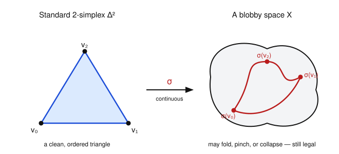

# Algebraic Topology · Lesson 3.3: Singular homology

> ⏱ ~15 min · Module 3: Homology · Builds on: [Lesson 3.2](03-02-simplicial-homology.md) (chain complexes, $\partial^2=0$, $H_n=\ker\partial/\operatorname{im}\partial$) · Unlocks: [Lesson 3.4](03-04-cw-cellular-homology.md) (cellular homology)

## Why this matters

Simplicial homology (Lesson 3.2) is wonderfully computable, but it has a fine-print clause: your space must come pre-cut into a $\Delta$-complex, and you must *believe* the answer doesn't depend on how you cut it. Both problems vanish here. Singular homology assigns groups $H_n(X)$ to **every** topological space — no triangulation, no choices — and it is manifestly a topological (indeed homotopy) invariant. That last fact is the whole game: it is what lets us say "$H_1$ counts the independent loops" without ever worrying that we drew the picture wrong. Everything downstream — the long exact sequences, degree theory, Brouwer in all dimensions — is built on this definition.

## The idea

In 3.2 the $n$-cells were *chosen* pieces glued in a rigid pattern. The trick now is greedy: instead of picking a few good simplices, throw in **all of them**. A singular $n$-simplex is *any* continuous map from the standard triangle-of-dimension-$n$ into $X$ — it is allowed to fold, pinch, or collapse a face to a point. "Singular" means exactly this permissiveness: no injectivity, no niceness, nothing to check but continuity.

That sounds insane — the chain groups become gigantic (uncountable, usually). But we never list a basis. We only ever push formal sums of these maps through the **same boundary formula** as before, and the same miraculous cancellation gives $\partial^2 = 0$. So we get a chain complex, and homology is its $\ker/\operatorname{im}$, verbatim. The payoff for the bloat: because a *continuous map* $f\colon X\to Y$ turns any singular simplex in $X$ into one in $Y$ just by composing, homology becomes automatic — functorial and, as we'll prove, blind to homotopy.

## The formal version

Let $\Delta^n = \{(t_0,\dots,t_n) : t_i \ge 0,\ \sum_i t_i = 1\}$ be the **standard $n$-simplex**, with ordered vertices $v_0,\dots,v_n$ (here $v_i$ is the point with a $1$ in slot $i$).

**Definition (singular simplex).** A **singular $n$-simplex** in a space $X$ is a continuous map $\sigma\colon \Delta^n \to X$. The **singular chain group** $C_n(X)$ is the free abelian group on the *set of all* singular $n$-simplices (and $C_n(X)=0$ for $n<0$).

*In words:* a chain is a finite formal $\mathbb{Z}$-combination $\sum_i m_i\,\sigma_i$ of continuous triangle-maps — no compatibility conditions among them.

For each $i$ let $\delta_i\colon \Delta^{n-1}\hookrightarrow\Delta^n$ be the affine inclusion onto the face opposite $v_i$ (it sends the ordered vertices $v_0,\dots,v_{n-1}$ to $v_0,\dots,\hat v_i,\dots,v_n$, the hat meaning "omit"). The **boundary operator** is

$$\partial_n\sigma \;=\; \sum_{i=0}^{n} (-1)^i \,\sigma\circ\delta_i \;=\; \sum_{i=0}^n (-1)^i\,\sigma|_{[v_0,\dots,\hat v_i,\dots,v_n]},$$

extended linearly to $\partial_n\colon C_n(X)\to C_{n-1}(X)$.

*In words:* the boundary of a singular simplex is the alternating sum of its restrictions to the $(n+1)$ faces — exactly the 3.2 formula, now applied to arbitrary maps instead of chosen cells.

**Lemma ($\partial^2=0$).** $\partial_{n-1}\circ\partial_n = 0$.
*Proof.* Composing two face maps, $\delta_i\delta_j = \delta_j\delta_{i-1}$ whenever $j<i$ (omitting the $j$-th then the $i$-th vertex is the same as omitting the $i$-th then the $j$-th, with indices shifted). Expanding,
$$\partial\partial\sigma = \sum_{j\le i}(-1)^{i+j}\,\sigma\delta_i\delta_j \;+\; \sum_{j> i}(-1)^{i+j}\,\sigma\delta_i\delta_j.$$
Re-index the first sum with the identity above; each term pairs with one in the second sum carrying the opposite sign, and they annihilate. $\blacksquare$

So $(C_\bullet(X),\partial)$ is a chain complex, and we define the **singular homology**

$$H_n(X) \;=\; \ker\partial_n \big/ \operatorname{im}\partial_{n+1} \;=\; \frac{Z_n(X)}{B_n(X)},$$

cycles mod boundaries — identical bookkeeping to simplicial homology.

**Functoriality.** A continuous $f\colon X\to Y$ gives $f_\#\colon C_n(X)\to C_n(Y)$, $\ f_\#\sigma = f\circ\sigma$. Because restricting-then-composing equals composing-then-restricting, $f_\#\partial = \partial f_\#$; hence $f_\#$ sends cycles to cycles and boundaries to boundaries and descends to
$$f_*\colon H_n(X)\to H_n(Y),\qquad (g\circ f)_* = g_*\circ f_*,\quad (\operatorname{id}_X)_* = \operatorname{id}.$$

*In words:* homology is a functor — maps of spaces become homomorphisms of groups, and composition is respected. Homeomorphic spaces therefore have isomorphic $H_n$. (The point-set fact that $f\circ\sigma$ is continuous whenever $f$ and $\sigma$ are is doing quiet work here — this is the bridge to [topology](../../topology/syllabus.md).)

**Theorem (homotopy invariance).** If $f\simeq g\colon X\to Y$, then $f_* = g_*$ on every $H_n$.
*Sketch.* A homotopy $H\colon X\times I\to Y$ from $f$ to $g$ induces a **prism operator** $P\colon C_n(X)\to C_{n+1}(Y)$. Slice the prism $\Delta^n\times I$ into $(n{+}1)$-simplices $[v_0,\dots,v_i,w_i,\dots,w_n]$ (bottom vertices $v_j$ at level $0$, top vertices $w_j$ at level $1$) and set $P\sigma=\sum_i(-1)^i\,H\circ(\sigma\times\operatorname{id})|_{[v_0,\dots,v_i,w_i,\dots,w_n]}$. A direct boundary computation gives the **chain-homotopy identity**
$$\partial P + P\partial = g_\# - f_\#$$
(the top face of the prism is $g_\#\sigma$, the bottom is $f_\#\sigma$, and the side faces cancel against $P\partial\sigma$). Now if $\alpha$ is a cycle, $g_\#\alpha - f_\#\alpha = \partial P\alpha + P\underbrace{\partial\alpha}_{0} = \partial(P\alpha)$ is a boundary, so $[g_\#\alpha]=[f_\#\alpha]$. Hence $f_*=g_*$. $\blacksquare$

*In words:* if you can slide $f$ to $g$, they induce the *same* map on homology — the difference is always a boundary, hence invisible. This is the theorem that makes $H_n$ a deformation invariant.

**Corollary.** A homotopy equivalence $f\colon X\to Y$ induces isomorphisms $f_*\colon H_n(X)\xrightarrow{\ \cong\ }H_n(Y)$ for all $n$. (If $gf\simeq\operatorname{id}$ and $fg\simeq\operatorname{id}$, then $g_*f_*=\operatorname{id}$ and $f_*g_*=\operatorname{id}$ by the theorem, so $f_*$ is invertible.) In particular **contractible spaces have the homology of a point.**

**Theorem (agreement).** For any $\Delta$-complex $X$, the natural map $H_n^{\Delta}(X)\to H_n(X)$ from simplicial to singular homology is an isomorphism.
*In words:* the concrete simplicial computations of Lesson 3.2 compute the *real* invariant — they are correct and independent of the triangulation you chose. (Proof deferred; it runs through relative homology and the long exact sequence of Module 4.)

## Picture

A singular simplex is just a continuous map of the standard triangle into the space. It need not be an embedding — it may fold a corner, pinch an edge, or squash a whole face to a point. Continuity is the *only* requirement.

## Worked examples

**Example 1 — $H_n(\text{point})$.** Let $X=\{p\}$. For each $n$ there is exactly **one** continuous map $\Delta^n\to\{p\}$ (the constant $\sigma_n$), so $C_n(\{p\})=\mathbb{Z}$ for every $n\ge 0$. Every face of $\sigma_n$ is $\sigma_{n-1}$, so
$$\partial_n\sigma_n = \sum_{i=0}^n(-1)^i\sigma_{n-1} = \Big(\sum_{i=0}^n(-1)^i\Big)\sigma_{n-1} = \begin{cases}\sigma_{n-1}, & n\ \text{even},\\[2pt] 0, & n\ \text{odd}.\end{cases}$$
The complex is $\cdots\xrightarrow{\ \operatorname{id}\ }\mathbb{Z}\xrightarrow{\ 0\ }\mathbb{Z}\xrightarrow{\ \operatorname{id}\ }\mathbb{Z}\xrightarrow{\ 0\ }\mathbb{Z}\to 0$ (degrees $\dots,3,2,1,0$). Reading off $\ker/\operatorname{im}$: $H_0=\mathbb{Z}/0=\mathbb{Z}$; for $n$ even $>0$, $\ker\partial_n=0$ so $H_n=0$; for $n$ odd, $\ker\partial_n=\mathbb{Z}$ but $\operatorname{im}\partial_{n+1}=\mathbb{Z}$, so $H_n=0$. Thus
$$H_n(\text{point}) = \begin{cases}\mathbb{Z}, & n=0,\\ 0, & n>0.\end{cases}$$

**Example 2 — $H_n(\mathbb{R}^m)$ and why $H_0$ counts components.** $\mathbb{R}^m$ is convex, hence contractible (straight-line homotopy to $0$), so by the Corollary it has the homology of a point: $H_0(\mathbb{R}^m)=\mathbb{Z}$ and $H_n(\mathbb{R}^m)=0$ for $n>0$ — for *every* $m$, with no computation. Now the components claim. A singular $0$-simplex is a point of $X$, and a singular $1$-simplex is a *path* $\gamma\colon\Delta^1\to X$ with $\partial\gamma=\gamma(v_1)-\gamma(v_0)$. So two points are homologous exactly when their difference is a boundary, i.e. when a path joins them. Concretely, since $\Delta^n$ is connected each simplex lands in one path component, giving $C_\bullet(X)=\bigoplus_\alpha C_\bullet(X_\alpha)$ over the path components $X_\alpha$, hence $H_0(X)=\bigoplus_\alpha H_0(X_\alpha)$. For a single path component the **augmentation** $\varepsilon\colon C_0\to\mathbb{Z}$, $\sum m_i x_i\mapsto\sum m_i$, is onto with $\ker\varepsilon=\operatorname{im}\partial_1$ (given $\sum m_i=0$, pick paths $\gamma_i$ from a basepoint $x_0$ to $x_i$; then $\partial_1\sum m_i\gamma_i=\sum m_i x_i$), so $H_0(X_\alpha)=C_0/\ker\varepsilon\cong\mathbb{Z}$. Assembling,
$$H_0(X)\;\cong\;\mathbb{Z}^{(\#\,\text{path components of }X)}.$$

## Watch out

- You might think you must *choose* a triangulation or worry it changes the answer — but singular homology uses **all** simplices at once, so there is nothing to choose, and the agreement theorem says any $\Delta$-structure you *do* use gives the same groups.
- You might think the enormous chain groups make $H_n$ uncomputable — but you never handle a basis. Homotopy invariance, the long exact sequences, and (next lesson) cellular homology reduce everything to tiny finite complexes. The definition is for *proving*; the tools are for *computing*.
- You might read $\partial\sigma = \sum(-1)^i\sigma|_{i\text{-th face}}$ as "delete the $i$-th vertex from the image." It is a restriction of the **map** to the $i$-th face of the *domain* $\Delta^n$; the image can do anything, including collapse.
- You might think $H_0(X)=\mathbb{Z}$ counts *connected* components — it counts **path** components. For the usual spaces in this course the two agree, but not in general (e.g. the topologist's sine curve).

## One-liner

> Feed a space *every* continuous triangle-map, run the same alternating-sum boundary, and take cycles mod boundaries — you get a homotopy-invariant $H_n(X)$ for which contractible means "a point" and $H_0$ counts the pieces.

## Problems

**P1 (🟢)** Using homotopy invariance and the components formula, compute *all* homology groups $H_k$ of: (a) the closed disk $D^2$; (b) the disjoint union $D^2\sqcup[0,1]$. State each answer as a group in every degree $k\ge 0$.

**P2 (🟡)** Let $f\colon X\to Y$ be continuous. Prove that $f_\#\partial = \partial f_\#$ as maps $C_n(X)\to C_{n-1}(Y)$, and deduce that $f_\#$ descends to a well-defined $f_*\colon H_n(X)\to H_n(Y)$ with $(g\circ f)_*=g_*\circ f_*$. (This is functoriality — the reason homeomorphic spaces have isomorphic homology.)

**P3 (🔴, optional)** Verify the chain-homotopy identity $\partial P + P\partial = g_\# - f_\#$ in the lowest case $n=0$. Concretely: a $0$-simplex is a point $x\in X$; given a homotopy $H\colon X\times I\to Y$ from $f$ to $g$, the prism operator sends $x$ to the singular $1$-simplex (path) $P(x)\colon t\mapsto H(x,t)$. Compute $\partial P(x)$ and $P\partial(x)$ and confirm their sum is $g_\#(x)-f_\#(x)$.

Solutions

**P1** (a) $D^2$ is convex, hence contractible, so by the Corollary it has the homology of a point: $H_0(D^2)=\mathbb{Z}$ and $H_k(D^2)=0$ for all $k\ge 1$.

(b) $D^2\sqcup[0,1]$ has two path components, each contractible. Homology of a disjoint union splits as a direct sum (each singular simplex, having connected domain, lands in one piece: $C_\bullet(X\sqcup Y)=C_\bullet(X)\oplus C_\bullet(Y)$, and $\ker/\operatorname{im}$ respects direct sums). So $H_k(D^2\sqcup[0,1])=H_k(D^2)\oplus H_k([0,1])$. Each piece is contractible, giving $\mathbb{Z}$ in degree $0$ and $0$ above. Hence
$$H_0=\mathbb{Z}\oplus\mathbb{Z}=\mathbb{Z}^2,\qquad H_k=0\ \ (k\ge 1),$$
consistent with the components formula: two path components $\Rightarrow H_0=\mathbb{Z}^2$.

**P2** Let $\sigma\colon\Delta^n\to X$ be a singular simplex. By definition $f_\#\sigma=f\circ\sigma$ and $\partial\sigma=\sum_i(-1)^i\sigma\circ\delta_i$. Then
$$f_\#(\partial\sigma)=f\circ\Big(\sum_i(-1)^i\sigma\delta_i\Big)=\sum_i(-1)^i (f\circ\sigma)\circ\delta_i=\sum_i(-1)^i f_\#(\sigma)\circ\delta_i=\partial\big(f_\#\sigma\big),$$
using that composition with $f$ is linear over $\mathbb{Z}$ and associative with $\delta_i$. Since generators span $C_n(X)$, $f_\#\partial=\partial f_\#$.

Consequently $f_\#$ preserves cycles ($\partial\alpha=0\Rightarrow\partial f_\#\alpha=f_\#\partial\alpha=0$) and boundaries ($f_\#\partial\beta=\partial f_\#\beta$). So it induces $f_*[\alpha]=[f_\#\alpha]$, well-defined because if $\alpha-\alpha'=\partial\beta$ then $f_\#\alpha-f_\#\alpha'=\partial(f_\#\beta)$ is a boundary. Finally $(g\circ f)_\#\sigma=(g\circ f)\circ\sigma=g\circ(f\circ\sigma)=g_\#(f_\#\sigma)$ on generators, so $(g\circ f)_\#=g_\#f_\#$ and passing to homology $(g\circ f)_*=g_*f_*$. (Likewise $(\operatorname{id})_\#=\operatorname{id}$.) $\blacksquare$

**P3** The $0$-simplex $x$ has $\partial(x)=0$ (there is no degree $-1$; equivalently $\partial_0=0$), so $P\partial(x)=P(0)=0$. The path $P(x)\colon t\mapsto H(x,t)$ is a singular $1$-simplex with $P(x)(v_0)=H(x,0)=f(x)$ and $P(x)(v_1)=H(x,1)=g(x)$. Hence
$$\partial P(x)=P(x)|_{v_1}-P(x)|_{v_0}=g(x)-f(x)=g_\#(x)-f_\#(x).$$
Adding, $\partial P(x)+P\partial(x)=\big(g_\#(x)-f_\#(x)\big)+0=g_\#(x)-f_\#(x)$, exactly the identity. This is the base case; the general prism decomposition of $\Delta^n\times I$ makes the same bottom/top faces appear as $\pm(g_\#\sigma-f_\#\sigma)$ while the side faces cancel against $P\partial\sigma$. $\blacksquare$

## Flashback

**From [Lesson 3.2](03-02-simplicial-homology.md) (simplicial homology — cycles vs. boundaries):** Give the circle $S^1$ the $\Delta$-complex structure with **two** vertices $u,w$ and **two** edges $a,b$, both oriented from $u$ to $w$ (two arcs of the circle). Write down $\partial_1$, then compute $H_0$ and $H_1$. Name the theorem in *this* lesson that guarantees the answer is a topological invariant, not an artifact of choosing two arcs.

Solution

Chains: $C_0=\mathbb{Z}\langle u,w\rangle\cong\mathbb{Z}^2$, $C_1=\mathbb{Z}\langle a,b\rangle\cong\mathbb{Z}^2$, and $C_k=0$ for $k\ge2$. With both edges oriented $u\to w$,
$$\partial_1 a = w-u,\qquad \partial_1 b = w-u.$$

$H_0=C_0/\operatorname{im}\partial_1$. The image is generated by $w-u$, so $H_0=\mathbb{Z}^2/\langle w-u\rangle\cong\mathbb{Z}$ (the two vertices are identified in homology — the circle is path-connected, matching $H_0=\mathbb{Z}^{\#\text{components}}$).

$H_1=\ker\partial_1/\operatorname{im}\partial_2=\ker\partial_1$ (no $2$-cells). Solve $\partial_1(ma+nb)=(m+n)(w-u)=0$: this needs $m+n=0$, so the kernel is $\langle a-b\rangle\cong\mathbb{Z}$. The generator $a-b$ is the two arcs traversed as one loop around the circle — a cycle that is *not* a boundary. Hence $H_1(S^1)=\mathbb{Z}$.

**The guarantee** is *homotopy invariance* (and its corollary that homotopy-equivalent spaces have isomorphic $H_n$), together with the *simplicial–singular agreement theorem*: whether you cut the circle into one arc or two, both $\Delta$-structures compute the singular groups $H_0(S^1)=H_1(S^1)=\mathbb{Z}$. The bridge is precisely that homology is a deformation invariant, so the choice of triangulation cannot leak into the answer.

## Connections

- **Backward:** this is Lesson 3.2's machine — chain group, $\partial$, $\partial^2=0$, $\ker/\operatorname{im}$ — with the cells replaced by *all* continuous simplex-maps. The agreement theorem certifies that every simplicial computation you did (and the boss-problem $\mathbb{RP}^2$ calculation to come) computes the genuine invariant.
- **Forward:** [Lesson 3.4](03-04-cw-cellular-homology.md) makes singular homology *computable* via CW/cellular chain complexes; the long exact sequence of a pair ([Lesson 4.1](04-01-les-of-a-pair.md)) and Mayer–Vietoris ([Lesson 4.2](04-02-mayer-vietoris.md)) then bootstrap unknown groups from known ones. Homotopy invariance is the axiom every one of these relies on.
- **Sideways ([topology](../../topology/syllabus.md)):** the entire edifice rests on one point-set fact — a composite of continuous maps is continuous — which is what makes $f_\#$, and hence functoriality and homotopy invariance, even well-defined. The path-component count in $H_0$ is path-connectedness (a topology notion) read off algebraically.
