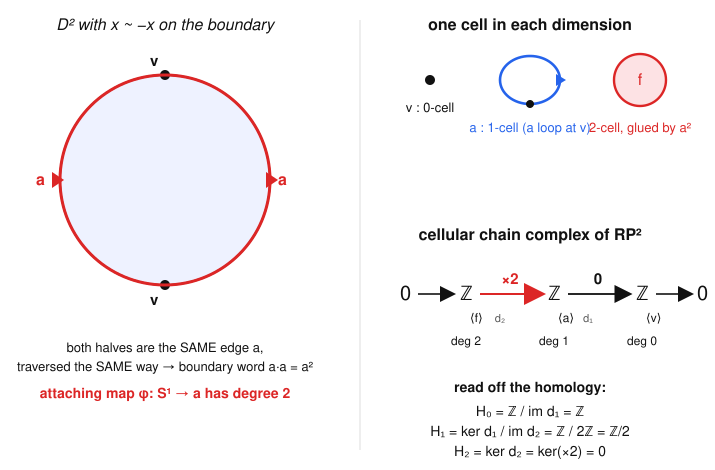
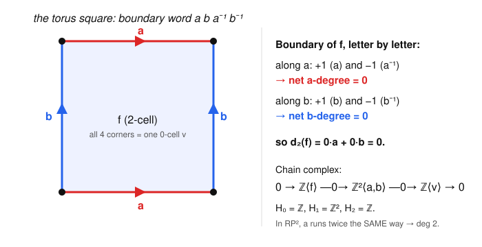

# Algebraic Topology · Lesson 3.4: CW complexes & cellular homology

> ⏱ ~15 min · Module 3: Homology · Builds on: [singular homology (3.3)](03-03-singular-homology.md), [van Kampen in the wild (2.6)](02-06-van-kampen-in-the-wild.md) · Unlocks: [the Eilenberg–Steenrod axioms (3.5)](03-05-eilenberg-steenrod-axioms.md)

## Why this matters

Singular homology (Lesson 3.3) is a triumph of principle and a disaster of practice: $C_n(X)$ is free on *every* continuous map $\Delta^n \to X$, an uncountable group, so you can never compute with it directly. This lesson delivers the payoff of all the machinery so far. If you can describe your space as a handful of cells glued together — and almost every space you care about can be — then homology collapses to a **finite** calculation whose only ingredient is the degree of a map between spheres. Spheres, projective spaces, surfaces, Lie groups, Grassmannians: their homology all falls out of this one procedure. It is the tool you will actually reach for.

## The idea

Build a space the way you'd build one out of paper: start with dots, glue on arcs, glue on filled disks, glue on solid balls — one dimension at a time. A space assembled this way is a **CW complex**. The dots are $0$-cells, the arcs $1$-cells, the disks $2$-cells, and so on; you attach an $n$-cell by specifying how to glue its boundary sphere $S^{n-1}$ onto the part you've already built.

Here is the magic. Once you have such a blueprint, you don't need singular chains at all. Make a chain group $C_n^{CW}$ that is simply **free abelian on the $n$-cells** — if the space has three $2$-cells, then $C_2^{CW}=\mathbb{Z}^3$, no matter how badly they're glued. The boundary map is where the gluing enters, and it enters as a single integer per pair of cells: *how many times, net, does the boundary of this $n$-cell wrap around that $(n-1)$-cell?* That "how many times, net" is exactly a **degree** — the winding-number idea from Lesson 1.4, one dimension up. Homology is then $\ker/\operatorname{im}$ of these finite matrices of integers.

The circle is the whole story in miniature: one dot $v$, one arc $a$ whose two ends both attach to $v$. The chain complex is $\mathbb{Z}\langle a\rangle \to \mathbb{Z}\langle v\rangle$, the boundary sends $a\mapsto v-v=0$, and you read off $H_0=H_1=\mathbb{Z}$ without touching a single singular simplex.

## The formal version

**Definition (CW complex).** A CW complex is a space built by the following inductive recipe.

1. Start with a discrete set $X^{(0)}$ of points, the **$0$-cells**. This is the **$0$-skeleton**.
2. Given the **$(n-1)$-skeleton** $X^{(n-1)}$, form $X^{(n)}$ by attaching a collection of **$n$-cells** $e^n_\alpha$: for each $\alpha$ choose an **attaching map**
$$\varphi_\alpha : S^{n-1} \to X^{(n-1)},$$
and set $X^{(n)} = \big(X^{(n-1)} \sqcup_\alpha D^n_\alpha\big)\big/\big(x \sim \varphi_\alpha(x)\ \text{for } x\in \partial D^n_\alpha\big)$.
3. Take $X=\bigcup_n X^{(n)}$ (with the weak topology if the process doesn't stop).

*In words:* glue in filled $n$-balls by pasting each ball's boundary sphere onto the lower-dimensional skeleton however you like. The map $\Phi_\alpha:D^n\to X$ extending $\varphi_\alpha$ is the **characteristic map**; it restricts to a homeomorphism of the open ball onto the open cell $e^n_\alpha$.

**Definition (cellular chain complex).** Let $C_n^{CW}(X)$ be the free abelian group on the $n$-cells of $X$. The **cellular boundary map** $d_n : C_n^{CW} \to C_{n-1}^{CW}$ is given on a generator by
$$d_n(e^n_\alpha) = \sum_\beta \deg(\Delta_{\alpha\beta})\, e^{n-1}_\beta,$$
where $\Delta_{\alpha\beta}$ is the composite of maps of $(n-1)$-spheres
$$S^{n-1} \xrightarrow{\ \varphi_\alpha\ } X^{(n-1)} \xrightarrow{\ q\ } X^{(n-1)}/X^{(n-2)} = \bigvee_\beta S^{n-1}_\beta \xrightarrow{\ q_\beta\ } S^{n-1}_\beta .$$

*In words:* to find the $e^{n-1}_\beta$-coefficient of $d_n(e^n_\alpha)$, attach the cell, then crush everything of dimension $\le n-2$ to a point and crush every $(n-1)$-cell except $\beta$ to a point. What's left is a self-map of the $(n-1)$-sphere; its degree — its net wrapping number — is the coefficient. The first map $q$ collapses the $(n-2)$-skeleton, turning each $(n-1)$-cell into its own sphere (a wedge of spheres); $q_\beta$ then keeps only the $\beta$ sphere.

**Theorem (cellular = singular).** For any CW complex $X$, $d_{n-1}\circ d_n=0$, and the resulting cellular homology agrees with singular homology from Lesson 3.3:
$$H_n^{CW}(X) \cong H_n(X)\quad\text{for all } n.$$

*In words:* the finite, hand-computable groups you get from the cell structure are literally the singular homology groups — same invariant, cheap presentation.

*Why it's true (sketch).* The engine is one computation: because $X^{(n)}/X^{(n-1)}$ is a wedge of $n$-spheres (one per $n$-cell), the good-pair result from 3.3 gives
$$H_k\big(X^{(n)},X^{(n-1)}\big) \cong \tilde H_k\Big(\bigvee_\alpha S^n_\alpha\Big) = \begin{cases}\text{free abelian on the } n\text{-cells}, & k=n,\\ 0,& k\ne n.\end{cases}$$
So the relative groups vanish except on the diagonal, and $C_n^{CW}:=H_n(X^{(n)},X^{(n-1)})$ recovers our free group on $n$-cells. Splicing the long exact sequences of the pairs $(X^{(n)},X^{(n-1)})$ together, the cellular boundary $d_n$ is the composite $H_n(X^{(n)},X^{(n-1)})\xrightarrow{\partial} H_{n-1}(X^{(n-1)}) \to H_{n-1}(X^{(n-1)},X^{(n-2)})$, and a diagram chase (Hatcher, §2.2) identifies $\ker d_n/\operatorname{im}\,d_{n+1}$ with $H_n(X)$. The degree formula for $d_n$ is then exactly what $\partial$ becomes under these identifications. $\blacksquare$

Two everyday special cases of the degree formula worth memorizing:

- **$d_1$ is heads-minus-tails.** A $1$-cell $e^1$ attached by $\varphi:S^0=\{-1,+1\}\to X^{(0)}$ has $d_1(e^1)=\varphi(+1)-\varphi(-1)$: the endpoint vertex minus the starting vertex. If both ends land on the same $0$-cell, $d_1(e^1)=0$.
- **$d_2$ reads off a word.** If a $2$-cell is attached along an edge-word like $a\,b\,a^{-1}$, the coefficient of an edge $e^1_\beta$ in $d_2$ is the *signed count* of $\beta$ in the word (each $\beta^{+1}$ contributes $+1$, each $\beta^{-1}$ contributes $-1$). Forward and backward traversals cancel; same-direction traversals add.

## Picture

The projective plane $\mathbb{RP}^2$ is the cleanest place to watch the degree $2$ appear, so here is its entire life: the disk with antipodal boundary identification on the left, the three cells and the resulting chain complex on the right.

The key move: $\mathbb{RP}^2=D^2/(x\sim -x)$. The boundary circle is cut by the two identified points into two arcs, and the antipodal identification maps the left arc *onto the right arc in the same rotational sense*. So as you traverse $\partial D^2$ once, you run over the single edge $a$ **twice, both times forward** — the attaching map $\varphi:S^1\to a\cong S^1$ has degree $2$. That is the entire content of $d_2(f)=2a$.

## Worked examples

**Example 1 (the spheres, $S^n$).** Give $S^n$ the miserly CW structure with exactly one $0$-cell $v$ and one $n$-cell $e^n$ (attach the boundary $S^{n-1}$ of a single $n$-ball to the point $v$; the ball's interior becomes the sphere minus a point). For $n\ge 2$ there are no cells in dimensions $1,\dots,n-1$, so the chain complex is
$$\cdots \to 0 \to \underset{\deg n}{\mathbb{Z}} \to 0 \to \cdots \to 0 \to \underset{\deg 0}{\mathbb{Z}} \to 0 .$$
Every boundary map is zero because its source or target is $0$. Hence
$$H_k(S^n)=\begin{cases}\mathbb{Z}, & k=0 \text{ or } k=n,\\ 0,&\text{otherwise.}\end{cases}$$
For $n=1$ the complex is $\mathbb{Z}\langle a\rangle \xrightarrow{d_1} \mathbb{Z}\langle v\rangle$ with $d_1(a)=v-v=0$, giving $H_0=H_1=\mathbb{Z}$ — same answer. No triangulation, no infinite groups; the sphere's homology is a two-line computation.

**Example 2 ($\mathbb{RP}^2$, where torsion is born).** Cells: $v$ (dim $0$), $a$ (dim $1$, a loop at $v$), $f$ (dim $2$, attached by $a^2$ as in the Picture). The chain complex is
$$0 \to \mathbb{Z}\langle f\rangle \xrightarrow{\;d_2\;} \mathbb{Z}\langle a\rangle \xrightarrow{\;d_1\;} \mathbb{Z}\langle v\rangle \to 0 .$$
Compute the two boundary maps from the formulas above:

- $d_1(a)=v-v=0$ (both ends of the loop $a$ hit $v$).
- $d_2(f)=\deg(a^2)\,a = 2a$ (the boundary wraps $a$ twice, same direction).

So the complex is $0\to\mathbb{Z}\xrightarrow{\,\times 2\,}\mathbb{Z}\xrightarrow{\,0\,}\mathbb{Z}\to 0$, and
$$H_0=\mathbb{Z}/\operatorname{im}d_1=\mathbb{Z},\qquad H_1=\ker d_1/\operatorname{im}d_2=\mathbb{Z}/2\mathbb{Z},\qquad H_2=\ker d_2=\ker(\times 2)=0 .$$
That $\mathbb{Z}/2$ in $H_1$ is genuine **torsion** — homology's first sighting of a hole you can't detect by counting, only by the fact that going around $a$ *twice* bounds while going around once does not. It is invisible to $\pi_1(\mathbb{RP}^2)=\mathbb{Z}/2$ only in the sense that $H_1$ is precisely its abelianization (here already abelian); the two answers agree by design (see Connections).

**The torus $T^2$, for contrast.** One $0$-cell $v$, two $1$-cells $a,b$, one $2$-cell $f$ attached along the commutator word $aba^{-1}b^{-1}$ (Lesson 2.6).

Then $d_1(a)=d_1(b)=0$, and the degree formula reads the word: $a$ appears as $a^{+1}$ and $a^{-1}$ (net $0$), likewise $b$ (net $0$), so $d_2(f)=0\cdot a+0\cdot b=0$. The whole complex has zero differentials:
$$0\to\mathbb{Z}\xrightarrow{0}\mathbb{Z}^2\xrightarrow{0}\mathbb{Z}\to 0 \ \Rightarrow\ H_0=\mathbb{Z},\ H_1=\mathbb{Z}^2,\ H_2=\mathbb{Z}.$$
Same three cells as $\mathbb{RP}^2$ in dimensions $0$ and $2$, wildly different homology — and the *only* difference is that the torus's word cancels while $\mathbb{RP}^2$'s doubles.

## Watch out

- **You might think $C_n^{CW}$ depends on how the cells are glued — it doesn't.** The chain *group* is free on the $n$-cells, full stop; gluing lives entirely in the boundary maps $d_n$. Two spaces with the same cell counts but different attaching maps (torus vs. Klein bottle vs. $S^2\vee S^1\vee S^1$) share the same chain groups and are told apart only by their degrees.
- **You might think the degree formula wants the attaching map $\varphi_\alpha$ itself — it wants the composite after collapsing.** $\varphi_\alpha$ lands in the whole $(n-1)$-skeleton; you must post-compose with "crush $X^{(n-2)}$, then crush all other $(n-1)$-cells" to get an honest self-map of a sphere before taking a degree. Skipping the collapse is the most common error.
- **You might think orientation-reversing traversals still count toward the total — they cancel.** A degree is *signed*. In $aba^{-1}b^{-1}$ the two appearances of $a$ have opposite signs and sum to $0$; in $a^2$ (i.e. $\mathbb{RP}^2$) the two appearances have the same sign and sum to $2$. Same-direction adds, opposite-direction cancels — this single sign rule is what separates the torus from the projective plane.

## One-liner

> A cell structure turns homology into bookkeeping: free groups on the cells, and a boundary map whose entries are just the degrees with which each cell's rim wraps the cells below.

## Problems

**P1 (🟢)** Give the wedge $S^2\vee S^4$ the CW structure with one $0$-cell, one $2$-cell, and one $4$-cell (both spheres share the point, each attached by a constant map). Write down the cellular chain complex and compute $H_k(S^2\vee S^4)$ for all $k$. (This space returns in Lesson 4.4 as a foil for $\mathbb{CP}^2$.)

**P2 (🟡)** The Klein bottle $K$ has a CW structure with one $0$-cell $v$, two $1$-cells $a,b$, and one $2$-cell $f$ attached along the word $abab^{-1}$. Compute $d_1$ and $d_2$ from the degree/word rules, write the chain complex, and compute $H_0(K),H_1(K),H_2(K)$. Compare $H_1(K)$ with $H_1(T^2)=\mathbb{Z}^2$ and say in one sentence what the difference detects.

**P3 (🔴, optional)** Real projective $3$-space $\mathbb{RP}^3$ has one cell in each dimension $0,1,2,3$, and its cellular boundary maps are
$$d_1=0,\quad d_2=\times 2,\quad d_3=0,$$
i.e. $d_k=1+(-1)^k$ on the single generator (the degree of a certain antipodal-type map). Compute $H_k(\mathbb{RP}^3)$ for $k=0,1,2,3$, and explain in one or two sentences — using the same "same-direction vs. cancel" reasoning as $\mathbb{RP}^2$ and the torus — why $d_2$ doubles but $d_3$ vanishes.

Solutions

**P1** Cells sit in dimensions $0,2,4$ only, so $C_0=C_2=C_4=\mathbb{Z}$ and all other $C_k=0$. Every boundary map has a zero group as its source or target (there are no cells in dimensions $1$ or $3$ to map to or from), so all $d_k=0$:
$$\cdots\to 0\to \underset{4}{\mathbb{Z}}\to 0\to \underset{2}{\mathbb{Z}}\to 0\to \underset{0}{\mathbb{Z}}\to 0.$$
Hence $H_k(S^2\vee S^4)=\mathbb{Z}$ for $k=0,2,4$ and $0$ otherwise. (Consistent with $\tilde H_k(X\vee Y)=\tilde H_k(X)\oplus\tilde H_k(Y)$ from 3.3.)

**P2** The two $1$-cells are loops at the single vertex, so $d_1(a)=d_1(b)=0$. For $d_2(f)$ read the word $abab^{-1}$ letter by letter:
- coefficient of $a$: appearances $a^{+1}$ (first) and $a^{+1}$ (third) → $1+1=2$;
- coefficient of $b$: appearances $b^{+1}$ (second) and $b^{-1}$ (fourth) → $1-1=0$.

So $d_2(f)=2a+0\cdot b=2a$. The chain complex is
$$0\to \mathbb{Z}\langle f\rangle \xrightarrow{\,d_2\,} \mathbb{Z}^2\langle a,b\rangle \xrightarrow{\,0\,} \mathbb{Z}\langle v\rangle\to 0,\qquad d_2=\begin{pmatrix}2\\0\end{pmatrix}.$$
Compute:
- $H_0=\mathbb{Z}/\operatorname{im}d_1=\mathbb{Z}$.
- $H_1=\ker d_1/\operatorname{im}d_2=\mathbb{Z}^2/\langle(2,0)\rangle$. Change basis to $(a,b)$: quotienting the first factor by $2$ leaves $\mathbb{Z}/2\oplus\mathbb{Z}=\mathbb{Z}\oplus\mathbb{Z}/2$.
- $H_2=\ker d_2$. Since $d_2(f)=2a\ne 0$, the map is injective, so $H_2=0$.

Thus $H_0(K)=\mathbb{Z}$, $H_1(K)=\mathbb{Z}\oplus\mathbb{Z}/2$, $H_2(K)=0$. Versus the torus's $H_1=\mathbb{Z}^2$: the Klein bottle's extra $\mathbb{Z}/2$ (and its vanishing $H_2$) detects **non-orientability** — the $a$-edge is traversed twice the same way, so the surface has no fundamental class in $H_2$.

**P3** With one generator in each dimension the complex is
$$0\to \underset{3}{\mathbb{Z}} \xrightarrow{\,d_3=0\,} \underset{2}{\mathbb{Z}} \xrightarrow{\,d_2=\times 2\,} \underset{1}{\mathbb{Z}} \xrightarrow{\,d_1=0\,} \underset{0}{\mathbb{Z}}\to 0.$$
Turn the crank:
- $H_0=\mathbb{Z}/\operatorname{im}d_1=\mathbb{Z}$.
- $H_1=\ker d_1/\operatorname{im}d_2=\mathbb{Z}/2\mathbb{Z}=\mathbb{Z}/2$.
- $H_2=\ker d_2/\operatorname{im}d_3=\ker(\times2)/0=0$.
- $H_3=\ker d_3/\operatorname{im}d_4=\mathbb{Z}/0=\mathbb{Z}$.

So $H_*(\mathbb{RP}^3)=(\mathbb{Z},\ \mathbb{Z}/2,\ 0,\ \mathbb{Z})$. The reason for the alternation: $\mathbb{RP}^n$ is built with the $k$-cell attached so that its boundary sphere double-covers the $(k-1)$-cell via the antipodal map on $S^{k-1}$, whose degree is $(-1)^k$. Collapsing, the composite covers the lower cell once by the "identity half" and once by the "antipodal half," giving degree $1+(-1)^k$. When $k$ is even the two halves run the *same* direction and add to $2$ (like $\mathbb{RP}^2$'s $a^2$); when $k$ is odd the antipodal half reverses orientation and they *cancel* to $0$ (like the torus's $aba^{-1}b^{-1}$). Here $d_2$ ($k=2$, even) $=2$ and $d_3$ ($k=3$, odd) $=0$. $\blacksquare$

## Flashback

**From Lesson 3.3 (homotopy invariance):** The **Möbius band** $M$ deformation retracts onto its core circle. Using only homotopy invariance of singular homology, compute $H_k(M)$ for all $k$. (No cell structure needed — this is a one-line consequence of a fact from 3.3.)

Solution

Homotopy invariance says $f\simeq g \Rightarrow f_*=g_*$ on homology, and in particular a homotopy equivalence induces isomorphisms on all $H_k$. A deformation retraction is a homotopy equivalence, so the inclusion of the core circle $S^1\hookrightarrow M$ induces isomorphisms $H_k(M)\cong H_k(S^1)$ for every $k$. From Example 1 (or 3.3),
$$H_k(M)=H_k(S^1)=\begin{cases}\mathbb{Z}, & k=0,1,\\ 0,&\text{otherwise.}\end{cases}$$
Moral: homology cannot distinguish the Möbius band from the cylinder or the plain circle — they are all homotopy equivalent to $S^1$. The band's non-orientable *twist* is a feature of the embedding, not of its homotopy type, so a homotopy invariant is blind to it. (To see the twist you must fatten the picture — e.g. it surfaces as torsion once you close the band into a Klein bottle, as in P2.)

## Connections

- **Backward:** this makes Lesson 3.3 usable. Singular homology gave the *right* invariant but an uncomputable presentation; the cellular chain complex is a tiny, isomorphic model of it, and the isomorphism theorem rests squarely on the good-pair and wedge computations from 3.3. The attaching-map data is exactly the CW/surface bookkeeping you set up in [Lesson 2.6](02-06-van-kampen-in-the-wild.md).
- **Forward:** Lesson 3.5 abstracts away the construction entirely — the [Eilenberg–Steenrod axioms](03-05-eilenberg-steenrod-axioms.md) pin down homology up to isomorphism, and cellular homology is the concrete model those axioms describe. The degree functions computed here reappear as *the* central invariant in [Lesson 4.3](04-03-degree-applications.md) (degree of a self-map of $S^n$), and $S^2\vee S^4$ from P1 is the space [Lesson 4.4](04-04-cohomology-cup-products.md) uses to show homology alone cannot separate it from $\mathbb{CP}^2$.
- **Sideways ([abstract-algebra](../../abstract-algebra/syllabus.md)):** the Hurewicz theorem makes the $\mathbb{RP}^2$ torsion reconcile perfectly with van Kampen: $H_1(X)$ is the **abelianization** of $\pi_1(X)$. Since $\pi_1(\mathbb{RP}^2)=\mathbb{Z}/2$ is already abelian, $H_1(\mathbb{RP}^2)=\mathbb{Z}/2$ — the very group we got by turning the crank on $0\to\mathbb{Z}\xrightarrow{2}\mathbb{Z}\xrightarrow{0}\mathbb{Z}\to0$. The "$\times 2$" boundary map and the relation $a^2=1$ in the group presentation are the same fact wearing two hats.
- **Sideways ([complex-analysis](../../complex-analysis/syllabus.md)):** the degree in the boundary formula is the winding number from [Lesson 1.4](01-04-pi1-of-the-circle.md) promoted to all dimensions — for maps $S^1\to S^1$ it is literally the winding number computed by the argument principle.
