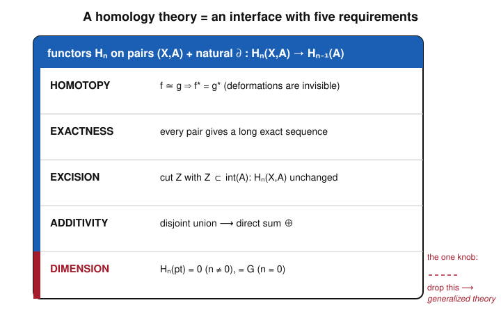

# Algebraic Topology · Lesson 3.5: The Eilenberg–Steenrod axioms

> ⏱ ~15 min · Module 3: Homology · Builds on: [cellular homology 3.4](03-04-cw-cellular-homology.md), [singular homology 3.3](03-03-singular-homology.md), [simplicial homology 3.2](03-02-simplicial-homology.md) · Unlocks: [the long exact sequence of a pair 4.1](04-01-les-of-a-pair.md)

## Why this matters

We have now built homology *three times* — simplicial from a $\Delta$-complex, singular from all continuous simplices, cellular from a CW structure — and every single time we re-proved the same facts (homotopy invariance, a long exact sequence) and got the same groups ($H_n(S^n)=\mathbb{Z}$, and so on). That repetition is a clue. Eilenberg and Steenrod's insight (1945) was to stop asking *what homology is* and instead pin down *what homology does*: a short list of properties that any such gadget must satisfy. The payoff is enormous. First, a **uniqueness theorem** says the axioms determine the answer completely on nice spaces — so simplicial, singular, and cellular homology are provably the *same functor*, and you may always compute with whichever is cheapest. Second, the moment you loosen one axiom you unlock the vast modern theories — K-theory, cobordism — that power index theorems and much of geometric topology.

## The idea

Compare it to the real numbers. You can *build* $\mathbb{R}$ from Dedekind cuts, or from Cauchy sequences of rationals — different constructions, visibly different sets. But nobody cares which one you used, because both satisfy the same axioms ("complete ordered field") and those axioms have, up to isomorphism, exactly one model. The construction was scaffolding; the axioms are the building.

Homology is the same story. Think of "a homology theory" as an **interface** — a contract listing the methods a candidate must implement and the laws they must obey. Any construction that implements the interface *is* homology; its internal guts (chains? cells? something exotic?) are none of your business. Four of the five requirements are structural rules about how the groups relate across maps, subspaces, and unions. The fifth — the *dimension axiom* — is a single normalization knob that says what a point weighs. Turn that one knob and everything downstream is forced.

## The formal version

Fix an abelian group $G$, the **coefficient group** (for ordinary homology, $G=\mathbb{Z}$). We work with **pairs** $(X,A)$, meaning $A\subseteq X$; a *map of pairs* $f\colon (X,A)\to (Y,B)$ is a continuous $f\colon X\to Y$ with $f(A)\subseteq B$. Write $X$ for the pair $(X,\varnothing)$, so absolute homology $H_n(X):=H_n(X,\varnothing)$.

**Definition (homology theory).** A *homology theory* is a sequence of functors $H_n$ (one for each $n\in\mathbb{Z}$) from pairs of spaces and maps of pairs to abelian groups, together with natural **connecting homomorphisms**
$$\partial_n\colon H_n(X,A)\to H_{n-1}(A),$$
satisfying the five axioms below. "Functor" packs in the usual bookkeeping: $(\operatorname{id})_*=\operatorname{id}$ and $(g\circ f)_*=g_*\circ f_*$.

**1. Homotopy.** If $f\simeq g$ as maps of pairs, then $f_*=g_*\colon H_n(X,A)\to H_n(Y,B)$ for all $n$.
*In words:* maps you can deform into each other induce the exact same map on homology — homology cannot see a deformation.

**2. Exactness.** For every pair $(X,A)$ with inclusions $i\colon A\hookrightarrow X$ and $j\colon (X,\varnothing)\hookrightarrow (X,A)$, the sequence
$$\cdots \to H_n(A)\xrightarrow{\;i_*\;} H_n(X)\xrightarrow{\;j_*\;} H_n(X,A)\xrightarrow{\;\partial\;} H_{n-1}(A)\xrightarrow{\;i_*\;}\cdots$$
is exact (image = kernel at every spot), and $\partial$ is natural in $(X,A)$.
*In words:* a subspace, the whole space, and the "space rel subspace" fit into one infinite chain where each map's image is exactly the next map's kernel — no information leaks. This is the star of [Lesson 4.1](04-01-les-of-a-pair.md).

**3. Excision.** If $Z\subseteq A$ with $\overline{Z}\subseteq \operatorname{int}(A)$, then the inclusion $(X\setminus Z,\,A\setminus Z)\hookrightarrow (X,A)$ induces isomorphisms
$$H_n(X\setminus Z,\,A\setminus Z)\;\xrightarrow{\ \cong\ }\;H_n(X,A)\qquad\text{for all }n.$$
*In words:* you may delete a chunk $Z$ buried strictly inside $A$ without changing the *relative* homology — relative homology only feels what happens near the "frontier" of $A$, not deep inside it.

**4. Additivity.** If $X=\coprod_{\alpha} X_\alpha$ is a disjoint union, the inclusions induce an isomorphism
$$\bigoplus_{\alpha} H_n(X_\alpha)\;\xrightarrow{\ \cong\ }\;H_n(X).$$
*In words:* separate pieces contribute independently — homology of a disjoint union is the direct sum of the pieces. (For finitely many pieces this already follows from the others; the axiom's teeth are for infinite disjoint unions.)

**5. Dimension.** For a one-point space,
$$H_n(\mathrm{pt})=\begin{cases} G, & n=0,\\ 0, & n\neq 0.\end{cases}$$
*In words:* a single point has one $0$-dimensional hole's worth of homology (the coefficient group) and nothing in any other degree. This is the normalization; it fixes the "scale."

**Uniqueness theorem (Eilenberg–Steenrod).** On the category of **CW pairs**, any two homology theories with the same coefficient group $G$ are naturally isomorphic — and the isomorphism can be chosen to be the identity on $H_0(\mathrm{pt})=G$.
*In words:* once you fix what a point weighs, the axioms admit exactly one answer on CW spaces. Simplicial, singular, and cellular homology all satisfy the axioms with $G=\mathbb{Z}$, so **they are literally the same theory** — which is why they always agreed. Why it holds, in one breath: the dimension axiom seeds the point; homotopy + additivity spread it to discs and wedges of spheres; exactness + excision propagate it up a CW skeleton one cell at a time — leaving no freedom.

**Generalized homology.** Drop *only* the dimension axiom and you get a **generalized (extraordinary) homology theory**. Now a point may carry homology in many degrees. Complex K-theory has $K_n(\mathrm{pt})=\mathbb{Z}$ for all even $n$ and $0$ for odd $n$; various cobordism theories assign a point their ring of cobordism classes. Everything else — homotopy, exactness, excision, additivity — still holds, so the whole computational machine (long exact sequences, Mayer–Vietoris) keeps running.

## Picture

The four black requirements are the load-bearing structure every theory shares; the red dimension axiom is the one detachable knob. Keep it set to "$G$ at a point, $0$ elsewhere" and you get ordinary homology; unscrew it and you drop into K-theory and its cousins.

## Concrete instance

**Homology of a contractible space — from the axioms alone, no chains.**

Let $X$ be contractible, i.e. homotopy equivalent to a point: there are maps $c\colon X\to \mathrm{pt}$ and $e\colon \mathrm{pt}\to X$ with $e\circ c\simeq \operatorname{id}_X$ and $c\circ e = \operatorname{id}_{\mathrm{pt}}$. Apply the functor $H_n$ and use the **homotopy axiom** on the homotopy $e\circ c\simeq\operatorname{id}_X$:
$$e_*\circ c_* = (e\circ c)_* = (\operatorname{id}_X)_* = \operatorname{id}_{H_n(X)},\qquad c_*\circ e_* = (\operatorname{id}_{\mathrm{pt}})_* = \operatorname{id}_{H_n(\mathrm{pt})}.$$
So $c_*\colon H_n(X)\to H_n(\mathrm{pt})$ is an isomorphism with inverse $e_*$. Now feed in the **dimension axiom**:
$$H_n(X)\cong H_n(\mathrm{pt})=\begin{cases}\mathbb{Z}, & n=0,\\ 0, & n\neq 0.\end{cases}$$
That is the *entire* homology of every disc $D^k$, of $\mathbb{R}^n$, of any convex set, of any star-shaped region — obtained with two axioms and zero boundary-operator arithmetic. (Notice we only ever used homotopy + dimension. This is the tiny base case the uniqueness theorem's induction is built on.)

**A small consequence via additivity.** Let $X=\{p,q\}$ be two points (discrete). By the **additivity axiom** applied to $X=\{p\}\sqcup\{q\}$,
$$H_n(X)\cong H_n(\mathrm{pt})\oplus H_n(\mathrm{pt})=\begin{cases}\mathbb{Z}\oplus\mathbb{Z}=\mathbb{Z}^2, & n=0,\\ 0, & n\neq 0.\end{cases}$$
The rank of $H_0$ counts path components — here, two — a fact we could once only get by staring at cycles, now read straight off the axiom.

## Worked examples

**Example 1 (mechanical — homology cannot tell a disc from a point).** Claim: the inclusion $\iota\colon\{0\}\hookrightarrow D^2$ induces an isomorphism $\iota_*\colon H_n(\{0\})\to H_n(D^2)$ for every $n$. *Why:* $D^2$ deformation-retracts to its center via $r\colon D^2\to\{0\}$ with $\iota\circ r\simeq\operatorname{id}_{D^2}$ and $r\circ\iota=\operatorname{id}_{\{0\}}$. The homotopy axiom turns these homotopies into equalities of induced maps exactly as in the Concrete instance, so $\iota_*$ is an isomorphism. No construction of homology was named — the argument is valid in *any* homology theory, ordinary or generalized.

**Example 2 (why you'd care — recognizing a theory you never constructed).** Suppose a colleague hands you a black box $E_*$ and *proves* it satisfies all five Eilenberg–Steenrod axioms with coefficient group $\mathbb{Z}$. They refuse to tell you how it is built. What is $E_5(\mathbb{RP}^2)$? You do not need the guts: by the uniqueness theorem $E_*$ agrees with ordinary singular homology on the CW space $\mathbb{RP}^2$, and $H_5(\mathbb{RP}^2)=0$ (only degrees $0,1,2$ are nonzero — see [Lesson 3.4](03-04-cw-cellular-homology.md)). So $E_5(\mathbb{RP}^2)=0$, guaranteed. This is the everyday power of the axioms: *identify* a theory by its contract, then reuse every computation you already did.

## Watch out

- **You might think** the homotopy axiom is a statement about spaces, **but** it is stated for *maps*: homotopic maps induce equal homomorphisms. Homotopy-*equivalence* invariance of spaces (contractible ⇒ point's homology) is a *corollary*, gotten by feeding the two homotopies of an equivalence through the axiom — as in the Concrete instance. Don't assume the space-level statement; derive it.
- **You might think** excision lets you delete anything sitting inside $A$, **but** the hypothesis $\overline{Z}\subseteq\operatorname{int}(A)$ is strict: $Z$'s *closure* must miss the frontier of $A$ entirely. Excise something that touches $\partial A$ and the isomorphism fails. (This is precisely the technical care that makes the singular proof of excision hard — and is why axiomatizing it is such a relief.)
- **You might think** dropping the dimension axiom breaks homology, **but** it only removes the normalization. A generalized theory keeps homotopy, exactness, excision, additivity — hence keeps long exact sequences and Mayer–Vietoris. What you lose is uniqueness: many inequivalent theories now coexist (K-theory, cobordism, ordinary homology are all distinct), each fixed by its own value on a point.

## One-liner

> Don't ask what homology *is*, ask what it *does* — five axioms, and on CW spaces there is exactly one answer per coefficient group.

## Problems

**P1 (🟢)** Using *only* the homotopy and dimension axioms, compute $H_n(\mathbb{R}^m)$ for all $n$ and all $m\ge 0$. Then, using additivity as well, compute $H_n$ of the disjoint union of three closed discs $D^2\sqcup D^2\sqcup D^2$.

**P2 (🟡)** Let $E_*$ be a *generalized* homology theory (all axioms except dimension) whose value on a point is complex K-theory's: $E_n(\mathrm{pt})=\mathbb{Z}$ for $n$ even and $0$ for $n$ odd. Compute $E_n$ of a space $X$ that is a disjoint union of two contractible pieces, for every $n$. Which axioms did you use, and which did you *not* need?

**P3 (🔴, optional)** Using only the exactness axiom (and functoriality), prove that $H_n(X,X)=0$ for every space $X$ and every $n$. *Hint:* apply exactness to the pair $(X,X)$ and identify the map $i_*\colon H_n(X)\to H_n(X)$ induced by the inclusion $A=X\hookrightarrow X$.

Solutions

**P1** $\mathbb{R}^m$ is contractible (the straight-line homotopy $H(x,t)=(1-t)x$ retracts it to the origin), so by the argument in the Concrete instance — homotopy axiom gives $H_n(\mathbb{R}^m)\cong H_n(\mathrm{pt})$, dimension axiom evaluates it —
$$H_n(\mathbb{R}^m)=\begin{cases}\mathbb{Z}, & n=0,\\ 0, & n\neq 0,\end{cases}$$
for every $m\ge 0$ (including $m=0$, a point). Each disc $D^2$ is likewise contractible, so $H_n(D^2)$ is the same. By additivity applied to the three disjoint discs,
$$H_n\!\left(D^2\sqcup D^2\sqcup D^2\right)\cong H_n(D^2)^{\oplus 3}=\begin{cases}\mathbb{Z}^3, & n=0,\\ 0, & n\neq 0.\end{cases}$$
The rank $3$ of $H_0$ is exactly the number of path components. $\blacksquare$

**P2** A contractible piece $C$ satisfies $E_n(C)\cong E_n(\mathrm{pt})$ by the *homotopy* axiom alone (the contractibility argument never touched dimension — it only used $e_*c_*=\operatorname{id}$, $c_*e_*=\operatorname{id}$). So $E_n(C)=\mathbb{Z}$ for $n$ even, $0$ for $n$ odd. By *additivity* on $X=C_1\sqcup C_2$,
$$E_n(X)\cong E_n(C_1)\oplus E_n(C_2)=\begin{cases}\mathbb{Z}\oplus\mathbb{Z}=\mathbb{Z}^2, & n\text{ even},\\ 0, & n\text{ odd}.\end{cases}$$
Used: **homotopy** and **additivity** (plus functoriality). *Not* used: exactness, excision, and — crucially — the **dimension** axiom, which is why the nonzero groups appear in *every* even degree, not just degree $0$. The computation is structurally identical to P1; only the point's value changed. $\blacksquare$

**P3** Take the pair $(X,A)$ with $A=X$. The inclusion $i\colon A=X\hookrightarrow X$ is the identity map of $X$, so by functoriality $i_*=\operatorname{id}_{H_n(X)}$ for all $n$ — in particular $i_*$ is an isomorphism. The exactness axiom gives the long exact sequence
$$\cdots \to H_n(X)\xrightarrow{\,i_*=\operatorname{id}\,} H_n(X)\xrightarrow{\;j_*\;} H_n(X,X)\xrightarrow{\;\partial\;} H_{n-1}(X)\xrightarrow{\,i_*=\operatorname{id}\,} H_{n-1}(X)\to\cdots$$
Now chase it. Since $i_*$ (the left arrow into $H_n(X,X)$'s predecessor) is *surjective*, exactness at the middle $H_n(X)$ gives $\ker j_* = \operatorname{im} i_* = H_n(X)$, so $j_*=0$. Exactness at $H_n(X,X)$ says $\operatorname{im} j_* = \ker\partial$; as $j_*=0$, we get $\ker\partial=0$, i.e. $\partial$ is *injective*. Exactness at $H_{n-1}(X)$ says $\operatorname{im}\partial=\ker(i_*)=\ker(\operatorname{id})=0$, i.e. $\partial$ is the *zero* map. An injective map that is also zero has trivial domain: $H_n(X,X)=0$. Since $n$ was arbitrary, $H_n(X,X)=0$ for all $n$. $\blacksquare$

*(Sanity: this matches intuition — "$X$ relative to all of $X$" has nothing left to measure. And it is your first taste of the diagram-chasing that runs [Lesson 4.1](04-01-les-of-a-pair.md).)*

## Flashback

**From [Lesson 3.4](03-04-cw-cellular-homology.md) (CW & cellular homology):** Let $X$ be the space obtained from the circle $S^1$ by attaching a single $2$-cell along a map $S^1\to S^1$ of **degree $3$** (a Moore space). Give $X$ its evident CW structure, write down the cellular chain complex, and compute $H_0(X)$, $H_1(X)$, $H_2(X)$.

Solution

The CW structure has one cell in each dimension $0,1,2$: a vertex $v$, an edge $a$ whose two ends attach to $v$ (making $S^1$, the $1$-skeleton), and one $2$-cell $f$ attached along the degree-$3$ map. The cellular chain groups are therefore
$$C_2=\mathbb{Z}\langle f\rangle,\qquad C_1=\mathbb{Z}\langle a\rangle,\qquad C_0=\mathbb{Z}\langle v\rangle,$$
and $C_n=0$ otherwise. The two boundary maps:

- $\partial_1=0$: the edge $a$ is a loop, so its two endpoints are the same vertex $v$, giving $\partial_1 a = v-v=0$.
- $\partial_2=\times 3$: the cellular boundary of the $2$-cell is (degree of its attaching map onto the $1$-cell) times that cell; the attaching map has degree $3$, so $\partial_2 f = 3a$.

The complex is
$$0\to \mathbb{Z}\xrightarrow{\ \times 3\ }\mathbb{Z}\xrightarrow{\ 0\ }\mathbb{Z}\to 0 \qquad (C_2\to C_1\to C_0).$$
Compute:
- $H_2=\ker\partial_2=\ker(\times 3)=0$ (multiplication by $3$ on $\mathbb{Z}$ is injective).
- $H_1=\ker\partial_1/\operatorname{im}\partial_2=\mathbb{Z}/3\mathbb{Z}=\mathbb{Z}/3$, since $\ker\partial_1=C_1=\mathbb{Z}$ and $\operatorname{im}\partial_2=3\mathbb{Z}$.
- $H_0=C_0/\operatorname{im}\partial_1=\mathbb{Z}/0=\mathbb{Z}$ (one path component).

So $H_0=\mathbb{Z}$, $H_1=\mathbb{Z}/3$, $H_2=0$. The degree of the attaching map became the boundary coefficient and produced exactly the torsion $\mathbb{Z}/3$ — the general Moore space $M(\mathbb{Z}/m,1)$, of which $\mathbb{RP}^2$ is the $m=2$ case. $\blacksquare$

## Connections

- **Backward:** this lesson *unifies* [simplicial 3.2](03-02-simplicial-homology.md), [singular 3.3](03-03-singular-homology.md), and [cellular 3.4](03-04-cw-cellular-homology.md) homology. Each was shown along the way to satisfy the axioms with $G=\mathbb{Z}$; the uniqueness theorem now proves they are one and the same functor on CW spaces — retroactively explaining why they never disagreed.
- **Forward:** the exactness axiom *is* the long exact sequence of a pair, taken here as a given. [Lesson 4.1](04-01-les-of-a-pair.md) derives it honestly for singular homology and teaches the connecting map $\partial$ and diagram-chasing (P3 is a first rehearsal); [Mayer–Vietoris 4.2](04-02-mayer-vietoris.md) is likewise a formal consequence of the axioms, chiefly excision.
- **Sideways (abstract algebra):** defining an object by the contract it satisfies rather than by a construction is the same move as the *universal property* of the free group in [free groups & presentations 2.4](02-04-free-groups-presentations.md) — you specify behavior, then prove there's essentially one thing behaving that way. The uniqueness theorem is homology's universal-property analogue.
- **Sideways (the frontier):** dropping the dimension axiom opens K-theory and cobordism — generalized homology theories whose "coefficients on a point" are a whole graded group. K-theory is built from vector bundles, tying this axiomatic viewpoint to [differential-geometry](../../differential-geometry/syllabus.md); it is where this course stops and the modern subject begins.
