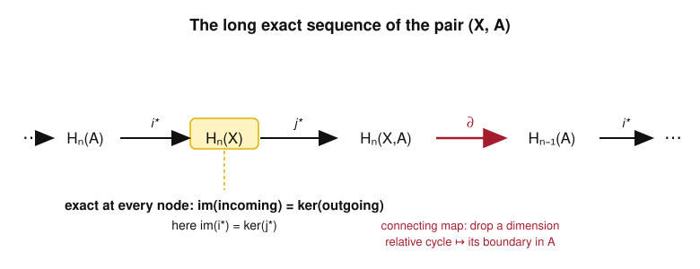

# Algebraic Topology · Lesson 4.1: The long exact sequence of a pair

> ⏱ ~15 min · Module 4: Exact Sequences, Cohomology & Applications · Builds on: [the Eilenberg–Steenrod axioms (3.5)](03-05-eilenberg-steenrod-axioms.md), [CW & cellular homology (3.4)](03-04-cw-cellular-homology.md), [singular homology (3.3)](03-03-singular-homology.md) · Unlocks: [Mayer–Vietoris (4.2)](04-02-mayer-vietoris.md)

## Why this matters

Up to now every homology computation started from scratch: build a cell structure, write the chain complex, take $\ker/\operatorname{im}$. That works, but it doesn't *bootstrap* — knowing $H_*(S^1)$ never helped you get $H_*(S^2)$. Exactness changes the economy completely. It threads the homology of a subspace $A$, the whole space $X$, and the "space relative to the subspace" into one infinite chain in which **each map's image is exactly the next one's kernel**. When you know two of three neighboring terms, the third is squeezed to a single possibility. This is the lever that turns homology from a computation you *do* into a computation you *deduce* — and it is the same lever behind Mayer–Vietoris (Lesson 4.2), the degree theory of Lesson 4.3, and invariance of domain in Lesson 4.5. Lesson 3.5 handed you exactness as an *axiom*; here we build it honestly from chains and learn to drive it.

## The idea

Fix a subspace $A\subseteq X$. Relative homology $H_n(X,A)$ measures **the holes of $X$ that are not already filled inside $A$** — you count $n$-dimensional cycles in $X$, but you agree to ignore anything that lives entirely in $A$. Formally you take chains in $X$ and quotient out the chains in $A$: a $17$-simplex sitting inside $A$ is declared to be zero. What survives are the features of $X$ that stick out past $A$.

Now the punchline. Suppose you have a relative cycle: a chain $\alpha$ in $X$ that isn't a genuine cycle — its boundary $\partial\alpha$ is nonzero — but whose boundary has been *pushed entirely into $A$*. Think of a path across a disk whose two endpoints sit on the boundary circle, or the disk itself whose rim is the boundary circle. Relative to $A$, such an $\alpha$ *looks closed*, because the part that fails to close up is invisible (it's in $A$). But that leftover boundary $\partial\alpha$ is a perfectly real cycle one dimension down, living in $A$. **The connecting map $\partial$ is just "hand me that leftover boundary."** It converts an $n$-dimensional relative feature of $(X,A)$ into an honest $(n-1)$-dimensional cycle of $A$ — and that single move is what glues the three homologies into one long sequence.

## The formal version

**Relative chains and homology.** For $A\subseteq X$, the inclusion makes $C_n(A)$ a subgroup of $C_n(X)$ (a singular simplex in $A$ is one in $X$). Define the **relative chain group**
$$C_n(X,A) := C_n(X)/C_n(A).$$
The singular boundary $\partial$ sends $C_n(A)$ into $C_{n-1}(A)$, so it descends to a boundary $\partial: C_n(X,A)\to C_{n-1}(X,A)$ with $\partial^2=0$. The **relative homology** is $H_n(X,A) := \ker\partial/\operatorname{im}\partial$ of this quotient complex.

*In words:* do homology with chains of $X$, but treat every chain that lies in $A$ as zero. A **relative $n$-cycle** is a chain $\alpha\in C_n(X)$ with $\partial\alpha\in C_{n-1}(A)$ (closed *modulo $A$*); a **relative boundary** is $\alpha=\partial\beta+\gamma$ with $\gamma\in C_n(A)$.

**The short exact sequence of chain complexes.** By construction, for every $n$,
$$0\;\to\; C_n(A)\;\xrightarrow{\;i\;}\;C_n(X)\;\xrightarrow{\;j\;}\;C_n(X,A)\;\to\;0$$
is exact: $i$ is the inclusion (injective), $j$ is the quotient map (surjective), and $\ker j=\operatorname{im} i=C_n(A)$. These maps commute with $\partial$, so this is a short exact sequence *of chain complexes*.

*In words:* "chains of $A$" sit inside "chains of $X$," and the cokernel is exactly the relative chains — nothing more, nothing less.

**The connecting homomorphism.** Define $\partial_*: H_n(X,A)\to H_{n-1}(A)$ by
$$\partial_*[\alpha] := [\,\partial\alpha\,],$$
where $\alpha$ is a relative $n$-cycle representing the class. Since $\partial\alpha\in C_{n-1}(A)$ and $\partial(\partial\alpha)=0$, the chain $\partial\alpha$ is a genuine cycle *in $A$*, so its class in $H_{n-1}(A)$ makes sense.

*In words:* take a relative cycle, look at its boundary — which is guaranteed to live in $A$ — and return that boundary's homology class in $A$. (Well-definedness is exactly the snake-lemma chase sketched below.)

**The long exact sequence of the pair (X, A).** These fit into a single exact sequence, infinite in both directions:
$$\cdots \to H_n(A)\xrightarrow{\;i_*\;} H_n(X)\xrightarrow{\;j_*\;} H_n(X,A)\xrightarrow{\;\partial_*\;} H_{n-1}(A)\xrightarrow{\;i_*\;} H_{n-1}(X)\to\cdots$$

*In words:* inclusion pushes $A$'s homology into $X$'s; $j_*$ records what of $X$ is relative; $\partial_*$ drops a dimension by extracting boundaries into $A$; and at **every** node the image of the arrow in equals the kernel of the arrow out — no information is created or lost.

*Why it's true (sketch — the snake lemma).* A short exact sequence of chain complexes $0\to A_\bullet\to B_\bullet\to C_\bullet\to 0$ always yields such a long exact sequence. The only nonobvious map is $\partial_*$, defined by a **diagram chase**: given $[c]\in H_n(C)$, lift $c$ to some $b\in B_n$ (possible since $j$ is onto); then $\partial b$ maps to $\partial c=0$ in $C_{n-1}$, so by exactness $\partial b=i(a)$ for a unique $a\in A_{n-1}$; set $\partial_*[c]=[a]$. One checks $a$ is a cycle and that $[a]$ is independent of the lift $b$ and the representative $c$. Exactness at each of the three spots is another short chase. Applied to $0\to C_\bullet(A)\to C_\bullet(X)\to C_\bullet(X,A)\to 0$, the lift of a relative cycle $\alpha$ is $\alpha$ itself and $a=\partial\alpha$ — recovering $\partial_*[\alpha]=[\partial\alpha]$ exactly. $\blacksquare$

**Reduced homology and good pairs.** The sequence also holds in reduced homology $\tilde H_*$ (with $\tilde H_n(X,A)=H_n(X,A)$ unchanged), which is what you want when $A\ne\varnothing$. And there is a clean geometric reading of the relative group: if $(X,A)$ is a **good pair** ($A$ nonempty closed and a deformation retract of some neighborhood — true for all CW pairs), then collapsing $A$ to a point loses no relative information:
$$H_n(X,A)\;\cong\;\tilde H_n(X/A).$$

*In words:* for reasonable pairs, "$X$ rel $A$" is the same as "$X$ with $A$ crushed to a point," measured by reduced homology.

## Picture

The sequence itself, with exactness marked at a node, and the connecting map's job spelled out:

And the connecting map concretely — a relative cycle whose boundary is forced into $A$, in the two cleanest cases (an interval rel its endpoints, a disk rel its boundary circle):

![Two panels: an interval [0,1] with the 1-simplex sigma whose boundary [1]-[0] lands on the endpoints A = S^0; and a disk D^2 whose boundary circle is A = S^1, with the disk as a relative 2-cycle whose boundary is the circle](assets/04-01-fig2.svg)

In both panels $\alpha$ is *not* a cycle of $X$, but it becomes one *rel $A$* because the only thing stopping it from closing up lives in $A$ — and $\partial_*$ hands you exactly that boundary as a cycle of $A$.

## Worked examples

**Example 1 (the workhorse: $(D^n,S^{n-1})$ by squeezing).** We compute $H_k(D^n,S^{n-1})$ for all $k$, with $n\ge 1$, using nothing but exactness. The disk $D^n$ is contractible, so its reduced homology **vanishes in every degree**: $\tilde H_k(D^n)=0$ for all $k$. Feed this into the reduced long exact sequence of the pair, focusing on the stretch around degree $k$:
$$\underbrace{\tilde H_k(D^n)}_{=\,0}\;\to\; H_k(D^n,S^{n-1})\;\xrightarrow{\;\partial_*\;}\;\tilde H_{k-1}(S^{n-1})\;\to\;\underbrace{\tilde H_{k-1}(D^n)}_{=\,0}.$$
The term to the left of $\partial_*$ is $0$, so $\partial_*$ is **injective** (its kernel is the image of the incoming $0$ map). The term to the right is $0$, so $\partial_*$ is **surjective** (its image is the kernel of the outgoing map into $0$, which is everything). An injective and surjective map is an isomorphism:
$$\boxed{\,H_k(D^n,S^{n-1})\;\cong\;\tilde H_{k-1}(S^{n-1})\,}=\begin{cases}\mathbb{Z}, & k=n,\\ 0,&\text{otherwise.}\end{cases}$$
(The last equality is the known reduced homology of the sphere: $\tilde H_{k-1}(S^{n-1})=\mathbb{Z}$ exactly when $k-1=n-1$.) This is a "term squeezed between two zeros" — the most common way exactness pins a group down. It also matches the good-pair fact: $D^n/S^{n-1}\cong S^n$, so $H_k(D^n,S^{n-1})\cong\tilde H_k(S^n)=\tilde H_{k-1}(S^{n-1})$. Both roads give the same answer.

**Example 2 (an honest diagram chase of $\partial_*$).** Take the smallest instance, $X=D^1=[0,1]$ and $A=S^0=\{0,1\}$, and *watch* the connecting map produce a generator. Let $\sigma:\Delta^1\to[0,1]$ be the identity path, a single $1$-simplex from $0$ to $1$. Its boundary is
$$\partial\sigma=\sigma(1)-\sigma(0)=[1]-[0],$$
and *both* points lie in $A$, so $\partial\sigma\in C_0(S^0)$: the chain $\sigma$ is a **relative $1$-cycle**. It is not a boundary rel $A$ (there are no $2$-simplices to bound it, and it isn't a chain in $A$), so $[\sigma]$ is a nonzero class — in fact the generator of $H_1(D^1,S^0)\cong\mathbb{Z}$ (Example 1 with $n=1$). Now apply the connecting map by the definition $\partial_*[\alpha]=[\partial\alpha]$:
$$\partial_*[\sigma]=[\,\partial\sigma\,]=[\,[1]-[0]\,]\in\tilde H_0(S^0).$$
And $[1]-[0]$ is precisely the generator of $\tilde H_0(S^0)=\mathbb{Z}$ (reduced $H_0$ of two points measures "which component," and this difference is the nontrivial class). So $\partial_*$ carries a generator to a generator — it *is* the isomorphism $H_1(D^1,S^0)\xrightarrow{\cong}\tilde H_0(S^0)$ predicted by Example 1, and we produced it with an actual chain, no abstraction. This is the whole mechanism: **the relative cycle is a path across, its boundary is (endpoint − startpoint) sitting in $A$, and $\partial_*$ reads off that boundary.**

## Watch out

- **You might think a relative cycle is a cycle — it usually isn't.** $\alpha$ represents a class in $H_n(X,A)$ when $\partial\alpha\in C_{n-1}(A)$, *not* when $\partial\alpha=0$. The path $\sigma$ above has $\partial\sigma=[1]-[0]\ne 0$; it is closed only after you quotient out $A$. Conflating the two makes the connecting map look like the zero map.
- **You might think $\partial_*$ needs a choice and could be ill-defined — the chase guarantees it isn't.** Different representatives $\alpha$ and different lifts differ by a boundary plus a chain in $A$, and both wash out in $H_{n-1}(A)$. Naturality (the axiom's other half) is what will let you compare the sequences of two pairs later.
- **You might think exactness "at a spot" means the map there is zero — it means image = kernel.** A zero map is the special case $\operatorname{im}=0$ *or* $\ker=$ everything. The engine is the general statement: to conclude a map is injective you need the *incoming* image to be $0$; to conclude surjective you need the *outgoing* kernel to be everything. Track which side you're using (Example 1 uses both, once each).
- **You might think you can always collapse: $H_n(X,A)=\tilde H_n(X/A)$ for any $A$ — only for good pairs.** The isomorphism needs $A$ to be a neighborhood deformation retract; for pathological subspaces the quotient $X/A$ can have the wrong homology. CW pairs are always fine.

## One-liner

> A subspace, the whole space, and the space-rel-subspace lock into one exact chain, and the connecting map $\partial$ — "take a relative cycle's boundary, which lands in $A$" — drops a dimension and lets you solve for any unknown term squeezed between known ones.

## Problems

**P1 (🟢)** Use the long exact sequence of the pair $(D^3,S^2)$ (with $D^3$ contractible) to compute $H_k(D^3,S^2)$ for **all** $k$. State, for the one nonzero degree, exactly which two zeros squeeze the connecting map and why that forces an isomorphism.

**P2 (🟡)** Let $A\subseteq X$ be such that the inclusion induces an isomorphism $i_*:H_n(A)\xrightarrow{\cong}H_n(X)$ for every $n$ (e.g. $A$ is a deformation retract of $X$). Prove $H_n(X,A)=0$ for all $n$, directly from the long exact sequence. *(Hint: chase $j_*$ and $\partial_*$ using injectivity/surjectivity of the neighboring $i_*$'s.)*

**P3 (🔴, optional)** Combine the good-pair fact with Example 1 to prove the sphere recursion
$$\tilde H_k(S^n)\;\cong\;\tilde H_{k-1}(S^{n-1})\qquad(n\ge 1),$$
and use it, starting from $\tilde H_*(S^0)$, to compute $\tilde H_k(S^n)$ for all $k,n$ by induction. *(This is the long-exact-sequence route to the spheres; Lesson 4.2 will re-derive the same answer via Mayer–Vietoris.)*

Solutions

**P1** $D^3$ is contractible, so $\tilde H_k(D^3)=0$ for every $k$. The reduced long exact sequence of $(D^3,S^2)$ contains, around each degree $k$,
$$\underbrace{\tilde H_k(D^3)}_{0}\to H_k(D^3,S^2)\xrightarrow{\partial_*}\tilde H_{k-1}(S^2)\to\underbrace{\tilde H_{k-1}(D^3)}_{0}.$$
The $0$ on the **left** forces $\partial_*$ injective (its kernel is the image of the zero map, namely $0$); the $0$ on the **right** forces $\partial_*$ surjective (its image is the kernel of the map into $0$, namely everything). Hence $\partial_*$ is an isomorphism and
$$H_k(D^3,S^2)\cong\tilde H_{k-1}(S^2)=\begin{cases}\mathbb{Z}, & k=3\ \ (\text{since }k-1=2),\\ 0,&\text{otherwise.}\end{cases}$$
So $H_3(D^3,S^2)=\mathbb{Z}$ and all other relative groups vanish — the single nonzero degree $k=3$ is squeezed between $\tilde H_3(D^3)=0$ and $\tilde H_2(D^3)=0$. (Sanity: $D^3/S^2\cong S^3$ and $\tilde H_3(S^3)=\mathbb{Z}$.) $\blacksquare$

**P2** Fix $n$ and look at the segment
$$H_n(A)\xrightarrow{\,i_*\,}H_n(X)\xrightarrow{\,j_*\,}H_n(X,A)\xrightarrow{\,\partial_*\,}H_{n-1}(A)\xrightarrow{\,i_*\,}H_{n-1}(X).$$
*Show $j_*=0$:* by hypothesis the left $i_*:H_n(A)\to H_n(X)$ is surjective, so exactness at $H_n(X)$ gives $\ker j_*=\operatorname{im}i_*=H_n(X)$; hence $j_*=0$.
*Show $\partial_*=0$:* by hypothesis the right $i_*:H_{n-1}(A)\to H_{n-1}(X)$ is injective, so $\ker i_*=0$; exactness at $H_{n-1}(A)$ gives $\operatorname{im}\partial_*=\ker i_*=0$, hence $\partial_*=0$.
Now exactness at $H_n(X,A)$ says $\operatorname{im}j_*=\ker\partial_*$. But $\operatorname{im}j_*=0$ (from the first bullet) and $\ker\partial_*=H_n(X,A)$ (since $\partial_*=0$, from the second). Therefore $H_n(X,A)=\ker\partial_*=\operatorname{im}j_*=0$. As $n$ was arbitrary, $H_n(X,A)=0$ for all $n$. $\blacksquare$
*(Reading: a deformation retract carries all the homology of $X$, so nothing is "relative"; this is the honest-chains version of Lesson 3.5's axiomatic $H_n(X,X)=0$.)*

**P3** For $n\ge 1$ the pair $(D^n,S^{n-1})$ is a good pair and $D^n/S^{n-1}\cong S^n$, so the good-pair fact gives $H_k(D^n,S^{n-1})\cong\tilde H_k(S^n)$. Example 1 gives $H_k(D^n,S^{n-1})\cong\tilde H_{k-1}(S^{n-1})$ (the two-zeros squeeze). Chaining the two isomorphisms:
$$\tilde H_k(S^n)\cong H_k(D^n,S^{n-1})\cong\tilde H_{k-1}(S^{n-1}).$$
Base case: $S^0$ is two points, so $\tilde H_0(S^0)=\mathbb{Z}$ and $\tilde H_k(S^0)=0$ for $k\ne 0$. Inductive step: each application of the recursion shifts the single nonzero degree up by one. Concretely, $\tilde H_k(S^n)=\tilde H_{k-1}(S^{n-1})=\cdots=\tilde H_{k-n}(S^0)$, which is $\mathbb{Z}$ exactly when $k-n=0$ and $0$ otherwise. Hence
$$\tilde H_k(S^n)=\begin{cases}\mathbb{Z}, & k=n,\\ 0,&\text{otherwise,}\end{cases}\qquad\text{i.e.}\qquad H_k(S^n)=\begin{cases}\mathbb{Z}, & k=0\text{ or }k=n,\\ 0,&\text{otherwise}\end{cases}$$
(the unreduced version restoring the extra $\mathbb{Z}$ in degree $0$). This recovers the cellular answer from Lesson 3.4 with no cell structure — purely from exactness and one contractible space. $\blacksquare$

## Flashback

**From [Lesson 3.4](03-04-cw-cellular-homology.md) (CW & cellular homology):** Let $X$ be the CW complex with one $0$-cell $v$, two $1$-cells $a,b$ (loops at $v$), and one $2$-cell $f$ attached along the word $a^2b$. Write the cellular chain complex and compute $H_0(X),H_1(X),H_2(X)$.

Solution

Both $1$-cells are loops at the single vertex, so $d_1(a)=d_1(b)=0$. Read the attaching word $a^2b$ letter by letter for $d_2$: the edge $a$ appears as $a^{+1}$ twice (net $+2$), the edge $b$ appears as $b^{+1}$ once (net $+1$). Hence
$$d_2(f)=2a+b,\qquad\text{i.e. as a matrix } d_2=\begin{pmatrix}2\\1\end{pmatrix}:\mathbb{Z}\to\mathbb{Z}^2.$$
The chain complex is
$$0\to \mathbb{Z}\langle f\rangle\xrightarrow{\,d_2\,}\mathbb{Z}^2\langle a,b\rangle\xrightarrow{\,0\,}\mathbb{Z}\langle v\rangle\to 0.$$
Now compute:
- $H_0=\mathbb{Z}/\operatorname{im}d_1=\mathbb{Z}$ (one path component).
- $H_2=\ker d_2$. Since $d_2(f)=2a+b\ne 0$, the map is injective, so $H_2=0$.
- $H_1=\ker d_1/\operatorname{im}d_2=\mathbb{Z}^2/\langle(2,1)\rangle$. The vector $(2,1)$ is **primitive** ($\gcd(2,1)=1$), so it extends to a basis of $\mathbb{Z}^2$; quotienting a rank-$2$ free group by one basis vector leaves $\mathbb{Z}$. Thus $H_1=\mathbb{Z}$.

So $H_0=\mathbb{Z},\ H_1=\mathbb{Z},\ H_2=0$. Note the contrast with $\mathbb{RP}^2$ (word $a^2$, giving $H_1=\mathbb{Z}/2$): here the extra generator $b$ appears with coefficient $1$, so the relation $2a+b=0$ solves for $b$ and eliminates a whole $\mathbb{Z}$ instead of creating torsion — no torsion survives because the boundary vector is primitive. $\blacksquare$

## Connections

- **Backward:** this is the honest construction behind [Lesson 3.5](03-05-eilenberg-steenrod-axioms.md)'s *exactness axiom*, which we there took on faith; the connecting map $\partial_*$ is the concrete map the axiom only named. It runs on the singular chain complex of [Lesson 3.3](03-03-singular-homology.md), and the sphere/reduced-homology inputs it consumes were computed cellularly in [Lesson 3.4](03-04-cw-cellular-homology.md). P3 re-derives $H_*(S^n)$ from those inputs alone.
- **Forward:** [Mayer–Vietoris (4.2)](04-02-mayer-vietoris.md) is the same snake-lemma machine applied to a different short exact sequence (from an open cover, via excision), and computes unions the way this computes pairs. The relative group reappears as *local homology* $H_n(X,X\setminus x)$ in [invariance of domain (4.5)](04-05-invariance-of-domain.md), and the degree of [Lesson 4.3](04-03-degree-applications.md) is read off maps of pairs $(D^n,S^{n-1})$.
- **Sideways ([abstract-algebra](../../abstract-algebra/syllabus.md)):** the passage "short exact sequence of chain complexes $\Rightarrow$ long exact sequence in homology," and the diagram chase defining $\partial_*$, are pure **homological algebra** — the *snake lemma* — living over any ring, not just in topology. The same lemma computes derived functors ($\operatorname{Ext}$, $\operatorname{Tor}$) and drives the universal-coefficient and Künneth theorems you'll meet when cohomology arrives in [Lesson 4.4](04-04-cohomology-cup-products.md). Learning to chase this diagram once pays off everywhere algebra meets exactness.
