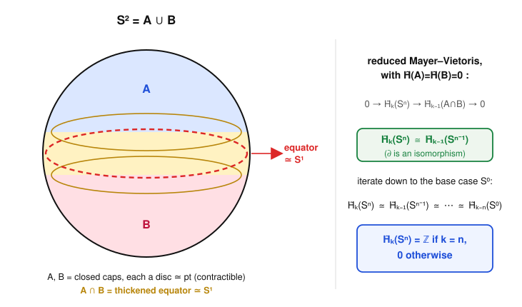

# Algebraic Topology · Lesson 4.2: Mayer–Vietoris

> ⏱ ~15 min · Module 4: Exact Sequences, Cohomology & Applications · Builds on: [the long exact sequence of a pair 4.1](04-01-les-of-a-pair.md), [singular homology 3.3](03-03-singular-homology.md), [the Eilenberg–Steenrod axioms 3.5](03-05-eilenberg-steenrod-axioms.md) · Unlocks: [degree & applications 4.3](04-03-degree-applications.md)

## Why this matters

Back in Module 2 we computed fundamental groups by *cutting*: [Seifert–van Kampen 2.5](02-05-seifert-van-kampen.md) glued $\pi_1(X)$ out of the pieces of an open cover. Mayer–Vietoris is the exact same move one floor up — it glues $H_n(X)$ out of an open cover $X = A\cup B$. Give it the homology of $A$, of $B$, and of their overlap $A\cap B$, and it hands you $H_n(X)$ for *every* $n$ at once, tied together in a single long exact sequence. This is the workhorse of computation: it computes the spheres by a two-line induction, it computes surfaces, and — because it flows from excision — it is one of the two exact sequences (the [LES of a pair 4.1](04-01-les-of-a-pair.md) is the other) that turn homology from a definition into a machine.

## The idea

Think **inclusion–exclusion for holes**. To count the holes of $X=A\cup B$ you'd like to add the holes of $A$ and $B$, then subtract the holes you double-counted in the overlap $A\cap B$. That is almost right — but "adding and subtracting groups" isn't a thing, and worse, gluing two pieces can *create* a hole that neither piece nor the overlap has on its own (glue two discs along their boundary circle and you get $S^2$: a brand-new $2$-dimensional hole from three hole-free pieces). Exactness is the bookkeeping that makes inclusion–exclusion honest *and* records the newly created holes.

The mechanism: a cycle in the overlap sits inside both $A$ and $B$, so it gets counted once by $A$ and once by $B$. Feed it in with opposite signs — as $x\mapsto (x,-x)$ — and if it already bounds in each piece it cancels. What survives measures the whole space. And a cycle in $X$ that *doesn't* live in either piece alone can be cut into an $A$-part and a $B$-part; their shared boundary is a lower-dimensional cycle in $A\cap B$. That cutting operation is the connecting map $\partial$, and it is exactly how a hole of $X$ becomes visible one dimension down in the overlap — the same phenomenon as the pushout relation in van Kampen, now exact instead of just a presentation.

## The formal version

**Setup.** Let $X = A\cup B$ where $A,B$ are subspaces whose **interiors already cover** $X$ (open $A,B$ is the safe case; a CW pair works too). Write the four inclusions
$$i\colon A\cap B\hookrightarrow A,\quad j\colon A\cap B\hookrightarrow B,\quad k\colon A\hookrightarrow X,\quad l\colon B\hookrightarrow X.$$

**Theorem (Mayer–Vietoris).** There is a long exact sequence, natural in the pair $(A,B)$,
$$\cdots \to H_n(A\cap B)\xrightarrow{\ \Phi\ } H_n(A)\oplus H_n(B)\xrightarrow{\ \Psi\ } H_n(X)\xrightarrow{\ \partial\ } H_{n-1}(A\cap B)\to\cdots$$
with $\Phi(x) = (i_*x,\,-j_*x)$ and $\Psi(a,b) = k_*a + l_*b$.

*In words:* what the overlap sees maps into "what $A$ sees plus what $B$ sees"; that maps into what the whole space sees; and the connecting map $\partial$ drops a class of $X$ down one dimension into the overlap — and at every spot, image equals kernel, so nothing is lost or invented.

**Where it comes from.** Let $C_n(A+B)\subseteq C_n(X)$ be the subgroup of chains that are sums of a chain in $A$ and a chain in $B$. There is a short exact sequence of chain complexes
$$0\to C_*(A\cap B)\xrightarrow{\ x\mapsto (x,-x)\ } C_*(A)\oplus C_*(B)\xrightarrow{\ (a,b)\mapsto a+b\ } C_*(A+B)\to 0.$$
Exactness is elementary: the first map is injective; a sum $a+b$ is zero iff $b=-a$ lies in *both* $A$ and $B$, i.e. in $A\cap B$, which is exactly the image of the first map. Every short exact sequence of chain complexes yields a long exact sequence in homology (the snake lemma / zig-zag construction — the same algebra that produced the [LES of a pair 4.1](04-01-les-of-a-pair.md)). That gives the sequence above **except** with $H_n(A+B)$ in the middle. The final input is the **small-simplices theorem** (the technical heart of excision, stated in [3.5](03-05-eilenberg-steenrod-axioms.md)): when the interiors of $A,B$ cover $X$, the inclusion $C_*(A+B)\hookrightarrow C_*(X)$ induces an isomorphism on homology, $H_n(A+B)\cong H_n(X)$. Substitute and you have Mayer–Vietoris. $\blacksquare$

**The connecting map, concretely.** Given a cycle $z$ in $X$ representing a class of $H_n(X)$, subdivide it so $z = a + b$ with $a$ a chain in $A$ and $b$ a chain in $B$. Since $\partial z = 0$, we get $\partial a = -\partial b$, a chain living in *both* $A$ and $B$ — i.e. a cycle in $A\cap B$. Then $\partial[z] = [\partial a] \in H_{n-1}(A\cap B)$.

**Reduced version.** Using reduced groups $\tilde H_n$ throughout gives an identical exact sequence, valid whenever $A\cap B\neq\varnothing$; it ends $\cdots\to \tilde H_0(A\cap B)\to \tilde H_0(A)\oplus \tilde H_0(B)\to \tilde H_0(X)\to 0$. This is the version that computes spheres cleanly, because contractible pieces then contribute *nothing*.

## Picture

The cover that drives everything: $A$ = upper cap, $B$ = lower cap, each a disc (so contractible), overlapping in a band around the equator that retracts to $S^{n-1}$. Because both caps have trivial reduced homology, the middle term $\tilde H(A)\oplus\tilde H(B)$ vanishes and the sequence pinches down to a single isomorphism $\tilde H_k(S^n)\cong\tilde H_{k-1}(S^{n-1})$ — the inductive step, made of geometry.

## Worked examples

**Example 1 (the spheres, in full — the induction that never ends).** Cover $S^n$ ($n\ge 1$) by
$$A = S^n\setminus\{\text{south pole}\},\qquad B = S^n\setminus\{\text{north pole}\}.$$
Each is an open set homeomorphic to $\mathbb{R}^n$ via stereographic projection, hence **contractible**: $\tilde H_k(A)=\tilde H_k(B)=0$ for all $k$. Their union is $S^n$ and their intersection $A\cap B = S^n\setminus\{N,S\}$ deformation-retracts onto the equator, so $A\cap B\simeq S^{n-1}$. The relevant stretch of the *reduced* Mayer–Vietoris sequence is
$$\underbrace{\tilde H_k(A)\oplus\tilde H_k(B)}_{=\,0}\to \tilde H_k(S^n)\xrightarrow{\ \partial\ }\tilde H_{k-1}(A\cap B)\to \underbrace{\tilde H_{k-1}(A)\oplus\tilde H_{k-1}(B)}_{=\,0}.$$
A map whose left neighbor has image $0$ (so it is injective) and whose right neighbor has kernel everything (so it is surjective) is an isomorphism. Therefore, for **every** $k$,
$$\tilde H_k(S^n)\ \cong\ \tilde H_{k-1}(S^{n-1}).$$
Now iterate down the dimension, $n\to n-1\to\cdots\to 0$:
$$\tilde H_k(S^n)\cong \tilde H_{k-1}(S^{n-1})\cong \tilde H_{k-2}(S^{n-2})\cong\cdots\cong \tilde H_{k-n}(S^0).$$
The base case is two points: $\tilde H_0(S^0)=\mathbb{Z}$ (reduced $H_0$ counts *extra* components — two points give one $\mathbb{Z}$) and $\tilde H_m(S^0)=0$ for $m\neq 0$. So $\tilde H_{k-n}(S^0)=\mathbb{Z}$ precisely when $k-n=0$, and $0$ otherwise. Unreducing (which only restores a $\mathbb{Z}$ in degree $0$):
$$\boxed{\,H_k(S^n)=\begin{cases}\mathbb{Z}, & k=0 \text{ or } k=n,\\[2pt] 0, & \text{otherwise},\end{cases}}\qquad(n\ge 1).$$
Two lines of exactness plus one base case computed every sphere at once. That single generator of $H_n(S^n)=\mathbb{Z}$ is the "fundamental class" whose winding will define **degree** in [Lesson 4.3](04-03-degree-applications.md).

**Example 2 (the torus $T=S^1\times S^1$ — a hole in every dimension up to $2$).** Slice the second circle into an upper arc and a lower arc, overlapping in two small arcs. Setting
$$A = S^1\times(\text{upper arc}),\qquad B = S^1\times(\text{lower arc}),$$
each is a cylinder $S^1\times(\text{interval})\simeq S^1$, while $A\cap B = S^1\times(\text{two arcs})\simeq S^1\sqcup S^1$ — two disjoint circles. Known inputs:
$$H_*(A)=H_*(B):\ H_0=\mathbb{Z},\ H_1=\mathbb{Z};\qquad H_*(A\cap B):\ H_0=\mathbb{Z}^2,\ H_1=\mathbb{Z}^2,$$
and everything vanishes above degree $1$. The Mayer–Vietoris sequence, with these plugged in, reads
$$0\to H_2(T)\xrightarrow{\ \partial\ }\mathbb{Z}^2\xrightarrow{\ \Phi_1\ }\mathbb{Z}^2\xrightarrow{\ \Psi_1\ } H_1(T)\xrightarrow{\ \partial\ }\mathbb{Z}^2\xrightarrow{\ \Phi_0\ }\mathbb{Z}^2\xrightarrow{\ \Psi_0\ } H_0(T)\to 0.$$
Now compute the two $\Phi$'s. Both circles $C_1,C_2$ of $A\cap B$ are homologous, inside the cylinder $A$, to its core circle — the generator of $H_1(A)$ — and likewise inside $B$. So with $\Phi(x)=(i_*x,-j_*x)$, each generator maps to $(1,-1)$:
$$\Phi_1 = \Phi_0 = \begin{pmatrix} 1 & 1\\ -1 & -1\end{pmatrix}\ \text{on }\mathbb{Z}^2,\qquad \operatorname{im}\Phi=\mathbb{Z}\cdot(1,-1),\quad \ker\Phi=\mathbb{Z}\cdot(1,-1).$$
Read the sequence in three bites:

- **$H_2$:** $0\to H_2(T)\xrightarrow{\partial}\mathbb{Z}^2\xrightarrow{\Phi_1}\mathbb{Z}^2$. Exactness makes $\partial$ injective with image $\ker\Phi_1\cong\mathbb{Z}$, so $H_2(T)\cong\mathbb{Z}$.
- **$H_1$:** the middle splits into a short exact sequence $0\to \operatorname{coker}\Phi_1\to H_1(T)\xrightarrow{\partial}\ker\Phi_0\to 0$, i.e. $0\to \mathbb{Z}^2/\!\langle(1,-1)\rangle\to H_1(T)\to \ker\Phi_0\to 0$, that is $0\to\mathbb{Z}\to H_1(T)\to\mathbb{Z}\to 0$. A sequence ending in the free group $\mathbb{Z}$ splits, so $H_1(T)\cong\mathbb{Z}^2$.
- **$H_0$:** $T$ is connected, $H_0(T)=\mathbb{Z}$ (and indeed $\operatorname{coker}\Phi_0=\mathbb{Z}$ maps isomorphically via $\Psi_0$).

Collecting, and with everything zero above degree $2$:
$$H_0(T)=\mathbb{Z},\quad H_1(T)=\mathbb{Z}^2,\quad H_2(T)=\mathbb{Z},\quad H_k(T)=0\ (k\ge 3).$$
The two independent $1$-cycles are the meridian and longitude; the single $2$-cycle is the torus's own surface. Exactly what the "doughnut with one two-dimensional void" picture predicts — now proven.

## Watch out

- **You might think** you can cover $X$ with any two closed pieces, **but** the theorem needs the *interiors* of $A,B$ to cover $X$. Two closed hemispheres meeting only along the bare equator circle do **not** qualify — the equator is in neither interior. That is why the overlap must be a *thickened* band (an open collar), not a razor-thin circle; it still retracts to $S^{n-1}$, so you lose nothing.
- **You might think** the sign in $\Phi(x)=(i_*x,-j_*x)$ is cosmetic, **but** exactly one of the two maps must carry a minus or exactness breaks. (Some texts instead put the minus in $\Psi=k_*-l_*$ and take $\Phi=(i_*,j_*)$ — equivalent, since the total sequence only needs $\Psi\circ\Phi=0$. Pick one convention and hold it.)
- **You might think** reduced Mayer–Vietoris always applies, **but** the reduced sequence requires $A\cap B\neq\varnothing$. If $A$ and $B$ are disjoint the overlap term collapses and you're just saying $H_*(A\sqcup B)=H_*(A)\oplus H_*(B)$ — true, but not the theorem doing any work.

## One-liner

> Mayer–Vietoris is inclusion–exclusion for holes made exact: give it the two pieces and their overlap, and one long exact sequence returns the whole — with a connecting map that records the holes born only in the gluing.

## Problems

**P1 (🟢)** Run the reduced Mayer–Vietoris cover of $S^2$ (two caps, $A\cap B\simeq S^1$) explicitly: write the relevant three-term stretch for each $k$, identify why the outer terms vanish, and conclude $H_k(S^2)$ for all $k$. State clearly which isomorphism $\tilde H_k(S^2)\cong\tilde H_{k-1}(S^1)$ you are using and what $\tilde H_*(S^1)$ supplies.

**P2 (🟡)** Let $X = S^1\vee S^1$ (the figure eight). Choose open sets $A,B\subseteq X$, each deformation-retracting onto one of the two circles, with $A\cap B$ a small contractible neighborhood of the wedge point. Run reduced Mayer–Vietoris to compute $H_*(X)$. (This recovers, via homology, the abelianized $\pi_1 = \mathbb{Z}*\mathbb{Z}$ you built with [van Kampen 2.6](02-06-van-kampen-in-the-wild.md).)

**P3 (🔴, optional)** **Suspension isomorphism.** The (unreduced) suspension $\Sigma Y$ is two cones $C_+Y, C_-Y$ glued along $Y$. Cover $\Sigma Y$ by $A = C_+Y$ thickened slightly past the equator and $B = C_-Y$ likewise, so each is a contractible cone and $A\cap B\simeq Y$. Use reduced Mayer–Vietoris to prove $\tilde H_n(\Sigma Y)\cong \tilde H_{n-1}(Y)$ for all $n$, and check that with $Y=S^{n-1}$ (so $\Sigma Y = S^n$) this *is* the sphere induction of Example 1.

Solutions

**P1** Take $A,B$ the two open caps of $S^2$; both are discs, hence contractible, so $\tilde H_k(A)=\tilde H_k(B)=0$ for all $k$, and $A\cap B\simeq S^1$. For each $k$ the reduced sequence contains
$$\underbrace{\tilde H_k(A)\oplus\tilde H_k(B)}_{0}\to \tilde H_k(S^2)\xrightarrow{\partial}\tilde H_{k-1}(S^1)\to \underbrace{\tilde H_{k-1}(A)\oplus\tilde H_{k-1}(B)}_{0}.$$
The left $0$ forces $\partial$ injective; the right $0$ forces $\partial$ surjective; hence $\partial\colon \tilde H_k(S^2)\xrightarrow{\cong}\tilde H_{k-1}(S^1)$. Feeding in the known circle homology $\tilde H_m(S^1)=\mathbb{Z}$ for $m=1$ and $0$ otherwise, we read off $\tilde H_k(S^2)=\mathbb{Z}$ exactly when $k-1=1$, i.e. $k=2$, and $0$ otherwise. Unreducing restores $H_0=\mathbb{Z}$. Thus
$$H_k(S^2)=\begin{cases}\mathbb{Z}, & k=0,2,\\ 0,&\text{else.}\end{cases}\qquad\blacksquare$$

**P2** Each of $A,B$ retracts to a circle: $\tilde H_1(A)=\tilde H_1(B)=\mathbb{Z}$, all other reduced groups $0$. The overlap $A\cap B$ is contractible, so $\tilde H_*(A\cap B)=0$. The reduced sequence around degree $1$ is
$$\underbrace{\tilde H_1(A\cap B)}_{0}\to \tilde H_1(A)\oplus\tilde H_1(B)\xrightarrow{\Psi}\tilde H_1(X)\to \underbrace{\tilde H_0(A\cap B)}_{0}.$$
Both outer terms vanish, so $\Psi\colon \tilde H_1(X)\cong \tilde H_1(A)\oplus\tilde H_1(B)=\mathbb{Z}\oplus\mathbb{Z}=\mathbb{Z}^2$. In every degree $k\ge 2$ all three input groups vanish, giving $\tilde H_k(X)=0$; and $X$ is connected so $\tilde H_0(X)=0$. Therefore
$$H_0(S^1\vee S^1)=\mathbb{Z},\quad H_1(S^1\vee S^1)=\mathbb{Z}^2,\quad H_k=0\ (k\ge 2).$$
This is the abelianization of $\pi_1 = \mathbb{Z}*\mathbb{Z}$ (the free group on two generators), matching the general fact $H_1\cong\pi_1^{\mathrm{ab}}$. $\blacksquare$

**P3** $A=C_+Y$ and $B=C_-Y$ (each thickened over the equator) are cones, hence contractible: $\tilde H_*(A)=\tilde H_*(B)=0$. Their union is $\Sigma Y$ and $A\cap B$ deformation-retracts to the equatorial copy of $Y$. Because $A\cap B\neq\varnothing$, reduced Mayer–Vietoris applies, and for each $n$ it contains
$$\underbrace{\tilde H_n(A)\oplus\tilde H_n(B)}_{0}\to \tilde H_n(\Sigma Y)\xrightarrow{\partial}\tilde H_{n-1}(A\cap B)\to \underbrace{\tilde H_{n-1}(A)\oplus\tilde H_{n-1}(B)}_{0}.$$
Injective on the left, surjective on the right ⇒ $\partial\colon\tilde H_n(\Sigma Y)\xrightarrow{\cong}\tilde H_{n-1}(Y)$ for all $n$. With $Y=S^{n-1}$: $\Sigma S^{n-1}\cong S^n$, and the isomorphism becomes $\tilde H_k(S^n)\cong \tilde H_{k-1}(S^{n-1})$ — verbatim the inductive step of Example 1. Suspension shifts homology up by one degree; iterating $n$ times from $S^0$ is precisely the sphere computation. $\blacksquare$

## Flashback

**From [Lesson 4.1](04-01-les-of-a-pair.md) (the long exact sequence of a pair):** For a point $x_0\in X$, use the long exact sequence of the pair $(X,x_0)$ to prove that relative homology against a point *is* reduced homology: $H_k(X,x_0)\cong \tilde H_k(X)$ for all $k$. Then read off $H_k(S^2,x_0)$.

Solution

The LES of the pair $(X,x_0)$ is
$$\cdots\to H_k(x_0)\xrightarrow{i_*} H_k(X)\xrightarrow{j_*} H_k(X,x_0)\xrightarrow{\partial} H_{k-1}(x_0)\to\cdots$$
A point has $H_k(x_0)=0$ for $k\neq 0$ and $H_0(x_0)=\mathbb{Z}$.

*For $k\ge 2$:* both neighbors $H_k(x_0)$ and $H_{k-1}(x_0)$ vanish, so $j_*\colon H_k(X)\cong H_k(X,x_0)$; and for $k\ge 1$, $H_k(X)=\tilde H_k(X)$. Hence $H_k(X,x_0)\cong\tilde H_k(X)$.

*For $k=1$:* the tail reads $\;H_1(x_0)\!=\!0\to H_1(X)\xrightarrow{j_*} H_1(X,x_0)\xrightarrow{\partial} H_0(x_0)\xrightarrow{i_*} H_0(X)$. The inclusion $x_0\hookrightarrow X$ sends the generator of $H_0(x_0)=\mathbb{Z}$ to the class of a point in $H_0(X)$, which is nonzero (a point is not a boundary), so $i_*$ is injective. Thus $\partial=0$, forcing $j_*$ surjective; it is also injective (left term is $0$), so $H_1(X,x_0)\cong H_1(X)=\tilde H_1(X)$.

*For $k=0$:* $H_0(X,x_0)\cong \tilde H_0(X)$ is the definition of reduced $H_0$ (splitting off the class of the basepoint). So the isomorphism holds in every degree. $\blacksquare$

Applying it to $S^2$ with the computation above: $H_k(S^2,x_0)\cong\tilde H_k(S^2)=\mathbb{Z}$ for $k=2$ and $0$ otherwise. (Relative-to-a-point simply *deletes* the degree-$0$ copy of $\mathbb{Z}$ that the basepoint contributes.)

## Connections

- **Backward:** Mayer–Vietoris is the homological twin of [Seifert–van Kampen 2.5/2.6](02-05-seifert-van-kampen.md) — both compute an invariant of $X=A\cup B$ from the pieces and the overlap. It is built on the same machinery as the [LES of a pair 4.1](04-01-les-of-a-pair.md) (a short exact sequence of chain complexes → a long exact sequence in homology) and on the excision/small-simplices input axiomatized in [3.5](03-05-eilenberg-steenrod-axioms.md).
- **Forward:** the generator of $H_n(S^n)=\mathbb{Z}$ computed here is what makes **degree** definable in [Lesson 4.3](04-03-degree-applications.md) — a self-map of $S^n$ is graded by the integer it induces on $H_n(S^n)$ — and it powers Brouwer in all dimensions and the hairy-ball theorem. The suspension isomorphism (P3) reappears when cohomology and cup products enter in [4.4](04-04-cohomology-cup-products.md).
- **Sideways (abstract algebra):** the entire proof is a diagram chase in exact sequences of abelian groups — the $\Phi=(i_*,-j_*)$ / $\Psi=k_*+l_*$ pattern is the additive analogue of the amalgamated free product $\pi_1(A)*_{\pi_1(A\cap B)}\pi_1(B)$ from [van Kampen](02-05-seifert-van-kampen.md), the same universal-property gluing living in [abstract-algebra](../../abstract-algebra/syllabus.md).
- **Sideways (differential geometry):** the very same overlap-cover bookkeeping is the Mayer–Vietoris principle behind de Rham cohomology and Čech–de Rham arguments in [differential-geometry](../../differential-geometry/syllabus.md); the sphere computation here is the topological shadow of "a closed form on $S^n$ is exact iff its integral over the fundamental class vanishes."
