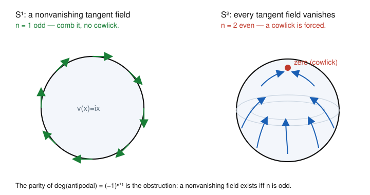

# Algebraic Topology · Lesson 4.3: Degree & applications

> ⏱ ~15 min · Module 4: Exact Sequences, Cohomology & Applications · Builds on: [Mayer–Vietoris](04-02-mayer-vietoris.md), [$\pi_1(S^1)\cong\mathbb{Z}$](01-04-pi1-of-the-circle.md) · Unlocks: [Cohomology & cup products](04-04-cohomology-cup-products.md)

## Why this matters

You spent [Lesson 4.2](04-02-mayer-vietoris.md) proving $H_n(S^n)\cong\mathbb{Z}$. That single group is now a measuring instrument: any self-map $f\colon S^n\to S^n$ induces a map $\mathbb{Z}\to\mathbb{Z}$, which is just multiplication by an integer. That integer — the **degree** — is a homotopy invariant so strong it *classifies* self-maps of the sphere up to homotopy. And it is cheap to compute: count preimages of a point with signs. From this one number fall Brouwer's fixed-point theorem in *every* dimension and the hairy ball theorem — you genuinely cannot comb a coconut. Degree is also the topological skeleton of the winding number and the argument principle you meet in complex-analysis.

## The idea

A self-map of the circle wraps it around itself some whole number of times: twice, or backwards three times, or not at all. That wrapping number survived from [Lesson 1.4](01-04-pi1-of-the-circle.md) as the winding number. **Degree is that same idea in every dimension**, read off homology instead of $\pi_1$.

The picture: pick a target point $y\in S^n$ that $f$ hits transversally. Over it sit finitely many preimages. At each one, $f$ either preserves orientation (count $+1$) or reverses it (count $-1$). Add them up. That sum is the degree — and remarkably it does not depend on which $y$ you picked. A map that folds the sphere onto a hemisphere and back has degree $0$ (preimages cancel in pairs); the identity has degree $1$; a mirror reflection has degree $-1$.

Two payoffs are almost immediate once you believe degree is a homotopy invariant. **Brouwer:** if a self-map of the ball had no fixed point, you could push each point away from its image to the boundary, building a retraction of the ball onto its sphere — and degree forbids that. **Hairy ball:** a nowhere-zero tangent field on $S^n$ lets you rotate each point toward its own arrow, homotoping the identity to the antipodal map; the antipodal map has degree $(-1)^{n+1}$, so this can only happen when that equals $1$, i.e. $n$ is odd.

## The formal version

Fix $n\ge 1$ and an isomorphism $H_n(S^n)\cong\mathbb{Z}$ once and for all (a choice of generator = a choice of orientation).

**Definition (degree).** For continuous $f\colon S^n\to S^n$, the induced map $f_*\colon H_n(S^n)\to H_n(S^n)$ is a homomorphism $\mathbb{Z}\to\mathbb{Z}$, hence multiplication by a unique integer. That integer is the **degree** $\operatorname{deg} f$: $\;f_*(\alpha)=(\operatorname{deg} f)\,\alpha$ for every $\alpha\in H_n(S^n)$.

*In words:* degree is the whole number by which $f$ scales the top homology.

The choice of generator does not matter: switching orientation negates $\alpha$ on both sides, leaving the multiplier fixed. The basic properties are all functoriality in disguise.

**Properties.**
1. $\operatorname{deg}(\operatorname{id})=1$, since $\operatorname{id}_*=\operatorname{id}$.
2. If $f$ is not surjective, $\operatorname{deg} f=0$. (It factors through $S^n\setminus\{y\}\cong\mathbb{R}^n$, which is contractible, so $f_*$ factors through $H_n(\text{point})=0$.) In particular a constant map has degree $0$.
3. $\operatorname{deg}(f\circ g)=\operatorname{deg} f\cdot\operatorname{deg} g$, since $(f\circ g)_*=f_*\circ g_*$ and composing "multiply by $a$" with "multiply by $b$" multiplies.
4. **Homotopy invariance:** $f\simeq g\ \Rightarrow\ f_*=g_*\ \Rightarrow\ \operatorname{deg} f=\operatorname{deg} g$. Homology is homotopy-invariant, so homotopic maps induce the same map on $H_n$.

*In words:* degree is multiplicative, ignores non-surjective maps, and can't tell homotopic maps apart.

**Hopf's theorem (state).** The converse of (4) holds: two maps $S^n\to S^n$ are homotopic **iff** they have the same degree. So $\operatorname{deg}$ is a *complete* invariant — it sets up a bijection $[S^n,S^n]\xrightarrow{\ \cong\ }\mathbb{Z}$.

*In words:* on spheres, "same degree" is exactly "same up to deformation" — nothing finer to measure.

**Local degree.** Suppose $f^{-1}(y)=\{x_1,\dots,x_k\}$ is finite and each $x_i$ has a neighborhood $U_i$ mapped by $f$ into a neighborhood $V$ of $y$ with $U_i\setminus\{x_i\}\to V\setminus\{y\}$. Excision identifies $H_n(U_i,U_i\setminus x_i)\cong H_n(S^n,S^n\setminus x_i)\cong\mathbb{Z}$, and $f$ induces multiplication by an integer $\operatorname{deg} f|_{x_i}$, the **local degree** at $x_i$. Then
$$\operatorname{deg} f=\sum_{i=1}^k \operatorname{deg} f\big|_{x_i}.$$

*In words:* global degree is the signed count of preimages of any point $y$ around which $f$ is nice — each preimage contributes $\pm1$ according to whether $f$ flips orientation there. (This is exactly how the winding number counts signed crossings of a ray.)

**Two computations we will reuse.**

*Reflection.* Let $r\colon S^n\to S^n$ be a reflection fixing the equatorial $S^{n-1}$ and swapping the two hemispheres, e.g. $r(x_0,x_1,\dots,x_n)=(-x_0,x_1,\dots,x_n)$. Then $\operatorname{deg} r=-1$. (Mayer–Vietoris on the two hemispheres builds the generator of $H_n(S^n)$ from the equator's fundamental class; $r$ swaps the hemispheres and negates that class. Concretely, $r$ has local degree $-1$ at every regular preimage.)

*Antipodal map.* The antipodal map $a(x)=-x$ negates all $n+1$ coordinates, so it is the composite of $n+1$ reflections, one per coordinate. By multiplicativity,
$$\operatorname{deg}(a)=(-1)^{\,n+1}.$$

*In words:* flipping one axis costs a sign; the antipode flips $n+1$ axes, so its degree is $(-1)^{n+1}$ — which is $+1$ exactly when $n$ is odd.

**Brouwer in all dimensions.** *There is no retraction $D^{n+1}\to S^n$, and every continuous $g\colon D^{n+1}\to D^{n+1}$ has a fixed point.*

*Proof.* A retraction $r\colon D^{n+1}\to S^n$ (with $r|_{S^n}=\operatorname{id}$) would give, on homology, $\operatorname{id}_*=(r\circ\iota)_*=r_*\circ\iota_*$ on $H_n(S^n)=\mathbb{Z}$, where $\iota\colon S^n\hookrightarrow D^{n+1}$. But $\iota_*$ factors through $H_n(D^{n+1})=0$, so the identity of $\mathbb{Z}$ factors through $0$ — impossible. Now suppose $g\colon D^{n+1}\to D^{n+1}$ had no fixed point. Then for each $x$ the ray from $g(x)$ through $x$ meets $S^n$ in a well-defined point $r(x)$, and $r$ is continuous with $r|_{S^n}=\operatorname{id}$ — a retraction. Contradiction. $\blacksquare$

## Picture

Left: on $S^1$, the field $v(x)=ix$ (rotate each point a quarter turn) is tangent everywhere and never zero — you can comb the circle. Right: on $S^2$, no matter how you comb the hair, some point is left with nowhere consistent to point — a cowlick, i.e. a zero of the field. The obstruction is one sign: $\operatorname{deg}(a)=(-1)^{n+1}$ is $+1$ only for odd $n$.

## Worked examples

**Example 1 (antipodal on $S^2$, and no field on $S^2$).** On $S^2$ we have $n=2$, so
$$\operatorname{deg}(a)=(-1)^{2+1}=(-1)^3=-1.$$
Since $\operatorname{deg}(\operatorname{id})=1\neq-1=\operatorname{deg}(a)$, homotopy invariance (property 4) says **the antipodal map on $S^2$ is not homotopic to the identity**. Now watch this cash out. Suppose $S^2$ had a nowhere-zero continuous tangent field $v$; normalize $|v(x)|=1$. Because $v(x)$ is tangent, $v(x)\perp x$, so for each $x$ the great-circle rotation
$$H(x,t)=(\cos\pi t)\,x+(\sin\pi t)\,v(x),\qquad t\in[0,1],$$
stays on $S^2$ (it is a unit vector: $x\perp v(x)$ gives $|H|^2=\cos^2\pi t+\sin^2\pi t=1$). At $t=0$, $H=x$ (the identity); at $t=1$, $H=-x$ (the antipode). So $v$ would furnish a homotopy $\operatorname{id}\simeq a$, forcing $\operatorname{deg}(a)=1$. But $\operatorname{deg}(a)=-1$. Contradiction — **$S^2$ has no nonvanishing tangent vector field.** You cannot comb a coconut flat.

**Example 2 (an explicit field where the parity is right: $S^1$ and $S^3$).** For odd $n$ the obstruction vanishes, and you can write a field down by pairing coordinates. On $S^1\subset\mathbb{R}^2$,
$$v(x_1,x_2)=(-x_2,\,x_1).$$
Check tangency: $v\cdot x=-x_2x_1+x_1x_2=0$, so $v(x)$ is perpendicular to the radius, i.e. tangent to the circle. Check nonvanishing: $|v(x)|=|x|=1\neq0$ everywhere. This is exactly "multiply by $i$" — rotate each point a quarter turn (the left panel of the figure). The identical trick works on $S^3\subset\mathbb{R}^4$: pair up the four coordinates,
$$v(x_1,x_2,x_3,x_4)=(-x_2,\,x_1,\,-x_4,\,x_3).$$
Again $v\cdot x=-x_2x_1+x_1x_2-x_4x_3+x_3x_4=0$ (tangent) and $|v(x)|=|x|=1$ (nonvanishing). The pattern generalizes: **whenever $n$ is odd, $\mathbb{R}^{n+1}$ has an even number of coordinates, pair them as $(x_1,x_2,\dots,x_{n},x_{n+1})\mapsto(-x_2,x_1,\dots,-x_{n+1},x_n)$**, and you get a nowhere-zero tangent field. This is the "if" half of the hairy ball theorem.

**The hairy ball theorem (both directions).** *$S^n$ admits a nowhere-vanishing continuous tangent vector field iff $n$ is odd.* The "if" is Example 2's pairing. The "only if" is Example 1's argument in general: a unit tangent field $v$ gives the homotopy $H(x,t)=(\cos\pi t)x+(\sin\pi t)v(x)$ from $\operatorname{id}$ to $a$, whence $1=\operatorname{deg}(\operatorname{id})=\operatorname{deg}(a)=(-1)^{n+1}$, forcing $n+1$ even, i.e. $n$ odd. $\blacksquare$

## Watch out

- **Degree $0$ does not mean non-surjective.** Non-surjective $\Rightarrow$ degree $0$ (property 2), but not conversely: the "fold onto a hemisphere and back" map is onto yet has degree $0$ because its two sheets cancel with opposite local degrees. Degree measures signed covering, not mere surjectivity.
- **Local degree is $\pm1$ only when $f$ is a local homeomorphism there.** At a preimage where $f$ locally $k$-to-$1$ (like $z\mapsto z^k$ on $S^2=\mathbb{C}\cup\infty$), the local degree is $k$, not $1$. The global degree is still the *sum* of local degrees over $f^{-1}(y)$ — just don't assume each term is a sign.
- **Hopf's converse is special to spheres.** "Same degree $\Rightarrow$ homotopic" is a theorem about $[S^n,S^n]$; do not expect a single integer to classify maps between other spaces. And degree needs matching dimensions and orientability — it lives on $H_n(S^n)$, the top class.

## One-liner

> A self-map of $S^n$ carries one integer, its degree — the signed number of times it wraps the sphere over itself — and that integer alone decides fixed points ($D^{n+1}$ always) and cowlicks (only even $n$).

## Problems

**P1 (🟢)** Compute the degree of the map $r_2\colon S^2\to S^2$, $r_2(x_0,x_1,x_2)=(x_0,-x_1,-x_2)$ (a $180^\circ$ rotation about the $x_0$-axis). Is $r_2$ homotopic to the identity? To the antipodal map? Justify using degree.

**P2 (🟡)** Let $f\colon S^n\to S^n$ have $\operatorname{deg} f\neq(-1)^{n+1}$. Prove $f$ has a fixed point. *(Hint: if $f(x)\neq x$ for all $x$, homotope $f$ to the antipodal map along the shorter great-circle arc from $f(x)$ to $-x$.)* Deduce that **every** self-map of an even-dimensional sphere with degree $\neq -1$ has a fixed point; in particular every degree-$1$ self-map of $S^2$ does.

**P3 (🔴, optional)** Using local degree, compute $\operatorname{deg}(f)$ for $f\colon S^2\to S^2$ given in the model $S^2=\mathbb{C}\cup\{\infty\}$ by the polynomial $f(z)=z^3$ (with $f(\infty)=\infty$). Confirm your answer against the general fact $\operatorname{deg}(z\mapsto z^k)=k$, and explain in one line what this says about the winding of $z^3$ around $0$.

Solutions

**P1** $r_2$ negates two of the three coordinates, so it is a composite of exactly two reflections, $r_2=r_{x_1}\circ r_{x_2}$ where $r_{x_i}$ flips the $i$-th coordinate. By multiplicativity $\operatorname{deg}(r_2)=(-1)(-1)=+1$. Since $\operatorname{deg}(r_2)=1=\operatorname{deg}(\operatorname{id})$, Hopf's theorem gives $r_2\simeq\operatorname{id}$ (and you can see the homotopy directly: rotate the angle from $180^\circ$ down to $0^\circ$). It is **not** homotopic to the antipodal map, since $\operatorname{deg}(a)=(-1)^{2+1}=-1\neq1$; homotopic maps share a degree. (Moral: an even number of coordinate flips = orientation-preserving = degree $+1$; the antipode flips an *odd* number, $3$, on $S^2$.)

**P2** Suppose $f$ has no fixed point: $f(x)\neq x$ for every $x$. Consider the normalized straight-line homotopy from $f$ to the antipodal map,
$$H(x,t)=\frac{(1-t)f(x)+t(-x)}{\bigl|(1-t)f(x)+t(-x)\bigr|}.$$
This is well-defined provided the numerator never vanishes. It vanishes only if $(1-t)f(x)=tx$, i.e. $f(x)=\tfrac{t}{1-t}x$ is a positive multiple of $x$; since $|f(x)|=|x|=1$, the multiplier must equal $1$, forcing $f(x)=x$ — excluded by hypothesis. So $H$ is a genuine homotopy on $S^n$ from $f$ (at $t=0$) to the antipodal map $a$ (at $t=1$). Homotopy invariance gives $\operatorname{deg} f=\operatorname{deg} a=(-1)^{n+1}$, contradicting $\operatorname{deg} f\neq(-1)^{n+1}$. Hence $f$ has a fixed point. $\blacksquare$

For even $n$ we have $(-1)^{n+1}=-1$, so any self-map of an even-dimensional sphere with $\operatorname{deg} f\neq-1$ — in particular every degree-$1$ map, such as the identity itself — has a fixed point.

**P3** Pick the regular value $y=1\in\mathbb{C}\subset S^2$. Its preimages under $f(z)=z^3$ are the three cube roots of unity $\zeta_k=e^{2\pi i k/3}$, $k=0,1,2$ — three distinct points, none at $\infty$. Near each $\zeta_k$, $f$ is holomorphic with $f'(\zeta_k)=3\zeta_k^2\neq0$, so $f$ is an orientation-*preserving* local homeomorphism there (nonzero complex derivative preserves orientation). Thus each local degree is $+1$, and
$$\operatorname{deg} f=\sum_{k=0}^{2}\operatorname{deg} f\big|_{\zeta_k}=1+1+1=3.$$
This matches $\operatorname{deg}(z\mapsto z^k)=k$ with $k=3$. Reading it back: as $z$ traverses a small loop once around any regular value, $z^3$ winds three times around $0$ — degree $3$ is the winding number, exactly the count that powers the argument principle and the fundamental theorem of algebra in complex-analysis.

## Flashback

**From [Lesson 4.2](04-02-mayer-vietoris.md) (Mayer–Vietoris):** Let $X=S^2\vee S^2$ (two 2-spheres glued at a single point). Cover $X$ by open sets $A,B$ where $A$ is a neighborhood deformation-retracting to the first sphere and $B$ to the second, so $A\simeq B\simeq S^2$ and $A\cap B$ is contractible (a small neighborhood of the wedge point). Use the reduced Mayer–Vietoris sequence to compute $\widetilde H_k(S^2\vee S^2)$ for all $k$.

Solution

Reduced Mayer–Vietoris for $X=A\cup B$ reads
$$\cdots\to\widetilde H_k(A\cap B)\to\widetilde H_k(A)\oplus\widetilde H_k(B)\to\widetilde H_k(X)\to\widetilde H_{k-1}(A\cap B)\to\cdots$$
Here $A\cap B$ is contractible, so $\widetilde H_k(A\cap B)=0$ for all $k$. The sequence therefore breaks into isomorphisms
$$\widetilde H_k(A)\oplus\widetilde H_k(B)\ \xrightarrow{\ \cong\ }\ \widetilde H_k(X),$$
because the terms on either side of $\widetilde H_k(X)$ vanish. With $A\simeq B\simeq S^2$ we have $\widetilde H_2\cong\mathbb{Z}$ and all other reduced groups $0$. Hence
$$\widetilde H_k(S^2\vee S^2)=\begin{cases}\mathbb{Z}\oplus\mathbb{Z}=\mathbb{Z}^2,& k=2,\\ 0,&k\neq2.\end{cases}$$
So $H_0=\mathbb{Z}$ (connected), $H_1=0$, $H_2=\mathbb{Z}^2$, and $0$ above. This is the general wedge rule $\widetilde H_k(X\vee Y)\cong\widetilde H_k(X)\oplus\widetilde H_k(Y)$ — the reduced groups add because the shared point is contractible and contributes nothing. (The two independent generators of $H_2$ are the fundamental classes of the two spheres; degree in Lesson 4.3 measures how a self-map mixes them.)

## Connections

- **Backward:** degree is the top-dimensional heir of the winding number from [$\pi_1(S^1)\cong\mathbb{Z}$](01-04-pi1-of-the-circle.md) — same "how many times does it wrap" idea, now read on $H_n$ instead of $\pi_1$ — and it lives on the $H_n(S^n)\cong\mathbb{Z}$ you built with [Mayer–Vietoris](04-02-mayer-vietoris.md). The no-retraction argument is the general-$n$ echo of the Brouwer proof in [Lesson 1.5](01-05-first-payoffs.md).
- **Forward:** [Cohomology & cup products](04-04-cohomology-cup-products.md) upgrades these top classes to a ring; degree reappears as the effect of a map on the top cohomology class, and the wedge computation in the Flashback previews why the cup product is needed to tell $S^2\vee S^4$ from $\mathbb{CP}^2$.
- **Sideways (differential-geometry):** the hairy ball theorem is the topological reason a smooth manifold's Euler characteristic obstructs nonvanishing vector fields — the Poincaré–Hopf theorem says the signed count of a field's zeros equals $\chi(M)$, and $\chi(S^n)=1+(-1)^n$ is $0$ exactly for odd $n$. That is the same parity you met here, seen from the manifolds/vector-fields side.
- **Sideways (complex-analysis):** local degree of a holomorphic map is its multiplicity, so $\operatorname{deg}(z\mapsto z^k)=k$ (P3) is the winding number, and the degree/argument-principle dictionary is why a degree-$k$ map of $S^2$ counts $k$ solutions — the topological heart of the fundamental theorem of algebra.
