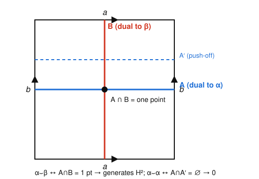

# Algebraic Topology · Lesson 4.4: Cohomology & cup products

> ⏱ ~15 min · Module 4: Exact Sequences, Cohomology & Applications · Builds on: [3.2 Simplicial homology](03-02-simplicial-homology.md), [3.4 CW & cellular homology](03-04-cw-cellular-homology.md), [4.3 Degree & applications](04-03-degree-applications.md) · Unlocks: [4.5 Invariance of domain](04-05-invariance-of-domain.md)

## Why this matters

Homology hands you a list of groups $H_n(X)$ — one abelian group per dimension, counting holes. But a *list of groups* is a weak fingerprint: two genuinely different spaces can have identical lists. The wedge $S^2\vee S^4$ and the complex projective plane $\mathbb{CP}^2$ have **exactly the same** homology in every degree, yet they are not homotopy equivalent — and homology alone can never tell them apart. Cohomology fixes this by giving the whole collection $\bigoplus_n H^n(X)$ a **multiplication**, the cup product, turning a passive list into a *ring*. The ring remembers how the holes link together, and that extra structure is precisely what separates $\mathbb{CP}^2$ from the wedge. It is also the algebraic home of intersection numbers, Poincaré duality, and (downstream of this course) characteristic classes.

## The idea

Cohomology is homology *read backwards*. A homology class is built from chains — formal combinations of simplices *inside* $X$. A **cochain** is instead a rule that eats a chain and spits out a number: a measuring device rather than a piece of the space. Where the boundary $\partial$ pushes an $n$-chain down to its $(n-1)$-dimensional edge, the dual **coboundary** $\delta$ pushes an $n$-cochain *up* a dimension by "pre-composing with $\partial$." Everything from homology transposes: cycles become cocycles, and $H^n(X)$ is cocycles modulo coboundaries.

So far this is just homology in a mirror, and the **Universal Coefficient Theorem** confirms it's almost the same information: $H^n(X)$ is essentially the dual of $H_n(X)$. The genuinely new thing is the product. Two measuring devices can be *multiplied*: given a $p$-cochain and a $q$-cochain, cut each simplex into a front $p$-face and a back $q$-face, measure the front with one and the back with the other, and multiply the two numbers. That operation — the **cup product** — turns cohomology into a graded ring. And rings see structure that groups can't: whether the "square" of a 2-dimensional class is zero or fills up a 4-dimensional hole is a yes/no question homology never even gets to ask.

## The formal version

Fix a commutative ring $R$ of coefficients (think $R=\mathbb{Z}$ or a field). Let $C_n(X)$ be the singular chain group.

**Cochains.** $C^n(X;R) := \operatorname{Hom}(C_n(X),\,R)$ — all $R$-linear maps from $n$-chains to $R$.
*In words:* an $n$-cochain assigns a number to every $n$-simplex, extended linearly to chains.

**Coboundary.** Define $\delta\colon C^n(X;R)\to C^{n+1}(X;R)$ as the transpose $\delta = \partial^*$ of the boundary, i.e. for a cochain $\varphi$ and an $(n{+}1)$-chain $\sigma$,
$$(\delta\varphi)(\sigma) := \varphi(\partial\sigma).$$
*In words:* to measure a cell with $\delta\varphi$, measure its boundary with $\varphi$. Because $\partial^2=0$, also $\delta^2=0$: the coboundary raises degree and squares to zero, exactly mirroring $\partial$.

**Cohomology.**
$$H^n(X;R) := \frac{\ker\big(\delta\colon C^n\to C^{n+1}\big)}{\operatorname{im}\big(\delta\colon C^{n-1}\to C^n\big)} = \frac{\text{cocycles}}{\text{coboundaries}}.$$
*In words:* a cocycle is a cochain that vanishes on all boundaries; two cocycles are cohomologous when they differ by a coboundary.

**Universal Coefficient Theorem (the one-liner).** There is a (non-canonically) split short exact sequence
$$0\to \operatorname{Ext}^1_{\mathbb{Z}}\!\big(H_{n-1}(X),R\big)\to H^n(X;R)\to \operatorname{Hom}\big(H_n(X),R\big)\to 0.$$
*In words:* $H^n$ is the dual of $H_n$ (the $\operatorname{Hom}$ term), plus an error term from the **torsion of $H_{n-1}$**, shifted up one degree. Over a field $R$, $\operatorname{Ext}$ dies and $H^n(X;R)\cong H_n(X;R)^*$ is just the dual vector space. Over $\mathbb{Z}$, torsion in degree $n-1$ reappears as torsion in $H^n$ (you'll see $H_1(\mathbb{RP}^2)=\mathbb{Z}/2$ resurface as $H^2$ in P3).

**Cup product.** For $\varphi\in C^p(X;R)$, $\psi\in C^q(X;R)$, and a singular simplex $\sigma\colon\Delta^{p+q}\to X$ with vertices $v_0,\dots,v_{p+q}$, define
$$(\varphi\smile\psi)(\sigma) := \varphi\big(\sigma|_{[v_0,\dots,v_p]}\big)\cdot\psi\big(\sigma|_{[v_p,\dots,v_{p+q}]}\big),$$
the **front $p$-face** measured by $\varphi$ times the **back $q$-face** measured by $\psi$. The Leibniz rule $\delta(\varphi\smile\psi)=\delta\varphi\smile\psi+(-1)^p\varphi\smile\delta\psi$ shows a cup of cocycles is a cocycle and a cup with a coboundary is a coboundary, so $\smile$ descends to
$$\smile\colon H^p(X;R)\times H^q(X;R)\to H^{p+q}(X;R).$$
This makes $H^*(X;R):=\bigoplus_{n\ge0}H^n(X;R)$ an associative, unital **graded ring** (the unit $1\in H^0$ is the cochain sending every point to $1\in R$). It is **graded-commutative**:
$$\alpha\smile\beta=(-1)^{pq}\,\beta\smile\alpha\qquad(\alpha\in H^p,\ \beta\in H^q).$$
*In words:* swapping two classes costs a sign equal to the product of their degrees. The cochain formula above is *not* commutative on the nose — this identity is a theorem, proved by an explicit chain homotopy. One immediate consequence: an **odd-degree** class $\alpha$ satisfies $\alpha\smile\alpha=-\alpha\smile\alpha$, so $2\alpha^2=0$ (and $\alpha^2=0$ whenever the target group is torsion-free).

## Picture

On the torus $T^2$, take the two obvious loops: a horizontal circle $A$ and a vertical circle $B$. Their Poincaré duals are cohomology classes $\alpha,\beta\in H^1(T^2;\mathbb{Z})$, and the slogan is **cup product = intersection of duals**. The two loops cross in exactly one point, so $\alpha\smile\beta$ is dual to a single point — a generator of $H^2(T^2)$. Push $A$ off itself to a disjoint parallel copy $A'$; now $A\cap A'=\varnothing$, so $\alpha\smile\alpha$ is dual to nothing and vanishes.

That single picture *is* the cohomology ring of the torus: two odd-degree generators that anticommute, each squaring to zero, whose product fills the top cell.

## Worked examples

**Example 1 — the cohomology ring of the torus.** Homology gives $H_0=H_2=\mathbb{Z}$ and $H_1=\mathbb{Z}^2$, all torsion-free, so UCT (over $\mathbb{Z}$) is pure duality:
$$H^0(T^2)=\mathbb{Z}\langle 1\rangle,\quad H^1(T^2)=\mathbb{Z}\langle\alpha,\beta\rangle,\quad H^2(T^2)=\mathbb{Z}\langle\gamma\rangle.$$
Now the ring. Both $\alpha,\beta$ live in odd degree $1$, so graded-commutativity forces
$$\alpha\smile\alpha=-\alpha\smile\alpha\ \Rightarrow\ 2\alpha^2=0\ \Rightarrow\ \alpha^2=0$$
(the last step because $H^2=\mathbb{Z}$ is torsion-free), and likewise $\beta^2=0$. The mixed product is the interesting one: $\alpha\smile\beta=-\beta\smile\alpha$, and the intersection picture above shows it is a **generator** of $H^2$, so $\gamma=\alpha\smile\beta$. Assembling:
$$H^*(T^2;\mathbb{Z})\ \cong\ \Lambda_{\mathbb{Z}}[\alpha,\beta]\ =\ \mathbb{Z}\langle 1,\ \alpha,\ \beta,\ \alpha\beta\rangle\ \big/\ (\alpha^2=\beta^2=0,\ \alpha\beta=-\beta\alpha),$$
the **exterior algebra** on two degree-1 generators. Every product not forced to zero lands in the top class — this is literally $dx,\ dy,\ dx\wedge dy$ from calculus wearing topological clothes.

**Example 2 — $\mathbb{CP}^2$ vs $S^2\vee S^4$: same groups, different rings.** Both spaces have
$$H_n=H^n=\begin{cases}\mathbb{Z}& n=0,2,4\\ 0&\text{else,}\end{cases}$$
so *homology and cohomology as groups are identical* — no group-level invariant can separate them. The cup product does. Write $x$ for the degree-2 generator in each case.

- **$\mathbb{CP}^2$.** Its cohomology ring is the **truncated polynomial ring** $\mathbb{Z}[x]/(x^3)$ with $\deg x=2$. Here $x\smile x=x^2$ is a **generator of $H^4$** — nonzero. (Degree 2 is even, so no sign obstruction; and geometrically two copies of the hyperplane $\mathbb{CP}^1\subset\mathbb{CP}^2$ meet in exactly one point, so $x^2$ is dual to a point = the generator.)
- **$S^2\vee S^4$.** Let $q\colon S^2\vee S^4\to S^2$ collapse the $4$-sphere. Then $x=q^*(u)$ for the generator $u\in H^2(S^2)$, so
$$x\smile x=q^*(u)\smile q^*(u)=q^*(u\smile u)\in q^*\big(H^4(S^2)\big)=q^*(0)=0,$$
because $H^4(S^2)=0$. Every product of positive-degree classes vanishes: the ring is $\mathbb{Z}\oplus\mathbb{Z}x\oplus\mathbb{Z}b$ with $x^2=0$.

One ring has $x^2\ne0$; the other has $x^2=0$. Since a homotopy equivalence induces a **ring isomorphism** on $H^*$, the two spaces cannot be homotopy equivalent. The cup product sees a difference that no homology group can.

## Watch out

- **You might think** $H^n(X;R)$ is *just* $\operatorname{Hom}(H_n(X),R)$ — **but** over $\mathbb{Z}$ that misses the $\operatorname{Ext}$ term. Torsion in $H_{n-1}$ contributes to $H^n$: e.g. $H^2(\mathbb{RP}^2;\mathbb{Z})=\mathbb{Z}/2$ even though $H_2(\mathbb{RP}^2)=0$ and $\operatorname{Hom}(0,\mathbb{Z})=0$. Duality is exact only over a field.
- **You might think** the cup product is commutative — **but** it's *graded*-commutative, $\alpha\beta=(-1)^{pq}\beta\alpha$. The sign is invisible for even-degree classes (that's why $\mathbb{CP}^2$'s $x^2\ne0$ is allowed) but lethal for odd ones, where it forces squares to be torsion.
- **You might think** the cochain-level formula $\varphi\smile\psi$ is symmetric because multiplication in $R$ is — **but** it splits each simplex asymmetrically into a *front* and *back* face, so $\varphi\smile\psi\ne\psi\smile\varphi$ as cochains. Commutativity holds only after passing to cohomology, and only up to the sign.

## One-liner

> Cohomology is homology dualized so it can multiply — and the resulting ring $H^*(X)$ tells $\mathbb{CP}^2$ from $S^2\vee S^4$ exactly where their identical homology groups fall silent.

## Problems

**P1 (🟢)** Let $\alpha\in H^{k}(X;\mathbb{Z})$ with $k$ **odd**. Using only graded-commutativity, show $2\alpha\smile\alpha=0$, and conclude $\alpha\smile\alpha=0$ whenever $H^{2k}(X;\mathbb{Z})$ is torsion-free. Then state what could go wrong if $k$ were even, using $\mathbb{CP}^2$ as the cautionary example.

**P2 (🟡)** You are told $H^*(\mathbb{CP}^2;\mathbb{Z})\cong\mathbb{Z}[x]/(x^3)$ ($\deg x=2$) and that $S^2\vee S^4$ has all products of positive-degree classes equal to $0$. Prove carefully that the two spaces are **not homotopy equivalent**, and identify exactly which property of the induced map $f^*$ you use. (One sentence on why their equal homology *groups* cannot be used the same way.)

**P3 (🔴, optional)** Using the Universal Coefficient Theorem and $H_0(\mathbb{RP}^2)=\mathbb{Z},\ H_1(\mathbb{RP}^2)=\mathbb{Z}/2,\ H_2(\mathbb{RP}^2)=0$, compute $H^0,H^1,H^2$ of $\mathbb{RP}^2$ with $\mathbb{Z}$ coefficients. Explain in one line where the $\mathbb{Z}/2$ went and why it moved up a degree. (Recall $\operatorname{Hom}(\mathbb{Z}/2,\mathbb{Z})=0$ but $\operatorname{Ext}^1_{\mathbb{Z}}(\mathbb{Z}/2,\mathbb{Z})=\mathbb{Z}/2$.)

Solutions

**P1** Graded-commutativity with $p=q=k$ gives $\alpha\smile\alpha=(-1)^{k\cdot k}\alpha\smile\alpha=(-1)^{k^2}\alpha\smile\alpha$. For $k$ odd, $k^2$ is odd, so $(-1)^{k^2}=-1$ and $\alpha^2=-\alpha^2$, i.e. $2\alpha^2=0$. Thus $\alpha^2$ is a $2$-torsion element of $H^{2k}(X;\mathbb{Z})$; if that group is torsion-free the only such element is $0$, so $\alpha^2=0$.

If $k$ is even, $(-1)^{k^2}=+1$ and the identity is vacuous ($\alpha^2=\alpha^2$) — it imposes **no** constraint, so $\alpha^2$ may be nonzero. Indeed for $\mathbb{CP}^2$ with $\deg x=2$ (even), $x^2$ is a generator of $H^4$, the archetype of a nonvanishing square. So the "squares vanish" phenomenon is strictly an odd-degree effect. $\blacksquare$

**P2** Suppose $f\colon \mathbb{CP}^2\to S^2\vee S^4$ were a homotopy equivalence. Then $f^*\colon H^*(S^2\vee S^4)\to H^*(\mathbb{CP}^2)$ is an isomorphism of **graded rings** — in particular it is a bijection *and* it preserves cup products: $f^*(u\smile v)=f^*u\smile f^*v$. Let $x$ generate $H^2(\mathbb{CP}^2)$ and $a$ generate $H^2(S^2\vee S^4)$. Since $f^*$ is a degree-preserving isomorphism on the rank-1 group $H^2$, we have $f^*(a)=\pm x$ (a generator maps to a generator). Then
$$f^*(a\smile a)=f^*(a)\smile f^*(a)=(\pm x)\smile(\pm x)=x^2\ne 0.$$
But in $S^2\vee S^4$, $a\smile a=0$, so $f^*(a\smile a)=f^*(0)=0$. Contradiction: $x^2$ is a generator of $H^4(\mathbb{CP}^2)=\mathbb{Z}$, hence nonzero. So no such $f$ exists. The property used is that $f^*$ is a **ring homomorphism** (respects $\smile$), not merely a group isomorphism. Their equal homology *groups* give only additive isomorphisms $H_n\cong H_n$, which carry no product to preserve — so they furnish no contradiction. $\blacksquare$

**P3** UCT: $\;0\to\operatorname{Ext}^1_{\mathbb{Z}}(H_{n-1},\mathbb{Z})\to H^n\to\operatorname{Hom}(H_n,\mathbb{Z})\to0.$
- $n=0$: $\operatorname{Hom}(H_0,\mathbb{Z})=\operatorname{Hom}(\mathbb{Z},\mathbb{Z})=\mathbb{Z}$; $\operatorname{Ext}(H_{-1},\mathbb{Z})=0$. So $H^0=\mathbb{Z}$.
- $n=1$: $\operatorname{Hom}(H_1,\mathbb{Z})=\operatorname{Hom}(\mathbb{Z}/2,\mathbb{Z})=0$; $\operatorname{Ext}(H_0,\mathbb{Z})=\operatorname{Ext}(\mathbb{Z},\mathbb{Z})=0$. So $H^1=0$.
- $n=2$: $\operatorname{Hom}(H_2,\mathbb{Z})=\operatorname{Hom}(0,\mathbb{Z})=0$; $\operatorname{Ext}(H_1,\mathbb{Z})=\operatorname{Ext}(\mathbb{Z}/2,\mathbb{Z})=\mathbb{Z}/2$. So $H^2=\mathbb{Z}/2$.

Thus $H^0=\mathbb{Z},\ H^1=0,\ H^2=\mathbb{Z}/2$. The torsion class $H_1=\mathbb{Z}/2$ was killed by $\operatorname{Hom}(-,\mathbb{Z})$ (free part $0$) but resurrected one degree higher by the $\operatorname{Ext}$ term, which is exactly the UCT's "torsion of $H_{n-1}$ contributes to $H^n$" — so it reappears as $H^2$. $\blacksquare$

## Flashback

**From [Lesson 4.3](04-03-degree-applications.md) (degree of a self-map of $S^n$):** Let $f\colon S^2\to S^2$ be continuous. Show that $f$ must have either a **fixed point** ($f(x)=x$ for some $x$) or an **antipodal point** ($f(x)=-x$ for some $x$). (Hint: what does the absence of each force the degree to be?)

Solution

Suppose, for contradiction, that $f$ has **no** fixed point and **no** antipodal point.

*No fixed point $\Rightarrow f\simeq$ antipodal map $a(x)=-x$.* Define
$$H(x,t)=\frac{(1-t)\,f(x)-t\,x}{\big|(1-t)\,f(x)-t\,x\big|}.$$
The denominator vanishes only if $(1-t)f(x)=tx$; taking norms of unit vectors gives $1-t=t$, so $t=\tfrac12$ and then $f(x)=x$ — excluded. So $H$ is well-defined, with $H(\cdot,0)=f$ and $H(\cdot,1)=-\!\operatorname{id}=a$. Hence $\operatorname{deg} f=\operatorname{deg} a=(-1)^{2+1}=-1$.

*No antipodal point $\Rightarrow f\simeq \operatorname{id}$.* Similarly
$$G(x,t)=\frac{(1-t)\,f(x)+t\,x}{\big|(1-t)\,f(x)+t\,x\big|}$$
has vanishing denominator only if $(1-t)f(x)=-tx$, forcing $t=\tfrac12$ and $f(x)=-x$ — excluded. So $G$ connects $f$ to $\operatorname{id}$, giving $\operatorname{deg} f=\operatorname{deg}\operatorname{id}=1$.

The two conclusions say $\operatorname{deg} f=-1$ and $\operatorname{deg} f=1$ simultaneously — impossible. Therefore $f$ has a fixed point or an antipodal point. $\blacksquare$

(The same argument on $S^n$ shows any self-map without a fixed point has degree $(-1)^{n+1}$ and any without an antipodal point has degree $1$; they collide precisely when $(-1)^{n+1}\ne1$, i.e. $n$ even — the parity behind the hairy-ball theorem.)

## Connections

- **Backward:** this dualizes all of Module 3 — $\delta=\partial^*$ mirrors the boundary from [3.2](03-02-simplicial-homology.md), and the cocycle/coboundary bookkeeping is the transpose of cycles/boundaries. The intersection picture behind the torus ring is the geometric shadow of the [3.4](03-04-cw-cellular-homology.md) cellular structure.
- **Forward:** [4.5 Invariance of domain](04-05-invariance-of-domain.md) leans on local (co)homology $H^n(X,X\setminus x)$; and beyond this course, the cup product is the gateway to Poincaré duality, the cohomology of Lie groups, and characteristic classes.
- **Sideways (differential-geometry):** the torus ring $\Lambda[\alpha,\beta]$ with $\alpha\smile\beta$ generating $H^2$ is literally $dx,\ dy,\ dx\wedge dy$ — the **de Rham theorem** says the cup product of forms *is* the wedge product $\wedge$, so cohomology multiplication and calculus's exterior derivative are the same machine. See [differential-geometry](../../differential-geometry/syllabus.md).
- **Sideways (abstract-algebra):** graded-commutative rings — exterior algebras $\Lambda[\ ]$ and truncated polynomial rings $R[x]/(x^{k})$ — are the algebraic objects cohomology produces; recognizing $\mathbb{Z}[x]/(x^3)$ vs a trivial-product ring is the same skill as recognizing a group from a presentation in [abstract-algebra](../../abstract-algebra/syllabus.md).
