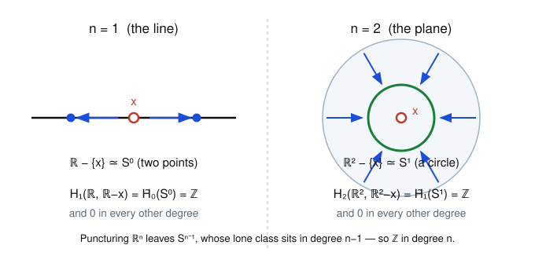

# Algebraic Topology · Lesson 4.5: Invariance of domain

> ⏱ ~15 min · Module 4: Exact Sequences, Cohomology & Applications · Builds on: [4.1 the LES of a pair](04-01-les-of-a-pair.md), [4.2 Mayer–Vietoris](04-02-mayer-vietoris.md), [4.3 degree & applications](04-03-degree-applications.md) · Unlocks: nothing — course complete

## Why this matters

Back in the topology course we quietly assumed something enormous: that "dimension" is a real property of a space, that $\mathbb{R}^2$ and $\mathbb{R}^3$ are *genuinely* different and not just drawn differently. Nobody could prove it there, because every tool point-set topology offers — cardinality, connectedness, compactness — refuses to tell $\mathbb{R}^2$ from $\mathbb{R}^3$ apart. The two have the same cardinality; both are connected, locally compact, and separable. And a continuous map really can smear a line all over a square (a space-filling curve). So the naive intuition "you obviously can't fold a line into a plane" is, taken literally, **false** — the honest version needs homology. This lesson pays that debt: homology proves $\mathbb{R}^m \cong \mathbb{R}^n \Rightarrow m = n$, and along the way proves Brouwer's **invariance of domain**, the theorem that makes "the interior of a manifold" a well-defined idea. It is the capstone: spaces became algebra, and now the algebra hands back a theorem no soft argument could reach.

## The idea

Homology of a whole space is a *global* number — $H_1(S^1) = \mathbb{Z}$ counts the one loop in the entire circle. But to detect **dimension** we need something *local*: a gadget you compute in a tiny neighborhood of a point that still knows how many directions there are around it.

That gadget is **local homology**: the relative homology $H_n\big(X,\,X\setminus\{x\}\big)$ of the space rel "the space with the point poked out." Intuitively it measures the homology of $X$ *as seen from $x$* — how the space is knit together immediately around that one point, blind to anything far away.

Here is why it sees dimension. Near a point of $\mathbb{R}^n$, deleting the point leaves a small **punctured neighborhood**, and a punctured $\mathbb{R}^n$ retracts onto a tiny sphere $S^{n-1}$ around the hole. The dimension $n$ is written all over that sphere: its one nontrivial reduced homology class lives in degree $n-1$. Feed it through the long exact sequence of the pair and that class lands one degree up — so $H_n(\mathbb{R}^n, \mathbb{R}^n\setminus\{x\}) = \mathbb{Z}$, sitting **exactly in degree $n$**, and $0$ everywhere else. The point's local homology is a single $\mathbb{Z}$ whose degree *is the dimension*. A homeomorphism must match these degree-for-degree — so it must match dimensions. That is the whole proof of dimension invariance, and invariance of domain is the same idea run in a compact ball.

## The formal version

**Definition (local homology).** For a space $X$ and a point $x\in X$, the **local homology of $X$ at $x$** is the family of relative groups
$$H_k\big(X,\, X\setminus\{x\}\big), \qquad k\ge 0.$$

*In words:* it is the homology you get after declaring everything except $x$ to be "zero" — the part of $X$'s structure concentrated at that single point.

By **excision** (an Eilenberg–Steenrod axiom, Lesson [3.5](03-05-eilenberg-steenrod-axioms.md)), these groups depend only on an arbitrarily small neighborhood of $x$: you may excise anything closed and away from $x$. So local homology is genuinely *local* — it cannot see the rest of the space.

**Computation (the load-bearing calculation).** For $n\ge 1$ and any point — take $x=0$ —
$$H_k\big(\mathbb{R}^n,\, \mathbb{R}^n\setminus\{0\}\big) \;\cong\; \begin{cases}\mathbb{Z}, & k=n,\\[2pt] 0, & k\neq n.\end{cases}$$

*In words:* every point of $\mathbb{R}^n$ carries one copy of $\mathbb{Z}$ of local homology, parked in degree $n$ — a topological tag reading off the dimension.

*Proof.* Run the long exact sequence of the pair $(\mathbb{R}^n, \mathbb{R}^n\setminus\{0\})$:
$$\cdots \to \tilde H_k(\mathbb{R}^n)\to H_k(\mathbb{R}^n,\mathbb{R}^n\setminus\{0\}) \xrightarrow{\ \partial\ } \tilde H_{k-1}(\mathbb{R}^n\setminus\{0\}) \to \tilde H_{k-1}(\mathbb{R}^n)\to\cdots$$
Since $\mathbb{R}^n$ is contractible, $\tilde H_*(\mathbb{R}^n)=0$, so the two outer terms vanish and the connecting map $\partial$ is an isomorphism:
$$H_k(\mathbb{R}^n,\mathbb{R}^n\setminus\{0\}) \;\cong\; \tilde H_{k-1}(\mathbb{R}^n\setminus\{0\}).$$
The radial retraction $x\mapsto x/\lvert x\rvert$ is a deformation retract of the punctured space onto the unit sphere, $\mathbb{R}^n\setminus\{0\}\simeq S^{n-1}$, and reduced homology is a homotopy invariant, so
$$H_k(\mathbb{R}^n,\mathbb{R}^n\setminus\{0\}) \;\cong\; \tilde H_{k-1}(S^{n-1}) \;=\; \begin{cases}\mathbb{Z}, & k-1=n-1,\\ 0,&\text{else,}\end{cases}$$
using $\tilde H_i(S^{n-1})=\mathbb{Z}$ for $i=n-1$ and $0$ otherwise (Lesson [4.2](04-02-mayer-vietoris.md); the case $n=1$ is $\tilde H_0(S^0)=\mathbb{Z}$). $\blacksquare$

**Corollary (invariance of dimension).** If $\mathbb{R}^m$ is homeomorphic to $\mathbb{R}^n$, then $m=n$. More generally $\mathbb{R}^m \not\cong \mathbb{R}^n$ whenever $m\neq n$.

*Proof.* A homeomorphism $h\colon \mathbb{R}^m \to \mathbb{R}^n$ carries $0$ to a point $p=h(0)$ and restricts to a homeomorphism of pairs $(\mathbb{R}^m,\mathbb{R}^m\setminus\{0\}) \to (\mathbb{R}^n,\mathbb{R}^n\setminus\{p\})$, so it induces isomorphisms $H_k(\mathbb{R}^m,\mathbb{R}^m\setminus\{0\}) \cong H_k(\mathbb{R}^n,\mathbb{R}^n\setminus\{p\})$ for all $k$. The left side is $\mathbb{Z}$ concentrated in degree $m$; the right (by translation-homogeneity of $\mathbb{R}^n$) is $\mathbb{Z}$ concentrated in degree $n$. A single $\mathbb{Z}$ can only match a single $\mathbb{Z}$ in the *same* degree, so $m=n$. $\blacksquare$

**Theorem (Invariance of Domain, Brouwer 1912).** Let $U\subseteq\mathbb{R}^n$ be open and $f\colon U\to\mathbb{R}^n$ continuous and **injective**. Then $f$ is an **open map**: $f(U)$ is open in $\mathbb{R}^n$, and $f\colon U\to f(U)$ is a homeomorphism.

*In words:* a continuous one-to-one image of an open piece of $\mathbb{R}^n$ inside $\mathbb{R}^n$ *of the same dimension* can't be squashed onto something lower-dimensional or pinched shut — it stays honestly open.

## Picture

Left, $n=1$: delete a point from the line and you get **two rays**, which retract to two points — a copy of $S^0$. Its reduced $H_0$ is $\mathbb{Z}$, so the local homology $H_1(\mathbb{R},\mathbb{R}\setminus\{x\})=\mathbb{Z}$ lives in degree $1$. Right, $n=2$: delete a point from the plane and the punctured plane retracts radially onto a small **circle** $S^1$; its $\tilde H_1=\mathbb{Z}$ pushes the local homology up to degree $2$. The sphere left behind by the puncture is $S^{n-1}$, and *its dimension is the memory of $n$* — that is the entire mechanism.

## Worked examples

**Example 1 (the calculation, and $\mathbb{R}^2 \not\cong \mathbb{R}^3$).** Compute $H_k(\mathbb{R}^3, \mathbb{R}^3\setminus\{0\})$ and separate the plane from $3$-space.

Following the boxed proof with $n=3$: $\mathbb{R}^3$ is contractible so $\partial$ gives $H_k(\mathbb{R}^3,\mathbb{R}^3\setminus 0)\cong \tilde H_{k-1}(\mathbb{R}^3\setminus 0)\cong \tilde H_{k-1}(S^2)$. Since $\tilde H_i(S^2)=\mathbb{Z}$ only at $i=2$,
$$H_k(\mathbb{R}^3,\mathbb{R}^3\setminus\{0\}) = \begin{cases}\mathbb{Z}, & k=3,\\ 0,&\text{else.}\end{cases}$$
Compare with $\mathbb{R}^2$, whose local homology (Example from the Picture) is $\mathbb{Z}$ in degree $2$. If some homeomorphism $\mathbb{R}^2\cong\mathbb{R}^3$ existed it would force $\mathbb{Z}$-in-degree-$2$ to be isomorphic to $\mathbb{Z}$-in-degree-$3$ — impossible, different degrees. So $\mathbb{R}^2 \not\cong \mathbb{R}^3$. The distinguishing feature was invisible to $\pi_0$: **removing a point disconnects neither** plane nor $3$-space, so the cheap connectedness argument (below, P2) is helpless here — you genuinely need the *degree* in which the $\mathbb{Z}$ appears.

**Example 2 (why space-filling curves don't threaten this).** Peano's curve is a **continuous surjection** $\gamma\colon [0,1]\twoheadrightarrow [0,1]^2$ — a $1$-dimensional interval smeared onto a solid square. Doesn't that "fold a line into a plane," contradicting dimension invariance?

No — and seeing why sharpens the theorem. Dimension invariance forbids a *homeomorphism* $\mathbb{R}^1\cong\mathbb{R}^2$, not a mere continuous surjection. Peano's $\gamma$ is wildly **non-injective**: it must revisit points (indeed uncountably many squares' worth of self-crossings), so it is nowhere near a homeomorphism. Could we at least make a continuous *bijection* $[0,1]\to[0,1]^2$? Also no: a continuous bijection from a compact space to a Hausdorff space is automatically a homeomorphism, which would give $[0,1]\cong[0,1]^2$ and (removing an interior point) contradict dimension invariance. So the escape valve is precisely injectivity: **continuity alone is far too floppy to preserve dimension; you must also forbid collisions.** That is exactly the hypothesis invariance of domain leans on.

**The proof strategy for invariance of domain (skeleton).** It suffices to show $f$ sends interior points to interior points — i.e. for each closed ball $D\subset U$ with boundary sphere $S=\partial D\cong S^{n-1}$, the image $f(\mathring D)$ of the open ball is open in $\mathbb{R}^n$. Compactify to the sphere: view $\mathbb{R}^n = S^n\setminus\{\infty\}$. Because $f|_D$ is a continuous injection on a compact set, it is a homeomorphism onto its image, so $f(D)\cong D^n$ is an embedded closed disk and $f(S)\cong S^{n-1}$ an embedded sphere. Now use the two homology facts about embeddings in $S^n$ (each proved by a Mayer–Vietoris induction, Lesson [4.2](04-02-mayer-vietoris.md)):

1. **Complement of an embedded disk is acyclic:** $\tilde H_i\big(S^n\setminus f(D)\big)=0$ for all $i$ — so $S^n\setminus f(D)$ is connected.
2. **Complement of an embedded $S^{n-1}$ has two pieces:** $\tilde H_0\big(S^n\setminus f(S)\big)=\mathbb{Z}$ — so $S^n\setminus f(S)$ has exactly *two* path-components.

But $S^n\setminus f(S) = f(\mathring D) \,\sqcup\, \big(S^n\setminus f(D)\big)$, a disjoint union of two connected sets (the first connected as a continuous image of the connected $\mathring D$, the second by fact 1). Two connected pieces, two components — so each piece **is** a whole component of the open set $S^n\setminus f(S)$. Components of an open subset of a manifold are open, hence $f(\mathring D)$ is open. Since such balls cover $U$ and $f$ is injective, $f(U)$ is open and $f$ is an open map, so a homeomorphism onto its image. $\blacksquare$

## Watch out

- **You might think** removing-a-point plus counting components already proves everything — but it only settles $\mathbb{R}^1$ versus $\mathbb{R}^{\ge 2}$ (deleting a point disconnects the line, nothing higher). To split $\mathbb{R}^2$ from $\mathbb{R}^3$ you need the *degree* the local $\mathbb{Z}$ sits in, not just whether it is nonzero. Local homology is the upgrade that works in all dimensions at once.
- **You might think** invariance of domain needs $f$ to be defined on all of $\mathbb{R}^n$, or to be surjective, or smooth — it needs none of that. Just: **open domain, same-dimensional target, continuous, injective.** Drop "open domain" and it fails: $t\mapsto(t,0)$ embeds $\mathbb{R}$ (as $\mathbb{R}^1$, an *open* set of $\mathbb{R}^1$) into $\mathbb{R}^2$ with image the non-open $x$-axis — legal, because the target dimension $2\neq 1$, so the theorem never applied.
- **You might think** "continuous image of open is open" in general — emphatically not; a constant map crushes an open set to a point. Openness of the image is special to *injective, equidimensional* maps, and that is the entire content of the theorem.
- **You might think** a continuous bijection is always a homeomorphism — false in general (it needs compactness or the like). It is exactly this gap that space-filling considerations exploit, and exactly what invariance of domain closes for open subsets of $\mathbb{R}^n$.

## One-liner

> Poke a hole at a point and measure the sphere left behind: its dimension $n-1$ is stamped into $H_n(\mathbb{R}^n,\mathbb{R}^n\setminus\{x\})=\mathbb{Z}$, and no homeomorphism can forge that stamp — so dimension is topological and open sets of $\mathbb{R}^n$ stay open.

## Problems

**P1 (🟢)** Compute $H_k(\mathbb{R}^4,\mathbb{R}^4\setminus\{p\})$ for all $k$ from the long exact sequence, and use the result together with the Picture's computation for $\mathbb{R}^2$ to prove $\mathbb{R}^2 \not\cong \mathbb{R}^4$.

**P2 (🟡)** Give the *cheap* proof that $\mathbb{R}^1\not\cong\mathbb{R}^n$ for every $n\ge 2$ using only path-components (equivalently $H_0$) of a once-punctured space — no local homology in higher degrees. Then explain in one sentence exactly where this argument stalls when you try it on $\mathbb{R}^2$ versus $\mathbb{R}^3$.

**P3 (🔴, optional)** *(Invariance of the boundary.)* Let $\mathbb{H}^n=\{x\in\mathbb{R}^n : x_n\ge 0\}$ be the closed half-space and let $0$ be the boundary point. Show $\mathbb{H}^n\setminus\{0\}$ is contractible, deduce $H_k(\mathbb{H}^n,\mathbb{H}^n\setminus\{0\})=0$ for **all** $k$, and conclude that no homeomorphism of $\mathbb{H}^n$ can carry the boundary point $0$ to an interior point. (This is why "the boundary of a manifold-with-boundary" is a topological notion.)

Solutions

**P1** By translation we may take $p=0$. In the LES of the pair $(\mathbb{R}^4,\mathbb{R}^4\setminus\{0\})$ the groups $\tilde H_*(\mathbb{R}^4)$ vanish ($\mathbb{R}^4$ is contractible), so the connecting map is an isomorphism $H_k(\mathbb{R}^4,\mathbb{R}^4\setminus 0)\cong \tilde H_{k-1}(\mathbb{R}^4\setminus 0)$. Radial retraction gives $\mathbb{R}^4\setminus 0\simeq S^3$, and $\tilde H_i(S^3)=\mathbb{Z}$ only for $i=3$, so
$$H_k(\mathbb{R}^4,\mathbb{R}^4\setminus\{0\}) = \begin{cases}\mathbb{Z},& k=4,\\ 0,&\text{else.}\end{cases}$$
The plane's local homology is $\mathbb{Z}$ in degree $2$. A homeomorphism $\mathbb{R}^2\cong\mathbb{R}^4$ would induce, at corresponding points, an isomorphism of local homology in every degree — forcing $\mathbb{Z}$-in-degree-$2$ to equal $\mathbb{Z}$-in-degree-$4$. These are $0$ in each other's active degree, so no such isomorphism exists and $\mathbb{R}^2\not\cong\mathbb{R}^4$. $\blacksquare$

**P2** Suppose $h\colon\mathbb{R}^1\to\mathbb{R}^n$ ($n\ge2$) were a homeomorphism, and set $p=h(0)$. Restricting to the complements of these points gives a homeomorphism $\mathbb{R}\setminus\{0\}\cong\mathbb{R}^n\setminus\{p\}$. But $\mathbb{R}\setminus\{0\}$ has **two** path-components (the two open rays), while $\mathbb{R}^n\setminus\{p\}$ is path-connected for $n\ge2$ (any two points can be joined by a path that detours around the single missing point, since a plane/space minus a point is still connected). A homeomorphism preserves the number of path-components — equivalently $\operatorname{rank}\tilde H_0 = 1$ on the left and $0$ on the right — contradiction. Hence $\mathbb{R}^1\not\cong\mathbb{R}^n$. $\blacksquare$

*Where it stalls:* for $\mathbb{R}^2$ versus $\mathbb{R}^3$ the punctured spaces are $\mathbb{R}^2\setminus\{p\}\simeq S^1$ and $\mathbb{R}^3\setminus\{p\}\simeq S^2$, and **both are path-connected** ($\tilde H_0=0$ for each), so the component count gives no contradiction — the difference has moved up into $H_1$ versus $H_2$, i.e. the *degree* of the surviving local class, which is precisely what full local homology tracks.

**P3** *Contractibility.* Fix the point $q=(0,\dots,0,1)\in\mathbb{H}^n\setminus\{0\}$. I claim $\mathbb{H}^n\setminus\{0\}$ is star-shaped with respect to $q$: for any $x\in\mathbb{H}^n\setminus\{0\}$ the segment $(1-t)x+tq$, $t\in[0,1]$, stays in $\mathbb{H}^n$ (convexity — its last coordinate is $(1-t)x_n+t\ge 0$) and never hits $0$. Indeed, writing $x=(x',x_n)$ with $x'\in\mathbb{R}^{n-1}$: if $x'\neq 0$ then the first $n-1$ coordinates $(1-t)x'$ vanish only at $t=1$, where the point is $q\neq 0$; if $x'=0$ then $x_n>0$ (as $x\neq 0$ and $x_n\ge0$), and the last coordinate $(1-t)x_n+t>0$ for all $t$. So the straight-line homotopy $H(x,t)=(1-t)x+tq$ contracts $\mathbb{H}^n\setminus\{0\}$ to $q$ within $\mathbb{H}^n\setminus\{0\}$; it is contractible.

*Local homology.* $\mathbb{H}^n$ is convex, hence contractible, so $\tilde H_*(\mathbb{H}^n)=0$; we just showed $\tilde H_*(\mathbb{H}^n\setminus\{0\})=0$ as well. In the LES
$$\tilde H_k(\mathbb{H}^n)\to H_k(\mathbb{H}^n,\mathbb{H}^n\setminus 0)\xrightarrow{\partial}\tilde H_{k-1}(\mathbb{H}^n\setminus 0)$$
both flanking groups vanish for every $k$, so $H_k(\mathbb{H}^n,\mathbb{H}^n\setminus\{0\})=0$ for all $k$.

*Conclusion.* Local homology is a homeomorphism-of-pairs invariant. At the boundary point $0$ it is $0$ in every degree; at an **interior** point $p$ of $\mathbb{H}^n$ a small ball around $p$ lies inside the open half-space, which looks locally like $\mathbb{R}^n$, so (by excision and the boxed computation) the local homology there is $\mathbb{Z}$ in degree $n$. A homeomorphism $\phi\colon\mathbb{H}^n\to\mathbb{H}^n$ would give $H_k(\mathbb{H}^n,\mathbb{H}^n\setminus\{0\})\cong H_k(\mathbb{H}^n,\mathbb{H}^n\setminus\{\phi(0)\})$; if $\phi(0)$ were interior the right side would be $\mathbb{Z}$ in degree $n$ while the left is $0$ — contradiction. So $\phi(0)$ is again a boundary point: the boundary is topologically intrinsic. $\blacksquare$

## Flashback

**From Lesson 4.3 (degree & local degree):** A smooth map $f\colon S^2\to S^2$ has a regular value $y$ whose preimage $f^{-1}(y)$ consists of exactly three points, at which the **local degrees** are $+1$, $+1$, and $-1$. (a) Compute $\deg f$. (b) Must $f$ be surjective? (c) Could $f$ be homotopic to the identity map of $S^2$?

Solution

**(a)** The degree equals the sum of the local degrees over the preimage of any regular value: $\deg f = (+1)+(+1)+(-1) = 1$.

**(b)** Yes. A map of nonzero degree is surjective: if $f$ missed a point $z\in S^2$, it would factor through $S^2\setminus\{z\}\cong\mathbb{R}^2$, which is contractible, forcing $f_*=0$ on $H_2$ and hence $\deg f=0$. Since $\deg f=1\neq 0$, no point is missed. (Equivalently, a non-surjective self-map of $S^n$ has degree $0$.)

**(c)** Yes, it *could* be. For self-maps of $S^n$ the degree is a **complete** homotopy invariant (Hopf's theorem): two maps $S^n\to S^n$ are homotopic iff they have equal degree. Since $\deg(\operatorname{id}_{S^2})=1=\deg f$, the map $f$ is homotopic to the identity. (Nothing in the local-degree data obstructs it — those $\pm1$'s are just one of many ways to realize total degree $1$.) $\blacksquare$

## Connections

- **Backward:** This is the LES of a pair (Lesson [4.1](04-01-les-of-a-pair.md)) and excision (Lesson [3.5](03-05-eilenberg-steenrod-axioms.md)) doing their most spectacular work — the connecting map $\partial$ turns "$\mathbb{R}^n$ is contractible" plus "$\mathbb{R}^n\setminus 0\simeq S^{n-1}$" (Lesson [4.2](04-02-mayer-vietoris.md)) into a dimension detector. The embedding lemmas behind invariance of domain are themselves Mayer–Vietoris inductions.
- **Backward / vindication:** this closes a promissory note from `topology`, where dimension and the point-set idea of an open embedding were used but could not be justified — the well-definedness of dimension was a *hunch* there and is a *theorem* here. It also completes the course's whole arc: **spaces $\to$ algebra $\to$ theorems soft methods can't reach.** With it, the syllabus's Dangerous Checklist is fully covered — Brouwer in all dimensions, degree, and now invariance of domain and dimension.
- **Sideways (`differential-geometry`):** invariance of domain is what lets manifolds have a well-defined dimension and a well-defined boundary (P3) independent of any chart or smooth structure — the bedrock under "an $n$-manifold locally looks like $\mathbb{R}^n$." The smooth version of dimension invariance is cheap (the derivative is a linear iso), but the *topological* statement, for merely continuous maps, is this homological theorem.
- **Sideways (`complex-analysis`):** invariance of domain is the topological shadow of the **open mapping theorem** — a non-constant holomorphic map is open. Complex analysis gets openness from the strong rigidity of holomorphicity in one variable; here we get it for *any* continuous injection in $\mathbb{R}^n$, from homology alone.
