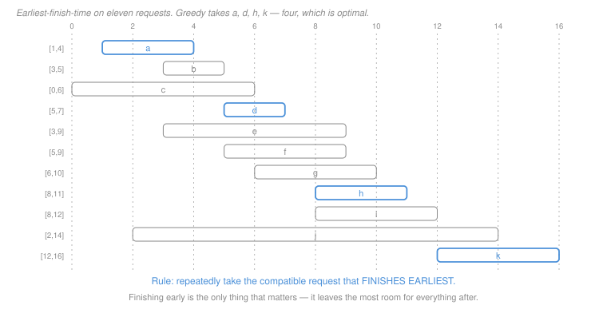

# Algorithms · Lesson 2.1: The greedy method & interval scheduling

> ⏱ ~15 min · Module 2: Greedy & dynamic programming · Builds on: [1.4 (sorting)](01-04-sorting-and-the-comparison-lower-bound.md) · Unlocks: 2.2 (Huffman coding)

## Why this matters

A greedy algorithm makes the choice that looks best right now and never reconsiders. It is the simplest design paradigm there is — usually a sort followed by one pass — and it is **usually wrong**.

That combination is what makes this lesson matter. Greedy algorithms are easy to write, easy to believe, and hard to falsify by testing, because a plausible-looking rule can be correct on every input you happen to try and still be wrong. The skill is not writing them; it is **deciding whether one is correct**, which means either producing a proof or producing a counterexample. Both are five-minute jobs once you know the moves, and this lesson gives you both.

This is exactly the judgement the field brief calls for. Given "here is a greedy heuristic for scheduling / caching / packing," the useful response is not "let me benchmark it" but "let me try to break it, and if I cannot, let me see whether the exchange argument goes through."

## The idea

**Interval scheduling.** You have $n$ requests for a single resource; request $i$ runs from $s_i$ to $f_i$. Two requests are **compatible** if they do not overlap. Find the largest set of mutually compatible requests.

Four greedy rules suggest themselves, and three are wrong:

| rule | intuition | correct? |
|---|---|---|
| earliest **start** time | begin as soon as possible | ✗ |
| **shortest** interval | small ones use less resource | ✗ |
| **fewest conflicts** | least disruptive choice | ✗ |
| earliest **finish** time | free the resource as soon as possible | ✓ |

The winner is not obviously the winner, and that is the point: intuition ranks these about equally. The reason **earliest finish time** works is worth stating in one sentence, because it is the whole idea:

> Finishing early is the only property that helps you later — it maximizes the time left for everything else.

Everything else you might optimize (starting early, being short, being uncontentious) is a proxy for that, and proxies break.

Two ways to prove a greedy rule correct, and you want both because they suit different problems:

- **Greedy stays ahead.** Show that after $k$ choices, greedy's $k$-th selection finishes no later than the $k$-th selection of *any* solution. Then greedy can never run out of room first.
- **[Exchange argument](../reference.md#exchange-argument).** Take an optimal solution, and show you can swap greedy's first choice into it without making it worse. Then induct on what remains.

Both appear below. When a greedy algorithm is *wrong*, neither proof closes — and the place it fails usually tells you what the counterexample looks like.

## The formal version

**Problem.** Given intervals $[s_1,f_1),\dots,[s_n,f_n)$, find a maximum-size subset that is pairwise disjoint.

**The algorithm.**

```
INTERVAL-SCHEDULE(intervals):
    sort intervals by finish time, so f_1 <= f_2 <= ... <= f_n
    A    <- empty set
    last <- -infinity
    for i <- 1 to n:
        if s_i >= last:              -- compatible with everything chosen
            add interval i to A
            last <- f_i
    return A
```

Sorting is $\Theta(n\log n)$ ([Lesson 1.4](01-04-sorting-and-the-comparison-lower-bound.md)) and the pass is $\Theta(n)$, so the whole algorithm is $\Theta(n\log n)$ — dominated by the sort, as greedy algorithms usually are.

**Theorem.** The earliest-finish-time rule returns a maximum-size compatible set.

*Proof (greedy stays ahead).* Let $g_1, \dots, g_k$ be greedy's picks in order, and let $o_1, \dots, o_m$ be any compatible set, also ordered by finish time. We show by induction that

$$f(g_r) \;\le\; f(o_r) \qquad \text{for every } r \le \min(k,m).$$

*Base* ($r = 1$): greedy picks the globally earliest-finishing interval, so $f(g_1) \le f(o_1)$.

*Step:* assume $f(g_{r-1}) \le f(o_{r-1})$. Since $o$ is compatible, $s(o_r) \ge f(o_{r-1}) \ge f(g_{r-1})$, so $o_r$ was still available to greedy when it made its $r$-th pick. Greedy takes the available interval finishing earliest, so $f(g_r) \le f(o_r)$.

Now suppose $m > k$. Then $o_{k+1}$ exists, and $s(o_{k+1}) \ge f(o_k) \ge f(g_k)$ — so $o_{k+1}$ was compatible with everything greedy had chosen and still unexamined when greedy stopped. But greedy only stops after examining every interval, and it would have taken $o_{k+1}$. Contradiction, so $m \le k$ and greedy is optimal. $\blacksquare$

*Proof (exchange argument), same theorem.* Let $O$ be an optimal solution and $g_1$ greedy's first pick, the globally earliest finisher. Let $o_1$ be $O$'s earliest finisher. Since $f(g_1) \le f(o_1)$, the set $O' = (O \setminus \{o_1\}) \cup \{g_1\}$ is still compatible — everything in $O$ after $o_1$ starts at or after $f(o_1) \ge f(g_1)$ — and $|O'| = |O|$, so $O'$ is also optimal and contains greedy's first choice. Recurse on the intervals starting at or after $f(g_1)$. $\blacksquare$

**The two proof shapes, abstractly.** *Stays ahead* proves an invariant comparing greedy to every solution at every step. *Exchange* modifies an optimum to look more like greedy without hurting it. Exchange generalizes better — it is what proves Huffman (2.2) and the MST cut property (2.3) — so it is worth becoming the more comfortable of the two.

## Picture



Greedy scans top to bottom — that is what "sorted by finish time" means — and takes anything that starts at or after the last thing it took. It picks $a\,[1,4)$, then skips $b$ and $c$ (both start before 4), takes $d\,[5,7)$, skips $e, f, g$, takes $h\,[8,11)$, skips $i, j$, takes $k\,[12,16)$.

Four intervals, and brute-force search over all $2^{11}$ subsets confirms four is optimal. Notice that greedy's answer is *not* the only optimum, and it never claims to be — greedy finds **a** maximum-size set, not a canonical one.

## Worked examples

**Example 1 (mechanical): running the rule.** The Picture's instance, in full:

$$a[1,4)\ \ b[3,5)\ \ c[0,6)\ \ d[5,7)\ \ e[3,9)\ \ f[5,9)\ \ g[6,10)\ \ h[8,11)\ \ i[8,12)\ \ j[2,14)\ \ k[12,16)$$

already sorted by finish time. Tracking `last`:

| step | consider | $s_i \ge$ `last`? | action | `last` |
|---|---|---|---|---|
| 1 | $a[1,4)$ | $1 \ge -\infty$ ✓ | take | 4 |
| 2 | $b[3,5)$ | $3 \ge 4$ ✗ | skip | 4 |
| 3 | $c[0,6)$ | $0 \ge 4$ ✗ | skip | 4 |
| 4 | $d[5,7)$ | $5 \ge 4$ ✓ | take | 7 |
| 5–7 | $e,f,g$ | start $3, 5, 6 < 7$ ✗ | skip | 7 |
| 8 | $h[8,11)$ | $8 \ge 7$ ✓ | take | 11 |
| 9–10 | $i,j$ | start $8, 2 < 11$ ✗ | skip | 11 |
| 11 | $k[12,16)$ | $12 \ge 11$ ✓ | take | 16 |

Result $\{a, d, h, k\}$, size 4. (Verified against exhaustive search: the optimum is 4.)

Note $c[0,6)$ and $j[2,14)$ — the two longest intervals — are both rejected, and rightly: $j$ alone would block six others. **Greedy's rule never looks at length**, and that is a feature.

**Example 2 (why you'd care): breaking the plausible rules.** Each wrong rule dies to a tiny instance, and constructing these is the skill worth having.

**Shortest interval first.** Take

$$A[0,10), \qquad B[9,11), \qquad C[10,20).$$

$B$ is the shortest (length 2), so greedy takes it — and $B$ overlaps both $A$ (at $9\!-\!10$) and $C$ (at $10\!-\!11$), so greedy gets **1**. The optimum is $\{A, C\}$, size **2**.

*The design of the counterexample:* make one short interval straddle the boundary between two long compatible ones. The rule optimizes for a proxy (size) that has nothing to do with the actual constraint (position).

**Earliest start time.** Take

$$A[0,20), \qquad B[1,3), \qquad C[4,6), \qquad D[7,9).$$

$A$ starts first, so greedy takes it and blocks everything: **1**. The optimum is $\{B, C, D\}$, size **3**.

*The design:* one interval that starts earliest and runs forever. Starting early tells you nothing about when the resource is freed.

**Fewest conflicts** is the interesting one — it is genuinely hard to break, and no counterexample exists among small random instances (a search over 40,000 of them found none). It needs a deliberate construction, which is P3.

**The general recipe for breaking a greedy rule:** identify the quantity the rule optimizes, then build an instance where that quantity is *anti-correlated* with the real objective. One greedy choice that scores well on the proxy while destroying two or more good options is enough.

## Watch out

- **You might think** testing a greedy rule on random inputs is evidence it works — **but actually** wrong greedy rules are often right on almost all inputs. Fewest-conflicts survives tens of thousands of random instances and is still wrong. Random testing can *refute* a rule if you are lucky; it can never confirm one, and the counterexamples that matter are usually structured, not random.
- **You might think** greedy returns *the* optimal solution — **but actually** it returns *an* optimal solution. In Example 1 there are several maximum-size sets and greedy names one. This matters when a downstream step assumes a particular answer, or when you compare two implementations and find they disagree while both being correct.
- **You might think** a small change to the problem preserves a greedy proof — **but actually** it usually destroys it. Give each interval a **weight** and ask for maximum total weight, and earliest-finish-time is immediately wrong: one heavy long interval can beat three light short ones. Weighted interval scheduling needs dynamic programming (Lesson 2.5), and no greedy rule solves it. **Re-run the proof whenever the objective changes.**

## One-liner

> Greedy commits locally and never looks back, which is why it needs a proof and not a benchmark — earliest-finish-time works because finishing early is the only thing that helps you later, and every other plausible rule optimizes a proxy you can build a counterexample against.

## Problems

**P1 (🟢)** Run the earliest-finish-time rule on

$$[1,3),\ [2,5),\ [4,7),\ [1,8),\ [6,9),\ [8,10),\ [9,11).$$

(a) List the intervals in the order the algorithm considers them. (b) Give the trace as a table (consider / compatible? / `last`). (c) State the answer and its size, and give one *different* maximum-size solution to confirm the optimum is not unique.

**P2 (🟡)** Three proposed rules. For each, either give a counterexample with at most four intervals (showing greedy's answer and the true optimum) or prove it correct. **At least one of them is correct** — decide which before you start hunting for counterexamples.

(a) **Longest interval first.**
(b) **Latest start time first.**
(c) "Sort by finish time as usual, but among ties in finish time prefer the *longer* interval." 

**P3 (🔴)** The **fewest-conflicts** rule repeatedly picks the remaining interval that overlaps the fewest other remaining intervals, discards everything overlapping it, and repeats. Consider this instance:

$$b_1[0,2)\quad b_2[4,6)\quad b_3[8,10)\quad b_4[12,14)$$
$$t_1[1,5)\quad t_1'[1,5)\quad t_1''[1,5)\qquad m[5,9)\qquad t_3[9,13)\quad t_3'[9,13)\quad t_3''[9,13)$$

(a) Compute the conflict count for each interval and identify greedy's first pick. (b) Continue the trace and give greedy's final answer and its size. (c) Give the optimum and its size. (d) Explain in two sentences what structural feature of this instance defeats the rule, and why random instances almost never have it.

<details>
<summary>Solutions</summary>

**P1** (a) Sorted by finish time:

$$[1,3),\ [2,5),\ [4,7),\ [1,8),\ [6,9),\ [8,10),\ [9,11).$$

(They are already given in that order.)

(b)

| step | consider | $s_i \ge$ `last`? | action | `last` |
|---|---|---|---|---|
| 1 | $[1,3)$ | $1 \ge -\infty$ ✓ | take | 3 |
| 2 | $[2,5)$ | $2 \ge 3$ ✗ | skip | 3 |
| 3 | $[4,7)$ | $4 \ge 3$ ✓ | take | 7 |
| 4 | $[1,8)$ | $1 \ge 7$ ✗ | skip | 7 |
| 5 | $[6,9)$ | $6 \ge 7$ ✗ | skip | 7 |
| 6 | $[8,10)$ | $8 \ge 7$ ✓ | take | 10 |
| 7 | $[9,11)$ | $9 \ge 10$ ✗ | skip | 10 |

(c) Greedy returns $\{[1,3),\ [4,7),\ [8,10)\}$, size **3**.

A different maximum-size solution: $\{[1,3),\ [4,7),\ [9,11)\}$ — also three, also compatible. So the optimum is not unique, and greedy names one of several.

**P2** (a) **Wrong.** Take

$$A[0,10), \qquad B[0,4), \qquad C[5,9).$$

Greedy takes $A$ (length 10), which overlaps both others: size **1**. Optimum $\{B, C\}$, size **2**. (Same shape as the earliest-start counterexample — one interval that swallows the timeline scores best on the proxy and is worst on the objective.)

(b) **Correct** — and this is the one worth pausing on, because it looks like it should fail the same way earliest-start does.

*Proof by time reversal.* Map every interval $[s, f)$ to $[-f, -s)$. This is a bijection on instances; it preserves compatibility (two intervals overlap iff their mirrors do) and therefore preserves the set of optimal solutions and their sizes. Under it, "latest start time" becomes "earliest finish time":

$$\text{maximize } s \quad\longleftrightarrow\quad \text{minimize } -s = f_{\text{mirror}}.$$

So running latest-start-first on an instance is exactly running earliest-finish-time on its mirror, which is optimal by the theorem. Hence latest-start-first is optimal too. $\blacksquare$

(Empirically confirmed: zero failures over 20,000 random instances — which is *consistent with* correctness but, per the first Watch out, is not what establishes it. The symmetry argument is.)

**The asymmetry worth noticing:** earliest-*start* is wrong and latest-*start* is right; latest-*finish* is wrong and earliest-*finish* is right. Time has a direction here only because the algorithm scans in one — the objective itself is time-symmetric, and the two correct rules are the same rule seen from the two ends.

(c) **Still correct**, and the tie-break is irrelevant.

The correctness proof only ever uses $f(g_r) \le f(o_r)$. When two intervals share a finish time, whichever greedy takes satisfies that inequality equally, and the resource is freed at the same instant either way — so no future choice is affected. Formally, in the exchange argument the swap of $o_1$ for $g_1$ needs only $f(g_1) \le f(o_1)$, which holds with equality.

(The longer of two intervals with the same finish time starts earlier, so it conflicts with more of the *past* — but the past is already fixed when greedy reaches it. Preferring the longer one is harmless, not helpful.)

**P3** (a) Conflict counts (over the full instance):

| interval | $[s,f)$ | conflicts |
|---|---|---|
| $b_1$ | $[0,2)$ | 4 |
| $t_1, t_1', t_1''$ | $[1,5)$ | 5 each |
| $b_2$ | $[4,6)$ | 5 |
| $\mathbf{m}$ | $\mathbf{[5,9)}$ | **3** |
| $b_3$ | $[8,10)$ | 5 |
| $t_3, t_3', t_3''$ | $[9,13)$ | 5 each |
| $b_4$ | $[12,14)$ | 4 |

Greedy's first pick is $\mathbf{m\,[5,9)}$, the unique minimum at 3.

(b) Taking $m$ discards everything overlapping it — namely $b_2[4,6)$ and $b_3[8,10)$. That is the damage: **two** of the four bottom intervals are gone in one move.

Remaining: $b_1, b_4, t_1, t_1', t_1'', t_3, t_3', t_3''$. Greedy continues, picking $b_1[0,2)$ (3 conflicts among the remainder), which discards the three $[1,5)$ copies; then one of the $[9,13)$ copies, which discards $b_4$. Final answer $\{m, b_1, t_3\}$, size **3**.

(c) The optimum is $\{b_1, b_2, b_3, b_4\} = \{[0,2), [4,6), [8,10), [12,14)\}$ — four pairwise disjoint intervals, size **4**. (Verified by exhaustive search.)

(d) **The structural feature:** the instance stacks *multiple parallel copies* of the intervals in two slots ($[1,5)$ three times, $[9,13)$ three times) purely to **inflate the conflict counts of their neighbours**. That makes $m$ — the one interval that destroys two members of the optimum — look locally safest, because its neighbours' counts were pumped up by intervals that were never going to be chosen anyway.

**Why random instances almost never have it:** the attack requires several intervals occupying nearly identical positions, which random endpoints produce only by coincidence, and it requires them placed exactly so as to depress one specific interval's relative count. Randomly generated instances have conflict counts that correlate well with how disruptive an interval actually is, so the proxy works — which is precisely why 40,000 random tests found no failure and a deliberate construction finds one immediately. **Testing samples the input space where the heuristic is good.**

</details>

## Flashback

**From Lesson 1.4 (Sorting & the comparison lower bound):** The interval-scheduling algorithm is $\Theta(n\log n)$, dominated by its sort.

(a) Could a cleverer implementation get it to $\Theta(n)$ by avoiding the sort? Argue either way. (b) If the intervals' finish times are known to be integers in $[0, 10n]$, does your answer change?

<details>
<summary>Solution</summary>

(a) **Not by a comparison-based method** — but the question is subtler than it looks, because interval scheduling is not sorting, so the $\Omega(n\log n)$ bound does not transfer automatically. You have to argue that solving the problem *would* let you sort.

Here is the argument. Suppose a comparison-based algorithm solved interval scheduling in $o(n\log n)$. Given $n$ distinct numbers $x_1,\dots,x_n$ to sort, build the intervals $[x_i - \tfrac13,\ x_i]$ — all of length $\tfrac13$, so no two overlap unless their $x$-values are within $\tfrac13$, and with distinct integers none overlap at all. Then every interval is compatible with every other, greedy returns all $n$... and reports them **in finish-time order**, which is sorted order. So a sub-$n\log n$ scheduler would give a sub-$n\log n$ comparison sort, contradicting [Lesson 1.4](01-04-sorting-and-the-comparison-lower-bound.md).

(This is a **reduction** — the technique Module 4 is built on, used here for a lower bound rather than for hardness: *sorting reduces to interval scheduling, so interval scheduling is at least as hard as sorting.*)

The reduction needs care: the algorithm must *output the schedule in order* for it to sort. An algorithm that returned the chosen set unordered would not immediately give a sort, and in fact the decision version ("how many intervals fit?") is not obviously $\Omega(n\log n)$ this way.

(b) **Yes, it changes.** With finish times integers in $[0, 10n]$ you can sort them in $\Theta(n)$ with counting sort — keys in a range linear in $n$, so $\Theta(n + k) = \Theta(n)$ ([Lesson 1.4](01-04-sorting-and-the-comparison-lower-bound.md)). The scheduling pass is already $\Theta(n)$, so the whole algorithm becomes $\Theta(n)$.

No contradiction with (a): counting sort is **not comparison-based**, so the reduction's conclusion — which only constrains comparison algorithms — does not apply. This is the same door the sorting lower bound always leaves open, and it is worth noticing that a *bound on the input values*, not a cleverer algorithm, is what opens it.

</details>

## Connections

- **Backward:** the algorithm is a sort plus a linear pass, so its cost is [Lesson 1.4's](01-04-sorting-and-the-comparison-lower-bound.md) $\Theta(n\log n)$, and the flashback shows that is not an accident. The correctness proofs are [induction](../../discrete-mathematics/lessons/01-04-induction-and-strong-induction.md) with a carefully chosen invariant, exactly as in Lesson 1.2's substitution proofs.
- **Forward:** the exchange argument here is the template for Huffman's optimality (2.2) and the MST cut property (2.3) — both are "swap greedy's choice into an optimum without hurting it." Lesson 2.5 takes the weighted version of this very problem, which no greedy rule solves, and does it by dynamic programming.
- **Sideways:** this is the abstract form of single-machine scheduling in [operations-research](../../operations-research/syllabus.md), and of admission control in a system with one resource. The "break it with a structured instance, not a random one" habit is the same one that makes [theory-of-computation 1.5's](../../theory-of-computation/lessons/01-05-pumping-lemma-and-non-regularity.md) adversary game work: the adversary chooses after seeing your rule.
