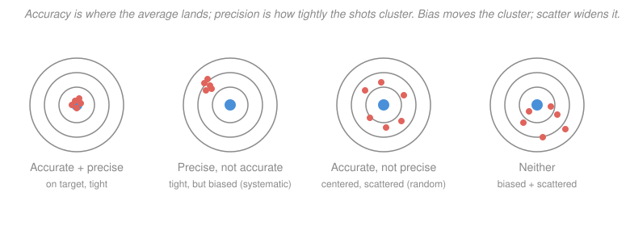

# Analytical & Instrumental Chemistry · Lesson 1.1: Accuracy, precision & significant figures

> ⏱ ~15 min · Module 1: Measurement, error & statistics · Builds on: [general-chemistry 2.1 The mole, molar mass & formulas](../../general-chemistry/lessons/02-01-mole-molar-mass-formulas.md) · Unlocks: 1.2 (statistics of measurement)

## Why this matters

Analytical chemistry has exactly one deliverable: **a number with a defensible claim about how good it is.** "The lead level is 12 ppb" is worthless; "12 ± 1 ppb" is a result you can act on — recall the product or clear it. Every instrument you'll meet in this course (spectrometer, electrode, chromatograph) hands you raw signal that you must convert into a concentration *and* an honest statement of its uncertainty. Before any of that, you need the two questions every measurement must answer — *is it right?* and *is it repeatable?* — and the bookkeeping rules that stop you from claiming digits you never actually measured. This lesson is that foundation; [1.2](01-02-statistics-of-measurement.md) turns the "repeatable" question into real statistics.

## The idea

Shoot five darts at a board. Two independent things can be true or false about your shots. **Accuracy** is whether the shots land on the *bullseye* — close to the true value. **Precision** is whether the shots land *near each other* — reproducible, regardless of where. They're separate axes: you can be tightly grouped in the wrong corner (precise but wrong), or scattered all around the center (right on average but sloppy).

Why care about the difference? Because the *cause* is different, and so is the *cure*. A tight cluster sitting off-center means something is pushing every shot the same way — a **bias**, a **systematic error**. That's a bent sight on the gun: find it and you can correct it. A loose scatter around the center means **random error** — a gust here, a twitch there, no fixed direction. You can't correct any single random miss, but you *can* shrink its effect by shooting more darts and averaging, and you can *quantify* it with statistics. The whole discipline of analytical chemistry is: hunt down and eliminate systematic errors, then use statistics to pin down what random error remains.

The last piece is honesty in the *writing down*. When your balance reads 0.6117 g, that final 7 is already a guess — the instrument is uncertain in its last place. So a measurement carries only so many trustworthy digits, its **significant figures**, and when you combine measurements the answer can't be more certain than the sloppiest ingredient. Report more digits than you earned and you're lying about your precision.

## The formal version

**Accuracy vs precision.** Let $x_\text{true}$ be the true (accepted) value and let $x_1,\dots,x_n$ be repeated measurements with mean $\bar x$.

- **Accuracy** = closeness of $\bar x$ to $x_\text{true}$. Quantified by **error**.
- **Precision** = closeness of the $x_i$ to each other (their scatter). Quantified by the standard deviation $s$ — the subject of [1.2](01-02-statistics-of-measurement.md).

*In words: accuracy asks "did we hit the truth?"; precision asks "did we get the same answer twice?"*

**Two kinds of error.**

- **Systematic error (determinate / bias):** shifts every measurement in the *same* direction by a roughly fixed amount. Sources: instrument (a miscalibrated balance or pipet), method (an incomplete reaction, an interfering species), personal (always reading a meniscus from above). It is *detectable and correctable* — run a blank, a standard, a reference method — and it degrades **accuracy**.
- **Random error (indeterminate):** scatters measurements in *both* directions unpredictably — electrical noise, tiny temperature drifts, the last-digit judgment call. It cannot be removed, only *characterized statistically*; it sets the **precision** and averages down like $1/\sqrt{n}$ (that's [1.2](01-02-statistics-of-measurement.md)).

*In words: systematic error has a direction and a fix; random error has neither — you can only measure how big it is.*

**Absolute and relative error.** For a single result,

$$E_\text{abs} = x_\text{meas} - x_\text{true}, \qquad E_\text{rel} = \frac{x_\text{meas} - x_\text{true}}{x_\text{true}}.$$

*In words: absolute error carries the units and the sign (too high is positive); relative error is that miss as a fraction of what you were aiming at.* Relative error is usually reported as a **percent** ($\times 100\,\%$) or as **parts per thousand** ($\mathrm{ppt}$, $\times 1000$) — a 1.6 % error is 16 ppt. Relative error is what lets you compare a balance to a spectrometer: 0.001 g is superb on a 5 g sample (0.02 %) and hopeless on a 0.002 g sample (50 %).

**Significant figures.** The significant figures of a measurement are all the digits known with certainty *plus* the first uncertain one (the last digit).

Counting rules:
- **Non-zero digits always count.** $34.7$ → 3.
- **Zeros between non-zeros count.** $30.07$ → 4.
- **Leading zeros never count** — they only set the decimal place. $0.00250$ → the $0.00$ is placeholders; **3** sig figs.
- **Trailing zeros count only if there's a decimal point.** $0.00250$ → the final $0$ is real, so 3 sig figs; but $2500$ is ambiguous (2–4) — write it as $2.50\times10^3$ to mean 3. **Scientific notation removes all ambiguity: every digit shown is significant.**

**Rounding — round half to even ("banker's rounding").** To drop digits: if the part discarded is less than half, round down; more than half, round up; *exactly* half (a lone 5 with nothing after), round so the last kept digit is **even**. So $43.55 \to 43.6$ (5 is odd, bump up) but $43.45 \to 43.4$ (4 is already even, stay). *In words: the "round 5 up" rule you learned biases every borderline case upward; rounding to even splits them evenly and keeps sums unbiased.*

**Significant-figure arithmetic.** The result can't be more certain than its least-certain input, but *which* measure of "certain" you track depends on the operation:

$$\boxed{\;\text{Add / subtract} \to \text{keep the fewest \emph{decimal places}.}\;}$$
$$\boxed{\;\text{Multiply / divide} \to \text{keep the fewest \emph{significant figures}.}\;}$$

*In words: addition lines up the decimal points, so the blurriest decimal place wins; multiplication scales relative uncertainties, so the fewest sig figs wins.* **Logarithms** get their own rule:

$$\text{In } \log_{10}(x)\text{, the number of decimal places in the answer} = \text{the number of sig figs in } x.$$

*In words: only the digits after the decimal point of a log (the **mantissa**) are significant; the digits in front (the **characteristic**) just encode the power of ten.* This is the pH rule, done carefully in Example 3.

**Guard digits.** Carry one or two extra digits through every intermediate step and round **only at the very end.** Rounding early injects a systematic error of your own making.

## Picture

The blue bullseye is $x_\text{true}$; each coral cluster is a set of repeated measurements. Reading left to right: shrinking the *scatter* is a precision fix (more/better replicates); moving the *cluster onto the center* is an accuracy fix (find the bias). A precise-but-biased method (second board) is the dangerous one — it looks trustworthy because it's reproducible, yet every answer is wrong the same way.

## Worked examples

**Example 1 (counting and rounding — the mechanics).** How many significant figures in each, and round each to 3?

| value | sig figs | why | rounded to 3 |
|---|---|---|---|
| $0.00408$ | 3 | leading zeros are placeholders; the middle 0 counts | $0.00408$ |
| $1.7250$ | 5 | trailing zero after a decimal is real | $1.72$ (drop 50: lone 5, keep-digit 2 is even → stay) |
| $1.7350$ | 5 | — | $1.74$ (drop 50: keep-digit 3 is odd → bump to 4) |
| $2.50\times10^{3}$ | 3 | scientific notation: all shown digits count | $2.50\times10^3$ |

The two middle rows are the round-half-to-even rule in action: identical except for one digit, they round in *opposite* directions so borderline cases don't all drift up.

**Example 2 (arithmetic — decimal places, then sig figs, in one calculation).** You weigh a solid **by difference** and make it up to volume. Empty vial $12.0032\ \mathrm{g}$; vial + sample $12.1145\ \mathrm{g}$; molar mass $105.99\ \mathrm{g/mol}$; dissolved and diluted to $100.0\ \mathrm{mL}$. Find the molarity.

*Step 1 — subtract (decimal-places rule).*
$$m = 12.1145 - 12.0032 = 0.1113\ \mathrm{g}.$$
Both inputs have 6 sig figs, but subtraction keeps 4 decimal places → $0.1113$ has only **4 sig figs**. Notice what just happened: subtracting two nearly equal numbers *destroyed* precision (6 sig figs in, 4 out). This "subtractive cancellation" is why analysts hate weighing a tiny sample as the small difference of two big masses.

*Step 2 — divide by molar mass (sig-figs rule).*
$$n = \frac{0.1113\ \mathrm{g}}{105.99\ \mathrm{g/mol}} = 1.05010\times10^{-3}\ \mathrm{mol} \;\;(\text{carry guard digits}).$$
The result is limited to 4 sig figs ($0.1113$).

*Step 3 — divide by volume (sig-figs rule).* $100.0\ \mathrm{mL} = 0.1000\ \mathrm{L}$ (4 sig figs):
$$c = \frac{1.05010\times10^{-3}\ \mathrm{mol}}{0.1000\ \mathrm{L}} = 1.05010\times10^{-2}\ \mathrm{M} \;\to\; \boxed{0.01050\ \mathrm{M}}.$$
Round **once**, at the end, to 4 sig figs. The whole answer's precision was set back in Step 1 by that subtraction — a good reason to weigh a *larger* sample when you can. (The mole/molar-mass machinery here is straight from [general-chemistry 2.1](../../general-chemistry/lessons/02-01-mole-molar-mass-formulas.md).)

## Watch out

- **You might think precise means correct.** It doesn't — the second dartboard is beautifully precise and completely wrong. Reproducibility only rules out *random* error; a systematic bias hides comfortably inside a tight cluster. Only a standard or reference method exposes it.
- **You might think trailing zeros are "just decoration."** $0.250$ has 3 sig figs and $0.25$ has 2 — the extra zero is a *claim* that you measured the thousandths place. Dropping it (or adding it) is falsifying your precision, in either direction.
- **You might count all the digits of a pH.** A pH of $3.57$ has **2** significant figures, not 3 — only the mantissa ($.57$) counts. Writing pH 3.5686 for a 2-sig-fig concentration claims a precision you never had.
- **You might round at every step.** Rounding intermediates is a self-inflicted systematic error. Keep guard digits; round once, at the end.

## One-liner

> Accuracy is hitting the truth and precision is hitting the same spot twice — bias kills the first, scatter kills the second — and significant figures are the promise never to report a digit you didn't measure.

## Problems

**P1 (🟢)** *(a)* Classify each error source as **systematic** or **random**: (i) a balance that reads 0.15 g high on every weighing; (ii) electrical noise in a detector; (iii) an analyst who always reads the buret meniscus from slightly above; (iv) small, uncontrolled room-temperature fluctuations during a run. *(b)* A titration gives $0.1067\ \mathrm{M}$ for a standard whose true value is $0.1050\ \mathrm{M}$. Find the absolute error and the relative error (as a percent and as ppt).

**P2 (🟡)** Report the molarity with the correct significant figures. A solid is weighed by difference: vial + sample $= 24.5731\ \mathrm{g}$, empty vial $= 23.9614\ \mathrm{g}$. Its molar mass is $105.99\ \mathrm{g/mol}$ ($\ce{Na2CO3}$). It is dissolved and diluted to $250.0\ \mathrm{mL}$. Track the sig-fig rule at each step and round only at the end.

**P3 (🔴)** *(a)* A solution has $[\ce{H+}] = 2.7\times10^{-4}\ \mathrm{M}$. Compute the pH with the correct number of decimal places. *(b)* Going the other way, a pH meter reads $10.42$; find $[\ce{H+}]$ with the correct number of significant figures. *(c)* Explain, in terms of characteristic vs mantissa, why the "2" or "3" in front of the decimal point of a pH does **not** count toward its significant figures.

Solutions

**P1** *(a)* (i) **systematic** — a fixed offset in one direction (instrument bias); correctable by recalibration. (ii) **random** — noise scatters both ways. (iii) **systematic** — a personal/parallax error that biases every reading the same way. (iv) **random** — uncontrolled, direction-less fluctuations.

*(b)* Absolute error:
$$E_\text{abs} = 0.1067 - 0.1050 = +0.0017\ \mathrm{M}\quad(\text{positive} = \text{measured too high}).$$
Relative error:
$$E_\text{rel} = \frac{0.0017}{0.1050} = 0.01619 = 1.6\,\%\ \ (\text{or } 16\ \mathrm{ppt}).$$
*Check.* $0.0017 \times 1000 = 1.7$, and $1.7/0.105 \approx 16$ ppt; $16\ \mathrm{ppt} = 1.6\,\%$ ✓.

**P2** *Step 1 — subtract (decimal places).*
$$m = 24.5731 - 23.9614 = 0.6117\ \mathrm{g}\quad(4\text{ decimal places} \Rightarrow 4\text{ sig figs}).$$
*Step 2 — divide by molar mass (sig figs).*
$$n = \frac{0.6117}{105.99} = 5.77130\times10^{-3}\ \mathrm{mol}\quad(\text{guard digits; limited to 4 sig figs}).$$
*Step 3 — divide by volume.* $250.0\ \mathrm{mL} = 0.2500\ \mathrm{L}$ (4 sig figs):
$$c = \frac{5.77130\times10^{-3}}{0.2500} = 2.30852\times10^{-2} \to \boxed{0.02309\ \mathrm{M}}.$$
Four sig figs throughout; rounded once at the end. *Check.* $0.02309 \times 0.2500 = 5.77\times10^{-3}$ mol, and $\times 105.99 = 0.6117$ g ✓.

**P3** *(a)*
$$\text{pH} = -\log(2.7\times10^{-4}) = -(\log 2.7 - 4) = -(0.4314 - 4) = 3.5686 \to \boxed{3.57}.$$
The argument has **2** sig figs, so the pH gets **2 decimal places**: $\text{pH} = 3.57$.

*(b)*
$$[\ce{H+}] = 10^{-10.42} = 10^{0.58}\times10^{-11} = 3.8\times10^{-11}\ \mathrm{M}.$$
The mantissa $.42$ has **2** decimal places, so $[\ce{H+}]$ gets **2 sig figs**: $3.8\times10^{-11}\ \mathrm{M}$. *Check.* $\log(3.8) = 0.58$, so $-\log(3.8\times10^{-11}) = 11 - 0.58 = 10.42$ ✓.

*(c)* Write $[\ce{H+}] = m \times 10^{-p}$. Then $\text{pH} = -\log([\ce{H+}]) = p - \log m$. The integer part in front of the decimal (the **characteristic**) is fixed by $p$ — the *power of ten*, i.e. the order of magnitude — which is exact positional information, not a measured quantity. Only the fractional part (the **mantissa**) depends on the coefficient $m$, and $m$ is the thing you actually measured to finite precision. So the precision of $[\ce{H+}]$ (its sig figs) lives entirely in the mantissa's decimal places. A pH of $3.57$ pins down $m = 2.7$ to two figures but says nothing "precise" about the $10^{-4}$ — that's just where the decimal point sits.

## Connections

- **Backward:** this rests on the mole/molar-mass/dilution arithmetic from [general-chemistry 2.1](../../general-chemistry/lessons/02-01-mole-molar-mass-formulas.md) — now every one of those numbers carries a sig-fig budget and a possible bias. The pH rule reuses acid–base ideas you'll formalize further in [general-chemistry 4.1](../../general-chemistry/lessons/04-01-acids-bases-ph-strength.md).
- **Forward:** [1.2 Statistics of measurement](01-02-statistics-of-measurement.md) turns "random error" into the mean $\bar x$, standard deviation $s$, and confidence interval $\bar x \pm t\,s/\sqrt{n}$; [1.3](01-03-propagation-of-uncertainty.md) propagates those uncertainties through exactly the kind of multi-step calculation in Example 2; [1.4](01-04-significance-tests-calibration.md) gives you the tools ($t$-tests, reference standards) to *catch* a systematic error.
- **Sideways (statistics):** the random-error / precision story is applied probability — the Gaussian and $t$-distribution from the statistics track (see the [prob-stat-refresher syllabus](../../prob-stat-refresher/syllabus.md)). The confidence interval in 1.2 *is* that distribution, wearing a lab coat.
