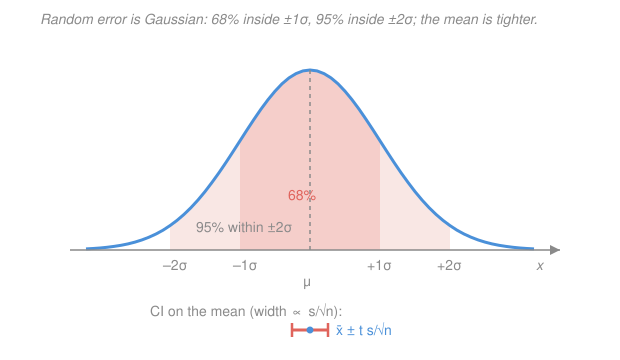

# Analytical & Instrumental Chemistry · Lesson 1.2: The statistics of a measurement

> ⏱ ~15 min · Module 1: Measurement, error & statistics · Builds on: [1.1 Accuracy, precision & significant figures](01-01-accuracy-precision-significant-figures.md), [`prob-stat-refresher`](../../prob-stat-refresher/syllabus.md) · Unlocks: [1.3 Propagation of uncertainty](01-03-propagation-of-uncertainty.md)

## Why this matters

A single measurement is a rumor. Measure the iron in a water sample once and you get a number with no honest way to say how much to trust it. Measure it five times and the *scatter* itself becomes data: it tells you the size of your random error, and from that you can quote a result the way a real analyst must — not "12.25 ppm" but "12.25 ± 0.11 ppm, 95% confident." Lesson 1.1 named accuracy and precision; this lesson gives you the machinery to *put a number on precision* and turn it into an error bar. Everything downstream — propagating uncertainty (1.3), deciding whether two results differ (1.4), reading a calibration line — runs on these four objects: the mean, the standard deviation, the standard error, and the confidence interval.

## The idea

Repeat a measurement and the values dance around a bit — the balance drifts, you read the meniscus slightly differently, electronic noise flickers. That dance is **random error**, and its defining feature is that it's *symmetric*: as likely to push you high as low. So if you average many readings, the highs and lows cancel and you close in on the truth. The average is your **best estimate**; how widely the individual readings scatter is your **standard deviation**; and — the key move — the average is far *more* reliable than any single reading, because the cancellation gets better the more you take.

The last piece is honesty about how sure you are. You never measured the *true* value μ; you measured a handful of samples and computed an average $\bar x$ that landed somewhere near it. A **confidence interval** is a bracket around $\bar x$ wide enough that the true μ is very probably inside. Its width shrinks as you collect more data — but only as $1/\sqrt{n}$, so buying precision gets expensive fast. That single square-root law governs the whole economics of measurement.

## The formal version

Take $n$ replicate measurements $x_1, x_2, \dots, x_n$ of the same quantity.

**Mean.** The best estimate of the true value is the arithmetic average

$$\bar x = \frac{1}{n}\sum_{i=1}^{n} x_i.$$

*In words: add them up, divide by how many.* This is your reported value.

**Sample standard deviation.** The spread of individual readings about the mean is

$$s = \sqrt{\frac{\sum_{i=1}^{n}(x_i - \bar x)^2}{\,n-1\,}}.$$

*In words: root-mean-square distance of the data from their own average.* The squared version $s^2$ is the **variance**. A small $s$ means tight, reproducible measurements (good precision); a large $s$ means a sloppy method.

**Why $n-1$ and not $n$?** You're measuring scatter *about $\bar x$*, but $\bar x$ was itself computed from the same data, so it sits in the middle of them by construction — the deviations $x_i - \bar x$ are always a little smaller than the deviations from the true μ would be. Dividing by $n$ would systematically *underestimate* the spread. The fix: you have $n$ numbers but "spent" one of them fixing the mean, leaving $n-1$ independent pieces of scatter information — the **degrees of freedom**. (With $n=1$ you get $0/0$: one point tells you *nothing* about spread, exactly right.)

**Relative standard deviation.** To compare precision across methods or magnitudes, scale $s$ by the mean:

$$\mathrm{RSD} = \frac{s}{\bar x}, \qquad \mathrm{RSD}\,(\%) = \frac{s}{\bar x}\times 100\%.$$

*In words: the standard deviation as a fraction of what you're measuring.* Also called the **coefficient of variation (CV)**. An RSD of 0.2% is excellent gravimetry; 5% might be fine for a trace instrument.

**The Gaussian (normal) distribution.** Random error, when it's the sum of many small independent jitters, follows the bell curve

$$P(x) = \frac{1}{\sigma\sqrt{2\pi}}\,\exp\!\left[-\frac{(x-\mu)^2}{2\sigma^2}\right],$$

with two parameters: the **population mean** μ (where it's centered — the true value) and the **population standard deviation** σ (its width). *In words: measurements pile up symmetrically around the truth, most close, few far.* The area under the curve within a band around μ is the probability of landing there:

$$\pm 1\sigma \to 68\%, \qquad \pm 2\sigma \to 95\%, \qquad \pm 3\sigma \to 99.7\%.$$

Your computed $\bar x$ and $s$ are the finite-sample *estimates* of the ideal μ and σ; with infinite data they'd converge to them.

**Standard error of the mean.** Here's the payoff. If single readings scatter with standard deviation $s$, the *average* of $n$ of them scatters much less:

$$s_{\bar x} = \frac{s}{\sqrt{n}}.$$

*In words: the uncertainty of the mean is the uncertainty of one reading, divided by the square root of how many you averaged.* This is why replication works — but the $\sqrt{n}$ is a harsh master: 4 measurements halve the error, 100 measurements only divide it by 10.

**Confidence interval for the mean.** We want a bracket around $\bar x$ that contains the true μ with a stated probability. If we knew σ exactly we'd use the Gaussian's 1.96 for 95%. But we only have $s$ estimated from few data, which adds its own uncertainty — so we use the slightly wider **Student's $t$** distribution:

$$\boxed{\;\mu = \bar x \pm \frac{t\,s}{\sqrt{n}}\;}$$

*In words: the true value lies within $t$ standard errors of your measured mean.* The multiplier $t$ depends on the **confidence level** you want and the **degrees of freedom** $n-1$ (fewer data → less certainty about $s$ → larger $t$). An excerpt (two-sided $t$):

| $\;$df $=n-1\;$ | 90% | 95% | 99% |
|:---:|:---:|:---:|:---:|
| 2  | 2.920 | 4.303 | 9.925 |
| 3  | 2.353 | 3.182 | 5.841 |
| 4  | 2.132 | 2.776 | 4.604 |
| 5  | 2.015 | 2.571 | 4.032 |
| 10 | 1.812 | 2.228 | 3.169 |
| $\infty$ | 1.645 | 1.960 | 2.576 |

Notice the bottom row: with infinite data, $t$ collapses onto the Gaussian $z$-values (1.960 for 95%). With only a few replicates, $t$ is markedly larger — small samples must pay an honesty tax.

## Picture

## Worked examples

**Example 1 (compute the three summaries).** Five replicate titrations give an analyte content of 20.42, 20.38, 20.46, 20.40, 20.44 (percent by mass).

Mean: $\bar x = \dfrac{20.42+20.38+20.46+20.40+20.44}{5} = \dfrac{102.10}{5} = 20.42\%$.

Deviations and their squares (in units of %²): $0, (-0.04)^2, (0.04)^2, (-0.02)^2, (0.02)^2 = 0, 0.0016, 0.0016, 0.0004, 0.0004$, summing to $0.0040$. Then

$$s = \sqrt{\frac{0.0040}{5-1}} = \sqrt{0.0010} = 0.032\%, \qquad \mathrm{RSD} = \frac{0.032}{20.42}\times 100\% = 0.15\%.$$

An RSD of 0.15% is tight, precise work — as you'd hope for a titration.

**Example 2 (turn scatter into an error bar).** Four measurements of iron in a water sample: 12.18, 12.34, 12.26, 12.22 ppm. Report the mean with a 95% confidence interval.

Mean: $\bar x = 49.00/4 = 12.25$ ppm. Standard deviation: deviations $-0.07, +0.09, +0.01, -0.03$; squares $0.0049, 0.0081, 0.0001, 0.0009$ sum to $0.0140$, so

$$s = \sqrt{\frac{0.0140}{3}} = 0.068\ \mathrm{ppm}, \qquad s_{\bar x} = \frac{0.068}{\sqrt 4} = 0.034\ \mathrm{ppm}.$$

With $n-1 = 3$ df, the 95% value is $t = 3.182$, so the half-width is $t\,s_{\bar x} = 3.182 \times 0.034 = 0.11$ ppm. Report:

$$\mu = 12.25 \pm 0.11\ \mathrm{ppm}\ (95\%).$$

That "± 0.11" is the whole point: a single reading of 12.18 or 12.34 would have looked equally authoritative and been quietly wrong about its own reliability.

## Watch out

- **You might think "95% CI" means there's a 95% chance μ is in *this* bracket.** In the strict frequentist reading, μ is a fixed number — it's either in or out. What's 95% is the *procedure*: if you repeated the whole experiment many times, 95% of the intervals you'd construct would capture μ. In practice analysts speak the loose way, but know the difference: the randomness lives in your interval, not in the truth.
- **You might reach for the Gaussian 1.96 for a handful of measurements.** With small $n$ you don't know σ; you're using $s$, which is itself uncertain. Use Student's $t$ (bigger than 1.96) until $n$ is large — and always pair $t$ with the right degrees of freedom $n-1$, not $n$.
- **You might confuse $s$ with $s_{\bar x}$.** The standard deviation $s$ describes how much *individual measurements* scatter and does **not** shrink with more data — it converges to σ, a fixed property of the method. The standard error $s_{\bar x} = s/\sqrt n$ describes how much the *mean* scatters and *does* shrink. Report $s$ to characterize the method; use $s_{\bar x}$ to build the error bar on your answer.
- **More replicates pay off slowly.** Because of the $1/\sqrt n$, going from 4 to 8 measurements shrinks the error bar by only about 30%. Beyond a point, chasing a smaller CI is wasted effort — reduce *systematic* error or improve the method instead.

## One-liner

> Random error is Gaussian, so the mean $\bar x$ is your best estimate, $s$ its scatter, and $\bar x \pm ts/\sqrt n$ its honest error bar — with the $1/\sqrt n$ setting the price of precision.

## Problems

**P1 (🟢)** A reference solution is analyzed four times for copper, giving 5.12, 5.18, 5.14, 5.20 mg/L. Compute the mean, the sample standard deviation, and the RSD (in %).

**P2 (🟡)** For the copper data in P1 ($n = 4$, so 3 degrees of freedom), compute the standard error of the mean and the 95% confidence interval. Use $t = 3.182$. Report the result to the correct number of significant figures.

**P3 (🔴)** You currently report a mean from $n = 4$ replicates. Your boss wants the 95% confidence interval *half as wide*. Ignoring the small change in $t$, how many total replicates must you run, and how many *additional* measurements is that? What does the answer say about the cost of precision?

Solutions

**P1** Mean: $\bar x = (5.12+5.18+5.14+5.20)/4 = 20.64/4 = 5.16$ mg/L.

Deviations: $-0.04, +0.02, -0.02, +0.04$; squares $0.0016, 0.0004, 0.0004, 0.0016$, sum $= 0.0040$ (mg/L)². Then

$$s = \sqrt{\frac{0.0040}{4-1}} = \sqrt{0.001333} = 0.0365 \approx 0.037\ \mathrm{mg/L}.$$

$$\mathrm{RSD} = \frac{0.0365}{5.16}\times 100\% = 0.71\%.$$

*Check.* $s$ is a small fraction of the mean, consistent with the sub-1% RSD; dividing by $n-1 = 3$ (not 4) slightly inflates $s$, as it should for a small sample. ✓

**P2** Standard error: $s_{\bar x} = s/\sqrt n = 0.0365/\sqrt 4 = 0.0365/2 = 0.0183\ \mathrm{mg/L}$.

Half-width of the interval: $t\,s_{\bar x} = 3.182 \times 0.0183 = 0.058\ \mathrm{mg/L}$. So

$$\mu = 5.16 \pm 0.06\ \mathrm{mg/L}\ (95\%).$$

The uncertainty rounds to the hundredths place, so the mean is quoted to the same place: $5.16 \pm 0.06$ mg/L. (Carry extra digits through the arithmetic; round only the final reported value.)

*Check.* The standard error (0.018) is half the standard deviation (0.037) because $\sqrt 4 = 2$ — averaging four readings halves the scatter of the mean, exactly the $1/\sqrt n$ law. ✓

**P3** The interval half-width is $t\,s/\sqrt n$, so with $t$ and $s$ held fixed the width scales as $1/\sqrt n$. To halve the width, $\sqrt n$ must double, so $n$ must **quadruple**:

$$\frac{1}{\sqrt{n_{\text{new}}}} = \frac{1}{2}\cdot\frac{1}{\sqrt{n_{\text{old}}}} \;\Longrightarrow\; n_{\text{new}} = 4\,n_{\text{old}} = 4\times 4 = 16.$$

That's 16 total, or **12 additional** measurements. (In reality $t$ *shrinks* going from df = 3 to df = 15, from 3.182 to 2.131, so you'd actually do slightly better than half — but the dominant effect is the fourfold $n$.)

Interpretation: precision from replication is expensive — each halving of the error bar costs *four times* the work, and the next halving costs sixteen times. Past a handful of replicates, the smart move is to attack systematic error or improve the method, not to keep re-measuring.

*Check.* $16 = 4^2$ and $\sqrt{16} = 4 = 2\times 2 = 2\sqrt 4$ ✓ — doubling $\sqrt n$ requires quadrupling $n$.

## Connections

- **Backward:** this quantifies the **precision** you met qualitatively in [1.1](01-01-accuracy-precision-significant-figures.md) — $s$ *is* precision as a number, and the "± 0.06" here is what sets the significant figures you learned to keep. The Gaussian, μ, σ, and Student's $t$ are the statistics from [`prob-stat-refresher`](../../prob-stat-refresher/syllabus.md); the confidence interval is that course's sampling distribution wearing a lab coat.
- **Forward:** [1.3 Propagation of uncertainty](01-03-propagation-of-uncertainty.md) takes these single-quantity uncertainties and asks how they combine when you add, multiply, or divide measured values (a concentration from mass ÷ volume). [1.4](01-04-significance-tests-calibration.md) uses $\bar x$, $s$, and $t$ to *test* whether two means genuinely differ or whether a method is biased.
- **Sideways:** every instrument reading later in the course — an absorbance, an electrode potential, a peak area — is a measurement with scatter, so this mean-and-CI machinery rides along under Beer's law, potentiometry, and chromatographic quantitation. The standard error is also what puts error bars on a calibration line's slope and intercept.
