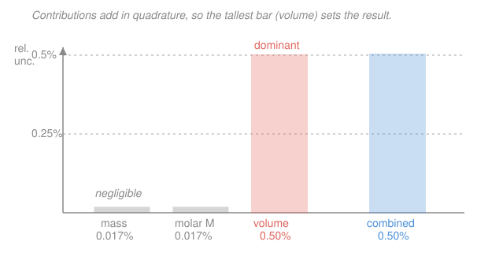

# Analytical & Instrumental Chemistry · Lesson 1.3: Propagation of uncertainty

> ⏱ ~15 min · Module 1: Measurement, error & statistics · Builds on: [1.2 Statistics of measurement](01-02-statistics-of-measurement.md) · Unlocks: [1.4 Significance tests & calibration](01-04-significance-tests-calibration.md)

## Why this matters

You almost never report the thing you measure. You weigh a mass, read a volume, look up a molar mass — then *combine* them into a concentration. Each input carries its own uncertainty (from [1.2](01-02-statistics-of-measurement.md)), and the question analytical chemistry lives or dies by is: **how much uncertainty ends up in the final number?** Get this wrong and you either over-trust a sloppy result or waste money buying precision where it doesn't help. Propagation of uncertainty answers it *and* tells you the single most valuable thing about any method — which step to fix first.

## The idea

Uncertainties don't just pile up by adding; they combine like the sides of a right triangle. If two independent random errors each nudge your result, they *rarely* nudge it the same direction at the same moment — sometimes they partly cancel. So you don't add them straight; you add their **squares** and take the square root, exactly like finding a hypotenuse: $c = \sqrt{a^2 + b^2}$. This is called adding **in quadrature**.

That one geometric fact has a giant consequence. In a right triangle with legs 5 and 1, the hypotenuse is $\sqrt{26} \approx 5.1$ — the short leg barely moved it. So when you combine a big uncertainty with a small one, **the big one wins and the small one nearly vanishes.** The largest contributor *dominates* the result. Find that dominant term and you've found the one knob worth turning to improve your whole method. Everything else in this lesson is bookkeeping around that idea.

## The formal version

Assume every input error is **random and independent** (no shared systematic bias — that's a different beast, handled in [1.4](01-04-significance-tests-calibration.md)). Let $s_x$ denote the uncertainty (a standard deviation) in a quantity $x$. Four rules cover almost everything:

**1. Addition / subtraction.** For $y = a + b$ or $y = a - b$, the **absolute** uncertainties add in quadrature:

$$s_y = \sqrt{s_a^2 + s_b^2}.$$

*In words: when you add or subtract, work in the raw units and combine as a hypotenuse.* Note subtraction uses $+$ inside the root too — errors don't cancel just because the quantities do.

**2. Multiplication / division.** For $y = ab$ or $y = a/b$, the **relative** uncertainties add in quadrature:

$$\frac{s_y}{y} = \sqrt{\left(\frac{s_a}{a}\right)^2 + \left(\frac{s_b}{b}\right)^2}.$$

*In words: when you multiply or divide, switch to fractional (percent) uncertainties, combine those as a hypotenuse, then multiply back by $y$ to get the absolute uncertainty.* The relative form $s_a/a$ is the natural currency of products.

**3. Powers.** For $y = a^n$ (with $n$ any fixed constant),

$$\frac{s_y}{y} = |n|\,\frac{s_a}{a}.$$

*In words: raising to a power multiplies the relative uncertainty by the exponent* — squaring doubles it, a square root halves it.

**4. Logs and exponentials.** For $y = \log_{10} a$,

$$s_y = 0.434\,\frac{s_a}{a};$$

and for $y = 10^{a}$,

$$\frac{s_y}{y} = 2.303\,s_a.$$

*In words: a log turns a relative uncertainty into an absolute one; an exponential does the reverse.* (The constants are $1/\ln 10 = 0.434$ and $\ln 10 = 2.303$.)

**The master rule (where all four come from).** For any smooth function $y = f(a, b, \dots)$ of independent variables,

$$s_y^2 = \left(\frac{\partial y}{\partial a}\right)^2 s_a^2 + \left(\frac{\partial y}{\partial b}\right)^2 s_b^2 + \cdots = \sum_i \left(\frac{\partial y}{\partial x_i}\right)^2 s_{x_i}^2.$$

*In words: each variable contributes its slope (how hard $y$ responds to it) times its uncertainty, and those contributions add in quadrature.* Rules 1–4 are just this formula with the partial derivatives worked out — e.g. for $y=ab$, $\partial y/\partial a = b$, and dividing through by $y=ab$ recovers the relative form.

**Dominant term.** Because contributions add as *squares*, the largest one swamps the rest. If one term is 3× another, it contributes 9× as much *variance*; the smaller barely registers. So: **compute each term's contribution, find the biggest, and attack it** — that is the highest-leverage move for improving any measurement.

## Picture

## Worked examples

**Example 1 (mechanical — the two everyday rules).**

*Difference.* You find an analyte mass by weighing a crucible full ($15.640 \pm 0.002$ g) and empty ($9.120 \pm 0.002$ g). The sample mass is $m = 15.640 - 9.120 = 6.520$ g, and by Rule 1:

$$s_m = \sqrt{0.002^2 + 0.002^2} = \sqrt{8\times10^{-6}} = 0.0028\ \mathrm{g}.$$

So $m = 6.520 \pm 0.003$ g. The two weighings' errors combined to $\sqrt2$ times one of them, *not* twice.

*Quotient.* A density is $\rho = m/V$ with $m = 6.520 \pm 0.003$ g and $V = 2.50 \pm 0.02$ mL. Switch to relative uncertainties (Rule 2):

$$\frac{s_\rho}{\rho} = \sqrt{\left(\frac{0.003}{6.520}\right)^2 + \left(\frac{0.02}{2.50}\right)^2} = \sqrt{(0.00046)^2 + (0.0080)^2} = 0.0080.$$

The mass term ($0.046\%$) vanished next to the volume term ($0.80\%$): the answer is $0.80\%$, essentially *all* volume. With $\rho = 6.520/2.50 = 2.608\ \mathrm{g/mL}$, the absolute uncertainty is $s_\rho = 0.0080 \times 2.608 = 0.021$, so $\rho = 2.61 \pm 0.02\ \mathrm{g/mL}$.

**Example 2 (the payoff — a molarity and its dominant term).** You prepare a standard by dissolving NaCl and diluting to volume. Concentration:

$$c = \frac{m}{M\,V},$$

with mass $m = 5.844 \pm 0.001$ g (analytical balance), molar mass $M = 58.44 \pm 0.01\ \mathrm{g/mol}$, and volume measured in a **graduated cylinder** $V = 100.0 \pm 0.5\ \mathrm{mL} = 0.1000 \pm 0.0005\ \mathrm{L}$.

First the value:

$$c = \frac{5.844}{58.44 \times 0.1000} = \frac{5.844}{5.844} = 1.000\ \mathrm{mol/L}.$$

Because $c$ is a pure product/quotient, use Rule 2 with all three relative uncertainties:

$$\frac{s_m}{m} = \frac{0.001}{5.844} = 1.7\times10^{-4}\ (0.017\%), \quad \frac{s_M}{M} = \frac{0.01}{58.44} = 1.7\times10^{-4}\ (0.017\%), \quad \frac{s_V}{V} = \frac{0.0005}{0.1000} = 5.0\times10^{-3}\ (0.50\%).$$

Combine:

$$\frac{s_c}{c} = \sqrt{(1.7\times10^{-4})^2 + (1.7\times10^{-4})^2 + (5.0\times10^{-3})^2} = \sqrt{2.9\times10^{-8} + 2.9\times10^{-8} + 2.50\times10^{-5}} = 5.0\times10^{-3}.$$

Look at what happened: the two mass-related terms contribute $2.9\times10^{-8}$ *each* to the variance, while volume contributes $2.50\times10^{-5}$ — nearly a thousand times more. The combined relative uncertainty, $0.50\%$, is indistinguishable from the volume term alone. The absolute uncertainty is $s_c = 5.0\times10^{-3} \times 1.000 = 0.005$, so

$$\boxed{c = 1.000 \pm 0.005\ \mathrm{mol/L}.}$$

**The dominant term is the volume.** Buying a more expensive balance would change the last number by nothing. Swapping the graduated cylinder for a $\pm0.08$ mL volumetric flask cuts $s_V/V$ from $0.50\%$ to $0.08\%$ and shrinks the whole result's uncertainty roughly sixfold. *That* is where the money goes. This "find the loudest term and fix it" reasoning is the single most useful habit in method development.

## Watch out

- **You might think subtraction lets errors cancel.** They don't — Rule 1 has a $+$ inside the root for both $a+b$ and $a-b$. Worse, subtracting two *nearly equal* big numbers ($15.640 - 15.630$) leaves a tiny difference whose *relative* uncertainty is huge. Subtracting close quantities is the classic uncertainty amplifier.
- **You might mix absolute and relative uncertainties.** Add/subtract works in *absolute* units; multiply/divide works in *relative* units. Never quadrature-sum a "0.001 g" against a "0.50 %" — convert to the same currency first, then apply the matching rule.
- **You might expect all terms to matter.** They almost never do. Quadrature is ruthless: a term $5\times$ smaller than the biggest contributes $1/25$ of the variance — round-off. Don't polish a $0.02\%$ step when a $0.5\%$ step sits next to it.

## One-liner

> Independent uncertainties combine as a hypotenuse — absolute for sums, relative for products — so the single largest term dominates, and finding it tells you exactly which step to fix.

## Problems

**P1 (🟢)** (a) A titration uses initial buret reading $2.14 \pm 0.02$ mL and final $38.65 \pm 0.02$ mL. Report the delivered volume with its uncertainty. (b) A rate is computed as $y = a/b$ with $a = 2.50 \pm 0.02$ and $b = 4.00 \pm 0.05$. Report $y$ with its absolute uncertainty.

**P2 (🟡)** You prepare a primary-standard solution of potassium hydrogen phthalate (KHP). You weigh $m = 0.4085 \pm 0.0002$ g, use molar mass $M = 204.22 \pm 0.01\ \mathrm{g/mol}$, and deliver it in $V = 20.00 \pm 0.03\ \mathrm{mL}$ from a pipet. Compute the molarity $c = m/(MV)$, its **relative** and **absolute** uncertainty, and name the dominant term.

**P3 (🔴)** A pH meter reads $\mathrm{pH} = 3.44 \pm 0.02$. Since $[\ce{H+}] = 10^{-\mathrm{pH}}$, compute $[\ce{H+}]$ and its uncertainty. What relative uncertainty does a mere $\pm0.02$ pH unit produce in the concentration, and what does that tell you about reading pH scales?

Solutions

**P1** (a) Difference of two readings, Rule 1 (absolute, in quadrature):
$$V = 38.65 - 2.14 = 36.51\ \mathrm{mL}, \qquad s_V = \sqrt{0.02^2 + 0.02^2} = \sqrt{8\times10^{-4}} = 0.028\ \mathrm{mL}.$$
So $V = 36.51 \pm 0.03\ \mathrm{mL}$. (Two $\pm0.02$ reads give $\pm0.028$, not $\pm0.04$.)

(b) Quotient, Rule 2 (relative, in quadrature):
$$\frac{s_y}{y} = \sqrt{\left(\frac{0.02}{2.50}\right)^2 + \left(\frac{0.05}{4.00}\right)^2} = \sqrt{(0.0080)^2 + (0.0125)^2} = \sqrt{6.40\times10^{-5} + 1.5625\times10^{-4}} = 0.0148.$$
With $y = 2.50/4.00 = 0.625$, the absolute uncertainty is $s_y = 0.0148 \times 0.625 = 0.0093 \approx 0.009$. So $y = 0.625 \pm 0.009$. (The $b$ term, $1.25\%$, dominates the $a$ term, $0.80\%$.)

**P2** Value first:
$$c = \frac{0.4085}{204.22 \times 0.02000} = \frac{0.4085}{4.0844} = 0.10001 \approx 0.1000\ \mathrm{mol/L}.$$
Relative uncertainties of each input:
$$\frac{s_m}{m} = \frac{0.0002}{0.4085} = 4.90\times10^{-4}\ (0.049\%), \quad \frac{s_M}{M} = \frac{0.01}{204.22} = 4.90\times10^{-5}\ (0.0049\%), \quad \frac{s_V}{V} = \frac{0.03}{20.00} = 1.50\times10^{-3}\ (0.15\%).$$
Combine (Rule 2):
$$\frac{s_c}{c} = \sqrt{(4.90\times10^{-4})^2 + (4.90\times10^{-5})^2 + (1.50\times10^{-3})^2} = \sqrt{2.40\times10^{-7} + 2.4\times10^{-9} + 2.25\times10^{-6}} = \sqrt{2.49\times10^{-6}} = 1.58\times10^{-3}.$$
So the relative uncertainty is $0.158\%$, and the absolute is $s_c = 1.58\times10^{-3} \times 0.1000 = 1.6\times10^{-4}$:
$$c = 0.1000 \pm 0.0002\ \mathrm{mol/L}.$$
**Dominant term: the volume** (pipet, $0.15\%$) — it supplies $2.25\times10^{-6}$ of the $2.49\times10^{-6}$ total variance, about $90\%$. Mass is a distant second; molar mass is negligible. To tighten this standard, deliver the volume more precisely, not weigh more carefully.

**P3** Here $[\ce{H+}] = 10^{a}$ with $a = -\mathrm{pH}$, so $s_a = s_{\mathrm{pH}} = 0.02$. Value:
$$[\ce{H+}] = 10^{-3.44} = 3.63\times10^{-4}\ \mathrm{mol/L}.$$
Exponential rule ($y = 10^a \Rightarrow s_y/y = 2.303\,s_a$):
$$\frac{s_{[\ce{H+}]}}{[\ce{H+}]} = 2.303 \times 0.02 = 0.0461\ (4.6\%), \qquad s_{[\ce{H+}]} = 0.0461 \times 3.63\times10^{-4} = 1.7\times10^{-5}.$$
So $[\ce{H+}] = (3.6 \pm 0.2)\times10^{-4}\ \mathrm{mol/L}$.

*Interpretation:* a tiny-looking $\pm0.02$ absolute uncertainty in pH becomes a $\pm4.6\%$ *relative* uncertainty in concentration — because pH is a **logarithm**, and the exponential that undoes it multiplies uncertainty by $2.303$. Every $0.01$ pH unit is worth about $2.3\%$ in $[\ce{H+}]$. That's why a pH read to only one decimal place can never pin a concentration tightly, and why careful electrode calibration ([1.4](01-04-significance-tests-calibration.md), and potentiometry in Module 3) matters so much.

## Flashback

**From Lesson 1.2 (Statistics of measurement):** Five replicate determinations of chloride in a water sample give (in mg/L): $24.3,\ 24.6,\ 24.1,\ 24.5,\ 24.4$. Compute the mean, the sample standard deviation $s$, and the $95\%$ confidence interval for the true mean. (Fresh data — recompute from scratch.)

Solution

Mean:
$$\bar x = \frac{24.3 + 24.6 + 24.1 + 24.5 + 24.4}{5} = \frac{121.9}{5} = 24.38\ \mathrm{mg/L}.$$

Deviations from the mean: $-0.08,\ +0.22,\ -0.28,\ +0.12,\ +0.02$; squares: $0.0064,\ 0.0484,\ 0.0784,\ 0.0144,\ 0.0004$, summing to $0.148$. Sample standard deviation (divide by $n-1 = 4$):
$$s = \sqrt{\frac{0.148}{4}} = \sqrt{0.037} = 0.19\ \mathrm{mg/L}.$$

For $n = 5$, degrees of freedom $= 4$, the two-tailed $95\%$ Student's-$t$ value is $t = 2.776$. The confidence interval is
$$\bar x \pm t\,\frac{s}{\sqrt n} = 24.38 \pm 2.776 \times \frac{0.19235}{\sqrt5} = 24.38 \pm 2.776 \times 0.0860 = 24.38 \pm 0.24\ \mathrm{mg/L}.$$

So we are $95\%$ confident the true chloride content lies in $(24.14,\ 24.62)\ \mathrm{mg/L}$. *Check:* with only 5 points, $t$ is well above the large-sample $1.96$, correctly widening the interval to reflect our thin data.

## Connections

- **Backward:** each input uncertainty $s_x$ is exactly the standard deviation from [1.2](01-02-statistics-of-measurement.md); propagation is what you do *after* you've characterized each measurement's spread. The quadrature sum is the same "variances add for independent quantities" fact that underlies the standard error $s/\sqrt n$ — averaging $n$ readings is just propagating uncertainty through a sum.
- **Forward:** [1.4 Significance tests & calibration](01-04-significance-tests-calibration.md) propagates uncertainty through a least-squares calibration line to put error bars on an unknown concentration — the dominant-term logic tells you whether the calibration or the sample limits your precision. Every quantitative result in Modules 2–4 (titer molarity, Beer's-law $c = A/\varepsilon b$, standard-addition intercepts) carries a propagated uncertainty built with these four rules.
- **Sideways:** the master formula $s_y^2 = \sum (\partial y/\partial x_i)^2 s_{x_i}^2$ is the statistics-of-error tool from probability (see the [`prob-stat-refresher`](../../prob-stat-refresher/syllabus.md)) — it's the linearized variance of a function of random variables. The log/exponential rule reappears in general chemistry whenever pH bridges to $[\ce{H+}]$ (the acid–base scale of [general-chemistry 4.1](../../general-chemistry/lessons/04-01-acids-bases-ph-strength.md)).
