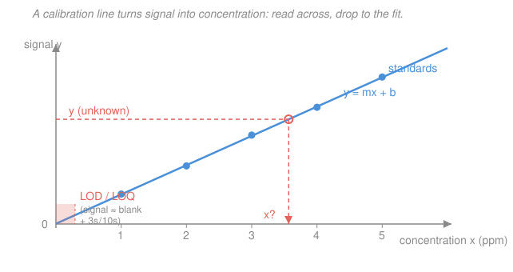

# Analytical & Instrumental Chemistry · Lesson 1.4: Significance tests & calibration

> ⏱ ~15 min · Module 1: Measurement, error & statistics · Builds on: [1.2 Statistics of measurement](01-02-statistics-of-measurement.md), [1.3 Propagation of uncertainty](01-03-propagation-of-uncertainty.md) · Unlocks: [2.1 Acid–base titration curves](02-01-acid-base-titration-curves.md)

## Why this matters

Every real analysis ends with a *decision*, and the numbers alone never make it for you. Your new method reads 12.6 ppm; the certified reference says 12.5. Different — or just noise? Two labs report different means: is one wrong, or are both fine? One replicate looks wild: toss it, or keep it? And the whole point of building an instrument is to convert a meter reading into a concentration *with an honest error bar*. This lesson is the toolkit that closes Module 1: **significance tests** (is this difference real?), **outlier rejection** (is this point trustworthy?), and **calibration** (signal → concentration → uncertainty). Everything downstream — titrations, spectrophotometry, chromatography — hangs a final answer on these four moves.

## The idea

A significance test is a courtroom. The **null hypothesis** $H_0$ is the defendant: "nothing special is going on — these two numbers are the same, and any gap is just random scatter." You presume innocence. Then you compute how *surprising* your data would be if $H_0$ were true, boil that surprise down to a single number (a **test statistic**), and compare it to a threshold (the **critical value** from a table). If your statistic clears the threshold, the data are too surprising to blame on chance — you **reject $H_0$** and call the difference *real* (statistically significant). If it doesn't clear the bar, you can't convict: you keep $H_0$, meaning "no evidence of a difference," which is *not* the same as proving they're identical.

The threshold encodes how careful you want to be. At the **95% confidence level** you accept a 5% chance of crying "difference!" when there really isn't one (a false positive). Demand 99% confidence and the bar rises — fewer false alarms, but you'll miss more genuine small effects. The recurring recipe is always the same: **compute a statistic, look up the critical value at your confidence level and degrees of freedom, compare.** Only the formula for the statistic changes with the question you're asking.

Calibration is the same statistics wearing a lab coat. You feed the instrument known standards, fit a straight line through signal-vs-concentration, then run that line *backward* to turn an unknown's signal into a concentration — carrying the line's scatter through as an error bar, exactly the propagation you did in [1.3](01-03-propagation-of-uncertainty.md).

## The formal version

Throughout, $\bar x$ is a sample mean, $s$ a sample standard deviation, $n$ a sample size, and **degrees of freedom** (df) count independent pieces of information left after estimating means — usually $n-1$ per sample. All the tables below are for **95% confidence** unless stated.

**One-sample $t$-test — mean vs. a known value.** You have $n$ replicates with mean $\bar x$ and standard deviation $s$; does $\bar x$ differ from a certified/true value $\mu_0$?

$$t = \frac{|\bar x - \mu_0|\sqrt{n}}{s}, \qquad \text{df} = n-1.$$

*In words: how many standard errors ($s/\sqrt n$) does the measured mean sit away from the target?* If $t > t_\text{crit}$, the difference is significant — your method has a **determinate error** (bias). This is the [1.2](01-02-statistics-of-measurement.md) confidence interval turned into a yes/no test: $t>t_\text{crit}$ is exactly the statement "$\mu_0$ lies outside the 95% CI $\bar x \pm t_\text{crit}\,s/\sqrt n$."

**Two-sample $t$-test — two means.** Do two methods (or samples), with means $\bar x_1,\bar x_2$, sizes $n_1,n_2$, differ? If their variances are *not* significantly different (check with the $F$-test first), pool them:

$$s_\text{pool} = \sqrt{\frac{(n_1-1)s_1^2 + (n_2-1)s_2^2}{n_1+n_2-2}}, \qquad t = \frac{|\bar x_1 - \bar x_2|}{s_\text{pool}\sqrt{\tfrac1{n_1}+\tfrac1{n_2}}}, \qquad \text{df} = n_1+n_2-2.$$

*In words: the gap between the two means, measured in units of their combined standard error.*

**$F$-test — two variances (precision).** Do two data sets scatter differently? Put the **larger** variance on top so $F\ge 1$:

$$F = \frac{s_1^2}{s_2^2} \quad (s_1 > s_2), \qquad \text{df} = (n_1-1,\, n_2-1).$$

*In words: the ratio of the two spreads; far from 1 means one method is genuinely noisier.* If $F < F_\text{crit}$, precisions are statistically the same — safe to pool for the two-sample $t$-test.

**Q-test — reject an outlier.** For a suspect value in a small data set, rank the values and compute

$$Q = \frac{|\text{suspect} - \text{nearest neighbor}|}{\text{range}}, \qquad \text{range} = x_\text{max} - x_\text{min}.$$

*In words: how big is the gap to the suspect, as a fraction of the total spread?* If $Q > Q_\text{crit}$, discard it; otherwise keep it. (Grubbs' test, $G = |\text{suspect}-\bar x|/s$, is the modern preferred alternative — same logic, uses the mean and $s$.) Never reject more than one point, and never reject a point just for being inconvenient.

**Critical-value excerpts (95%).**

| df | $t$ (two-tailed) | $t$ (one-tailed) |
|---:|:---:|:---:|
| 2 | 4.303 | 2.920 |
| 3 | 3.182 | 2.353 |
| 4 | 2.776 | 2.132 |
| 5 | 2.571 | 2.015 |
| 6 | 2.447 | 1.943 |
| 8 | 2.306 | 1.860 |
| 10 | 2.228 | 1.812 |
| ∞ | 1.960 | 1.645 |

| $F_\text{crit}$ (0.05, one-tailed) | $Q_\text{crit}$ (95%) |
|:---|:---|
| $F_{4,4}=6.39,\ \ F_{5,5}=5.05$ | $n{=}3\!:0.970,\ \ n{=}4\!:0.829$ |
| $F_{6,6}=4.28,\ \ F_{10,10}=2.98$ | $n{=}5\!:0.710,\ \ n{=}6\!:0.625,\ \ n{=}7\!:0.568$ |

**Linear least-squares calibration.** Fit $y = mx + b$ to $n$ standards $(x_i,y_i)$ by minimizing the summed squared vertical residuals. Define the sums of squares

$$S_{xx}=\sum(x_i-\bar x)^2,\quad S_{xy}=\sum(x_i-\bar x)(y_i-\bar y),\quad S_{yy}=\sum(y_i-\bar y)^2.$$

Then

$$\boxed{\,m=\frac{S_{xy}}{S_{xx}}, \qquad b=\bar y - m\bar x\,}$$

*In words: the slope is the co-variation of $x$ and $y$ divided by the spread of $x$; the line passes through the centroid $(\bar x,\bar y)$.* The scatter of the points about the line is the **residual standard deviation**

$$s_y=\sqrt{\frac{S_{yy}-m^2 S_{xx}}{\,n-2\,}} \qquad(\text{df}=n-2,\ \text{two params fitted}),$$

and the fraction of variation the line explains is $R^2 = S_{xy}^2/(S_{xx}S_{yy})$ (want $\ge 0.999$ for a good calibration).

**Unknown from its signal.** Measure the unknown $M$ times, mean signal $\bar y_u$. Invert the line:

$$x_u=\frac{\bar y_u-b}{m}, \qquad s_{x_u}=\frac{s_y}{m}\sqrt{\frac1M+\frac1n+\frac{(\bar y_u-\bar y)^2}{m^2 S_{xx}}}.$$

*In words: the concentration is signal-minus-intercept over slope; its uncertainty shrinks with more replicates ($M$), more standards ($n$), and unknowns read near the middle of the curve (the last term vanishes at $\bar y$).* Report the 95% CI as $x_u \pm t_\text{crit}\,s_{x_u}$ with df $=n-2$.

**Detection limits.** With $s_\text{blank}$ the standard deviation of blank (or low-standard) signals and $m$ the slope,

$$\text{LOD}=\frac{3\,s_\text{blank}}{m}, \qquad \text{LOQ}=\frac{10\,s_\text{blank}}{m}.$$

*In words: the smallest concentration whose signal pokes 3 (detect) or 10 (quantify reliably) blank-noise units above the blank.*

## Picture

## Worked examples

**Example 1 (one-sample $t$-test — is the method biased?).** A certified steel has $\mu_0 = 0.500\%$ Mn. Four replicates give $\bar x = 0.485\%$, $s = 0.011\%$.

$$t = \frac{|0.485-0.500|\sqrt4}{0.011} = \frac{0.015\times 2}{0.011} = 2.73.$$

With df $=3$, $t_\text{crit}=3.182$ (two-tailed, 95%). Since $2.73 < 3.182$, **do not reject $H_0$**: at 95% confidence there's no significant bias — the 0.015% gap is within noise. (At a looser 90% level the verdict could flip, which is why you fix the confidence level *before* peeking.)

**Example 2 ($F$-test then two-sample $t$-test — do two methods agree?).** Method 1: $n_1=5$, $\bar x_1=10.20$, $s_1=0.14$. Method 2: $n_2=5$, $\bar x_2=10.45$, $s_2=0.10$.

*Precision first.* $F = 0.14^2/0.10^2 = 0.0196/0.0100 = 1.96$. With df $(4,4)$, $F_\text{crit}=6.39$; $1.96<6.39$, so the precisions are statistically equal — pool them.

$$s_\text{pool}=\sqrt{\frac{4(0.0196)+4(0.0100)}{8}}=\sqrt{\frac{0.1184}{8}}=0.1217.$$

$$t=\frac{|10.20-10.45|}{0.1217\sqrt{\tfrac15+\tfrac15}}=\frac{0.25}{0.1217\times 0.6325}=\frac{0.25}{0.0770}=3.25.$$

df $=8$, $t_\text{crit}=2.306$. Since $3.25>2.306$, the methods **differ significantly** — same scatter, but a real gap in their means. Worth chasing a determinate error in one of them.

## Watch out

- **You might think failing to reject $H_0$ proves the two are equal.** It doesn't — it means you lack *evidence* of a difference. A tiny sample can hide a real bias behind a fat standard error. "Not significant" ≠ "identical."
- **You might read $R^2 = 0.999$ as proof the fit is perfect.** $R^2$ is easy to inflate and blind to curvature; a plot of *residuals* (should scatter randomly about zero) and the value of $s_y$ tell you far more about calibration quality.
- **You might Q-test away every point you dislike.** The test rejects at most **one** outlier, and only when $Q>Q_\text{crit}$. Serial pruning until the data look clean is fabricating precision. Two suspect points usually mean the *method* wobbled, not the points.
- **You might extrapolate the calibration line past the top standard.** The $s_{x_u}$ formula's last term blows up as you leave the center, and real detectors go nonlinear (Beer's law bends at high absorbance — [3.1](03-01-uv-vis-beers-law.md)). Bracket the unknown between standards.

## One-liner

> Every analytical decision is the same courtroom — compute a statistic, compare it to the table value at your confidence level — and calibration is that logic run backward: fit signal-vs-concentration, then invert the line and carry its scatter through as the error bar.

## Problems

**P1 (🟢)** Five replicate titrations give 12.47, 12.53, 12.56, 12.52, and 12.90 mL. (a) Q-test the suspect 12.90 mL value at 95% — keep or reject? (b) Using the surviving points, does the mean differ from the certified 12.50 mL at 95% (one-sample $t$-test)?

**P2 (🟡)** Two analysts assay the same sample (% purity). Analyst A ($n=5$): $\bar x_A=10.20$, $s_A=0.14$. Analyst B ($n=5$): $\bar x_B=10.45$, $s_B=0.10$. First $F$-test whether their *precisions* differ (95%), then two-sample $t$-test whether their *means* differ (95%). Interpret both verdicts together.

**P3 (🔴 — Boss-1 rehearsal)** Five Fe standards give absorbances: 1 ppm → 0.102, 2 → 0.198, 3 → 0.303, 4 → 0.398, 5 → 0.501. (a) Fit $y=mx+b$ and report $m$, $b$, $R^2$, and $s_y$. (b) An unknown read three times gives 0.353, 0.361, 0.357. Find its concentration and 95% CI. (c) Use a one-sample $t$-test (95%) to decide whether the unknown exceeds a 3.4 ppm limit. (d) Estimate the LOD and LOQ (take $s_\text{blank}\approx s_y$).

Solutions

**P1(a)** Rank: 12.47, 12.52, 12.53, 12.56, 12.90. Suspect 12.90; nearest neighbor 12.56; range $=12.90-12.47=0.43$.

$$Q=\frac{|12.90-12.56|}{0.43}=\frac{0.34}{0.43}=0.791.$$

For $n=5$, $Q_\text{crit}=0.710$. Since $0.791>0.710$, **reject** 12.90 mL — it's a genuine outlier.

**P1(b)** Survivors: 12.47, 12.53, 12.56, 12.52; $n=4$. Mean $\bar x=(12.47+12.53+12.56+12.52)/4=50.08/4=12.52$. Deviations $-0.05,+0.01,+0.04,0.00$; squared sum $=0.0025+0.0001+0.0016+0=0.0042$; $s=\sqrt{0.0042/3}=\sqrt{0.0014}=0.0374$.

$$t=\frac{|12.52-12.50|\sqrt4}{0.0374}=\frac{0.02\times2}{0.0374}=\frac{0.04}{0.0374}=1.07.$$

df $=3$, $t_\text{crit}=3.182$. Since $1.07<3.182$, **no significant difference** — the titration agrees with the certified 12.50 mL. (Note how tossing the outlier first was essential; keeping 12.90 would have inflated $s$ and hidden any real signal.)

**P2** *F-test.* $F=s_A^2/s_B^2=0.14^2/0.10^2=0.0196/0.0100=1.96$; df $(4,4)$, $F_\text{crit}=6.39$. $1.96<6.39$ → precisions are **not** significantly different; pool.

$$s_\text{pool}=\sqrt{\frac{4(0.0196)+4(0.0100)}{8}}=\sqrt{\frac{0.1184}{8}}=\sqrt{0.0148}=0.1217.$$

$$t=\frac{|10.20-10.45|}{0.1217\sqrt{1/5+1/5}}=\frac{0.25}{0.1217\times0.6325}=\frac{0.25}{0.0770}=3.25.$$

df $=8$, $t_\text{crit}=2.306$; $3.25>2.306$ → means **differ significantly**. *Together:* the two analysts are equally precise (same scatter) but disagree on the value — a determinate (systematic) error separates them, not random noise. One has an uncorrected bias worth hunting down.

**P3(a)** With $x=1..5$: $\bar x=3$, $\sum x^2=55$, so $S_{xx}=55-15^2/5=55-45=10$. Absorbances sum to $1.502$, $\bar y=0.3004$. $\sum x_iy_i=0.102+0.396+0.909+1.592+2.505=5.504$, so $S_{xy}=5.504-(15)(1.502)/5=5.504-4.506=0.998$. $\sum y_i^2=0.550822$, so $S_{yy}=0.550822-1.502^2/5=0.550822-0.451201=0.099621$.

$$m=\frac{S_{xy}}{S_{xx}}=\frac{0.998}{10}=0.0998,\qquad b=\bar y-m\bar x=0.3004-0.0998(3)=0.0010.$$

$$R^2=\frac{S_{xy}^2}{S_{xx}S_{yy}}=\frac{0.998^2}{10\times0.099621}=\frac{0.996004}{0.996210}=0.99979.$$

$$s_y=\sqrt{\frac{S_{yy}-m^2S_{xx}}{n-2}}=\sqrt{\frac{0.099621-(0.0998)^2(10)}{3}}=\sqrt{\frac{0.099621-0.099600}{3}}=\sqrt{\frac{0.0000208}{3}}=0.00263.$$

So $y=0.0998\,x+0.0010$, $R^2=0.9998$, $s_y=0.0026$ absorbance units — an excellent line.

**P3(b)** $\bar y_u=(0.353+0.361+0.357)/3=1.071/3=0.357$; $M=3$.

$$x_u=\frac{\bar y_u-b}{m}=\frac{0.357-0.0010}{0.0998}=\frac{0.356}{0.0998}=3.567\ \mathrm{ppm}.$$

$$s_{x_u}=\frac{s_y}{m}\sqrt{\frac1M+\frac1n+\frac{(\bar y_u-\bar y)^2}{m^2S_{xx}}}=\frac{0.00263}{0.0998}\sqrt{\frac13+\frac15+\frac{(0.357-0.3004)^2}{(0.0998)^2(10)}}.$$

Inside the root: $0.3333+0.2000+\dfrac{0.0566^2}{0.09960}=0.3333+0.2000+\dfrac{0.003204}{0.09960}=0.3333+0.2000+0.0322=0.5655$; $\sqrt{}=0.7520$. And $s_y/m=0.00263/0.0998=0.02637$. So $s_{x_u}=0.02637\times0.7520=0.01983\ \mathrm{ppm}$.

95% CI, df $=n-2=3$, $t_\text{crit}=3.182$:

$$x_u=3.567\pm 3.182(0.01983)=3.567\pm0.063\ \mathrm{ppm}\quad\Rightarrow\quad(3.50,\ 3.63)\ \mathrm{ppm}.$$

**P3(c)** Test $x_u$ against the limit $\mu_0=3.4$ ppm using the calibration uncertainty $s_{x_u}$ (one-tailed — we ask only whether it *exceeds*):

$$t=\frac{x_u-\mu_0}{s_{x_u}}=\frac{3.567-3.4}{0.01983}=\frac{0.167}{0.01983}=8.4.$$

df $=3$, one-tailed $t_\text{crit}=2.353$. Since $8.4>2.353$, the unknown **significantly exceeds 3.4 ppm** at 95%. (Consistent with the CI: its entire 95% interval, $3.50$–$3.63$, sits above 3.4.)

**P3(d)** Taking $s_\text{blank}\approx s_y=0.00263$ and $m=0.0998$:

$$\text{LOD}=\frac{3(0.00263)}{0.0998}=0.079\ \mathrm{ppm},\qquad \text{LOQ}=\frac{10(0.00263)}{0.0998}=0.263\ \mathrm{ppm}.$$

The method detects Fe down to $\sim0.08$ ppm and quantifies it reliably above $\sim0.26$ ppm — well below the unknown, so the 3.567 ppm result is solidly in the quantitative range.

## Flashback

**From Lesson 1.3 (Propagation of uncertainty):** You weigh $0.2500 \pm 0.0002\ \mathrm{g}$ of $\ce{Na2CO3}$ ($M=105.99\ \mathrm{g/mol}$, taken as exact) and dissolve it to $250.0 \pm 0.3\ \mathrm{mL}$. Report the molar concentration with its absolute uncertainty.

Solution

Concentration $c=\dfrac{m}{M\,V}$ — a pure product/quotient, so **relative** uncertainties add in quadrature.

$$c=\frac{0.2500}{105.99\times0.2500\ \mathrm{L}}=\frac{0.2500}{26.498}=9.435\times10^{-3}\ \mathrm{mol/L}.$$

Relative uncertainties: mass $\dfrac{0.0002}{0.2500}=0.00080$; volume $\dfrac{0.3}{250.0}=0.00120$ (mass is exact, contributes nothing).

$$\frac{s_c}{c}=\sqrt{0.00080^2+0.00120^2}=\sqrt{6.4\times10^{-7}+1.44\times10^{-6}}=\sqrt{2.08\times10^{-6}}=0.00144.$$

$$s_c=0.00144\times9.435\times10^{-3}=1.36\times10^{-5}\ \mathrm{mol/L}.$$

So $c=(9.435\pm0.014)\times10^{-3}\ \mathrm{mol/L}$, i.e. $9.435\pm0.014\ \mathrm{mM}$. The volume (bigger relative uncertainty) dominates the error — improving the balance further wouldn't help; a better-calibrated flask would.

## Connections

- **Backward:** the one-sample $t$-test is the [1.2](01-02-statistics-of-measurement.md) confidence interval flipped into a decision — "$\mu_0$ outside the CI" *is* "$t>t_\text{crit}$." The calibration error bar $s_{x_u}$ is [1.3](01-03-propagation-of-uncertainty.md)'s propagation applied to the inverted line, and $s_y,\ s_\text{pool}$ are the pooled-variance idea from [1.2](01-02-statistics-of-measurement.md). This closes Module 1 and feeds directly into **Boss Problem 1**.
- **Forward:** every method from here on ends in one of these tests. Titration endpoints ([2.1](02-01-acid-base-titration-curves.md)) get precision from replicate $s$; Beer's-law spectrophotometry ([3.1](03-01-uv-vis-beers-law.md)) *is* this calibration line, with curvature at high $A$; standard-addition ([3.4](03-04-voltammetry-standard-addition.md)) is the same least-squares fit extrapolated to the $x$-intercept for matrix-matched samples; method validation ([4.5](04-05-sampling-method-validation.md)) reports LOD/LOQ and bias with exactly these tools.
- **Sideways:** the $t$- and $F$-distributions and the "reject $H_0$" machinery are the hypothesis-testing core of statistics — see the [`prob-stat-refresher` syllabus](../../prob-stat-refresher/syllabus.md); least-squares regression is the same normal-equations minimization used everywhere from econometrics to physics curve-fitting.
