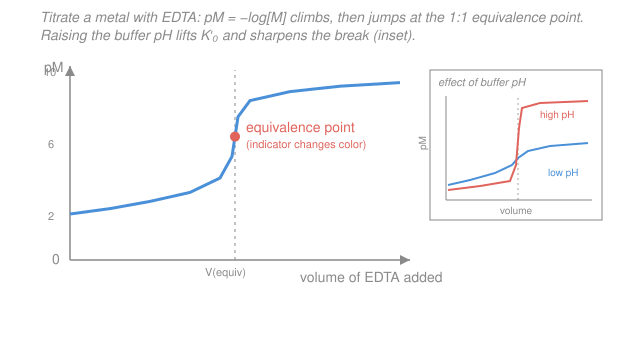

# Analytical & Instrumental Chemistry · Lesson 2.2: Complexometric (EDTA) titrations

> ⏱ ~15 min · Module 2: Equilibria, titrimetry & gravimetry · Builds on: [2.1 Acid–base titration curves](02-01-acid-base-titration-curves.md), [`general-chemistry` 3.4 (equilibrium & Le Chatelier)](../../general-chemistry/lessons/03-04-chemical-equilibrium-k-le-chatelier.md) · Unlocks: [2.3 Solubility & gravimetric analysis](02-03-solubility-gravimetric-analysis.md)

## Why this matters

How much calcium is in your tap water? How much lead in a paint sample, nickel in an alloy, magnesium in a supplement? For metal ions the workhorse titration isn't acid–base — it's **complexometric**: you titrate the metal with a molecule that wraps around it and locks it up. One reagent, **EDTA**, does this for nearly the entire periodic table of metal cations, in a clean 1:1 ratio, with a formation constant so huge the endpoint is razor-sharp. The catch — and the whole art of the method — is that EDTA is also a weak polyprotic acid, so its grabbing power depends on pH. Master that one wrinkle and you can quantify a metal to three significant figures with a burette and a color-change dye. This lesson is also your first taste of a **conditional constant**: a real equilibrium constant rescaled to account for a competing side reaction, a trick you'll reuse in solubility ([2.3](02-03-solubility-gravimetric-analysis.md)) and redox ([2.4](02-04-redox-equilibria-titrations.md)).

## The idea

Picture EDTA as a six-armed claw. Its full name (ethylenediaminetetraacetic acid) hides the useful fact: it has **six** electron-donating sites — four carboxylate oxygens and two amine nitrogens — that all fold in around a single metal ion at once. A ligand that grips at several points is a **chelate** (Greek *chele*, crab's claw), and because it clamps from all sides it forms an extraordinarily stable cage: one EDTA, one metal, always **1:1**, no matter the metal's charge. That 1:1 stoichiometry is why the arithmetic is trivial — moles of EDTA at the endpoint equals moles of metal, full stop.

Because the cage is so stable, the reaction runs essentially to completion, so the titration curve has a sharp cliff at the equivalence point — exactly like the strong-acid/strong-base curve from [2.1](02-01-acid-base-titration-curves.md), except we plot **pM** $= -\log[\text{free metal}]$ instead of pH. As you add EDTA, free metal gets mopped up, [M] plummets, and pM leaps.

The one complication: EDTA only clamps well in its **fully deprotonated** form, $\ce{Y^4-}$. At low pH those carboxylate arms are protonated (busy holding H⁺ instead of metal), so only a slice of the EDTA is in fighting shape. Raise the pH and you free up the arms. So every EDTA titration is run in a **pH buffer**, and we bookkeep the "only a fraction is active" problem with a single rescaled constant. Higher pH means more active EDTA and a sharper endpoint — but push the pH too high and the metal quietly precipitates as its hydroxide before EDTA can reach it. The sweet spot is a buffer that keeps enough EDTA active without dropping the metal out of solution.

## The formal version

**The complexation reaction.** For a metal ion of charge $n+$,

$$\ce{M^{n+} + Y^4- -> MY^{(n-4)}},$$

where $\ce{Y^4-}$ is fully deprotonated EDTA. *In words: one metal plus one fully-stripped EDTA gives one complex — always 1:1.* Its stability is the **formation constant** (or stability constant)

$$K_f = \frac{[\ce{MY}]}{[\ce{M}][\ce{Y}]}.$$

*In words: how strongly the cage holds together — big $K_f$ means the complex barely dissociates.* These are enormous: $\log K_f = 8.8$ for $\ce{Mg^2+}$, $10.7$ for $\ce{Ca^2+}$, $16.5$ for $\ce{Pb^2+}$, $18.8$ for $\ce{Ni^2+}$. A constant of $10^{10}$ or more means the reaction is effectively complete at the equivalence point — the cliff is sharp.

**The pH problem — the fraction $\alpha_{Y^{4-}}$.** EDTA in water is a soup of seven species: $\ce{H6Y^2+}, \ce{H5Y+}, \ce{H4Y}, \ce{H3Y-}, \ce{H2Y^2-}, \ce{HY^3-}, \ce{Y^4-}$, set by its acid dissociation constants (the last two $\mathrm{p}K_a$ are $6.16$ and $10.24$). Only the last, $\ce{Y^4-}$, complexes strongly. Define the fraction of *all* free EDTA that is in that form:

$$\alpha_{Y^{4-}} = \frac{[\ce{Y^4-}]}{C_{\text{EDTA}}}, \qquad C_{\text{EDTA}} = [\ce{H6Y^2+}] + \cdots + [\ce{Y^4-}].$$

*In words: of every EDTA molecule not yet bound to metal, what fraction is fully deprotonated and ready to grab?* This fraction is fixed by pH alone (a tabulated number):

| pH | 3 | 5 | 6 | 7 | 8 | 9 | 10 | 11 | 12 |
|----|----|----|----|----|----|----|----|----|----|
| $\alpha_{Y^{4-}}$ | $2.5\times10^{-11}$ | $3.5\times10^{-7}$ | $2.2\times10^{-5}$ | $4.8\times10^{-4}$ | $5.4\times10^{-3}$ | $5.2\times10^{-2}$ | $0.35$ | $0.85$ | $0.98$ |

It climbs steeply with pH — near-zero in acid, near-one in strong base.

**The conditional formation constant.** In a *buffered* solution pH is held constant, so $\alpha_{Y^{4-}}$ is a constant too. Fold it into $K_f$. Since $[\ce{Y^4-}] = \alpha_{Y^{4-}} C_{\text{EDTA}}$,

$$K_f = \frac{[\ce{MY}]}{[\ce{M}]\,\alpha_{Y^{4-}} C_{\text{EDTA}}} \quad\Longrightarrow\quad \boxed{\,K_f' = \alpha_{Y^{4-}}\,K_f = \frac{[\ce{MY}]}{[\ce{M}]\,C_{\text{EDTA}}}\,}$$

**$K_f'$** is the **conditional formation constant**. *In words: at a fixed pH, treat "all uncomplexed EDTA" as if it were a single reactant with an effective binding strength $K_f'$ — the true strength $K_f$ knocked down by the fraction that's actually deprotonated.* This is the same move as a conditional/effective constant anywhere: bury a competing side reaction (here, protonation) inside a rescaled constant so the main equilibrium looks simple. A titration is considered feasible (sharp enough break) when $K_f' \gtrsim 10^{6}$–$10^{8}$.

Because $K_f' = \alpha_{Y^{4-}} K_f$ and $\alpha$ rises with pH, **higher pH → larger $K_f'$ → sharper break** — up to the point where the metal precipitates as $\ce{M(OH)_n}$.

**Metal-ion indicators.** You need to *see* the equivalence point. A **metal-ion indicator** is a dye that is one color when bound to the metal and a different color when free. Eriochrome Black T (EBT) is **wine-red** as $\ce{MgIn}$ and **blue** when free. You add a trace of indicator; it grabs a little metal (red). As EDTA titrant is added it consumes free metal; at the very end EDTA — a stronger chelator than the dye — strips the last metal off the indicator, releasing the free blue form. Red → blue signals the endpoint. The indicator must bind the metal *less* strongly than EDTA does, or it would never let go.

## Picture

## Worked examples

**Example 1 (the conditional constant does the work).** Titrating $\ce{Ca^2+}$ ($K_f = 5.0\times10^{10}$) at pH 10, where $\alpha_{Y^{4-}} = 0.35$:

$$K_f' = \alpha_{Y^{4-}} K_f = 0.35 \times (5.0\times10^{10}) = 1.8\times10^{10}.$$

That's well above $10^8$, so at pH 10 the calcium titration is sharp and clean — which is exactly why the standard water-hardness procedure specifies a pH-10 ammonia buffer. Drop to pH 5, though, and $\alpha_{Y^{4-}} = 3.5\times10^{-7}$ gives $K_f' = 1.8\times10^{4}$ — too weak, the break washes out, no usable endpoint. The metal didn't change; the *available* EDTA did.

**Example 2 (why you'd care — reading a real titration).** Suppose 50.0 mL of $0.0100\ \mathrm{M}$ $\ce{Ca^2+}$ is titrated with $0.0100\ \mathrm{M}$ EDTA at pH 10. *Before* the equivalence point, pCa is set by the calcium not yet consumed (just a dilution/stoichiometry count of leftover metal). *At* the equivalence point all the calcium is nominally in the $\ce{CaY^2-}$ cage, and the only free $\ce{Ca^2+}$ comes from the cage dissociating slightly — that's where pCa jumps (computed in P3). *After* the equivalence point, excess EDTA pins $C_{\text{EDTA}}$ and pCa climbs slowly onto a plateau. The three regions mirror the strong-acid/strong-base curve of [2.1](02-01-acid-base-titration-curves.md) exactly — pre-equivalence "excess analyte," a vertical break, post-equivalence "excess titrant" — with pM playing the role of pH.

## Watch out

- **You might think a bigger $K_f$ alone guarantees a good titration.** What matters at the bench is $K_f'$, the constant *at your buffer's pH*. A metal with a giant $K_f$ still titrates poorly if you run it too acidic, because $\alpha_{Y^{4-}}$ has slashed the effective constant. Always condition on pH.
- **You might think "higher pH is always better."** It sharpens the break, yes — but every metal has a ceiling where $\ce{M(OH)_n}$ precipitates. $\ce{Mg(OH)2}$ starts dropping out above pH ≈ 10, which is exactly why magnesium is titrated *at* pH 10, not higher. Too-high pH ruins the titration by removing the analyte before EDTA can bind it.
- **You might expect the indicator color change to mean "all metal complexed by indicator."** It's the reverse: the endpoint is when EDTA *strips* metal off the indicator, freeing the dye. The indicator must bind more weakly than EDTA, or the color would never turn.
- **You might forget the buffer is doing double duty.** Each EDTA that binds a metal releases protons ($\ce{H2Y^2- + M^2+ -> MY^2- + 2H+}$); without a buffer the pH would drift, $\alpha_{Y^{4-}}$ would fall mid-titration, and $K_f'$ would sag. The buffer keeps $\alpha$ — and thus $K_f'$ — constant.

## One-liner

> EDTA cages any metal 1:1 with a huge $K_f$, but only its fully-deprotonated form binds — so titrate in a pH buffer and reason with the conditional constant $K_f' = \alpha_{Y^{4-}}K_f$: higher pH sharpens the break until the metal hydroxide precipitates.

## Problems

**P1 (🟢)** Nickel forms $\ce{NiY^2-}$ with $K_f = 4.2\times10^{18}$. You must titrate $\ce{Ni^2+}$ but your buffer holds pH 6, where $\alpha_{Y^{4-}} = 2.2\times10^{-5}$. Compute the conditional formation constant $K_f'$ and state whether a sharp titration is feasible (rule of thumb: $K_f' \gtrsim 10^{8}$).

**P2 (🟡)** A 100.0 mL sample of tap water is titrated with $0.0100\ \mathrm{M}$ EDTA in a pH-10 buffer with Eriochrome Black T; the red-to-blue endpoint takes 15.6 mL. EDTA reacts 1:1 with the combined $\ce{Ca^2+}$ and $\ce{Mg^2+}$. Report the total hardness as milligrams of $\ce{CaCO3}$ per litre ($M_{\ce{CaCO3}} = 100.09\ \mathrm{g/mol}$).

**P3 (🔴)** For the titration of Example 2 — 50.0 mL of $0.0100\ \mathrm{M}$ $\ce{Ca^2+}$ with $0.0100\ \mathrm{M}$ EDTA at pH 10, where $K_f' = 1.8\times10^{10}$ — compute pCa *at the equivalence point*. Then explain, in terms of $K_f'$, why running at higher pH would sharpen the break, and why you nonetheless can't push the pH arbitrarily high.

Solutions

**P1** Apply the definition directly:

$$K_f' = \alpha_{Y^{4-}}\,K_f = (2.2\times10^{-5})(4.2\times10^{18}) = 9.2\times10^{13}.$$

Even after the pH-6 penalty knocks $K_f$ down by five orders of magnitude, $K_f' = 9.2\times10^{13}$ sits vastly above $10^8$, so **yes, the titration is sharp and feasible** at pH 6. Nickel's formation constant is so enormous it can be titrated in mildly acidic buffer — an advantage, since a lower pH keeps interfering metals like $\ce{Mg^2+}$ (whose $K_f' $ at pH 6 is tiny) from reacting, giving selectivity.

*Check.* $2.2 \times 4.2 = 9.24$; exponents $-5 + 18 = 13$. ✓

**P2** At the endpoint, moles of EDTA equal moles of divalent metal (1:1):

$$n_{\text{EDTA}} = (0.0100\ \mathrm{mol/L})(0.0156\ \mathrm{L}) = 1.56\times10^{-4}\ \mathrm{mol} = n_{\ce{Ca^2+}+\ce{Mg^2+}}.$$

Hardness convention: report *all* the divalent metal as if it were $\ce{CaCO3}$. Mass of $\ce{CaCO3}$ equivalent:

$$m = (1.56\times10^{-4}\ \mathrm{mol})(100.09\ \mathrm{g/mol}) = 1.561\times10^{-2}\ \mathrm{g} = 15.61\ \mathrm{mg}.$$

That mass is contained in the 100.0 mL ($=0.1000\ \mathrm{L}$) sample, so

$$\text{hardness} = \frac{15.61\ \mathrm{mg}}{0.1000\ \mathrm{L}} = 156\ \mathrm{mg/L\ as\ CaCO_3}.$$

*Check.* 156 mg/L (≈ 156 ppm) lands in the "hard" band (roughly 120–180 mg/L), a sensible value for tap water. Units track: $\mathrm{mol \times g/mol / L = g/L}$, scaled to mg. ✓

**P3** *pCa at equivalence.* At the equivalence point every calcium is nominally caged as $\ce{CaY^2-}$. Its formal concentration is the initial calcium diluted into the total volume — 50.0 mL of titrant added to 50.0 mL of sample gives 100.0 mL:

$$[\ce{CaY^2-}] = \frac{(0.0100\ \mathrm{mol/L})(50.0\ \mathrm{mL})}{100.0\ \mathrm{mL}} = 5.00\times10^{-3}\ \mathrm{mol/L}.$$

The only free $\ce{Ca^2+}$ comes from the cage dissociating slightly: $\ce{CaY^2- <=> Ca^2+ + EDTA}$. Each dissociation makes one free $\ce{Ca^2+}$ and one unit of free EDTA ($C_{\text{EDTA}}$), so $[\ce{Ca^2+}] = C_{\text{EDTA}} \equiv x$, and $[\ce{CaY^2-}] \approx 5.00\times10^{-3}$ (barely touched). From the conditional constant:

$$K_f' = \frac{[\ce{CaY^2-}]}{[\ce{Ca^2+}]\,C_{\text{EDTA}}} = \frac{5.00\times10^{-3}}{x^2} \;\Longrightarrow\; x = \sqrt{\frac{5.00\times10^{-3}}{1.8\times10^{10}}}.$$

$$x = \sqrt{2.78\times10^{-13}} = 5.3\times10^{-7}\ \mathrm{mol/L} = [\ce{Ca^2+}], \qquad \mathrm{pCa} = -\log(5.3\times10^{-7}) = 6.28.$$

*Why higher pH sharpens the break.* The size of the pCa jump is governed by how completely the complex holds together — i.e. by $K_f'$. Raising the pH raises $\alpha_{Y^{4-}}$, hence $K_f'$; a larger $K_f'$ drives $x=\sqrt{[\ce{CaY}]/K_f'}$ lower, pushing the equivalence-point pCa higher and steepening the cliff. (Halve nothing — jump straight to pH 12, where $\alpha = 0.98$, and $K_f'$ rises ≈ 2.8-fold, lifting pCa by about $\tfrac12\log 2.8 \approx 0.2$ and stiffening the break.)

*Why you can't push pH up without limit.* High pH also supplies abundant $\ce{OH-}$, and once $[\ce{OH-}]^n[\ce{M^{n+}}]$ exceeds the solubility product the metal drops out as $\ce{M(OH)_n}$ *before* EDTA can bind it — the analyte leaves solution, the endpoint distorts, and you titrate the wrong amount. For $\ce{Ca^2+}$/$\ce{Mg^2+}$ that ceiling is near pH 10 (it's $\ce{Mg(OH)2}$ that precipitates first), which is exactly why the hardness buffer is set at pH 10 and not higher: as high as you can go for a sharp break, but not so high the metal precipitates.

*Check.* $x = 5.3\times10^{-7}$ is far below the $5\times10^{-3}$ formal concentration, so the "complex barely dissociates" assumption holds. ✓ pCa 6.28 sits right at the midpoint of the vertical break drawn in the figure. ✓

## Flashback

**From Lesson 2.1 (Acid–base titration curves):** In titrating 25.0 mL of 0.100 M acetic acid ($\mathrm{p}K_a = 4.74$) with 0.100 M NaOH, find the pH after 10.0 mL of NaOH has been added. (Fresh variant — a point in the buffer region, not the half-equivalence point.)

Solution

Count millimoles. Initial acetic acid: $25.0\ \mathrm{mL} \times 0.100\ \mathrm{M} = 2.50\ \mathrm{mmol}$. NaOH added: $10.0 \times 0.100 = 1.00\ \mathrm{mmol}$, which converts that much acid to acetate:

$$\text{acetic acid left} = 2.50 - 1.00 = 1.50\ \mathrm{mmol}, \qquad \text{acetate formed} = 1.00\ \mathrm{mmol}.$$

Both sit in the same volume, so the volume cancels in the ratio — use Henderson–Hasselbalch:

$$\mathrm{pH} = \mathrm{p}K_a + \log\frac{[\ce{A-}]}{[\ce{HA}]} = 4.74 + \log\frac{1.00}{1.50} = 4.74 + \log(0.667) = 4.74 - 0.18 = 4.56.$$

*Check.* We're short of the half-equivalence point (which needs 12.5 mL, where pH = p$K_a$ = 4.74), so pH should be a touch *below* 4.74 — and 4.56 is. ✓ This buffer-region logic is exactly what keeps an EDTA titration's pH — and hence $K_f'$ — pinned throughout the run.

## Connections

- **Backward:** the sigmoidal curve, the three regions, and the sharp equivalence break are the strong-acid/strong-base picture from [2.1](02-01-acid-base-titration-curves.md), with pM in place of pH. The $K_f$/$K_f'$ machinery is the mass-action equilibrium of [`general-chemistry` 3.4](../../general-chemistry/lessons/03-04-chemical-equilibrium-k-le-chatelier.md) — and Le Chatelier explains why raising pH (removing H⁺ competition) shifts EDTA toward $\ce{Y^4-}$ and drives complexation.
- **Forward:** the conditional-constant trick — hide a side reaction inside a rescaled equilibrium constant — returns for solubility in [2.3](02-03-solubility-gravimetric-analysis.md) (conditional $K_{sp}$ from complexation/pH) and for redox potentials in [2.4](02-04-redox-equilibria-titrations.md) (formal potentials). Selectivity by pH and **masking agents** (e.g. cyanide to tie up $\ce{Ni^2+}$/$\ce{Zn^2+}$ so only $\ce{Ca^2+}$ titrates) is the same conditional-constant logic aimed at one metal at a time.
- **Sideways:** the equilibrium bookkeeping and the $\alpha$-fraction speciation belong to physical chemistry's treatment of coupled equilibria — see the [`physical-chemistry` syllabus](../../physical-chemistry/syllabus.md); the "one reagent, one analyte, stoichiometric endpoint" quantitation, and the mg/L-as-CaCO₃ reporting convention, thread straight into environmental and water-quality analysis.
