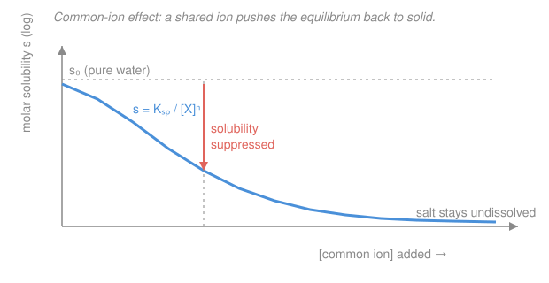

# Analytical & Instrumental Chemistry · Lesson 2.3: Solubility & gravimetric analysis

> ⏱ ~15 min · Module 2: Equilibria, titrimetry & gravimetry · Builds on: [2.2 Complexometric EDTA titrations](02-02-complexometric-edta-titrations.md), [gen-chem 3.4 Chemical equilibrium & Le Châtelier](../../general-chemistry/lessons/03-04-chemical-equilibrium-k-le-chatelier.md) · Unlocks: 2.4 (redox equilibria & titrations)

## Why this matters

Some of the oldest and most accurate quantitative methods never touch an instrument: you drop a reagent into a solution, a solid crashes out, you filter it, dry it, and weigh it on a good balance — and from that single mass you back out how much of your analyte was in the sample, often to four significant figures. That's **gravimetric analysis**, and it's still the reference method that calibrates fancier techniques. But it only works if you can answer two quantitative questions first: *how much* of a sparingly soluble salt actually dissolves (so you know you precipitated essentially all of it), and *can you make one ion crash out while leaving another behind* (so your precipitate is pure). Both questions are just [gen-chem 3.4](../../general-chemistry/lessons/03-04-chemical-equilibrium-k-le-chatelier.md) equilibrium — Le Châtelier with a balance attached.

## The idea

Drop table salt into water and it vanishes. Drop silver chloride in and almost nothing dissolves — a tiny, *fixed* amount goes into solution and the rest sits as solid. That ceiling on dissolving is an equilibrium: solid trading ions with the solution until the rates balance. The **solubility product** $K_{sp}$ is just the equilibrium constant for that trade, and it lets you compute exactly how much dissolves — the **molar solubility** $s$.

Now the lever. Suppose you already have chloride ion floating in the water before you add the silver salt. The dissolving equilibrium $\ce{AgCl(s) <=> Ag+ + Cl-}$ feels that extra $\ce{Cl-}$ as a product already piled up, so — Le Châtelier — it shifts *back toward solid*. Less dissolves. That's the **common-ion effect**: adding an ion the salt shares with the solution *suppresses* its solubility, often by orders of magnitude. It's the whole trick behind precipitating an analyte "quantitatively" (>99.9%): dump in excess of the partner ion and drive solubility into the floor.

Push the same idea further and you get **selective precipitation**: if two ions both react with your reagent but one has a far smaller $K_{sp}$, that one crashes out first, and you can pull it out almost completely before the second even begins. Weigh what you catch, apply a stoichiometric conversion factor, and you have your answer.

## The formal version

**Solubility product.** For a sparingly soluble salt dissolving as

$$\ce{M_aX_b(s) <=> $a$M + $b$X}, \qquad K_{sp} = [\ce{M}]^a\,[\ce{X}]^b .$$

*In words: at equilibrium the product of the dissolved-ion concentrations, each raised to its stoichiometric coefficient, is a constant.* The pure solid doesn't appear (its "concentration" is fixed). Brackets are equilibrium molar concentrations in mol/L; strictly these should be *activities*, but we use concentrations for dilute solutions.

**Molar solubility.** Let $s$ = moles of the salt that dissolve per litre. Each formula unit releases $a$ of $\ce{M}$ and $b$ of $\ce{X}$, so in pure water $[\ce{M}] = as$ and $[\ce{X}] = bs$. Substituting,

$$K_{sp} = (as)^a\,(bs)^b = a^a b^b\, s^{\,a+b}\quad\Longrightarrow\quad s = \left(\frac{K_{sp}}{a^a b^b}\right)^{1/(a+b)} .$$

*In words: dissolve the definition, express every ion as a multiple of $s$, and solve.* For a 1:1 salt ($a=b=1$), $s=\sqrt{K_{sp}}$; for a 1:2 salt like $\ce{CaF2}$, $K_{sp}=4s^3$.

**Common-ion effect.** If the solution already contains the ion $\ce{X}$ at concentration $C$ (from another source), then $[\ce{X}] = C + bs \approx C$ whenever $bs \ll C$, and

$$K_{sp} = [\ce{M}]^a\,C^{\,b} \quad\Longrightarrow\quad s = \frac{[\ce{M}]}{a} = \frac{1}{a}\left(\frac{K_{sp}}{C^{\,b}}\right)^{1/a}.$$

*In words: hold the shared ion fixed at $C$ and solve for the rest — the solubility drops because $C$ does the work $s$ used to.* This is Le Châtelier made numeric: pile up a product, the equilibrium retreats.

**Selective (fractional) precipitation.** Two ions share a precipitant $\ce{R}$. Ion 1 begins to precipitate when $[\ce{R}]$ first satisfies its $K_{sp1}$; ion 2 when it satisfies $K_{sp2}$. The one needing the *smaller* $[\ce{R}]$ precipitates first. Separation is clean if, by the time the second ion *starts* to precipitate, the first is essentially gone (say <0.1% remaining).

**Gravimetric factor.** You precipitate the analyte, filter, dry or ignite, and weigh the precipitate. To convert the weighed mass back to analyte mass,

$$\text{mass analyte} = \text{mass precipitate}\times\underbrace{\frac{(\text{stoich. ratio})\times M_{\text{analyte}}}{M_{\text{precipitate}}}}_{\text{gravimetric factor (GF)}} .$$

*In words: the gravimetric factor is the fraction of the precipitate's mass that is your analyte, scaled by how many analyte units sit in one precipitate formula unit.* The stoichiometric ratio is (moles analyte)/(moles precipitate) — e.g. $2$ for finding $\ce{Fe}$ as $\ce{Fe2O3}$, since each $\ce{Fe2O3}$ holds two Fe. Molar masses use [gen-chem 2.1](../../general-chemistry/lessons/02-01-mole-molar-mass-formulas.md).

**Why the precipitate can lie — sources of error.**

- **Coprecipitation**: soluble impurities get dragged down with the solid. By *inclusion* (a foreign ion sits in the crystal lattice where it fits), *occlusion* (pockets of mother liquor trapped as the crystal grows fast), or *surface adsorption* (ions clinging to the large surface of fine particles). All make the precipitate weigh too much.
- **Post-precipitation**: a second, slower-forming solid deposits on the first if you leave it sitting too long.
- **Peptization**: over-washing a colloidal precipitate with pure water strips the adsorbed-ion layer holding particles together, and they redisperse through the filter — you *lose* analyte.

The fixes: **digestion** (let the precipitate stand warm in its mother liquor so small, impure crystals redissolve and re-grow larger and purer — Ostwald ripening), and **washing with a dilute electrolyte** (an ion that volatilizes on ignition, e.g. dilute $\ce{HNO3}$) instead of pure water, which cleans the surface without peptizing.

## Picture

## Worked examples

**Example 1 (molar solubility, then common-ion suppression).** Silver chromate, $\ce{Ag2CrO4}$, has $K_{sp}=1.1\times10^{-12}$.

*In pure water:* $\ce{Ag2CrO4(s) <=> 2Ag+ + CrO4^2-}$, so $[\ce{Ag+}]=2s$ and $[\ce{CrO4^2-}]=s$:

$$K_{sp} = (2s)^2(s) = 4s^3 \;\Longrightarrow\; s = \left(\frac{1.1\times10^{-12}}{4}\right)^{1/3} = (2.75\times10^{-13})^{1/3} = 6.5\times10^{-5}\ \mathrm{mol/L}.$$

*In $0.10\ \mathrm{mol/L}$ $\ce{K2CrO4}$* (a common chromate ion, $C=0.10$): now $[\ce{CrO4^2-}]\approx 0.10$ and $[\ce{Ag+}]=2s$:

$$K_{sp} = (2s)^2(0.10) \;\Longrightarrow\; 4s^2 = \frac{1.1\times10^{-12}}{0.10}=1.1\times10^{-11} \;\Longrightarrow\; s = \sqrt{2.75\times10^{-12}} = 1.7\times10^{-6}\ \mathrm{mol/L}.$$

The common ion knocked solubility down by a factor of $\sim 40$ ($6.5\times10^{-5}$ to $1.7\times10^{-6}$). Check the approximation $2s = 3.3\times10^{-6}\ll 0.10$ ✓.

**Example 2 (gravimetric — iron in an ore).** A $0.5000\ \mathrm{g}$ ore sample is dissolved, the iron is precipitated as hydrous $\ce{Fe(OH)3}$, then ignited to $\ce{Fe2O3}$. The ignited oxide weighs $0.2795\ \mathrm{g}$. Find the % Fe in the ore.

Molar masses: $M(\ce{Fe})=55.85$, $M(\ce{Fe2O3}) = 2(55.85)+3(16.00)=159.70\ \mathrm{g/mol}$. Each $\ce{Fe2O3}$ carries **two** Fe, so the stoichiometric ratio is $2$:

$$\text{GF} = \frac{2\,M(\ce{Fe})}{M(\ce{Fe2O3})} = \frac{111.70}{159.70} = 0.6994 .$$

$$\text{mass Fe} = 0.2795 \times 0.6994 = 0.1955\ \mathrm{g}, \qquad \%\,\ce{Fe} = \frac{0.1955}{0.5000}\times100\% = 39.10\% .$$

Notice the whole answer rode on one weighed mass and a molar-mass ratio — no calibration curve, no instrument drift. That's why gravimetry is a *primary* method.

## Watch out

- **You might raise the ion to the wrong power.** In $K_{sp}=[\ce{M}]^a[\ce{X}]^b$ the exponent and the multiplier both come from stoichiometry: for $\ce{CaF2}$, $[\ce{F-}]=2s$ *and* it's squared, giving $K_{sp}=(s)(2s)^2=4s^3$ — not $s^2$. The "2" appears twice, and forgetting either one throws the solubility off badly.
- **You might think the common-ion solubility uses the same formula as pure water.** It doesn't: once a common ion is present at $C$, that ion is essentially fixed at $C$, and you solve for the *other* ion. The pure-water shortcut $s=\sqrt{K_{sp}}$ only holds when both ions come solely from the dissolving salt.
- **You might trust the precipitate's mass blindly.** Coprecipitation makes it read high, peptization makes it read low. A number off the balance is only as good as the digestion and washing behind it — the analytical error usually lives in the precipitate's *purity*, not the weighing.

## One-liner

> $K_{sp}$ sets how much dissolves, a common ion drives that toward zero, and a clean precipitate times its gravimetric factor turns a single weighing into an analyte amount.

## Problems

**P1 (🟢)** Calcium fluoride, $\ce{CaF2}$, has $K_{sp}=3.9\times10^{-11}$. (a) Find its molar solubility in pure water. (b) Find its molar solubility in $0.010\ \mathrm{mol/L}$ $\ce{NaF}$, and state the suppression factor.

**P2 (🟡)** A $0.4890\ \mathrm{g}$ sample of an impure sulfate salt is dissolved and its sulfate precipitated as $\ce{BaSO4}$, which is filtered, dried, and weighed: $0.5713\ \mathrm{g}$. Find the mass of $\ce{SO4^2-}$ recovered and the percent sulfate in the original sample. ($M(\ce{SO4^2-})=96.06$, $M(\ce{BaSO4})=233.39\ \mathrm{g/mol}$.)

**P3 (🔴)** A solution is $0.10\ \mathrm{mol/L}$ in both $\ce{Cl-}$ and $\ce{I-}$. $\ce{AgNO3}$ is added slowly. Given $K_{sp}(\ce{AgCl})=1.8\times10^{-10}$ and $K_{sp}(\ce{AgI})=8.3\times10^{-17}$: which halide precipitates first, and what fraction of it remains in solution at the instant the second halide *begins* to precipitate? Is the separation feasible?

Solutions

**P1** (a) $\ce{CaF2(s) <=> Ca^2+ + 2F-}$, so $[\ce{Ca^2+}]=s$, $[\ce{F-}]=2s$:

$$K_{sp} = (s)(2s)^2 = 4s^3 \;\Longrightarrow\; s = \left(\frac{3.9\times10^{-11}}{4}\right)^{1/3} = (9.75\times10^{-12})^{1/3} = 2.14\times10^{-4}\ \mathrm{mol/L}.$$

(b) With $0.010\ \mathrm{mol/L}$ $\ce{NaF}$, the fluoride is fixed at $[\ce{F-}]\approx 0.010$ (contributed $2s$ is negligible, checked below), and $[\ce{Ca^2+}]=s$:

$$K_{sp} = (s)(0.010)^2 \;\Longrightarrow\; s = \frac{3.9\times10^{-11}}{1.0\times10^{-4}} = 3.9\times10^{-7}\ \mathrm{mol/L}.$$

Check: $2s = 7.8\times10^{-7}\ll 0.010$ ✓. Suppression factor $= \dfrac{2.14\times10^{-4}}{3.9\times10^{-7}} \approx 550$ — solubility dropped roughly 550-fold. *Sanity:* the shared ion should always *lower* solubility, and it did, sharply, exactly as Le Châtelier predicts.

**P2** Gravimetric factor (sulfate is 1:1 in $\ce{BaSO4}$, so the stoichiometric ratio is 1):

$$\text{GF} = \frac{M(\ce{SO4^2-})}{M(\ce{BaSO4})} = \frac{96.06}{233.39} = 0.4116 .$$

$$\text{mass }\ce{SO4^2-} = 0.5713 \times 0.4116 = 0.2352\ \mathrm{g}, \qquad \%\,\ce{SO4^2-} = \frac{0.2352}{0.4890}\times100\% = 48.1\% .$$

*Sanity:* the GF is a mass fraction, so it must be between 0 and 1 (0.41 ✓), and the recovered analyte mass (0.235 g) is less than the weighed precipitate (0.571 g), as it must be since the precipitate also carries the barium ✓.

**P3** Each silver halide is 1:1, so ion $\ce{Y}$ begins to precipitate when $[\ce{Ag+}] = K_{sp}/[\ce{Y}]$:

$$[\ce{Ag+}]_{\text{start, }\ce{AgI}} = \frac{8.3\times10^{-17}}{0.10} = 8.3\times10^{-16}\ \mathrm{mol/L}, \qquad [\ce{Ag+}]_{\text{start, }\ce{AgCl}} = \frac{1.8\times10^{-10}}{0.10} = 1.8\times10^{-9}\ \mathrm{mol/L}.$$

$\ce{AgI}$ needs about $10^{6}$ times *less* silver, so **iodide precipitates first**. Chloride begins to precipitate when $[\ce{Ag+}]$ climbs to $1.8\times10^{-9}\ \mathrm{mol/L}$. At that instant the remaining iodide is

$$[\ce{I-}] = \frac{K_{sp}(\ce{AgI})}{[\ce{Ag+}]} = \frac{8.3\times10^{-17}}{1.8\times10^{-9}} = 4.6\times10^{-8}\ \mathrm{mol/L}.$$

Fraction of iodide left $= \dfrac{4.6\times10^{-8}}{0.10} = 4.6\times10^{-7}$, i.e. about $0.00005\%$ remains — over $99.9999\%$ of the iodide has precipitated before chloride even starts. **The separation is entirely feasible.**

*Sanity:* the ion with the smaller $K_{sp}$ came out first and was driven essentially to completion before the second appeared — the larger the $K_{sp}$ gap, the cleaner the split, and a $10^{6}$-fold gap is enormous.

## Flashback

**From Lesson 2.2 (Complexometric EDTA titrations):** The formation constant for the calcium–EDTA complex is $K_f = 5.0\times10^{10}$ for $\ce{Ca^2+ + Y^4- <=> CaY^2-}$. At pH 10 the fraction of EDTA present as the fully deprotonated $\ce{Y^4-}$ is $\alpha_{\ce{Y^4-}}=0.35$. (a) Compute the conditional formation constant $K_f'$. (b) At the equivalence point of a titration the complex concentration is $[\ce{CaY^2-}]\approx 0.010\ \mathrm{mol/L}$; estimate the free $[\ce{Ca^2+}]$ and hence $\mathrm{pCa}$.

Solution

(a) The conditional constant folds the pH-dependent availability of $\ce{Y^4-}$ into $K_f$:

$$K_f' = \alpha_{\ce{Y^4-}}\,K_f = 0.35 \times 5.0\times10^{10} = 1.8\times10^{10}.$$

(b) At the equivalence point essentially all calcium is complexed, and the complex dissociates slightly to give equal small amounts of free calcium and free (total) EDTA: let $x=[\ce{Ca^2+}]=C_{\text{EDTA}}$. Then

$$K_f' = \frac{[\ce{CaY^2-}]}{[\ce{Ca^2+}]\,C_{\text{EDTA}}} \approx \frac{0.010}{x^2} \;\Longrightarrow\; x = \sqrt{\frac{0.010}{1.8\times10^{10}}} = \sqrt{5.6\times10^{-13}} = 7.5\times10^{-7}\ \mathrm{mol/L}.$$

$$\mathrm{pCa} = -\log(7.5\times10^{-7}) = 6.1 .$$

*Sanity:* $K_f'$ is huge, so the free calcium at equivalence is tiny (pCa jumps to ~6), which is exactly what makes the titration sharp and quantitative. Note the mechanism is the mirror image of this lesson: EDTA *pulls* a metal into solution as a complex, while $K_{sp}$ governs pushing ions *out* as a solid — both are the same equilibrium bookkeeping run in opposite directions.

## Connections

- **Backward:** $K_{sp}$, the common-ion effect, and selective precipitation are all [gen-chem 3.4](../../general-chemistry/lessons/03-04-chemical-equilibrium-k-le-chatelier.md)'s equilibrium constant and Le Châtelier's principle applied to a dissolving solid; the gravimetric factor is just mole–mass bookkeeping from [gen-chem 2.1](../../general-chemistry/lessons/02-01-mole-molar-mass-formulas.md).
- **Forward:** [2.4 Redox equilibria & titrations](02-04-redox-equilibria-titrations.md) brings the same "compute the equilibrium at every point" mindset to electron-transfer reactions and the Nernst equation; precipitation titrations (following $[\ce{Ag+}]$ with an electrode) also reappear there and in potentiometry (3.3).
- **Sideways:** the conditional-constant trick from EDTA (2.2) and $K_{sp}$ are two faces of controlled equilibrium — one dissolves a metal into a complex, the other precipitates it as a solid; the broader equilibrium/activity framework bridges to physical chemistry ([physical-chemistry syllabus](../../physical-chemistry/syllabus.md)).
