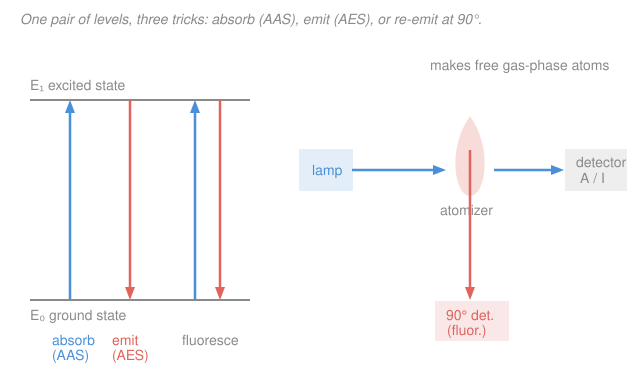

# Analytical & Instrumental Chemistry · Lesson 3.2: Atomic & fluorescence spectroscopy

> ⏱ ~15 min · Module 3: Spectroscopic & electroanalytical methods · Builds on: [3.1 UV–Vis & Beer's law](03-01-uv-vis-beers-law.md) · Unlocks: [3.3 Potentiometry & ion-selective electrodes](03-03-potentiometry-ion-selective-electrodes.md)

## Why this matters

You want to know how much lead is in drinking water, cadmium in a rice sample, or sodium in blood — often at parts-per-billion, one metal atom among a billion water molecules. UV–Vis from [3.1](03-01-uv-vis-beers-law.md) won't touch it: dissolved metal ions have broad, weak, overlapping bands, and everything at trace level looks like everything else. The fix is to stop measuring the *molecule* and start measuring the *atom*. Rip the sample apart into free gas-phase atoms and each element radiates or absorbs a fingerprint of razor-thin lines at wavelengths no other element shares. That selectivity — plus detection limits reaching sub-ppb — is why atomic spectroscopy is the workhorse of environmental, clinical, and metallurgical trace-metal analysis.

## The idea

A free atom has sharply defined energy levels. An electron sitting in the ground level can jump up only if it's handed *exactly* the energy gap $\Delta E$ — which corresponds to one precise wavelength, the element's **resonance line** (sodium's is the famous 589 nm yellow). Because gas-phase atomic lines are extraordinarily narrow (they aren't smeared into bands the way a molecule's are), that line is a private channel: shine 589 nm at a flame and only sodium responds.

Every atomic method has the same first step — **atomization**: destroy the sample's molecules and free the analyte as neutral gas-phase atoms. Do it in a flame (~2000–3000 K), a graphite furnace (an electrically heated tube), or an argon plasma (~7000 K). Then you play one of three tricks on those atoms:

- **Atomic absorption (AAS)** — shine the element's own line at the atoms and see how much they *swallow*. More atoms, more absorbed. This is Beer's law wearing a lab coat.
- **Atomic emission (AES)** — heat the atoms so hard they jump up on their own, then *watch them fall back* and emit their line. Brighter line, more atoms.
- **Atomic fluorescence** — shine the line in, then look off to the *side* (90°) at the light the atoms re-emit. Because you're not staring into the lamp, the background is nearly black, so even a faint glow stands out — superb for ultratrace work.

The one idea tying absorption and emission together is a population question: absorption starts from the ground level (always crowded), while emission starts from the excited level (nearly empty unless you make the source blisteringly hot). That single fact — spelled out below — explains why AAS is happy in a cool flame but AES demands a plasma.

## The formal version

**Atomization, then a signal proportional to concentration.** In all three modes the measured signal is (in the working range) linear in the number of analyte atoms in the light path, hence in concentration $c$.

**Atomic absorption (AAS).** A **hollow-cathode lamp** whose cathode is made of the analyte element emits that element's own narrow line. Free atoms in the flame absorb it, and the detector reports absorbance exactly as in [3.1](03-01-uv-vis-beers-law.md):

$$A = \log_{10}\frac{I_0}{I} = k\,b\,c ,$$

where $I_0$ is incident and $I$ transmitted intensity, $b$ the path length through the atomizer, and $k$ a constant for that line. *In words: absorbance is proportional to concentration — a Beer's-law calibration, run one element at a time.* Selectivity is superb because the lamp line is narrower than the atomic absorption line, so only the target element intercepts it.

- **Flame AAS** is cheap, fast, robust; detection limits around parts-per-million.
- **Graphite-furnace (electrothermal) AAS** vaporizes a few microliters inside a hot tube that *traps the atom cloud* in the beam far longer than a flame does. Longer residence $\Rightarrow$ lower detection limits (parts-per-billion) from tiny samples — at the cost of speed and precision.

**Atomic emission (AES / ICP-OES).** No lamp. A hot source (flame, or an **inductively coupled plasma**, ICP, at ~7000 K) both atomizes *and* thermally excites the atoms; you measure the intensity of the line they emit on relaxing:

$$I_{\text{em}} \propto N_1 \propto c ,$$

with $N_1$ the number of excited atoms. *In words: the hotter source populates the upper level, and the emitted-line brightness tracks concentration.* An ICP excites dozens of elements at once, giving **simultaneous multi-element** analysis over a wide (4–6 decade) linear range — its headline advantage.

**Why the temperature split — the Boltzmann argument.** At thermal equilibrium the ratio of atoms in the excited level ($E_1$) to the ground level ($E_0$) is set by the **Boltzmann distribution**:

$$\frac{N_1}{N_0} = \frac{g_1}{g_0}\,\exp\!\left(-\frac{\Delta E}{kT}\right), \qquad \Delta E = \frac{hc}{\lambda},$$

where $g_1, g_0$ are the level degeneracies (statistical weights), $k = 1.381\times10^{-23}\ \mathrm{J/K}$ is Boltzmann's constant, $T$ the temperature, $h = 6.626\times10^{-34}\ \mathrm{J\,s}$, $c = 3.00\times10^{8}\ \mathrm{m/s}$, and $\lambda$ the line's wavelength. *In words: the fraction of atoms sitting in the excited level is exponentially small unless $kT$ is comparable to the gap $\Delta E$.* For a visible line $\Delta E$ is a few electron-volts while $kT$ at flame temperature is a fraction of an eV, so $N_1/N_0$ is minuscule.

The consequence is the whole design logic of atomic spectroscopy:

- **Absorption reads $N_0$**, and $N_0 \approx N_{\text{total}}$ because so few atoms are ever excited. So AAS barely cares about source temperature — a modest flame works, provided it atomizes cleanly.
- **Emission reads $N_1$**, which is exponentially temperature-sensitive. A cool flame leaves the upper level nearly empty and the line faint; a 7000 K plasma populates it thousands of times more heavily. **That is why AES needs a much hotter source than AAS.**

**Atomic (and molecular) fluorescence.** Excite the atoms with an intense source at the resonance wavelength, then detect the re-emitted light at 90° to the beam. In the dilute limit:

$$I_{\text{F}} \propto \Phi\,I_0\,c ,$$

where $I_0$ is the source intensity and $\Phi$ the fluorescence quantum yield (fraction of excited atoms that emit rather than lose the energy as heat). *In words: fluorescence signal grows with both concentration and how bright a lamp you shine* — so a stronger source directly buys sensitivity, unlike absorbance. Detecting off-axis means the detector sees near-zero background, so tiny signals are measurable: fluorescence excels at ultratrace levels. (At higher $c$ self-absorption bends the line over, so linearity holds only when dilute.)

**Interferences** — the four to know, each with a remedy:

| Type | What goes wrong | Remedy |
|---|---|---|
| **Spectral** | another element's line overlaps yours | higher-resolution optics, or pick an alternate analytical line |
| **Chemical** | analyte locked in a **refractory** (hard-to-vaporize) compound, e.g. $\ce{Ca3(PO4)2}$, so fewer free atoms form | add a **releasing agent** (excess $\ce{La^3+}$ grabs the phosphate) or a hotter flame |
| **Ionization** | easily ionized metals lose an electron ($\ce{Na -> Na+ + e-}$), depleting neutral atoms | add an **ionization suppressor** — a large excess of an even-easier-to-ionize element (e.g. $\ce{Cs}$ or $\ce{K}$) floods the source with electrons and pushes the equilibrium back |
| **Background** | broadband absorption/emission or scatter from the matrix | **background correction** (deuterium-lamp or Zeeman) |

## Picture

## Worked examples

**Example 1 (AAS calibration — read the concentration off the line).** Copper standards give absorbances $0.086, 0.171, 0.343, 0.686$ at $0.50, 1.00, 2.00, 4.00\ \mathrm{ppm}$. The line passes through the origin, so the best-fit slope through zero is $k = \sum(c_iA_i)/\sum c_i^2 = 3.644/21.25 = 0.1715\ \mathrm{ppm^{-1}}$. An unknown reads $A = 0.267$, so

$$c = \frac{A}{k} = \frac{0.267}{0.1715} = 1.56\ \mathrm{ppm}.$$

Same machinery as UV–Vis in [3.1](03-01-uv-vis-beers-law.md) — the "molar absorptivity" is just folded into $k$ for this line and this instrument.

**Example 2 (why fluorescence wins at ultratrace).** In absorbance you compute $A = \log_{10}(I_0/I)$: at very low concentration $I$ is *almost equal* to $I_0$, so you're taking the log of a ratio like $1.0002$ — reading a whisker of difference between two large, noisy numbers. Fluorescence instead measures emitted light **against a black background**: the signal $I_{\text{F}} \propto I_0 c$ starts at zero and climbs, and you can crank $I_0$ (brighter lamp/laser) to lift it further. Measuring a small number against zero beats measuring a small difference between two big numbers — that is the whole sensitivity edge of the 90° geometry.

## Watch out

- **You might think a hotter atomizer always helps AAS.** Not really — absorption reads the ground-state population, which is already ~100% of the atoms, so extra temperature does little for the signal and can even *worsen* it by ionizing atoms away. AAS wants enough heat to atomize cleanly, not more. Emission is the mode that lives or dies on temperature.
- **You might confuse the hollow-cathode lamp with a general light source.** In AAS the lamp emits *the analyte element's own line* — it's element-specific hardware; measuring copper and then zinc means swapping lamps. That single-element nature is exactly why ICP-emission (no lamp, all elements at once) took over multi-element work.
- **You might treat fluorescence intensity as concentration-linear forever.** $I_{\text{F}} \propto c$ only in the dilute limit; at higher concentration emitted photons get re-absorbed by ground-state atoms on the way out (self-absorption), bending the calibration over. Same caution as high-concentration deviations from Beer's law in [3.1](03-01-uv-vis-beers-law.md).

## One-liner

> Atomize the sample, then read the element's private line — absorb it (AAS, ground-state, cool flame OK), emit it (AES/ICP, excited-state, needs a hot plasma by Boltzmann), or re-emit it at 90° (fluorescence, black background, ultratrace).

## Problems

**P1 (🟢)** A flame-AAS calibration for manganese gives, through the origin, absorbances $0.048, 0.121, 0.235$ at $0.20, 0.50, 1.00\ \mathrm{ppm}$. A digested spinach sample reads $A = 0.152$. Find the Mn concentration in the sample solution (report to 2 sig figs).

**P2 (🟡)** The calcium resonance line is at $\lambda = 422.7\ \mathrm{nm}$; take $g_1/g_0 = 3$. Using the Boltzmann distribution, compute the excited-to-ground population ratio $N_1/N_0$ in (a) a $2500\ \mathrm{K}$ flame and (b) a $7000\ \mathrm{K}$ plasma. By what factor does the *emission* signal grow between them, and why does the *absorption* signal barely change? (Constants: $h = 6.626\times10^{-34}\ \mathrm{J\,s}$, $c = 3.00\times10^{8}\ \mathrm{m/s}$, $k = 1.381\times10^{-23}\ \mathrm{J/K}$.)

**P3 (🔴)** You must (a) certify lead in bottled water at the ~1 ppb regulatory limit — a single metal at ultralow level — and (b) screen a mine-tailings extract for 15 metals as fast as possible. For each, pick from flame-AAS, graphite-furnace AAS, atomic fluorescence, and ICP-OES, and justify. For task (b), name one interference you'd expect and its remedy.

Solutions

**P1** Best-fit slope through the origin, $k = \sum(c_iA_i)/\sum c_i^2$:

$$\sum c_iA_i = (0.20)(0.048) + (0.50)(0.121) + (1.00)(0.235) = 0.0096 + 0.0605 + 0.235 = 0.3051,$$
$$\sum c_i^2 = 0.04 + 0.25 + 1.00 = 1.29, \qquad k = \frac{0.3051}{1.29} = 0.2365\ \mathrm{ppm^{-1}}.$$

Then $c = A/k = 0.152/0.2365 = 0.643 \approx 0.64\ \mathrm{ppm}$.

*Check.* $0.152$ sits between the $0.50$ ppm ($A=0.121$) and $1.00$ ppm ($A=0.235$) standards, so the answer must fall between those concentrations — $0.64$ ppm does. ✓

**P2** First the gap: $\Delta E = hc/\lambda = (6.626\times10^{-34})(3.00\times10^{8})/(422.7\times10^{-9}) = 4.70\times10^{-19}\ \mathrm{J}$ (≈ 2.94 eV).

(a) At $T = 2500\ \mathrm{K}$: $\dfrac{\Delta E}{kT} = \dfrac{4.70\times10^{-19}}{(1.381\times10^{-23})(2500)} = 13.6$, so

$$\frac{N_1}{N_0} = 3\,e^{-13.6} = 3(1.2\times10^{-6}) = 3.7\times10^{-6}.$$

(b) At $T = 7000\ \mathrm{K}$: $\dfrac{\Delta E}{kT} = \dfrac{4.70\times10^{-19}}{(1.381\times10^{-23})(7000)} = 4.86$, so

$$\frac{N_1}{N_0} = 3\,e^{-4.86} = 3(7.7\times10^{-3}) = 2.3\times10^{-2}.$$

Emission scales with $N_1$, so it grows by the ratio $\dfrac{2.3\times10^{-2}}{3.7\times10^{-6}} \approx 6\times10^{3}$ — a roughly six-thousand-fold brighter line in the plasma. That is why atomic emission needs a hot source: in the flame the upper level is essentially empty. Absorption, meanwhile, reads $N_0$, and since $N_1/N_0 \le 0.02$ in both cases, $N_0 \approx N_{\text{total}}$ regardless of temperature — so the absorption signal is nearly temperature-independent.

*Check.* Both ratios are far below 1 (excited level is the minority at any realistic $T$), and the hotter source gives the larger ratio, as the exponential demands. ✓

**P3**
(a) **Lead at ~1 ppb, one element:** choose **graphite-furnace (electrothermal) AAS** (or atomic fluorescence / ICP-MS if available). Flame AAS bottoms out near ppm and can't reach ppb; the furnace traps the atom cloud in the beam far longer, pushing detection limits to low ppb from a few microliters — and you only need one element, so single-element AAS is no handicap. Atomic fluorescence's black-background geometry is the other classic ultratrace choice.

(b) **15 metals, fast:** choose **ICP-OES**. Its 7000 K plasma atomizes and excites everything at once, giving simultaneous multi-element readout over a wide linear range — swapping 15 hollow-cathode lamps for sequential AAS runs would be far slower. Likely interference: **spectral** (with dozens of emission lines, one element's line can overlap the analyte's); remedy: select an alternate, interference-free analytical line or use higher-resolution optics / background correction. (An **ionization** interference for easily ionized metals like the alkalis/alkaline earths is also fair — remedy: add an ionization suppressor such as excess Cs.)

## Flashback

**From Lesson 3.1 (UV–Vis & Beer's law):** A colored complex has molar absorptivity $\varepsilon = 6100\ \mathrm{L\,mol^{-1}\,cm^{-1}}$ at its $\lambda_{\max}$. In a $1.00\ \mathrm{cm}$ cell it gives $A = 0.427$. Find the molar concentration and the percent transmittance. (Fresh variant — new numbers.)

Solution

Beer's law $A = \varepsilon b c$ solved for $c$:

$$c = \frac{A}{\varepsilon b} = \frac{0.427}{(6100)(1.00)} = 7.0\times10^{-5}\ \mathrm{mol/L}.$$

Percent transmittance from $A = -\log_{10}T$, i.e. $T = 10^{-A}$:

$$\%T = 100\times 10^{-0.427} = 100 \times 0.374 = 37.4\%.$$

*Check.* $A = 0.427$ is a mid-range absorbance, so $\%T$ should be well between 10% and 100% — 37% fits. And $A \approx 0.43$ is comfortably inside the reliable $0.1$–$1$ absorbance window from 3.1. ✓ This is the same $A \propto c$ calibration that reappears as the AAS working curve in this lesson — atomic absorption is Beer's law with the "molecule" replaced by a free atom.

## Connections

- **Backward:** AAS *is* [3.1](03-01-uv-vis-beers-law.md)'s Beer's law with a free atom as the absorber and a hollow-cathode lamp as the monochromatic source — the calibration curve, the $0.1$–$1$ absorbance sweet spot, and high-concentration deviations all carry straight over. The Boltzmann population argument is the equilibrium/statistical-mechanics thread you'll meet again in the [physical-chemistry](../../physical-chemistry/syllabus.md) spectroscopy and thermodynamics material.
- **Forward:** [3.3 Potentiometry & ion-selective electrodes](03-03-potentiometry-ion-selective-electrodes.md) switches from measuring *light* to measuring *voltage* — an electrochemical route to the same trace-ion concentrations, running the Nernst equation where this lesson ran Beer's law.
- **Sideways:** the least-squares calibration line here is the same statistical object as in [1.4 significance tests & calibration](01-04-significance-tests-calibration.md) and the regression from [prob-stat-refresher](../../prob-stat-refresher/syllabus.md); "detection limit," which decides flame-vs-furnace, is defined there in terms of the blank's standard deviation.
