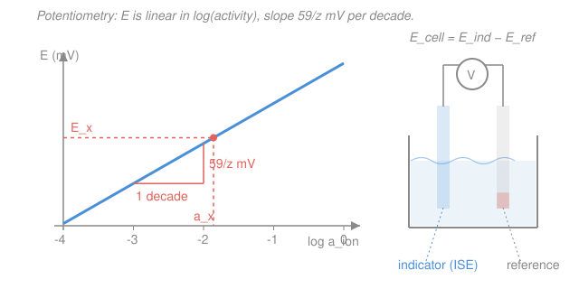

# Analytical & Instrumental Chemistry · Lesson 3.3: Potentiometry & ion-selective electrodes

> ⏱ ~15 min · Module 3: Spectroscopic & electroanalytical methods · Builds on: [2.4 Redox equilibria & titrations](02-04-redox-equilibria-titrations.md), [general-chemistry 4.4 (a taste of electrochemistry)](../../general-chemistry/lessons/04-04-taste-of-electrochemistry.md) · Unlocks: 3.4 (voltammetry & standard addition)

## Why this matters

Every time a nurse checks blood $\ce{K+}$, a pool tester reads pH, or a plant meter reports fluoride in drinking water, the instrument is doing one thing: measuring a **voltage at zero current** and turning it into an ion concentration. That's potentiometry. It's the cheapest, fastest quantitative method in the lab — no reagents consumed, no reaction run to completion, just a needle sitting in the sample reporting a number. And it's the [Nernst equation](../../general-chemistry/lessons/04-04-taste-of-electrochemistry.md) from electrochemistry run *backward*: instead of predicting a cell voltage from known concentrations, you measure the voltage and solve for the unknown concentration. This is also your first taste of a deep subtlety the rest of analytical chemistry has been quietly ignoring — electrodes feel **activity**, not concentration.

## The idea

Picture two electrodes dipped in the same solution, wired to a voltmeter. One electrode, the **indicator**, is built so its potential *changes* with the analyte — more of the ion, different voltage. The other, the **reference**, is built so its potential *never* changes no matter what's in the solution: it's a fixed benchmark. The voltmeter reads the difference. Since the reference is a constant, every wiggle in the reading is caused by the analyte, and you've isolated the one thing you care about.

Why measure at *zero current*? Because current means reaction — ions actually being consumed or produced at the electrode, which drags the system away from equilibrium and changes the very concentration you're trying to read. A modern pH meter has an enormous input resistance precisely so that essentially no current flows; the electrodes sit at equilibrium and simply *report*. Potentiometry is a spectator measurement.

The magic of the indicator electrode is the Nernst relation: its potential moves by a fixed number of millivolts every time the ion activity changes by a factor of ten. That number — about **59 mV per decade** for a singly-charged ion at room temperature — is the heartbeat of the whole method. Plot voltage against $\log(\text{activity})$ and you get a straight line. Calibrate that line with two known standards, drop your unknown's voltage onto it, and read off the activity.

## The formal version

**The cell.** You measure

$$E_\text{cell} = E_\text{ind} - E_\text{ref},$$

where $E_\text{ind}$ is the indicator-electrode potential and $E_\text{ref}$ is the reference-electrode potential (a constant — common choices are silver/silver-chloride, $\ce{Ag/AgCl}$, or the saturated calomel electrode, SCE). *In words: the reading is the analyte-sensitive electrode minus a fixed benchmark.* Because $E_\text{ref}$ is constant, it folds into an overall constant below.

**Nernstian response.** For an indicator electrode responding to an ion of charge $z$ with activity $a_\text{ion}$, at $25\ ^\circ\mathrm{C}$,

$$E = \text{const} \pm \frac{0.0592}{z}\,\log a_\text{ion} \qquad (\text{volts}).$$

*In words: the electrode potential is a constant plus a term that rises (or falls) by $0.0592/z$ volts every time the activity changes tenfold.* The sign is **+** for a **cation**-responsive electrode (more $\ce{K+}$ raises $E$) and **&#8722;** for an **anion**-responsive one (more $\ce{F-}$ lowers $E$). The coefficient $0.0592\ \mathrm{V} = 59.2\ \mathrm{mV}$ is $RT\ln(10)/F$ at $298\ \mathrm{K}$ — it grows slightly with temperature, so meters are temperature-compensated.

The quantity

$$\text{slope} = \frac{59.2}{z}\ \mathrm{mV\ per\ decade}$$

is the **Nernstian slope**: $59.2\ \mathrm{mV}$ per tenfold change for $z=1$, $29.6\ \mathrm{mV}$ for $z=2$, and so on. A plot of $E$ (mV) against $\log a_\text{ion}$ is a straight line with exactly this slope. Real electrodes often come in a hair under (say $58\text{–}59\ \mathrm{mV}$, "sub-Nernstian"), which is why you calibrate rather than trust the theoretical value.

**Ion-selective electrodes (ISEs).** An ISE uses a **membrane** that lets only one ion establish a potential across it. The archetype is the **pH glass electrode**: a thin glass bulb whose surface exchanges $\ce{H+}$, producing a potential that follows

$$E = \text{const} + 0.0592\,\log a_{\ce{H+}} = \text{const} - 0.0592\,\text{pH},$$

i.e. **&#8722;59.2 mV per pH unit** ($z=1$ for $\ce{H+}$). *In words: the pH meter is just an $\ce{H+}$-selective ISE, and each pH unit shifts the voltage by one Nernstian decade.* Swap the membrane and you get electrodes for $\ce{F-}$ (a $\ce{LaF3}$ crystal), $\ce{K+}$ (a valinomycin-doped polymer), $\ce{Ca^2+}$, $\ce{NO3-}$, and dozens more.

**Selectivity is never perfect.** An ISE for ion $\ce{A}$ also responds a little to an interferent $\ce{B}$, captured by the **Nikolsky–Eisenman** extension: $E = \text{const} \pm \frac{0.0592}{z_\ce{A}}\log\!\big(a_\ce{A} + K_{\ce{A,B}}\,a_\ce{B}^{z_\ce{A}/z_\ce{B}}\big)$, where the **selectivity coefficient** $K_{\ce{A,B}}$ (smaller is better; $K_{\ce{A,B}}=10^{-3}$ means $\ce{B}$ is a thousandfold weaker interferent than $\ce{A}$) says how badly $\ce{B}$ masquerades as $\ce{A}$.

**Activity, not concentration.** The Nernst term contains *activity* $a = \gamma c$, where $c$ is molar concentration and $\gamma$ is the **activity coefficient** ($\gamma \to 1$ in infinitely dilute solution, and $\gamma < 1$ as the solution gets crowded). Crowding is measured by the **ionic strength** $I = \tfrac12\sum_i c_i z_i^2$. So the electrode reports $\gamma c$, not $c$ — and $\gamma$ depends on *everything else dissolved in the sample*, not just the analyte. This is why potentiometric standards must have the **same ionic strength** as the sample: an analyst adds a **TISAB** (Total Ionic Strength Adjustment Buffer) to swamp both standards and samples with the same high, constant background salt, forcing $\gamma$ to one fixed value that folds harmlessly into the constant — so $E$ becomes linear in $\log c$ directly.

## Picture

## Worked examples

**Example 1 (mechanical — read the line).** A $\ce{K+}$ ISE ($z=1$) is calibrated with two standards: $a = 1.00\times10^{-4}$ gives $E_1 = 45.0\ \mathrm{mV}$, and $a = 1.00\times10^{-2}$ gives $E_2 = 162.0\ \mathrm{mV}$. First the empirical slope:

$$S = \frac{E_2 - E_1}{\log a_2 - \log a_1} = \frac{162.0 - 45.0}{(-2)-(-4)} = \frac{117.0}{2} = 58.5\ \mathrm{mV/decade},$$

close to the ideal $59.2$ — a healthy, slightly sub-Nernstian electrode. An unknown reads $E_x = 100.0\ \mathrm{mV}$. Solve the line for $\log a_x$:

$$\log a_x = \log a_1 + \frac{E_x - E_1}{S} = -4 + \frac{100.0 - 45.0}{58.5} = -4 + 0.940 = -3.060,$$

so $a_x = 10^{-3.060} = 8.71\times10^{-4}$ (activity units). That's the whole method: two points fix the line, the unknown's voltage drops onto it.

**Example 2 (why you'd care — the pH meter).** A pH electrode is calibrated so that a pH $7.00$ buffer reads $E = 0.0\ \mathrm{mV}$, with the ideal slope $59.2\ \mathrm{mV/pH}$. A sample reads $E = +95.0\ \mathrm{mV}$. Because the response is $E = \text{const} - 59.2\,\text{pH}$, a *more positive* voltage means a *lower* pH (more acidic). The shift from the calibration point is

$$\Delta\text{pH} = -\frac{\Delta E}{59.2} = -\frac{95.0 - 0.0}{59.2} = -1.60,\qquad \text{pH} = 7.00 - 1.60 = 5.40.$$

A single voltage reading, turned into pH by one number, 59.2 — that's every pool kit and blood-gas analyzer on earth.

## Watch out

- **You might think the meter reads concentration.** It reads **activity** $a = \gamma c$. In dilute, clean solutions $\gamma \approx 1$ and the distinction hides; in seawater, blood, or any high-salt matrix $\gamma$ can be $0.7$ or lower, and the gap is real. Match ionic strength (TISAB) or you'll be biased low.
- **You might use the theoretical 59.2 mV/decade blindly.** Real electrodes are sub-Nernstian and drift; always fit the slope from fresh standards each session, then apply *that* slope.
- **You might forget the sign flips for anions.** For $\ce{F-}$, $\ce{NO3-}$, or the pH electrode's $\ce{H+}\to$pH mapping, more ion means *lower* voltage. Track whether your electrode is cation- or anion-responsive before trusting the direction.

## One-liner

> Potentiometry runs the Nernst equation backward — measure a zero-current voltage, drop it on a line of slope $59/z$ mV per decade of *activity*, and read off the ion.

## Problems

**P1 (🟢)** A $\ce{Ca^2+}$ ISE ($z=2$) is calibrated: at activity $a = 1.00\times10^{-3}$ the cell reads $E_1 = 20.0\ \mathrm{mV}$, and at $a = 1.00\times10^{-1}$ it reads $E_2 = 79.2\ \mathrm{mV}$. (a) Find the empirical slope in mV/decade and confirm it is near-Nernstian for a divalent ion. (b) An unknown reads $E_x = 50.0\ \mathrm{mV}$; find its calcium activity.

**P2 (🟡)** A pH glass electrode has slope $59.2\ \mathrm{mV/pH}$ and reads $E = -8.0\ \mathrm{mV}$ in a pH $4.00$ calibration buffer. A wine sample then reads $E = -130.0\ \mathrm{mV}$. What is the wine's pH? (Watch the sign: more negative $E$ means higher pH.)

**P3 (🔴)** A fluoride solution is genuinely $1.00\times10^{-3}\ \mathrm{mol/L}$ in $\ce{F-}$, but the sample also carries enough inert salt to give ionic strength $I = 0.10\ \mathrm{mol/L}$. Using the Davies equation $\log\gamma = -0.51\,z^2\!\left[\dfrac{\sqrt I}{1+\sqrt I} - 0.30\,I\right]$, (a) find the activity coefficient $\gamma$ and the activity the electrode actually senses; (b) an analyst who calibrated with *dilute* standards ($\gamma\approx1$) and read this sample would report what concentration, and what percent error results? (c) State in one line how TISAB removes the error.

Solutions

**P1** (a) Empirical slope:

$$S = \frac{E_2 - E_1}{\log a_2 - \log a_1} = \frac{79.2 - 20.0}{(-1)-(-3)} = \frac{59.2}{2} = 29.6\ \mathrm{mV/decade}.$$

The ideal divalent slope is $59.2/z = 59.2/2 = 29.6\ \mathrm{mV/decade}$ — a perfectly Nernstian $\ce{Ca^2+}$ electrode. (b) Solve the line for the unknown:

$$\log a_x = \log a_1 + \frac{E_x - E_1}{S} = -3 + \frac{50.0 - 20.0}{29.6} = -3 + 1.014 = -1.986,$$

$$a_x = 10^{-1.986} = 1.03\times10^{-2}.$$

*Check.* $E_x = 50.0$ sits between $E_1=20.0$ and $E_2=79.2$, so $a_x$ must land between $10^{-3}$ and $10^{-1}$ — it does ($1.03\times10^{-2}$, just above the midpoint decade). ✓

**P2** First the empirical intercept is not needed — use the calibration point directly. The response is $E = \text{const} - 59.2\,\text{pH}$, so a change in $E$ maps to a change in pH by $\Delta\text{pH} = -\Delta E/59.2$:

$$\Delta\text{pH} = -\frac{E_\text{sample} - E_\text{buffer}}{59.2} = -\frac{(-130.0) - (-8.0)}{59.2} = -\frac{-122.0}{59.2} = +2.06.$$

$$\text{pH} = 4.00 + 2.06 = 6.06.$$

*Check.* $E$ dropped by $122\ \mathrm{mV}$; at $59.2\ \mathrm{mV}$ per pH unit that is just over two units *up* in pH (more negative voltage = less acidic). Wine near pH $6$ is a touch high for a real wine (most are pH $3\text{–}4$), but the arithmetic is sound for the given reading. ✓

**P3** (a) With $z=1$, $I=0.10$, $\sqrt I = 0.3162$:

$$\log\gamma = -0.51\left[\frac{0.3162}{1+0.3162} - 0.30(0.10)\right] = -0.51\left[0.2402 - 0.0300\right] = -0.51(0.2102) = -0.1072,$$

$$\gamma = 10^{-0.1072} = 0.781.$$

Activity sensed by the electrode:

$$a = \gamma c = 0.781 \times (1.00\times10^{-3}) = 7.81\times10^{-4}.$$

(b) An analyst whose dilute standards had $\gamma\approx1$ reads the line in "activity = concentration" units, so the reported concentration equals the sensed activity, $7.81\times10^{-4}\ \mathrm{mol/L}$. Percent error versus the true $1.00\times10^{-3}$:

$$\frac{7.81\times10^{-4} - 1.00\times10^{-3}}{1.00\times10^{-3}}\times100\% = -21.9\% \approx -22\%.$$

The reading is biased **low by about 22%** — equivalently a voltage offset of $59.2\times\log(0.781) = 59.2\times(-0.107) = -6.3\ \mathrm{mV}$ that pure-concentration calibration never anticipated.

(c) TISAB swamps standards *and* sample with the same high, constant ionic strength, so $\gamma$ takes one fixed value everywhere; it folds into the calibration constant and the line becomes linear in $\log c$ directly — the $22\%$ bias vanishes.

*Check.* $\gamma < 1$ (crowding lowers effective activity), and it drives the sensed activity *below* the true concentration, giving a negative bias — exactly the sign we found. ✓

## Flashback

**From Lesson 2.4 (Redox equilibria & titrations):** During a redox titration you monitor a $\ce{Fe^3+}/\ce{Fe^2+}$ indicator half-cell, for which $E^\circ = 0.771\ \mathrm{V}$ (for $\ce{Fe^3+ + e- -> Fe^2+}$). At one point in the titration $[\ce{Fe^3+}]/[\ce{Fe^2+}] = 1/10$. Use the Nernst equation to find the half-cell potential. (Fresh variant — a different ratio than any worked in 2.4.)

Solution

The Nernst equation for the one-electron couple ($n=1$), written for the reduction, is

$$E = E^\circ - \frac{0.0592}{n}\log\frac{[\ce{Fe^2+}]}{[\ce{Fe^3+}]}.$$

Given $[\ce{Fe^3+}]/[\ce{Fe^2+}] = 1/10$, the reciprocal ratio is $[\ce{Fe^2+}]/[\ce{Fe^3+}] = 10$, so $\log(10) = 1$:

$$E = 0.771 - 0.0592(1) = 0.712\ \mathrm{V}.$$

*Check.* Less $\ce{Fe^3+}$ than $\ce{Fe^2+}$ (a more reduced mixture) should pull the potential *below* the standard $0.771\ \mathrm{V}$ — it does, by exactly one Nernstian $59.2\ \mathrm{mV}$ decade. This is the same $59/z$ slope that runs the whole of today's lesson: potentiometry is just this calculation with $E$ measured and the concentration ratio unknown. ✓

## Connections

- **Backward:** this is the [Nernst equation](../../general-chemistry/lessons/04-04-taste-of-electrochemistry.md) and the [redox potentials](02-04-redox-equilibria-titrations.md) of 2.4, solved for the concentration term instead of for $E$. The activity/ionic-strength correction is the same non-ideality that shifts equilibrium constants throughout the equilibria of Module 2, and the activity-coefficient machinery links to physical chemistry (see [physical-chemistry syllabus](../../physical-chemistry/syllabus.md)).
- **Forward:** [3.4 Voltammetry & standard addition](03-04-voltammetry-standard-addition.md) drops the zero-current restriction — you deliberately *drive* a current and measure it — and standard addition is the calibration trick for exactly the matrix-effect problem (unknown $\gamma$, complex sample) that TISAB patches here.
- **Sideways (calibration philosophies):** contrast today's line with Beer's-law calibration in 3.1 (UV-Vis). There, signal (absorbance) is linear in *concentration itself*; here, signal (voltage) is linear in the *logarithm of activity*. Both fit a line to standards and map an unknown onto it — but potentiometry's log scale means a fixed voltage error costs a fixed *percentage* in concentration, not a fixed amount, which is why potentiometry is superb over huge dynamic ranges and mediocre for high-precision work near a single value.
