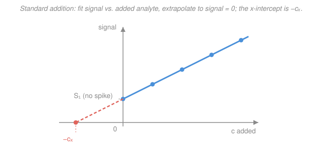

# Analytical & Instrumental Chemistry · Lesson 3.4: Voltammetry & standard addition

> ⏱ ~15 min · Module 3: Spectroscopic & electroanalytical methods · Builds on: [3.3 Potentiometry & ion-selective electrodes](03-03-potentiometry-ion-selective-electrodes.md), [2.4 Redox equilibria & titrations](02-04-redox-equilibria-titrations.md) · Unlocks: [4.1 Separation theory](04-01-separation-theory-plates-resolution.md)

## Why this matters

Potentiometry (3.3) measured a voltage at **zero current** — a passive listener. Voltammetry does the opposite: it *forces* electrons across the electrode by sweeping the applied potential, and reads the **current** that flows. That current is a direct count of how fast your analyte is being oxidized or reduced, so its size reports concentration — down to parts-per-billion for heavy metals, which is why voltammetry guards drinking water for lead and cadmium. But real samples (blood, seawater, wastewater) are a chemical jungle whose **matrix** distorts every instrument's response. This lesson also hands you the single most reliable fix for that: **standard addition**, the trick that lets you calibrate *inside the sample itself*.

## The idea

**Voltammetry.** Imagine slowly cranking up a voltage on an electrode dipped in solution. For a while, nothing: the analyte isn't feeling enough push to react. Then you cross its **redox potential** — the voltage at which it *wants* to give up or grab an electron — and suddenly current flows as molecules react at the electrode surface. Push harder and the current doesn't climb forever; it **plateaus**. Why? Because you're now reacting molecules as fast as fresh ones can *diffuse* in from the bulk. The electrode has become a hungry mouth eating everything that reaches it, and the eating rate is set by the delivery rate — which is proportional to concentration. That plateau height is your measurement.

**Standard addition.** Here's the problem voltammetry (and every instrument) faces. Suppose you build a calibration line in clean lab water, then measure a seawater sample. The salt, the organic gunk, the viscosity — all of it changes how your analyte responds. Your clean-water calibration now *lies*. The cure is disarmingly simple: instead of calibrating outside the sample, **spike known amounts of analyte into the sample itself** and watch how much the signal rises. The matrix is present in every reading, so it stops mattering — it just scales everything equally, and you divide it out.

## The formal version

**The three-electrode cell.** Voltammetry uses three electrodes, each with one job:

- **Working electrode (WE):** where the redox reaction you care about happens. You control its potential.
- **Reference electrode (RE):** a fixed, known potential (an Ag/AgCl or calomel electrode from 3.3) against which the WE's potential is *measured*. No meaningful current passes through it, so it stays stable.
- **Counter / auxiliary electrode (CE):** completes the circuit and carries the current, sparing the reference from having to.

*In words: one electrode does the chemistry, one holds a stable zero, one carries the current so the zero stays put.* You sweep the WE potential $E$ and record current $i$; the plot $i$ vs. $E$ is a **voltammogram**.

**Faradaic current and the limiting current.** When $E$ reaches the analyte's redox potential, electrons transfer and a **faradaic current** flows (faradaic = tied to an actual redox reaction, obeying Faraday's law). Push $E$ further and the current saturates at the **limiting (diffusion) current** $i_\text{lim}$, set by how fast analyte diffuses to the surface:

$$i_\text{lim} = k\,c,$$

where $c$ is the bulk analyte concentration and $k$ lumps together electrode area, diffusion coefficient, and number of electrons $n$. *In words: once you react molecules as fast as they arrive, the current is just proportional to concentration.* This linear $i_\text{lim} \propto c$ is the whole basis of quantitative voltammetry.

**Cyclic voltammetry (CV).** Sweep $E$ up *and then back down* and plot $i$ vs. $E$: you get the famous **"duck" curve** — a forward peak where the analyte reacts, a reverse peak where the product reacts back. For a reversible couple $\ce{O + n e- <=> R}$ the two peak potentials straddle the formal potential, separated by

$$\Delta E_p = E_{p,a} - E_{p,c} \approx \frac{0.0592}{n}\ \mathrm{V}\quad(\text{at } 25\,^\circ\mathrm{C}),$$

and the peak currents are equal. *In words: a clean, symmetric duck with a $\approx 59/n$ mV peak split means the reaction is fast and reversible.* (That $0.0592/n$ is the same Nernstian factor from 3.3 and [2.4](02-04-redox-equilibria-titrations.md) — CV is the Nernst equation drawn as a curve.)

**Stripping voltammetry.** For ultra-trace metals, first hold the WE at a reducing potential to **plate** the metal onto the electrode for minutes — *preconcentrating* it from a huge volume into a tiny film — then sweep back to **strip** it off, releasing a sharp current spike far larger than a single-pass scan would give. This is how you hit parts-per-trillion.

**Standard addition.** Signal is proportional to concentration, $S = k\,c$, but the proportionality constant $k$ is corrupted by the unknown matrix. Take the sample (unknown concentration $c_x$, giving signal $S_1$), then add a known analyte spike so the concentration becomes $c_x + c_s$ **while keeping the final volume fixed** (or correcting for dilution), giving signal $S_2$. Then

$$S_1 = k\,c_x, \qquad S_2 = k\,(c_x + c_s).$$

Dividing kills the mystery constant $k$ — matrix and all — and solving gives the **single-addition formula**:

$$\boxed{\,c_x = c_s\,\dfrac{S_1}{S_2 - S_1}\,}$$

*In words: the original concentration equals the spike size scaled by how much of the total signal was already there before you spiked.* With several spikes, plot $S$ against added concentration $c_\text{added}$; the line $S = k\,c_\text{added} + k\,c_x$ has slope $k$ and, extrapolated back to $S = 0$, a **negative x-intercept equal to $-c_x$**:

$$c_x = \frac{\text{intercept}}{\text{slope}}.$$

Standard addition corrects **multiplicative** matrix effects (the matrix scales $k$) precisely because the matrix rides along in every point — something an external calibration built in clean solvent can never do.

## Picture

## Worked examples

**Example 1 (mechanical — single addition).** A voltammetric peak for $\ce{Pb^2+}$ in a river-water sample gives limiting current $i_1 = 12.0\ \mathrm{\mu A}$. You spike the sample with lead so its concentration rises by $c_s = 5.00\ \mathrm{\mu M}$ (final volume unchanged), and now $i_2 = 30.0\ \mathrm{\mu A}$. Then

$$c_x = c_s\,\frac{i_1}{i_2 - i_1} = 5.00\,\frac{12.0}{30.0 - 12.0} = 5.00 \times \frac{12.0}{18.0} = 3.33\ \mathrm{\mu M}.$$

The spike *tripled the concentration's worth of extra signal you can see* ($18.0\ \mu\mathrm{A}$ for $5.00\ \mu\mathrm{M}$), which pins the original $12.0\ \mu\mathrm{A}$ at $3.33\ \mu\mathrm{M}$ — no clean-water calibration needed.

**Example 2 (why you'd care — the matrix trap).** Suppose the river matrix suppresses lead's signal so that $k$ is only 70% of its clean-water value. An external calibration built in pure water would report $c_x/0.70$ — a **43% high** error. Standard addition never touches the clean-water $k$: it measures the *actual* slope $k$ in the river matrix (from $i_2 - i_1$ over $c_s$) and uses only that. The 70% suppression cancels top and bottom in $i_1/(i_2 - i_1)$. That cancellation is the entire reason to reach for standard addition when you don't trust the matrix.

## Watch out

- **You might think standard addition fixes any interference.** It only fixes **multiplicative** (proportional) effects — the matrix scaling the slope. A **constant background** (an additive offset, e.g. a second species reacting at the same potential) shifts every point up equally and is *not* removed; you need a blank or better selectivity for that.
- **You might forget the dilution.** The clean formula assumes the spike doesn't change the volume (or you spiked with a tiny volume of concentrated standard). If adding the spike noticeably dilutes the sample, you must correct both signals for the volume change before applying the formula, or you'll under-report $c_x$.
- **You might read the x-intercept as $+c_x$.** The extrapolated intercept sits at **negative** added concentration; $c_x = |\text{x-intercept}| = \text{intercept}/\text{slope}$. The sign just says "how much analyte was already there before I added any."

## One-liner

> Voltammetry reads a diffusion-limited current proportional to concentration; standard addition calibrates *inside* the sample so an unknown matrix scales every point equally and divides out — the line's negative x-intercept is $-c_x$.

## Problems

**P1 (🟢)** A square-wave voltammetry scan of $\ce{Cd^2+}$ in a wastewater sample gives a peak current of $8.0\ \mathrm{\mu A}$. After spiking with cadmium to add $4.0\ \mathrm{\mu M}$ (final volume unchanged), the peak reads $20.0\ \mathrm{\mu A}$. Find the original cadmium concentration.

**P2 (🟡)** A multiple-standard-addition experiment for copper by anodic stripping gives a straight line of peak current (in $\mu\mathrm{A}$) versus added copper concentration (in $\mu\mathrm{M}$):

$$i_p = 2.50\,c_\text{added} + 8.00.$$

Find the copper concentration in the original sample from the x-intercept, and state the slope's physical meaning.

**P3 (🔴, Boss-3 rehearsal)** An unknown sample gives an instrument reading $A = 0.201$. You spike it with $2.00\ \mathrm{ppm}$ of analyte (final volume unchanged) and the reading rises to $A = 0.401$. Find the original concentration, and explain in one sentence why standard addition — not an external calibration curve — is the right method for an unknown matrix.

Solutions

**P1** Single-addition formula with $c_s = 4.0\ \mathrm{\mu M}$, $S_1 = 8.0$, $S_2 = 20.0\ \mathrm{\mu A}$:

$$c_x = c_s\,\frac{S_1}{S_2 - S_1} = 4.0\,\frac{8.0}{20.0 - 8.0} = 4.0 \times \frac{8.0}{12.0} = 2.67\ \mathrm{\mu M}.$$

*Check.* The spike added $12.0\ \mu\mathrm{A}$ of signal for $4.0\ \mu\mathrm{M}$, so $1\ \mu\mathrm{M} \to 3.0\ \mu\mathrm{A}$; the original $8.0\ \mu\mathrm{A}$ then corresponds to $8.0/3.0 = 2.67\ \mu\mathrm{M}$ ✓.

**P2** At the x-intercept the signal is zero: set $i_p = 0$ and solve for $c_\text{added}$:

$$0 = 2.50\,c_\text{added} + 8.00 \;\Longrightarrow\; c_\text{added} = -\frac{8.00}{2.50} = -3.20\ \mathrm{\mu M}.$$

The x-intercept is $-c_x$, so the original copper concentration is

$$c_x = \frac{\text{intercept}}{\text{slope}} = \frac{8.00}{2.50} = 3.20\ \mathrm{\mu M}.$$

The **slope** $2.50\ \mu\mathrm{A}/\mu\mathrm{M}$ is the analyte's sensitivity *measured in the real matrix* — the true response factor $k$ that an external calibration in clean solvent would have gotten wrong.

*Check.* The unspiked intercept is $8.00\ \mu\mathrm{A}$; dividing by the in-matrix sensitivity $2.50\ \mu\mathrm{A}/\mu\mathrm{M}$ gives $3.20\ \mu\mathrm{M}$, consistent ✓.

**P3** Single-addition formula with $c_s = 2.00\ \mathrm{ppm}$, $S_1 = 0.201$, $S_2 = 0.401$:

$$c_x = c_s\,\frac{S_1}{S_2 - S_1} = 2.00\,\frac{0.201}{0.401 - 0.201} = 2.00 \times \frac{0.201}{0.200} = 2.01\ \mathrm{ppm}.$$

Why standard addition: because the spike is added to the sample itself, the unknown matrix scales every reading by the same factor, so that factor cancels in $S_1/(S_2-S_1)$ — whereas an external calibration built in clean solvent would carry a wrong response factor and bias the result.

*Check.* The spike roughly doubled the signal ($0.201 \to 0.401$), and indeed the spike ($2.00\ \mathrm{ppm}$) is essentially equal to the original ($2.01\ \mathrm{ppm}$) — doubling the analyte doubled the signal, as linearity demands ✓.

## Flashback

**From Lesson 3.3 (Potentiometry & ion-selective electrodes):** A calcium ion-selective electrode ($\ce{Ca^2+}$, $n = 2$) gives a Nernstian response $E = \text{const} + \frac{0.0592}{n}\log a_{\ce{Ca^2+}}$. In a standard of activity $1.00\times10^{-3}\ \mathrm{M}$ it reads $E_1 = 100.0\ \mathrm{mV}$; in an unknown it reads $E_2 = 70.4\ \mathrm{mV}$. Find the calcium activity in the unknown.

Solution

Subtract the two Nernst expressions so the constant cancels. With $n = 2$, the slope is $0.0592/2 = 0.0296\ \mathrm{V} = 29.6\ \mathrm{mV}$ per decade:

$$E_2 - E_1 = \frac{0.0592}{2}\,\big(\log a_2 - \log a_1\big) = 29.6\ \mathrm{mV}\,\log\!\frac{a_2}{a_1}.$$

Plug in $E_2 - E_1 = 70.4 - 100.0 = -29.6\ \mathrm{mV}$:

$$-29.6 = 29.6\,\log\!\frac{a_2}{a_1} \;\Longrightarrow\; \log\!\frac{a_2}{a_1} = -1 \;\Longrightarrow\; \frac{a_2}{a_1} = 10^{-1}.$$

So $a_2 = 0.1 \times 1.00\times10^{-3} = 1.00\times10^{-4}\ \mathrm{M}$.

*Check.* A cation electrode reads a **lower** potential at **lower** activity (fewer positive ions to charge it), and indeed $70.4 < 100.0\ \mathrm{mV}$ matched a tenfold drop — exactly one $29.6\ \mathrm{mV}$ decade for a divalent ion ✓.

## Connections

- **Backward:** the faradaic current and the CV duck's $0.0592/n$ peak split are the Nernst equation from [3.3](03-03-potentiometry-ion-selective-electrodes.md) and the redox thermodynamics of [2.4](02-04-redox-equilibria-titrations.md), now driven by an *applied* potential instead of read at equilibrium. Standard addition's straight line is a least-squares calibration fit ([1.4](01-04-significance-tests-calibration.md)) relocated inside the sample, and its linearity mirrors Beer's law $A = \varepsilon b c$ from [3.1](03-01-uv-vis-beers-law.md).
- **Forward:** [4.1 Separation theory](04-01-separation-theory-plates-resolution.md) opens Module 4 — when the matrix interference is another *species* rather than a scaling factor, standard addition can't help and you must physically **separate** the analyte first; chromatography is the answer.
- **Sideways:** the three-electrode cell and applied-potential electrochemistry bridge to the electrochemistry thread in [`physical-chemistry`](../../physical-chemistry/syllabus.md) and the intro in [general-chemistry 4.4](../../general-chemistry/lessons/04-04-taste-of-electrochemistry.md); the standard-addition line is the least-squares regression from [`prob-stat-refresher`](../../prob-stat-refresher/syllabus.md), read backward to its x-intercept.
