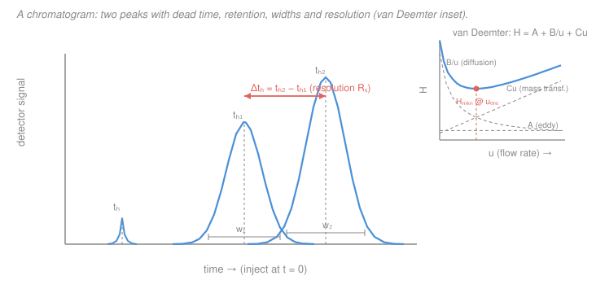

# Analytical & Instrumental Chemistry · Lesson 4.1: Separation theory — plates & resolution

> ⏱ ~15 min · Module 4: Chromatography, mass spectrometry & validation · Builds on: [1.2 Statistics of measurement](01-02-statistics-of-measurement.md), [`general-chemistry` 3.4 (chemical equilibrium)](../../general-chemistry/lessons/03-04-chemical-equilibrium-k-le-chatelier.md) · Unlocks: 4.2 (gas chromatography)

## Why this matters

Real samples are mixtures — a blood draw, a river-water grab, a synthesized batch with byproducts. Before you can *quantify* anything (Beer's law, potentiometry, mass spec), you usually have to *separate* it first. Chromatography is the workhorse that does this: it spreads a mixture out in time so each component elutes on its own. This lesson is the physics of that spreading — what sets *where* a peak lands, *how wide* it gets, and *whether two neighbors actually come apart*. Every knob you'll turn in GC (4.2), HPLC (4.3), and every "why is my peak fat?" troubleshooting question traces back to the three equations here.

## The idea

Picture a crowd walking down a hallway lined with sticky wallpaper. Everyone moves forward with the flowing air (the **mobile phase**), but each person keeps brushing the walls (the **stationary phase**) and getting briefly stuck. People who *like* the wallpaper stick more often and fall behind; people who ignore it sail through. Start everyone at the same door and by the far end they've sorted themselves by stickiness — that's a separation.

Two things decide whether you can tell two people apart at the exit. First, **how differently they stick** — if analyte A is a little stickier than B, their average arrival times drift apart. That's a *thermodynamic* difference (which molecule prefers which phase), and it's the same partitioning equilibrium you met in general chemistry, just run continuously down a tube. Second, **how tightly each person's arrivals bunch up** — even identical stickiness gives a *spread* of arrival times because sticking is random. A tight bunch (a narrow peak) is a good, *efficient* column; a smeared crowd is a bad one. Good separation = the centers far apart **and** each peak narrow. Those two ideas — retention and efficiency — combine into one number, **resolution**, and one master equation tells you exactly which knob fixes a bad separation.

## The formal version

A detector at the column exit records **signal vs. time** — a **chromatogram**. Each component makes a peak. Define, for one peak:

- **Dead time** $t_M$ (min): when an *unretained* species (one that never sticks) exits — it just rides the mobile phase through. This clocks the mobile-phase transit.
- **Retention time** $t_R$ (min): when the *analyte's* peak apex exits.
- **Retention factor** $k$ (dimensionless): how much *extra* time the analyte spends stuck, relative to riding through,

$$k = \frac{t_R - t_M}{t_M}.$$

*In words: $k$ is how many times longer the analyte takes than the solvent front — $k=4$ means it dawdles four "dead-times" in the stationary phase for every one spent moving.* Microscopically $k = K\,\dfrac{V_S}{V_M}$, where $K$ is the analyte's **distribution constant** (its stationary/mobile concentration ratio — the [equilibrium constant](../../general-chemistry/lessons/03-04-chemical-equilibrium-k-le-chatelier.md) for partitioning) and $V_S, V_M$ are the phase volumes. Retention *is* equilibrium, sampled continuously.

**Selectivity** compares two analytes:

$$\alpha = \frac{k_2}{k_1} \ge 1 \quad (\text{convention: } k_2 > k_1).$$

*In words: $\alpha$ measures how differently the two molecules partition — it's purely thermodynamic, set by the chemistry of the phases, not by how you run the column.* If $\alpha = 1$ the two are chemically indistinguishable to this column and can never separate.

**Peaks are Gaussian.** Random stick-and-release events pile up into a bell curve (central-limit, exactly the Gaussian of [1.2](01-02-statistics-of-measurement.md)) with standard deviation $\sigma$ in time units. Its widths:

- **baseline width** $w = 4\sigma$ (intercepts of the tangent lines with the baseline),
- **width at half height** $w_{1/2} = 2.355\,\sigma$.

**Efficiency — the plate number.** A narrow peak relative to its retention time means a good column. Quantify with the **plate number** $N$:

$$N = 16\left(\frac{t_R}{w}\right)^2 = 5.54\left(\frac{t_R}{w_{1/2}}\right)^2.$$

*In words: $N$ counts how many times the analyte effectively re-equilibrated on the way down — more plates, sharper peaks.* Both forms equal $N = (t_R/\sigma)^2$ (since $16 = 4^2$ and $5.54 = 2.355^2$); use whichever width you can measure. The name is historical — the column behaves *as if* it were $N$ discrete equilibration stages ("theoretical plates"). Dividing the column length $L$ by $N$ gives the **plate height**:

$$H = \frac{L}{N}.$$

*In words: $H$ is the length of column that does one plate's worth of separating — smaller $H$ is better (more plates packed into the same tube).*

**Resolution.** Do two neighboring peaks actually come apart? Compare their center gap to their average width:

$$R_s = \frac{t_{R2} - t_{R1}}{\tfrac12(w_1 + w_2)} = \frac{\Delta t_R}{\text{average width}}.$$

*In words: resolution is "how far apart" divided by "how fat" — big gap, thin peaks $\Rightarrow$ high $R_s$.* The benchmark: $R_s \ge 1.5$ is **baseline resolution** (peaks return to baseline between them, <0.3% overlap); $R_s = 1.0$ leaves a visible notch (~2% overlap).

**The master resolution equation** decomposes $R_s$ into three independent levers:

$$R_s = \underbrace{\frac{\sqrt{N}}{4}}_{\text{efficiency}} \cdot \underbrace{\frac{\alpha - 1}{\alpha}}_{\text{selectivity}} \cdot \underbrace{\frac{k}{1+k}}_{\text{retention}}.$$

*In words: to fix a bad separation you can make the column more efficient (raise $N$), pick phases where the analytes partition more differently (raise $\alpha$), or make them stick longer (raise $k$).* Note $R_s \propto \sqrt{N}$: doubling resolution by efficiency alone costs a **4×** longer column. Selectivity is the strongest, cheapest lever — a small $\alpha$ change moves $R_s$ a lot. The retention term saturates: once $k \gtrsim 5$, $k/(1+k) \to 1$ and pushing $k$ higher just wastes time.

**What sets $N$ — the van Deemter equation.** Plate height depends on the mobile-phase linear velocity $u$ (cm/s):

$$H = A + \frac{B}{u} + C\,u.$$

- $A$ — **eddy diffusion**: molecules take many-length paths through the packing. Roughly velocity-independent.
- $B/u$ — **longitudinal diffusion**: analyte spreads along the tube while it sits there. *Worse at low $u$* (more time to diffuse).
- $Cu$ — **mass-transfer resistance**: at high flow, molecules can't equilibrate between phases fast enough and smear. *Worse at high $u$.*

*In words: go too slow and diffusion fattens the peak; go too fast and slow equilibration fattens it.* The two competing terms give $H(u)$ a **minimum** — an optimum velocity

$$u_{\text{opt}} = \sqrt{\frac{B}{C}}, \qquad H_{\min} = A + 2\sqrt{BC}.$$

At $u_{\text{opt}}$ the column is sharpest. Push the flow *past* the optimum and the $Cu$ term takes over — peaks broaden, $N$ drops, resolution falls. That trade (speed vs. sharpness) is the central decision in method development.

## Picture

## Worked examples

**Example 1 (mechanical — read the column's report card off one peak).** An analyte on a $L = 25\ \mathrm{cm}$ column has $t_M = 1.5\ \mathrm{min}$, $t_R = 11.5\ \mathrm{min}$, baseline width $w = 0.80\ \mathrm{min}$.

$$k = \frac{t_R - t_M}{t_M} = \frac{11.5 - 1.5}{1.5} = \frac{10}{1.5} = 6.67.$$

$$N = 16\left(\frac{t_R}{w}\right)^2 = 16\left(\frac{11.5}{0.80}\right)^2 = 16(14.375)^2 = 16(206.6) = 3306.$$

$$H = \frac{L}{N} = \frac{25\ \mathrm{cm}}{3306} = 7.56\times 10^{-3}\ \mathrm{cm} = 75.6\ \mathrm{\mu m}.$$

So the analyte spends about 6.7 dead-times stuck, the column is worth ~3300 plates, and each plate is ~76 μm of tubing. Those three numbers *are* the column's report card.

**Example 2 (why you'd care — which knob to turn).** Two peaks give $R_s = 0.67$ — badly overlapped. Current conditions: $N = 4900$, $k = 4.0$, $\alpha = 1.05$. Check and then improve.

$$R_s = \frac{\sqrt{4900}}{4}\cdot\frac{1.05-1}{1.05}\cdot\frac{4.0}{1+4.0} = \frac{70}{4}(0.0476)(0.80) = 17.5 \times 0.0476 \times 0.80 = 0.667.\ \checkmark$$

Now compare levers to reach $R_s \ge 1.5$:

- **Efficiency:** $R_s \propto \sqrt{N}$, so I'd need $N \to 4900(1.5/0.667)^2 = 4900(5.06) = 2.5\times10^4$ — a **5× longer column** (and 5× the run time). Brutal.
- **Selectivity:** change the stationary phase so $\alpha: 1.05 \to 1.10$. Then $\frac{\alpha-1}{\alpha} = \frac{0.10}{1.10} = 0.0909$, nearly doubling it: $R_s = 17.5(0.0909)(0.80) = 1.27$. A *tiny* chemistry change almost got us there — and a bit more (or combined with modest $N$) clears 1.5.

That asymmetry — selectivity cheap, efficiency expensive ($\sqrt{N}$) — is the whole logic of method development.

## Watch out

- **You might think a bigger $N$ always means better separation.** $N$ (efficiency) only sets peak *sharpness*. If $\alpha = 1$ (the analytes partition identically), $\frac{\alpha-1}{\alpha}=0$ and $R_s = 0$ **no matter how many plates you have** — infinitely sharp peaks sitting on top of each other. You must have a thermodynamic difference first.
- **You might think faster flow just means a faster run at some quality cost.** Below $u_{\text{opt}}$, speeding *up* actually *sharpens* peaks (you outrun longitudinal diffusion, the $B/u$ term). It's only *past* the minimum that faster = fatter (the $Cu$ term). Always ask which side of the van Deemter minimum you're on.
- **You might plug half-height width into the "16" formula.** The constant is tied to the width: $16$ goes with baseline $w$, $5.54$ with $w_{1/2}$. Mixing them (e.g. $16(t_R/w_{1/2})^2$) inflates $N$ by ~3.5×. Match the constant to the width you measured.
- **$k$ vs. $K$.** The retention factor $k$ (a time ratio you read off the chromatogram) and the distribution constant $K$ (a concentration ratio) differ by the phase-volume ratio $V_S/V_M$. Same phase, different column geometry $\Rightarrow$ same $K$ but different $k$.

## One-liner

> Resolution = separate the centers **and** keep the peaks thin: $R_s = \frac{\sqrt N}{4}\cdot\frac{\alpha-1}{\alpha}\cdot\frac{k}{1+k}$, with efficiency ($N$) set by riding the van Deemter minimum and selectivity ($\alpha$) the cheapest lever of all.

## Problems

**P1 (🟢)** A chromatographic peak has dead time $t_M = 1.20\ \mathrm{min}$, retention time $t_R = 8.40\ \mathrm{min}$, and baseline width $w = 0.60\ \mathrm{min}$. Compute the retention factor $k$ and the plate number $N$.

**P2 (🟡)** Two analytes elute at $t_{R1} = 6.40\ \mathrm{min}$ and $t_{R2} = 7.00\ \mathrm{min}$, each with baseline width $0.50\ \mathrm{min}$. Compute the resolution $R_s$. Is this baseline separation? If not, name one change that would fix it fastest.

**P3 (🔴, Boss-4)** Two peaks elute at $5.00$ and $5.40\ \mathrm{min}$, each with baseline width $0.20\ \mathrm{min}$, on a $30.0\ \mathrm{cm}$ column. (a) Compute $R_s$ — is it baseline-separated? (b) Find the plate number $N$ and plate height $H$ for the *later* peak. (c) A colleague wants to run the flow rate higher to shorten the analysis. Using the van Deemter equation, explain whether increasing the flow *past the optimum* helps or hurts the separation, and why.

Solutions

**P1** Retention factor:

$$k = \frac{t_R - t_M}{t_M} = \frac{8.40 - 1.20}{1.20} = \frac{7.20}{1.20} = 6.00.$$

Plate number (baseline width $\Rightarrow$ use the 16 form):

$$N = 16\left(\frac{t_R}{w}\right)^2 = 16\left(\frac{8.40}{0.60}\right)^2 = 16(14.0)^2 = 16(196) = 3136.$$

*Check.* $k=6$ is a healthy retention (well past the solvent front, comfortably in the $k=2$–$10$ sweet spot); $N \approx 3100$ is a plausible packed column. Units cancel in both. ✓

**P2** 

$$R_s = \frac{t_{R2}-t_{R1}}{\tfrac12(w_1+w_2)} = \frac{7.00-6.40}{\tfrac12(0.50+0.50)} = \frac{0.60}{0.50} = 1.20.$$

$R_s = 1.20 < 1.5$, so **not** baseline separation — there's a visible notch and ~2–3% overlap. Fastest fix: raise **selectivity** $\alpha$ by changing the stationary (or mobile) phase — because $R_s$ depends on $\sqrt{N}$, buying the same improvement through efficiency alone would need a $(1.5/1.2)^2 = 1.56\times$ longer column and run time, whereas a small $\alpha$ change can move $R_s$ a lot for free.

*Check.* Equal widths, so the average width is just $0.50$; gap $0.60 > 0.50$ gives $R_s$ just above 1 — consistent with "almost, but not quite baseline." ✓

**P3 (Boss-4)** 

**(a) Resolution.** Widths equal at $0.20$, so average width $= 0.20$:

$$R_s = \frac{5.40 - 5.00}{\tfrac12(0.20+0.20)} = \frac{0.40}{0.20} = 2.00.$$

$R_s = 2.00 \ge 1.5$ $\Rightarrow$ **yes, baseline separated**, with comfortable margin (peaks fully return to baseline between them).

**(b) Efficiency for the later peak** ($t_R = 5.40\ \mathrm{min}$, $w = 0.20\ \mathrm{min}$, $L = 30.0\ \mathrm{cm}$):

$$N = 16\left(\frac{t_R}{w}\right)^2 = 16\left(\frac{5.40}{0.20}\right)^2 = 16(27.0)^2 = 16(729) = 11{,}664.$$

$$H = \frac{L}{N} = \frac{30.0\ \mathrm{cm}}{11{,}664} = 2.57\times 10^{-3}\ \mathrm{cm} = 25.7\ \mathrm{\mu m}.$$

**(c) Flow rate.** In $H = A + B/u + Cu$, the column is sharpest at the minimum $u_{\text{opt}} = \sqrt{B/C}$. Increasing the flow **past** that optimum makes the mass-transfer term $Cu$ grow: molecules no longer have time to equilibrate between the mobile and stationary phases, so each peak **broadens** ($H$ rises, $N = L/H$ falls). Wider peaks shrink resolution ($R_s \propto \sqrt{N}$), so pushing the flow past the optimum **hurts** the separation. (We do have margin — $R_s = 2.0$ vs. the $1.5$ target — so *some* speed-up is affordable until $R_s$ approaches $1.5$; but there's no free lunch beyond $u_{\text{opt}}$, only a resolution-for-time trade.)

*Check.* $N \approx 11{,}700$ and $H \approx 26\ \mathrm{\mu m}$ are typical of an efficient column; $H = L/N$ has units cm/(dimensionless) = cm ✓. The later, more-retained peak having a large $N$ is expected. ✓

## Flashback

**From Lesson 1.2 (Statistics of measurement):** A chromatographic peak is Gaussian with standard deviation $\sigma = 0.050\ \mathrm{min}$ and apex at $t_R = 5.00\ \mathrm{min}$. (a) Find the baseline width $w = 4\sigma$ and the half-height width $w_{1/2} = 2.355\sigma$. (b) Compute $N$ from *each* width and confirm they agree.

Solution

**(a)** Straight from the Gaussian spread:

$$w = 4\sigma = 4(0.050) = 0.20\ \mathrm{min}, \qquad w_{1/2} = 2.355\sigma = 2.355(0.050) = 0.118\ \mathrm{min}.$$

**(b)** 

$$N = 16\left(\frac{t_R}{w}\right)^2 = 16\left(\frac{5.00}{0.20}\right)^2 = 16(25.0)^2 = 10{,}000,$$

$$N = 5.54\left(\frac{t_R}{w_{1/2}}\right)^2 = 5.54\left(\frac{5.00}{0.118}\right)^2 = 5.54(42.4)^2 = 5.54(1799) = 9{,}966 \approx 10{,}000.$$

They agree (the tiny gap is just $2.355^2 = 5.545$ rounded to $5.54$). Both equal $N = (t_R/\sigma)^2 = (5.00/0.050)^2 = 100^2 = 10{,}000$ exactly.

*Check.* This is why $\sigma$ from [1.2](01-02-statistics-of-measurement.md) is the hidden variable behind both plate formulas: the "16" and "5.54" are nothing but $4^2$ and $2.355^2$, the squared conversions from $\sigma$ to each width. A peak's efficiency is just how small its spread $\sigma$ is compared to when it arrives. ✓

## Connections

- **Backward:** the Gaussian peak and its width are the [1.2](01-02-statistics-of-measurement.md) normal distribution wearing a chromatography label — $N=(t_R/\sigma)^2$ makes $\sigma$ the master variable. Retention $k = K\,V_S/V_M$ is the partitioning [equilibrium constant](../../general-chemistry/lessons/03-04-chemical-equilibrium-k-le-chatelier.md) $K$ run continuously down a column; selectivity $\alpha$ is a *ratio* of two such equilibria.
- **Forward:** [4.2 Gas chromatography](04-02-gas-chromatography.md) puts real numbers on $A$, $B$, $C$ for a gas mobile phase and uses the van Deemter minimum to pick a carrier-gas flow; the plate/resolution machinery here carries straight into HPLC (4.3) and every quantitation that needs a clean peak first.
- **Sideways (stats & phys-chem):** the Gaussian/$\sigma$ link bridges to the [statistics refresher](../../prob-stat-refresher/syllabus.md); the partition-equilibrium view of retention bridges to phase equilibria in the [physical chemistry](../../physical-chemistry/syllabus.md) track.
