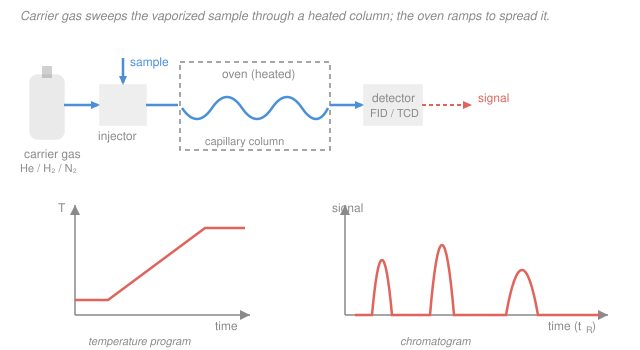

# Analytical & Instrumental Chemistry · Lesson 4.2: Gas chromatography

> ⏱ ~15 min · Module 4: Chromatography, mass spectrometry & validation · Builds on: [4.1 Separation theory: plates & resolution](04-01-separation-theory-plates-resolution.md) · Unlocks: 4.3 (high-performance liquid chromatography)

## Why this matters

Gas chromatography (GC) is the workhorse for anything you can boil without breaking: gasoline blends, blood alcohol, flavor and fragrance mixtures, pesticide residues, breath and blood gases, purity of a synthesized drug. It routinely pulls apart mixtures of *dozens* of components in a single run, each coming off the column as a sharp peak you can identify by *when* it arrives and quantify by *how much area* it makes. Lesson 4.1 gave you the vocabulary of separation — retention factor $k$, resolution $R_s$, plate number $N$, van Deemter $H=A+B/u+Cu$. GC is where you turn those knobs on a real instrument: pick the gas, pick the column, and — the move unique to GC — *change the temperature mid-run*.

## The idea

GC is a race down a long thin tube. The runners are your analyte molecules; the racetrack is a **capillary column** whose inner wall is coated with a thin liquid film — the **stationary phase**. A stream of inert gas — the **carrier gas**, or **mobile phase** — pushes everything forward. A molecule only moves while it's out in the gas; whenever it dissolves into the liquid film it stops and waits. So the more time a compound spends dissolved, the slower it crosses, and different compounds cross at different speeds. That difference is the separation.

Two things decide how long a compound loiters in the film. First, **volatility**: a low-boiling compound would rather be a gas, so it spends little time in the liquid and races out early; a high-boiling one clings to the film and lags. Second, **chemical affinity**: "like dissolves like." A polar film grabs polar molecules and lets nonpolar ones slip by; a nonpolar film does the reverse. So GC sorts a mixture roughly by boiling point, with a chemistry-dependent nudge from the stationary phase you chose.

Here's the tension that makes GC its own craft. Hold the oven at a *low* temperature and the volatile pieces separate beautifully — but the heavy pieces barely move and dribble out hours later as broad, flat smears (if at all). Crank the oven *hot* and the heavy pieces come off sharp and fast — but the volatile pieces all sprint out in a useless clump near the front. A single fixed temperature can't serve both ends of a wide-boiling mixture. The fix is **temperature programming**: start cool to resolve the light stuff, then *ramp the oven up during the run* so each heavier compound meets its ideal temperature just as its turn comes. That one trick is the heart of practical GC.

## The formal version

**The retention factor, revisited.** From 4.1, a compound's retention factor is

$$k = \frac{t_R - t_M}{t_M},$$

where $t_R$ is its retention time and $t_M$ is the **dead time** — how long an unretained molecule (one that never enters the film) takes to traverse the column. *In words: $k$ is the number of extra column-times a compound spends because it keeps dissolving into the stationary phase.* It ties to the underlying **distribution constant** $K$ (the equilibrium ratio of concentration in the stationary film to concentration in the gas) by $k = K\,V_s/V_m$, with $V_s, V_m$ the stationary and mobile phase volumes.

The temperature dependence is the whole reason temperature programming works. $K$ falls steeply as temperature rises (hotter means higher vapor pressure, so molecules prefer the gas), so **$k$ drops as the oven heats** — roughly, $\ln k$ falls almost linearly with $T$, dropping by a factor of $\sim2$–$3$ for every $30\ \mathrm{^\circ C}$. A compound sitting nearly frozen on the column at $k = 100$ can be coaxed to a well-behaved $k \approx 5$ just by warming the oven.

**The mobile phase is inert gas.** Unlike HPLC (4.3), the GC mobile phase does no chemistry — it just carries. Choices: helium ($\ce{He}$, the standard), hydrogen ($\ce{H2}$, fastest and cheapest but flammable), nitrogen ($\ce{N2}$, cheap but slow). The choice is governed by **van Deemter**, $H = A + B/u + Cu$, where $u$ is the carrier's linear velocity and $H$ the plate height (smaller $H$ = more plates $N = L/H$ = sharper peaks). The optimum velocity is $u_{\text{opt}} = \sqrt{B/C}$, and lighter carrier gases ($\ce{H2}, \ce{He}$) push it to higher $u$ with a flatter curve — *you can run fast without losing many plates.* $\ce{N2}$ has a deep, narrow minimum at low $u$: great plates, but only if you run slowly.

**The stationary phase** on a capillary column is almost always a cross-linked **polysiloxane** film. Its polarity is the tuning knob:

- **Nonpolar** (100% dimethylpolysiloxane): retains by boiling point; ideal for hydrocarbons, solvents, nonpolar analytes.
- **Polar** (e.g. polyethylene-glycol, or cyanopropyl-substituted siloxane): adds dipole/H-bond interactions; separates alcohols, acids, amines, and other polar species that a nonpolar column can't resolve.

*In words: match the column's polarity to the analyte's — "like dissolves like."*

**Injection.** The sample is flash-vaporized in a hot injector. Two modes:

- **Split** — most of the vaporized sample is vented; only a small fraction reaches the column. Use for *concentrated* samples that would overload the column.
- **Splitless** — nearly all of the sample goes on-column. Use for *trace* analysis, where you can't afford to throw sample away.

**Detectors** turn eluting compounds into peaks:

| Detector | Detects | Notes |
|---|---|---|
| **FID** (flame ionization) | organics (C–H) | universal for organics, very sensitive, huge linear range, **destructive**; blind to $\ce{H2O}, \ce{CO2}, \ce{N2}, \ce{O2}$ |
| **TCD** (thermal conductivity) | anything different from the carrier | truly universal incl. **inorganics/permanent gases**, **nondestructive**, but $\sim10^3\times$ less sensitive than FID |
| **ECD** (electron capture) | halogens, nitro groups | exquisitely sensitive to electronegative atoms (pesticides, $\ce{PCB}$s) |
| **MS** (mass spectrometry) | everything, + identity | GC–MS gives a spectrum per peak → structural ID (that's 4.4) |

The two numbers you read off every peak: **retention time $t_R$ identifies** (compare to a standard run under identical conditions), and **peak area quantifies** (proportional to amount, via a calibration curve or internal standard — see 4.1's statistics and 1.4's calibration).

## Picture

## Worked examples

**Example 1 (mechanical — identify and quantify).** A three-component solvent mixture is run by GC–FID. Pure standards, injected separately under identical conditions, elute at: methanol $t_R = 1.8$ min, acetone $2.2$ min, ethanol $2.6$ min, 1-propanol $4.1$ min. The sample chromatogram shows three peaks:

| Peak | $t_R$ (min) | Area (arb. units) |
|---|---|---|
| 1 | 1.8 | 4500 |
| 2 | 2.6 | 12000 |
| 3 | 4.1 | 3500 |

*Identify:* matching $t_R$ to the standards, peak 1 = **methanol**, peak 2 = **ethanol**, peak 3 = **1-propanol**. No peak at 2.2 min, so acetone is **absent**. *Quantify (area %):* total area $= 4500 + 12000 + 3500 = 20000$, so

$$\text{methanol} = \frac{4500}{20000} = 22.5\%,\quad \text{ethanol} = \frac{12000}{20000} = 60.0\%,\quad \text{1-propanol} = \frac{3500}{20000} = 17.5\%.$$

Area percent equals *amount* percent only if the three compounds have equal detector response — for exact work you'd correct each area by a measured response factor (FID response scales with carbon number), but area % is the standard quick relative report.

**Example 2 (why you'd care — choosing the carrier gas with van Deemter).** You need a *fast* GC method without sacrificing many plates. Reach back to van Deemter, $H = A + B/u + Cu$ (4.1). Nitrogen has a large $B$ term (but that's not the issue) and, crucially, a large $C$ term, so its curve turns sharply upward past a *low* optimum velocity — run it fast and $H$ balloons, $N$ collapses. Hydrogen and helium have small $C$ terms: their $H$-vs-$u$ curves are **flat and shifted to higher $u$**, with $u_{\text{opt}} = \sqrt{B/C}$ landing well above nitrogen's. So with $\ce{H2}$ (or $\ce{He}$) you can push the velocity up — a *shorter run* — and still sit near the plate-height minimum. That's exactly why fast GC uses hydrogen: van Deemter says the speed penalty is small. (The cost is that $\ce{H2}$ is flammable and needs leak precautions.)

## Watch out

- **You might think "hotter oven = better separation."** Not so — raising the temperature *lowers* every $k$, so peaks bunch toward the dead time and resolution collapses. Higher $T$ buys speed, not resolution. The reason temperature *programming* works is that it gives each compound a good $k$ *at the moment it elutes*, not a single compromise $T$ for all.
- **You might reach for FID on a permanent-gas sample.** FID needs C–H bonds to make ions in its flame, so it's blind to $\ce{N2}, \ce{O2}, \ce{CO2}, \ce{H2O}$, and the noble gases. For inorganics and fixed gases you need **TCD** (or a specialized detector), even though it's far less sensitive.
- **You might read peak *height* as the amount.** Quantify by **area**, not height — a broadened or tailing peak can be short but hold plenty of analyte. Height depends on peak shape (and thus on temperature and flow); area doesn't.
- **Split vs. splitless, backwards.** Split *dilutes* — it's for concentrated samples that would overload the column. Splitless puts (almost) everything on-column — it's for trace work. Using split on a trace sample throws away the signal you were trying to measure.

## One-liner

> GC races volatile molecules down a heated capillary — an inert gas pushing, a liquid film holding back by boiling point and "like dissolves like" — and you tune it by choosing the column's polarity, the carrier gas (via van Deemter), and above all by *ramping the oven temperature* so every $k$ is right on time.

## Problems

**P1 (🟢)** A gasoline-oxygenate sample is run by GC and compared to standards (identical conditions) that elute at: benzene $t_R = 3.10$ min, toluene $4.85$ min, ethylbenzene $6.40$ min, $o$-xylene $7.05$ min. The sample gives three peaks: $t_R = 3.10$ min (area 8200), $4.85$ min (area 15600), $7.05$ min (area 6200). Identify each peak and report the composition as area percent.

**P2 (🟡)** For each sample below, choose (a) a nonpolar or polar column and (b) FID or TCD, and justify in one line each. (i) Trace petroleum hydrocarbons ($\ce{C6}$–$\ce{C12}$ alkanes) in a water sample. (ii) The permanent gases $\ce{N2}$, $\ce{O2}$, $\ce{CO2}$, and $\ce{Ar}$ in a headspace sample.

**P3 (🔴)** A sample spans a wide boiling range: a light solvent (bp $\approx 60\ \mathrm{^\circ C}$) plus a heavy wax (bp $\approx 350\ \mathrm{^\circ C}$). Explain, in terms of the retention factor $k$ from 4.1, why *isothermal* operation fails at both a low and a high fixed temperature, and how a temperature *program* fixes it. Address both peak resolution early and peak shape/elution time late.

Solutions

**P1** Match retention times to the standards: $3.10$ min = **benzene**, $4.85$ min = **toluene**, $7.05$ min = **$o$-xylene**. There is no peak at $6.40$ min, so **ethylbenzene is absent**.

Total area $= 8200 + 15600 + 6200 = 30000$. Area percents:

$$\text{benzene} = \frac{8200}{30000} = 27.3\%,\quad \text{toluene} = \frac{15600}{30000} = 52.0\%,\quad o\text{-xylene} = \frac{6200}{30000} = 20.7\%.$$

(These sum to $100\%$. As in Example 1, area % = amount % only under equal detector response; for these similar aromatics on an FID the response factors are close, so the approximation is good.)

**P2** (i) *Trace hydrocarbons in water.* Column: **nonpolar** (e.g. 100% dimethylpolysiloxane) — "like dissolves like," so nonpolar alkanes are well retained and separate by boiling point; a polar column would barely retain them. Detector: **FID** — hydrocarbons are pure C–H, exactly what FID sees best, and its sensitivity and wide linear range suit *trace* levels. (Bonus: use **splitless** injection for the trace sample.)

(ii) *Permanent gases.* Detector: **TCD** — $\ce{N2}$, $\ce{O2}$, $\ce{Ar}$ have no C–H and $\ce{CO2}$ gives essentially no FID response, so FID is blind here; TCD responds to any species whose thermal conductivity differs from the carrier, so it sees them all. Column: a **nonpolar/porous-polymer or molecular-sieve** column (not a conventional polar liquid film) — these fixed gases are separated by size/adsorption, not by dissolving in a polar liquid. The key decision is the detector: TCD is mandatory because the analytes are inorganic.

**P3** Recall $k = (t_R - t_M)/t_M$, and that $k$ *falls* as temperature rises (higher $T$ → higher vapor pressure → smaller distribution constant $K$).

*Low fixed $T$ (say $50\ \mathrm{^\circ C}$).* The light solvent gets a reasonable $k$ and resolves nicely. But the heavy wax has an enormous $K$, so $k$ is huge — it creeps down the column and elutes only after a very long time, if at all, as a broad, flat, low peak. Diffusion during that long residence smears the band ([4.1](04-01-separation-theory-plates-resolution.md)'s $B/u$ broadening), destroying its shape and detectability.

*High fixed $T$ (say $250\ \mathrm{^\circ C}$).* Now the wax has a manageable $k$ and comes off sharp — but the light solvent's $k$ has collapsed toward $0$: it barely interacts with the film and rushes out right at the dead time $t_M$, unresolved from the solvent front and from anything else volatile. Resolution at the front is lost.

*Temperature program.* Start cool so the volatile solvent has an adequate $k$ and resolves at the front; then ramp the oven up during the run. As $T$ climbs, the wax's $k$ drops from "stuck" to a well-behaved few, so it elutes at a reasonable time *as a sharp peak* (short residence at high $T$ ⇒ little diffusional broadening). Each compound effectively meets the temperature that gives it a good $k$ *right when its turn comes* — resolving the light end and sharpening the heavy end in one run. This is the "general elution problem," and temperature programming is its standard solution.

## Flashback

**From Lesson 4.1 (Separation theory: plates & resolution):** On a $25\ \mathrm{cm}$ capillary column, an unretained marker elutes at $t_M = 1.0$ min. An analyte peak appears at $t_R = 9.0$ min with a baseline width $W_b = 0.60$ min. Compute (a) the retention factor $k$ and (b) the plate number $N$ and plate height $H$. (Fresh variant.)

Solution

(a) Retention factor:

$$k = \frac{t_R - t_M}{t_M} = \frac{9.0 - 1.0}{1.0} = 8.0.$$

*In words: this compound spends 8 column-times' worth of extra time dissolved in the stationary film.*

(b) Plate number from baseline width (using $N = 16\,(t_R/W_b)^2$):

$$N = 16\left(\frac{9.0}{0.60}\right)^2 = 16\,(15)^2 = 16 \times 225 = 3600 \text{ plates.}$$

Plate height $H = L/N = \dfrac{25\ \mathrm{cm}}{3600} = 6.9\times10^{-3}\ \mathrm{cm} = 69\ \mathrm{\mu m}$.

*Check.* $t_R$ and $W_b$ share units (min), so $N$ is dimensionless ✓. $H$ on the order of tens of micrometers is typical for a good capillary column ✓.

## Connections

- **Backward:** GC is [4.1](04-01-separation-theory-plates-resolution.md) made physical — retention factor $k$, resolution $R_s$, plate number $N$, and van Deemter $H = A + B/u + Cu$ are exactly the quantities you tune here via carrier gas, flow, and temperature. Quantifying peaks by area leans on the calibration and statistics of [1.4](01-04-significance-tests-calibration.md). The temperature dependence of the distribution constant $K$ is the equilibrium/Van't Hoff thermodynamics of [physical chemistry](../../physical-chemistry/syllabus.md).
- **Forward:** [4.3 HPLC](04-03-hplc.md) does the same separation for *nonvolatile* analytes, replacing the carrier gas with a liquid mobile phase and temperature programming with a solvent *gradient*. [4.4 Mass spectrometry](04-04-mass-spectrometry.md) is the detector that also identifies — GC–MS puts a spectrum under every peak.
- **Sideways:** "like dissolves like" — matching column polarity to analyte polarity — is the same intermolecular-forces logic that governs solubility and extraction in general and organic chemistry; the split/splitless and detector-choice decisions are the front end of the method validation you formalize in [4.5](04-05-sampling-method-validation.md).
