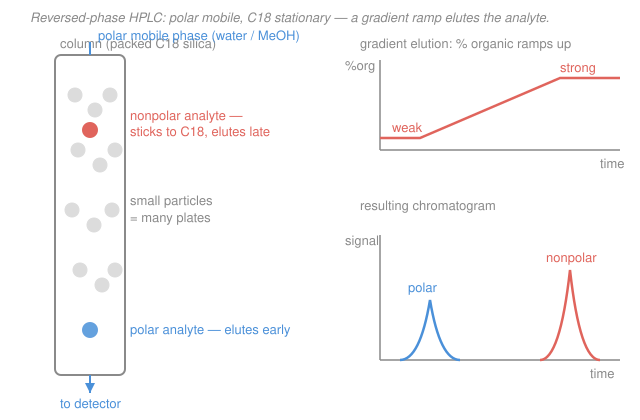

# Analytical & Instrumental Chemistry · Lesson 4.3: High-performance liquid chromatography

> ⏱ ~15 min · Module 4: Chromatography, mass spectrometry & validation · Builds on: [4.1 Separation theory: plates & resolution](04-01-separation-theory-plates-resolution.md), [4.2 Gas chromatography](04-02-gas-chromatography.md) · Unlocks: [4.4 Mass spectrometry](04-04-mass-spectrometry.md)

## Why this matters

Gas chromatography ([4.2](04-02-gas-chromatography.md)) is gorgeous — but it only works if you can boil your sample without wrecking it. Vaporize a protein, a sugar, a pharmaceutical salt, a dye, or most of the metabolites in your blood, and they either refuse to evaporate or char on the way. That rules out the majority of interesting molecules on Earth. **High-performance liquid chromatography (HPLC)** is how analytical chemistry separates everything GC can't: nonvolatile, thermally fragile, or large analytes, run cool and wet. It is the single most-used quantitative separation method in pharma, biotech, food, and environmental labs — and in [4.4](04-04-mass-spectrometry.md) it becomes the front end of LC–MS.

## The idea

Chromatography is always the same bet ([4.1](04-01-separation-theory-plates-resolution.md)): a **mobile phase** sweeps analytes through a **stationary phase**, and molecules that cling harder to the stationary phase fall behind. GC's mobile phase is a gas, so GC needs your molecules airborne. HPLC swaps in a **liquid mobile phase**, pumped under high pressure through a column packed with tiny solid particles. No boiling required — the analyte just has to dissolve.

Because the mobile phase is now a *liquid* with its own chemistry, you get a powerful new knob GC never had: **you can tune the mobile phase's polarity to control who sticks and who runs.** That's the heart of HPLC. "Like dissolves like": a nonpolar analyte hides in a nonpolar stationary phase and is coaxed out by making the mobile phase more nonpolar. Choosing which phase is polar sets the *mode*; changing the mobile phase *during* the run is **gradient elution**, the liquid-phase cousin of GC's temperature program.

## The formal version

**The instrument.** A high-pressure pump pushes liquid mobile phase (the *eluent*) at up to hundreds of bar through a short steel column packed with silica particles, typically $3$–$5\ \mathrm{\mu m}$ across (or sub-$2\ \mathrm{\mu m}$ in UHPLC). Sample is injected onto the head of the column; separated bands emerge and pass a detector. The high pressure exists for one reason — to force liquid through a bed of very small particles fast enough to be useful.

**Modes, set by which phase is polar.**

- **Normal phase.** *Polar* stationary phase (bare silica, $\ce{-OH}$ surface); *nonpolar* mobile phase (hexane + a little isopropanol). Polar analytes bind the polar surface and are retained longest; nonpolar analytes wash straight through. *In words: polar sticks, nonpolar runs.*
- **Reversed phase (the workhorse, the large majority of all HPLC).** *Nonpolar* stationary phase — silica whose surface is bonded with $\mathrm{C_{18}}$ (an 18-carbon alkyl chain, "ODS"); *polar* mobile phase (water mixed with methanol or acetonitrile). Now **nonpolar analytes are retained longest**, and elution order runs **most-polar-first, least-polar-last**. *In words: the oily C18 layer grabs oily molecules; polar ones can't get a grip and elute early.* It's called "reversed" because it inverts the original (normal) polarity arrangement.

**Isocratic vs gradient.** *Isocratic* means the mobile-phase composition is held **constant** for the whole run — simple, reproducible, best when all analytes have similar polarity. *Gradient elution* **increases the fraction of strong (organic) solvent during the run** — e.g. ramp from 5% to 95% acetonitrile. Early, the weak (mostly water) eluent lets polar analytes separate cleanly; later, the stronger eluent pries the stubborn nonpolar analytes off the C18 before their peaks smear into the baseline. *In words: gradient elution is HPLC's answer to GC's temperature program — dial up the eluting power over time so a wide polarity range elutes with sharp peaks in a reasonable time.*

**Two more modes, one line each.**

- **Ion-exchange:** stationary phase carries fixed charges; separates ions and charged biomolecules by charge, eluted with a salt (or pH) gradient.
- **Size-exclusion (gel filtration/permeation):** porous beads; small molecules detour into the pores and lag, *large molecules elute first* — separation by size, the standard for polymers and proteins.

**Detectors** (the band emerges — how do you see it?).

- **UV/Vis** and **diode-array (DAD):** measure absorbance; the DAD records a full spectrum at every instant. Quantitation is [3.1](03-01-uv-vis-beers-law.md)'s Beer–Lambert law, $A = \varepsilon b c$, applied to the flowing band — peak height/area is proportional to concentration.
- **Fluorescence:** very sensitive and selective for molecules that emit.
- **Refractive index (RI):** universal but insensitive; the fallback for analytes with no chromophore (e.g. sugars).
- **LC–MS:** the mass spectrometer as detector — identity plus quantity — which is exactly [4.4](04-04-mass-spectrometry.md).

**Why small particles + high pressure = many plates.** Recall the van Deemter equation from [4.1](04-01-separation-theory-plates-resolution.md), relating plate height $H$ (smaller = better) to the mobile-phase linear velocity $u$:

$$H = A + \frac{B}{u} + Cu.$$

*In words: $H$ is how much a band spreads per unit length; the column has $N = L/H$ theoretical plates, and resolution grows as $\sqrt{N}$.* The $A$ term (eddy diffusion — analytes taking many different-length paths around the packing) and the $C$ term (slow mass transfer in and out of the stationary phase) both **shrink as the particle diameter shrinks**: smaller particles mean more-uniform flow paths and shorter diffusion distances into each bead. So halving particle size drops $H$, packs more plates into the same length, and sharpens every peak — at the cost of much higher back-pressure (why you need that pump). That trade is the entire engineering premise of "high-performance" LC.

## Picture

## Worked examples

**Example 1 (mechanical — read off the elution order).** You inject three compounds onto a reversed-phase C18 column with a water/methanol mobile phase: caffeine (quite polar), ibuprofen (moderately nonpolar), and a long-chain fatty acid (very nonpolar). In what order do they elute?

Reversed phase retains nonpolar molecules most, so elution runs most-polar-first: **caffeine → ibuprofen → fatty acid.** The fatty acid buries itself deepest in the C18 layer and comes off last (and is the one most in need of a gradient to pull it out). On a *normal*-phase column the whole order would flip.

**Example 2 (why you'd care — GC would destroy this sample).** You need to quantify glucose and sucrose in a soft drink. Sugars are highly polar, nonvolatile, and thermally labile — heat them to GC's injector temperature and they caramelize instead of evaporating. GC is out. HPLC runs at room temperature in aqueous eluent, so the sugars stay intact and dissolved. Sugars have no UV chromophore, so a UV detector sees nothing — use **refractive-index** detection (or pulsed amperometric). This is the routine method: nonvolatile + thermally fragile + no chromophore points straight to HPLC–RI, never GC.

## Watch out

- **You might think reversed phase means "backwards column."** It's not the flow that's reversed — it's the *polarity assignment*. "Normal" (polar stationary phase) was historically first; making the stationary phase nonpolar reversed that convention. In reversed phase, **polar elutes first**; forget which is which and you'll predict every order backwards.
- **You might think a gradient always beats isocratic.** For analytes of similar polarity, isocratic is simpler, more reproducible, and needs no column re-equilibration between runs. Gradients earn their complexity only when the sample spans a wide polarity range. Reach for a gradient to solve a *general elution problem*, not by reflex.
- **You might expect size-exclusion to elute small molecules first.** Backwards: small molecules wander *into* the pores and are delayed, so **big molecules elute first**. It's the one mode where "sticks longer" isn't about chemistry at all — just geometry.
- **You might assume higher pressure directly separates better.** Pressure is only the *cost* of pushing liquid through small particles; the small particles are what lower $H$ and raise resolution. Pressure is the toll, not the mechanism.

## One-liner

> HPLC separates what GC can't boil by pumping a polarity-tuned liquid through tiny packed particles — reversed phase (C18, polar eluent, polar-elutes-first) is the default, and a gradient ramps eluting power to sharpen a wide-polarity sample.

## Problems

**P1 (🟢)** A reversed-phase C18 column is run isocratically with a water/acetonitrile mobile phase. Four analytes have the following polarities (most polar first): ascorbic acid > acetaminophen > benzene > naphthalene. Predict their elution order, and name which one most needs a gradient to elute in reasonable time.

**P2 (🟡)** For each separation, choose the mode (normal / reversed / ion-exchange / size-exclusion) **and** isocratic vs gradient, with a one-sentence justification: (a) three closely related, similarly-polar dyes; (b) a mixture of small peptides plus large intact antibodies, separated by size; (c) a panel of 20 drug metabolites spanning very polar to very nonpolar.

**P3 (🔴)** You must quantify insulin (a ~5.8 kDa protein) in a formulation. (a) Explain why GC cannot be used and HPLC can. (b) Your current C18 column is packed with $5\ \mathrm{\mu m}$ particles and gives baseline-touching but not baseline-*resolved* peaks. You switch to a $2.5\ \mathrm{\mu m}$-particle column of the same length. Using $N = L/H$ and $R_s \propto \sqrt{N}$, explain qualitatively why resolution improves, name which van Deemter terms shrink, and state the practical cost.

Solutions

**P1** Reversed phase retains nonpolar analytes longest and elutes **most polar first**, so the order is:

$$\text{ascorbic acid} \;\to\; \text{acetaminophen} \;\to\; \text{benzene} \;\to\; \text{naphthalene.}$$

Naphthalene is the least polar, buries deepest in the C18 layer, and elutes last — under isocratic weak eluent its peak would come off very late and broad, so it is the analyte that most needs a **gradient** (ramping up acetonitrile) to elute sharply in reasonable time.

**P2**
(a) **Reversed phase, isocratic.** Three dyes of similar polarity separate fine at one fixed composition; a constant eluent is simpler and more reproducible, and there's no wide polarity range to justify a gradient.
(b) **Size-exclusion, isocratic.** The problem explicitly wants separation *by size*, and SEC sorts by molecular size (large — the antibodies — elute first, small peptides last). SEC is run isocratically by design: a single mobile phase, no gradient, since retention is geometric, not chemical.
(c) **Reversed phase, gradient.** Twenty metabolites spanning very polar to very nonpolar is the textbook general-elution problem: no single isocratic composition elutes both extremes with good peak shape, so ramp the organic fraction (e.g. 5% → 95% acetonitrile) to bring the polar ones off early and the nonpolar ones off later, all sharp.

**P3**
(a) Insulin is a large, nonvolatile, thermally labile protein. It cannot be vaporized without denaturing/decomposing, so it never enters GC's gas mobile phase. HPLC keeps it dissolved in a cool aqueous eluent, so the intact protein is carried through the column and detected — no evaporation required.

(b) Halving the particle diameter ($5 \to 2.5\ \mathrm{\mu m}$) lowers the plate height $H$: the **$A$ term** (eddy diffusion — path-length spread around the packing) shrinks because smaller, more uniform particles give more even flow paths, and the **$C$ term** (slow mass transfer) shrinks because analytes have shorter distances to diffuse in and out of each bead. With the column length $L$ unchanged, $N = L/H$ rises (roughly, plate count scales inversely with particle size, so $N$ roughly doubles). Since $R_s \propto \sqrt{N}$, resolution improves by about $\sqrt{2} \approx 1.4\times$ — enough to push touching peaks toward baseline separation. **Practical cost:** back-pressure scales inversely with the *square* of particle diameter, so halving it roughly **quadruples the pressure**, demanding a UHPLC-grade pump and column hardware.

## Flashback

**From Lesson 4.2 (Gas chromatography):** In GC, a chemist must separate a mixture of nonpolar hydrocarbons (pentane, hexane, heptane, octane) that elute too close together at a fixed oven temperature. (a) Should they use temperature programming, and what does it do to the later-eluting peaks? (b) In the reversed-phase HPLC of this lesson, what is the direct analogue of temperature programming? (Fresh variant — reasoning about the ramp, not a plug-in number.)

Solution

(a) **Yes — use temperature programming** (ramp the oven from a low starting temperature upward during the run). At low temperature the early, more volatile analytes (pentane, hexane) separate cleanly; as the oven heats, the heavier, less volatile analytes (heptane, octane) get enough vapor pressure to move through and elute as **sharp, well-shaped peaks** instead of the broad, late, flat humps a single fixed temperature would give. It compresses the total run time while keeping resolution across the whole boiling-point range.

(b) The direct analogue is **gradient elution**: instead of ramping *temperature* to raise the analytes' eluting tendency, HPLC ramps the *mobile-phase composition* (increasing % organic solvent) to raise the eluent's eluting *power* over time. Both solve the same "general elution problem" — a sample spanning a wide range (volatility in GC, polarity in HPLC) can't be handled well by one fixed condition, so you change the condition mid-run to sharpen the late peaks.

## Connections

- **Backward:** this is [4.1](04-01-separation-theory-plates-resolution.md)'s plate/resolution theory ($N = L/H$, $R_s \propto \sqrt{N}$, van Deemter) made physical — small particles are literally a way to lower $H$. The detector step is [3.1](03-01-uv-vis-beers-law.md)'s Beer–Lambert law $A = \varepsilon b c$ read off a flowing band, and gradient elution is the polarity-domain twin of [4.2](04-02-gas-chromatography.md)'s temperature program.
- **Forward:** [4.4 Mass spectrometry](04-04-mass-spectrometry.md) bolts a mass spectrometer onto the HPLC outlet to make **LC–MS** — the reversed-phase separation you built here delivers clean, one-compound-at-a-time bands into the mass analyzer for identity plus quantitation.
- **Sideways (physical chemistry):** the "like dissolves like" partitioning that drives every mode is the solution-thermodynamics of phase equilibria — an analyte distributing between two phases by a partition coefficient, the same equilibrium picture developed in the [physical chemistry](../../physical-chemistry/syllabus.md) track.
