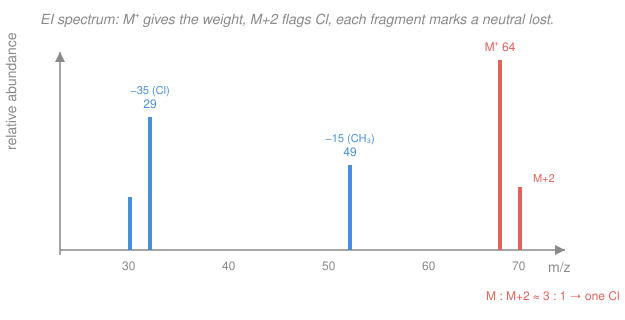

# Analytical & Instrumental Chemistry · Lesson 4.4: Mass spectrometry

> ⏱ ~15 min · Module 4: Chromatography, mass spectrometry & validation · Builds on: [4.2 Gas chromatography](04-02-gas-chromatography.md), [4.3 HPLC](04-03-hplc.md), [organic-chemistry (MS in structure elucidation)](../../organic-chemistry/syllabus.md) · Unlocks: [4.5 Sampling & method validation](04-05-sampling-method-validation.md)

## Why this matters

Chromatography (4.2, 4.3) tells you *how many* things are in a sample and *when* each comes off the column — but a retention time is a fingerprint only if you already have the suspect on file. Mass spectrometry (MS) tells you *what* each thing actually is: it weighs the molecule, breaks it into pieces, and weighs the pieces. Bolt an MS onto the back of a GC or LC and every peak in the chromatogram gets a molecular weight and a structural sketch. That combination — **GC–MS** and **LC–MS** — is the identification workhorse of forensic labs, doping control, environmental screening, metabolomics, and pharma QC. It is how you go from "there's a compound eluting at 7.3 min" to "that's cocaine" or "that's a 27-kDa protein."

## The idea

An MS does three things in sequence, all in a high vacuum so molecules fly without bumping into air:

1. **Ionize** — give the molecule a charge, because you can only push, bend, and count things that carry charge. This step also often *breaks* the molecule into charged fragments.
2. **Analyze by mass** — sort the ions by their **mass-to-charge ratio** $m/z$: heavier ions (per unit charge) are harder to deflect or slower to reach the detector, so the analyzer spreads them out in space or time.
3. **Detect** — count the ions arriving at each $m/z$.

The output is a **mass spectrum**: a stick plot of ion abundance versus $m/z$. Two things live in that plot. The heaviest important peak — the **molecular ion**, the intact molecule minus one electron — hands you the **molecular weight**. The lighter peaks — **fragments** — are the molecule's broken pieces, and *which* pieces broke off is a structural clue: lose a mass of 15 and you almost certainly lost a $\ce{CH3}$ group; lose 18 and you lost water. MS is a scale and a demolition report in one instrument.

The whole game hinges on how *gently* you ionize. Hit the molecule hard and it shatters into a rich, reproducible pile of fragments (great for a library match, useless for reading the molecular weight if the molecular ion is blown to bits). Ionize gently and the molecule survives intact (great for molecular weight, few structural clues). Those two regimes are the two ionization methods you must know.

## The formal version

**Mass-to-charge ratio.** The analyzer sorts on

$$\frac{m}{z},$$

where $m$ is the ion's mass (in unified atomic mass units, u or Da) and $z$ is the number of elementary charges it carries. *In words: the instrument's x-axis is mass per charge, not mass.* For a singly charged ion ($z=1$) the peak position **is** the mass. For a doubly charged ion the peak sits at *half* the mass — which is how MS reaches molecules far heavier than its nominal mass range (see multiply-charged ions below).

**Ionization — hard vs soft.**

- **Electron impact (EI)** — a *hard* method. A beam of ~70 eV electrons knocks one electron off the neutral molecule $\ce{M}$, making a radical cation, and dumps so much excess energy that the ion promptly fragments:
$$\ce{M + e^- -> M^{+\bullet} + 2e^-}.$$
*In words: blast the molecule, get its molecular ion $\ce{M^{+\bullet}}$ plus a reproducible spray of fragments.* Because the 70-eV fragmentation pattern is highly reproducible, EI spectra are **library-searchable** (NIST database). EI needs the sample already in the gas phase, so it pairs with **GC** for small, volatile, thermally stable molecules.
- **Electrospray ionization (ESI)** — a *soft* method. The liquid sample is sprayed through a charged needle; the solvent evaporates and leaves gas-phase ions that are essentially the *intact* molecule with a proton added or removed: $\ce{[M + H]+}$ in positive mode, $\ce{[M - H]-}$ in negative mode. *In words: coax the whole molecule into the gas phase with barely any fragmentation.* ESI works straight from a flowing liquid, so it pairs with **LC** for large, polar, non-volatile, or thermally fragile molecules — peptides, proteins, drugs, metabolites. Because big molecules pick up many protons, ESI produces **multiply-charged** ions.
- **MALDI** (matrix-assisted laser desorption/ionization) — a one-line cousin: co-crystallize the analyte with a UV-absorbing matrix, fire a laser, get mostly singly charged intact ions; the go-to for very large biomolecules and imaging.

**Reading the spectrum.**

*Molecular ion → molecular weight.* The $\ce{M^{+\bullet}}$ peak (EI) or the $\ce{[M+H]+}$ peak (ESI, subtract 1 for the added proton) gives the molecular weight directly.

*Fragments → structure.* A fragment sits at $(\text{molecular ion}) - (\text{mass of the neutral lost})$. Memorize the common neutral losses:

| Mass lost | Likely neutral | Signals |
|---:|:---|:---|
| 15 | $\ce{CH3}$ | a methyl group |
| 18 | $\ce{H2O}$ | an alcohol / hydroxyl |
| 28 | $\ce{CO}$ or $\ce{C2H4}$ | carbonyl / ethyl chain |
| 29 | $\ce{CHO}$ or $\ce{C2H5}$ | aldehyde / ethyl |
| 45 | $\ce{COOH}$ | a carboxylic acid |

*In words: subtract the fragment's $m/z$ from the molecular ion, and the difference names the piece that fell off.*

*Isotope patterns → element counting.* Elements come in natural isotope mixtures, and the heavier isotopes plant satellite peaks above the molecular ion:

- **M+1 from $^{13}\mathrm{C}$.** Carbon is 1.1% $^{13}\mathrm{C}$, so each carbon in the molecule adds ~1.1% to the M+1 peak's height relative to M. Estimate the carbon count:
$$n_{\mathrm{C}} \approx \frac{\text{height of M+1}}{\text{height of M}} \times \frac{100}{1.1}.$$
*In words: the M+1 peak is roughly 1.1% times the number of carbons, so divide it back out to count carbons.*
- **M+2 from chlorine and bromine.** $\ce{Cl}$ is ~76% $^{35}\mathrm{Cl}$ / 24% $^{37}\mathrm{Cl}$, so one Cl gives an **M+2 peak about one-third of M** — the tell-tale **3 : 1** pattern. $\ce{Br}$ is ~51% $^{79}\mathrm{Br}$ / 49% $^{81}\mathrm{Br}$, so one Br gives an M+2 **almost equal** to M — a **1 : 1** pattern. *In words: a big M+2 means a halogen — 3:1 says chlorine, 1:1 says bromine.*

*Multiply-charged ions → big-molecule weights (ESI).* A protein in ESI shows up not as one peak but as a **charge envelope**: the same molecule carrying $\ce{+8, +9, +10, \dots}$ protons appears at a ladder of $m/z$ values, each $= (M + zH)/z$. Solving any two adjacent peaks for $M$ and $z$ recovers the molecular weight — that is how a 27,000-Da protein is weighed on an analyzer whose range tops out near $m/z$ 2000.

**Coupling — GC–MS and LC–MS.** The chromatograph separates the mixture in time; the MS scans a full spectrum every fraction of a second, so each eluting peak gets identified as it comes off. Two ways to plot the run:

- **Total-ion chromatogram (TIC)** — plot the *sum* of all ion abundances vs time: this reproduces the ordinary chromatogram, one hump per compound.
- **Extracted-ion chromatogram (EIC/XIC)** — plot the abundance of *one chosen $m/z$* vs time: this pulls a single target compound cleanly out of a co-eluting mess, because only ions at that mass are shown.

*In words: the TIC shows everything; the EIC is a mass filter that makes your one analyte pop out of the crowd.*

## Picture

The unknown above: molecular ion at $m/z$ 64 with an M+2 at 66 about one-third as tall (one Cl); a fragment at 49 from loss of 15 ($\ce{CH3}$); a fragment at 29 from loss of 35 (Cl). Molecular weight 64, contains one Cl and a methyl — that is **chloroethane, $\ce{CH3CH2Cl}$** (mass $= 12{\cdot}2 + 5 + 35 = 64$). We deduce it below.

## Worked examples

**Example 1 (mechanical — read a molecular ion and a loss).** An EI spectrum shows its highest-mass significant peak at $m/z$ 58 and a very strong peak at $m/z$ 43. What is the molecular weight, and what fell off?

- Molecular ion at 58 → **molecular weight 58**.
- Loss $= 58 - 43 = 15$ → a $\ce{CH3}$ group left, giving a fragment at 43.

A molecular weight of 58 with an easy methyl loss to a stable 43 fragment is the signature of **acetone**, $\ce{CH3COCH3}$ (mass $= 58$): it cleaves a methyl to give the resonance-stabilized acylium ion $\ce{CH3CO+}$ at 43. This is exactly the reasoning your [organic-chemistry](../../organic-chemistry/syllabus.md) course uses for structure elucidation — MS is the analytical half of that skill.

**Example 2 (why you'd care — deduce the chlorinated unknown in the figure).** You have the spectrum above: $\ce{M^{+\bullet}}$ at $m/z$ 64, an M+2 at 66 roughly one-third the height of M, a fragment at 49, a fragment at 29.

1. **Isotope pattern.** M+2 ≈ ⅓ of M is the 3:1 chlorine tell → the molecule contains **one Cl**.
2. **Molecular weight & remaining mass.** MW $= 64$. Subtract one Cl (35): the rest weighs $64 - 35 = 29$, which is $\ce{C2H5}$ ($24 + 5$). So the formula is $\ce{C2H5Cl}$.
3. **Confirm with fragments.** Loss of 15 ($\ce{CH3}$) gives 49 ($\ce{CH2Cl+}$); loss of 35 (Cl) gives 29 ($\ce{C2H5+}$). Both check.

The unknown is **chloroethane, $\ce{CH3CH2Cl}$**. Notice the identification used the scale (MW 64), the demolition report (losses of 15 and 35), and the isotope fingerprint (3:1) together — no single clue was enough.

## Watch out

- **You might think the x-axis is mass.** It's mass-*to-charge*, $m/z$. A singly charged ion sits at its mass, but a doubly charged one sits at *half* its mass — the reason a heavy protein appears at deceptively low $m/z$ in ESI. Always ask what $z$ is before reading a mass off the axis.
- **You might expect a molecular ion in every spectrum.** Soft ionization (ESI) gives $\ce{[M+H]+}$ — one unit *heavier* than the true molecular weight, so subtract the proton. And hard EI can fragment the molecular ion clean out of existence, leaving no peak at the true MW; a *missing* molecular ion is itself a clue that the molecule is fragile.
- **You might read an isotope satellite as a separate compound.** The M+1 and M+2 peaks are the *same* molecule wearing heavier isotopes, not impurities. Their fixed height ratios are the whole point — treat them as part of the molecular-ion cluster, not as new species.

## One-liner

> Mass spectrometry ionizes molecules, sorts the ions by $m/z$, and counts them — the molecular ion weighs the molecule, the fragments and isotope patterns sketch its structure, and bolted onto a GC or LC it names every peak in a mixture.

## Problems

**P1 (🟢)** An EI mass spectrum shows its highest-mass significant peak at $m/z$ 46 and a strong fragment at $m/z$ 31. State the molecular weight and identify the neutral lost to give the 31 fragment. (Hint: the loss is a common one from the table.)

**P2 (🟡)** A compound gives a molecular ion at $m/z$ 108 whose M+2 peak (at 110) is *nearly equal* in height to M, and whose M+1 peak is about 2.2% of M. Which halogen is present, and how many carbons does the molecule contain? Propose a formula.

**P3 (🔴)** An EI spectrum shows $\ce{M^{+\bullet}}$ at $m/z$ 50 with an M+2 at 52 about one-third its height, and a fragment at $m/z$ 15. Deduce the molecule. Then: this sample is a small, volatile gas — would you pair the MS with GC (EI) or LC (ESI), and why? Give the one-sentence rule for choosing between them.

Solutions

**P1** The highest-mass peak at 46 is the molecular ion → **molecular weight 46**. The loss is $46 - 31 = 15$, a $\ce{CH3}$ group; but a cleaner read is that the *fragment* at 31 is $\ce{CH2OH+}$ (mass $14+1+16 = 31$), the diagnostic ion of a primary alcohol. Molecular weight 46 with a strong 31 is **ethanol, $\ce{CH3CH2OH}$** ($24 + 6 + 16 = 46$): it loses a methyl (15) to give $\ce{CH2OH+}$ at 31. (Accept either "lost $\ce{CH3}$, mass 15" or the equivalent identification of the 31 ion.)

**P2** *Halogen:* an M+2 nearly equal to M is the **1 : 1** pattern → **bromine** (one Br). *Carbons:* invert the $^{13}\mathrm{C}$ rule,
$$n_{\mathrm{C}} \approx \frac{2.2}{1.1} = 2 \text{ carbons}.$$
*Formula:* subtract Br (79) from the MW: $108 - 79 = 29 = \ce{C2H5}$, consistent with 2 carbons. The molecule is $\ce{C2H5Br}$ — **bromoethane** (mass $= 24 + 5 + 79 = 108$). ✓

**P3** *Isotope pattern:* M+2 ≈ ⅓ of M is the 3:1 chlorine tell → **one Cl**. *Mass balance:* MW 50, remove Cl (35), leaving $50 - 35 = 15 = \ce{CH3}$. The fragment at 15 is $\ce{CH3+}$ (from loss of Cl, $50 - 35 = 15$). So the molecule is $\ce{CH3Cl}$ — **chloromethane** (mass $= 12 + 3 + 35 = 50$). ✓

*Ionization choice:* chloromethane is small, volatile, and thermally stable, so run it by **GC with EI** — it vaporizes easily and its reproducible EI fragments are library-searchable. ESI/LC is wasted here; you'd reserve that for a large, polar, or fragile molecule that won't survive the GC oven. **The rule:** small, volatile, stable → GC–MS with hard EI; large, polar, non-volatile, or fragile → LC–MS with soft ESI.

## Flashback

**From Lesson 4.3 (HPLC):** In **reversed-phase** HPLC (non-polar C18 stationary phase, polar water/methanol mobile phase), you inject a mixture of caffeine (fairly polar) and a non-polar steroid. (a) Which elutes first, and why? (b) The two happen to co-elute at the same retention time on your column — explain, in one sentence, how coupling the HPLC to an MS still lets you quantify each one separately.

Solution

(a) In reversed-phase, the non-polar stationary phase retains non-polar solutes; the *more polar* compound has less affinity for C18 and is carried off by the polar mobile phase first. So **caffeine (more polar) elutes first**, the non-polar steroid later. *In words: on a reversed-phase column, polar comes out early, non-polar comes out late — the reverse of normal-phase.*

(b) Even when they overlap in time, caffeine and the steroid have **different molecular weights and thus different $m/z$ values**, so the MS separates them by mass where the column couldn't separate them by time — plot an **extracted-ion chromatogram** at each compound's $m/z$ and integrate each independently. This is precisely why LC–MS beats an LC with a UV detector for complex or co-eluting mixtures: the mass analyzer is a second, orthogonal dimension of separation.

## Connections

- **Backward:** the column theory of [4.1](04-01-separation-theory-plates-resolution.md) and the two chromatographs of [4.2 GC](04-02-gas-chromatography.md) and [4.3 HPLC](04-03-hplc.md) supply the *separation*; MS supplies the *identification* that turns a retention time into a name. EI pairs with GC's gas-phase volatiles; ESI pairs with LC's dissolved polar analytes.
- **Forward:** [4.5 Sampling & method validation](04-05-sampling-method-validation.md) asks how good a GC–MS or LC–MS number really is — selectivity, limits of detection, and the extracted-ion trick above is a validation tool for proving your method measures *only* the target analyte.
- **Sideways (organic chemistry):** fragment-loss and isotope-pattern reasoning is the analytical face of [organic structure elucidation](../../organic-chemistry/syllabus.md) — MS answers "what is the molecular weight and what pieces break off," the same questions organic chemists answer to nail a structure.
