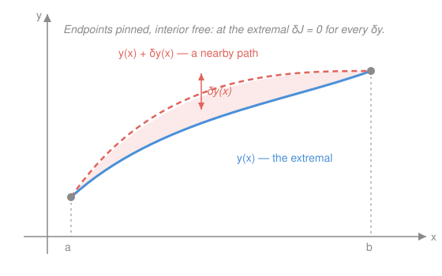

# Analytical Mechanics · Lesson 1.1: The calculus of variations and the Euler–Lagrange equation

> ⏱ ~15 min · Module 1: From Newton to Lagrange · Builds on: [`mechanics-refresher`](#/course/mechanics-refresher), [`calc-refresher`](#/course/calc-refresher) · Unlocks: 1.2 (least action)

## Why this matters

All of analytical mechanics rests on one sentence: *nature picks the path that extremizes a quantity called the action.* Before we can say what that means for a falling rock, we need the mathematics of "extremize a quantity that depends on a whole function" — not a number that minimizes $f(x)$, but a **path** that minimizes an integral over all paths. That machinery is the calculus of variations, and its central output, the Euler–Lagrange equation, is the engine that will turn "least action" into $\mathbf F = m\mathbf a$ next lesson and into every conservation law after. It also answers pre-mechanics classics on its own: what is the shortest path between two points, the shape of a hanging chain, the curve of fastest descent.

## The idea

Ordinary calculus asks: over all *numbers* $x$, which one makes $f(x)$ smallest? You answer it by nudging $x$ a hair and demanding the first-order change vanish: $f'(x)=0$.

Now raise the stakes. A **functional** eats an entire function and returns one number — for instance, "the length of the curve $y(x)$" or "the time to slide down the ramp $y(x)$." The question becomes: over all *functions* $y$ (with fixed endpoints), which one makes the number smallest? The move is identical in spirit: nudge the whole function by a small deformation $\delta y$, and demand that the first-order change in the number vanish. That first-order-change-equals-zero condition, written out, *is* the Euler–Lagrange equation.

So the entire subject is a slogan: **calculus, but the variable is a function.** The derivative $f'(x)=0$ becomes $\delta J=0$; the deformation $\delta y$ plays the role of the nudge $dx$; and because a function has a value at every point, the single equation $f'=0$ becomes a differential equation that must hold at every $x$.

## The formal version

**A functional.** Fix endpoints $a<b$ and boundary values. For a smooth "cost density" $F(x,y,y')$, define

$$J[y] = \int_a^b F\big(x,\,y(x),\,y'(x)\big)\,dx.$$

In words: $J$ assigns one number to each candidate curve $y$, by integrating a local cost that can depend on position $x$, height $y$, and slope $y'=\dfrac{dy}{dx}$.

**The variation.** Compare $y$ to a nearby curve $y(x)+\varepsilon\,\eta(x)$, where $\varepsilon$ is a small number and $\eta$ is any smooth "shape" that **vanishes at the endpoints**, $\eta(a)=\eta(b)=0$ (the endpoints are pinned, so competitors share them). The **variation** is $\delta y=\varepsilon\,\eta$.

In words: $\delta y$ is a small, endpoint-preserving wiggle of the whole curve — the functional-space analogue of the scalar nudge $dx$.

**The extremal condition.** $y$ is an **extremal** of $J$ if the first-order change vanishes for *every* admissible $\eta$:

$$\delta J \;=\; \left.\frac{d}{d\varepsilon}\,J[\,y+\varepsilon\eta\,]\right|_{\varepsilon=0} \;=\; 0 \qquad\text{for all }\eta.$$

In words: to first order, no nearby path does better — exactly $f'(x)=0$, lifted to the space of functions.

**Deriving Euler–Lagrange.** Write $g(\varepsilon)=J[y+\varepsilon\eta]$ and differentiate under the integral (the integrand is smooth in $\varepsilon$). Using $\dfrac{\partial}{\partial\varepsilon}(y+\varepsilon\eta)=\eta$ and $\dfrac{\partial}{\partial\varepsilon}(y'+\varepsilon\eta')=\eta'$, the chain rule gives

$$\delta J = \int_a^b\!\left(\frac{\partial F}{\partial y}\,\eta + \frac{\partial F}{\partial y'}\,\eta'\right)dx.$$

The second term still carries $\eta'$; convert it to $\eta$ by **integrating by parts**, moving the derivative off $\eta$:

$$\int_a^b \frac{\partial F}{\partial y'}\,\eta'\,dx = \underbrace{\left[\frac{\partial F}{\partial y'}\,\eta\right]_a^b}_{=\,0} - \int_a^b \frac{d}{dx}\!\left(\frac{\partial F}{\partial y'}\right)\eta\,dx.$$

The boundary term **dies** because $\eta(a)=\eta(b)=0$ — this is exactly what pinning the endpoints buys us. Collecting,

$$\delta J = \int_a^b\!\left(\frac{\partial F}{\partial y} - \frac{d}{dx}\frac{\partial F}{\partial y'}\right)\eta\,dx = 0 \quad\text{for all }\eta.$$

**The fundamental lemma of the calculus of variations.** If a continuous function $M(x)$ satisfies $\int_a^b M(x)\,\eta(x)\,dx=0$ for *every* smooth $\eta$ vanishing at the ends, then $M(x)\equiv 0$ on $[a,b]$.

In words: the only quantity that is orthogonal to *every* wiggle is zero. (Proof sketch: if $M(x_0)>0$ somewhere, pick a little bump $\eta\ge 0$ concentrated near $x_0$; then $\int M\eta>0$, contradiction.)

Apply it to the bracket and you get the payoff:

$$\boxed{\;\frac{\partial F}{\partial y} - \frac{d}{dx}\frac{\partial F}{\partial y'} = 0\;}$$

**The Euler–Lagrange equation.** In words: the extremal is not found by trial and error over infinitely many curves — it is pinned down by a single differential equation holding at every point.

**The Beltrami identity (a free first integral).** When $F$ has **no explicit $x$**, i.e. $\dfrac{\partial F}{\partial x}=0$, the E–L equation integrates once automatically:

$$F - y'\,\frac{\partial F}{\partial y'} = \text{const}.$$

In words: no explicit $x$-dependence hands you a conserved quantity along the extremal, dropping a second-order ODE to first order. (This is the variational ancestor of energy conservation — "no explicit time" ⟹ "energy conserved" — which returns in force in [2.3](#/lesson/analytical-mechanics/02-03-energy-and-hamiltonian.md).)

*Why it holds.* Compute $\dfrac{d}{dx}\!\left(F - y'\dfrac{\partial F}{\partial y'}\right)$. By the chain rule $\dfrac{dF}{dx}=\dfrac{\partial F}{\partial x}+\dfrac{\partial F}{\partial y}y'+\dfrac{\partial F}{\partial y'}y''$, and by the product rule $\dfrac{d}{dx}\!\left(y'\dfrac{\partial F}{\partial y'}\right)=y''\dfrac{\partial F}{\partial y'}+y'\dfrac{d}{dx}\dfrac{\partial F}{\partial y'}$. Subtracting, the $y''$ terms cancel:

$$\frac{d}{dx}\!\left(F - y'\frac{\partial F}{\partial y'}\right) = \frac{\partial F}{\partial x} + y'\underbrace{\left(\frac{\partial F}{\partial y} - \frac{d}{dx}\frac{\partial F}{\partial y'}\right)}_{=\,0\ \text{by E–L}} = \frac{\partial F}{\partial x}.$$

If $\partial F/\partial x=0$, the left side is zero, so the bracketed quantity is constant. ∎

## Picture

## Worked examples

**Example 1 (mechanical — the shortest path).** The arc length of $y(x)$ from $a$ to $b$ is $J[y]=\int_a^b\sqrt{1+y'^2}\,dx$, so $F=\sqrt{1+y'^2}$. Then $\dfrac{\partial F}{\partial y}=0$ (no $y$) and $\dfrac{\partial F}{\partial y'}=\dfrac{y'}{\sqrt{1+y'^2}}$. Euler–Lagrange says

$$0 - \frac{d}{dx}\frac{y'}{\sqrt{1+y'^2}} = 0 \;\Longrightarrow\; \frac{y'}{\sqrt{1+y'^2}} = \text{const}.$$

A constant-valued $\dfrac{y'}{\sqrt{1+y'^2}}$ forces $y'$ itself constant, i.e. $y''=0$, i.e. $y=mx+c$: **a straight line.** The shortest path between two points is the segment — recovered, not assumed.

**Example 2 (why you'd care — the hanging chain).** A uniform chain hung between two posts settles to minimize its gravitational potential energy, which is proportional to $\int y\,ds=\int y\sqrt{1+y'^2}\,dx$. Here $F=y\sqrt{1+y'^2}$ has **no explicit $x$**, so reach for Beltrami:

$$F - y'\frac{\partial F}{\partial y'} = y\sqrt{1+y'^2} - y'\cdot\frac{y\,y'}{\sqrt{1+y'^2}} = \frac{y}{\sqrt{1+y'^2}} = C.$$

Solve for the slope: $\sqrt{1+y'^2}=y/C$, so $y'=\sqrt{y^2/C^2-1}$. Separating and integrating gives $y=C\cosh\!\big((x-x_0)/C\big)$ — the **catenary**. Not a parabola: the shape of a hanging chain is a hyperbolic cosine, delivered in three lines by one first integral. (You'll verify this is a genuine solution in P2.)

## Watch out

- You might think $\dfrac{d}{dx}\dfrac{\partial F}{\partial y'}$ and $\dfrac{\partial}{\partial y'}$ are interchangeable derivatives. They are not: $\dfrac{\partial F}{\partial y'}$ treats $x,y,y'$ as independent slots (a partial derivative), then $\dfrac{d}{dx}$ is a **total** derivative that also differentiates $y(x)$ and $y'(x)$ through their $x$-dependence. Swapping them is the most common E–L error.
- You might think you must *minimize* $J$. E–L only enforces $\delta J=0$ — a stationary point. It can be a minimum, a maximum, or a saddle; "least action" is a slight misnomer for "stationary action." Deciding which requires the second variation, which we won't need.
- You might think Beltrami is a separate theorem to memorize. It's just E–L plus "no explicit $x$" — the exact analogue of "no explicit $t$ ⟹ energy conserved." Use it only when $\partial F/\partial x=0$; otherwise the right side $\partial F/\partial x$ spoils the constant.

## One-liner

> The calculus of variations is ordinary calculus with a function as the variable: set the first variation $\delta J=0$, integrate the wiggle by parts until the boundary term dies, and the fundamental lemma leaves you the Euler–Lagrange equation.

## Problems

**P1 (🟢)** Confirm the straight line directly. For $F=\sqrt{1+y'^2}$, carry out $\dfrac{d}{dx}\dfrac{\partial F}{\partial y'}=0$ explicitly (differentiate the quotient) and show it reduces to $y''=0$. State the extremal through $(0,0)$ and $(1,2)$.

**P2 (🟡)** Verify the catenary is a true extremal of $J[y]=\int y\sqrt{1+y'^2}\,dx$ by substituting $y=C\cosh(x/C)$ (take $x_0=0$) *directly into the full Euler–Lagrange equation* $\dfrac{\partial F}{\partial y}-\dfrac{d}{dx}\dfrac{\partial F}{\partial y'}=0$ — not into Beltrami — and checking both sides balance. (Useful: $\cosh^2-\sinh^2=1$, $\frac{d}{dx}\cosh(x/C)=\frac1C\sinh(x/C)$.)

**P3 (🔴)** *The brachistochrone.* A bead slides without friction from $(0,0)$ down to a lower point, starting from rest; measuring $y$ **downward** as positive, energy conservation gives speed $v=\sqrt{2gy}$, so the descent time is
$$T[y]=\int_0^{x_1}\frac{ds}{v}=\int_0^{x_1}\sqrt{\frac{1+y'^2}{2gy}}\,dx.$$
(a) Explain why Beltrami applies, and use it to derive the first integral $y\,(1+y'^2)=k$ for a constant $k$. (b) Show the parametrization $x=\tfrac{k}{2}(\theta-\sin\theta)$, $y=\tfrac{k}{2}(1-\cos\theta)$ — a **cycloid** — satisfies it.

Solutions

**P1** With $F=(1+y'^2)^{1/2}$: $\dfrac{\partial F}{\partial y'}=\dfrac{y'}{\sqrt{1+y'^2}}$. Differentiate by the quotient rule, writing $s=\sqrt{1+y'^2}$ so $s'=\dfrac{y'y''}{s}$:

$$\frac{d}{dx}\frac{y'}{s}=\frac{y''\,s - y'\,s'}{s^2}=\frac{y''\,s - y'\cdot\frac{y'y''}{s}}{s^2}=\frac{y''\big(s^2-y'^2\big)}{s^3}=\frac{y''\big(1+y'^2-y'^2\big)}{(1+y'^2)^{3/2}}=\frac{y''}{(1+y'^2)^{3/2}}.$$

Since $\partial F/\partial y=0$, E–L reads $-\dfrac{y''}{(1+y'^2)^{3/2}}=0$, and the denominator never vanishes, so $y''=0$. Hence $y=mx+c$. Through $(0,0)$: $c=0$; through $(1,2)$: $m=2$. Extremal: $y=2x$.

*Check:* $y=2x\Rightarrow y'=2,\ y''=0$, and $\dfrac{y'}{\sqrt{1+y'^2}}=\dfrac{2}{\sqrt5}$ is constant, as E–L demands. ✓

**P2** Here $F=y\sqrt{1+y'^2}$. The two pieces:

$$\frac{\partial F}{\partial y}=\sqrt{1+y'^2},\qquad \frac{\partial F}{\partial y'}=\frac{y\,y'}{\sqrt{1+y'^2}}.$$

Substitute $y=C\cosh u$ with $u=x/C$, so $y'=\sinh u$ and $y''=\tfrac1C\cosh u$. Note $1+y'^2=1+\sinh^2u=\cosh^2u$, hence $\sqrt{1+y'^2}=\cosh u$.

First term: $\dfrac{\partial F}{\partial y}=\cosh u$.

Second term: $\dfrac{\partial F}{\partial y'}=\dfrac{(C\cosh u)(\sinh u)}{\cosh u}=C\sinh u$. Then

$$\frac{d}{dx}\big(C\sinh u\big)=C\cosh u\cdot\frac{du}{dx}=C\cosh u\cdot\frac1C=\cosh u.$$

So E–L gives $\cosh u-\cosh u=0$. ✓ The catenary satisfies the full Euler–Lagrange equation exactly.

**P3** (a) The integrand $F=\sqrt{\dfrac{1+y'^2}{2gy}}$ contains $y$ and $y'$ but **no explicit $x$**, so $\partial F/\partial x=0$ and Beltrami applies: $F-y'\dfrac{\partial F}{\partial y'}=\text{const}$. Compute $\dfrac{\partial F}{\partial y'}$. Writing $F=(2g)^{-1/2}\,y^{-1/2}(1+y'^2)^{1/2}$,

$$\frac{\partial F}{\partial y'}=(2g)^{-1/2}y^{-1/2}\cdot\frac{y'}{(1+y'^2)^{1/2}}.$$

Then

$$F-y'\frac{\partial F}{\partial y'}=(2g)^{-1/2}y^{-1/2}\left[(1+y'^2)^{1/2}-\frac{y'^2}{(1+y'^2)^{1/2}}\right]=(2g)^{-1/2}y^{-1/2}\cdot\frac{1}{(1+y'^2)^{1/2}}.$$

Setting this equal to a constant and squaring absorbs the $2g$ into a new constant: $\dfrac{1}{y(1+y'^2)}=\text{const}$, i.e.

$$y\,(1+y'^2)=k.$$

(b) From the parametrization, $\dfrac{dx}{d\theta}=\dfrac{k}{2}(1-\cos\theta)$ and $\dfrac{dy}{d\theta}=\dfrac{k}{2}\sin\theta$, so

$$y'=\frac{dy}{dx}=\frac{dy/d\theta}{dx/d\theta}=\frac{\sin\theta}{1-\cos\theta}.$$

Then

$$1+y'^2=1+\frac{\sin^2\theta}{(1-\cos\theta)^2}=\frac{(1-\cos\theta)^2+\sin^2\theta}{(1-\cos\theta)^2}=\frac{1-2\cos\theta+\cos^2\theta+\sin^2\theta}{(1-\cos\theta)^2}=\frac{2(1-\cos\theta)}{(1-\cos\theta)^2}=\frac{2}{1-\cos\theta},$$

using $\cos^2+\sin^2=1$. Multiply by $y=\dfrac{k}{2}(1-\cos\theta)$:

$$y\,(1+y'^2)=\frac{k}{2}(1-\cos\theta)\cdot\frac{2}{1-\cos\theta}=k.$$

✓ The cycloid satisfies the first integral for every $\theta$ — the curve of fastest descent is an upside-down cycloid, the arc traced by a point on a rolling wheel.

## Connections

- **Backward:** the derivation is nothing but the chain rule, integration by parts, and the FTC from [`calc-refresher`](#/course/calc-refresher) — the boundary term dying at pinned endpoints is the same "endpoint contribution vanishes" bookkeeping you saw in improper integrals, now enforced by $\eta(a)=\eta(b)=0$.
- **Forward:** in [1.2](#/lesson/analytical-mechanics/01-02-least-action-lagrange.md) we set $F=L(q,\dot q,t)=T-V$ and $x=t$; the Euler–Lagrange equation becomes Lagrange's equation of motion, and Newton's second law falls out. The Beltrami identity, with $x\to t$, becomes energy conservation in [2.3](#/lesson/analytical-mechanics/02-03-energy-and-hamiltonian.md).
- **Sideways:** the same $\delta J=0$ logic reappears wherever a system "chooses" a configuration — Fermat's least-time optics (which the brachistochrone secretly mimics), minimal surfaces (soap films), geodesics in general relativity, and constrained optimization via Lagrange multipliers, the mechanics analogue arriving in [1.3](#/lesson/analytical-mechanics/01-03-generalized-coordinates-constraints.md).
