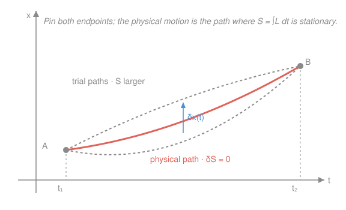

# Analytical Mechanics · Lesson 1.2: The principle of least action and Lagrange's equations

> ⏱ ~15 min · Module 1: From Newton to Lagrange · Builds on: [1.1 The calculus of variations and the Euler–Lagrange equation](#/lesson/analytical-mechanics/01-01-calculus-of-variations.md) · Unlocks: 1.3 (generalized coordinates and constraints)

## Why this matters

Newton hands you a vector equation $\mathbf F = m\mathbf a$ and leaves you to resolve every force into components — miserable the moment your coordinates aren't Cartesian, or a bead is stuck on a wire. This lesson replaces all of that with **one scalar function** $L$ and a single recipe that spits out the equations of motion in *whatever* coordinates you chose. That scalar-and-recipe machine is the whole of Lagrangian mechanics, and it survives — nearly unchanged in form — into quantum mechanics, field theory, and general relativity. Everything downstream in this course is built on the object we define here.

## The idea

In [1.1](#/lesson/analytical-mechanics/01-01-calculus-of-variations.md) you learned to find the path that makes a *functional* $S[q] = \int f(q,\dot q, t)\,dt$ stationary, and the answer was the Euler–Lagrange equation. That was pure math — any $f$ would do. Physics now supplies the specific $f$.

Here is the leap. Nature does not push a particle instant-by-instant along its path (the Newtonian picture). Instead, consider *every* imaginable path the particle could take between a fixed start and a fixed finish. Assign each path a single number — its **action**. The path the particle actually follows is the one whose action is **stationary**: nudge it slightly and the action doesn't change to first order. That's it. One number per path, and the real motion is the flat spot in that landscape.

The magic is what goes into the number. The action accumulates $L = T - V$ — kinetic energy *minus* potential energy — over the trip. Not the total energy $T+V$; the *difference*. A particle "wants" to trade potential for kinetic in the most economical way, and "least action" is the precise statement of that economy. Feed this specific $L$ into 1.1's machine and out falls Newton's second law — but now in a form that never once mentioned a force vector.

## The formal version

**The action.** For a system described by a coordinate $q(t)$ with velocity $\dot q = \tfrac{dq}{dt}$, moving from $t_1$ to $t_2$, the action is the functional

$$S[q] = \int_{t_1}^{t_2} L\big(q, \dot q, t\big)\,dt,$$

where $L$ is the **Lagrangian**. For a particle of mass $m$ in a potential $V$,

$$L = T - V = \tfrac{1}{2}m\dot q^2 - V(q).$$

In words: $T$ is kinetic energy, $V$ is potential energy, and $L$ is their difference; $S$ is that difference summed over the whole trip.

**Hamilton's principle (least action).** Among all paths $q(t)$ with fixed endpoints $q(t_1)$ and $q(t_2)$, the physical trajectory is the one for which the action is *stationary*:

$$\delta S = 0.$$

In words: the true motion is the path you can nudge (holding the ends pinned) without changing $S$ to first order. ("Least" is traditional; "stationary" is honest — it's an extremum or saddle.)

**Lagrange's equations.** Stationarity of $S$ is *exactly* 1.1's Euler–Lagrange condition applied to $L$. For each coordinate $q_i$,

$$\boxed{\;\frac{d}{dt}\frac{\partial L}{\partial \dot q_i} - \frac{\partial L}{\partial q_i} = 0.\;}$$

In words: differentiate $L$ by the velocity, take a time derivative of that, and subtract $L$ differentiated by the position — the result is zero along the real motion. This is one second-order ODE per coordinate (compare [ode-refresher 2.1](#/lesson/ode-refresher/02-01-second-order-constant-coefficient.md)).

**Equivalence to Newton.** Take the one-dimensional case $L = \tfrac12 m\dot x^2 - V(x)$. Then

$$\frac{\partial L}{\partial \dot x} = m\dot x, \qquad \frac{d}{dt}\frac{\partial L}{\partial \dot x} = m\ddot x, \qquad \frac{\partial L}{\partial x} = -V'(x),$$

so Lagrange's equation reads $m\ddot x - \big(-V'(x)\big) = 0$, i.e.

$$m\ddot x = -V'(x).$$

That is Newton's second law with the force $F = -V'(x)$ read off as minus the gradient of the potential (see [mechanics-refresher 1.2](#/lesson/mechanics-refresher/01-02-newtons-laws.md)). The two frameworks agree — but Lagrange's form was derived without ever choosing an axis or resolving a force.

## Picture

The physical trajectory (red) shares its endpoints with a whole family of trial paths (grey). Vary it by $\delta x(t)$, and Hamilton's principle says $\delta S = 0$ — which, worked out, is precisely Lagrange's equation for that motion.

## Worked examples

**Example 1 (mechanical — the harmonic oscillator).** A mass on a spring has $V(x) = \tfrac12 kx^2$, so $L = \tfrac12 m\dot x^2 - \tfrac12 kx^2$. Then $\partial L/\partial \dot x = m\dot x$ and $\partial L/\partial x = -kx$, and Lagrange's equation gives

$$m\ddot x + kx = 0 \quad\Longrightarrow\quad \ddot x = -\tfrac{k}{m}x,$$

the simple-harmonic equation with angular frequency $\omega = \sqrt{k/m}$. Same answer Newton gives, obtained by pure differentiation of one scalar — no free-body diagram.

**Example 2 (why you'd care — polar coordinates for free).** A particle in a plane under a central potential $V(r)$ has, in polar coordinates, kinetic energy $T = \tfrac12 m(\dot r^2 + r^2\dot\theta^2)$, so

$$L = \tfrac12 m\big(\dot r^2 + r^2\dot\theta^2\big) - V(r).$$

The $\theta$ equation: $\partial L/\partial\dot\theta = m r^2\dot\theta$ and $\partial L/\partial\theta = 0$, so $\tfrac{d}{dt}(m r^2\dot\theta) = 0$ — **angular momentum is conserved**, and it fell out because $\theta$ never appeared in $L$. The $r$ equation:

$$m\ddot r = m r\dot\theta^2 - V'(r).$$

The $m r\dot\theta^2$ term is the **centrifugal** contribution — it emerged automatically from $\partial T/\partial r$, not from any "fictitious force" you had to remember to insert. Doing this in Newtonian polar coordinates means differentiating unit vectors $\hat r, \hat\theta$ by hand; here the coordinates just work. That painlessness is the entire advantage, and [1.3](#/lesson/analytical-mechanics/01-03-generalized-coordinates-constraints.md) makes it systematic.

## Watch out

- You might think the Lagrangian is the total energy. It's $T - V$, **not** $T + V$. The total energy is a *different* object (built in [2.3](#/lesson/analytical-mechanics/02-03-energy-and-hamiltonian.md)); the minus sign is not a typo and getting it wrong flips the sign of every force.
- You might think "least action" means $S$ is always a minimum. It's **stationary** — often a minimum for short times, but a saddle for longer ones. The physics is $\delta S = 0$; the word "least" is a historical label, not a guarantee.
- You might think you can vary the endpoints too. Hamilton's principle **pins** $q(t_1)$ and $q(t_2)$ — that's what kills the boundary term from 1.1 and leaves only the Euler–Lagrange bulk equation. Free endpoints give extra conditions, not the equations of motion.

## One-liner

> Write down $L = T - V$, demand that $\int L\,dt$ be stationary, and $\frac{d}{dt}\frac{\partial L}{\partial \dot q} = \frac{\partial L}{\partial q}$ is the equation of motion — in any coordinates, from one scalar.

## Problems

**P1 (🟢)** A particle moves in one dimension with $L = \tfrac12 m\dot x^2 - V(x)$. Apply Lagrange's equation to recover the general equation of motion, then specialize to $V(x) = \tfrac12 kx^2$ and state the oscillation frequency. Confirm the result matches Newton's $F = -V'(x)$.

**P2 (🟡)** For the planar central-force Lagrangian $L = \tfrac12 m(\dot r^2 + r^2\dot\theta^2) - V(r)$, derive **both** equations of motion. Identify the centrifugal term in the radial equation, and check the radial equation against Newton's radial acceleration $a_r = \ddot r - r\dot\theta^2$.

**P3 (🔴, optional)** Show that adding a total time derivative of any function $F(q,t)$ to the Lagrangian — replacing $L$ by $L' = L + \tfrac{dF}{dt}$ — leaves Lagrange's equations unchanged. (This is the *gauge freedom* of the Lagrangian: two different $L$'s can describe identical physics.)

Solutions

**P1** With $L = \tfrac12 m\dot x^2 - V(x)$:

$$\frac{\partial L}{\partial \dot x} = m\dot x, \quad \frac{d}{dt}\frac{\partial L}{\partial \dot x} = m\ddot x, \quad \frac{\partial L}{\partial x} = -V'(x).$$

Lagrange's equation $\tfrac{d}{dt}\tfrac{\partial L}{\partial\dot x} - \tfrac{\partial L}{\partial x} = 0$ gives $m\ddot x + V'(x) = 0$, i.e. $m\ddot x = -V'(x)$. For $V = \tfrac12 kx^2$, $V'(x) = kx$, so $m\ddot x = -kx$ and $\omega = \sqrt{k/m}$.

Newton check: the force is $F = -V'(x) = -kx$, and $m\ddot x = F$ is the same equation. ✓

**P2** *Radial ($r$).* $\dfrac{\partial L}{\partial \dot r} = m\dot r$, so $\dfrac{d}{dt}\dfrac{\partial L}{\partial \dot r} = m\ddot r$; and $\dfrac{\partial L}{\partial r} = m r\dot\theta^2 - V'(r)$. Hence

$$m\ddot r - \big(m r\dot\theta^2 - V'(r)\big) = 0 \;\Longrightarrow\; m\ddot r = m r\dot\theta^2 - V'(r).$$

The $m r\dot\theta^2$ term is the **centrifugal** term (outward, growing with rotation rate).

*Angular ($\theta$).* $\dfrac{\partial L}{\partial \dot\theta} = m r^2\dot\theta$ and $\dfrac{\partial L}{\partial\theta} = 0$, so

$$\frac{d}{dt}\big(m r^2\dot\theta\big) = 0,$$

angular momentum $\ell = m r^2\dot\theta$ is conserved.

Newton check: radial Newton's law is $m a_r = F_r = -V'(r)$ with $a_r = \ddot r - r\dot\theta^2$. Then $m(\ddot r - r\dot\theta^2) = -V'(r)$, i.e. $m\ddot r = m r\dot\theta^2 - V'(r)$ — identical to the Lagrangian result. ✓

**P3** Let $g \equiv \dfrac{dF}{dt} = \dfrac{\partial F}{\partial q}\dot q + \dfrac{\partial F}{\partial t}$ (chain rule; $F$ depends on $q$ and $t$ only). Apply the Euler–Lagrange operator to this added piece.

Since $g$ is linear in $\dot q$ with coefficient $\partial F/\partial q$,

$$\frac{\partial g}{\partial \dot q} = \frac{\partial F}{\partial q}, \qquad \frac{d}{dt}\frac{\partial g}{\partial \dot q} = \frac{d}{dt}\frac{\partial F}{\partial q} = \frac{\partial^2 F}{\partial q^2}\dot q + \frac{\partial^2 F}{\partial q\,\partial t}.$$

Differentiating $g$ by $q$,

$$\frac{\partial g}{\partial q} = \frac{\partial^2 F}{\partial q^2}\dot q + \frac{\partial^2 F}{\partial t\,\partial q}.$$

Subtracting, and using equality of mixed partials ($\partial^2 F/\partial q\,\partial t = \partial^2 F/\partial t\,\partial q$),

$$\frac{d}{dt}\frac{\partial g}{\partial \dot q} - \frac{\partial g}{\partial q} = 0.$$

So the extra term contributes nothing to Lagrange's equations; $L$ and $L' = L + \tfrac{dF}{dt}$ yield identical equations of motion. ✓

(Slicker view: $S' = \int_{t_1}^{t_2} L'\,dt = S + F(q(t_2),t_2) - F(q(t_1),t_1)$. The added piece depends only on the pinned endpoints, so $\delta$ of it vanishes and $\delta S' = \delta S$ — same stationary paths.) ✓

## Connections

- **Backward:** this is [1.1](#/lesson/analytical-mechanics/01-01-calculus-of-variations.md)'s Euler–Lagrange equation with the physical choice $f = L = T-V$; every step of the variation was done there, so here we only *supply the integrand*.
- **Forward:** [1.3](#/lesson/analytical-mechanics/01-03-generalized-coordinates-constraints.md) exploits the coordinate-freedom seen in Example 2 — pick coordinates that dissolve the constraints, and Lagrange's equations still hold verbatim. The cyclic-coordinate shortcut glimpsed in Example 2 ($\theta$ absent ⇒ momentum conserved) becomes the subject of [2.1](#/lesson/analytical-mechanics/02-01-cyclic-coordinates-momenta.md).
- **Sideways (Newton):** for $L = \tfrac12 m\dot x^2 - V$, Lagrange's equation *is* $m\ddot x = -V'(x)$ — the same second-order ODE studied in [ode-refresher 2.1](#/lesson/ode-refresher/02-01-second-order-constant-coefficient.md), and the same $F=m a$ of [mechanics-refresher 1.2](#/lesson/mechanics-refresher/01-02-newtons-laws.md), reached from a variational principle instead of a force balance.
