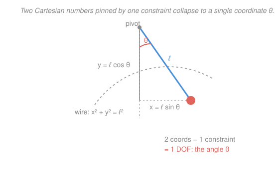

# Analytical Mechanics · Lesson 1.3: Generalized coordinates and constraints

> ⏱ ~15 min · Module 1: From Newton to Lagrange · Builds on: [1.2 The principle of least action and Lagrange's equations](#/lesson/analytical-mechanics/01-02-least-action-lagrange.md), [`calc-refresher` 4.2](#/lesson/calc-refresher/04-02-multivariable-optimization-lagrange.md) · Unlocks: 1.4 (applications)

## Why this matters

Lesson 1.2 handed you a machine — $L = T - V$, crank Lagrange's equations — but stayed with free coordinates. Real systems are *tied down*: a pendulum bob can't leave its circle, a bead can't leave its wire, a rolling disk can't slip. In Newton's world every such tie means an unknown force (tension, normal force) you must carry through the whole problem and eliminate at the end. The Lagrangian method's signature move is to make those forces **vanish before you start** by choosing coordinates that already obey the constraint. This lesson is where the formalism earns its reputation for labor-saving — and where, when you actually *want* the constraint force, one multiplier $\lambda$ hands it back to you.

## The idea

A pendulum bob lives in the plane, so naively it has two numbers $(x,y)$. But the rod pins it to a circle of radius $\ell$: $x^2 + y^2 = \ell^2$. That single equation kills one number — the bob really has just **one** independent degree of freedom, best named by the angle $\theta$. Write everything in terms of $\theta$ and the constraint is satisfied *automatically*, for free, at every instant. There is no leftover "is it still on the circle?" equation to enforce, and — this is the payoff — no tension force to track, because you never let the bob move off the circle in the first place.

That's the whole trick. Constraints don't have to be a burden you fight; they're a gift that *reduces* the problem. Instead of "two coordinates plus one constraint plus one unknown force," you get "one coordinate, period." The art is choosing coordinates that dissolve the constraint. When you can, the constraint force disappears from the equations of motion entirely. When you *want* that force — the tension in a cable, the normal force on a ramp — you deliberately keep the constraint and pay for the information with a Lagrange multiplier, the very same shadow price $\lambda$ from [`calc-refresher` 4.2](#/lesson/calc-refresher/04-02-multivariable-optimization-lagrange.md).

## The formal version

**Generalized coordinates.** A set $q_1, \dots, q_n$ of *any* independent parameters that fix the configuration of the system. In words: any numbers that pin down where everything is — angles, arc lengths, distances, whatever fits the geometry, not necessarily Cartesian. The count $n$ is the number of **degrees of freedom** (DOF).

**Holonomic constraint.** A constraint expressible as an equation among the coordinates and time,
$$g(q_1,\dots,q_N,t) = 0.$$
In words: a relation like "stay on this surface" or "keep this length fixed" that ties coordinates together algebraically (no velocities). Each independent holonomic constraint removes one DOF: start with $N$ raw coordinates and $k$ constraints, and $n = N - k$. (Constraints that *can't* be integrated to such an equation — e.g. a rolling-without-slipping condition on velocities — are **nonholonomic** and don't reduce the coordinate count; we set those aside here.)

**The labor-saving choice.** Pick $n$ generalized coordinates that *solve* the constraints identically, i.e. every allowed configuration corresponds to some $(q_1,\dots,q_n)$ and $g \equiv 0$ automatically. Then write $L(q_i, \dot q_i, t) = T - V$ in those coordinates and apply Lagrange's equations from 1.2, one per coordinate:
$$\frac{d}{dt}\frac{\partial L}{\partial \dot q_i} - \frac{\partial L}{\partial q_i} = 0, \qquad i = 1,\dots,n.$$
In words: because the coordinates can't violate the constraint, the force that *enforces* the constraint does no work along any allowed motion and never appears. You solve $n$ equations, not $N$, and no unknown reaction forces ride along.

**Why it's allowed — D'Alembert's principle.** The reason $T - V$ works under constraints is that **constraint forces do no virtual work**:
$$\sum_a \mathbf{F}^{\text{(constraint)}}_a \cdot \delta \mathbf{r}_a = 0$$
for any *virtual displacement* $\delta \mathbf{r}_a$ consistent with the constraints. In words: an ideal constraint force is perpendicular to the motions it allows (tension $\perp$ the circle, normal force $\perp$ the surface), so it contributes nothing to the variational bookkeeping that produced Lagrange's equations. This is the load-bearing assumption underneath the entire method.

**When you want the constraint force — Lagrange multipliers.** Keep the redundant coordinate and adjoin the constraint with a multiplier. For a constraint $g(q) = 0$, the equations become
$$\frac{d}{dt}\frac{\partial L}{\partial \dot q_i} - \frac{\partial L}{\partial q_i} = \lambda\,\frac{\partial g}{\partial q_i}, \qquad g(q) = 0.$$
In words: the right-hand side $Q_i = \lambda\,\partial g/\partial q_i$ *is* the generalized constraint force, and $\lambda$ measures its strength. This is [4.2](#/lesson/calc-refresher/04-02-multivariable-optimization-lagrange.md)'s $\nabla f = \lambda \nabla g$ wearing a physics uniform: $\lambda$ is again the shadow price of the constraint — here, literally the force needed to hold the system on the surface $g = 0$.

## Picture

## Worked examples

**Example 1 (mechanical — the constraint force never shows up).** The plane pendulum: mass $m$, rigid rod of length $\ell$, gravity $g$ down. Newton would have you resolve tension $T$ along and perpendicular to the rod. Instead, take the single generalized coordinate $\theta$ (angle from vertical). Position $(x,y) = (\ell\sin\theta,\, -\ell\cos\theta)$ automatically satisfies $x^2+y^2=\ell^2$. Velocity magnitude is $\ell\dot\theta$, so
$$T = \tfrac12 m \ell^2 \dot\theta^2, \qquad V = -mg\ell\cos\theta, \qquad L = \tfrac12 m\ell^2\dot\theta^2 + mg\ell\cos\theta.$$
Lagrange's equation in $\theta$:
$$\frac{\partial L}{\partial \dot\theta} = m\ell^2\dot\theta, \quad \frac{d}{dt}(m\ell^2\dot\theta) = m\ell^2\ddot\theta, \quad \frac{\partial L}{\partial\theta} = -mg\ell\sin\theta,$$
$$m\ell^2\ddot\theta + mg\ell\sin\theta = 0 \;\Longrightarrow\; \boxed{\ddot\theta = -\frac{g}{\ell}\sin\theta}.$$
The tension is gone — it did no work along the circle, so the method dropped it silently. One coordinate, one line of algebra, the exact equation of motion.

**Example 2 (why you'd care — extracting the force with $\lambda$).** Now suppose you *need* the rod tension (to size a cable, say). Keep the radial coordinate $r$ as well, so raw coordinates are polar $(r,\theta)$ with the constraint $g(r) = r - \ell = 0$. With $T = \tfrac12 m(\dot r^2 + r^2\dot\theta^2)$ and $V = -mgr\cos\theta$,
$$L = \tfrac12 m(\dot r^2 + r^2\dot\theta^2) + mgr\cos\theta.$$
The $r$-equation carries the multiplier, since $\partial g/\partial r = 1$:
$$\frac{d}{dt}(m\dot r) - m r\dot\theta^2 - mg\cos\theta = \lambda \cdot 1.$$
On the constraint $r=\ell$, $\dot r = 0$, so the left side is $-m\ell\dot\theta^2 - mg\cos\theta = \lambda$, giving
$$\lambda = -m\ell\dot\theta^2 - mg\cos\theta.$$
The generalized constraint force in the $r$-direction is $Q_r = \lambda\,\partial g/\partial r = \lambda$, i.e. the (inward) radial force. Its magnitude is the tension: $T = -\lambda = m\ell\dot\theta^2 + mg\cos\theta$ — exactly the Newtonian result (centripetal $m\ell\dot\theta^2$ plus the weight's radial component $mg\cos\theta$). The multiplier *is* the tension.

## Watch out

- You might think more coordinates means more physics captured. It's the opposite: carrying the constraint-violating coordinate (like $r$ above) just reintroduces the reaction force you worked to avoid. Use extra coordinates *only* when you actually want that force — otherwise reduce first.
- You might think any coordinates work equally well. They must be **independent** and must **span** the allowed configurations. Picking $x$ for the pendulum fails near $\theta = \pm 90°$ (two $\theta$ values share one $x$, and $\dot x$ blows up as a descriptor); $\theta$ is single-valued and smooth everywhere. Choose coordinates the constraint likes.
- You might think $\lambda$ is just algebra. It's a physical force with units $[\lambda] = [\text{energy}]/[g]$ — the shadow price of the constraint, exactly as in [4.2](#/lesson/calc-refresher/04-02-multivariable-optimization-lagrange.md). A small $\lambda$ means the constraint barely strains; a large one means it's working hard to hold the system in place.

## One-liner

> Choose coordinates that already obey the constraint and the reaction force vanishes for free; keep the constraint with a multiplier $\lambda$ and that same force is handed back to you as a shadow price.

## Problems

**P1 (🟢)** A bead of mass $m$ slides without friction on a fixed vertical circular hoop of radius $R$ under gravity. Using the angle $\phi$ from the bottom of the hoop as the generalized coordinate, write $L(\phi,\dot\phi)$ and derive the equation of motion. (How does it compare to the pendulum?)

**P2 (🟡)** A bead of mass $m$ slides on a frictionless wire bent into the parabola $y = \tfrac12 k x^2$ in a vertical plane ($y$ up, gravity $g$). Take $x$ as the generalized coordinate. Write $L(x,\dot x)$ and obtain the equation of motion. Then linearize for small $x$ (drop terms beyond first order in $x,\dot x$) and read off the small-oscillation frequency.

**P3 (🔴)** An Atwood machine: masses $m_1$ and $m_2$ hang from a massless inextensible string of length $\ell$ over a frictionless massless pulley. Let $x$ be the length of string on the $m_1$ side, so the constraint is $g(x_1,x_2) = x_1 + x_2 - \ell = 0$ where $x_2$ is the $m_2$ side. (a) Reduce to one coordinate and find the acceleration $\ddot x$. (b) Redo it keeping *both* $x_1,x_2$ with a multiplier $\lambda$, and show $\lambda$ gives the string tension. Check the tension against a Newtonian free-body diagram.

Solutions

**P1** Measuring $\phi$ from the bottom, the bead's height above the lowest point is $R(1-\cos\phi)$ and its speed is $R\dot\phi$. So
$$T = \tfrac12 m R^2\dot\phi^2, \quad V = mgR(1-\cos\phi), \quad L = \tfrac12 m R^2\dot\phi^2 - mgR(1-\cos\phi).$$
Then $\frac{d}{dt}(mR^2\dot\phi) = mR^2\ddot\phi$ and $\partial L/\partial\phi = -mgR\sin\phi$, giving
$$mR^2\ddot\phi + mgR\sin\phi = 0 \;\Longrightarrow\; \ddot\phi = -\frac{g}{R}\sin\phi.$$
Identical in form to the pendulum with $\ell \to R$ — a bead on a hoop and a bob on a rod are the same one-DOF system, as they must be: both are a mass confined to a vertical circle. The normal force from the wire never appears.
Check: at small $\phi$, $\ddot\phi \approx -\frac{g}{R}\phi$, simple harmonic with $\omega = \sqrt{g/R}$ — the pendulum limit. ✓

**P2** On the wire $y = \tfrac12 k x^2$, so $\dot y = kx\dot x$ and speed$^2 = \dot x^2 + \dot y^2 = \dot x^2(1 + k^2x^2)$. Thus
$$T = \tfrac12 m\dot x^2(1 + k^2x^2), \quad V = mgy = \tfrac12 mgk x^2, \quad L = \tfrac12 m\dot x^2(1+k^2x^2) - \tfrac12 mgkx^2.$$
Compute the pieces:
$$\frac{\partial L}{\partial \dot x} = m\dot x(1+k^2x^2), \quad \frac{d}{dt}\frac{\partial L}{\partial\dot x} = m\ddot x(1+k^2x^2) + 2mk^2 x\dot x^2,$$
$$\frac{\partial L}{\partial x} = m\dot x^2 k^2 x - mgkx.$$
Lagrange's equation $\frac{d}{dt}\frac{\partial L}{\partial\dot x} - \frac{\partial L}{\partial x}=0$:
$$m\ddot x(1+k^2x^2) + 2mk^2x\dot x^2 - mk^2 x\dot x^2 + mgkx = 0,$$
$$\ddot x(1+k^2x^2) + k^2 x\dot x^2 + gkx = 0.$$
Linearize (small $x$, small $\dot x$: drop $k^2x^2$, $x\dot x^2$): $\ddot x + gk\,x = 0$, so
$$\omega = \sqrt{gk}.$$
Check: the curvature of $y=\tfrac12 kx^2$ at the bottom is $k$, and a mass at the bottom of a bowl of curvature $k$ oscillates at $\sqrt{gk}$ (equivalently a "local radius" $R = 1/k$ gives $\sqrt{g/R}=\sqrt{gk}$, matching P1's pendulum). ✓

**P3** (a) *Reduced.* With $x_1 = x$ and $x_2 = \ell - x$, both masses move at speed $\dot x$ (opposite directions). Measuring potential with each mass's height ($x_1$ measured downward on the $m_1$ side, $x_2$ downward on the $m_2$ side):
$$T = \tfrac12(m_1+m_2)\dot x^2, \quad V = -m_1 g x - m_2 g(\ell - x).$$
$$L = \tfrac12(m_1+m_2)\dot x^2 + m_1 g x + m_2 g(\ell - x).$$
Then $\frac{d}{dt}[(m_1+m_2)\dot x] = (m_1+m_2)\ddot x$ and $\partial L/\partial x = m_1 g - m_2 g$, so
$$(m_1+m_2)\ddot x = (m_1 - m_2)g \;\Longrightarrow\; \ddot x = \frac{m_1-m_2}{m_1+m_2}\,g.$$
(b) *With a multiplier.* Keep both $x_1,x_2$ (each measured downward), constraint $g = x_1 + x_2 - \ell = 0$, $\partial g/\partial x_1 = \partial g/\partial x_2 = 1$. Here $L = \tfrac12 m_1\dot x_1^2 + \tfrac12 m_2\dot x_2^2 + m_1 g x_1 + m_2 g x_2$. The two equations:
$$m_1\ddot x_1 - m_1 g = \lambda, \qquad m_2\ddot x_2 - m_2 g = \lambda.$$
Differentiating the constraint twice: $\ddot x_1 + \ddot x_2 = 0$, so $\ddot x_2 = -\ddot x_1$. Write $\ddot x_1 = a$. Subtract the equations: $m_1 a - m_1 g = m_2(-a) - m_2 g$, i.e. $(m_1+m_2)a = (m_1 - m_2)g$, so $a = \frac{m_1-m_2}{m_1+m_2}g$ — agreeing with (a). Then
$$\lambda = m_1 a - m_1 g = m_1 g\left(\frac{m_1-m_2}{m_1+m_2} - 1\right) = -\frac{2m_1 m_2}{m_1+m_2}\,g.$$
The generalized constraint force on $x_1$ is $Q_1 = \lambda\,\partial g/\partial x_1 = \lambda$: it points *upward* (opposing the downward-positive $x_1$), i.e. it's the string tension pulling up, of magnitude
$$T = |\lambda| = \frac{2m_1 m_2}{m_1+m_2}\,g.$$
Check (Newton): for $m_1$, $m_1 g - T = m_1 a$ gives $T = m_1(g - a) = m_1 g\cdot\frac{2m_2}{m_1+m_2} = \frac{2m_1 m_2}{m_1+m_2}g$. ✓ The multiplier reproduces the tension exactly.

## Flashback

**From Lesson 1.2 (The principle of least action and Lagrange's equations):** A particle of mass $m$ moves in one dimension in the potential $V(x) = \tfrac12 kx^2 + bx^3$ (a spring with a cubic anharmonic term). Write the Lagrangian and use Lagrange's equation to find the equation of motion.

Solution

$$L = T - V = \tfrac12 m\dot x^2 - \tfrac12 kx^2 - bx^3.$$
$$\frac{\partial L}{\partial\dot x} = m\dot x, \quad \frac{d}{dt}\frac{\partial L}{\partial\dot x} = m\ddot x, \quad \frac{\partial L}{\partial x} = -kx - 3bx^2.$$
Lagrange's equation $\frac{d}{dt}\frac{\partial L}{\partial\dot x} - \frac{\partial L}{\partial x} = 0$ gives
$$m\ddot x + kx + 3bx^2 = 0 \;\Longrightarrow\; \ddot x = -\frac{k}{m}x - \frac{3b}{m}x^2.$$
Check: this is exactly Newton's $m\ddot x = -V'(x)$ with $V'(x) = kx + 3bx^2$ — as it must be, since for a single Cartesian coordinate Lagrange's equation *is* $F = -V'$. ✓ (The $x^2$ term is the anharmonic correction that makes the oscillator's period amplitude-dependent.)

## Connections

- **Backward:** this is [1.2](#/lesson/analytical-mechanics/01-02-least-action-lagrange.md)'s $L = T - V$ machine, now fed the *right* coordinates. D'Alembert's principle is what licensed writing $T - V$ in the first place — 1.2 assumed it; here it's named and justified.
- **Forward:** [1.4](#/lesson/analytical-mechanics/01-04-lagrangian-applications.md) leans on this constantly — every nontrivial system (bead on a rotating wire, central force, coupled masses) starts by counting DOF and choosing coordinates that dissolve the constraints. And a coordinate that a constraint *never fixes* (like the pendulum's absent horizontal drift, or an ignorable angle) becomes a **cyclic coordinate** with a conserved momentum in [2.1](#/lesson/analytical-mechanics/02-01-cyclic-coordinates-momenta.md).
- **Sideways (optimization/econ):** the constraint multiplier $\lambda$ here is *identically* the Lagrange multiplier of [`calc-refresher` 4.2](#/lesson/calc-refresher/04-02-multivariable-optimization-lagrange.md) — a shadow price. Constrained utility maximization (marginal utility of income) and constrained dynamics (constraint force) are one idea: adjoin $\lambda g$ and the multiplier prices the constraint.
