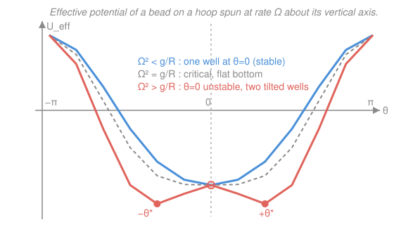

# Analytical Mechanics · Lesson 1.4: Applications of the Lagrangian formalism

> ⏱ ~15 min · Module 1: From Newton to Lagrange · Builds on: [1.3 Generalized coordinates and constraints](#/lesson/analytical-mechanics/01-03-generalized-coordinates-constraints.md) · Unlocks: Module 2 (symmetry and conservation)

## Why this matters

You now have the machine; this lesson is about running it until it's reflexive. The whole payoff of the Lagrangian is that hard problems become *bookkeeping*: no free-body diagrams, no resolving constraint forces, no vector components fighting you. Write two scalars, subtract, differentiate. The systems below — the coupled pendulum, the bead on a spun hoop, the central-force orbit — are exactly where Newton's method turns into a swamp of tension and normal forces, and exactly where $L=T-V$ walks through untouched. Master these archetypes and you can set up essentially any mechanics problem in Module 2 and beyond on autopilot.

## The idea

Every Lagrangian problem is the **same four moves**, no matter how baroque the system:

1. **Count the degrees of freedom** and pick generalized coordinates $q_i$ that already respect the constraints (the [1.3](#/lesson/analytical-mechanics/01-03-generalized-coordinates-constraints.md) skill — choose coordinates so the constraint forces never appear).
2. **Write the kinetic energy $T$ and the potential $V$** in terms of the $q_i$ and $\dot q_i$. This is the only step that takes thought: express every particle's Cartesian velocity through the $q$'s and add up $\frac12 m v^2$.
3. **Form $L = T - V$.**
4. **Turn the crank:** for each coordinate,
$$\frac{d}{dt}\frac{\partial L}{\partial \dot q_i} - \frac{\partial L}{\partial q_i} = 0.$$

That's it. Nothing about the *cleverness* of a problem changes the recipe — only the algebra in step 2. And there's a bonus that Newton never hands you for free: when a problem has one "slow" coordinate, its dynamics often collapse into motion in an **effective potential** $U_{\text{eff}}$, a single 1-D curve whose valleys are stable equilibria and hills are unstable ones. You *read stability off a graph* instead of linearizing a force field.

## The formal version

**The recipe, precisely.** For a holonomic system with generalized coordinates $q_1,\dots,q_n$, kinetic energy $T(q,\dot q)$, and potential $V(q)$, the Lagrangian $L=T-V$ obeys, for each $i$,
$$\frac{d}{dt}\frac{\partial L}{\partial \dot q_i} - \frac{\partial L}{\partial q_i} = 0.$$
*In words:* one second-order ODE per degree of freedom, and each is generated purely by partial derivatives of a single scalar $L$.

**Effective potential from a fast/slow split.** Suppose one coordinate appears in $L$ only through a term that is quadratic in a *known or conserved* rate — either an externally imposed spin $\Omega$, or a conserved momentum $\ell$. Then the surviving coordinate $q$ moves as a 1-D particle,
$$m_{\text{eff}}\,\ddot q = -\frac{dU_{\text{eff}}}{dq},$$
where $U_{\text{eff}}(q)$ collects the genuine potential *plus* the leftover kinetic term (with a sign flip, because it moved to the other side). *In words:* the messy multi-body motion is disguised 1-D motion in a bowl you can draw. Equilibria are the critical points $U_{\text{eff}}'(q_0)=0$; an equilibrium is **stable** iff $U_{\text{eff}}''(q_0)>0$ (a valley) and unstable iff $U_{\text{eff}}''(q_0)<0$ (a hilltop).

Two headline instances, both built below:
- **Central force:** the conserved angular momentum $\ell=mr^2\dot\theta$ leaves the radius moving in $U_{\text{eff}}(r)=V(r)+\dfrac{\ell^2}{2mr^2}$ — the exact object from [`mechanics-refresher` 5.2](#/lesson/mechanics-refresher/05-02-orbits-effective-potential.md), now falling out of the variational route in three lines.
- **Bead on a spun hoop:** the imposed rotation $\Omega$ contributes a centrifugal term $-\tfrac12 mR^2\Omega^2\sin^2\theta$ to $U_{\text{eff}}(\theta)$, and as $\Omega$ grows past a threshold the single valley splits into two — a **bifurcation**.

## Picture

As the spin $\Omega$ crosses $\sqrt{g/R}$, the bottom of the hoop stops being the bead's happy place: the single well (blue) flattens (grey) and then inverts into a central hill flanked by two tilted valleys $\pm\theta^*$ (red). One control parameter, a qualitative change in the equilibrium set — a **pitchfork bifurcation**, and Problem 2 derives every feature of this figure.

## Worked examples

**Example 1 (the recipe on a coupled system — the double pendulum's skeleton).** Two point masses: $m_1$ at the end of a rigid massless rod of length $\ell_1$ hanging from a pivot, $m_2$ on a second rod $\ell_2$ hinged at $m_1$. Generalized coordinates: the two angles $\theta_1,\theta_2$ from vertical (2 DOF — two rigid links in a plane, four constraints on four Cartesian coordinates). Positions:
$$x_1=\ell_1\sin\theta_1,\quad y_1=-\ell_1\cos\theta_1,\qquad x_2=x_1+\ell_2\sin\theta_2,\quad y_2=y_1-\ell_2\cos\theta_2.$$
Differentiate and assemble $v_1^2=\ell_1^2\dot\theta_1^2$ and $v_2^2=\ell_1^2\dot\theta_1^2+\ell_2^2\dot\theta_2^2+2\ell_1\ell_2\dot\theta_1\dot\theta_2\cos(\theta_1-\theta_2)$. Then
$$T=\tfrac12(m_1+m_2)\ell_1^2\dot\theta_1^2+\tfrac12 m_2\ell_2^2\dot\theta_2^2+m_2\ell_1\ell_2\dot\theta_1\dot\theta_2\cos(\theta_1-\theta_2),$$
$$V=-(m_1+m_2)g\ell_1\cos\theta_1-m_2 g\ell_2\cos\theta_2.$$
$L=T-V$, and the two Euler–Lagrange equations give the (famously chaotic) coupled nonlinear EOM. The point isn't to solve them — it's that a system with **no tractable free-body analysis** was set up completely in six lines of scalar bookkeeping. That coupling term $\cos(\theta_1-\theta_2)$ is the whole story of energy sloshing between the arms.

**Example 2 (why the effective potential is a gift — central force in one glance).** For a particle in a central potential $V(r)$, polar coordinates give $T=\tfrac12 m(\dot r^2+r^2\dot\theta^2)$, so
$$L=\tfrac12 m(\dot r^2+r^2\dot\theta^2)-V(r).$$
The angle $\theta$ doesn't appear in $L$ (only $\dot\theta$ does) — it is **cyclic**, so $\partial L/\partial\dot\theta=mr^2\dot\theta\equiv\ell$ is conserved. That's angular momentum, dropping out with zero effort (this is the whole engine of Module 2). Feed $\dot\theta=\ell/mr^2$ into the radial equation and you get
$$m\ddot r=\frac{\ell^2}{mr^3}-V'(r)=-\frac{d}{dr}\underbrace{\left[V(r)+\frac{\ell^2}{2mr^2}\right]}_{U_{\text{eff}}(r)}.$$
The 2-D orbit is now a 1-D particle rolling in $U_{\text{eff}}$: circular orbits sit at its minimum, bound orbits oscillate in its well, and the centrifugal wall $\ell^2/2mr^2$ is what keeps the particle from falling in. Newton needed the full vector orbit equation to see this; the Lagrangian handed you the conserved $\ell$ *and* the reduction for free. (Problem 3 walks the full derivation.)

## Watch out

- **You might think you can drop a term in $T$ that "looks like a constant of motion" before differentiating.** You cannot substitute a conservation law (like $\dot\theta=\ell/mr^2$) *into $L$* and then vary — that changes which quantities are held fixed and produces a wrong sign on the centrifugal term. Derive the Euler–Lagrange equations first, *then* substitute the conserved quantity. (Routhian reduction does this correctly, but it is not "just plug into $L$.")
- **You might think $U_{\text{eff}}$ is the potential energy.** It isn't — it's $V$ plus a *disguised kinetic* piece (centrifugal, or the spun-hoop term). Its sign convention is fixed by demanding $m_{\text{eff}}\ddot q=-U_{\text{eff}}'$; get that flip wrong and your stable equilibria turn unstable.
- **You might forget the cross term in $T$ for chained bodies.** For the double pendulum, $v_2^2$ carries the $2\ell_1\ell_2\dot\theta_1\dot\theta_2\cos(\theta_1-\theta_2)$ coupling. Omit it and you've silently decoupled the arms — the physics dies quietly, no error message.

## One-liner

> Every mechanics problem is four moves — count DOF, write $T$ and $V$, subtract, differentiate — and when one coordinate is fast or conserved, the rest is 1-D motion in an effective potential whose valleys you can just look at.

## Problems

**P1 (🟢)** *Spring pendulum.* A bob of mass $m$ hangs on a spring (stiffness $k$, natural length $\ell_0$) and is free to swing in a vertical plane. Use the spring length $r$ and the angle $\theta$ from vertical as generalized coordinates. Write $L$, then give both Lagrange equations (for $r$ and for $\theta$).

**P2 (🟡, Boss 1)** *Bead on a rotating hoop.* A bead slides frictionlessly on a circular hoop of radius $R$ that is forced to rotate about its vertical diameter at constant angular speed $\Omega$. Let $\theta$ be the bead's angle measured from the *bottom* of the hoop. (a) Write $L$ and derive $\ddot\theta$. (b) Read off $U_{\text{eff}}(\theta)$. (c) Find all equilibria, show a new tilted pair $\pm\theta^*$ appears when $\Omega^2>g/R$, and classify the stability of $\theta=0$, $\theta=\pi$, and $\theta^*$.

**P3 (🔴)** *Central force, the variational route.* Starting from $L=\tfrac12 m(\dot r^2+r^2\dot\theta^2)-V(r)$, derive both Lagrange equations, identify the conserved momentum, and reduce the radial equation to $m\ddot r=-U_{\text{eff}}'(r)$ with $U_{\text{eff}}=V(r)+\ell^2/2mr^2$ — recovering [`mechanics-refresher` 5.2](#/lesson/mechanics-refresher/05-02-orbits-effective-potential.md) from the Lagrangian.

Solutions

**P1** Cartesian position of the bob: $x=r\sin\theta,\ y=-r\cos\theta$. Differentiate: $\dot x=\dot r\sin\theta+r\dot\theta\cos\theta$, $\dot y=-\dot r\cos\theta+r\dot\theta\sin\theta$, so
$$v^2=\dot x^2+\dot y^2=\dot r^2+r^2\dot\theta^2.$$
Kinetic and potential energies (gravity $V_g=mgy=-mgr\cos\theta$; spring $\tfrac12 k(r-\ell_0)^2$):
$$L=\tfrac12 m(\dot r^2+r^2\dot\theta^2)-\tfrac12 k(r-\ell_0)^2+mgr\cos\theta.$$
*Radial equation* ($\partial L/\partial\dot r=m\dot r$, $\partial L/\partial r=mr\dot\theta^2-k(r-\ell_0)+mg\cos\theta$):
$$m\ddot r=mr\dot\theta^2-k(r-\ell_0)+mg\cos\theta.$$
*Angular equation* ($\partial L/\partial\dot\theta=mr^2\dot\theta$, $\partial L/\partial\theta=-mgr\sin\theta$):
$$\frac{d}{dt}(mr^2\dot\theta)+mgr\sin\theta=0\ \Longrightarrow\ r\ddot\theta+2\dot r\dot\theta+g\sin\theta=0.$$
Check: freeze the spring ($r=\ell$, $\dot r=0$) and the angular equation becomes $\ell\ddot\theta+g\sin\theta=0$, the rigid pendulum. Freeze the swing ($\theta=0$, $\dot\theta=0$) and the radial one becomes $m\ddot r=-k(r-\ell_0)+mg$, a vertical mass–spring with equilibrium $r=\ell_0+mg/k$. Both limits correct. ✓

**P2** (a) With $\theta$ from the bottom, the bead's distance from the rotation axis is $R\sin\theta$ and its height is $-R\cos\theta$. The imposed rotation gives azimuthal speed $R\sin\theta\cdot\Omega$; the in-plane speed is $R\dot\theta$. So
$$T=\tfrac12 mR^2\dot\theta^2+\tfrac12 mR^2\Omega^2\sin^2\theta,\qquad V=-mgR\cos\theta,$$
$$L=\tfrac12 mR^2\dot\theta^2+\tfrac12 mR^2\Omega^2\sin^2\theta+mgR\cos\theta.$$
Euler–Lagrange in $\theta$: $\partial L/\partial\dot\theta=mR^2\dot\theta$, $\partial L/\partial\theta=mR^2\Omega^2\sin\theta\cos\theta-mgR\sin\theta$, giving
$$\boxed{\ \ddot\theta=\Omega^2\sin\theta\cos\theta-\frac{g}{R}\sin\theta=\sin\theta\Big(\Omega^2\cos\theta-\frac{g}{R}\Big).\ }$$
(b) Writing $mR^2\ddot\theta=-U_{\text{eff}}'(\theta)$ means $U_{\text{eff}}'(\theta)=mgR\sin\theta-mR^2\Omega^2\sin\theta\cos\theta$; integrate:
$$U_{\text{eff}}(\theta)=-mgR\cos\theta-\tfrac12 mR^2\Omega^2\sin^2\theta.$$
(This is $V$ minus the centrifugal kinetic term — exactly the mislabeling trap in "Watch out.")
(c) $U_{\text{eff}}'(\theta)=mR\sin\theta\,(g-R\Omega^2\cos\theta)=0$ gives $\sin\theta=0$ ($\theta=0,\pi$) or $\cos\theta=\dfrac{g}{R\Omega^2}$, which has a solution $\pm\theta^*$ **only when** $R\Omega^2\ge g$, i.e. $\Omega^2\ge g/R$. Stability from
$$U_{\text{eff}}''(\theta)=mR\big[g\cos\theta-R\Omega^2\cos 2\theta\big]:$$
- $\theta=0$: $U_{\text{eff}}''=mR(g-R\Omega^2)$ → **stable** iff $\Omega^2<g/R$, **unstable** iff $\Omega^2>g/R$.
- $\theta=\pi$ (top): $U_{\text{eff}}''=mR(-g-R\Omega^2)<0$ → **always unstable**.
- $\theta^*$: using $\cos\theta^*=g/R\Omega^2$ and $\cos 2\theta^*=2\cos^2\theta^*-1$,
$$U_{\text{eff}}''(\theta^*)=mR\Big[\frac{g^2}{R\Omega^2}-R\Omega^2\Big(\frac{2g^2}{R^2\Omega^4}-1\Big)\Big]=\frac{m\,(R^2\Omega^4-g^2)}{\Omega^2}>0\ \text{when}\ \Omega^2>g/R,$$
so the tilted pair is **stable** exactly when it exists. Check: at $\Omega^2=g/R$ the three roots $0,\pm\theta^*$ merge and $U_{\text{eff}}''(0)=0$ — a **pitchfork bifurcation**, matching the flat grey curve in the figure. ✓

**P3** From $L=\tfrac12 m(\dot r^2+r^2\dot\theta^2)-V(r)$:
*Angular:* $\theta$ is absent from $L$, so $\dfrac{d}{dt}\dfrac{\partial L}{\partial\dot\theta}=0\Rightarrow p_\theta=mr^2\dot\theta\equiv\ell$ is conserved (angular momentum).
*Radial:* $\dfrac{\partial L}{\partial\dot r}=m\dot r$, $\dfrac{\partial L}{\partial r}=mr\dot\theta^2-V'(r)$, so
$$m\ddot r=mr\dot\theta^2-V'(r).$$
Eliminate $\dot\theta=\ell/mr^2$: $\ mr\dot\theta^2=mr\cdot\dfrac{\ell^2}{m^2r^4}=\dfrac{\ell^2}{mr^3}$, hence
$$m\ddot r=\frac{\ell^2}{mr^3}-V'(r)=-\frac{d}{dr}\Big[V(r)+\frac{\ell^2}{2mr^2}\Big]=-U_{\text{eff}}'(r).$$
Check: $-\dfrac{d}{dr}\dfrac{\ell^2}{2mr^2}=+\dfrac{\ell^2}{mr^3}$, so the centrifugal term reappears with the right sign, and $U_{\text{eff}}=V+\ell^2/2mr^2$ is precisely `mechanics-refresher` 5.2's effective potential — obtained here without ever writing $\mathbf F=m\mathbf a$. ✓ A circular orbit is $U_{\text{eff}}'(r_0)=0$; it is stable iff $U_{\text{eff}}''(r_0)>0$, the same valley test as the hoop.

## Flashback

**From Lesson 1.3 (Generalized coordinates and constraints):** A rigid ladder of length $L$ leans in a vertical plane with its top end sliding on a vertical wall and its bottom end sliding on the floor, both ends staying in contact. How many degrees of freedom does it have? Write the constraint(s), state whether they are holonomic, and give a convenient generalized coordinate.

Solution

A rigid rod in a plane has 3 configuration coordinates: the center-of-mass position $(x_c,y_c)$ and the tilt angle $\theta$. Contact imposes two conditions — the top end rides the wall ($x_{\text{top}}=0$) and the bottom end rides the floor ($y_{\text{bot}}=0$). Both are equations among coordinates alone (no velocities), so both are **holonomic**. Degrees of freedom: $3-2=1$.

A clean choice is the angle $\theta$ between the ladder and the floor: if the bottom is at $(x_b,0)$ then the top is at $(x_b-L\cos\theta,\,L\sin\theta)$, and the wall constraint $x_{\text{top}}=0$ fixes $x_b=L\cos\theta$. Every point of the ladder is then a function of $\theta$ alone. Check: at $\theta=0$ the ladder lies flat on the floor, at $\theta=\pi/2$ it stands vertical against the wall — a one-parameter family, confirming 1 DOF. ✓

## Connections

- **Backward:** this is [1.3](#/lesson/analytical-mechanics/01-03-generalized-coordinates-constraints.md)'s coordinate-choosing skill run at speed — every problem here opens by counting DOF and picking $q$'s that dissolve the constraints, so the constraint forces never appear.
- **Forward:** Example 2's cyclic $\theta$ is the entire subject of [2.1 Cyclic coordinates and conserved momenta](#/lesson/analytical-mechanics/02-01-cyclic-coordinates-momenta.md) — a coordinate missing from $L$ hands you a conserved momentum with no work. The "valley test" $U_{\text{eff}}''>0$ becomes the mass/stiffness eigenvalue problem of [4.3 Small oscillations](#/lesson/analytical-mechanics/04-03-small-oscillations.md), where the coupled-pendulum $T$ of Example 1 gets linearized into normal modes.
- **Sideways (orbital mechanics):** Problem 3 is the variational twin of [`mechanics-refresher` 5.2](#/lesson/mechanics-refresher/05-02-orbits-effective-potential.md) — the same $U_{\text{eff}}=V(r)+\ell^2/2mr^2$, the same centrifugal barrier, reached from "extremize the action" instead of "sum the forces." The bead's pitchfork and a star's circular-orbit stability are one idea: read equilibria off a 1-D curve.
