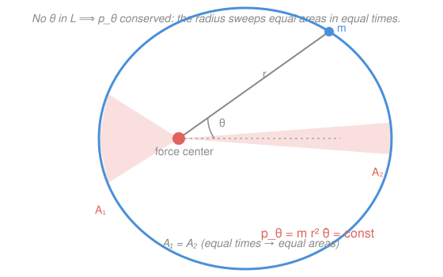

# Analytical Mechanics · Lesson 2.1: Cyclic coordinates and conserved momenta

> ⏱ ~15 min · Module 2: Symmetry and conservation · Builds on: [1.4 Applications of the Lagrangian formalism](#/lesson/analytical-mechanics/01-04-lagrangian-applications.md) · Unlocks: 2.2 (Noether's theorem)

## Why this matters

Solving a mechanics problem means integrating the equations of motion, and every conserved quantity is one integration you don't have to do — it hands you a constant instead of a second-order ODE. Newtonian mechanics makes you *discover* conservation laws by staring at the forces. The Lagrangian formulation makes them fall out of the page: if a coordinate is missing from $L$, its momentum is conserved, full stop. This is the first, cleanest instance of the deepest idea in physics — **symmetry implies conservation** — which Noether (2.2) will generalize and which reappears as the reason electric charge, energy, and momentum are conserved at all.

## The idea

Write down the Lagrangian $L$ of your system in whatever coordinates fit it. Now scan the formula. Sometimes a coordinate — call it $\theta$ — appears only through its velocity $\dot\theta$; the bare $\theta$ itself is nowhere in $L$. Physically that means: *nothing about the system changes if you shift $\theta$*. Rotate the whole central-force problem by ten degrees and the Lagrangian is identical, because it depends on $r$ and speeds, never on the orientation angle itself.

When that happens, the quantity paired with $\theta$ — its **conjugate momentum** — cannot change in time. There is no restoring "push" on $\theta$ because $L$ is flat in that direction, and Lagrange's equation says the rate of change of the momentum *equals* that push. No push, no change. Conservation isn't a lucky accident you prove case by case; it's the direct fingerprint of the Lagrangian's indifference to a coordinate. You read it off by inspection.

## The formal version

**Generalized (conjugate) momentum.** For a system with Lagrangian $L(q_1,\dots,q_n,\dot q_1,\dots,\dot q_n,t)$ in generalized coordinates $q_i$ (with velocities $\dot q_i$), the momentum **conjugate to** $q_i$ is

$$p_i = \frac{\partial L}{\partial \dot q_i}.$$

In words: differentiate $L$ with respect to one velocity, holding the others and the coordinates fixed. This is *the* definition of momentum in analytical mechanics — the everyday $m\dot x$ is just its value in the simplest case. Quick checks: for $L=\tfrac12 m\dot x^2 - V(x)$, $p_x=m\dot x$ (linear momentum); for a rotation term $\tfrac12 mr^2\dot\theta^2$, $p_\theta = mr^2\dot\theta$ (angular momentum). The name "momentum" is earned by the definition, not assumed.

**Cyclic coordinate.** A coordinate $q_i$ is **cyclic** (equivalently *ignorable*) if it does not appear in $L$, even though its velocity $\dot q_i$ may:

$$\frac{\partial L}{\partial q_i} = 0.$$

In words: $L$ is flat along $q_i$ — you can slide $q_i$ and $L$ doesn't notice.

**The conservation theorem.** Lagrange's equation for that coordinate is

$$\frac{d}{dt}\underbrace{\frac{\partial L}{\partial \dot q_i}}_{p_i} - \frac{\partial L}{\partial q_i} = 0 \quad\Longrightarrow\quad \dot p_i = \frac{\partial L}{\partial q_i} = 0.$$

In words: the general Lagrange equation already says $\dot p_i = \partial L/\partial q_i$; a cyclic coordinate zeroes the right-hand side, so **$p_i$ is a constant of the motion**. That's the whole theorem — one line, once you have the machinery of 1.4.

**The physical dictionary.** What a coordinate *is* tells you which conservation law you just got:

| $L$ has no dependence on… | Conserved $p_i$ | Physical name |
|---|---|---|
| a Cartesian position $x$ | $\partial L/\partial\dot x$ | linear momentum |
| an angle $\theta$ | $\partial L/\partial\dot\theta$ | angular momentum |
| time $t$ (explicitly) | the energy function $h$ | energy — *see 2.3* |

The last row is different in kind — it's the same "flatness ⇒ constant" logic applied to $t$ rather than a $q_i$, and it produces the energy function; [2.3](#/lesson/analytical-mechanics/02-03-energy-and-hamiltonian.md) builds it carefully. The first two are what "cyclic coordinate" buys you directly.

## Picture

The orbit's angle $\theta$ is cyclic (the force depends only on $r$), so $p_\theta = mr^2\dot\theta$ is fixed. Since $\tfrac12 r^2\dot\theta\,dt$ is the area swept by the radius in time $dt$, constant $p_\theta$ *is* Kepler's equal-area law — the sluggish far arc and the fast near arc enclose the same area in equal times.

## Worked examples

**Example 1 (the dictionary, and a non-example).** A projectile in a vertical plane, Cartesian coordinates:

$$L = \tfrac12 m(\dot x^2 + \dot y^2) - mgy.$$

Scan it. There is no bare $x$ — $x$ is cyclic — so

$$p_x = \frac{\partial L}{\partial \dot x} = m\dot x \quad\text{is conserved (horizontal momentum).}$$

Horizontal translation symmetry: shift the whole trajectory sideways and gravity doesn't care. But $y$ *does* appear (in $-mgy$), so $y$ is **not** cyclic, and indeed

$$\dot p_y = \frac{\partial L}{\partial y} = -mg \neq 0.$$

Vertical momentum drains at rate $mg$ — the weight. The Lagrangian tells you *which* momentum survives just by which letter is present.

**Example 2 (using a cyclic coordinate to reduce the problem).** A bead slides on a frictionless surface of revolution $z = h(\rho)$ — a bowl symmetric about the vertical axis — using cylindrical coordinates $(\rho,\phi)$, where $\rho$ is distance from the axis and $\phi$ the azimuthal angle. With $\dot z = h'(\rho)\dot\rho$,

$$L = \tfrac12 m\big[(1+h'(\rho)^2)\dot\rho^2 + \rho^2\dot\phi^2\big] - mg\,h(\rho).$$

The angle $\phi$ is nowhere in $L$ (only $\dot\phi$ is): $\phi$ is cyclic, so

$$p_\phi = \frac{\partial L}{\partial \dot\phi} = m\rho^2\dot\phi = \text{const}$$

— angular momentum about the axis, conserved because the bowl looks the same from every azimuth. Now cash it in. Solve for $\dot\phi = p_\phi/(m\rho^2)$ and eliminate it from the $\rho$-equation of motion. The full $\rho$ Lagrange equation is $(1+h'^2)\ddot\rho + h'h''\dot\rho^2 - \rho\dot\phi^2 + gh' = 0$; substituting $\rho\dot\phi^2 = p_\phi^2/(m^2\rho^3)$ gives a **single** equation in $\rho$ alone:

$$(1+h'^2)\,\ddot\rho + h'h''\,\dot\rho^2 - \frac{p_\phi^2}{m^2\rho^3} + g\,h' = 0.$$

Two coupled unknowns became one. The conserved $p_\phi$ reappears as a **centrifugal barrier** $-p_\phi^2/(m^2\rho^3)$ that pushes the bead away from the axis — the same term that governs central orbits. Trading a cyclic coordinate for its constant momentum and folding it into an *effective* radial problem is the **Routhian** idea; you've just done it by hand.

## Watch out

- You might think the conjugate momentum is always "mass times velocity." It is $\partial L/\partial\dot q$ — and when $L$ has velocity-coupled terms (magnetic forces, rotating frames) it is emphatically *not* $m\dot q$. Problem 3 is exactly this trap. Compute the derivative; never guess $m\dot q$.
- You might think a coordinate is non-cyclic because $\dot q_i$ shows up in $L$. Only the bare $q_i$ matters — $\dot\phi$ appearing all over Example 2 is fine; $\phi$ itself being absent is what makes $\phi$ cyclic.
- You might think "cyclic" needs an *angle*. Any coordinate can be cyclic. A Cartesian $x$ absent from $L$ gives conserved linear momentum; the word "cyclic" is historical (from orbital angles), not a restriction to angles.

## One-liner

> If a coordinate is missing from $L$, its conjugate momentum $p_i=\partial L/\partial\dot q_i$ cannot change — the Lagrangian's indifference to a coordinate *is* a conservation law.

## Problems

**P1 (🟢)** A particle moves in a central potential, with Lagrangian $L = \tfrac12 m(\dot r^2 + r^2\dot\theta^2) - V(r)$ in plane polar coordinates $(r,\theta)$. Show that $\theta$ is cyclic, compute its conjugate momentum, and confirm from Lagrange's equation that it is conserved. What is $p_\theta$ physically? Is $r$ cyclic?

**P2 (🟡)** A projectile moves in three dimensions under gravity: $L = \tfrac12 m(\dot x^2+\dot y^2+\dot z^2) - mgz$. Identify *every* cyclic coordinate and write its conserved conjugate momentum. Then use one of them to reduce the $z$-motion to a problem you could solve without ever mentioning $x$ or $y$.

**P3 (🔴)** A particle of charge $q$ and mass $m$ moves in the $xy$-plane in a uniform magnetic field $\mathbf B = B\hat z$, described (Landau gauge) by

$$L = \tfrac12 m(\dot x^2 + \dot y^2) - qBy\,\dot x.$$

Show $x$ is cyclic and compute its conjugate momentum $p_x$. Notice it is *not* $m\dot x$. Verify $\dot p_x=0$ from Lagrange's equation, and explain physically how $p_x$ can be conserved even though the mechanical momentum $m\dot x$ obviously changes as the particle circles.

Solutions

**P1** The Lagrangian contains $\dot\theta$ (in $r^2\dot\theta^2$) but no bare $\theta$, so $\partial L/\partial\theta = 0$: $\theta$ is cyclic. Its conjugate momentum:

$$p_\theta = \frac{\partial L}{\partial\dot\theta} = mr^2\dot\theta.$$

Lagrange's equation for $\theta$: $\dfrac{d}{dt}(mr^2\dot\theta) - \dfrac{\partial L}{\partial\theta} = \dot p_\theta - 0 = 0$, so $p_\theta = mr^2\dot\theta$ is **conserved**. Physically it is the **angular momentum** about the force center (for planar motion, $\ell = mr^2\dot\theta$). It is conserved because a central potential $V(r)$ has no preferred direction — rotational symmetry. And $r$ is *not* cyclic: $r$ appears both in $r^2\dot\theta^2$ and in $V(r)$, so $\partial L/\partial r\neq 0$ and $p_r=m\dot r$ is not conserved.

Check: $\dfrac{d}{dt}(mr^2\dot\theta)=m(2r\dot r\dot\theta + r^2\ddot\theta)$; the $\theta$-equation of motion sets this to $\partial L/\partial\theta=0$, consistent with $p_\theta=$ const. ✓

**P2** No bare $x$ and no bare $y$ appear (only $\dot x,\dot y$), so **both $x$ and $y$ are cyclic**:

$$p_x = \frac{\partial L}{\partial\dot x}=m\dot x=\text{const},\qquad p_y=\frac{\partial L}{\partial\dot y}=m\dot y=\text{const}.$$

Both horizontal momenta are conserved (translation symmetry in the horizontal plane). Only $z$ appears in $L$ (through $-mgz$), so it is not cyclic. Using, say, $p_x$: $\dot x = p_x/m$ is a known constant, so the horizontal motion is uniform and *decoupled* — it never enters the $z$-equation. The $z$ Lagrange equation is $m\ddot z = \partial L/\partial z = -mg$, i.e.

$$\ddot z = -g,$$

a one-dimensional constant-acceleration problem solved with $z(t)=z_0+\dot z_0 t-\tfrac12 gt^2$, entirely without reference to $x$ or $y$. The conserved horizontal momenta did the decoupling for free.

Check: with $x,y$ cyclic their momenta are constant; the residual dynamics is exactly free-fall $\ddot z=-g$. ✓

**P3** The Lagrangian depends on $\dot x,\dot y,$ and $y$, but **not** on $x$: so $\partial L/\partial x=0$ and $x$ is cyclic. Its conjugate momentum:

$$p_x = \frac{\partial L}{\partial\dot x} = m\dot x - qBy.$$

This is the **canonical momentum**; it differs from the mechanical momentum $m\dot x$ by the field term $-qBy$ (in the form $p_x=m\dot x + qA_x$ with vector potential $A_x=-By$). Lagrange's equation:

$$\dot p_x = \frac{\partial L}{\partial x} = 0 \quad\Longrightarrow\quad p_x = m\dot x - qBy = \text{const}.$$

Physically: as the particle executes its circular (cyclotron) orbit, $m\dot x$ swings up and down — the magnetic force $q\mathbf v\times\mathbf B$ continuously redirects it, so mechanical momentum is *not* conserved. What is conserved is the combination $m\dot x - qBy$: whenever $\dot x$ changes, $y$ changes in exactly the compensating way. Indeed the equations of motion are $m\ddot x = qB\dot y$ and $m\ddot y = -qB\dot x$, and one checks $\dfrac{d}{dt}(m\dot x - qBy)=m\ddot x - qB\dot y = 0$ directly. The lesson: symmetry ($x$-translation invariance of $L$) always conserves the *canonical* momentum $\partial L/\partial\dot x$, which need not be $m\dot x$.

Check: $\dfrac{d}{dt}(m\dot x - qBy) = m\ddot x - qB\dot y = qB\dot y - qB\dot y = 0$. ✓

## Flashback

**From Lesson 1.4 (Applications of the Lagrangian formalism):** A bead of mass $m$ slides without friction on a wire bent into the parabola $y = \tfrac12 k x^2$ in a vertical plane (gravity $g$ downward, $k>0$ a constant with units of inverse length). Using $x$ as the generalized coordinate, write the Lagrangian and derive the equation of motion. Then check its small-oscillation limit.

Solution

On the wire $y=\tfrac12 kx^2$, so $\dot y = kx\dot x$. Kinetic energy $T=\tfrac12 m(\dot x^2+\dot y^2)=\tfrac12 m(1+k^2x^2)\dot x^2$; potential $V=mgy=\tfrac12 mgkx^2$. Thus

$$L = \tfrac12 m(1+k^2x^2)\dot x^2 - \tfrac12 mgkx^2.$$

Lagrange's equation: $\dfrac{\partial L}{\partial\dot x}=m(1+k^2x^2)\dot x$, so

$$\frac{d}{dt}\big[m(1+k^2x^2)\dot x\big] = m(1+k^2x^2)\ddot x + 2mk^2 x\dot x^2.$$

And $\dfrac{\partial L}{\partial x}=mk^2x\dot x^2 - mgkx$. Setting $\frac{d}{dt}\partial_{\dot x}L - \partial_x L=0$ and dividing by $m$:

$$(1+k^2x^2)\,\ddot x + k^2 x\,\dot x^2 + gk\,x = 0.$$

Small-oscillation check: for $|x|$ small, drop the $k^2x^2$ and $\dot x^2$ terms to get $\ddot x + gk\,x = 0$ — simple harmonic motion with $\omega=\sqrt{gk}$, exactly what you'd expect for a bead near the bottom of a parabolic bowl of curvature $k$. ✓

(Note $x$ here is *not* cyclic — it sits inside both the kinetic coefficient and $V$ — which is why no momentum is conserved and we get a genuine second-order equation, in pointed contrast to this lesson's cyclic cases.)

## Connections

- **Backward:** this is nothing but Lagrange's equation from [1.2](#/lesson/analytical-mechanics/01-02-least-action-lagrange.md)/[1.4](#/lesson/analytical-mechanics/01-04-lagrangian-applications.md) evaluated when $\partial L/\partial q_i=0$. You already proved $\dot p_i=\partial L/\partial q_i$; today you just noticed what a zero on the right buys you.
- **Forward:** [2.2](#/lesson/analytical-mechanics/02-02-noethers-theorem.md) is the vast generalization — Noether's theorem conserves a quantity for *any* continuous symmetry, including ones not aligned with a single coordinate (like Galilean boosts or rotations mixing $x$ and $y$). A cyclic coordinate is the special case where the symmetry is "shift $q_i$." The time-translation row of the dictionary becomes the energy function in [2.3](#/lesson/analytical-mechanics/02-03-energy-and-hamiltonian.md), and the conjugate momentum $p_i$ is promoted to an independent phase-space coordinate in [3.1](#/lesson/analytical-mechanics/03-01-legendre-hamiltons-equations.md).
- **Sideways (EM / quantum):** P3's canonical momentum $p_x=m\dot x+qA_x$ is the seed of *minimal coupling* $\mathbf p\to\mathbf p-q\mathbf A$ — the same substitution that defines a charged particle's Hamiltonian and, in quantum mechanics, its Schrödinger equation in a magnetic field. The distinction between mechanical and canonical momentum you met here becomes load-bearing there.
