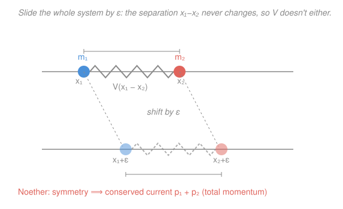

# Analytical Mechanics · Lesson 2.2: Noether's theorem

> ⏱ ~15 min · Module 2: Symmetry and conservation · Builds on: [2.1 Cyclic coordinates and conserved momenta](#/lesson/analytical-mechanics/02-01-cyclic-coordinates-momenta.md) · Unlocks: 2.3 (the energy function and the Hamiltonian)

## Why this matters

In [2.1](#/lesson/analytical-mechanics/02-01-cyclic-coordinates-momenta.md) you learned to *read* a conserved momentum off the Lagrangian whenever a coordinate was missing. But that trick is coordinate-bound: rotational invariance is obvious in polar coordinates and invisible in Cartesian ones, even though it's the *same* physics. Noether's theorem is the coordinate-free upgrade — it says the real object is not a missing variable but a **continuous symmetry of the action**, and it hands you an explicit formula for the conserved quantity that symmetry protects. This single idea — every continuous symmetry ⟹ a conservation law — is the structural backbone of all modern physics, and in [4.5](#/lesson/analytical-mechanics/04-05-classical-fields.md) it graduates from conserved *quantities* to conserved *currents* in field theory.

## The idea

A **continuous symmetry** is a knob you can turn — a parameter $\epsilon$ — that deforms every trajectory into another trajectory the physics can't tell apart. Rotate your whole apparatus by any angle and the dynamics are identical; slide it any distance; start the experiment at any time. Each is a one-parameter family of transformations, and "the physics can't tell them apart" means precisely *the action is unchanged*.

Noether's insight: turning that knob costs nothing, so there's a direction in configuration space along which the Lagrangian is flat. Flatness plus the equations of motion pins down a combination of positions and velocities that never changes as the system evolves. Turn the crank once, in full generality, and you get a formula. The dictionary it produces is the one every physicist memorizes:

- slide-anywhere (**translation**) ⟹ **momentum** conserved,
- rotate-anywhere (**rotation**) ⟹ **angular momentum** conserved,
- start-anytime (**time translation**) ⟹ **energy** conserved (the star of [2.3](#/lesson/analytical-mechanics/02-03-energy-and-hamiltonian.md)).

Cyclic coordinates from 2.1 are just the easy special case: when the symmetry happens to be "shift one coordinate," the conserved charge is exactly that coordinate's conjugate momentum. Noether covers every symmetry, including the ones no choice of coordinates makes cyclic.

## The formal version

Let a system have coordinates $q_i(t)$ and Lagrangian $L(q,\dot q,t)$. Introduce a **one-parameter family of transformations** $q_i \to Q_i(q,\epsilon)$ with $Q_i(q,0)=q_i$ (at $\epsilon=0$ nothing happens). Define the **generator**

$$\eta_i \equiv \frac{\partial Q_i}{\partial\epsilon}\bigg|_{\epsilon=0},$$

the first-order "velocity" of the transformation — the direction each coordinate moves as you first turn the knob.

**Definition (continuous symmetry).** The family is a symmetry if, evaluated on any path, $L$ is invariant to first order *up to a total time derivative*: there is a function $F(q,t)$ with

$$\frac{d}{d\epsilon}\,L\big(Q,\dot Q,t\big)\bigg|_{\epsilon=0} = \frac{dF}{dt}.$$

In words: nudging every coordinate by its generator changes $L$ by at most something that integrates to a pure boundary term — which can't affect the equations of motion, so the action is effectively unchanged. (Strict invariance is the case $F=0$.)

**Noether's theorem.** For every such symmetry, the quantity

$$I = \sum_i \frac{\partial L}{\partial\dot q_i}\,\eta_i - F$$

is conserved on solutions: $\dot I = 0$. In words: contract each conjugate momentum $\partial L/\partial\dot q_i$ with the generator $\eta_i$, subtract the boundary function, and you have a constant of the motion.

**Proof.** Expand the left side of the symmetry condition by the chain rule. Since $\partial\dot Q_i/\partial\epsilon = \tfrac{d}{dt}(\partial Q_i/\partial\epsilon)$, at $\epsilon=0$,

$$\frac{dL}{d\epsilon}\bigg|_{0} = \sum_i\left(\frac{\partial L}{\partial q_i}\,\eta_i + \frac{\partial L}{\partial\dot q_i}\,\dot\eta_i\right).$$

Now use that $q_i(t)$ solves **Lagrange's equations**, $\dfrac{\partial L}{\partial q_i} = \dfrac{d}{dt}\dfrac{\partial L}{\partial\dot q_i}$. Substituting the left factor:

$$\frac{dL}{d\epsilon}\bigg|_{0} = \sum_i\left(\frac{d}{dt}\frac{\partial L}{\partial\dot q_i}\,\eta_i + \frac{\partial L}{\partial\dot q_i}\,\dot\eta_i\right) = \frac{d}{dt}\sum_i \frac{\partial L}{\partial\dot q_i}\,\eta_i,$$

the two terms being exactly a product rule run backwards. But the symmetry condition says this equals $dF/dt$, so

$$\frac{d}{dt}\left(\sum_i \frac{\partial L}{\partial\dot q_i}\,\eta_i - F\right)=0. \qquad\blacksquare$$

The engine is just two moves: **differentiate the invariance condition, then feed in Lagrange's equations.** Everything downstream is bookkeeping.

## Picture

## Worked examples

**Example 1 (mechanical — translation gives momentum).** A free particle in one dimension, $L = \tfrac12 m\dot x^2$. Transformation: slide by $\epsilon$, $Q = x+\epsilon$, so the generator is $\eta = \partial Q/\partial\epsilon = 1$. Then $\dot Q=\dot x$, so $L$ is *literally* unchanged: $F=0$. The theorem gives

$$I = \frac{\partial L}{\partial\dot x}\,\eta - 0 = m\dot x\cdot 1 = p.$$

Momentum is conserved — the flat direction of $L$ is the $x$-axis, and $p$ is what rides along it. This is the cyclic-coordinate result of 2.1 wearing its Noether uniform.

**Example 2 (why you'd care — rotation gives angular momentum, in Cartesian coordinates).** Take a particle in a central potential, $L = \tfrac12 m(\dot x^2+\dot y^2) - V\!\big(\sqrt{x^2+y^2}\big)$. Here rotational symmetry is *not* a missing coordinate — both $x$ and $y$ appear. But rotate the plane by $\epsilon$:

$$Q_x = x\cos\epsilon - y\sin\epsilon,\qquad Q_y = x\sin\epsilon + y\cos\epsilon.$$

The generators are $\eta_x = \partial Q_x/\partial\epsilon|_0 = -y$ and $\eta_y = \partial Q_y/\partial\epsilon|_0 = x$. A rotation preserves $x^2+y^2$ (so $V$ is untouched) and $\dot x^2+\dot y^2$ (so the kinetic term is untouched), hence $F=0$. The theorem delivers

$$I = \frac{\partial L}{\partial\dot x}\,\eta_x + \frac{\partial L}{\partial\dot y}\,\eta_y = m\dot x(-y) + m\dot y(x) = m(x\dot y - y\dot x) = \ell_z.$$

Angular momentum, conserved — pulled straight out of Cartesian coordinates where 2.1's cyclic trick was blind. (Problem 2 recovers the same $\ell_z$ in polar coordinates, where it *is* cyclic — same charge, two disguises.)

## Watch out

- You might think a symmetry has to leave $L$ *exactly* fixed. It only has to fix the **action**, so $L$ may shift by a total time derivative $dF/dt$ — and forgetting the $-F$ term gives the wrong charge (Problem 3, the boost, is exactly this case).
- You might think Noether needs a cyclic coordinate. It's the reverse: cyclic coordinates are the *special* case where the symmetry is "shift $q_i$." Noether also catches rotations-in-Cartesian, boosts, and scalings that no coordinate choice makes cyclic.
- You might think the theorem hands you the conservation law for free. It uses Lagrange's equations in the proof — so $\dot I=0$ holds **on solutions**, not off them. The symmetry is a property of $L$; the conservation is a property of actual motion.
- The generator $\eta_i$ is evaluated at $\epsilon=0$: it's the *initial* direction of the flow, a function of $q$ (and possibly $t$), not the whole finite transformation.

## One-liner

> Every continuous symmetry of the action is a flat direction of $L$, and $\sum_i (\partial L/\partial\dot q_i)\,\eta_i - F$ is the quantity that coasts along it forever.

## Problems

**P1 (🟢)** Two particles on a line interacting only through their separation: $L = \tfrac12 m_1\dot x_1^2 + \tfrac12 m_2\dot x_2^2 - V(x_1-x_2)$. Apply Noether to the common shift $x_i \to x_i+\epsilon$. Find the generators, write down the conserved charge $I$, and verify $\dot I=0$ directly from the equations of motion.

**P2 (🟡)** A particle in a central potential, in polar coordinates: $L = \tfrac12 m(\dot r^2 + r^2\dot\theta^2) - V(r)$. Apply Noether to the rotation $\theta \to \theta+\epsilon$ (with $r$ fixed). Identify the conserved charge, confirm it's the angular momentum, and show it matches the cyclic-coordinate reading of 2.1.

**P3 (🔴, optional)** *Galilean boost.* For the two-particle system of P1, apply the boost $x_i \to x_i + \epsilon\,t$ (every particle's velocity gains a common $\epsilon$). Show that $L$ shifts by a total time derivative, identify $F$, and construct the Noether charge $I$. Interpret it, and verify $\dot I=0$.

Solutions

**P1** The transformation is $Q_i = x_i + \epsilon$, so both generators are $\eta_1 = \eta_2 = \partial Q_i/\partial\epsilon = 1$. Under the shift the separation $(x_1+\epsilon)-(x_2+\epsilon) = x_1-x_2$ is unchanged, so $V$ is unchanged, and velocities are unchanged — $L$ is invariant, $F=0$. The charge:

$$I = \frac{\partial L}{\partial\dot x_1}\eta_1 + \frac{\partial L}{\partial\dot x_2}\eta_2 = m_1\dot x_1 + m_2\dot x_2 = p_1 + p_2.$$

Total momentum. Check directly: the equations of motion are $m_1\ddot x_1 = -\partial V/\partial x_1 = -V'(x_1-x_2)$ and $m_2\ddot x_2 = -\partial V/\partial x_2 = +V'(x_1-x_2)$ (chain rule flips the sign). So

$$\dot I = m_1\ddot x_1 + m_2\ddot x_2 = -V'(x_1-x_2) + V'(x_1-x_2) = 0.\ \checkmark$$

Newton's third law is Noether's theorem for translation invariance.

**P2** Rotation $Q_\theta = \theta+\epsilon$, $Q_r = r$, so $\eta_\theta = 1$, $\eta_r = 0$. Since neither $r$, $\dot r$, nor $\dot\theta$ changes under a shift of $\theta$, $L$ is invariant and $F=0$. The charge:

$$I = \frac{\partial L}{\partial\dot\theta}\,\eta_\theta + \frac{\partial L}{\partial\dot r}\,\eta_r = (mr^2\dot\theta)(1) + (m\dot r)(0) = mr^2\dot\theta = \ell.$$

This is the angular momentum $\ell = mr^2\dot\theta$. It matches 2.1 exactly: $\theta$ is a cyclic coordinate here ($\partial L/\partial\theta = 0$), so its conjugate momentum $p_\theta = \partial L/\partial\dot\theta = mr^2\dot\theta$ is conserved — and $p_\theta$ *is* Noether's $I$ because the rotation generator is $\eta_\theta=1$. Check: Lagrange's equation for $\theta$ reads $\tfrac{d}{dt}(mr^2\dot\theta) = \partial L/\partial\theta = 0$, so $\dot I = 0$. $\checkmark$

**P3** The boost is $Q_i = x_i + \epsilon\,t$, so $\dot Q_i = \dot x_i + \epsilon$ and the generator is $\eta_i = \partial Q_i/\partial\epsilon = t$. The potential is untouched (each $x_i$ shifts by the *same* $\epsilon t$, so $x_1-x_2$ is fixed), but the kinetic term changes:

$$L(\epsilon) = \sum_i \tfrac12 m_i(\dot x_i+\epsilon)^2 - V(x_1-x_2) = L + \epsilon\sum_i m_i\dot x_i + O(\epsilon^2).$$

Differentiate at $\epsilon=0$:

$$\frac{dL}{d\epsilon}\bigg|_0 = \sum_i m_i\dot x_i = \frac{d}{dt}\Big(\sum_i m_i x_i\Big) = \frac{dF}{dt},\qquad F = \sum_i m_i x_i = M x_{\text{cm}},$$

where $M = m_1+m_2$ is the total mass and $x_{\text{cm}} = (\sum_i m_i x_i)/M$ the center of mass. This is exactly the "$L$ shifts by a total derivative" case — the boost is a symmetry only because that shift is a boundary term. The charge:

$$I = \sum_i \frac{\partial L}{\partial\dot x_i}\,\eta_i - F = \sum_i (m_i\dot x_i)\,t - \sum_i m_i x_i = P\,t - M x_{\text{cm}},$$

where $P = \sum_i m_i\dot x_i = p_1+p_2$ is the total momentum. Interpretation: rearranged, $x_{\text{cm}} = (P/M)\,t - I/M$ — **the center of mass moves in a straight line at constant velocity**, and $I$ is the constant that fixes its starting position. Check, using $\dot P = 0$ from P1 and $M\dot x_{\text{cm}} = P$:

$$\dot I = P + t\dot P - M\dot x_{\text{cm}} = P + 0 - P = 0.\ \checkmark$$

The boundary term was not optional: drop $F$ and you'd get $Pt$, whose derivative is $P\ne 0$.

## Flashback

**From Lesson 2.1 (Cyclic coordinates and conserved momenta):** A particle moves in cylindrical coordinates $(r,\phi,z)$ under a potential $V(r,z)$ that has no dependence on the azimuthal angle $\phi$: $L = \tfrac12 m(\dot r^2 + r^2\dot\phi^2 + \dot z^2) - V(r,z)$. Identify the cyclic coordinate, write down the conserved momentum, and say physically what it is.

Solution

$\phi$ is cyclic: it appears in $L$ only through $\dot\phi$, never as $\phi$ itself, so $\partial L/\partial\phi = 0$. Its conjugate momentum is therefore conserved:

$$p_\phi = \frac{\partial L}{\partial\dot\phi} = mr^2\dot\phi = \text{const}.$$

Physically $p_\phi$ is the component of angular momentum about the symmetry ($z$) axis. Lagrange's equation confirms it: $\tfrac{d}{dt}(mr^2\dot\phi) = \partial L/\partial\phi = 0$. (Note $r$ and $z$ are *not* cyclic — $V(r,z)$ depends on both — so only the axial angular momentum survives.) In Noether's language this is the rotation-about-$z$ symmetry, generator $\eta_\phi=1$, charge $p_\phi$. $\checkmark$

## Connections

- **Backward:** this generalizes [2.1](#/lesson/analytical-mechanics/02-01-cyclic-coordinates-momenta.md) — a cyclic coordinate is the special symmetry "shift $q_i$," whose Noether charge is exactly the conjugate momentum $p_i$. Noether removes the dependence on picking lucky coordinates (Example 2 got angular momentum from Cartesian variables where nothing was cyclic).
- **Forward:** the one symmetry Noether *can't* see as a coordinate shift is **time translation** — treating $t$ itself as the transformed variable yields the energy function, the whole subject of [2.3](#/lesson/analytical-mechanics/02-03-energy-and-hamiltonian.md). In [4.5](#/lesson/analytical-mechanics/04-05-classical-fields.md) the theorem is promoted to continuous fields, where conserved *quantities* become conserved *currents* $\partial_\mu j^\mu = 0$.
- **Sideways (quantum & particle physics):** this symmetry↔conservation dictionary is why physicists hunt for symmetries first — electric charge conservation, isospin, and the gauge structure of the Standard Model are all Noether currents of continuous symmetries, the direct descendants of the boost charge you built in P3.
