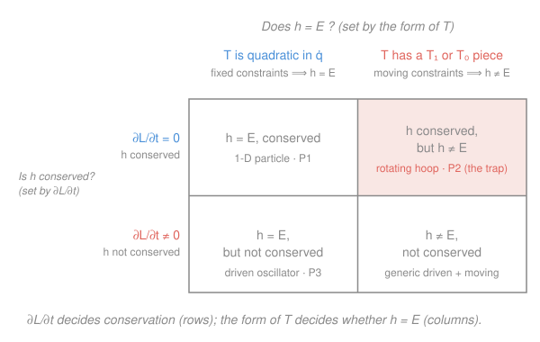

# Analytical Mechanics · Lesson 2.3: The energy function and the Hamiltonian

> ⏱ ~15 min · Module 2: Symmetry and conservation · Builds on: [2.2 Noether's theorem](#/lesson/analytical-mechanics/02-02-noethers-theorem.md), [2.1 Cyclic coordinates and conserved momenta](#/lesson/analytical-mechanics/02-01-cyclic-coordinates-momenta.md) · Unlocks: Module 3 (Hamiltonian mechanics)

## Why this matters

Every symmetry in [2.2](#/lesson/analytical-mechanics/02-02-noethers-theorem.md) bought a conservation law — except the one everyone expects most: energy. That one is special, because "time-translation symmetry" isn't a shift of a coordinate but a shift of the clock, so it needs its own construction. This lesson builds the object that time-symmetry conserves — the **energy function** $h$ — and then makes you earn something textbooks routinely blur: $h$ being *conserved* and $h$ *equalling the energy* $T+V$ are **two separate facts**, each with its own condition. Get them tangled and you'll "prove" energy conservation for a system a motor is visibly pumping. Get them straight and, as a bonus, $h$ rewritten in the right variables becomes the **Hamiltonian** — the whole of Module 3.

## The idea

Recall the Beltrami identity from [1.1](#/lesson/analytical-mechanics/01-01-calculus-of-variations.md): for a variational integrand with no explicit *independent variable*, the combination $F - y'\,\partial F/\partial y'$ is constant along the extremal. Set the independent variable to time and $F$ to the Lagrangian $L$, and that constant is what we'll call $h$. So $h$ is the direct heir of "no explicit $x$ ⟹ a first integral," now reading **no explicit $t$ ⟹ a conserved quantity.**

That settles *conservation*. But is the conserved thing the energy you'd measure — kinetic plus potential? Usually yes, and it's tempting to assume always. The catch hides in the kinetic energy. When your coordinates ride a moving constraint — a bead on a hoop someone is spinning, a frame that rotates — the velocity you build $T$ from picks up pieces that *aren't* pure "squared generalized velocity." Those extra pieces are exactly what make $h$ drift away from $T+V$. Two independent switches, then: one for "conserved?", one for "equals $E$?" — and a system can flip either without the other.

## The formal version

**The energy function (Jacobi integral).** For a Lagrangian $L(q,\dot q,t)$ in generalized coordinates $q_i$ with generalized velocities $\dot q_i$, define

$$h(q,\dot q,t) \;=\; \sum_i \dot q_i\,\frac{\partial L}{\partial \dot q_i} \;-\; L \;=\; \sum_i p_i\,\dot q_i \;-\; L,$$

where $p_i = \partial L/\partial \dot q_i$ is the momentum conjugate to $q_i$ (from [2.1](#/lesson/analytical-mechanics/02-01-cyclic-coordinates-momenta.md)). In words: weight each velocity by its own conjugate momentum, sum, and subtract off $L$.

**The conservation theorem.** Along any solution of the equations of motion,

$$\boxed{\;\frac{dh}{dt} \;=\; -\,\frac{\partial L}{\partial t}\;}$$

In words: $h$ changes only through $L$'s **explicit** clock-dependence — so $h$ is **conserved iff $\partial L/\partial t = 0$**, i.e. iff $L$ has time-translation symmetry. That is the promised Noether corollary: symmetry under sliding the clock ⟹ a conserved $h$.

*Proof (one line of bookkeeping).* Differentiate $h=\sum_i \dot q_i\,\partial L/\partial\dot q_i - L$ and expand $dL/dt$ by the chain rule, $\dfrac{dL}{dt}=\sum_i\dfrac{\partial L}{\partial q_i}\dot q_i+\sum_i\dfrac{\partial L}{\partial \dot q_i}\ddot q_i+\dfrac{\partial L}{\partial t}$:

$$\frac{dh}{dt}=\sum_i\Big[\ddot q_i\frac{\partial L}{\partial\dot q_i}+\dot q_i\frac{d}{dt}\frac{\partial L}{\partial\dot q_i}\Big]-\sum_i\frac{\partial L}{\partial q_i}\dot q_i-\sum_i\frac{\partial L}{\partial\dot q_i}\ddot q_i-\frac{\partial L}{\partial t}.$$

The $\ddot q_i$ terms cancel, and the rest regroups as $\sum_i\dot q_i\big[\tfrac{d}{dt}\tfrac{\partial L}{\partial\dot q_i}-\tfrac{\partial L}{\partial q_i}\big]-\partial L/\partial t$. The bracket is zero by Euler–Lagrange, leaving $dh/dt=-\partial L/\partial t$. ∎

**When does $h=E$?** Suppose $V=V(q)$ is velocity-independent and split the kinetic energy by its degree in the velocities, $T=T_2+T_1+T_0$, where $T_n$ is homogeneous of degree $n$ in the $\dot q_i$ (so $T_2$ is the usual $\tfrac12\sum a_{ij}\dot q_i\dot q_j$, $T_1$ is linear, $T_0$ has no $\dot q$ at all). **Euler's homogeneous-function theorem** — if $f$ is homogeneous of degree $n$ then $\sum_i \dot q_i\,\partial f/\partial\dot q_i = n f$ — gives $\sum_i \dot q_i\,\partial L/\partial\dot q_i = 2T_2+T_1$. Therefore

$$h = (2T_2+T_1) - (T_2+T_1+T_0 - V) = T_2 - T_0 + V.$$

Compare to the true mechanical energy $E=T+V=T_2+T_1+T_0+V$. In words: **$h=E$ exactly when $T_1=T_0=0$** — when $T$ is a *pure homogeneous quadratic* in the velocities. That happens precisely when the coordinates carry no explicit time, i.e. the constraints are **scleronomic** (fixed, not driven). Moving constraints inject $T_1,T_0$ and split $h$ from $E$.

The two switches are independent: $\partial L/\partial t$ governs the rows of the table below (conserved?), the form of $T$ governs the columns ($h=E$?).

## Picture

## Worked examples

**Example 1 (mechanical — the clean case).** A particle in a potential, $L=\tfrac12 m\dot x^2 - V(x)$. Then $p=\partial L/\partial\dot x = m\dot x$ and

$$h = \dot x\,(m\dot x) - \Big(\tfrac12 m\dot x^2 - V\Big) = \tfrac12 m\dot x^2 + V(x) = E.$$

Here $T=\tfrac12 m\dot x^2$ is a pure quadratic ($T_1=T_0=0$), so $h=E$; and $\partial L/\partial t=0$, so $h$ is conserved. Both switches "on" — the case textbooks silently assume. (Euler's theorem is the shortcut: $\dot x\,\partial L/\partial\dot x = m\dot x^2 = 2T_2$, so $h=2T-L=T+V$.)

**Example 2 (why you'd care — a rotating frame's effective energy).** When the two switches *disagree*, $h$ is still the useful invariant — it's the energy measured in the co-moving frame. For the bead on a hoop spun at fixed rate $\Omega$ (P2 below), the conserved $h=\tfrac12 ma^2\dot\theta^2 + V_{\text{eff}}(\theta)$ with $V_{\text{eff}}(\theta)=-\tfrac12 ma^2\Omega^2\sin^2\theta - mga\cos\theta$. That $V_{\text{eff}}$ — gravity plus a centrifugal well — is exactly the effective potential whose equilibria and stability you hunt in **Boss problem 1**. The lab energy $E$ is *not* conserved there (the motor does work), but $h$ is: when a constraint is driven, $h$ is the honest bookkeeper, not $E$.

## Watch out

- You might think "$L$ has no explicit $t$, therefore energy is conserved." It shows **$h$** is conserved. Whether that $h$ *is* the energy is the separate quadratic-$T$ question — in the rotating hoop, $h$ is conserved while $E=T+V$ genuinely is not.
- You might think a driven system (explicit $t$) can't have $h=E$. It can — a forced oscillator (P3) has pure-quadratic $T$, so $h=E$ at every instant; that shared value simply isn't *constant*. "$h=E$" and "$h$ conserved" are orthogonal.
- You might think $T_0$ (a velocity-free term inside $T$) belongs in the potential. It came from kinetic energy — the moving constraint's own motion — and its sign in $h=T_2-T_0+V$ is **minus**, opposite to how $V$ enters. Mislabeling it flips the centrifugal term's sign.
- $h$ is defined as a function of $(q,\dot q,t)$. Solve $p_i=\partial L/\partial\dot q_i$ for the $\dot q_i$ and substitute, and the *same* $h$ re-expressed in $(q,p,t)$ is the **Hamiltonian** $H(q,p,t)$ — the object [3.1](#/lesson/analytical-mechanics/03-01-legendre-hamiltons-equations.md) builds via the Legendre transform. Same number, new variables.

## One-liner

> $h=\sum_i p_i\dot q_i - L$ obeys $dh/dt=-\partial L/\partial t$, so it is conserved when the clock-shift is a symmetry — and it equals $T+V$ only when the kinetic energy is a pure quadratic in the velocities; keep those two conditions apart.

## Problems

**P1 (🟢)** For $L=\tfrac12 m\dot x^2 - V(x)$, compute $h$ from the definition, confirm $h=E$ two ways (directly, and via Euler's theorem $\dot x\,\partial L/\partial\dot x=2T_2$), and confirm $h$ is conserved using the theorem $dh/dt=-\partial L/\partial t$.

**P2 (🟡)** A bead of mass $m$ slides frictionlessly on a circular hoop of radius $a$ that is spun about its vertical diameter at a **fixed** angular rate $\Omega$ (a motor drives the azimuth, $\phi=\Omega t$). With $\theta$ the angle from the downward vertical, the Lagrangian is
$$L=\tfrac12 ma^2\dot\theta^2 + \tfrac12 ma^2\Omega^2\sin^2\theta + mga\cos\theta.$$
(a) Compute $h$. (b) Show $h$ is conserved. (c) Show $h\ne E=T+V$, identify the difference as $2T_0$, and explain physically why $E$ is *not* conserved even though $h$ is.

**P3 (🔴)** A driven oscillator has $L=\tfrac12 m\dot x^2 - \tfrac12 kx^2 + xF_0\cos\omega t$ (i.e. $V=\tfrac12 kx^2 - xF_0\cos\omega t$). (a) Compute $h$ and show $h=E$ at every instant. (b) Show $h$ is **not** conserved by computing $dh/dt$ directly from the equation of motion, and verify it equals $-\partial L/\partial t$.

Solutions

**P1** Conjugate momentum $p=\partial L/\partial\dot x=m\dot x$. From the definition,
$$h=\dot x\,p - L = m\dot x^2 - \tfrac12 m\dot x^2 + V = \tfrac12 m\dot x^2 + V = T+V = E.$$
Via Euler: $T=\tfrac12 m\dot x^2$ is homogeneous degree 2, so $\dot x\,\partial L/\partial\dot x=m\dot x^2=2T_2$, giving $h=2T_2-L=2T-(T-V)=T+V$. ✓ Same $h$.
Conservation: $\partial L/\partial t=0$ (no explicit $t$), so by the theorem $dh/dt=-\partial L/\partial t=0$. *Check* directly: $dh/dt=m\dot x\ddot x+V'(x)\dot x=\dot x(m\ddot x+V')$, and the EOM is $m\ddot x=-V'$, so the bracket vanishes. ✓

**P2** (a) $p_\theta=\partial L/\partial\dot\theta=ma^2\dot\theta$, and only $\dot\theta$ appears, so
$$h=\dot\theta\,p_\theta - L = ma^2\dot\theta^2 - \tfrac12 ma^2\dot\theta^2 - \tfrac12 ma^2\Omega^2\sin^2\theta - mga\cos\theta = \tfrac12 ma^2\dot\theta^2 - \tfrac12 ma^2\Omega^2\sin^2\theta - mga\cos\theta.$$
This is $h=\tfrac12 ma^2\dot\theta^2 + V_{\text{eff}}(\theta)$ with $V_{\text{eff}}=-\tfrac12 ma^2\Omega^2\sin^2\theta - mga\cos\theta$.
(b) $L$ has **no explicit $t$** (the drive $\phi=\Omega t$ was already substituted, leaving only $\theta,\dot\theta$), so $\partial L/\partial t=0$ and $dh/dt=-\partial L/\partial t=0$: $h$ is conserved.
(c) In coordinate $\theta$ the velocity is $\dot\theta$, so the term $\tfrac12 ma^2\Omega^2\sin^2\theta$ carries **no** $\dot\theta$ — it is $T_0$ (degree 0), not part of $T_2$. Thus $T_2=\tfrac12 ma^2\dot\theta^2$, $T_0=\tfrac12 ma^2\Omega^2\sin^2\theta$, $T_1=0$, and
$$E=T+V=T_2+T_0+V,\qquad h=T_2-T_0+V,\qquad E-h=2T_0=ma^2\Omega^2\sin^2\theta\neq 0.$$
So $h\neq E$. Physically: the motor holding $\Omega$ fixed must feed torque in and out as the bead slides toward/away from the axis, doing work on the bead — that work changes the lab energy $E$, so $E$ is *not* conserved. What survives is $h$, the energy in the rotating frame (kinetic $+$ centrifugal-plus-gravity effective potential). *Check:* $E-h=2T_0\ge 0$ and depends on $\theta(t)$, so as $\theta$ evolves $E$ must vary while $h$ stays pinned — consistent with only $h$ conserved. ✓

**P3** (a) $p=\partial L/\partial\dot x=m\dot x$, so
$$h=\dot x\,p - L = m\dot x^2 - \tfrac12 m\dot x^2 + \tfrac12 kx^2 - xF_0\cos\omega t = \tfrac12 m\dot x^2 + \tfrac12 kx^2 - xF_0\cos\omega t.$$
Here $T=\tfrac12 m\dot x^2$ is a pure quadratic ($T_1=T_0=0$), so $h=T+V=E$ at every instant — the instantaneous energy including the interaction term $-xF_0\cos\omega t$.
(b) EOM: $\tfrac{d}{dt}(m\dot x)=\partial L/\partial x=-kx+F_0\cos\omega t$, i.e. $m\ddot x+kx=F_0\cos\omega t$. Differentiate $h$ directly:
$$\frac{dh}{dt}=m\dot x\ddot x + kx\dot x - \dot x F_0\cos\omega t + xF_0\omega\sin\omega t = \dot x\underbrace{(m\ddot x+kx-F_0\cos\omega t)}_{=\,0\text{ by EOM}} + xF_0\omega\sin\omega t = xF_0\omega\sin\omega t.$$
This is nonzero in general, so $h$ is not conserved. *Check* against the theorem: $\partial L/\partial t=\partial/\partial t\,[xF_0\cos\omega t]=-xF_0\omega\sin\omega t$, hence $-\partial L/\partial t=xF_0\omega\sin\omega t$, matching $dh/dt$ exactly. ✓ The explicit clock-dependence of the drive is precisely what leaks energy in and out.

## Flashback

**From Lesson 2.1 (Cyclic coordinates and conserved momenta):** A particle moves in a plane under a central potential, $L=\tfrac12 m(\dot r^2 + r^2\dot\phi^2) - V(r)$. Identify the cyclic coordinate, write its conserved conjugate momentum, and name the physical quantity.

Solution

$L$ depends on $r,\dot r,\dot\phi$ but **not on $\phi$ itself** — $\phi$ is cyclic (ignorable). Its conjugate momentum is therefore conserved:
$$p_\phi=\frac{\partial L}{\partial\dot\phi}=mr^2\dot\phi=\text{const}.$$
This is the **angular momentum** about the center. *Check:* the $\phi$ equation of motion is $\tfrac{d}{dt}(mr^2\dot\phi)=\partial L/\partial\phi=0$, confirming $p_\phi$ is constant directly. (Note $p_\phi$ is conserved even though $r$ and $\dot\phi$ each change — the *product* $r^2\dot\phi$ is what stays fixed, the origin of Kepler's equal-areas law.)

## Connections

- **Backward:** $h$ is the Beltrami first integral of [1.1](#/lesson/analytical-mechanics/01-01-calculus-of-variations.md) with the independent variable taken to be $t$ — "no explicit $x$" becomes "no explicit $t$." And its conservation is the time-translation entry in the [2.2](#/lesson/analytical-mechanics/02-02-noethers-theorem.md) Noether ledger, the one symmetry that shifts the clock rather than a coordinate. Cyclic coordinates ([2.1](#/lesson/analytical-mechanics/02-01-cyclic-coordinates-momenta.md)) conserve *individual* momenta $p_i$; $h$ is the invariant tied to the clock.
- **Forward:** re-express $h$ in $(q,p)$ instead of $(q,\dot q)$ and it is the **Hamiltonian** $H$; [3.1](#/lesson/analytical-mechanics/03-01-legendre-hamiltons-equations.md) makes that change of variables precise (the Legendre transform) and reads Hamilton's canonical equations off it. This lesson answers Module 3's opening question — *when is $H=E$?* — before $H$ is even built.
- **Sideways:** the split $h=T_2-T_0+V$ is the mechanics face of the **effective potential** in rotating-frame and central-force problems (Boss problem 1), and the same $-T_0$ centrifugal term reappears as the Coriolis/centrifugal structure in geophysical and orbital dynamics. In economics, the "value function conserved along optimal paths when the problem has no explicit time" (autonomous optimal-control Hamiltonians) is the very same theorem — time-autonomy ⟹ a conserved current-value Hamiltonian.
