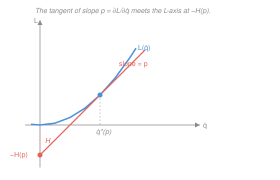

# Analytical Mechanics · Lesson 3.1: The Legendre transform and Hamilton's equations

> ⏱ ~15 min · Module 3: Hamiltonian mechanics · Builds on: [2.3 The energy function and the Hamiltonian](#/lesson/analytical-mechanics/02-03-energy-and-hamiltonian.md) · Unlocks: 3.2 (phase space and Liouville's theorem)

## Why this matters

Lagrangian mechanics gives you $n$ second-order equations on the space of configurations $q$. Hamiltonian mechanics trades them for $2n$ **first**-order equations on a doubled space of positions *and* momenta $(q,p)$ — and that doubling is not busywork. It makes the equations symmetric, geometric, and flowing: every state is a point, the dynamics is a vector field, and time evolution is a smooth flow you can reason about with the tools of phase-plane analysis you already know. This structure is the launchpad for the rest of the course (Liouville, Poisson brackets, canonical transformations) and for the two theories built directly on it: statistical mechanics (which counts phase-space volume) and quantum mechanics (which promotes $H(q,p)$ to the energy operator). The bridge that gets us there is one idea from convex analysis — the Legendre transform.

## The idea

You have a function of velocity, the Lagrangian $L(q,\dot q,t)$. You want to describe the same physics using **momentum** $p$ instead of velocity $\dot q$ as your independent variable. Naively you'd solve $p=\partial L/\partial\dot q$ for $\dot q$ and substitute — but that throws away information, because a function and its slope don't determine each other uniquely (add a constant to $L$ and the slopes are unchanged).

The Legendre transform is the honest way to swap "value" for "slope." Picture the graph of $L$ as a function of $\dot q$ (for fixed $q$). It's convex — bowl-shaped — so each slope $p$ is achieved at exactly one point. Draw the tangent line of slope $p$. That line hits the vertical axis somewhere, and **the height of that intercept encodes everything**: as you vary $p$, the intercept traces out a new function. Up to a sign, that new function is the Hamiltonian $H(p)$. A convex curve can be described either by its points $(\dot q, L)$ or by its tangent lines (slope $p$, intercept $-H$) — same object, dual descriptions. Trading points for tangents loses nothing.

This exact transform is everywhere: in thermodynamics it turns internal energy $U(S,V)$ into the free energies $F, G, H$ by swapping an extensive variable for its conjugate intensive one; in microeconomics it's the convex duality that links a cost function to a profit function. Same machine, different labels.

## The formal version

Let $L(q,\dot q,t)$ be the Lagrangian, with $q=(q_1,\dots,q_n)$ the generalized coordinates and $\dot q$ their time derivatives. Define the **conjugate (canonical) momentum**

$$p_i \;=\; \frac{\partial L}{\partial \dot q_i}.$$

In words: $p_i$ is the slope of $L$ in the $\dot q_i$ direction. Assume this relation is invertible — solvable for the $\dot q_i$ as functions of $(q,p,t)$ (guaranteed when $L$ is convex in the velocities, i.e. the matrix $\partial^2 L/\partial\dot q_i\partial\dot q_j$ is nonsingular). The **Hamiltonian** is the Legendre transform of $L$ with respect to the velocities:

$$H(q,p,t) \;=\; \sum_{i=1}^{n} p_i\,\dot q_i \;-\; L(q,\dot q,t),$$

where every $\dot q_i$ on the right is rewritten in terms of $(q,p,t)$. In words: multiply each velocity by its momentum, subtract the Lagrangian, and express the result using momenta instead of velocities. (Fail to eliminate the $\dot q$'s and you haven't finished the transform.)

**Hamilton's equations.** Take the differential of $H$ and watch a cancellation:

$$dH = \sum_i \dot q_i\,dp_i + \sum_i p_i\,d\dot q_i - \sum_i \frac{\partial L}{\partial q_i}dq_i - \sum_i \frac{\partial L}{\partial \dot q_i}d\dot q_i - \frac{\partial L}{\partial t}dt.$$

The definition $p_i=\partial L/\partial\dot q_i$ makes the two $d\dot q_i$ sums cancel exactly — that cancellation is the whole point of the Legendre transform, and it's why $H$ genuinely depends on $p$, not $\dot q$. What remains, using the Euler–Lagrange equation $\dot p_i=\frac{d}{dt}\frac{\partial L}{\partial\dot q_i}=\frac{\partial L}{\partial q_i}$, is

$$dH = \sum_i \dot q_i\,dp_i - \sum_i \dot p_i\,dq_i - \frac{\partial L}{\partial t}dt.$$

But $H$ is a function of $(q,p,t)$, so also $dH=\sum_i\frac{\partial H}{\partial q_i}dq_i+\sum_i\frac{\partial H}{\partial p_i}dp_i+\frac{\partial H}{\partial t}dt$. Matching coefficients of the independent differentials gives **Hamilton's canonical equations**:

$$\boxed{\;\dot q_i = \frac{\partial H}{\partial p_i}, \qquad \dot p_i = -\frac{\partial H}{\partial q_i}\;}\qquad\text{and}\qquad \frac{\partial H}{\partial t} = -\frac{\partial L}{\partial t}.$$

In words: the gradient of $H$ in momentum tells positions how to move; minus its gradient in position tells momenta how to move. The two equations are near-mirror images — that antisymmetry is the seed of all the symplectic structure to come. The $n$ second-order Lagrange equations have become $2n$ first-order equations on **phase space**, the $(q,p)$ space each of whose points is a complete instantaneous state.

Two facts inherited from Lesson 2.3: for a standard system (time-independent constraints, velocity-independent potential) $H=T+V$ is the energy; and if $L$ has no explicit time dependence then $\partial H/\partial t=0$ and $H$ is conserved along the motion — because $\frac{dH}{dt}=\sum_i(\frac{\partial H}{\partial q_i}\dot q_i+\frac{\partial H}{\partial p_i}\dot p_i)+\frac{\partial H}{\partial t}=\frac{\partial H}{\partial t}$, the canonical equations cancelling the bracket.

## Picture

The curve is $L$ as a function of velocity; pick a slope $p$, find the unique tangent point, and read off where that tangent crosses the $L$-axis. That intercept is $-H(p)$. Sweep $p$ and the intercept sweeps out $H$ — the dual curve.

## Worked examples

**Example 1 (mechanical — free particle in 1-D).** $L=\tfrac12 m\dot x^2$. Then $p=\partial L/\partial\dot x=m\dot x$, so $\dot x=p/m$, and

$$H = p\dot x - L = p\cdot\frac{p}{m} - \tfrac12 m\Big(\frac{p}{m}\Big)^2 = \frac{p^2}{2m}.$$

Hamilton's equations: $\dot x=\partial H/\partial p=p/m$ (recovering $p=m\dot x$) and $\dot p=-\partial H/\partial x=0$ (momentum conserved). Two first-order equations replacing $m\ddot x=0$. Note $H=\tfrac12 m\dot x^2$ came out equal to the kinetic energy — expected, since here $H=T+V$ with $V=0$.

**Example 2 (why you'd care — reading the phase-space flow).** For any 1-D system with $H(x,p)$, the canonical equations $(\dot x,\dot p)=(\partial H/\partial p,\,-\partial H/\partial x)$ *are* a planar vector field — precisely the object of [`ode-refresher` 3.2](#/lesson/ode-refresher/03-02-phase-portraits-stability.md). Level curves of $H$ are trajectories (since $H$ is conserved), and the flow circulates around them. For the pendulum $H=\frac{p^2}{2m\ell^2}-mg\ell\cos\theta$, the low-energy level sets are closed loops (libration) around the stable center at $(\theta,p)=(0,0)$, while the separatrix at $H=mg\ell$ divides them from the over-the-top rotations. You get the entire qualitative story — fixed points, centers, saddles, separatrices — by treating Hamilton's equations as a 2-D autonomous system and applying phase-plane analysis. Hamiltonian systems have no attractors (the flow preserves area — Lesson 3.2), so every fixed point is a center or a saddle, never a spiral.

## Watch out

- You might think the canonical momentum is always $m\dot q$. It's $\partial L/\partial\dot q$ — for a charged particle it's $m\dot x+qA$, in polar coordinates the angular one is $mr^2\dot\theta$. Kinetic momentum and canonical momentum differ whenever $L$ has velocity terms beyond $\tfrac12 m\dot q^2$ (P3, P2).
- You might think you're done once you write $H=\sum p_i\dot q_i-L$. You must **eliminate every $\dot q$** in favor of $p$; an $H$ still containing velocities is not a function on phase space and its partial derivatives are meaningless.
- You might think $H$ is always the energy $\tfrac12 mv^2+V$. $H=T+V$ only for time-independent constraints and velocity-independent potentials; and even when $H$ numerically equals the energy, *as a function* it lives on $(q,p)$, not on velocities — write $\frac{p^2}{2m}$, never $\frac12 m\dot x^2$ (P3 shows a case where $H\neq\tfrac12 mv^2$ outright).

## One-liner

> The Legendre transform swaps velocity for momentum, turning $n$ curved second-order equations into $2n$ mirror-image first-order equations $\dot q=\partial H/\partial p,\ \dot p=-\partial H/\partial q$ that flow on phase space.

## Problems

**P1 (🟢)** Harmonic oscillator, $L=\tfrac12 m\dot x^2-\tfrac12 kx^2$. Find the canonical momentum $p$, construct $H(x,p)$, write out Hamilton's equations, and combine them to recover $\ddot x=-\omega^2 x$. Identify $\omega$.

**P2 (🟡)** A particle of mass $m$ moves in a plane under a central potential $V(r)$, with Lagrangian $L=\tfrac12 m(\dot r^2+r^2\dot\theta^2)-V(r)$ in polar coordinates. Find $p_r$ and $p_\theta$, construct $H(r,\theta,p_r,p_\theta)$, and write Hamilton's equations. Show that $p_\theta$ is conserved and say why in one word.

**P3 (🔴, optional)** A relativistic free particle in 1-D has $L=-mc^2\sqrt{1-\dot x^2/c^2}$. Perform the Legendre transform carefully: find $p$, invert for $\dot x$, and show

$$H=\sqrt{p^2c^2+m^2c^4}.$$

Confirm $H\neq\tfrac12 m\dot x^2$ (what is its low-speed expansion?), and check that $\dot x=\partial H/\partial p$ reproduces the correct velocity–momentum relation.

Solutions

**P1** Momentum: $p=\partial L/\partial\dot x=m\dot x$, so $\dot x=p/m$. Hamiltonian:
$$H=p\dot x-L=\frac{p^2}{m}-\Big(\tfrac12 m\tfrac{p^2}{m^2}-\tfrac12 kx^2\Big)=\frac{p^2}{2m}+\tfrac12 kx^2.$$
Hamilton's equations:
$$\dot x=\frac{\partial H}{\partial p}=\frac{p}{m},\qquad \dot p=-\frac{\partial H}{\partial x}=-kx.$$
Differentiate the first and substitute the second: $\ddot x=\dot p/m=-kx/m=-\omega^2 x$ with $\omega=\sqrt{k/m}$. Check: $\dot x=p/m$ is exactly the definition of $p$, and $\dot p=-kx$ is Newton's law $m\ddot x=-kx$. ✓

**P2** Momenta:
$$p_r=\frac{\partial L}{\partial\dot r}=m\dot r,\qquad p_\theta=\frac{\partial L}{\partial\dot\theta}=mr^2\dot\theta,$$
so $\dot r=p_r/m$ and $\dot\theta=p_\theta/(mr^2)$. Hamiltonian:
$$H=p_r\dot r+p_\theta\dot\theta-L=\frac{p_r^2}{m}+\frac{p_\theta^2}{mr^2}-\Big[\frac{p_r^2}{2m}+\frac{p_\theta^2}{2mr^2}-V(r)\Big]=\frac{p_r^2}{2m}+\frac{p_\theta^2}{2mr^2}+V(r).$$
Hamilton's equations:
$$\dot r=\frac{p_r}{m},\quad \dot\theta=\frac{p_\theta}{mr^2},\quad \dot p_r=-\frac{\partial H}{\partial r}=\frac{p_\theta^2}{mr^3}-V'(r),\quad \dot p_\theta=-\frac{\partial H}{\partial\theta}=0.$$
Since $H$ has no $\theta$ in it, $\dot p_\theta=0$: angular momentum $p_\theta$ is conserved. One word: **cyclic** ($\theta$ is an ignorable coordinate). Check: $\dot p_r=\frac{p_\theta^2}{mr^3}-V'(r)$ is $m\ddot r=mr\dot\theta^2-V'(r)$, the radial equation with the centrifugal term. ✓

**P3** Momentum:
$$p=\frac{\partial L}{\partial\dot x}=-mc^2\cdot\frac{-\dot x/c^2}{\sqrt{1-\dot x^2/c^2}}=\frac{m\dot x}{\sqrt{1-\dot x^2/c^2}}=\gamma m\dot x,\qquad \gamma\equiv\frac{1}{\sqrt{1-\dot x^2/c^2}}.$$
Invert: $p^2(1-\dot x^2/c^2)=m^2\dot x^2\Rightarrow \dot x^2=\dfrac{p^2c^2}{m^2c^2+p^2}$. Now
$$H=p\dot x-L=\gamma m\dot x^2+\frac{mc^2}{\gamma}=m\gamma\Big(\dot x^2+\frac{c^2}{\gamma^2}\Big)=m\gamma\big(\dot x^2+c^2-\dot x^2\big)=\gamma mc^2,$$
using $c^2/\gamma^2=c^2(1-\dot x^2/c^2)=c^2-\dot x^2$. Rewrite in $p$: since $\gamma mc^2=\sqrt{(\gamma m\dot x)^2c^2+m^2c^4}$ (check: $(\gamma m\dot x)^2c^2+m^2c^4=m^2c^2\gamma^2(\dot x^2+c^2/\gamma^2)=m^2c^2\gamma^2c^2=\gamma^2m^2c^4$),
$$H=\sqrt{p^2c^2+m^2c^4}.$$
Not $\tfrac12 m\dot x^2$: for $\dot x\ll c$, $H=mc^2\sqrt{1+p^2/m^2c^2}\approx mc^2+\frac{p^2}{2m}=mc^2+\tfrac12 m\dot x^2$ — rest energy plus the Newtonian kinetic term, not the kinetic term alone. Finally,
$$\frac{\partial H}{\partial p}=\frac{pc^2}{\sqrt{p^2c^2+m^2c^4}}=\frac{pc^2}{\gamma mc^2}=\frac{p}{\gamma m}=\frac{\gamma m\dot x}{\gamma m}=\dot x.\ \checkmark$$
And $\dot p=-\partial H/\partial x=0$: the free particle's momentum is conserved, matching $\gamma m\dot x=\text{const}$. ✓

## Flashback

**From Lesson 2.3 (The energy function and the Hamiltonian):** A bead of mass $m$ slides without friction on a straight wire that is forced to rotate in a horizontal plane at constant angular rate $\Omega$; $r$ is the distance along the wire and a potential $V(r)$ acts along it. After using the constraint $\dot\theta=\Omega$, the Lagrangian is $L=\tfrac12 m\dot r^2+\tfrac12 m\Omega^2 r^2-V(r)$. Compute the energy function $h=\dot r\,\dfrac{\partial L}{\partial\dot r}-L$. Is $h$ conserved? Does it equal the mechanical energy $E=T+V$?

Solution

$\partial L/\partial\dot r=m\dot r$, so
$$h=\dot r\,(m\dot r)-L=m\dot r^2-\Big(\tfrac12 m\dot r^2+\tfrac12 m\Omega^2 r^2-V\Big)=\tfrac12 m\dot r^2-\tfrac12 m\Omega^2 r^2+V(r).$$
**Conserved?** Yes — $L$ has no *explicit* time dependence (the rotation was folded in as a fixed rate $\Omega$, not as $t$), so $dh/dt=-\partial L/\partial t=0$. **Equal to energy?** No. The true kinetic energy is $T=\tfrac12 m\dot r^2+\tfrac12 m\Omega^2 r^2$ (the wire's forced rotation carries real speed), so $E=T+V=\tfrac12 m\dot r^2+\tfrac12 m\Omega^2 r^2+V$, whereas $h=\tfrac12 m\dot r^2-\tfrac12 m\Omega^2 r^2+V$. They differ by the sign of the rotational term: $h=T_2-T_0+V$ where $T_0=\tfrac12 m\Omega^2 r^2$ is the velocity-independent piece of $T$. The energy function is conserved but is *not* the energy — the driven constraint pumps energy in and out, so $E$ is not constant while $h$ is. Check: this is exactly the effective-potential structure, $h=\tfrac12 m\dot r^2+V_{\rm eff}(r)$ with $V_{\rm eff}=V-\tfrac12 m\Omega^2 r^2$, and $h$ is precisely the Hamiltonian $H(r,p_r)=\frac{p_r^2}{2m}-\tfrac12 m\Omega^2 r^2+V$ that Lesson 3.1 would build from the same $L$. ✓

## Connections

- **Backward:** this is the energy function $h$ of [2.3](#/lesson/analytical-mechanics/02-03-energy-and-hamiltonian.md) rewritten in $(q,p)$ — the same object, now the generator of the dynamics rather than just a conserved quantity. The cancellation in $dH$ relies on the Euler–Lagrange equation from Module 1.
- **Forward:** [3.2](#/lesson/analytical-mechanics/03-02-phase-space-liouville.md) reads Hamilton's equations as a flow and proves it preserves phase-space volume (Liouville); [3.3](#/lesson/analytical-mechanics/03-03-poisson-brackets.md) repackages $\dot f=\partial f/\partial q\,\dot q+\partial f/\partial p\,\dot p$ as the Poisson bracket $\{f,H\}$, which becomes the quantum commutator.
- **Sideways (thermodynamics & econ):** the very same Legendre transform swaps $S\leftrightarrow T$ and $V\leftrightarrow -P$ among the thermodynamic potentials $U,F,G,H$, and is the convex duality behind the cost/profit pair in microeconomics — trade a variable for its conjugate slope, lose nothing.
- **Sideways (dynamical systems):** Hamilton's equations for one degree of freedom are a planar autonomous system, so [`ode-refresher` 3.2](#/lesson/ode-refresher/03-02-phase-portraits-stability.md)'s fixed points, centers, and saddles are the phase portraits of mechanics — with the special constraint that area is preserved, so no spirals or nodes.
