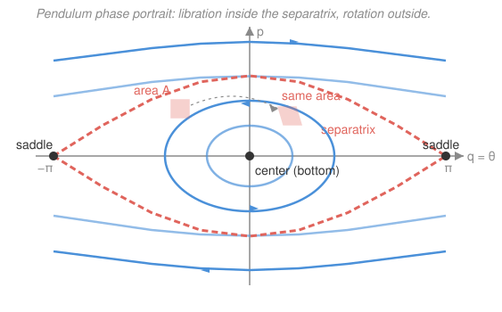

# Analytical Mechanics · Lesson 3.2: Phase space and Liouville's theorem

> ⏱ ~15 min · Module 3: Hamiltonian mechanics · Builds on: [3.1 The Legendre transform and Hamilton's equations](#/lesson/analytical-mechanics/03-01-legendre-hamiltons-equations.md), [`ode-refresher` 3.2](#/lesson/ode-refresher/03-02-phase-portraits-stability.md) · Unlocks: 3.3 (Poisson brackets)

## Why this matters

Hamilton's equations turned dynamics into a first-order flow on the $(q,p)$ plane — a vector field you can *draw*. This lesson cashes that in twice. First, the whole qualitative life of a system (does it oscillate? whirl? sit still?) becomes a picture you read off the energy contours. Second — and this is the deep one — that flow has a rigid geometric property no dissipative system shares: **it never compresses phase-space volume**. A cloud of initial conditions can stretch and fold arbitrarily, but its volume is a conserved quantity. That single fact forbids attractors in Hamiltonian mechanics and is the literal foundation on which `stat-mech` builds the microcanonical ensemble.

## The idea

Fix a 1-degree-of-freedom system — a pendulum, say. Its state is one point $(q,p)$: position and momentum. As time runs, that point traces a curve. Hamilton's equations tell each point which way to move, so phase space fills with a **flow**, like a fluid with a prescribed velocity at every point. Two facts make the picture almost draw itself:

- **Trajectories can't cross.** The velocity $(\dot q,\dot p)$ is a single-valued function of position, so through each point there's exactly one streamline (ODE uniqueness). Orbits nest; they never intersect.
- **For an autonomous system, energy is constant along the flow.** So each orbit lives entirely on one contour $H(q,p)=$const. To draw the portrait, you just draw the level curves of $H$.

Now the twist. Picture the flow carrying not one point but a little **blob** of nearby initial conditions — a drop of dye in the fluid. In a draining bathtub the dye would get sucked toward the drain and its volume would shrink to nothing (an attractor). **Liouville's theorem says the Hamiltonian flow can never do this.** The drop can smear into a long thin filament, wrap around, distort wildly — but its area (in 1-DOF; volume in general) stays exactly fixed. The phase fluid is *incompressible*.

## The formal version

Take coordinates $(q,p)$, where $q$ is a generalized coordinate and $p$ its conjugate momentum, and a Hamiltonian $H(q,p,t)$. **Hamilton's equations** define the phase-space velocity field:

$$\dot q = \frac{\partial H}{\partial p}, \qquad \dot p = -\frac{\partial H}{\partial q}.$$

In words: the flow's velocity at a point is set by the gradient of $H$, rotated 90° — you move *along* contours of $H$, not down them.

**Liouville's theorem.** The phase-space velocity field $\mathbf v=(\dot q,\dot p)$ is divergence-free:

$$\nabla\cdot\mathbf v=\frac{\partial \dot q}{\partial q}+\frac{\partial \dot p}{\partial p}=\frac{\partial}{\partial q}\!\left(\frac{\partial H}{\partial p}\right)+\frac{\partial}{\partial p}\!\left(-\frac{\partial H}{\partial q}\right)=\frac{\partial^2 H}{\partial q\,\partial p}-\frac{\partial^2 H}{\partial p\,\partial q}=0.$$

The two second derivatives are equal (mixed partials commute), so they cancel. In words: **the phase flow has zero divergence, so it transports volume without compressing it** — a region $\Omega_0$ of initial conditions evolves into a region $\Omega_t$ with the same measure, $\mathrm{vol}(\Omega_t)=\mathrm{vol}(\Omega_0)$, for all $t$. (For $N$ degrees of freedom the same one-line cancellation runs over every conjugate pair: $\sum_i\big(\partial_{q_i}\dot q_i+\partial_{p_i}\dot p_i\big)=\sum_i\big(\partial_{q_i}\partial_{p_i}H-\partial_{p_i}\partial_{q_i}H\big)=0$.)

Why "divergence-free ⇒ volume-preserving": the volume of a region carried by a flow changes at rate $\frac{d}{dt}\mathrm{vol}(\Omega_t)=\int_{\Omega_t}\nabla\cdot\mathbf v\,\,d\mu$ (the transport theorem — the boundary flux of $\mathbf v$). Zero divergence everywhere makes the rate zero. This is exactly the fluids statement that a velocity field with $\nabla\cdot\mathbf v=0$ is incompressible.

## Picture

The pendulum, $H=\dfrac{p^2}{2m\ell^2}+mg\ell(1-\cos q)$ with $q=\theta$. Low energy: closed **libration** orbits — the bob swings back and forth around the stable **center** at the bottom $(q,p)=(0,0)$. High energy: **rotation** orbits that never return to $p=0$ — the bob whirls over the top. Dividing them is the dashed **separatrix**, the orbit with exactly the energy $H=2mg\ell$ to reach the unstable **saddle** at the top $(q,p)=(\pm\pi,0)$. The shaded square is a patch of initial conditions; as the flow carries it, it shears into a parallelogram of *equal area* — Liouville in one frame.

## Worked examples

**Example 1 (reading a portrait — the harmonic oscillator).** $H=\dfrac{p^2}{2m}+\tfrac12 kx^2$. Contours $H=E$ are the ellipses $\dfrac{p^2}{2m}+\tfrac12 kx^2=E$; every orbit is closed, so every motion is periodic — the linear pendulum with no separatrix. The velocity field is $\dot x=\partial_p H=p/m$, $\dot p=-\partial_x H=-kx$, and its divergence is $\partial_x(p/m)+\partial_p(-kx)=0+0=0$: the elliptical annulus between two energy contours keeps its area as it rotates. Problem 1 makes this quantitative.

**Example 2 (why you'd care — no attractors, and the gateway to statistical mechanics).** Suppose a Hamiltonian system *did* have a stable equilibrium that pulled nearby states inward, spiraling them to a point (a "sink"). A neighborhood of that point would shrink in area as it flowed in — forbidden by Liouville. So **Hamiltonian systems have no asymptotically stable fixed points, no limit cycles, no strange attractors**: their fixed points are centers or saddles, never spirals. Turn this around and it becomes constructive: because volume is conserved, the natural measure to put on an energy surface is the uniform (Lebesgue) one — states are not funneled anywhere, so equal phase-space volumes carry equal statistical weight. That is precisely the **microcanonical postulate** of `stat-mech`; Liouville is the theorem that licenses it.

## Watch out

- You might think "phase-space volume is conserved, so the *shape* is conserved too." Only the volume is. A blob generically stretches into an ever-thinner filament that wraps densely through the accessible region (the seed of mixing and chaos) — its area is fixed while its diameter blows up.
- You might think Liouville says trajectories can't converge. Two trajectories *can* approach each other along one direction — but then they must spread apart in another by exactly enough to keep volume fixed. Contraction in every direction at once is what's banned.
- You might think a real, damped pendulum violates Liouville because it spirals to rest. It doesn't violate anything — a damped system is **not Hamiltonian**. Its flow has *negative* divergence ($\nabla\cdot\mathbf v=-\gamma<0$, Problem 3), so it legitimately contracts area onto an attractor. Liouville is a statement about the Hamiltonian structure, not about mechanical systems in general.

## One-liner

> The Hamiltonian flow is an incompressible fluid on phase space — energy contours are its streamlines, and a divergence-free velocity means a blob of states can deform forever but never shrink.

## Problems

**P1 (🟢)** For the harmonic oscillator $H=\dfrac{p^2}{2m}+\tfrac12 kx^2$: (a) show the phase-space trajectories are the ellipses $\dfrac{p^2}{2m}+\tfrac12 kx^2=E$ and give their semi-axes in terms of $E$; (b) verify directly from Hamilton's equations that the flow is divergence-free.

**P2 (🟡)** Prove Liouville's theorem for a general one-degree-of-freedom Hamiltonian $H(q,p)$: compute $\nabla\cdot(\dot q,\dot p)$ from Hamilton's equations and show it is zero. State exactly which smoothness assumption on $H$ you used.

**P3 (🔴)** The pendulum $H=\dfrac{p^2}{2m\ell^2}+mg\ell(1-\cos q)$. (a) Find all fixed points of the flow and classify each as a center or a saddle. (b) Show the separatrix has energy $H=2mg\ell$ and that on it $p=\pm 2m\ell\sqrt{g\ell}\,\cos(q/2)$. (c) Argue from Liouville that the bottom equilibrium cannot be an asymptotically stable spiral. Then add linear damping — equations $\dot q=p/m\ell^2$, $\dot p=-mg\ell\sin q-\gamma\, p$ — compute the divergence of the new flow, and explain why the damped bob *can* spiral to rest without contradicting Liouville.

Solutions

**P1** (a) Since $H$ has no explicit time dependence it is conserved along the flow, so each trajectory satisfies $H(x,p)=E$ for its own constant $E$, i.e. $\dfrac{p^2}{2m}+\tfrac12 kx^2=E$. Writing it in standard form,
$$\frac{x^2}{(2E/k)}+\frac{p^2}{(2mE)}=1,$$
an ellipse with semi-axis $\sqrt{2E/k}$ along the $x$-direction and $\sqrt{2mE}$ along the $p$-direction. (b) Hamilton's equations: $\dot x=\partial H/\partial p=p/m$, $\dot p=-\partial H/\partial x=-kx$. Then
$$\nabla\cdot(\dot x,\dot p)=\frac{\partial}{\partial x}\Big(\frac{p}{m}\Big)+\frac{\partial}{\partial p}\big(-kx\big)=0+0=0.$$
Check: the two terms vanish because $\dot x$ is independent of $x$ and $\dot p$ is independent of $p$ — divergence-free, so the elliptical flow preserves area. ✓

**P2** Hamilton's equations give $\dot q=\dfrac{\partial H}{\partial p}$ and $\dot p=-\dfrac{\partial H}{\partial q}$. Compute the divergence of the phase-space velocity:
$$\nabla\cdot(\dot q,\dot p)=\frac{\partial \dot q}{\partial q}+\frac{\partial \dot p}{\partial p}=\frac{\partial}{\partial q}\!\left(\frac{\partial H}{\partial p}\right)+\frac{\partial}{\partial p}\!\left(-\frac{\partial H}{\partial q}\right)=\frac{\partial^2 H}{\partial q\,\partial p}-\frac{\partial^2 H}{\partial p\,\partial q}.$$
If $H$ is $C^2$ (continuous second partial derivatives), Clairaut/Schwarz guarantees the mixed partials are equal, so the two terms cancel and $\nabla\cdot(\dot q,\dot p)=0$. Check: the cancellation is *identically* zero — it uses only equality of mixed partials, never the specific form of $H$, which is why volume preservation is universal to Hamiltonian flows. The one hypothesis used is $H\in C^2$. ✓

**P3** (a) Fixed points need $\dot q=\dot p=0$. From $\dot q=\partial H/\partial p=p/m\ell^2=0$ we get $p=0$; from $\dot p=-\partial H/\partial q=-mg\ell\sin q=0$ we get $q=0$ or $q=\pi$ (mod $2\pi$). Linearize $\mathbf v=(p/m\ell^2,\,-mg\ell\sin q)$; the Jacobian is
$$J=\begin{pmatrix}0 & 1/m\ell^2\\ -mg\ell\cos q & 0\end{pmatrix},\qquad \det J=g/\ell\cdot\cos q.$$
At $q=0$: $\det J=g/\ell>0$ with zero trace ⇒ eigenvalues $\pm i\sqrt{g/\ell}$, purely imaginary ⇒ **center** (stable oscillation at the bottom). At $q=\pi$: $\cos q=-1$ ⇒ $\det J=-g/\ell<0$ ⇒ real eigenvalues of opposite sign $\pm\sqrt{g/\ell}$ ⇒ **saddle** (the unstable inverted position).

(b) The separatrix is the orbit passing through the saddle $(q,p)=(\pi,0)$, so its energy equals $H$ there: $H=\dfrac{0}{2m\ell^2}+mg\ell(1-\cos\pi)=mg\ell(1-(-1))=2mg\ell$. Setting $H=2mg\ell$ on a general point and using $1-\cos q=2\sin^2(q/2)$:
$$\frac{p^2}{2m\ell^2}=2mg\ell-mg\ell\,(1-\cos q)=mg\ell(1+\cos q)=2mg\ell\cos^2(q/2),$$
so $p^2=4m^2\ell^3 g\cos^2(q/2)$ and $p=\pm 2m\ell\sqrt{g\ell}\,\cos(q/2)$, which is $0$ at $q=\pm\pi$ and maximal at $q=0$ — the dashed lobe in the figure.

(c) The undamped pendulum is Hamiltonian, so by Liouville its flow is area-preserving; an asymptotically stable spiral would draw a neighborhood of the fixed point inward, shrinking its area to zero — impossible. Consistent with (a), the bottom fixed point is a center (imaginary eigenvalues, no contraction), not a spiral. Now the damped system: $\dot q=p/m\ell^2$, $\dot p=-mg\ell\sin q-\gamma p$. Its divergence is
$$\nabla\cdot(\dot q,\dot p)=\frac{\partial}{\partial q}\Big(\frac{p}{m\ell^2}\Big)+\frac{\partial}{\partial p}\big(-mg\ell\sin q-\gamma p\big)=0+(-\gamma)=-\gamma<0.$$
Nonzero (negative) divergence means the flow is *not* the flow of any Hamiltonian — the damping term $-\gamma p$ has no $H$ that produces it. Phase-space area contracts at rate $e^{-\gamma t}$, so trajectories collapse onto the rest state: a stable spiral. No contradiction, because Liouville only constrains Hamiltonian (divergence-free) flows. Check: setting $\gamma=0$ recovers $\nabla\cdot\mathbf v=0$ and the center of part (a). ✓

## Flashback

**From Lesson 3.1 (The Legendre transform and Hamilton's equations):** A particle of mass $m$ on a line feels a constant force, Lagrangian $L=\tfrac12 m\dot q^2-\alpha q$ (so $V=\alpha q$). Construct the Hamiltonian by Legendre transform and write Hamilton's equations; then solve them and identify the motion.

Solution

Conjugate momentum: $p=\dfrac{\partial L}{\partial \dot q}=m\dot q$, so $\dot q=p/m$. Legendre transform (eliminate $\dot q$ in favor of $p$):
$$H=p\dot q-L=p\cdot\frac{p}{m}-\Big(\tfrac12 m\big(\tfrac{p}{m}\big)^2-\alpha q\Big)=\frac{p^2}{m}-\frac{p^2}{2m}+\alpha q=\frac{p^2}{2m}+\alpha q.$$
Hamilton's equations:
$$\dot q=\frac{\partial H}{\partial p}=\frac{p}{m},\qquad \dot p=-\frac{\partial H}{\partial q}=-\alpha.$$
Integrate: $p(t)=p_0-\alpha t$ and $\dot q=p/m$ gives $q(t)=q_0+\dfrac{p_0}{m}t-\dfrac{\alpha}{2m}t^2$ — uniformly accelerated motion under constant force $-\alpha$ (free fall when $\alpha=mg$). Check: $\dot p=-\alpha$ is Newton's second law $\dot p=F=-\partial V/\partial q=-\alpha$, and the phase-space velocity has divergence $\partial_q(p/m)+\partial_p(-\alpha)=0$, as Liouville requires. ✓

## Connections

- **Backward:** this is [3.1](#/lesson/analytical-mechanics/03-01-legendre-hamiltons-equations.md)'s vector field $(\dot q,\dot p)$ taken seriously as a *flow*; the center/saddle classification is the linear phase-plane analysis of [`ode-refresher` 3.2](#/lesson/ode-refresher/03-02-phase-portraits-stability.md), now with the extra Hamiltonian constraint (zero trace ⇒ centers, never spirals) baked in.
- **Forward:** [3.3 (Poisson brackets)](#/lesson/analytical-mechanics/03-03-poisson-brackets.md) rewrites the flow as $\dot f=\{f,H\}$ and recovers Liouville as a bracket identity; [3.4 (canonical transformations)](#/lesson/analytical-mechanics/03-04-canonical-transformations.md) is exactly the class of coordinate changes that preserve this phase-space volume (the symplectic/area-preserving maps).
- **Sideways (`stat-mech`):** volume preservation is why the microcanonical ensemble weights states by phase-space volume — Liouville is the theorem that makes "equal a priori probability" a consequence of dynamics rather than an assumption. Contrast dissipative flows ($\nabla\cdot\mathbf v<0$), whose attractors are the whole subject of nonlinear dynamics.
