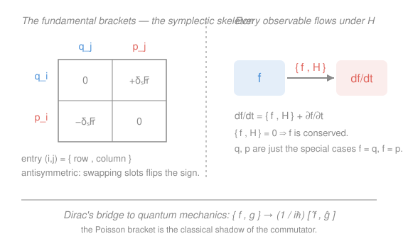

# Analytical Mechanics · Lesson 3.3: Poisson brackets

> ⏱ ~15 min · Module 3: Hamiltonian mechanics · Builds on: [3.1 The Legendre transform and Hamilton's equations](#/lesson/analytical-mechanics/03-01-legendre-hamiltons-equations.md) · Unlocks: 3.4 (canonical transformations)

## Why this matters

Hamilton's equations tell you how $q$ and $p$ evolve. But the questions you actually ask are about *other* quantities — energy, angular momentum, the eccentricity of an orbit — and you want a single machine that says how *any* of them changes in time, and a one-line test for whether it changes at all. The Poisson bracket is that machine. It compresses all of dynamics into one algebraic operation, turns "is this conserved?" into "is this bracket zero?", and — the payoff that outlives this course — is the exact classical object that becomes the commutator in quantum mechanics. When Dirac built quantum theory, this bracket is the structure he kept.

## The idea

In [3.1](#/lesson/analytical-mechanics/03-01-legendre-hamiltons-equations.md) the state of a system was a point $(q,p)$ in phase space, and $H(q,p)$ generated its motion. Any measurable quantity — call it an **observable** $f$ — is just a function $f(q,p)$ on that space: energy, momentum, whatever. As the point drifts along its trajectory, $f$ rides along and changes value.

How fast? Chain rule: $f$ changes because $q$ changes and because $p$ changes. Substitute Hamilton's equations for those rates, and the mess collects into a single, strikingly symmetric combination of derivatives of $f$ and $H$. That combination is worth naming, because it turns out to have a life of its own — it works for *any* two functions, not just $f$ and $H$. Name it the **Poisson bracket** $\{f,g\}$.

Once you have it, everything reorganizes. The rate of change of any observable is its bracket with $H$. A conserved quantity is one whose bracket with $H$ vanishes — no calculus, just an algebraic check. The coordinates themselves obey dead-simple bracket relations. And the bracket obeys a handful of algebraic laws (it's *antisymmetric*, *bilinear*, obeys a product rule, and satisfies the Jacobi identity) that make phase-space functions into a **Lie algebra** — the same abstract structure that governs rotations and, later, quantum operators.

## The formal version

**The Poisson bracket.** For two observables $f(q,p)$ and $g(q,p)$ on a phase space with coordinates $q_i$ and conjugate momenta $p_i$ ($i = 1,\dots,n$),

$$\{f,g\} \;=\; \sum_i\left(\frac{\partial f}{\partial q_i}\frac{\partial g}{\partial p_i} - \frac{\partial f}{\partial p_i}\frac{\partial g}{\partial q_i}\right).$$

In words: sum, over every degree of freedom, "$f$-by-position times $g$-by-momentum" minus the same with the roles of position and momentum swapped. It eats two functions and returns a third.

**The master equation of motion.** For any observable $f(q,p,t)$,

$$\boxed{\;\frac{df}{dt} = \{f,H\} + \frac{\partial f}{\partial t}.\;}$$

In words: an observable changes for two reasons — because the state flows through phase space (that's $\{f,H\}$) and because $f$ was explicitly built to depend on the clock (that's $\partial f/\partial t$). Most observables have no explicit $t$, so $df/dt = \{f,H\}$ alone. **Hamilton's equations are just the two special cases $f = q_i$ and $f = p_i$:**

$$\dot q_i = \{q_i, H\}, \qquad \dot p_i = \{p_i, H\}.$$

(Check the first: $\{q_i,H\} = \sum_j \left(\frac{\partial q_i}{\partial q_j}\frac{\partial H}{\partial p_j} - \frac{\partial q_i}{\partial p_j}\frac{\partial H}{\partial q_j}\right) = \frac{\partial H}{\partial p_i}$, since $\partial q_i/\partial q_j = \delta_{ij}$ and $\partial q_i/\partial p_j = 0$. That is exactly Hamilton's first equation from 3.1.)

**Constant of motion.** If $f$ has no explicit time dependence, then

$$f \text{ is conserved} \iff \{f,H\} = 0.$$

In words: a quantity is conserved exactly when it has zero bracket with the Hamiltonian. This is the workhorse — conservation becomes a one-line algebra check.

**The fundamental brackets.** Taking $f,g$ to be the coordinates themselves gives the bedrock relations

$$\{q_i,q_j\} = 0, \qquad \{p_i,p_j\} = 0, \qquad \{q_i,p_j\} = \delta_{ij},$$

where $\delta_{ij}$ (the Kronecker delta) is $1$ if $i=j$ and $0$ otherwise. In words: positions bracket-commute with each other, momenta with each other, and a coordinate has unit bracket only with *its own* conjugate momentum. These four rules encode the entire skeleton of phase space — and a coordinate change that preserves them is exactly a *canonical transformation* ([3.4](#/lesson/analytical-mechanics/03-04-canonical-transformations.md)).

**Algebraic properties.** For all observables $f,g,h$ and constants $a,b$:

- **Antisymmetry:** $\{f,g\} = -\{g,f\}$ (so $\{f,f\} = 0$).
- **Bilinearity:** $\{af + bg,\, h\} = a\{f,h\} + b\{g,h\}$.
- **Leibniz (product) rule:** $\{fg,\, h\} = f\{g,h\} + \{f,h\}g$ — the bracket acts like a derivative in each slot.
- **Jacobi identity:** $\{f,\{g,h\}\} + \{g,\{h,f\}\} + \{h,\{f,g\}\} = 0$.

In words: these are precisely the axioms of a **Lie algebra**. Antisymmetry, bilinearity, and Jacobi are the defining three; Leibniz makes the bracket a *derivation*, which is why it computes rates of change.

**Poisson's theorem.** If $f$ and $g$ are both constants of motion, so is $\{f,g\}$. This follows from Jacobi with $h = H$: if $\{f,H\}=\{g,H\}=0$ then $\{\{f,g\},H\}=0$. In words: constants of motion breed new constants of motion — sometimes new ones, sometimes just a re-derivation of ones you had.

**The quantum bridge.** Dirac's quantization rule replaces the classical bracket by a commutator:

$$\{f,g\} \;\longrightarrow\; \frac{1}{i\hbar}\,[\hat f, \hat g], \qquad [\hat f,\hat g] \equiv \hat f\hat g - \hat g\hat f.$$

The fundamental bracket $\{q,p\}=1$ becomes the canonical commutation relation $[\hat q,\hat p] = i\hbar$; the equation of motion $df/dt = \{f,H\}$ becomes the Heisenberg equation $\frac{d\hat f}{dt} = \frac{1}{i\hbar}[\hat f,\hat H]$. The Poisson bracket is the classical shadow of the commutator — you will meet the other side of this in `quantum-mechanics`.

## Picture

The left block is the *symplectic skeleton*: a coordinate has unit bracket only with its own momentum, and the sign flips when you swap the slots (antisymmetry). The right block is the master equation — feed any observable $f$ into $\{\,\cdot\,,H\}$ and out comes its time derivative; $q$ and $p$ are merely the first two customers. The caption is Dirac's rule: divide the commutator by $i\hbar$ and you are back to this bracket.

## Worked examples

**Example 1 (mechanical — angular momentum closes on itself).** In three dimensions write the angular-momentum components as $L_i = \epsilon_{ijk}\,x_j p_k$ (sum over repeated indices; $\epsilon_{ijk}$ is the fully antisymmetric Levi-Civita symbol), so

$$L_x = y p_z - z p_y,\quad L_y = z p_x - x p_z,\quad L_z = x p_y - y p_x.$$

Compute $\{L_x, L_y\}$ using bilinearity, the Leibniz rule, and the fundamental brackets (e.g. $\{y,p_y\}=1$, $\{z,p_z\}=1$, all cross-brackets zero). Only two of the four expanded terms survive:

$$\{y p_z,\, z p_x\} = y\,\{p_z, z\}\,p_x = -\,y p_x, \qquad \{z p_y,\, x p_z\} = x\,\{z,p_z\}\,p_y = x p_y,$$

and the other two vanish (no coordinate meets its own conjugate momentum). Hence

$$\{L_x, L_y\} = x p_y - y p_x = L_z.$$

Cyclically, $\{L_y,L_z\}=L_x$ and $\{L_z,L_x\}=L_y$. The three components form a closed Lie algebra — this is $\mathfrak{so}(3)$, the algebra of rotations. Apply Dirac's rule and you get $[\hat L_x,\hat L_y] = i\hbar \hat L_z$: **the quantum angular-momentum commutators are already here, in classical mechanics.**

**Example 2 (why you'd care — conservation for free).** A particle in a central potential has $H = \frac{1}{2m}(p_x^2+p_y^2) + V(r)$ with $r=\sqrt{x^2+y^2}$. Is $L_z = x p_y - y p_x$ conserved? Check $\{L_z, H\}$. Split $H = T + V$. For the kinetic part,

$$\{L_z, T\} = p_y\frac{p_x}{m} + (-p_x)\frac{p_y}{m} = 0,$$

and for the potential, since $V$ depends only on $r$ and $\partial V/\partial x = V'(r)\,x/r$,

$$\{L_z, V\} = -\Big[(-y)\,V'(r)\tfrac{x}{r} + x\,V'(r)\tfrac{y}{r}\Big] = -\frac{V'(r)}{r}\big(-xy + xy\big) = 0.$$

So $\{L_z,H\}=0$: angular momentum is conserved, and we never solved a single equation of motion. The physical reason is that $H$ has no preferred direction — rotational symmetry — and the bracket detected it algebraically. (This is Noether's theorem from Module 2 wearing its Hamiltonian clothes: the conserved quantity is the *generator* of the symmetry that leaves $H$ invariant.)

## Watch out

- **The sign convention is load-bearing.** With $\{f,g\} = \partial_q f\,\partial_p g - \partial_p f\,\partial_q g$ you get $\{q,p\} = +1$ and $\dot f = \{f,H\}$. Some texts flip the overall sign (and then write $\dot f = \{H,f\}$). Pick one and never mix; a stray sign silently reverses time.
- **"Zero bracket" needs "no explicit $t$."** The clean test $\{f,H\}=0 \Rightarrow$ conserved assumes $\partial f/\partial t = 0$. If $f$ carries the clock explicitly, you must use the full $df/dt = \{f,H\} + \partial f/\partial t$ — and a quantity *can* be conserved with a nonzero bracket if the two pieces cancel.
- **The Leibniz rule is not symmetric like ordinary multiplication.** $\{fg,h\} = f\{g,h\} + \{f,h\}g$ keeps the factors in order. Classically $f,g$ commute so ordering looks pedantic — but this is exactly the rule that survives into quantum mechanics, where $\hat f\hat g \ne \hat g\hat f$ and the order is everything. Learn it ordered now.

## One-liner

> The Poisson bracket turns dynamics into algebra: $\dot f = \{f,H\}$, "conserved" means $\{f,H\}=0$, and $\{q,p\}=1$ is the seed that grows into the quantum commutator $[\hat q,\hat p]=i\hbar$.

## Problems

**P1 (🟢)** (a) Verify the three fundamental brackets $\{q,q\}=0$, $\{p,p\}=0$, $\{q,p\}=1$ directly from the definition for one degree of freedom. (b) Compute $\{q, p^2\}$ and $\{q^2, p\}$ using the Leibniz rule, then confirm each by direct differentiation.

**P2 (🟡)** For a one-dimensional system with $H = \frac{p^2}{2m} + V(q)$: (a) recover both of Hamilton's equations as the brackets $\{q,H\}$ and $\{p,H\}$. (b) Show the Hamiltonian itself is conserved by evaluating $\{H,H\}$, and say in one sentence why the answer was inevitable.

**P3 (🔴, optional)** The 2-D isotropic harmonic oscillator has $H = \frac{1}{2m}(p_x^2+p_y^2) + \frac{1}{2}m\omega^2(x^2+y^2)$. Beyond energy and angular momentum, it hides a conserved *tensor*. Consider the off-diagonal component

$$A = \frac{p_x p_y}{2m} + \frac{1}{2}m\omega^2\, x y.$$

Show $\{A, H\} = 0$, so $A$ is a constant of motion. (This extra symmetry — an $\mathfrak{su}(2)$ hiding inside a 2-D oscillator — is why every orbit is a *closed* ellipse, not a precessing rosette.)

Solutions

**P1** (a) One degree of freedom, $\{f,g\} = \partial_q f\,\partial_p g - \partial_p f\,\partial_q g$.
- $\{q,q\}$: $\partial_q q\,\partial_p q - \partial_p q\,\partial_q q = 1\cdot 0 - 0\cdot 1 = 0$.
- $\{p,p\}$: $\partial_q p\,\partial_p p - \partial_p p\,\partial_q p = 0\cdot 1 - 1\cdot 0 = 0$.
- $\{q,p\}$: $\partial_q q\,\partial_p p - \partial_p q\,\partial_q p = 1\cdot 1 - 0\cdot 0 = 1$.

(b) By Leibniz in the second slot, $\{q, p^2\} = p\{q,p\} + \{q,p\}p = 2p\{q,p\} = 2p$. Direct: $\{q,p^2\} = \partial_q q\,\partial_p(p^2) - \partial_p q\,\partial_q(p^2) = 1\cdot 2p - 0 = 2p$. ✓
Similarly $\{q^2, p\} = q\{q,p\} + \{q,p\}q = 2q$. Direct: $\{q^2,p\} = \partial_q(q^2)\,\partial_p p - \partial_p(q^2)\,\partial_q p = 2q\cdot 1 - 0 = 2q$. ✓
(Note the pattern $\{q,p^2\}=2p$, $\{q^2,p\}=2q$: bracketing with $p$ differentiates by $q$, and vice versa — up to sign, the bracket *is* a derivative.)

**P2** (a) With $H = \frac{p^2}{2m} + V(q)$:
$$\{q,H\} = \partial_q q\,\partial_p H - \partial_p q\,\partial_q H = 1\cdot\frac{p}{m} - 0 = \frac{p}{m} = \dot q,$$
$$\{p,H\} = \partial_q p\,\partial_p H - \partial_p p\,\partial_q H = 0 - 1\cdot V'(q) = -V'(q) = \dot p.$$
These are exactly Hamilton's equations $\dot q = \partial H/\partial p$, $\dot p = -\partial H/\partial q$ from 3.1. ✓
(b) $\{H,H\} = 0$ by antisymmetry ($\{f,f\}=-\{f,f\}\Rightarrow\{f,f\}=0$), or directly: $\partial_q H\,\partial_p H - \partial_p H\,\partial_q H = 0$. Since $H$ has no explicit time dependence, $dH/dt = \{H,H\} + \partial H/\partial t = 0$. The answer was inevitable because *anything* has zero bracket with itself — energy conservation for a time-independent $H$ is pure antisymmetry. ✓

**P3** Use bilinearity and split $H = H_x + H_y$ with $H_x = \frac{p_x^2}{2m} + \frac12 m\omega^2 x^2$ and $H_y$ its $x\to y$ copy. All cross-brackets between the $x$- and $y$-sectors vanish, so only matched pairs survive. Using $\{p_x p_y, x^2\} = -2x p_y$ and $\{xy, p_x^2\} = 2y p_x$ (each from Leibniz + fundamental brackets):

$$\{A, H_x\} = \frac{1}{2m}\cdot\tfrac12 m\omega^2\{p_x p_y, x^2\} + \tfrac12 m\omega^2\cdot\frac{1}{2m}\{xy, p_x^2\} = \frac{\omega^2}{4}(-2x p_y) + \frac{\omega^2}{4}(2y p_x) = \frac{\omega^2}{2}(y p_x - x p_y).$$

By the $x\leftrightarrow y$ symmetry of $A$ (it is unchanged under $x\leftrightarrow y$, $p_x\leftrightarrow p_y$), the same computation on the $y$-sector gives

$$\{A, H_y\} = \frac{\omega^2}{2}(x p_y - y p_x).$$

Adding, $\{A,H\} = \{A,H_x\} + \{A,H_y\} = \frac{\omega^2}{2}(y p_x - x p_y) + \frac{\omega^2}{2}(x p_y - y p_x) = 0$. ✓

So $A$ is conserved. (The diagonal components $A_{xx} = \frac{p_x^2}{2m}+\frac12 m\omega^2 x^2$ and $A_{yy}$ are separately conserved too — they are the energies in each axis. Together the symmetric tensor $A_{ij}$ carries the hidden $\mathfrak{su}(2)$; its conservation is what closes every orbit into an ellipse.)

## Flashback

**From Lesson 3.1 (Hamilton's equations):** A particle of mass $m$ falls under uniform gravity with Hamiltonian $H(q,p) = \dfrac{p^2}{2m} + mgq$, where $q$ is height and $p$ its conjugate momentum. (a) Write Hamilton's equations and reduce them to a single second-order equation for $q(t)$. (b) On a fixed-energy contour $H = E$, sketch the shape of the phase-space trajectory in the $(q,p)$ plane.

Solution

(a) Hamilton's equations:
$$\dot q = \frac{\partial H}{\partial p} = \frac{p}{m}, \qquad \dot p = -\frac{\partial H}{\partial q} = -mg.$$
Differentiate the first and substitute the second: $\ddot q = \dot p/m = -g$, i.e. $\ddot q = -g$ — free fall, exactly Newton. ✓

(b) Fixed energy means $\frac{p^2}{2m} + mgq = E$, so $q = \frac{E}{mg} - \frac{p^2}{2m^2 g}$. In the $(q,p)$ plane this is a **parabola opening in the $-q$ direction** (equivalently $p^2 = 2m(E - mgq)$, a sideways parabola with vertex at $q = E/mg$, $p=0$ — the top of the flight where the particle is momentarily at rest). Higher $E$ shifts the vertex to greater height; the flow runs up the left branch (rising, $p>0$) and down the right ($p<0$), never closing — an unbound trajectory, unlike the oscillator's ellipse in [3.2](#/lesson/analytical-mechanics/03-02-phase-space-liouville.md). ✓

## Connections

- **Backward:** the bracket is Hamilton's equations from [3.1](#/lesson/analytical-mechanics/03-01-legendre-hamiltons-equations.md) rewritten as $\dot q = \{q,H\}$, $\dot p = \{p,H\}$ — the same first-order flow, now generated by one operation. Liouville's theorem in [3.2](#/lesson/analytical-mechanics/03-02-phase-space-liouville.md) is the geometric face of what the fundamental brackets state algebraically: the phase-space structure the flow preserves.
- **Forward:** [3.4](#/lesson/analytical-mechanics/03-04-canonical-transformations.md) *defines* a canonical transformation as one that preserves the fundamental brackets $\{q_i,p_j\}=\delta_{ij}$ — the bracket becomes the test for "legal change of coordinates," and Hamilton–Jacobi theory ([4.1](#/lesson/analytical-mechanics/04-01-hamilton-jacobi.md)) hunts for the transformation that makes every bracket with $H$ vanish at once.
- **Sideways (quantum mechanics):** Dirac's rule $\{f,g\}\to\frac{1}{i\hbar}[\hat f,\hat g]$ makes this lesson the classical blueprint of the entire operator formalism — $\{q,p\}=1 \to [\hat q,\hat p]=i\hbar$, $\{L_x,L_y\}=L_z \to [\hat L_x,\hat L_y]=i\hbar\hat L_z$, and $\dot f=\{f,H\}\to$ the Heisenberg equation. The $\mathfrak{so}(3)$ of Example 1 is *literally* the angular-momentum algebra you will quantize in `quantum-mechanics`.
