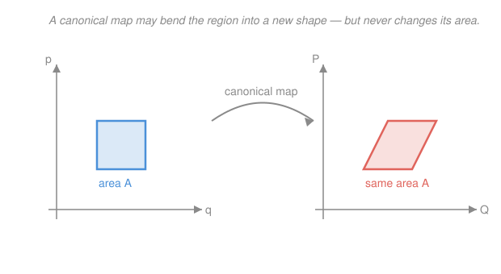

# Analytical Mechanics · Lesson 3.4: Canonical transformations

> ⏱ ~15 min · Module 3: Hamiltonian mechanics · Builds on: [3.3 Poisson brackets](#/lesson/analytical-mechanics/03-03-poisson-brackets.md) · Unlocks: Module 4 (advanced formulations)

## Why this matters

In Lagrangian mechanics you're free to *rename* your coordinates — swap Cartesian for polar, whatever fits the constraints — but you can't touch the velocities independently. Hamiltonian mechanics doubles your freedom: position and momentum are now equal, independent citizens of phase space, so you can mix them. The transformations that respect the machinery — that keep Hamilton's equations looking like Hamilton's equations — are the **canonical** ones. And the entire endgame of the course is one idea: find the canonical transformation that makes the new Hamiltonian *trivial*. That's Hamilton–Jacobi (4.1), that's action–angle variables (4.2), that's Boss problem 3.

## The idea

You have a system described by $(q,p)$. You want a smarter set of coordinates $(Q,P)$ — maybe ones in which the Hamiltonian doesn't depend on $Q$ at all, so $P$ is instantly conserved and the problem collapses. But you can't just pick *any* map $(q,p)\to(Q,P)$: most maps scramble the geometry of phase space and Hamilton's equations come out wrong on the other side.

The transformations that survive are the ones that **preserve the symplectic structure** — the bookkeeping that pairs each coordinate with its conjugate momentum. Three equivalent ways to say "this map is legal":

- **Dynamical:** Hamilton's equations hold in $(Q,P)$ with some new Hamiltonian $K$.
- **Algebraic:** the fundamental Poisson bracket survives, $\{Q,P\}=1$.
- **Geometric:** the map preserves phase-space *area* (volume in higher dimensions) — it can stretch a region into a wildly different shape, but never change how much area it encloses.

That last one is the picture to hold onto: a canonical transformation is an *area-preserving* deformation of phase space. It's the same incompressibility that Liouville's theorem (3.2) gives for time evolution — because time evolution is itself a canonical transformation.

## The formal version

A transformation $(q,p)\to (Q,P)$, with $Q=Q(q,p)$ and $P=P(q,p)$, is **canonical** if it preserves the form of Hamilton's equations: there exists a new Hamiltonian $K(Q,P)$ with
$$\dot Q = \frac{\partial K}{\partial P},\qquad \dot P = -\frac{\partial K}{\partial Q}.$$

**Poisson-bracket test.** For one degree of freedom, the map is canonical iff the fundamental bracket is preserved:
$$\{Q,P\} \equiv \frac{\partial Q}{\partial q}\frac{\partial P}{\partial p} - \frac{\partial Q}{\partial p}\frac{\partial P}{\partial q} = 1.$$
*In words:* the new variables are conjugate to each other in exactly the way $q,p$ were. This is the cheapest test — one bracket, and you're done. (Recall from [3.3](#/lesson/analytical-mechanics/03-03-poisson-brackets.md) that $\{q,p\}=1$ is the fundamental bracket; canonicity just demands the new pair inherit it.)

**Symplectic test.** Collect the coordinates into $\xi=(q,p)^\top$ and $\eta=(Q,P)^\top$, and let $M$ be the Jacobian $M_{ij}=\partial \eta_i/\partial \xi_j$. Define the **symplectic form**
$$J=\begin{pmatrix}0 & 1\\ -1 & 0\end{pmatrix}.$$
The map is canonical iff
$$M^\top J M = J.$$
*In words:* $J$ is the piece of structure that encodes "which coordinate is paired with which momentum," and $M$ must leave it untouched. This is a pure linear-algebra condition on the Jacobian. Taking determinants of both sides, $\det(M^\top)\det J\det M = \det J$, and since $\det J = 1 \ne 0$ we get $\det M = \pm 1$ — in fact $\det M = +1$. So a canonical map has **unit Jacobian**: it preserves oriented phase-space area (see [`linalg-refresher` 2.3: determinants](#/lesson/linalg-refresher/02-03-determinants.md) — the determinant *is* the area-scaling factor). This is exactly Liouville's incompressibility from [3.2](#/lesson/analytical-mechanics/03-02-phase-space-liouville.md), now as a property of the coordinate change itself.

**Generating functions.** The slickest way to *build* a canonical transformation is to hand over one function and let it generate the whole map. There are four types, distinguished by which old/new variable they depend on:

| Type | Depends on | Generates |
|------|-----------|-----------|
| $F_1(q,Q)$ | old & new coordinate | $\displaystyle p=\frac{\partial F_1}{\partial q},\quad P=-\frac{\partial F_1}{\partial Q}$ |
| $F_2(q,P)$ | old coord, new momentum | $\displaystyle p=\frac{\partial F_2}{\partial q},\quad Q=\frac{\partial F_2}{\partial P}$ |
| $F_3(p,Q)$ | old momentum, new coord | $\displaystyle q=-\frac{\partial F_3}{\partial p},\quad P=-\frac{\partial F_3}{\partial Q}$ |
| $F_4(p,P)$ | old & new momentum | $\displaystyle q=-\frac{\partial F_4}{\partial p},\quad Q=\frac{\partial F_4}{\partial P}$ |

Any $F$ you write down generates a genuinely canonical map — automatically, no bracket check needed. The new Hamiltonian is $K=H$ when $F$ has no explicit time dependence (add $\partial F/\partial t$ otherwise). *In words:* pick a generating function, take two partial derivatives, and you've got a legal change of phase-space coordinates for free.

**Three transformations to keep in your pocket** (via $F_2$):
- **Identity:** $F_2=qP \Rightarrow p=P,\ Q=q$. Nothing changes.
- **Point transformation:** $F_2 = f(q)\,P \Rightarrow Q=f(q),\ p=f'(q)P$. This is any old Lagrangian coordinate change $Q=f(q)$, with the momentum dragged along correctly.
- **Exchange:** $F_1=qQ \Rightarrow p=Q,\ P=-q$. Coordinate and momentum trade places (with a sign). Only in Hamiltonian mechanics is this even a legal move — and it shows position and momentum are truly interchangeable.

## Picture

The map may shear, rotate, or stretch a region beyond recognition; the one invariant it must respect is the enclosed area — that's what "symplectic," "$\{Q,P\}=1$," and "$\det M=1$" all say, from three different angles.

## Worked examples

**Example 1 (the identity, warm-up).** Take $F_2(q,P)=qP$. Then $p=\partial F_2/\partial q = P$ and $Q=\partial F_2/\partial P = q$. So $Q=q,\ P=p$: the transformation that does nothing. Trivial, but it confirms the $F_2$ rules produce a sensible map and pins down the sign conventions.

**Example 2 (a linear squeeze — the symplectic test in action).** Consider the scaling
$$Q=\lambda q,\qquad P=\frac{1}{\lambda}p\quad(\lambda\ne 0).$$
Its Jacobian is
$$M=\begin{pmatrix}\partial Q/\partial q & \partial Q/\partial p\\ \partial P/\partial q & \partial P/\partial p\end{pmatrix}=\begin{pmatrix}\lambda & 0\\ 0 & 1/\lambda\end{pmatrix}.$$
Check the symplectic condition:
$$M^\top J M=\begin{pmatrix}\lambda & 0\\ 0 & 1/\lambda\end{pmatrix}\begin{pmatrix}0 & 1\\ -1 & 0\end{pmatrix}\begin{pmatrix}\lambda & 0\\ 0 & 1/\lambda\end{pmatrix}=\begin{pmatrix}\lambda & 0\\ 0 & 1/\lambda\end{pmatrix}\begin{pmatrix}0 & 1/\lambda\\ -\lambda & 0\end{pmatrix}=\begin{pmatrix}0 & 1\\ -1 & 0\end{pmatrix}=J.\ \checkmark$$
Canonical. Note $\det M=\lambda\cdot(1/\lambda)=1$: the region is stretched by $\lambda$ along one axis and squeezed by $1/\lambda$ along the other, so its area is untouched — precisely the picture above. This is why you can't rescale a coordinate in Hamiltonian mechanics without inversely rescaling its momentum: the pairing $\{Q,P\}=1$ forbids it.

## Watch out

- **You might think any smooth coordinate change is fine.** In Lagrangian mechanics it is — but a phase-space map that isn't symplectic breaks Hamilton's equations. $\{Q,P\}=1$ is a real constraint, not a formality: $Q=2q,\ P=p$ fails it ($\{Q,P\}=2$).
- **You might mix up the signs in the four types.** The pattern: $F_1,F_2$ start from $q$ so $p=+\partial F/\partial q$; $F_3,F_4$ start from $p$ so $q=-\partial F/\partial p$. The "new coordinate" slot ($Q$ in $F_1,F_3$) always carries a minus sign for $P$. When in doubt, re-derive the identity to fix the convention.
- **You might think a generating function still needs a canonicity check.** It doesn't — any $F$ produces a canonical map by construction. The bracket/symplectic tests are for maps handed to you *without* a generator (like the exchange written as $Q=p,\ P=-q$).
- **You might forget $\det M=\pm 1$ pins to $+1$.** Symplectic maps preserve *orientation* too, not just unsigned area. A pure reflection like $Q=q,\ P=-p$ has $\det M=-1$ and is **not** canonical (indeed $\{Q,P\}=-1$).

## One-liner

> A canonical transformation is an area-preserving deformation of phase space — legal exactly when $\{Q,P\}=1$, equivalently $M^\top J M=J$ — and the whole art of Module 4 is choosing one that makes the Hamiltonian trivial.

## Problems

**P1 (🟢)** Verify that the exchange transformation $Q=p,\ P=-q$ is canonical by checking $\{Q,P\}=1$. Then explain, in one sentence, why the *sign* is essential — i.e. why $Q=p,\ P=q$ is **not** canonical.

**P2 (🟡)** The harmonic oscillator has $H=\dfrac{p^2}{2m}+\dfrac12 m\omega^2 q^2$. Use the type-1 generating function
$$F_1(q,Q)=\tfrac12\, m\omega\, q^2 \cot Q$$
to find the transformation $(q,p)\to(Q,P)$, and show it turns the Hamiltonian into $K=\omega P$. Read off which variable is cyclic and which is conserved. (This is the action–angle payoff of Boss problem 3.)

**P3 (🔴)** Show that a general **point transformation** $Q=f(q)$ (an arbitrary smooth, invertible relabeling of the coordinate) is canonical when the momentum is taken to be $P=\dfrac{p}{f'(q)}$. Verify it two ways: (a) compute $\{Q,P\}$, and (b) find the generating function $F_2(q,P)$ that produces this map.

Solutions

**P1** With $Q=p$ and $P=-q$:
$$\{Q,P\}=\frac{\partial Q}{\partial q}\frac{\partial P}{\partial p}-\frac{\partial Q}{\partial p}\frac{\partial P}{\partial q}=(0)(0)-(1)(-1)=1.\ \checkmark$$
So the exchange is canonical: position and momentum swap roles freely in phase space. The sign is essential because $Q=p,\ P=q$ gives $\{Q,P\}=(0)(1)-(1)(0)=0$… wait — more sharply, $Q=p,\ P=q$ yields $\{Q,P\}=\frac{\partial p}{\partial q}\frac{\partial q}{\partial p}-\frac{\partial p}{\partial p}\frac{\partial q}{\partial q}=0-(1)(1)=-1\neq 1$. A bracket of $-1$ means the map reverses orientation ($\det M=-1$), flipping the sign of area, so Hamilton's equations come out with the wrong signs — the minus in $P=-q$ is what preserves orientation.
**Check:** $\{Q,P\}=1$ for $Q=p,P=-q$, and $\ne 1$ once the sign is dropped, confirming both the canonicity and the necessity of the sign. ✓

**P2** Type-1 rules: $p=\partial F_1/\partial q$ and $P=-\partial F_1/\partial Q$.
$$p=\frac{\partial}{\partial q}\Big(\tfrac12 m\omega q^2\cot Q\Big)=m\omega q\cot Q,$$
$$P=-\frac{\partial}{\partial Q}\Big(\tfrac12 m\omega q^2\cot Q\Big)=-\tfrac12 m\omega q^2\big(-\csc^2 Q\big)=\tfrac12 m\omega q^2\csc^2 Q=\frac{m\omega q^2}{2\sin^2 Q}.$$
Solve the second for $q$: $\ q^2=\dfrac{2P\sin^2 Q}{m\omega}$, so
$$q=\sqrt{\frac{2P}{m\omega}}\,\sin Q.$$
Substitute into $p$: $\ p=m\omega q\cot Q = m\omega\sqrt{\dfrac{2P}{m\omega}}\sin Q\cdot\dfrac{\cos Q}{\sin Q}$, i.e.
$$p=\sqrt{2m\omega P}\,\cos Q.$$
Now insert both into $H$:
$$\frac{p^2}{2m}=\frac{2m\omega P\cos^2 Q}{2m}=\omega P\cos^2 Q,\qquad \tfrac12 m\omega^2 q^2=\tfrac12 m\omega^2\cdot\frac{2P\sin^2 Q}{m\omega}=\omega P\sin^2 Q.$$
$$K=H=\omega P(\cos^2 Q+\sin^2 Q)=\omega P.$$
Since $K=\omega P$ has no $Q$ in it, $Q$ is **cyclic** and its conjugate $P=\partial K/\ldots$ is conserved: $\dot P=-\partial K/\partial Q=0$, so $P=E/\omega$ is constant. Meanwhile $\dot Q=\partial K/\partial P=\omega$, giving $Q=\omega t+Q_0$ — the angle winds at constant rate. $(Q,P)$ are the action–angle variables; the oscillator is solved by inspection.
**Check:** $q=\sqrt{2P/m\omega}\sin Q$ and $p=\sqrt{2m\omega P}\cos Q$ give $\frac12 m\omega^2 q^2+\frac{p^2}{2m}=\omega P$, and the original $\{q,p\}=1$ is inherited as $\{Q,P\}=1$ by the $F_1$ construction. ✓

**P3** (a) With $Q=f(q)$ and $P=p/f'(q)$, note $Q$ depends only on $q$ (so $\partial Q/\partial p=0$) and $\partial P/\partial p = 1/f'(q)$:
$$\{Q,P\}=\frac{\partial Q}{\partial q}\frac{\partial P}{\partial p}-\frac{\partial Q}{\partial p}\frac{\partial P}{\partial q}=f'(q)\cdot\frac{1}{f'(q)}-0\cdot\frac{\partial P}{\partial q}=1.\ \checkmark$$
The $\partial P/\partial q$ term (which is messy — it involves $f''$) is annihilated because $\partial Q/\partial p=0$; that's the structural reason point transformations are always canonical.
(b) Try $F_2(q,P)=f(q)\,P$. The type-2 rules give
$$Q=\frac{\partial F_2}{\partial P}=f(q),\qquad p=\frac{\partial F_2}{\partial q}=f'(q)\,P\ \Rightarrow\ P=\frac{p}{f'(q)},$$
exactly the stated map. So it's canonical by construction, no bracket needed.
**Check:** both routes agree, and setting $f(q)=q$ recovers the identity $F_2=qP$ from Example 1 with $\{Q,P\}=1$. ✓

## Flashback

**From Lesson 3.3 (Poisson brackets):** For a particle in a plane, the angular momentum is $L_z=xp_y-yp_x$. Compute the Poisson bracket $\{L_z,\,x\}$ and $\{L_z,\,p_x\}$, and say in one phrase what the results mean physically.

Solution

Use the fundamental brackets $\{x,p_x\}=\{y,p_y\}=1$ with all other pairs zero, and bilinearity.

$$\{L_z,x\}=\{xp_y-yp_x,\ x\}=\{xp_y,x\}-\{yp_x,x\}.$$
First term: $x$ commutes with $x$ and $p_y$, so $\{xp_y,x\}=0$. Second term: $\{yp_x,x\}=y\{p_x,x\}=y(-1)=-y$, so $-\{yp_x,x\}=+y$. Hence
$$\{L_z,x\}=y.$$
Similarly,
$$\{L_z,p_x\}=\{xp_y-yp_x,\ p_x\}=\{xp_y,p_x\}-\{yp_x,p_x\}.$$
First: $\{xp_y,p_x\}=p_y\{x,p_x\}=p_y$. Second: $y,p_x$ both commute with $p_x$, giving $0$. Hence
$$\{L_z,p_x\}=p_y.$$
**Meaning:** $L_z$ is the *generator of rotations* — bracketing with it rotates the components ($x\to y$, $p_x\to p_y$), the infinitesimal version of spinning the plane about the $z$-axis.
**Check:** by antisymmetry $\{x,L_z\}=-y$ and $\{L_z,y\}=-x$, so a full $\{L_z,\cdot\}$ sweep sends $(x,y)\to(y,-x)$ — an infinitesimal rotation, as expected. ✓

## Connections

- **Backward:** the Poisson bracket from [3.3](#/lesson/analytical-mechanics/03-03-poisson-brackets.md) is now the *test* for canonicity ($\{Q,P\}=1$), and Liouville's area preservation from [3.2](#/lesson/analytical-mechanics/03-02-phase-space-liouville.md) reappears as $\det M=1$. The symplectic condition $M^\top J M=J$ is a determinant statement — see [`linalg-refresher` 2.3](#/lesson/linalg-refresher/02-03-determinants.md), where the determinant is the area-scaling factor.
- **Forward:** [4.1 Hamilton–Jacobi](#/lesson/analytical-mechanics/04-01-hamilton-jacobi.md) is the *systematic* search for the generating function $F_2$ that makes $K=0$; [4.2 action–angle variables](#/lesson/analytical-mechanics/04-02-action-angle-integrability.md) is P2's oscillator trick generalized to every integrable periodic system.
- **Sideways (quantum):** the fundamental bracket $\{q,p\}=1$ becomes the commutator $[\hat q,\hat p]=i\hbar$, and canonical transformations become unitary transformations — the whole "change basis to diagonalize" move survives into quantum mechanics with $J$ replaced by $i\hbar$.
