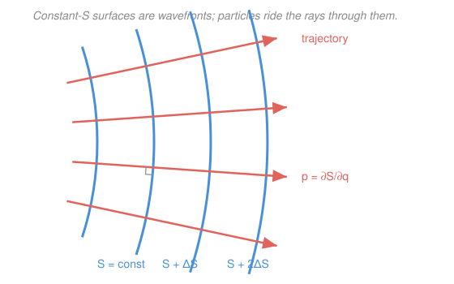

# Analytical Mechanics · Lesson 4.1: Hamilton–Jacobi theory

> ⏱ ~15 min · Module 4: Advanced formulations · Builds on: [3.4 Canonical transformations](#/lesson/analytical-mechanics/03-04-canonical-transformations.md), [3.1 The Legendre transform and Hamilton's equations](#/lesson/analytical-mechanics/03-01-legendre-hamiltons-equations.md) · Unlocks: 4.2 (action–angle variables)

## Why this matters

Every formulation so far hands you *differential equations to integrate*: Newton's, Lagrange's, Hamilton's. Hamilton–Jacobi theory does something stranger and more powerful — it trades the entire system of equations for a **single partial differential equation for one function**, $S$, and once you have $S$ the motion drops out by differentiation, no further integration required. That function is the **action**, viewed now as a field over configuration space. And it is the exact place classical mechanics touches quantum mechanics: $S$ is the phase of a wave, and Hamilton–Jacobi is the short-wavelength limit of the Schrödinger equation. This is the summit of the classical theory.

## The idea

Recall the payoff of a good canonical transformation ([3.4](#/lesson/analytical-mechanics/03-04-canonical-transformations.md)): if you can find coordinates in which the Hamiltonian is *simple*, the motion is trivial to read off. Hamilton–Jacobi pushes this to its logical extreme — **make the new Hamiltonian zero**.

Why would that help? Because if the new Hamiltonian $K \equiv 0$, then Hamilton's equations for the new variables read $\dot Q = \partial K/\partial P = 0$ and $\dot P = -\partial K/\partial Q = 0$: *every new coordinate and momentum is constant in time.* The whole dynamics has been absorbed into the transformation itself. All that's left is to find the generating function that performs it — and the equation it must satisfy is the Hamilton–Jacobi equation.

Think of it as a change of viewpoint. In the original $(q,p)$ the system races around; in the new frame it sits perfectly still. The generating function $S(q,P,t)$ is the dictionary between the racing frame and the frozen frame, and it packages *all* trajectories at once — like knowing the entire family of solutions before solving a single orbit.

## The formal version

Take a **type-2 generating function** $S(q,P,t)$ (a function of the old coordinates $q$ and the new momenta $P$; from [3.4](#/lesson/analytical-mechanics/03-04-canonical-transformations.md) its relations are)

$$p = \frac{\partial S}{\partial q}, \qquad Q = \frac{\partial S}{\partial P}, \qquad K = H + \frac{\partial S}{\partial t}.$$

In words: $S$ generates the transformation, and the new Hamiltonian $K$ is the old one plus $S$'s explicit time-rate. Now *demand* $K=0$. Substituting $p=\partial S/\partial q$ into $H$ gives

$$\boxed{\;H\!\left(q,\ \frac{\partial S}{\partial q},\ t\right) + \frac{\partial S}{\partial t} = 0\;}$$

the **Hamilton–Jacobi equation**: one first-order, generally nonlinear PDE for **Hamilton's principal function** $S(q,t)$. In words: replace every momentum in the Hamiltonian by a partial derivative of $S$, add $\partial S/\partial t$, set to zero. A **complete integral** — a solution carrying $n$ independent constants $\alpha_1,\dots,\alpha_n$ (these *are* the new constant momenta $P$) — is all you need. The constant new coordinates $Q_i=\partial S/\partial\alpha_i=\beta_i$ then give the trajectory $q(t)$ *algebraically*.

**Time-independent $H$ (separate off the time).** When $H$ has no explicit $t$, energy is conserved and time enters $S$ linearly:

$$S(q,\alpha,t) = W(q,\alpha) - E\,t,$$

where $E=\alpha_1$ is the energy. Plugging in kills the $t$-dependence and leaves the **time-independent Hamilton–Jacobi equation**

$$H\!\left(q,\ \frac{\partial W}{\partial q}\right) = E,$$

for **Hamilton's characteristic function** $W$. Since $p=\partial W/\partial q$, integrating recovers

$$W = \int p\,dq \qquad(\text{the \emph{abbreviated action}}),$$

the same $\int p\,dq$ that will define the action variables in [4.2](#/lesson/analytical-mechanics/04-02-action-angle-integrability.md).

**Separation of variables.** If the coordinates decouple, guess $W(q_1,\dots,q_n)=\sum_i W_i(q_i)$; the single PDE splits into $n$ ordinary integrals — the identical move you made for the heat and wave equations in [`ode-refresher` 4.2](#/lesson/ode-refresher/04-02-intro-pdes-separation.md), now applied in mechanics. Separability is exactly what makes a system solvable "by quadratures."

**The quantum bridge.** Write a wavefunction as $\psi \sim e^{iS/\hbar}$ and feed it to the Schrödinger equation; in the limit $\hbar\to 0$ the leading term is precisely $H(q,\partial S/\partial q)+\partial S/\partial t=0$. So Hamilton–Jacobi *is* the geometrical-optics (eikonal) limit of wave mechanics: classical trajectories are light rays, surfaces of constant $S$ are wavefronts, and $\hbar$ is the wavelength that has shrunk to nothing. This is where the course `quantum-mechanics` begins.

## Picture

Surfaces of constant $S$ tile configuration space like the crests of a wave. The relation $p=\partial S/\partial q$ says the momentum points *along the gradient* of $S$ — so trajectories run perpendicular to the wavefronts, exactly as light rays cross their wavefronts at right angles. Mechanics as geometrical optics.

## Worked examples

**Example 1 (the machinery, minimal — free particle in 1-D).** $H=p^2/2m$, no potential. The Hamilton–Jacobi equation is

$$\frac{1}{2m}\left(\frac{\partial S}{\partial x}\right)^2 + \frac{\partial S}{\partial t} = 0.$$

Since $H$ is time-independent, set $S=W(x)-Et$. Then $\tfrac{1}{2m}(W')^2=E\Rightarrow W'=\sqrt{2mE}$, a constant we may as well call the momentum $p$. So $W=\sqrt{2mE}\,x = px$ and

$$S = p\,x - \frac{p^2}{2m}\,t.$$

Now read off the motion. The new (constant) coordinate is $\beta=\partial S/\partial p = x - \frac{p}{m}t$, so

$$x(t) = \beta + \frac{p}{m}\,t = x_0 + v t.$$

Uniform motion, recovered without ever integrating an equation of motion — differentiation alone. That is the whole trick in miniature.

**Example 2 (why you'd care — the 1-D harmonic oscillator).** $H=\dfrac{p^2}{2m}+\dfrac12 kx^2$. With $S=W-Et$ the time-independent Hamilton–Jacobi equation is

$$\frac{1}{2m}\left(\frac{dW}{dx}\right)^2 + \frac12 kx^2 = E \quad\Longrightarrow\quad \frac{dW}{dx}=\sqrt{2m\!\left(E-\tfrac12 kx^2\right)}.$$

So the characteristic function is the abbreviated action

$$W(x)=\int \sqrt{2m\!\left(E-\tfrac12 kx^2\right)}\,dx .$$

Two facts fall straight out. The separation constant $E$ *is* the energy. And the integrand is real only where $E\ge\tfrac12kx^2$, i.e. between the **turning points** $x=\pm\sqrt{2E/k}$ — the classical particle is boxed inside them. We won't finish the integral here: closed over a full period it becomes the action $J=\oint p\,dx$, the star of [4.2](#/lesson/analytical-mechanics/04-02-action-angle-integrability.md). Notice we extracted the physics (energy, turning points, boundedness) *before* doing any hard integration.

## Watch out

- You might think $S$ is "the action from a fixed start point," a single number. In Hamilton–Jacobi it is a **function of the coordinates** $S(q,t)$ — a whole field whose level surfaces are wavefronts. The number and the field agree, but here you must think of the field.
- You might think you need the *general* solution of the PDE. You don't — a **complete integral** (any solution with $n$ independent constants, one per degree of freedom) is enough, and those constants become the conserved new momenta. Chasing the general solution is wasted effort.
- You might think $\partial S/\partial q$ means differentiate the known function $S$. In the PDE it is an *unknown* you solve for — the equation constrains what $S$ can be. Only *after* solving is $p=\partial S/\partial q$ a formula you evaluate.

## One-liner

> Find the generating function that freezes the motion, and it must satisfy $H(q,\partial S/\partial q,t)+\partial S/\partial t=0$ — one PDE for the action, whose wavefronts are the seed of quantum mechanics.

## Problems

**P1 (🟢)** For the free particle of Example 1, take instead $S = W(x)-Et$ and carry the energy $E$ (not $p$) as the constant. Write $W(x)$, then use $\partial S/\partial E=\text{const}$ to recover $x(t)$. Confirm you get uniform motion and that $\partial W/\partial x$ equals the momentum $\sqrt{2mE}$.

**P2 (🟡)** A particle of mass $m$ moves vertically in uniform gravity, $H=\dfrac{p^2}{2m}+mgz$. Write the time-independent Hamilton–Jacobi equation, solve it by quadrature for $W(z)$, and identify the turning height $z_\text{max}$ in terms of $E$.

**P3 (🔴, optional)** Continue P2 to the full motion. Using $S=W(z)-Et$ and $\partial S/\partial E=\beta=\text{const}$, reduce the problem to quadratures and solve for $z(t)$. Verify the acceleration is $-g$ and that $p=\partial W/\partial z$ reproduces $m\dot z$.

Solutions

**P1** Time-independent HJ: $\tfrac{1}{2m}(W')^2=E$, so $W'=\sqrt{2mE}$ and $W=\sqrt{2mE}\,x$. Then $S=\sqrt{2mE}\,x-Et$. The constant new coordinate is
$$\beta=\frac{\partial S}{\partial E}=\frac{\partial}{\partial E}\!\left(\sqrt{2mE}\,x\right)-t=\frac{m}{\sqrt{2mE}}\,x-t=\sqrt{\frac{m}{2E}}\,x-t.$$
Solve for $x$: $x=\sqrt{\tfrac{2E}{m}}\,(t+\beta)=v(t+\beta)$ with $v=\sqrt{2E/m}$ — uniform motion. And $\partial W/\partial x=\sqrt{2mE}=mv=p$. ✓ Same physics as Example 1, energy as the constant instead of momentum.

**P2** With $S=W-Et$ the equation is
$$\frac{1}{2m}\left(\frac{dW}{dz}\right)^2+mgz=E\quad\Longrightarrow\quad \frac{dW}{dz}=\sqrt{2m(E-mgz)},$$
$$W(z)=\int\sqrt{2m(E-mgz)}\,dz=-\frac{2\sqrt{2m}}{3mg}\,(E-mgz)^{3/2}.$$
The integrand is real only for $E\ge mgz$, so the particle cannot rise above $z_\text{max}=E/(mg)$ — the turning height, where all energy is potential. ✓ (Set $u=E-mgz$, $du=-mg\,dz$: $-\tfrac{\sqrt{2m}}{mg}\int u^{1/2}du=-\tfrac{\sqrt{2m}}{mg}\cdot\tfrac23 u^{3/2}$. ✓)

**P3** The constant new coordinate:
$$\beta=\frac{\partial S}{\partial E}=\frac{\partial W}{\partial E}-t.$$
Differentiate $W$ under the integral: $\dfrac{\partial W}{\partial E}=\displaystyle\int\frac{m\,dz}{\sqrt{2m(E-mgz)}}=-\frac{1}{g}\sqrt{\frac{2(E-mgz)}{m}}.$ Hence
$$t+\beta=\frac{1}{g}\sqrt{\frac{2(E-mgz)}{m}}.$$
Square and solve for $z$:
$$\frac{2(E-mgz)}{m}=g^2(t+\beta)^2\ \Longrightarrow\ z(t)=\frac{E}{mg}-\frac{g}{2}(t+\beta)^2=z_\text{max}-\tfrac12 g\,(t+\beta)^2.$$
So $\ddot z=-g$ ✓ (free fall from the turning height at $t=-\beta$; the $\pm$ branch of the square root is the ascending vs descending leg). Check the momentum: $p=\dfrac{\partial W}{\partial z}=\sqrt{2m(E-mgz)}$, and from $z(t)$, $\dot z=-g(t+\beta)$ so $m\dot z=-mg(t+\beta)=-\sqrt{m^2g^2(t+\beta)^2}=-\sqrt{2m(E-mgz)}$, matching $p$ up to the sign set by direction of travel. ✓

## Flashback

**From Lesson 3.1 (The Legendre transform and Hamilton's equations):** A particle of mass $m$ on a line has Lagrangian $L=\tfrac12 m\dot x^2-\tfrac14\lambda x^4$ (a quartic "anharmonic" potential, $\lambda>0$). Construct the Hamiltonian $H(x,p)$ via the Legendre transform and write Hamilton's equations. Do they reproduce Newton's law?

Solution

Conjugate momentum: $p=\partial L/\partial\dot x=m\dot x$, so $\dot x=p/m$. Legendre transform:
$$H=p\dot x-L=\frac{p^2}{m}-\left(\frac{p^2}{2m}-\frac14\lambda x^4\right)=\frac{p^2}{2m}+\frac14\lambda x^4.$$
(As expected, $H=T+V$ since the constraints are time-independent and $T$ is quadratic in velocities.) Hamilton's equations:
$$\dot x=\frac{\partial H}{\partial p}=\frac{p}{m},\qquad \dot p=-\frac{\partial H}{\partial x}=-\lambda x^3.$$
Combine: $m\ddot x=\dot p=-\lambda x^3$, i.e. $m\ddot x=-\lambda x^3$ — exactly Newton's law for the force $-dV/dx=-\lambda x^3$. ✓

## Connections

- **Backward:** this is [3.4](#/lesson/analytical-mechanics/03-04-canonical-transformations.md)'s generating-function machinery driven to its limit — instead of simplifying $K$, we annihilate it. The relations $p=\partial S/\partial q$, $Q=\partial S/\partial P$ are exactly the type-2 rules from that lesson, and $H$ itself came from the Legendre transform of [3.1](#/lesson/analytical-mechanics/03-01-legendre-hamiltons-equations.md).
- **Forward:** [4.2](#/lesson/analytical-mechanics/04-02-action-angle-integrability.md) takes the abbreviated action $W=\int p\,dq$ from here, closes the integral over a full period into the action variable $J=\oint p\,dq$, and reads periods straight off it — the payoff for the turning-point setup in Example 2 and P2.
- **Sideways (PDEs):** solving Hamilton–Jacobi by the ansatz $W=\sum_i W_i(q_i)$ is the same separation of variables that turned the heat and wave equations into ODEs in [`ode-refresher` 4.2](#/lesson/ode-refresher/04-02-intro-pdes-separation.md).
- **Sideways (quantum):** $\psi\sim e^{iS/\hbar}$ makes $S$ a phase and Hamilton–Jacobi the $\hbar\to 0$ eikonal limit of the Schrödinger equation — the doorway the `quantum-mechanics` course walks through, where wavefronts sharpen into rays and the Poisson bracket becomes the commutator.
