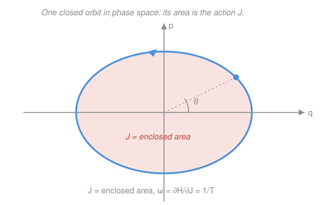

# Analytical Mechanics · Lesson 4.2: Action–angle variables and integrability

> ⏱ ~15 min · Module 4: Advanced formulations · Builds on: [4.1 Hamilton–Jacobi theory](#/lesson/analytical-mechanics/04-01-hamilton-jacobi.md) · Unlocks: 4.3 (small oscillations)

## Why this matters

For a periodic system you usually only want one number: the **frequency**. Solving the full equation of motion to extract it is overkill — like computing a whole trajectory to learn how long a lap takes. Action–angle variables give the frequency *directly*, from a single loop integral, without ever integrating the motion. They are also where classical mechanics hands the baton to quantum theory: the same loop integral $\oint p\,dq$, set equal to $nh$, is the rule that first quantized the atom, and the same "motion on a torus" picture is the backdrop for `quantum-mechanics` and for KAM stability.

## The idea

Take any 1-degree-of-freedom system that oscillates — a mass on a spring, a pendulum, a ball bouncing in a well. Fix the energy $E$. In the phase plane with axes $q$ (position) and $p$ (momentum), the motion traces a **closed loop**: the system returns to the same $(q,p)$ every period. Different energies give nested loops.

Here is the trick. Instead of labeling an orbit by its energy, label it by the **area it encloses**:

$$J = \oint p\,dq \quad(\text{area inside the loop}).$$

That area is a conserved number — the system rides its loop forever, and a loop doesn't change its own area. So $J$ behaves like a momentum that never moves. Its partner coordinate, the **angle** $\theta$, is just "how far around the loop you are." Because $J$ is fixed, the energy is a function of $J$ alone, $H = H(J)$, and Hamilton's equation for the angle is

$$\dot\theta = \frac{\partial H}{\partial J} = \omega(J) = \text{const}.$$

The angle sweeps around at a *constant rate* — the motion, however lopsided the loop looks, is uniform circulation once you use the right coordinate. And that constant rate **is the frequency**: $\omega = 1/T$. You get the period by differentiating $H(J)$, never by solving an ODE.

## The formal version

Start from Hamilton–Jacobi ([4.1](#/lesson/analytical-mechanics/04-01-hamilton-jacobi.md)): for a time-independent $H$, separate off time with Hamilton's characteristic function $W(q,E)$, where $p = \partial W/\partial q$ solves $H(q,\partial W/\partial q) = E$. For a bounded 1-DOF system, define the **action variable**

$$J = \oint p\,dq = \oint \frac{\partial W}{\partial q}\,dq,$$

the integral taken once around the closed orbit (a loop integral in the sense of [`calc-refresher` 2.1](#/lesson/calc-refresher/02-01-integral-as-accumulation.md), accumulating $p$ over one full circuit). **In words:** $J$ is the phase-space area the orbit bounds — and it is a *canonical momentum* that is conserved.

Because $J$ depends only on $E$, we can invert to get $H = H(J)$, and take $J$ as our new momentum. Its conjugate coordinate is the **angle variable**

$$\theta = \frac{\partial W}{\partial J},$$

normalized so that $\theta$ advances by exactly $1$ over one full orbit (Goldstein's convention). Hamilton's equations in $(\theta, J)$ read

$$\dot J = -\frac{\partial H}{\partial \theta} = 0, \qquad \dot\theta = \frac{\partial H}{\partial J} \equiv \omega(J).$$

**In words:** $J$ is constant (the Hamiltonian doesn't contain $\theta$), and $\theta$ grows linearly in time at rate $\omega$. Since $\theta$ increases by $1$ per period $T$, we have $\omega T = 1$, i.e.

$$\boxed{\;\omega = \frac{\partial H}{\partial J} = \frac{1}{T}\;}$$

— **the frequency read straight off $H(J)$.** This is the entire payoff: a coordinate change $(q,p)\to(\theta,J)$ that turns the Hamiltonian into a "free rotor" in which nothing needs to be solved.

**Integrable systems (Liouville–Arnold).** For $n$ degrees of freedom, suppose there exist $n$ independent conserved quantities $F_1,\dots,F_n$ that are *in involution* — pairwise Poisson-commuting, $\{F_i,F_j\}=0$ (the bracket from [3.3](#/lesson/analytical-mechanics/03-03-poisson-brackets.md)). Then the system is **integrable**: the level set $F_i = c_i$ is an $n$-dimensional torus, and there exist action–angle variables $(\theta_i, J_i)$ in which

$$H = H(J_1,\dots,J_n), \qquad \dot\theta_i = \omega_i(J) = \text{const}.$$

**In words:** the motion is winding uniformly around an $n$-torus with $n$ constant frequencies — **quasi-periodic**. If the $\omega_i$ are rationally related the orbit closes; if not, it fills the torus densely, but it never leaves it. Most systems are *not* integrable; integrability is the special, solvable case.

**Adiabatic invariance.** If a parameter of the system (spring stiffness, pendulum length) is changed *slowly* — slowly meaning over many periods — then $J$ stays approximately constant even though $E$ and the orbit shape drift:

$$J \approx \text{const under slow change} \quad(\text{an } \textbf{adiabatic invariant}).$$

**In words:** the area of the orbit is robust; you can deform the loop by slowly turning a knob and it keeps the same enclosed area. This is what lets you predict the pendulum-with-shrinking-string without solving a time-dependent problem (Problem 3).

**The historical bridge.** Before Schrödinger, Bohr and Sommerfeld quantized atoms by allowing only orbits whose action is an integer multiple of Planck's constant:

$$\oint p\,dq = n h, \qquad n = 1,2,3,\dots$$

This "old quantum theory" gets the hydrogen levels and the box (Problem 2) exactly right, and it is no accident: $J$ is the natural thing to quantize because it is the adiabatic invariant — the quantity a slow change *can't* alter, hence a good quantum number. The modern story lives in `quantum-mechanics`.

## Picture

## Worked examples

**Example 1 (the action is an area — harmonic oscillator).** For $H = \frac{p^2}{2m} + \frac12 m\omega_0^2 q^2 = E$, the orbit $\frac{p^2}{2mE} + \frac{q^2}{2E/(m\omega_0^2)} = 1$ is an ellipse with semi-axes $\sqrt{2mE}$ (in $p$) and $\sqrt{2E/(m\omega_0^2)}$ (in $q$). Its area:

$$J = \oint p\,dq = \pi\sqrt{2mE}\,\sqrt{\tfrac{2E}{m\omega_0^2}} = \frac{2\pi E}{\omega_0}.$$

Invert: $H = E = \dfrac{\omega_0}{2\pi}J$. So $\omega = \dfrac{\partial H}{\partial J} = \dfrac{\omega_0}{2\pi}$, giving period $T = 1/\omega = 2\pi/\omega_0$ — the textbook answer, with **no differential equation solved and no dependence on amplitude**. (Problem 1 walks this through.)

**Example 2 (why you'd care — the frequency's amplitude dependence for free).** Suppose $H(J) = \alpha J^{3/2}$ for some constant $\alpha$ (this is the shape you get for a $V\propto q^4$ well). Then $\omega(J) = \frac{\partial H}{\partial J} = \frac32\alpha J^{1/2}$. Larger orbits (bigger $J$, bigger amplitude) oscillate *faster*. We learned that the oscillator is anharmonic — its frequency depends on amplitude — and by exactly how much, without touching the equation of motion. Reading $\omega(J)$ off $H(J)$ is how you diagnose anharmonicity in a single line.

## Watch out

- **The $2\pi$ trap.** With $J = \oint p\,dq$, the angle $\theta$ advances by $1$ per orbit (not $2\pi$), so $\omega = \partial H/\partial J$ is the frequency $1/T$ **in cycles per unit time** — not the angular frequency. For the oscillator that means $\omega = \omega_0/2\pi$, *not* $\omega_0$. (Some texts instead define $I = \frac{1}{2\pi}\oint p\,dq$ and get the angular frequency; pick one convention and hold it.)
- **$J$ is not the energy.** $J$ is an *area*, $E$ is a *height* of the Hamiltonian; they coincide only after you compute $H(J)$. Don't write $\partial H/\partial E$.
- **Adiabatic ≠ instant.** $J$ is invariant only under *slow* change (many periods per unit of parameter change). Yank the string suddenly and $J$ jumps; the theorem says nothing about fast changes.
- **Integrability is rare.** Having *one* conserved quantity per DOF is not enough — they must Poisson-commute *and* be independent. Generic Hamiltonians have no such full set and are not integrable.

## One-liner

> Label an orbit by the area it encloses, $J=\oint p\,dq$; then the Hamiltonian forgets everything but $J$, and the frequency falls out as $\omega = \partial H/\partial J = 1/T$ — no motion solved.

## Problems

**P1 (🟢)** For the harmonic oscillator $H = \frac{p^2}{2m} + \frac12 m\omega_0^2 q^2 = E$, compute $J = \oint p\,dq$ directly (as the ellipse's area), invert to get $H(J)$, and read off $\dot\theta = \partial H/\partial J$. Confirm the period is amplitude-independent and equals $2\pi/\omega_0$.

**P2 (🟡)** A particle of mass $m$ bounces elastically between two rigid walls a distance $L$ apart (a 1-D box); inside, $V=0$. (a) Sketch the phase orbit at energy $E$ and compute $J = \oint p\,dq$. (b) Invert to get $E(J)$ and the frequency $\omega = \partial E/\partial J$; check it against the elementary round-trip period. (c) Impose Bohr–Sommerfeld $J = nh$ to get the "quantized" energies $E_n$, and compare with the quantum infinite-square-well levels $E_n = n^2\pi^2\hbar^2/(2mL^2)$.

**P3 (🔴)** A pendulum swings with small amplitude; its string is *slowly* shortened from length $\ell$ to $\ell/2$ (slowly = over many swings). Treat the small-oscillation motion as a harmonic oscillator with $\omega_0 = \sqrt{g/\ell}$ and use $J = 2\pi E/\omega_0 \approx$ const. (a) How does the energy $E$ scale with $\ell$, and by what factor does it change? (b) How does the **angular** amplitude $\theta_0$ scale with $\ell$, and by what factor does it change? (Use $E = \frac12 mg\ell\,\theta_0^2$ for the small-oscillation energy.)

Solutions

**P1** Solve the energy relation for $p$: $p = \pm\sqrt{2mE - m^2\omega_0^2 q^2}$. The orbit is an ellipse; in $(q,p)$ its semi-axis along $q$ is $a = \sqrt{2E/(m\omega_0^2)}$ (where $p=0$) and along $p$ is $b = \sqrt{2mE}$ (where $q=0$). The action is the enclosed area:

$$J = \oint p\,dq = \pi a b = \pi\sqrt{\frac{2E}{m\omega_0^2}}\sqrt{2mE} = \pi\cdot\frac{2E}{\omega_0} = \frac{2\pi E}{\omega_0}.$$

Invert: $E = H = \dfrac{\omega_0}{2\pi}\,J$, which is linear in $J$. Hence

$$\dot\theta = \frac{\partial H}{\partial J} = \frac{\omega_0}{2\pi} = \omega, \qquad T = \frac1\omega = \frac{2\pi}{\omega_0}.$$

Nothing here mentions $E$ or amplitude, so the period is amplitude-independent. **Check:** the harmonic oscillator's known period is $2\pi/\omega_0$. ✓

**P2** (a) With $V=0$ inside, $E = p^2/2m$, so $|p| = \sqrt{2mE}$ is constant; the sign flips at each wall. The phase orbit is a **rectangle**: $q$ runs $0\to L$ at $p = +\sqrt{2mE}$ (rightward leg), then $L\to0$ at $p=-\sqrt{2mE}$ (leftward leg). Its area is base $\times$ height $= L\times 2\sqrt{2mE}$:

$$J = \oint p\,dq = 2L\sqrt{2mE}.$$

(b) Invert: $\sqrt{2mE} = J/(2L)\Rightarrow E(J) = \dfrac{J^2}{8mL^2}$. Then

$$\omega = \frac{\partial E}{\partial J} = \frac{J}{4mL^2} = \frac{2L\sqrt{2mE}}{4mL^2} = \frac{\sqrt{2E/m}}{2L}.$$

**Check** against elementary mechanics: speed $v = \sqrt{2E/m}$, round-trip distance $2L$, so $T = 2L/v$ and $1/T = v/(2L) = \sqrt{2E/m}/(2L)$. ✓ Matches $\omega$.

(c) Bohr–Sommerfeld $J = nh$: $2L\sqrt{2mE_n} = nh \Rightarrow 2mE_n = \dfrac{n^2 h^2}{4L^2}\Rightarrow E_n = \dfrac{n^2 h^2}{8mL^2}$. Using $h = 2\pi\hbar$, $h^2 = 4\pi^2\hbar^2$:

$$E_n = \frac{n^2\cdot 4\pi^2\hbar^2}{8mL^2} = \frac{n^2\pi^2\hbar^2}{2mL^2}.$$

**Check:** this is *exactly* the quantum infinite-square-well spectrum. ✓ (The box is one of the cases where the old quantum theory is not merely close but exact.)

**P3** From the oscillator result, $J = 2\pi E/\omega_0$ with $\omega_0 = \sqrt{g/\ell}$. Adiabatic invariance holds $J$ fixed, so

$$E = \frac{\omega_0}{2\pi}J \propto \omega_0 \propto \ell^{-1/2}.$$

(a) $E \propto \ell^{-1/2}$. Halving the length ($\ell\to\ell/2$) multiplies $E$ by $(1/2)^{-1/2} = \sqrt2 \approx 1.41$: the **energy grows by $\sqrt2$** (the hand shortening the string does that work).

(b) From $E = \frac12 mg\ell\,\theta_0^2$, $\theta_0 = \sqrt{2E/(mg\ell)} \propto \sqrt{E/\ell} \propto \sqrt{\ell^{-1/2}/\ell} = \ell^{-3/4}$. Halving the length multiplies $\theta_0$ by $(1/2)^{-3/4} = 2^{3/4}\approx 1.68$: the **angular amplitude grows by $2^{3/4}$**.

**Check:** these are the classic Landau results $E\propto\ell^{-1/2}$, $\theta_0\propto\ell^{-3/4}$; consistency test — plug back: $J = 2\pi E/\omega_0 \propto \ell^{-1/2}/\ell^{-1/2} = \text{const}$. ✓ (Sanity note: the *arc* amplitude $a=\ell\theta_0\propto\ell^{1/4}$ actually shrinks slightly, $\to 2^{-1/4}a$, while the angle opens up — the bob swings through a wider angle over a shorter arc.)

## Flashback

**From Lesson 4.1 (Hamilton–Jacobi theory):** A particle of mass $m$ falls under uniform gravity, $H = \dfrac{p^2}{2m} + mgq = E$ (with $q$ measured upward). Using the time-independent Hamilton–Jacobi equation, find Hamilton's characteristic function $W(q,E)$, then obtain the trajectory $q(t)$ from $\partial W/\partial E = t - t_0$.

Solution

The time-independent HJ equation is $H(q, \partial W/\partial q) = E$, i.e. $\dfrac{1}{2m}\left(\dfrac{\partial W}{\partial q}\right)^2 + mgq = E$. Solve for the derivative:

$$\frac{\partial W}{\partial q} = \sqrt{2m(E - mgq)} \quad\Rightarrow\quad W = \int \sqrt{2m(E-mgq)}\,dq = -\frac{2\sqrt{2m}}{3mg}\,(E - mgq)^{3/2}.$$

The trajectory comes from the transformation rule $\dfrac{\partial W}{\partial E} = t - t_0$:

$$\frac{\partial W}{\partial E} = -\frac{2\sqrt{2m}}{3mg}\cdot\frac{3}{2}(E-mgq)^{1/2} = -\frac{\sqrt{2m}}{mg}\sqrt{E-mgq} = t - t_0.$$

Square and solve for $q$: $E - mgq = \dfrac{m g^2}{2}(t-t_0)^2$, so

$$q(t) = \frac{E}{mg} - \frac{g}{2}(t-t_0)^2.$$

**Check:** $\ddot q = -g$ — the correct equation of free fall, and $q$ peaks at height $E/mg$ (all energy potential) at $t=t_0$. ✓

## Connections

- **Backward:** this is Hamilton–Jacobi ([4.1](#/lesson/analytical-mechanics/04-01-hamilton-jacobi.md)) specialized to bounded motion — $W$ supplies $p(q,E)$, and $J=\oint p\,dq$ packages it into a conserved momentum. The change to $(\theta,J)$ is a **canonical transformation** ([3.4](#/lesson/analytical-mechanics/03-04-canonical-transformations.md)) with $W$ (really $W-\theta J$) as its generating function; $\{θ,J\}=1$ by construction.
- **Forward:** [4.3 (small oscillations)](#/lesson/analytical-mechanics/04-03-small-oscillations.md) is the multi-DOF harmonic case — each normal mode is its own action–angle pair $(\theta_i,J_i)$, and the mode frequencies are the $\omega_i = \partial H/\partial J_i$ of an integrable system.
- **Sideways (quantum):** $\oint p\,dq = nh$ is the Bohr–Sommerfeld rule; the $J$-as-adiabatic-invariant argument is *why* it is the right thing to quantize. The action-on-a-torus picture reappears as WKB and semiclassical quantization in `quantum-mechanics`.
