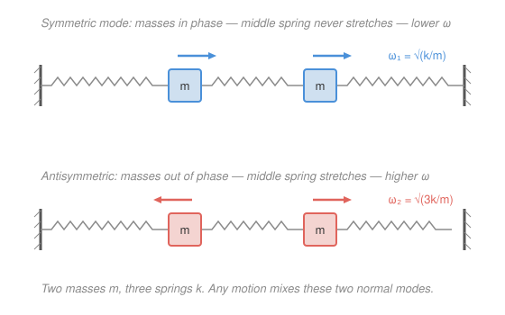

# Analytical Mechanics · Lesson 4.3: Small oscillations and normal modes

> ⏱ ~15 min · Module 4: Advanced formulations · Builds on: [1.4 Applications of the Lagrangian formalism](#/lesson/analytical-mechanics/01-04-lagrangian-applications.md), [`linalg-refresher` 5.1](#/lesson/linalg-refresher/05-01-spectral-theorem-quadratic-forms.md) · Unlocks: 4.4 (rigid-body dynamics)

## Why this matters

Almost every stable system, nudged gently, rings. A molecule's infrared spectrum, a bridge's sway, a crystal's phonons, an electrical LC ladder, two planets locked in resonance — all are the *same* problem: a system sitting in a potential well, oscillating in a handful of characteristic patterns at characteristic frequencies. The miracle is that no matter how tangled the coupling looks, a stable system near equilibrium always breaks into **independent** oscillators — the **normal modes**. Finding them turns a mess of coupled differential equations into an eigenvalue problem you already know how to solve. This lesson is also Boss problem 4, and the template for lattice dynamics in solid-state and for the mode expansion of a quantum field.

## The idea

Picture a marble resting at the bottom of a bowl. Push it a little and it rolls back; the restoring push, for small displacements, is *linear* in how far you moved it — that's just the first nonzero term of any smooth well. One marble in one bowl is a simple harmonic oscillator. Now imagine several marbles connected by springs, each in its own bowl: push one and they all start sloshing, trading energy back and forth in a complicated way.

The key insight: even though the individual marbles are coupled, there exist special **collective patterns of motion** in which *every* coordinate oscillates at the *same single frequency, in lockstep*. In such a pattern the whole system moves like one giant simple harmonic oscillator. These are the normal modes. Two masses on springs, for instance, have exactly two: one where they slide together (in phase) and one where they slide apart (out of phase). Any motion whatsoever — however messy — is just a superposition of these clean patterns, each humming along at its own frequency. Diagonalizing the coupling is the whole game, and it is *literally* the spectral theorem from [`linalg` 5.1](#/lesson/linalg-refresher/05-01-spectral-theorem-quadratic-forms.md) wearing a physicist's coat.

## The formal version

Take a system with generalized coordinates $\mathbf q = (q_1,\dots,q_n)$ and a Lagrangian $L = T - V$. Suppose $\mathbf q = \mathbf q_0$ is a **stable equilibrium**: $\nabla V(\mathbf q_0) = 0$ and $V$ is a minimum there. Measure displacements from it, $\boldsymbol\eta = \mathbf q - \mathbf q_0$, and expand to **quadratic order** (the lowest order that produces motion).

**The potential.** Taylor-expand $V$. The constant is irrelevant, the linear term vanishes (equilibrium!), so the leading term is the quadratic one:

$$V(\mathbf q) \approx V(\mathbf q_0) + \tfrac12 \boldsymbol\eta^\top K \boldsymbol\eta, \qquad K_{ij} = \left.\frac{\partial^2 V}{\partial q_i\,\partial q_j}\right|_{\mathbf q_0}.$$

In words: near a minimum every potential looks like a quadratic bowl, and $K$ — the **stiffness matrix** — is its Hessian, a symmetric matrix of "spring constants." Stability means $K$ is positive (semi-)definite.

**The kinetic energy.** For natural systems $T = \tfrac12 \dot{\mathbf q}^\top M(\mathbf q)\,\dot{\mathbf q}$; evaluate the coefficient at equilibrium to leading order:

$$T \approx \tfrac12\,\dot{\boldsymbol\eta}^\top M\,\dot{\boldsymbol\eta}, \qquad M_{ij} = M_{ij}(\mathbf q_0).$$

In words: $M$ — the **mass matrix** — is a constant, symmetric, positive-definite matrix of "generalized masses," read off from $T$. Putting the pieces together,

$$L \approx \tfrac12\,\dot{\boldsymbol\eta}^\top M\,\dot{\boldsymbol\eta} - \tfrac12\,\boldsymbol\eta^\top K\,\boldsymbol\eta.$$

**The equations of motion.** The Euler–Lagrange equations of this quadratic $L$ are linear:

$$M\ddot{\boldsymbol\eta} + K\boldsymbol\eta = \mathbf 0.$$

In words: a matrix version of $m\ddot x = -kx$ — the multidimensional harmonic oscillator.

**Seeking a mode.** Try a solution where *every* coordinate oscillates at one frequency $\omega$ in a fixed pattern $\mathbf a$: $\boldsymbol\eta(t) = \mathbf a\, e^{i\omega t}$ (physical motion is the real part; $\mathbf a$ is a real vector of relative amplitudes). Then $\ddot{\boldsymbol\eta} = -\omega^2\boldsymbol\eta$, and the EOM becomes the **generalized eigenvalue problem**

$$\boxed{\,(K - \omega^2 M)\,\mathbf a = \mathbf 0\,.}$$

A nonzero $\mathbf a$ exists only when the matrix is singular:

$$\det(K - \omega^2 M) = 0.$$

In words: this polynomial in $\omega^2$ (the **characteristic equation**) has $n$ roots $\omega_1^2,\dots,\omega_n^2$ — the **normal-mode frequencies** — and each root's null vector $\mathbf a_i$ is the **mode shape** telling you how the coordinates move relative to one another.

**Why the modes decouple.** Because $M$ and $K$ are real symmetric with $M$ positive definite, they can be **simultaneously diagonalized**: the mode shapes are $M$-orthogonal, $\mathbf a_i^\top M\,\mathbf a_j = 0$ for $i\neq j$, and they also diagonalize $K$. Define **normal coordinates** $\xi_i(t)$ by $\boldsymbol\eta(t) = \sum_i \mathbf a_i\,\xi_i(t)$. In these coordinates the Lagrangian separates completely,

$$L = \tfrac12\sum_i \big(\dot\xi_i^2 - \omega_i^2\,\xi_i^2\big) \;\Longrightarrow\; \ddot\xi_i + \omega_i^2\,\xi_i = 0,$$

so each $\xi_i$ is an *independent* simple harmonic oscillator ([`mechanics` 3.1](#/lesson/mechanics-refresher/03-01-simple-harmonic-motion.md)). This is the generalized spectral theorem of [`linalg` 5.1](#/lesson/linalg-refresher/05-01-spectral-theorem-quadratic-forms.md) applied to the pair of quadratic forms $T$ and $V$. Reality of the $\omega_i^2$ is guaranteed by symmetry; **stability** is the extra statement that all $\omega_i^2 > 0$ (a negative $\omega^2$ gives imaginary $\omega$ and runaway growth — you were at a saddle, not a well). The **general motion** is the superposition

$$\boldsymbol\eta(t) = \sum_{i=1}^n \mathbf a_i\big(A_i\cos\omega_i t + B_i\sin\omega_i t\big),$$

with $2n$ constants $A_i, B_i$ fixed by initial conditions — exactly the right count for $n$ second-order equations.

## Picture

## Worked examples

**Example 1 (the recipe in three lines — two masses, two springs, one wall).** A mass $m$ hangs from a spring $k$ fixed to the ceiling; a second $m$ hangs from it by another spring $k$. Let $\eta_1,\eta_2$ be vertical displacements from equilibrium (gravity only *shifts* the equilibrium, it drops out of the quadratic expansion). Kinetic energy $T = \tfrac12 m\dot\eta_1^2 + \tfrac12 m\dot\eta_2^2$ gives $M = m\,\mathbb 1$. The potential is $V = \tfrac12 k\eta_1^2 + \tfrac12 k(\eta_2-\eta_1)^2$, so

$$K = k\begin{pmatrix} 2 & -1 \\ -1 & 1\end{pmatrix}.$$

Then $\det(K-\omega^2 M) = 0$ reads $(2k-\omega^2 m)(k-\omega^2 m) - k^2 = 0$, i.e. $m^2\omega^4 - 3km\,\omega^2 + k^2 = 0$, giving $\omega^2 = \tfrac{k}{m}\cdot\tfrac{3\pm\sqrt5}{2}$. The lower frequency's mode has both masses moving the same way (a gentle sag), the higher has them opposed. Three lines from Lagrangian to spectrum — that is the entire method.

**Example 2 (why you'd care — a diatomic molecule's one line).** Two atoms of masses $m_1,m_2$ joined by a bond of stiffness $k$, free in one dimension. Coordinates $x_1,x_2$: $M = \mathrm{diag}(m_1,m_2)$, and $V = \tfrac12 k(x_2-x_1)^2$ gives $K = k\begin{pmatrix}1 & -1\\ -1 & 1\end{pmatrix}$. Since $\det K = 0$, one root is $\omega^2 = 0$ with mode $\mathbf a = (1,1)$: the molecule just **translates** — no restoring force, no oscillation (a rigid-body zero mode). The other root, from $\mathbf a^\top M\mathbf a$-orthogonality forcing $m_1 x_1 + m_2 x_2 = 0$, is the **vibration** at

$$\omega^2 = k\left(\frac1{m_1}+\frac1{m_2}\right) = \frac{k}{\mu},\qquad \mu = \frac{m_1 m_2}{m_1+m_2},$$

the reduced-mass frequency you meet in spectroscopy. The zero mode is the lesson's fine print made physical: a *neutral* direction (translation, rotation) always shows up as $\omega = 0$, because $V$ is flat along it.

## Watch out

- You might think you can just diagonalize $K$ by itself. You can't, unless $M \propto \mathbb 1$: the correct object is the **generalized** eigenproblem $(K-\omega^2 M)\mathbf a = 0$, and the modes are **$M$-orthogonal**, $\mathbf a_i^\top M\mathbf a_j = 0$ — not orthogonal in the ordinary dot product. Diagonalizing $M^{-1}K$ (which is generally *not* symmetric) gives the right frequencies but you must weight inner products by $M$.
- You might think any equilibrium works. Only a **stable** one (a minimum of $V$) gives real, positive $\omega^2$. Expand about a maximum or saddle and some $\omega^2 < 0$: those "modes" grow like $e^{|\omega|t}$ — the linearization is telling you the equilibrium is unstable, not that it oscillates.
- You might read the mode shape $\mathbf a$ as an absolute displacement. It only fixes the **ratios** and relative signs of the coordinates (and is defined up to overall scale — pin it down with $\mathbf a_i^\top M\mathbf a_i = 1$). Same sign = in phase; opposite sign = half a period out of phase.
- Don't forget to locate $\mathbf q_0$ *first*. The linear term in $V$ vanishes only at equilibrium; skip that step and you get spurious constant forces and a wrong $K$.

## One-liner

> Near any stable equilibrium, mechanics becomes $M\ddot{\boldsymbol\eta}+K\boldsymbol\eta=0$, and $\det(K-\omega^2 M)=0$ shatters the coupled mess into independent oscillators — the normal modes.

## Problems

**P1 (🟢)** Two equal masses $m$ sit on a frictionless line between two walls, connected in series by three identical springs of constant $k$ (wall–$m$–$m$–wall). Let $x_1,x_2$ be their displacements from equilibrium. Form $M$ and $K$, solve $\det(K-\omega^2 M)=0$, and give both frequencies and mode shapes. (This is the figure above.)

**P2 (🟡)** Two identical pendula (each mass $m$, length $\ell$) hang side by side in gravity $g$ and are joined at the bobs by a weak spring of constant $k$. Using small angles $\theta_1,\theta_2$, find the two normal-mode frequencies and their shapes, and explain the **beating** you see when you displace only one pendulum and release.

**P3 (🔴, optional)** A linear triatomic molecule (CO₂-like): masses $m,\,M,\,m$ in a row, adjacent pairs joined by identical springs $k$, all motion along the axis. With displacements $x_1,x_2,x_3$, set up $M$ and $K$, solve the generalized eigenproblem, and identify the zero-frequency mode and the two vibrational modes. Verify each $(K-\omega^2 M)\mathbf a = 0$ and check the three modes are mutually $M$-orthogonal.

Solutions

**P1** Kinetic energy $T=\tfrac12 m\dot x_1^2+\tfrac12 m\dot x_2^2 \Rightarrow M = m\begin{pmatrix}1&0\\0&1\end{pmatrix}$. The three springs store $V = \tfrac12 k x_1^2 + \tfrac12 k(x_2-x_1)^2 + \tfrac12 k x_2^2 = \tfrac12 k\big(2x_1^2 - 2x_1x_2 + 2x_2^2\big)$, so

$$K = k\begin{pmatrix} 2 & -1\\ -1 & 2\end{pmatrix}.$$

Then $\det(K-\omega^2 M) = (2k-\omega^2 m)^2 - k^2 = 0 \Rightarrow 2k-\omega^2 m = \pm k$, hence

$$\omega_1^2 = \frac{k}{m},\qquad \omega_2^2 = \frac{3k}{m}.$$

*Mode 1* ($\omega_1^2=k/m$): $K-\omega_1^2 M = k\begin{pmatrix}1&-1\\-1&1\end{pmatrix}$, whose null vector is $\mathbf a_1 = (1,1)$ — the **symmetric** mode: both masses slide together, the middle spring never stretches, so it feels only the two outer springs → lower frequency. *Mode 2* ($\omega_2^2=3k/m$): $K-\omega_2^2 M = k\begin{pmatrix}-1&-1\\-1&-1\end{pmatrix}$, null vector $\mathbf a_2 = (1,-1)$ — the **antisymmetric** mode: masses move oppositely, the middle spring gets stretched/compressed hardest → higher frequency. Check $M$-orthogonality: $\mathbf a_1^\top M\mathbf a_2 = m(1\cdot1 + 1\cdot(-1)) = 0$. ✓ And $(K-\omega_1^2M)\mathbf a_1 = k\begin{pmatrix}1&-1\\-1&1\end{pmatrix}\begin{pmatrix}1\\1\end{pmatrix}=\mathbf 0$. ✓

**P2** Each bob's horizontal displacement is $\approx \ell\theta_i$. Kinetic energy $T = \tfrac12 m\ell^2\dot\theta_1^2 + \tfrac12 m\ell^2\dot\theta_2^2 \Rightarrow M = m\ell^2\,\mathbb 1$. Potential: gravity gives $\tfrac12 mg\ell\,\theta_i^2$ each (from $mg\ell(1-\cos\theta)\approx\tfrac12 mg\ell\theta^2$); the spring stores $\tfrac12 k\,[\ell(\theta_2-\theta_1)]^2$. So

$$V = \tfrac12 mg\ell(\theta_1^2+\theta_2^2) + \tfrac12 k\ell^2(\theta_2-\theta_1)^2,\qquad K = \begin{pmatrix} mg\ell + k\ell^2 & -k\ell^2\\ -k\ell^2 & mg\ell + k\ell^2\end{pmatrix}.$$

$\det(K-\omega^2 M)=0$: $(mg\ell + k\ell^2 - \omega^2 m\ell^2)^2 - (k\ell^2)^2 = 0 \Rightarrow mg\ell + k\ell^2 - \omega^2 m\ell^2 = \pm k\ell^2$. Taking $+$: $\omega_1^2 = g/\ell$, mode $\mathbf a_1=(1,1)$ — both swing together, spring stays at natural length, so it's just a plain pendulum. Taking $-$: $\omega_2^2 = \dfrac{g}{\ell} + \dfrac{2k}{m}$, mode $\mathbf a_2=(1,-1)$ — they swing oppositely, stretching the spring, so it's stiffer and faster.

*Beating:* releasing pendulum 1 alone means exciting **both** modes with equal weight, $\theta_1 = \tfrac12(\cos\omega_1 t + \cos\omega_2 t)\,\theta_0$ and $\theta_2 = \tfrac12(\cos\omega_1 t - \cos\omega_2 t)\,\theta_0$. Product-to-sum gives $\theta_1 = \theta_0\cos\!\big(\tfrac{\omega_2-\omega_1}{2}t\big)\cos\!\big(\tfrac{\omega_2+\omega_1}{2}t\big)$ and $\theta_2 = \theta_0\sin\!\big(\tfrac{\omega_2-\omega_1}{2}t\big)\sin\!\big(\tfrac{\omega_2+\omega_1}{2}t\big)$: each pendulum oscillates fast at $\tfrac{\omega_1+\omega_2}{2}$ inside a slow envelope at $\tfrac{\omega_2-\omega_1}{2}$. The two envelopes are $90^\circ$ apart, so energy sloshes completely from one pendulum to the other and back — the **beats**. For weak coupling, $\omega_2 - \omega_1 \approx \dfrac{k}{m\omega_0}$ with $\omega_0=\sqrt{g/\ell}$, so the beat period $\sim 2\pi m\omega_0/k$ is *long*: weak spring ⇒ slow energy transfer. Check $M$-orthogonality: $\mathbf a_1^\top M\mathbf a_2 = m\ell^2(1-1)=0$. ✓

**P3** $T = \tfrac12 m\dot x_1^2 + \tfrac12 M\dot x_2^2 + \tfrac12 m\dot x_3^2 \Rightarrow M_{\text{mat}} = \mathrm{diag}(m, M, m)$. Potential $V = \tfrac12 k(x_2-x_1)^2 + \tfrac12 k(x_3-x_2)^2$ gives

$$K = k\begin{pmatrix} 1 & -1 & 0\\ -1 & 2 & -1\\ 0 & -1 & 1\end{pmatrix}.$$

Write $\lambda = \omega^2$. Expanding $\det(K-\lambda M_{\text{mat}})$ along the first row and factoring:

$$\det(K-\lambda M_{\text{mat}}) = (k-\lambda m)\,\big[\lambda M m - k(2m+M)\big]\,\lambda / 1 = 0$$

— concretely $\det = \lambda\,(k-\lambda m)\big[\lambda Mm - k(2m+M)\big] = 0$, giving three roots:

$$\omega_0^2 = 0,\qquad \omega_1^2 = \frac{k}{m},\qquad \omega_2^2 = \frac{k(2m+M)}{Mm} = k\Big(\frac2M + \frac1m\Big).$$

*Zero mode* ($\omega_0=0$): $K\mathbf a = 0$ needs the rows (which each sum to zero) to annihilate $\mathbf a$, giving $\mathbf a_0 = (1,1,1)$ — **uniform translation** of the whole molecule, no restoring force. *Mode 1* ($\omega_1^2=k/m$): first row $(k-\lambda m)x_1 - kx_2 = 0$ with $k-\lambda m = 0$ forces $x_2 = 0$; symmetry then gives $x_3=-x_1$, so $\mathbf a_1 = (1, 0, -1)$ — the **symmetric stretch**: outer atoms move oppositely, the central atom stays put. *Mode 2* ($\omega_2^2$): the first row gives $x_2 = \dfrac{k-\lambda m}{k}x_1 = -\dfrac{2m}{M}x_1$, so $\mathbf a_2 = \big(1, -\tfrac{2m}{M}, 1\big)$ — the **antisymmetric stretch**: both outer atoms move one way, the center recoils the other, keeping momentum zero.

*Verification.* Take mode 2: $(K-\omega_2^2 M_{\text{mat}})\mathbf a_2$, row 1 $= (k-\omega_2^2 m)\cdot 1 - k\cdot(-\tfrac{2m}{M}) = -\tfrac{2mk}{M} + \tfrac{2mk}{M} = 0$. ✓ ($M$-orthogonality) $\mathbf a_0^\top M_{\text{mat}}\mathbf a_1 = m(1)(1) + M(1)(0) + m(1)(-1) = 0$; $\mathbf a_0^\top M_{\text{mat}}\mathbf a_2 = m + M(-\tfrac{2m}{M}) + m = 2m - 2m = 0$; $\mathbf a_1^\top M_{\text{mat}}\mathbf a_2 = m(1)(1) + 0 + m(-1)(1) = 0$. ✓ All three modes are mutually $M$-orthogonal, as the spectral theorem promised. (The two vibrations are the symmetric and antisymmetric stretches of CO₂; the bending modes need the transverse directions, which this 1-D model omits.)

## Flashback

**From Lesson 1.4 (Applications of the Lagrangian formalism):** A pendulum (bob mass $m$, massless rod length $\ell$) hangs from a support block of mass $M$ that slides without friction along a horizontal rail. With $X$ the block's position and $\theta$ the rod's angle from vertical, write the Lagrangian and derive both equations of motion. Which coordinate is cyclic, and what does its conserved momentum mean physically?

Solution

The bob sits at $x_b = X + \ell\sin\theta,\; y_b = -\ell\cos\theta$, with velocities $\dot x_b = \dot X + \ell\cos\theta\,\dot\theta,\; \dot y_b = \ell\sin\theta\,\dot\theta$. Kinetic energy:

$$T = \tfrac12 M\dot X^2 + \tfrac12 m\big(\dot X^2 + 2\ell\cos\theta\,\dot X\dot\theta + \ell^2\dot\theta^2\big),\qquad V = -mg\ell\cos\theta.$$

$$L = \tfrac12(M+m)\dot X^2 + m\ell\cos\theta\,\dot X\dot\theta + \tfrac12 m\ell^2\dot\theta^2 + mg\ell\cos\theta.$$

$X$ is **cyclic** ($\partial L/\partial X = 0$), so its conjugate momentum is conserved:

$$p_X = \frac{\partial L}{\partial\dot X} = (M+m)\dot X + m\ell\cos\theta\,\dot\theta = \text{const}.$$

That is the **total horizontal momentum** — no external horizontal force acts, so the system's center of mass drifts uniformly. Its EOM is $\dfrac{d}{dt}p_X = (M+m)\ddot X + m\ell(\cos\theta\,\ddot\theta - \sin\theta\,\dot\theta^2) = 0$. For $\theta$:

$$\frac{d}{dt}\frac{\partial L}{\partial\dot\theta} - \frac{\partial L}{\partial\theta} = m\ell\cos\theta\,\ddot X + m\ell^2\ddot\theta + mg\ell\sin\theta = 0 \;\Longrightarrow\; \ell\ddot\theta + \cos\theta\,\ddot X + g\sin\theta = 0,$$

the cross term $m\ell\sin\theta\,\dot X\dot\theta$ canceling between $\tfrac{d}{dt}(\partial L/\partial\dot\theta)$ and $\partial L/\partial\theta$.

*Check (and a bridge to this lesson):* linearize for small $\theta$ — $\cos\theta\to1,\ \sin\theta\to\theta,\ \dot\theta^2\to0$ — to get $(M+m)\ddot X + m\ell\ddot\theta = 0$ and $\ell\ddot\theta + \ddot X + g\theta = 0$. Eliminating $\ddot X$ gives $\ddot\theta + \dfrac{(M+m)g}{M\ell}\theta = 0$, a single oscillation at $\omega^2 = \dfrac{(M+m)g}{M\ell}$ — faster than a fixed pendulum because the recoiling block adds restoring stiffness. The free-sliding block is exactly a **zero-frequency (translation) mode**, the same rigid-body neutral direction seen in Example 2 and P3. ✓

## Connections

- **Backward:** this is the multidimensional simple harmonic oscillator of [`mechanics` 3.1](#/lesson/mechanics-refresher/03-01-simple-harmonic-motion.md) built from the Lagrangian machinery of [1.4](#/lesson/analytical-mechanics/01-04-lagrangian-applications.md); the equilibrium expansion is just Taylor's theorem applied to $V$.
- **Sideways (linear algebra):** the mode-finding *is* the generalized eigenvalue problem and simultaneous diagonalization of two quadratic forms from [`linalg` 5.1](#/lesson/linalg-refresher/05-01-spectral-theorem-quadratic-forms.md); ordinary [eigenvalues/eigenvectors](#/lesson/linalg-refresher/03-01-eigenvalues-eigenvectors.md) are the special case $M=\mathbb 1$. Positive-definiteness of $K$ ⇔ stability.
- **Forward:** rigid-body dynamics ([4.4](#/lesson/analytical-mechanics/04-04-rigid-body-dynamics.md)) diagonalizes the *inertia* tensor by the very same spectral move (principal axes = eigenvectors), and continuum fields ([4.5](#/lesson/analytical-mechanics/04-05-classical-fields.md)) take $n\to\infty$, turning discrete normal modes into a continuum of wave modes — the quantum-field mode expansion. Action–angle variables ([4.2](#/lesson/analytical-mechanics/04-02-action-angle-integrability.md)) are the normal coordinates seen in phase space.
