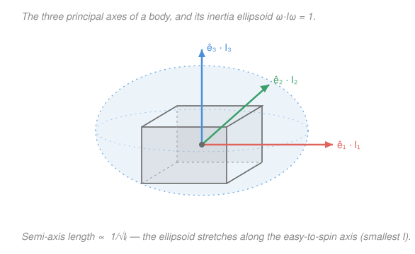

# Analytical Mechanics · Lesson 4.4: Rigid-body dynamics

> ⏱ ~15 min · Module 4: Advanced formulations · Builds on: [4.3 Small oscillations and normal modes](#/lesson/analytical-mechanics/04-03-small-oscillations.md), [`mechanics-refresher` 4.2](#/lesson/mechanics-refresher/04-02-angular-momentum.md) · Unlocks: 4.5 (classical fields)

## Why this matters

A spinning body has three degrees of rotational freedom, and — unlike a point mass — its response to a twist depends on *which way* it is oriented. A figure skater, a tumbling satellite, a gyroscope, a diatomic molecule: all of them hide a single object, the **inertia tensor**, that packages "how mass is arranged around each axis" into a $3\times3$ matrix. Diagonalize it and rotation splits into three clean channels. The payoff is a set of results you can't guess from $\mathbf F=m\mathbf a$: a free top precesses on its own, and — most startling — spinning a book about its middle axis is *unstable*, a fact Euler's equations predict exactly. This lesson is also where two threads you've already pulled — the spectral theorem and angular momentum — turn out to be the same thread.

## The idea

For a point mass, momentum and velocity point the same way: $\mathbf p=m\mathbf v$, and $m$ is just a number. For a rigid body the analog is $\mathbf L=I\boldsymbol\omega$ — but here is the twist that makes rotation rich: **angular momentum $\mathbf L$ and angular velocity $\boldsymbol\omega$ generally do *not* point the same way.** Spin a lopsided body and it wobbles precisely because the direction it "wants" its momentum (set by mass distribution) fights the direction you're spinning it. The bookkeeping device that turns $\boldsymbol\omega$ into $\mathbf L$ is a matrix, not a scalar — the inertia tensor $I$ — because mass spread around one axis leaks into the response about another.

Now the redeeming structure. That matrix is symmetric, and a symmetric matrix always has three perpendicular directions in which it acts like plain multiplication (the spectral theorem, from [`linalg-refresher` 5.1](#/lesson/linalg-refresher/05-01-spectral-theorem-quadratic-forms.md)). These are the **principal axes**. Bolt your coordinate frame to *them* — a frame glued to the tumbling body — and $I$ becomes diagonal, $\mathbf L$ lines back up with $\boldsymbol\omega$ along each axis separately, and the equations of motion decouple into three coupled-but-clean lines: Euler's equations. The price of that clean body frame is that it rotates, so time-derivatives pick up an extra $\boldsymbol\omega\times$ term — and *that* term is where all the interesting dynamics (precession, instability) come from.

## The formal version

**The inertia tensor.** For a body of density $\rho(\mathbf r)$, define the symmetric matrix

$$I_{ij}=\int \rho\,(r^2\delta_{ij}-x_i x_j)\,dV, \qquad r^2=x_1^2+x_2^2+x_3^2,$$

where $x_1,x_2,x_3$ are Cartesian coordinates from the chosen origin, $\delta_{ij}$ is the Kronecker delta ($1$ if $i=j$, else $0$), and $dV$ is the volume element. *In words:* the diagonal entry $I_{11}=\int\rho\,(x_2^2+x_3^2)\,dV$ is the familiar moment of inertia about axis 1 (mass times squared distance *from* that axis); the off-diagonal $I_{12}=-\int\rho\,x_1x_2\,dV$ is a "product of inertia" measuring how lopsided the mass is across the 1–2 plane.

It earns its keep through two identities. Angular momentum and rotational kinetic energy are

$$\mathbf L = I\boldsymbol\omega, \qquad T_{\text{rot}}=\tfrac12\,\boldsymbol\omega^\top I\,\boldsymbol\omega,$$

with $\boldsymbol\omega$ the angular velocity vector. *In words:* $I$ is the single object that turns "how fast you spin" into "how much rotational momentum and energy you carry" — the rotational stand-ins for $\mathbf p=m\mathbf v$ and $T=\tfrac12 m v^2$, with the scalar $m$ promoted to a matrix.

**Principal axes = eigenvectors of $I$.** Because $I$ is real and symmetric, the spectral theorem gives an orthonormal eigenbasis $\{\hat e_1,\hat e_2,\hat e_3\}$ with real eigenvalues $I_1,I_2,I_3\ge 0$ (the **principal moments**). In that frame

$$I=\begin{pmatrix}I_1&0&0\\0&I_2&0\\0&0&I_3\end{pmatrix},\qquad \mathbf L=(I_1\omega_1,\,I_2\omega_2,\,I_3\omega_3).$$

*In words:* along a principal axis, and only there, $\mathbf L\parallel\boldsymbol\omega$ — spinning about $\hat e_k$ gives momentum straight along $\hat e_k$, with no wobble. Any reflection symmetry of the body forces the products of inertia across that plane to zero, so **symmetry axes are automatically principal axes** — you rarely have to diagonalize by hand. The surface $\boldsymbol\omega^\top I\boldsymbol\omega=1$ is the **inertia ellipsoid**, with semi-axes $1/\sqrt{I_k}$ along the principal directions (see the Picture).

**Body frame, space frame, Euler angles.** $I$ is constant only in the frame glued to the body — in the fixed lab (space) frame the body turns and $I$'s entries change with time. The orientation of the body frame relative to the space frame is three numbers, the **Euler angles** $(\phi,\theta,\psi)$: precession $\phi$ about the space vertical, nutation $\theta$ tilting the body axis, spin $\psi$ about the body's own symmetry axis. These are the generalized coordinates of a free rigid body (three rotational DOF).

**Euler's equations.** A vector's rate of change in the space frame equals its body-frame rate plus $\boldsymbol\omega\times(\cdot)$. Applying this to $\mathbf L$ in Newton's law $\dot{\mathbf L}_{\text{space}}=\boldsymbol\tau$, and working in the principal body frame, gives

$$
\boxed{\;I_1\dot\omega_1=(I_2-I_3)\,\omega_2\omega_3+\tau_1\;}
$$

and its two cyclic partners ($1\to2\to3\to1$):

$$I_2\dot\omega_2=(I_3-I_1)\,\omega_3\omega_1+\tau_2,\qquad I_3\dot\omega_3=(I_1-I_2)\,\omega_1\omega_2+\tau_3,$$

with $\tau_i$ the torque components in the body frame. *In words:* even with **no** torque, the spins on different axes drive each other through those $(I_i-I_j)$ coupling terms — that self-coupling is the entire subject. (If the body is a sphere, $I_1=I_2=I_3$ and the couplings vanish: a spinning ball just keeps spinning.)

## Picture

The ellipsoid $\boldsymbol\omega^\top I\boldsymbol\omega=1$ bulges along the axis that is *easiest* to spin (smallest moment $I_1$) and is pinched along the hardest ($I_3$). Spin the body about any of the three axes and $\mathbf L$ stays parallel to $\boldsymbol\omega$; spin it about anything else and $\mathbf L$ tips off-axis, and the body wobbles.

## Worked examples

**Example 1 (mechanical — moments of a uniform rod).** Take a thin uniform rod of mass $M$, length $\ell$, lying along $\hat e_3$, centered at the origin. Linear density $\lambda=M/\ell$. Distance from the $\hat e_3$-axis is zero for every mass element, so $I_3=0$. About a transverse axis,

$$I_1=I_2=\int_{-\ell/2}^{\ell/2}\lambda\,x_3^2\,dx_3=\lambda\cdot\frac{2}{3}\Big(\frac{\ell}{2}\Big)^3=\frac{\lambda\ell^3}{12}=\frac{1}{12}M\ell^2.$$

By the rod's rotational symmetry about its own axis, $\hat e_1,\hat e_2,\hat e_3$ are principal, and $I=\mathrm{diag}(\tfrac{1}{12}M\ell^2,\ \tfrac{1}{12}M\ell^2,\ 0)$. This is a *symmetric top* ($I_1=I_2\ne I_3$) — the shape Example 2 sets spinning.

**Example 2 (why you'd care — the free symmetric top precesses on its own).** Let $I_1=I_2\ne I_3$ with **no torque**. The third Euler equation reads $I_3\dot\omega_3=(I_1-I_2)\omega_1\omega_2=0$, so $\omega_3=\text{const}$: the spin about the symmetry axis is frozen. The other two become

$$\dot\omega_1=-\Omega\,\omega_2,\qquad \dot\omega_2=+\Omega\,\omega_1,\qquad \Omega\equiv\frac{I_3-I_1}{I_1}\,\omega_3.$$

That is rotation in the $(\omega_1,\omega_2)$ plane at angular rate $\Omega$: $\omega_1=A\cos\Omega t,\ \omega_2=A\sin\Omega t$, so $\boldsymbol\omega$ traces a cone about the symmetry axis *in the body frame* while its length stays fixed. **A torque-free top wobbles all by itself**, at the body precession rate $\Omega$ set purely by its shape and spin. (For Earth, the analogous free precession is the ~430-day Chandler wobble.)

## Watch out

- You might think $\mathbf L$ always points along $\boldsymbol\omega$ because "$\mathbf L=I\boldsymbol\omega$ looks like $\mathbf p=m\mathbf v$." But $I$ is a *matrix*: $\mathbf L\parallel\boldsymbol\omega$ **only** along a principal axis (or for a sphere). Off-axis, $\mathbf L$ and $\boldsymbol\omega$ genuinely differ in direction — that misalignment *is* the wobble.
- You might think "no torque ⇒ $\boldsymbol\omega$ is constant." Wrong: torque-free means $\mathbf L$ is constant *in the space frame*. In the body frame $\boldsymbol\omega$ still moves (Example 2), because that frame is rotating. Conserved-in-space $\ne$ constant-in-body.
- You might read Euler's equation signs off memory. Fix the cycle once: the coefficient of the $\dot\omega_1$ equation is $(I_2-I_3)$, and you advance indices $1\to2\to3\to1$. Getting the order backwards flips the sign of $\Omega$ and, worse, of every stability verdict below.

## One-liner

> A rigid body spins about the eigenvectors of its inertia tensor; along those axes $\mathbf L\parallel\boldsymbol\omega$ and Euler's equations decouple — and the middle one is unstable.

## Problems

**P1 (🟢)** A uniform thin rectangular plate has mass $M$ and side lengths $a$ (along $\hat e_1$) and $b$ (along $\hat e_2$), lying flat in the $1$–$2$ plane, centered at the origin. Give the three principal moments $I_1,I_2,I_3$, explain why $\hat e_1,\hat e_2,\hat e_3$ are the principal axes, and check the perpendicular-axis relation $I_3=I_1+I_2$.

**P2 (🟡)** For the free symmetric top of Example 2 with $I_1=I_2$, verify directly that (a) the kinetic energy $T_{\text{rot}}=\tfrac12(I_1\omega_1^2+I_2\omega_2^2+I_3\omega_3^2)$ and (b) the magnitude $|\mathbf L|$ are both conserved along the precessing solution $\omega_1=A\cos\Omega t,\ \omega_2=A\sin\Omega t,\ \omega_3=\text{const}$.

**P3 (🔴, optional) — the intermediate-axis (tennis-racket) theorem.** Take the torque-free body with distinct moments $I_1<I_2<I_3$, spinning steadily about one principal axis. Linearize Euler's equations about that steady spin and show that rotation about the **largest** ($\hat e_3$) and **smallest** ($\hat e_1$) axes is stable (bounded oscillation), but rotation about the **middle** axis $\hat e_2$ is unstable (exponential growth).

Solutions

**P1** Surface density $\sigma=M/(ab)$, and $x_3=0$ everywhere (thin plate). Using $I_{11}=\int\sigma(x_2^2+x_3^2)\,dA=\int\sigma x_2^2\,dA$:

$$I_1=\sigma\!\int_{-a/2}^{a/2}\!\!\int_{-b/2}^{b/2}\! x_2^2\,dx_2\,dx_1=\sigma\cdot a\cdot\frac{b^3}{12}=\frac{M}{ab}\cdot a\cdot\frac{b^3}{12}=\frac{1}{12}Mb^2.$$

By the mirror-image argument (swap $a\leftrightarrow b$), $I_2=\frac{1}{12}Ma^2$. For $\hat e_3$, distance-squared from the axis is $x_1^2+x_2^2$, giving

$$I_3=\sigma\!\int\!\!\int (x_1^2+x_2^2)\,dA=\frac{1}{12}Ma^2+\frac{1}{12}Mb^2=\frac{1}{12}M(a^2+b^2).$$

Principal axes: the plate is symmetric under $x_1\to-x_1$ and $x_2\to-x_2$, so every product of inertia integrand ($x_ix_j$, $i\ne j$) is odd in some coordinate and integrates to zero — $I$ is already diagonal, so $\hat e_1,\hat e_2,\hat e_3$ are principal. **Check:** $I_1+I_2=\frac{1}{12}Mb^2+\frac{1}{12}Ma^2=\frac{1}{12}M(a^2+b^2)=I_3$ — the perpendicular-axis theorem, valid because the plate is planar. ✓

**P2** (a) With $I_1=I_2$, $\ T_{\text{rot}}=\tfrac12 I_1(\omega_1^2+\omega_2^2)+\tfrac12 I_3\omega_3^2$. Now $\omega_1^2+\omega_2^2=A^2\cos^2\Omega t+A^2\sin^2\Omega t=A^2$ (constant), and $\omega_3$ is constant, so $T_{\text{rot}}=\tfrac12 I_1 A^2+\tfrac12 I_3\omega_3^2=\text{const}$. ✓
(b) $|\mathbf L|^2=(I_1\omega_1)^2+(I_2\omega_2)^2+(I_3\omega_3)^2=I_1^2(\omega_1^2+\omega_2^2)+I_3^2\omega_3^2=I_1^2A^2+I_3^2\omega_3^2=\text{const}$. ✓
**Check** (independent, from the dynamics): differentiate $\tfrac12(I_1\omega_1^2+I_2\omega_2^2+I_3\omega_3^2)$ and use torque-free Euler's equations — $\dot T=\omega_1\!\cdot\!(I_2-I_3)\omega_2\omega_3+\omega_2\!\cdot\!(I_3-I_1)\omega_3\omega_1+\omega_3\!\cdot\!(I_1-I_2)\omega_1\omega_2=(I_2-I_3+I_3-I_1+I_1-I_2)\,\omega_1\omega_2\omega_3=0$. Energy and $|\mathbf L|$ are conserved for *any* torque-free body, not just the symmetric one. ✓

**P3** Torque-free Euler's equations: $I_1\dot\omega_1=(I_2-I_3)\omega_2\omega_3$, and cyclic. Spin steadily about $\hat e_3$: $\boldsymbol\omega=(0,0,\omega_0)$ is an exact solution. Perturb: $\omega_1,\omega_2$ small, $\omega_3=\omega_0+\delta$. The third equation gives $I_3\dot\delta=(I_1-I_2)\omega_1\omega_2$, which is second-order small, so $\omega_3\approx\omega_0$ is constant to first order. The linearized transverse pair:

$$I_1\dot\omega_1=(I_2-I_3)\omega_0\,\omega_2,\qquad I_2\dot\omega_2=(I_3-I_1)\omega_0\,\omega_1.$$

Differentiate the first and substitute the second:

$$\ddot\omega_1=\frac{(I_2-I_3)(I_3-I_1)}{I_1 I_2}\,\omega_0^2\,\omega_1\equiv K\,\omega_1.$$

The behavior is set by the sign of $K$, i.e. of $(I_2-I_3)(I_3-I_1)$:

- **Axis 3 = largest** ($I_3>I_1,I_2$): $(I_2-I_3)<0$ and $(I_3-I_1)>0\Rightarrow K<0$. Then $\ddot\omega_1=-|K|\omega_1$: bounded oscillation at frequency $\sqrt{|K|}$ — **stable**.
- **Axis 3 = smallest** (relabel; equivalently spin about $\hat e_1$ with $I_1<I_2,I_3$): both factors flip together so $K<0$ again — **stable**.
- **Axis = intermediate** (spin about $\hat e_2$, with $I_1<I_2<I_3$): the two factors $(I_1-I_2)<0$ and $(I_3-I_2)>0$ enter the analog product with the *same-sign* structure that makes it positive, giving $K>0$. Then $\ddot\omega=+|K|\omega$ has solution $\propto e^{\pm\sqrt{K}\,t}$: **exponential growth — unstable.**

**Check:** the coefficient is negative (stable) exactly when the spin axis's moment is either the largest or the smallest of the three, and positive (unstable) exactly when it is the middle one — matching the classic demonstration that a book tossed spinning about its intermediate axis flips over, while about its long or short axis it spins cleanly. ✓ (Because $\omega_3^2=\omega_0^2$, the instability grows regardless of spin direction — you can't outspin it.)

## Flashback

**From Lesson 4.3 (Small oscillations and normal modes):** Two equal masses $m$ sit in a line connected by three identical springs of constant $k$ (wall–spring–$m$–spring–$m$–spring–wall). With displacements $x_1,x_2$ from equilibrium, form the equations of motion, then find the two normal-mode frequencies and their mode shapes.

Solution

Each mass feels its two flanking springs: $m\ddot x_1=-kx_1-k(x_1-x_2)=-2kx_1+kx_2$ and $m\ddot x_2=-kx_2-k(x_2-x_1)=kx_1-2kx_2$. In matrix form $m\ddot{\mathbf x}=-K\mathbf x$ with stiffness $K=k\begin{pmatrix}2&-1\\-1&2\end{pmatrix}$. Seek $\mathbf x=\mathbf a\,e^{i\omega t}$: $\big(K-m\omega^2 I\big)\mathbf a=0$, so $\omega^2$ are eigenvalues of $K/m$. The eigenvalues of $\begin{pmatrix}2&-1\\-1&2\end{pmatrix}$ are $1$ and $3$, hence

$$\omega_1=\sqrt{\tfrac{k}{m}}\ \ (\mathbf a\propto(1,1)^\top,\ \text{masses move together}),\qquad \omega_2=\sqrt{\tfrac{3k}{m}}\ \ (\mathbf a\propto(1,-1)^\top,\ \text{masses move opposite}).$$

**Check:** trace $=2+2=4=1+3$ ✓ and $\det=4-1=3=1\cdot3$ ✓, so the eigenvalues $\{1,3\}$ are right; the symmetric mode is softer (lower $\omega$) because the middle spring never stretches, exactly as intuition demands. ✓ (Same move as this lesson's principal axes: diagonalize a symmetric matrix, and coupled motion splits into independent channels.)

## Connections

- **Backward:** $\mathbf L=I\boldsymbol\omega$ and torque-free conservation of $\mathbf L$ are the rigid-body version of [`mechanics-refresher` 4.2](#/lesson/mechanics-refresher/04-02-angular-momentum.md)'s angular momentum; the diagonalization of $I$ is literally the spectral theorem for symmetric matrices / quadratic forms from [`linalg-refresher` 5.1](#/lesson/linalg-refresher/05-01-spectral-theorem-quadratic-forms.md) — the inertia ellipsoid *is* the quadratic form $\boldsymbol\omega^\top I\boldsymbol\omega$.
- **Sideways:** finding principal axes and diagonalizing $I$ is the exact same computation as finding the normal modes of [4.3](#/lesson/analytical-mechanics/04-03-small-oscillations.md) — both are "symmetric matrix ⇒ orthogonal eigenbasis ⇒ decoupled channels," here for a mass distribution rather than a stiffness matrix (see the Flashback).
- **Forward:** the Euler angles $(\phi,\theta,\psi)$ become the natural generalized coordinates for the Lagrangian of a spinning top, and the heavy symmetric top is the showcase application of [4.2 action–angle variables](#/lesson/analytical-mechanics/04-02-action-angle-integrability.md); the body-vs-space frame split and the constant-in-space / moving-in-body distinction previews the continuum fields of [4.5](#/lesson/analytical-mechanics/04-05-classical-fields.md).
