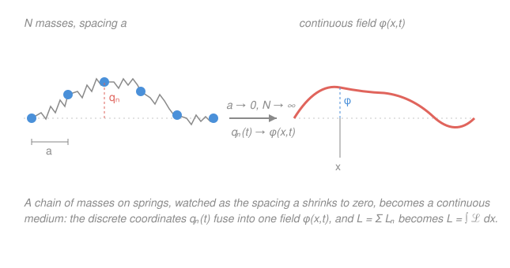

# Analytical Mechanics · Lesson 4.5: Classical fields — the Lagrangian density

> ⏱ ~15 min · Module 4: Advanced formulations · Builds on: [4.3 Small oscillations and normal modes](#/lesson/analytical-mechanics/04-03-small-oscillations.md), [1.1 The calculus of variations and the Euler–Lagrange equation](#/lesson/analytical-mechanics/01-01-calculus-of-variations.md) · Unlocks: quantum field theory, continuum mechanics (course complete)

## Why this matters

Everything so far has tracked a *finite* list of coordinates $q_1,\dots,q_n$ — beads, pendula, a spinning top. But a vibrating string, a sound wave, the electromagnetic field: these have a degree of freedom at *every point of space*. The bridge is the **continuum limit** — watch a chain of masses on springs while the spacing shrinks to zero, and the discrete coordinates fuse into a continuous **field** $\phi(x,t)$. The entire Lagrangian machinery survives the crossing intact: $L=T-V$ becomes a *density* integrated over space, Euler–Lagrange grows a spatial derivative, Noether's theorem produces conserved *currents*. This is the language of classical field theory (Maxwell's equations are one Lagrangian), and quantized, it is the language of `quantum-mechanics`'s successor, quantum field theory. It is where this course points.

## The idea

Take $N$ identical masses in a row, each tied to its neighbors by identical springs. Number them; let $q_n(t)$ be how far mass $n$ has moved from rest. You know this system — it is [4.3](#/lesson/analytical-mechanics/04-03-small-oscillations.md)'s coupled oscillators, just with a lot of masses. Its Lagrangian is a sum: kinetic energy of each mass minus spring energy of each gap.

Now shrink the spacing $a$ toward zero and add masses to keep the total length fixed. The index $n$ becomes too fine to track one bead at a time; instead ask, "how far has the material *at position $x$* moved?" That single question defines a function $\phi(x,t)$ — the displacement field. The bead label $n$ has turned into a continuous coordinate $x$, and $q_n(t)$ has turned into $\phi(x,t)$.

Two things happen to the Lagrangian in this limit. The **sum over beads becomes an integral over $x$**, and the **difference between neighbors, $q_{n+1}-q_n$, becomes a spatial derivative** $\partial_x\phi$. What's left inside the integral is a *density* — Lagrangian per unit length — that depends on the field and its slopes in both time and space. That density, $\mathcal{L}$, is the new central object, and extremizing its action gives a field equation that holds at every point: the **wave equation**.

## The formal version

**The discrete chain.** $N$ masses $m$, spacing $a$, nearest-neighbor springs of stiffness $k$, displacement $q_n(t)$:

$$L = \sum_n\left[\tfrac12 m\,\dot q_n^2 \;-\; \tfrac12 k\,(q_{n+1}-q_n)^2\right].$$

In words: each mass contributes kinetic energy $\tfrac12 m\dot q_n^2$; each spring stores $\tfrac12 k(\text{stretch})^2$, and the stretch is the difference of adjacent displacements.

**The continuum limit.** Set $x=na$ and $q_n(t)\to\phi(x,t)$. Hold two ratios fixed as $a\to0$:

$$\mu \equiv \frac{m}{a}\ (\text{mass per length}),\qquad \tau \equiv k\,a\ (\text{tension-like stiffness}).$$

Then $\tfrac12 m\dot q_n^2=\tfrac12(\mu a)\dot\phi^2$, and since $q_{n+1}-q_n\approx a\,\partial_x\phi$ we get $\tfrac12 k(q_{n+1}-q_n)^2=\tfrac12 k a^2(\partial_x\phi)^2=\tfrac12(\tau a)(\partial_x\phi)^2$. Every term carries one factor of $a$, so $\sum_n a\to\int dx$ and

$$L=\int \mathcal{L}\,dx,\qquad \boxed{\;\mathcal{L}=\tfrac12\mu\,(\partial_t\phi)^2-\tfrac12\tau\,(\partial_x\phi)^2\;}$$

**In words:** $\mathcal{L}$, the **Lagrangian density**, is kinetic-energy density minus potential-energy density, and the potential now costs you for *bending the field in space* (the $\partial_x\phi$ term), not for stretching a discrete spring. I'll write $\partial_t\phi=\dot\phi$ and $\partial_x\phi=\phi'$ where it's cleaner.

**The action** is the density integrated over space *and* time:

$$S[\phi]=\int L\,dt=\iint \mathcal{L}\big(\phi,\partial_t\phi,\partial_x\phi\big)\,dx\,dt.$$

**The field Euler–Lagrange equation.** Extremize $S$ exactly as in [1.1](#/lesson/analytical-mechanics/01-01-calculus-of-variations.md): vary $\phi\to\phi+\varepsilon\eta$ with $\eta$ vanishing on the boundary of the region, demand $\delta S=0$, and integrate by parts — now *twice*, once in $t$ and once in $x$, each boundary term dying on the pinned boundary. The result:

$$\boxed{\;\partial_\mu\frac{\partial\mathcal{L}}{\partial(\partial_\mu\phi)}-\frac{\partial\mathcal{L}}{\partial\phi}=0\;}$$

Here the index $\mu$ ranges over the spacetime coordinates $\{t,x\}$ and repeated $\mu$ is summed, so this is shorthand for

$$\partial_t\frac{\partial\mathcal{L}}{\partial(\partial_t\phi)}+\partial_x\frac{\partial\mathcal{L}}{\partial(\partial_x\phi)}-\frac{\partial\mathcal{L}}{\partial\phi}=0.$$

**In words:** it is [1.1](#/lesson/analytical-mechanics/01-01-calculus-of-variations.md)'s Euler–Lagrange equation with one extra term — the old $\frac{d}{dt}\frac{\partial L}{\partial\dot q}$ has a twin $\frac{\partial}{\partial x}\frac{\partial\mathcal{L}}{\partial\phi'}$, because the field can vary in space as well as time. Time and space enter symmetrically; that symmetry is the seed of relativity.

**The payoff.** For the string, $\frac{\partial\mathcal{L}}{\partial\dot\phi}=\mu\dot\phi$, $\frac{\partial\mathcal{L}}{\partial\phi'}=-\tau\phi'$, and $\frac{\partial\mathcal{L}}{\partial\phi}=0$, so the field equation is

$$\mu\,\partial_t^2\phi-\tau\,\partial_x^2\phi=0\quad\Longrightarrow\quad \boxed{\;\partial_t^2\phi=c^2\,\partial_x^2\phi,\quad c^2=\frac{\tau}{\mu}\;}$$

the **wave equation**, with $c$ the propagation speed. This is the *same* PDE you separated variables on in [`ode-refresher` 4.2](#/lesson/ode-refresher/04-02-intro-pdes-separation.md) and that fell out of Maxwell's equations in [`em-refresher` 4.2](#/lesson/em-refresher/04-02-electromagnetic-waves.md) — three routes, one equation. A field theory is just "a Lagrangian density whose Euler–Lagrange equation is the PDE you want."

**Noether for fields.** In [2.2](#/lesson/analytical-mechanics/02-02-noethers-theorem.md) a continuous symmetry gave one conserved *number*. In a field theory it gives a conserved **current** $(\rho,\,j)$ satisfying a *local* continuity equation

$$\partial_t\rho+\partial_x j=0,$$

whose spatial integral $Q=\int\rho\,dx$ is then constant in time (a conserved **charge**). Time-translation invariance ($\mathcal{L}$ has no explicit $t$) yields the **energy density** — the field Hamiltonian density,

$$\mathcal{H}=T^{00}=\dot\phi\,\frac{\partial\mathcal{L}}{\partial\dot\phi}-\mathcal{L},$$

the exact continuum analogue of the energy function $H=\dot q\,\partial L/\partial\dot q-L$. Conservation is now local: energy doesn't vanish here and reappear there, it *flows*, tracked by the current. (This local object is a piece of the stress–energy tensor $T^{\mu\nu}$ — the same one that sources gravity in general relativity.)

## Picture

## Worked examples

**Example 1 (mechanical — read the equation off the density).** Consider $\mathcal{L}=\tfrac12\mu\dot\phi^2-\tfrac12\tau\phi'^2$ once more, but suppose the string also sits in a medium that pulls each element back toward $\phi=0$ with an energy density $\tfrac12\kappa\phi^2$ (an elastic substrate). The density becomes $\mathcal{L}=\tfrac12\mu\dot\phi^2-\tfrac12\tau\phi'^2-\tfrac12\kappa\phi^2$. Now $\frac{\partial\mathcal{L}}{\partial\phi}=-\kappa\phi\neq0$, so the field equation gains a term:

$$\mu\ddot\phi-\tau\phi''+\kappa\phi=0.$$

This is the **Klein–Gordon equation** in disguise — the substrate stiffness $\kappa$ plays the role of a *mass*. A plain string carries every frequency at speed $c$; the substrate gives waves a lowest frequency $\sqrt{\kappa/\mu}$ they cannot go below. Adding one algebraic term to $\mathcal{L}$ changed the physics entirely, and Euler–Lagrange did the rest mechanically.

**Example 2 (why you'd care — energy that flows).** Take the plain string and build its energy density from Noether: $\mathcal{H}=\dot\phi(\mu\dot\phi)-\mathcal{L}=\tfrac12\mu\dot\phi^2+\tfrac12\tau\phi'^2$ — kinetic *plus* potential density, total mechanical energy per length, exactly as intuition demands. Its flux turns out to be $\mathcal{S}=-\tau\dot\phi\phi'$, and using the wave equation one checks $\partial_t\mathcal{H}+\partial_x\mathcal{S}=0$ (you'll do this in P3). Integrate over the whole string with fixed or free ends and the flux boundary term vanishes, leaving $\frac{d}{dt}\int\mathcal{H}\,dx=0$: **total energy is conserved**, not by fiat but as the Noether charge of time-translation symmetry. The same template, applied to the electromagnetic Lagrangian, produces the Poynting vector.

## Watch out

- You might think $\phi$ is a *coordinate*, so $x$ must be one too. No: in a field theory $x$ is a **label**, like the index $n$ was — it says *which* piece of the medium. The dynamical variable is $\phi$; $x$ and $t$ are both independent parameters it depends on. That is why they can enter $\mathcal{L}$ symmetrically.
- You might think the field E–L equation has only the time term. The spatial term $\partial_x\frac{\partial\mathcal{L}}{\partial\phi'}$ is easy to drop — and dropping it deletes the $\phi''$, i.e. deletes the wave. The whole point of the continuum limit is that this term exists.
- You might read $\partial_\mu\frac{\partial\mathcal{L}}{\partial(\partial_\mu\phi)}$ as a single derivative. It's a **sum** over $\mu\in\{t,x\}$ (a spacetime divergence). Each slot $\partial_\mu\phi$ gets its own partial derivative of $\mathcal{L}$, then you take $\partial_\mu$ of that and add.

## One-liner

> A field is what a chain of oscillators becomes when the spacing goes to zero: $L$ turns into $\int\mathcal{L}\,dx$, Euler–Lagrange grows a spatial derivative, and out drops the wave equation — with Noether now delivering conserved *currents* instead of numbers.

## Problems

**P1 (🟢)** *The loaded string, start to finish.* Starting from the chain Lagrangian $L=\sum_n\big[\tfrac12 m\dot q_n^2-\tfrac12 k(q_{n+1}-q_n)^2\big]$, carry out the continuum limit with $\mu=m/a$, $\tau=ka$ held fixed to obtain $\mathcal{L}=\tfrac12\mu\dot\phi^2-\tfrac12\tau\phi'^2$. Then apply the field Euler–Lagrange equation and show the equation of motion is $\ddot\phi=c^2\phi''$ with $c^2=\tau/\mu$.

**P2 (🟡)** *Klein–Gordon.* For the density $\mathcal{L}=\tfrac12(\partial_t\phi)^2-\tfrac12(\partial_x\phi)^2-\tfrac12 m^2\phi^2$ (units with $c=1$), apply the field Euler–Lagrange equation to derive the equation of motion $\ddot\phi-\phi''+m^2\phi=0$. Then verify by substitution that a plane wave $\phi=e^{i(kx-\omega t)}$ solves it, and read off the dispersion relation.

**P3 (🔴)** *Noether energy current.* For the string $\mathcal{L}=\tfrac12\mu\dot\phi^2-\tfrac12\tau\phi'^2$, the time-translation symmetry gives energy density $\mathcal{H}=\tfrac12\mu\dot\phi^2+\tfrac12\tau\phi'^2$ and flux $\mathcal{S}=-\tau\dot\phi\phi'$. Show that these obey the continuity equation $\partial_t\mathcal{H}+\partial_x\mathcal{S}=0$ *on solutions* (you'll need the equation of motion $\mu\ddot\phi=\tau\phi''$), and explain why this makes the total energy $E=\int\mathcal{H}\,dx$ constant.

Solutions

**P1** Write $x=na$, $q_n(t)=\phi(x,t)$. Kinetic term per bead: with $m=\mu a$,

$$\tfrac12 m\dot q_n^2=\tfrac12\mu a\,\dot\phi^2.$$

Spring term: the neighbor difference is $q_{n+1}-q_n=\phi(x+a,t)-\phi(x,t)\approx a\,\partial_x\phi$, so with $k=\tau/a$,

$$\tfrac12 k(q_{n+1}-q_n)^2\approx\tfrac12\frac{\tau}{a}\,(a\phi')^2=\tfrac12\tau a\,\phi'^2.$$

Each term carries a factor $a$; using $\sum_n a\to\int dx$,

$$L=\sum_n a\left[\tfrac12\mu\dot\phi^2-\tfrac12\tau\phi'^2\right]\longrightarrow\int\Big[\tfrac12\mu\dot\phi^2-\tfrac12\tau\phi'^2\Big]dx,\qquad \mathcal{L}=\tfrac12\mu\dot\phi^2-\tfrac12\tau\phi'^2.$$

Now the field E–L equation. The three pieces:

$$\frac{\partial\mathcal{L}}{\partial\dot\phi}=\mu\dot\phi,\qquad\frac{\partial\mathcal{L}}{\partial\phi'}=-\tau\phi',\qquad\frac{\partial\mathcal{L}}{\partial\phi}=0.$$

Assemble $\partial_t\frac{\partial\mathcal{L}}{\partial\dot\phi}+\partial_x\frac{\partial\mathcal{L}}{\partial\phi'}-\frac{\partial\mathcal{L}}{\partial\phi}=0$:

$$\partial_t(\mu\dot\phi)+\partial_x(-\tau\phi')-0=\mu\ddot\phi-\tau\phi''=0\ \Longrightarrow\ \ddot\phi=\frac{\tau}{\mu}\phi''=c^2\phi'',\quad c^2=\frac{\tau}{\mu}.$$

*Check:* dimensionally $[\tau/\mu]=(\text{force})/(\text{mass/length})=(\text{kg·m/s}^2)/(\text{kg/m})=\text{m}^2/\text{s}^2$, a speed squared. ✓

**P2** The three pieces:

$$\frac{\partial\mathcal{L}}{\partial(\partial_t\phi)}=\partial_t\phi,\qquad\frac{\partial\mathcal{L}}{\partial(\partial_x\phi)}=-\partial_x\phi,\qquad\frac{\partial\mathcal{L}}{\partial\phi}=-m^2\phi.$$

Field E–L:

$$\partial_t(\partial_t\phi)+\partial_x(-\partial_x\phi)-(-m^2\phi)=\ddot\phi-\phi''+m^2\phi=0.$$

Substitute $\phi=e^{i(kx-\omega t)}$: $\ddot\phi=(-i\omega)^2\phi=-\omega^2\phi$ and $\phi''=(ik)^2\phi=-k^2\phi$, so

$$-\omega^2\phi-(-k^2\phi)+m^2\phi=(-\omega^2+k^2+m^2)\phi=0\ \Longrightarrow\ \omega^2=k^2+m^2.$$

So the plane wave solves it provided $\omega^2=k^2+m^2$ — the relativistic energy–momentum relation $E^2=p^2+m^2$ (with $\hbar=c=1$). *Check:* setting $m=0$ recovers $\omega^2=k^2$, the massless wave equation with $c=1$, as it must. ✓

**P3** Differentiate the energy density in time:

$$\partial_t\mathcal{H}=\partial_t\big(\tfrac12\mu\dot\phi^2+\tfrac12\tau\phi'^2\big)=\mu\dot\phi\,\ddot\phi+\tau\phi'\,\dot\phi'.$$

Use the equation of motion $\mu\ddot\phi=\tau\phi''$ on the first term:

$$\partial_t\mathcal{H}=\tau\dot\phi\,\phi''+\tau\phi'\,\dot\phi'=\tau\,\partial_x(\dot\phi\,\phi'),$$

recognizing the product rule $\partial_x(\dot\phi\phi')=\dot\phi'\phi'+\dot\phi\phi''$ (mixed partials commute, $\partial_x\dot\phi=\dot\phi'$). Meanwhile

$$\partial_x\mathcal{S}=\partial_x(-\tau\dot\phi\,\phi')=-\tau\,\partial_x(\dot\phi\,\phi').$$

Adding,

$$\partial_t\mathcal{H}+\partial_x\mathcal{S}=\tau\,\partial_x(\dot\phi\phi')-\tau\,\partial_x(\dot\phi\phi')=0.\ \checkmark$$

Why total energy is constant: integrate the continuity equation over the whole string,

$$\frac{dE}{dt}=\frac{d}{dt}\int\mathcal{H}\,dx=\int\partial_t\mathcal{H}\,dx=-\int\partial_x\mathcal{S}\,dx=-\big[\mathcal{S}\big]_{\text{ends}}.$$

For fixed ends ($\dot\phi=0$) or free ends ($\phi'=0$), the flux $\mathcal{S}=-\tau\dot\phi\phi'$ vanishes at both boundaries, so $dE/dt=0$. Energy is the Noether charge of time-translation invariance — the field version of "no explicit $t$ ⟹ energy conserved" from [2.2](#/lesson/analytical-mechanics/02-02-noethers-theorem.md). *Check:* the flux carries a factor $\dot\phi\phi'$, which is exactly the power a string element delivers to its neighbor (transverse force $-\tau\phi'$ times transverse velocity $\dot\phi$) — a physically sensible energy current. ✓

## Flashback

**From Lesson 1.1 (Calculus of variations):** Find the extremal of $J[y]=\displaystyle\int_0^1\big(y'^2+y^2\big)\,dx$ with $y(0)=0,\ y(1)=1$. (This is the *static, one-dimensional* cousin of a field Lagrangian — note the $y^2$ playing the role of a mass term.)

Solution

Here $F=y'^2+y^2$, with $\dfrac{\partial F}{\partial y}=2y$ and $\dfrac{\partial F}{\partial y'}=2y'$. The Euler–Lagrange equation $\dfrac{\partial F}{\partial y}-\dfrac{d}{dx}\dfrac{\partial F}{\partial y'}=0$ gives

$$2y-\frac{d}{dx}(2y')=2y-2y''=0\ \Longrightarrow\ y''=y.$$

General solution $y=Ae^{x}+Be^{-x}$. Impose $y(0)=0$: $A+B=0$, so $y=A(e^x-e^{-x})=2A\sinh x$. Impose $y(1)=1$: $2A\sinh1=1$, hence

$$y(x)=\frac{\sinh x}{\sinh 1}.$$

*Check:* $y''=\dfrac{\sinh x}{\sinh1}=y$ ✓, and $y(0)=0$, $y(1)=\sinh1/\sinh1=1$ ✓. (The same E–L that produced straight lines and catenaries in 1.1 produces $\sinh$ here — the $+y^2$ term is precisely what makes the equation $y''=y$ instead of $y''=0$, exactly as the mass term $m^2\phi^2$ shaped the Klein–Gordon equation in P2.)

## Connections

- **Backward:** this is [4.3](#/lesson/analytical-mechanics/04-03-small-oscillations.md)'s coupled oscillators taken to infinitely many degrees of freedom — the normal modes become the Fourier modes $e^{ikx}$ of the string, each a decoupled oscillator with frequency $\omega(k)=c|k|$. The variational engine is [1.1](#/lesson/analytical-mechanics/01-01-calculus-of-variations.md)'s, unchanged but for one extra integration-by-parts in $x$.
- **Forward:** quantize each mode's oscillator and its quanta are *particles* — this Lagrangian-density formalism is the entire scaffolding of quantum field theory, the sequel to `quantum-mechanics`. The field $\phi$ becomes an operator; the Klein–Gordon density of P2 describes a scalar particle of mass $m$.
- **Sideways:** the electromagnetic field is a Lagrangian density $\mathcal{L}=-\tfrac14 F_{\mu\nu}F^{\mu\nu}-A_\mu J^\mu$ whose field Euler–Lagrange equations *are* Maxwell's equations ([`em-refresher` 4.2](#/lesson/em-refresher/04-02-electromagnetic-waves.md)); the same wave equation you derived here is the source-free case. Noether's time-translation current gives the electromagnetic energy density and Poynting flux, mirroring P3 exactly. That closes the loop: forces became variational principles, and the most fundamental fields in physics are written in the language this course just built.
