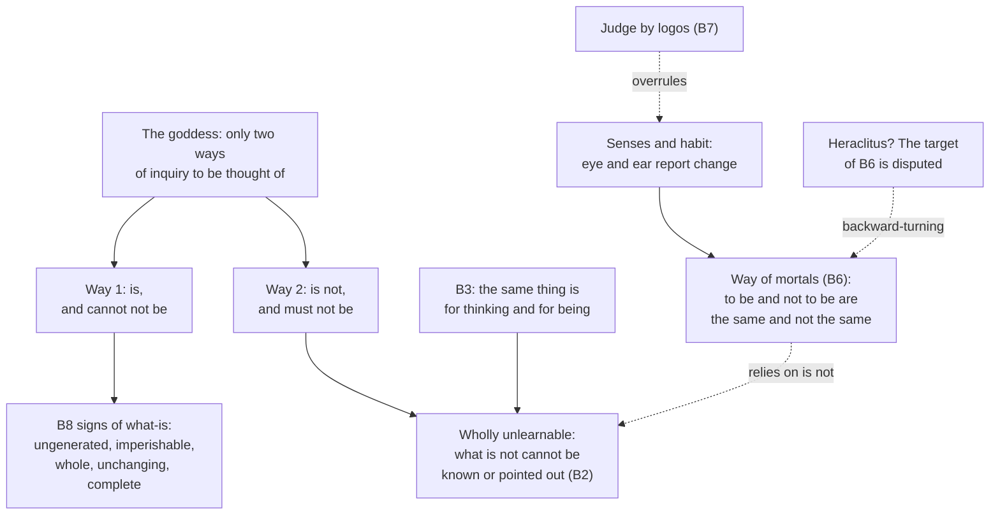

# Ancient & Medieval Philosophy · Lesson 1.1: Heraclitus and Parmenides

> ⏱ ~15 min · Module 1: The Presocratics and the Socratic turn · Builds on: [`philosophical-method` 1.3 Reconstruction and charity](../../philosophical-method/lessons/01-03-reconstruction-and-charity.md) · Unlocks: [1.2 Zeno and the atomists](01-02-zeno-and-the-atomists.md)

## Why this matters

Parmenides wrote an argument whose conclusion is that nothing comes to be, nothing passes away, and nothing changes. Nobody believes that, and for two thousand years almost nobody could say exactly what was wrong with it. Zeno defends it, the atomists build a physics to escape it, Plato splits reality in two partly because of it, and Aristotle invents potency to dissolve it. This course starts here because the long argument about being, change and knowledge that runs through Aquinas and Ockham starts here.

## The idea

**Before them: the search for an *arche*.** In sixth-century BC Miletus, three thinkers asked what everything is made of, or comes from. Their word for it was *arche*, "origin" or "principle". Thales said water. Anaximander said the *apeiron*, the boundless or indefinite, out of which opposites like hot and cold separate. Anaximenes said air, which becomes fire when rarefied and wind, water, earth and stone as it condenses. The question they share matters more than their answers: behind the variety we see, one thing persists and changes its appearance.

**How we know any of this.** No complete book by any thinker before Socrates survives. What we have are *fragments*, sentences quoted by later authors (Plato, Aristotle, Sextus Empiricus, Clement, Simplicius in the sixth century AD), and *doxography*, later summaries of what they held, much of it going back to Aristotle and his pupil Theophrastus. The standard collection is Diels–Kranz (DK). Each thinker gets a number (22 is Heraclitus, 28 is Parmenides). A is testimony about him and B is his own words, so "DK 28 B8" is Parmenides' fragment 8. Every fragment was quoted by someone making a point of his own, and that shapes how it has come down to us.

**Heraclitus** (Ephesus, active c. 500 BC) wrote in compressed, deliberately riddling sentences. Three ideas run through them.

- **Flux.** "Upon those who step into the same rivers, different and again different waters flow" (B12, the lesson's translation). The famous "you cannot step twice into the same river" (B91) is Plutarch's wording, and Plato reports something like it in *Cratylus* 402a. Some scholars, notably G. S. Kirk (*Heraclitus: The Cosmic Fragments*, 1954), took B12 to be the authentic version. On that reading the fragment says the river stays *the same* river because its waters keep being replaced.
- **Unity of opposites.** "The road up and down is one and the same" (B60). Sea water is "purest and foulest", drinkable and life-saving for fish, deadly for people (B61). Opposites are bound together, and each needs or turns into the other.
- **The *logos*.** All things happen according to a *logos* that holds always, though people fail to grasp it even after hearing it (B1). "Listening not to me but to the *logos*, it is wise to agree that all things are one" (B50). The world is "fire everliving, kindled in measures and quenched in measures" (B30).

Plato, and Aristotle after him, read Heraclitus as the philosopher of universal flux: nothing is stable, so nothing can be known. Many modern readers put the weight on *measure* instead. Change is constant, but it is exchanged in fixed proportions, and that exchange is what the *logos* names. Both readings are live. Neither is settled by the fragments alone.

**Parmenides** (Elea, in southern Italy, early fifth century BC) wrote a hexameter poem. A goddess tells a young man the way of Truth and then the opinions of mortals. The Truth section rests on one thought: you cannot think or say *what is not*, so "is not" is no path for inquiry at all. Follow that seriously and coming-to-be, passing away and change all go, because each needs something to be that previously was not.

## Source

Parmenides, DK 28 B2 and B3 (the lesson's own translation of the Greek, kept literal; the Greek leaves the subject of "is" unexpressed, so it appears here as [it]):

> Come now, I will tell you — and you, once you have heard the account, carry it away — which ways of inquiry alone there are for thinking. The one, that [it] is and that it is not possible for [it] not to be, is the path of Persuasion, for she attends on Truth. The other, that [it] is not and that it is necessary for [it] not to be — this, I point out to you, is a path wholly unlearnable. For you could not come to know what is not (that cannot be accomplished), nor could you point it out.
>
> … For the same thing is for thinking and for being.

The last line (B3) is one of the most disputed sentences in Greek philosophy. It can be read as "thinking and being are the same", or as "the same thing is there to be thought and to be". The second, weaker reading is enough for the argument: whatever can be thought of must be.

## The argument

**The two ways (B2, B3, B6, B7), in the goddess's terms.**

1. **There are only two ways of inquiry to be thought of: "is" and "is not".** *In words:* any inquiry into something takes it that the thing is, or takes it that the thing is not.
2. **What is not cannot be known or pointed out.** *In words:* there is nothing there to grasp or indicate, so a thought "of what is not" has no object.
3. **What is there to be spoken of and thought of must be** (B3; B6 opens with the same claim). *In words:* if you can think it, it is. Premise 2 run in reverse.
4. **So "is not" is a path along which nothing can be learned.** *In words:* the second way is not false but empty. It is not a road at all.
5. **Mortals take a mixed road.** "Knowing nothing, two-headed", they hold that to be and not to be are "the same and not the same", and their path is "backward-turning" (B6, the lesson's translation). *In words:* ordinary thought, which says things were not and now are, uses both ways at once.
6. **The mixed road depends on "is not", so it inherits step 4's defect.** Do not let habit, "the aimless eye and echoing ear", force you onto it. Judge instead by reasoning (*logos*) the refutation the goddess offers (B7, the lesson's translation). *In words:* the senses report change, but reporting change means thinking what is not, so reason overrules the senses.
7. **∴ Only "is" remains, and B8 draws out its signs:** what-is is ungenerated and imperishable, whole, unmoved and complete. *In words:* once "is not" is barred, nothing can come into or go out of what-is, or differ from it, because each of those would need a "was not" or an "is not yet".

The argument for step 7's first sign is Module 1's boss problem. [`metaphysics` 2.2](../../metaphysics/lessons/02-02-change-act-and-potency.md) gives a compressed version as the target of Aristotle's reply.

## Argument map

Solid arrows run from ground to consequence. Dashed edges are the pressure points: the refutation of the mortals' road, and whether that road is aimed at anyone in particular (Example 2).

## Worked examples

**Example 1 (clean: a puddle dries up).** In the morning there is a puddle on the step. By noon there is none. Ordinary speech says the water *was* and now *is not*, and that the dry step *was not* and now *is*.

Run the two ways. To describe the change you must think "the puddle is not". By step 2 there is nothing for that thought to be about. So the report that the puddle has gone is a thought along the mixed road of step 5, treating the same thing as being and not being. Parmenides does not deny that it *looks* as if the puddle went. He denies that looking is a guide to what is (step 6). The verdict comes out cleanly and without exception, which is what made the argument so hard to answer. Every change you point to is another case of the mistake, not a counterexample. Any reply has to attack a premise, not produce an instance. The atomists will attack step 2 ([1.2](01-02-zeno-and-the-atomists.md)). Aristotle will argue that step 1's "is" and "is not" have more than one sense.

**Example 2 (hard: is Heraclitus on the mortals' road?).** B6's "backward-turning" (*palintropos*) is the same word that appears in some ancient quotations of Heraclitus B51, on the "backward-turning harmony" of the bow and the lyre. The manuscripts disagree between *palintropos* and *palintonos* ("backward-stretched"). And B88 says "the same thing" is in us, living and dead, waking and sleeping. That can sound exactly like holding "to be and not to be the same and not the same". So many readers have taken B6 as a jab at Heraclitus.

It strains in two places. **First, the text.** B6 speaks of "mortals" generally, and a shared word may be a shared poetic stock rather than an allusion. The relative dates of the two men are also not secure enough to prove Parmenides had read Heraclitus. **Second, the doctrine.** Look at how Heraclitus's opposites are actually joined. B61 makes the sea "purest and foulest" *for different drinkers*. B88 has living and dead as states that, having changed around, become one another *in turn*. Neither says one thing is F and not-F at once and in the same respect. Aristotle heard Heraclitus that way, remarking that some think he says the same thing is and is not (*Metaphysics* IV.3), and replied that no one can really believe it. On the measure reading, though, Heraclitus's world is a stable pattern of exchange, and he would be no more guilty than anyone who says the puddle dried. That is exactly the point. For Parmenides *everyone* who reports change is on the mixed road, so Heraclitus need not be the special target for the charge to reach him.

## Watch out

- **You might think *logos* means "logic".** In Heraclitus it is the account, the proportion or the underlying order that holds for all things. In Parmenides B7 it means reasoning as opposed to sense. Formal logic as a system begins with Aristotle ([3.1](03-01-predication-categories-and-the-syllogism.md)). Reading "listen to the *logos*" as "follow valid inference" is an anachronism.
- **You might think Parmenides' "is" is the existential quantifier.** "There exists an $x$ such that…" is a nineteenth-century tool ([`mathematical-logic` 2.1](../../mathematical-logic/lessons/02-01-quantifiers-syntax.md)), and the Greek verb blends several jobs. Readers have taken Parmenides' "is" as existential ("exists"), as predicative ("is F", what a thing is), or as veridical ("is the case"). G. E. L. Owen ("Eleatic Questions", 1960), Charles Kahn (on a veridical reading, 1969) and Alexander Mourelatos (*The Route of Parmenides*, 1970, on a predicative one) are the classic modern contributors. Which reading you take changes which premise looks weak, so say which one you are using.
- **You might think the fragments are Heraclitus's and Parmenides' books in miniature.** They are quotations chosen by later authors for their own arguments. Plato quoted a flux-theorist Heraclitus because the *Cratylus* and *Theaetetus* needed one. Much of B8 survives because Simplicius copied it out for a commentary on Aristotle.
- **You might think Parmenides simply ignores experience.** Step 6 is an argument about which of two authorities wins when they conflict, and the poem goes on to give a cosmology in the section on mortal opinion. What that second part is for is itself disputed.

## One-liner

> Heraclitus found order in endless change; Parmenides argued that "is not" cannot be thought, and so change cannot be real, and everything after him had to find the flaw.

## Problems

**P1 (🟢) *(Exegetical.)*** Three Heraclitus fragments (the lesson's translations):

> **(i)** "The road up and down is one and the same." (B60)
> **(ii)** "And the same thing is in us: living and dead, waking and sleeping, young and old. For these, having changed around, are those, and those, having changed around again, are these." (B88)
> **(iii)** "Cold things grow warm, the warm grows cold, the wet dries, the parched is moistened." (B126)

For each, say which kind of unity of opposites it supports: **(A)** one thing that bears opposite descriptions depending on the standpoint from which it is taken, or **(B)** opposites that replace each other over time in one continuing subject. Name the words that decide it. Then say whether any of the three asserts that one thing is F and not-F at the same time and in the same respect. One or two sentences per fragment.

**P2 (🟡) *(Exegetical.)*** An invented classroom argument: "Heraclitus proved nothing persists. The river you step in a second time is a different river, and by the same logic the person who signed a lease last year is not you, so you aren't bound by it." (a) Which ancient reading of Heraclitus is this borrowing, and who is its source? (b) Close-read B12, "Upon those who step into the same rivers, different and again different waters flow" (the lesson's translation). Which words tell against the student's use of it, and what does the fragment keep the same? 150 words or fewer for (a) and (b) together.

**P3 (🔴, optional) *(Exegetical (a) · Evaluative (b).)*** Parmenides B8.22–25 (the lesson's translation): "Nor is it divisible, since it is all alike; nor is there any more of it here, which would keep it from holding together, nor any less, but it is all full of what-is. So it is all continuous, for what-is draws near to what-is." (a) Reconstruct the argument that what-is is not many separated parts, in numbered premises and Parmenides' terms, and flag its weakest premise. (b) A reader says the argument works only if "is" means "exists". Assess this by running your reconstruction on a predicative reading of "is" ("is F"), any verdict. 150 words or fewer for (b).

Solutions

**P1** *(Exegetical — strict.)*

**Must hit, strict:**
- **(i) B60 → A.** "One and the same" road: nothing about the road changes, and "up" and "down" differ only by which end you start from.
- **(ii) B88 → B.** "Having changed around … again": the opposites succeed one another in turn, each becoming the other. "The same thing is in us" names the continuing subject.
- **(iii) B126 → B.** The verbs are processes ("grow warm", "dries", "is moistened"). Each opposite turns into its contrary over time. No standpoint is mentioned.
- **None** asserts F and not-F at once in the same respect. (i) relativizes to direction, and (ii) and (iii) spread the opposites over time. This is why Aristotle's charge (*Metaphysics* IV.3) needs more than these fragments.

**Wrong turns:** putting B88 under A because it says "the same thing". The sameness is the subject, but the decisive words are "having changed around". Answering "all three are contradictions", which ignores the qualifiers the question asks you to find.

**Model answer:** (i) A: "one and the same" road, with up and down only a matter of where you start. (ii) B: "having changed around" and "again" put living and dead in succession within one subject. (iii) B: the process verbs show each opposite becoming its contrary. None says one thing is F and not-F at once in the same respect.

---

**P2** *(Exegetical — strict.)*

**Must hit, strict (a):** the radical-flux reading, on which nothing is stable and so nothing is the same from one moment to the next. Its sources are Plato (*Cratylus* 402a, the step-twice report; the flux theorists of the *Theaetetus*) and, in the "cannot step twice" wording, Plutarch (B91). Credit for noting that Aristotle reports Cratylus going further (*Metaphysics* IV.5).

**Must hit, strict (b):** "the same rivers" puts the river's sameness in the fragment itself. What differs is the *waters* ("different and again different"). So the fragment separates a persisting river from its changing stuff and does not deny persistence. If anything, the river is the same *because* the waters keep flowing, as on Kirk's reading. The student's step from the river to the person runs on B91's wording, not B12's.

**Wrong turns:** treating B91 as Heraclitus's own words without hedging. Rebutting the lease conclusion on legal or moral grounds, which is not asked.

**Model answer:** (a) It borrows the flux Heraclitus of Plato's *Cratylus* and *Theaetetus*, whose slogan in the "cannot step twice" form is Plutarch's (B91). (b) B12 calls them "the same rivers": sameness is asserted, and only the "different and again different waters" change. The fragment distinguishes a river that persists from water that does not. On Kirk's reading, the steady flow is what keeps it one river. The student's inference needs the B91 wording.

---

**P3** *(Exegetical (a) · Evaluative (b).)*

**Must hit, strict (a):** a reconstruction close to this:
1. What-is is all alike (homogeneous): no part of it is more or less what-is than another.
2. If what-is were divided, something would separate part from part: more of what-is here, less there, or a gap.
3. A gap would be what-is-not, and what-is-not is not (B2).
4. By 1, there is no "more here, less there".
∴ Nothing separates what-is from what-is. It is "all full of what-is" and continuous ("what-is draws near to what-is"), so not many separated parts.

Flag a weakest premise with a reason. Premise 1 is asserted rather than argued in these lines. Premise 3 imports the ban on what-is-not. Either is acceptable if the reason is given.

**Must hit, any verdict (b):** state the predicative reading (what-is = what is F, what has a determinate nature). Run the premises on it: does premise 3 still hold (is a "gap" something that is not-F?), and does premise 1 become "everything that is F is F in the same way"? Then a verdict on whether the argument survives, with the step that decides it.

**Wrong turns:** reconstructing the ungenerated argument of B8.5–21 instead of the divisibility lines. Answering (b) by asserting which reading Parmenides "really" meant without running the premises.

**Model answer (b), one of several acceptable:** On a predicative reading, "what-is" is whatever is some determinate F. Premise 3 survives: a separator that is not anything has no nature to separate with, so what-is-not still cannot divide. Premise 1 changes, though. "All alike" now claims that everything that is F is F uniformly, with no more of F-ness here than there. That is a stronger thesis about natures, not about existence, and the lines do not argue for it. So the argument does not need the existential reading. On the predicative reading its load simply shifts to premise 1. Verdict: the reader is wrong that it works *only* existentially, but right that the reading changes which premise does the work.

## Connections

- **Backward:** the Milesians' single persisting *arche* is the assumption both men sharpen. Heraclitus makes the persisting thing a *logos* of measured exchange. Parmenides asks whether "persisting while becoming other" is even thinkable. Reconstructing a fragmentary argument charitably is [`philosophical-method` 1.3](../../philosophical-method/lessons/01-03-reconstruction-and-charity.md).
- **Forward:** [1.2](01-02-zeno-and-the-atomists.md) gives the two responses: Zeno defends Parmenides by reductio, and the atomists deny that what-is-not cannot be. Plato's Forms ([2.1](02-01-the-forms-and-what-goes-wrong-with-them.md)) give Parmenides' unchanging what-is its objects and give Heraclitus the world of the senses. Aristotle's matter, form and privation ([3.3](03-03-change-privation-potency-and-act.md)) is the classic dissolution of the argument against coming-to-be.
- **Sideways:** whether change requires real potency is argued as a live question in [`metaphysics` 2.2](../../metaphysics/lessons/02-02-change-act-and-potency.md). Whether "exists" is a predicate at all, the modern descendant of the dispute over Parmenides' "is", is [`metaphysics` 1.1](../../metaphysics/lessons/01-01-existence-and-ontological-commitment.md). The river that stays the same while its water changes is the Ship of Theseus in [`metaphysics` 5.3](../../metaphysics/lessons/05-03-coincidence-and-the-ship-of-theseus.md).
