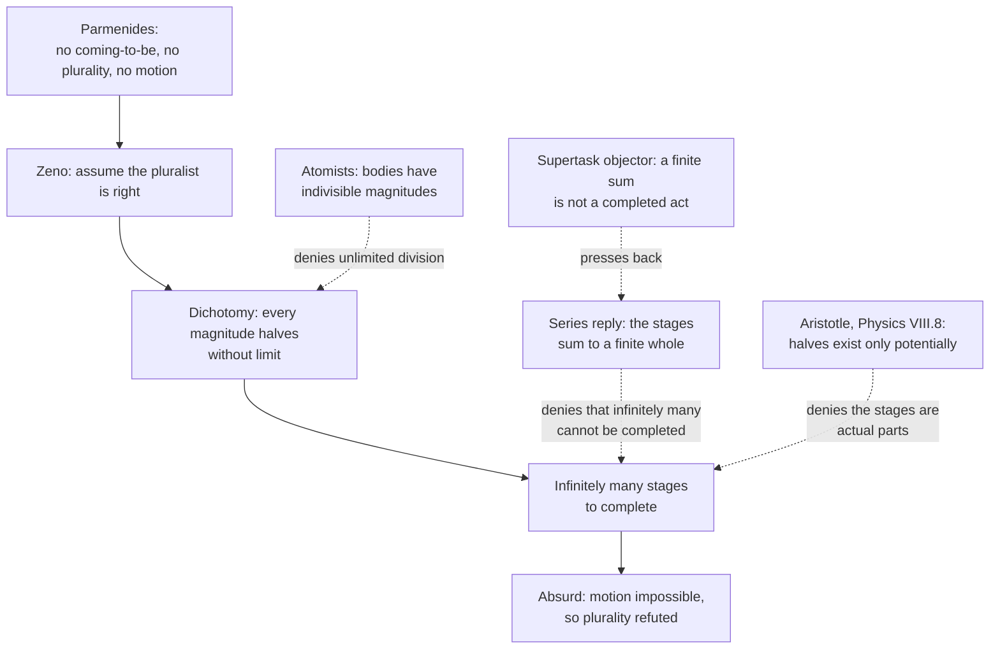

# Ancient & Medieval Philosophy · Lesson 1.2: Zeno and the atomists

> ⏱ ~15 min · Module 1: The Presocratics and the Socratic turn · Builds on: [1.1 Heraclitus and Parmenides](01-01-heraclitus-and-parmenides.md) · Unlocks: [1.3 The Sophists and Socrates](01-03-the-sophists-and-socrates.md)

## Why this matters

Parmenides left Greek philosophy with a proof that nothing comes to be, nothing moves and there is only one thing. There were two ways to respond. Zeno of Elea joined him: he did not prove Parmenides right directly, but showed that the opponents' common-sense world of many moving things fell into worse absurdities. Leucippus and Democritus found a way out: accept most of Parmenides, deny one premise, and you get atoms moving in a void. Zeno's paradoxes are the first arguments about the infinite and the continuum, and they are why calculus had to say exactly what a limit is. Atomism is the first theory to explain everything we see through unseen parts that never change.

## The idea

**Zeno's strategy is a counterattack.** In Plato's *Parmenides* (128c–d) Zeno explains his book. People mocked Parmenides by drawing absurd consequences from "all is one", so Zeno did the same to them: if there are many things, the consequences are even more absurd. That is a *reductio ad absurdum*: assume what your opponent believes, derive a contradiction or an absurdity, and conclude that the assumption was false. Zeno never had to show that motion is an illusion. His job was to show that the pluralist, who believes in motion, cannot make sense of it.

His best-known weapon is the **dichotomy**, the argument from halving. To reach the end of a racecourse you must first reach the halfway point. Before you reach the end you must cover half of the remaining distance, then half of what is left after that, and so on without end. So the run is made of infinitely many stages, and it seems that nobody can complete infinitely many things. The **Achilles** is the same argument with a moving target. Each time Achilles reaches the spot where the tortoise was, the tortoise has moved on a little. The **arrow** attacks motion from the other direction: at each instant the flying arrow simply occupies its own length of space, so at each instant it is not moving. We know all four paradoxes of motion (the fourth, the stadium, concerns rows of bodies passing each other) mainly from Aristotle, *Physics* VI.9.

**The pluralists' reply is to stay inside Parmenides' rules.** Each successor below accepts that nothing *really* comes to be or passes away; birth and death are rearrangements of what always exists:

- **Empedocles:** four eternal "roots" (earth, water, air, fire), combined by Love and pulled apart by Strife. There is no real birth, only mixing and separating.
- **Anaxagoras:** "in everything there is a share of everything" (DK 59 B11), so bread already contains flesh and bone in small amounts, and a cosmic Mind (*nous*) set the mixture in motion. Anaxagoras also held that there is no smallest amount of anything, only ever a smaller (DK 59 B3).
- **Leucippus and Democritus:** all that exists is an infinity of tiny bodies too small to see, which are **atoms** (*atoma*, "uncuttable"), and the **void** they move in. Atoms are unchanging, which satisfies Parmenides. Many atoms move through empty space, which gives back plurality and motion. The price is the void itself: it is *what-is-not*, and the atomists say it exists all the same. Democritus put it, in a later report, as "the thing is no more than the nothing" (DK 68 B156, via Plutarch).

The atomists also deny something Zeno's arguments need. If magnitude could be divided without limit, Zeno's halvings would never end. Atoms put an end to dividing bodies.

## Source

Aristotle, *Physics* VI.9, 239b (Hardie and Gaye translation, 1930):

> Zeno's reasoning, however, is fallacious, when he says that if everything when it occupies an equal space is at rest, and if that which is in locomotion is always occupying such a space at any moment, the flying arrow is therefore motionless. This is false, for time is not composed of indivisible moments any more than any other magnitude is composed of indivisibles. … The first asserts the non-existence of motion on the ground that that which is in locomotion must arrive at the half-way stage before it arrives at the goal …

Notice how Aristotle states the arrow: as a conditional with two "if" clauses. His objection here denies neither clause but an assumption behind them: that a stretch of time is *built out of* moments.

## The argument

**Zeno's dichotomy, as Aristotle reports it (*Physics* VI.9, with VI.2 and VIII.8).**

1. **To move from start to goal, the runner must first reach the halfway point.** *In words:* you can't get there without getting halfway.
2. **The same holds for every remaining stretch, without limit.** *In words:* whatever is left can be halved again, because every magnitude is divisible.
3. **So the run consists of infinitely many stages, each of which must be completed before the goal is reached.** *In words:* the halvings never run out.
4. **Infinitely many things cannot be traversed or completed in a finite time.** *In words:* an endless list of tasks cannot be finished.
5. **So nothing moves from start to goal, and motion, as the pluralist understands it, does not happen.** *In words:* the pluralist's own picture of space rules out the motion the pluralist believes in.

**The formal part.** Let the course have length 1 and let stage $n$ cover $2^{-n}$ of it. After $N$ stages the runner has covered

$$S_N = \sum_{n=1}^{N} 2^{-n} = 1 - 2^{-N}.$$

*In words:* after $N$ halvings, what is left is exactly the last piece, $2^{-N}$.

Since $2^{-N} \to 0$ as $N \to \infty$,

$$\sum_{n=1}^{\infty} 2^{-n} = 1.$$

*In words:* the infinitely many stages add up to exactly one course, no more. At constant speed each stage takes half as long as the one before, so the times add up to a finite total as well. (Geometric series: [`calc-refresher` 3.1](../../calc-refresher/lessons/03-01-series-convergence-tests.md). For what a sum of infinitely many terms *means*: [`real-analysis` 3.1](../../real-analysis/lessons/03-01-series-and-cauchy-criterion.md).)

**Does the sum answer Zeno?** Two readings, and serious readers hold each.

- **Yes, premise 4 is false.** The modern reply, built on the nineteenth-century definition of a limit, is that premise 4 appeals to a false intuition: infinitely many intervals *can* have a finite total, and the calculation proves it. Nothing more has to be finished than covering one course in a finite time.
- **No, the sum answers a different question.** The sum shows that the total *distance* and total *time* are finite. Zeno, the objector says, asked how an agent completes an infinite sequence of *acts*, each with a next one and no last one. Twentieth-century writers sharpened this into the debate over **supertasks**, performing infinitely many tasks in a finite time, where the arithmetic is agreed and the dispute remains.

Aristotle gave two replies himself. In VI.2 he said time is infinitely divisible in the same way as distance, so infinitely many parts of the distance are matched by infinitely many parts of the time. In VIII.8 he says that answer satisfies the questioner but not the truth of the matter. The deeper answer is that a continuous line contains its halves only **potentially**. They become actual divisions only if the runner stops or marks them. A runner who moves continuously crosses no infinity of actual stages. This is Aristotle's distinction between the *potential* and the *actual* infinite, and it gets its full treatment in [3.3](03-03-change-privation-potency-and-act.md).

**The arrow.** At every instant the arrow occupies a space equal to itself. What occupies a space equal to itself is at rest. The flight is composed of instants. So the arrow is at rest throughout. Aristotle denies the third premise, as the Source shows. The modern "at-at" theory, often associated with Russell, accepts that time contains instants. It denies that motion is a state a body could have *at* one instant: moving is just being at different places at different instants.

## Argument map

Solid arrows trace Zeno's reductio. Each dashed edge is a reply attacking a different step, so the replies are not rival answers to one question: they deny different premises.

## Worked examples

**Example 1 (clean: Achilles by the numbers).** Achilles runs at 10 m/s, the tortoise at 1 m/s, and the tortoise starts 100 m ahead. Zeno's stages: Achilles runs 100 m to where the tortoise was, and the tortoise has gone 10 m further. Achilles runs those 10 m, and the tortoise has gone 1 m. The gaps are $100, 10, 1, 0.1, \dots$, a geometric series with ratio $\tfrac{1}{10}$:

$$\sum_{n=0}^{\infty} 100\cdot 10^{-n} = \frac{100}{1-\tfrac{1}{10}} = \frac{1000}{9} \approx 111.1 \text{ m}.$$

Check it directly. Achilles gains 9 m every second, so he closes a 100 m gap in $\tfrac{100}{9} \approx 11.1$ s, by which time he has run $10 \cdot \tfrac{100}{9} = \tfrac{1000}{9}$ m. The two methods agree. The calculation settles *where* and *when* Achilles draws level; whether he thereby *completes a sequence of tasks* is exactly what the two readings above dispute.

**Example 2 (hard: turning Zeno against the atomists).** Zeno's argument against plurality, preserved by Simplicius (DK 29 B1–B3), runs roughly as follows. If there are many things, each is divisible. Divide it all the way through and the parts either have size or have none. Parts with no size add up to nothing. Parts with size can be divided again, and infinitely many of them add up to something infinitely large. Aristotle reports an argument of this shape as what moved the atomists (*On Generation and Corruption* I.2, 316a–b): a body cannot be divisible *everywhere at once*, or it would dissolve into points without magnitude. Their conclusion was that division stops at atoms.

The atomists accept Zeno's conditional (*if* magnitude divides without limit, plurality is absurd) and deny its antecedent, at least for bodies. This is not the same as Aristotle's reply. Aristotle keeps unlimited divisibility and denies that it is ever *actual*. So there are three positions on one premise. Zeno uses unlimited division against the pluralist. Aristotle allows it, but only potentially. The atomists deny it outright for bodies.

It strains in two places. First, how deep does "indivisible" go? Atoms have shape and size, so they have sides that can be *thought of* separately. Whether Democritus's atoms were only physically uncuttable or also conceptually indivisible is disputed among scholars. Epicurus, on a common reading, later distinguished the two; see [4.1](04-01-epicurus-atoms-the-swerve-and-death.md). Second, the atomists answer the divisibility argument, but the arrow is untouched: indivisible *bodies* say nothing about whether *time* is made of instants.

## Watch out

- **You might think Zeno believed motion never happens.** His arguments are *ad hominem* in the old, technical sense: they draw consequences from the opponent's premises. Whether Zeno also privately accepted Parmenides' conclusion is a separate question about his beliefs, not about how his arguments work.
- **You might think "infinite divisibility" means the same thing everywhere.** For Zeno it is a premise borrowed from the pluralist. For Aristotle it is real but only potential. The atomists deny it for bodies, and Anaxagoras asserts it of stuffs. "Did X accept infinite divisibility?" has no answer until you say *which kind* of divisibility and of *what*.
- **Anachronism trap: "Zeno didn't know about limits."** True, and beside the point. His question does not concern arithmetic. Whether he was *answered* by that arithmetic is exactly what is contested.
- **You might think the void is simply "empty space" in the modern sense.** For the atomists it is *what-is-not*, a claim made directly against Parmenides. It is a thesis about being, and how they defend it is Module 1's boss problem.

## One-liner

> Zeno defends Parmenides by showing that the pluralist's many moving things fall apart under infinite division; the atomists save plurality and motion by stopping division at atoms and letting what-is-not exist.

## Problems

**P1 (🟢) *(Formal (a) · Exegetical (b).)*** A runner crosses a 400 m course at a steady 8 m/s, and we count Zeno's dichotomy stages: stage 1 is the first 200 m, stage 2 the next 100 m, and so on. (a) How long do the first 10 stages take, how much distance is left after them, and what is the smallest $N$ such that $N$ stages cover at least 99.9 percent of the course? What is the total time for the whole course, and how does the series confirm it? (b) State one thing the calculation in (a) establishes against premise 4 of the dichotomy, and one question a supertask objector says it leaves unanswered. 100 words or fewer for (b).

**P2 (🟡) *(Exegetical.)*** A Democritean and a Zenonian are arguing about whether there are many things. Name the **single** premise that the atomist denies and Zeno's argument against plurality needs (Example 2), state what the atomist gains by denying it and one thing the denial leaves unanswered, and say what kind of consideration could move each side. 150 words or fewer.

**P3 (🔴, optional) *(Exegetical (a) · Evaluative (b).)*** (a) Reconstruct Zeno's arrow in numbered premises and a conclusion, working from the Source. Mark the premise Aristotle denies, and the premise the at-at theory rejects. (b) Aristotle's reply rests on his claim that time is not made of moments. Does that reply meet Zeno on ground Zeno's opponent (the pluralist) would have to accept, or does it bring in a new theory of time? Any verdict. 150 words or fewer for (b).

Solutions

**P1** *(Formal (a) · Exegetical (b).)*

**Must hit, strict (a):**
- Total time: $400 / 8 = 50$ s. Stage $n$ covers $400 \cdot 2^{-n}$ m and takes $50 \cdot 2^{-n}$ s.
- First 10 stages: $50\,(1 - 2^{-10}) = 50 \cdot \tfrac{1023}{1024} \approx 49.95$ s. Distance left: $400 \cdot 2^{-10} = \tfrac{400}{1024} \approx 0.39$ m.
- Smallest $N$: need $2^{-N} \le 0.001$. $2^{-9} = \tfrac{1}{512} \approx 0.00195$ is too big, and $2^{-10} = \tfrac{1}{1024} \approx 0.000977$ is enough. So $N = 10$.
- Confirmation: $\sum_{n\ge1} 50\cdot 2^{-n} = 50 \sum_{n\ge1} 2^{-n} = 50 \cdot 1 = 50$ s, the same as distance over speed.

**Must hit, strict (b):**
- Established: infinitely many stages have a *finite* total distance and total time, so "infinitely many cannot be traversed in finite time" is false *if it means* that the durations must add up to an infinite total.
- Left open, per the objector: whether a sequence with no last member can be *completed* as a series of acts, since the sum gives a total without identifying a final stage. Aristotle's VIII.8 potential-infinite answer is an acceptable alternative way to state the gap.

**Wrong turns:** using $2^{-9}$ for 99.9 percent (it covers only about 99.8 percent); in (b), saying the sum shows that the runner "does a last stage" (there is none); treating (b) as asking for a verdict.

**Model answer (b):** The sum shows that the durations of infinitely many stages add to a finite 50 s, so premise 4 fails if it means infinitely many intervals must take infinite time. The objector replies that Zeno's worry was different. The stages form a sequence with no last member, and a finite total says nothing about how an agent *completes* such a sequence.

---

**P2** *(Exegetical, strict on naming one premise; any accurate formulation of it passes.)*

**Must hit, strict:**
- The crux: *every magnitude (every body) is divisible without limit into parts that are themselves divisible*. Zeno's plurality argument needs it to run the division all the way down, and the atomists deny it for bodies by positing atoms.
- Gain: the division stops, so there is no dilemma between parts with no size and infinitely many sized parts. Plurality survives, made of finitely sized uncuttables.
- Left unanswered (any one): why an extended atom with sides cannot be divided even in thought; the arrow, which concerns time, not body.
- What moves each side: for the atomist, an argument that anything extended is at least conceptually divisible; for the Zenonian, a successful account of how indivisible magnitudes compose a continuum, or physical evidence of limits to division. Answers that recognize the dispute is conceptual as much as empirical earn credit.

**Wrong turns:** naming the existence of the void or of what-is-not. That is the atomists' crux with *Parmenides* (the boss problem), not with Zeno's divisibility argument. Naming "whether motion is real," which is a conclusion, not a premise. Giving Aristotle's potential-infinite view as the atomist position.

**Model answer:** Zeno's argument needs the premise that every body can be divided without limit. The atomist denies exactly that: division stops at atoms. The gain is that the dilemma never starts. The parts neither vanish into sizeless points nor multiply into an infinite magnitude, and there really are many things. What remains open is why an atom, which has size and shape and so has distinguishable sides, cannot be divided at least in thought. The atomist could be moved by a proof that whatever is extended is divisible in principle. The Zenonian could be moved by a coherent account of how indivisible magnitudes make up extended bodies without gaps or overlap.

---

**P3** *(Exegetical (a) · Evaluative (b).)*

**Must hit, strict (a):**
- P1: At every moment (instant) the arrow occupies a space equal to itself. P2: What occupies a space equal to itself is at rest. P3: The time of the flight is composed of moments. P4: What is at rest at each of the moments making up a period is at rest throughout that period. ∴ C: The flying arrow is at rest. P4 may be folded into P3 if the composition is stated.
- Aristotle denies P3: "time is not composed of indivisible moments" (239b). Credit also for adding that in VI.3 he holds that nothing is either in motion or at rest *in* a now, which undercuts P2.
- The at-at theory accepts that time contains instants. It rejects P2 (being at one place at an instant is not *resting*, since rest requires the same place over neighbouring instants) or P4 (motion is fixed by positions across instants, not at each one). Either is acceptable if explained.

**Must hit, any verdict (b):**
- State what the pluralist opponent was committed to (many things, real motion, time and space as the stage for it) and whether that included time *built from* moments.
- Say whether Aristotle's denial is independently motivated (his general account of continuous magnitude) or brought in only to escape the paradox, and give a verdict.

**Wrong turns:** reconstructing the arrow as the dichotomy; claiming that Aristotle denies P1; in (b), grading Aristotle by modern physics instead of by what the ancient disputants shared.

**Model answer (b), one of several acceptable:** Aristotle's reply is a new theory, but not an ad hoc one. Zeno's pluralist opponent was not on record as holding that time is made of indivisible nows. The arrow's force came from treating a period as a stack of instants, and Aristotle refuses to treat it that way. He applies the same account to lines, times and motions alike: a continuum is divisible without limit and never made of indivisibles. So the reply asks the pluralist to adopt a theory of the continuum, but it is the theory the dichotomy already needed. A critic can answer that this concedes Zeno's real point, that the naive picture of time was incoherent, so Zeno won the argument he was actually making.

## Connections

- **Backward:** [1.1](01-01-heraclitus-and-parmenides.md) gave Parmenides' argument that what-is cannot come from what-is-not. Zeno defends it indirectly, and every pluralist here keeps the "nothing from nothing" half of it while trying to recover plurality and change. The reductio and the move of naming the premise to deny are [`philosophical-method` 1.3](../../philosophical-method/lessons/01-03-reconstruction-and-charity.md) and [4.3](../../philosophical-method/lessons/04-03-finding-the-crux.md), put to work.
- **Forward:** Module 1's boss problem sets Parmenides' B8 against Aristotle's report of the atomists, on whether what-is-not can be. Aristotle's potential infinite and his account of change as actualizing a potency, the replies to both Parmenides and Zeno, are [3.3](03-03-change-privation-potency-and-act.md). Epicurus inherits the atoms and adds the swerve in [4.1](04-01-epicurus-atoms-the-swerve-and-death.md). Whether change and potency are real in contemporary terms is [`metaphysics` 2.2](../../metaphysics/lessons/02-02-change-act-and-potency.md).
- **Sideways:** the dichotomy is a geometric series ([`calc-refresher` 3.1](../../calc-refresher/lessons/03-01-series-convergence-tests.md)), and "the sum of infinitely many terms" only means something because of the limit definition in [`real-analysis` 3.1](../../real-analysis/lessons/03-01-series-and-cauchy-criterion.md). Defining velocity at an instant as a limit over neighbouring instants is the calculus version of the at-at reply to the arrow. Atomism as a scientific research programme continues in [`modern-philosophy`](../../modern-philosophy/syllabus.md), through the corpuscularians, and in [`philosophy-of-science`](../../philosophy-of-science/syllabus.md).
