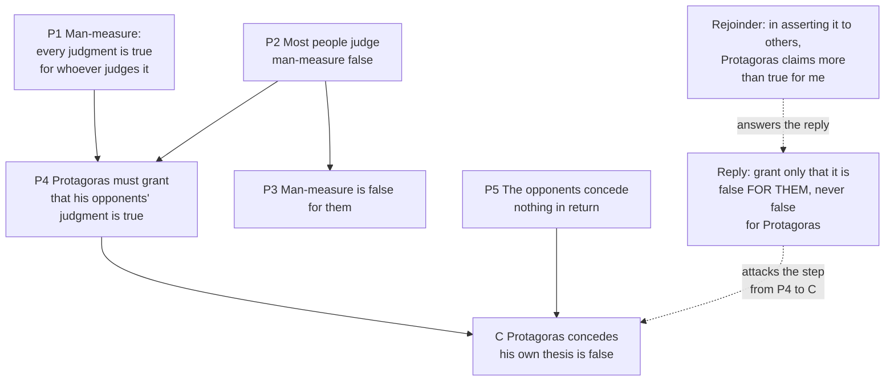

# Ancient & Medieval Philosophy · Lesson 1.3: The Sophists and Socrates

> ⏱ ~15 min · Module 1: The Presocratics and the Socratic turn · Builds on: [1.1 Heraclitus and Parmenides](01-01-heraclitus-and-parmenides.md), [1.2 Zeno and the atomists](01-02-zeno-and-the-atomists.md) · Unlocks: [2.1 The Forms, and what goes wrong with them](02-01-the-forms-and-what-goes-wrong-with-them.md)

## Why this matters

By the late fifth century BC, Athens had two new kinds of intellectual. The Sophists were paid teachers of speaking and success, and some of them doubted there was any truth beyond how things seem to each person or city. Socrates took no fees, wrote nothing, and spent his life asking people what justice or courage *is*. Plato's whole philosophy is an answer to the first group using the method of the second. You need both before the Forms in [2.1](02-01-the-forms-and-what-goes-wrong-with-them.md) make sense: the Forms are what Socrates' definitions were looking for, posited partly so that Protagoras would be wrong.

## The idea

Take a wind that one person finds cold and another finds mild. Is the wind cold? Protagoras's answer is that the question has no answer. It is cold *for* the first and mild *for* the second, and nobody is making a mistake. Now extend that from winds to everything: what is just, what is true, what is so. Every judgment is correct for the person who makes it.

The same period argued about a related split, *nomos* (law, custom, convention) against *physis* (nature). Laws and customs differ from city to city; fire burns the same in Athens and Persia. So is justice nature or convention? The answers came in three shapes. Protagoras, in Plato's telling, held that justice *is* what each city thinks and enacts, and that convention is what makes a shared human life possible. Antiphon, in a papyrus fragment of his *On Truth*, contrasts law's demands, which are agreed, with nature's, which are necessary. On that basis he advises keeping the laws when witnesses are present and following nature when they are not. Callicles in Plato's *Gorgias* (482e–484c) goes further: by nature the stronger should have more, and conventional justice is a device the weak many use to restrain them.

Socrates cuts across all of this with a demand. Before you say whether virtue can be taught, or whether justice is convention, say what virtue or justice *is*. Then test the answer. Most of his conversations end with the answer in pieces and nobody, Socrates included, claiming to know.

## Source

Plato, *Theaetetus* 171a–b (Jowett, public domain). Socrates has just argued that most people think Protagoras's doctrine false.

> SOCRATES: And the best of the joke is, that he acknowledges the truth of their opinion who believe his own opinion to be false; for he admits that the opinions of all men are true.
>
> THEODORUS: Certainly.
>
> SOCRATES: And does he not allow that his own opinion is false, if he admits that the opinion of those who think him false is true?
>
> THEODORUS: Of course.
>
> SOCRATES: Whereas the other side do not admit that they speak falsely?
>
> THEODORUS: They do not.

Watch the qualifiers. Earlier, Socrates had been careful to say things are true "to you" or "to the ten thousand others." In this stretch "true" and "false" appear bare. Whether that is a slip or a legitimate move is the whole dispute over the argument.

## The argument

**Protagoras's thesis (DK 80 B1, via *Theaetetus* 152a).** In the lesson's own translation: "Of all things the measure is man: of the things that are, that they are, and of the things that are not, that they are not." Socrates glosses it at once: things are to you such as they appear to you, and to me such as they appear to me. *In words:* there is no standing above the perceiver from which to correct how things seem to him.

**The self-refutation (*peritrope*, "turning around"), 170e–171c.**

1. **Man-measure:** whatever anyone judges is true for the one who judges it. *In words:* no belief is false for the person who holds it.
2. **Most people judge that man-measure is false.** *In words:* the ten thousand think some people are wiser than others and some opinions just wrong.
3. **So man-measure is false for them, and, since they outnumber him, "more untrue than true" (171a).** *In words:* by its own standard the doctrine loses the vote.
4. **Protagoras, holding all judgments true, must grant that his opponents' judgment is true, including their judgment that he is wrong.** *In words:* his doctrine obliges him to endorse his own refutation.
5. **The opponents grant no such thing about him.** *In words:* the concession runs one way only.
6. **So the doctrine "will be true neither to himself" nor to anyone else (171c).** *In words:* once Protagoras concedes, not even he holds it.

**The Socratic method (the elenchus).** Socrates' standard pattern, as Gregory Vlastos reconstructed it ("The Socratic Elenchus," 1983):

1. **The interlocutor asserts a thesis**, usually a definition: courage is endurance. *In words:* you say what the thing is.
2. **Socrates secures agreement to further premises** that seem independent of it: courage is noble; foolish endurance is hurtful. *In words:* you sign up for things you also believe.
3. **He shows that the premises entail the negation of the thesis.** *In words:* your beliefs, taken together, contradict each other.
4. **The interlocutor concludes, or is left to conclude, that the thesis is false.** *In words:* something has to go, and it is usually the definition.

Two Socratic theses sit behind the method. **Priority of definition:** "when I do not know the 'quid' of anything how can I know the 'quale'?" (*Meno* 71b, Jowett). *In words:* you cannot know what virtue is like until you know what it is. **Virtue is knowledge:** whoever truly knows what is best will do it, so wrongdoing is ignorance.

## Argument map

The solid arrows are Plato's argument. The dashed edges are the modern dispute. Many readers have charged that the step to C only works because "for them" was dropped. Myles Burnyeat ("Protagoras and Self-Refutation in Plato's *Theaetetus*," 1976) argued, on one common summary of his paper, that the dropping is legitimate. A Protagoras who says his thesis to others, and teaches it for a fee, is putting it forward as holding for them too. If he retreats to "true for me," he no longer has a thesis to teach.

## Worked examples

**Example 1 (clean: an elenchus in the *Meno*).** Asked what virtue is, Meno first lists virtues: a man's, a woman's, a child's. Socrates says he wants the one thing they share, as all bees are bees. Meno's second try: virtue is "the power of governing mankind" (73c–d). Run the steps.

- **Thesis:** virtue is the power to govern people.
- **Extracted premise 1:** a child and a slave can have virtue. Can a slave govern his master and remain a slave? Meno says no. So the definition leaves out cases it should cover.
- **Extracted premise 2:** governing *unjustly* is not virtue, so Meno adds "justly." But justice, Meno agrees, is *a* virtue.
- **Result:** the repaired definition uses one virtue to define virtue. It is circular: it presupposes the very thing it was supposed to explain.

Notice what the elenchus proves. It proves that Meno's beliefs are inconsistent, or his definition circular. It does not prove any positive account of virtue. Vlastos called the gap between "you are inconsistent" and "your thesis is false" the problem of the elenchus.

**Example 2 (hard: no one does wrong knowingly).** In the *Protagoras* (352b–358d), "the many" say a person can know what is best and still be overcome by pleasure, as if knowledge "were a slave, and might be dragged about anyhow" (352c, Jowett). Socrates denies this is possible.

His argument runs on a premise the many accept: good is pleasure and evil is pain. Substitute that in. "Knowing X is worse, he chose X because overcome by pleasure" becomes "knowing X brings more pain than pleasure, he chose X because of the pleasure." That is not weakness; it is a mis-measurement, like misjudging the size of a nearby object against a distant one. What saves us is a measuring art, which is knowledge. So "no man voluntarily pursues evil, or that which he thinks to be evil" (358c–d, Jowett), and so-called weakness is ignorance.

Where it strains: the argument needs the hedonist premise, and scholars dispute whether Socrates holds it or is using the many's own view against them. If he is borrowing it, the denial of *akrasia* has not been shown in his own terms. This course states the thesis. Whether *akrasia* is possible, and Aristotle's reply, belong to [`ethics` 4.2](../../ethics/lessons/04-02-aristotle-virtue-and-practical-wisdom.md).

## Watch out

- **The Socratic problem.** Socrates wrote nothing. Aristophanes' *Clouds* (423 BC) mocks him as a sophist who studies the heavens. Xenophon's *Memorabilia* gives a pious, practical moral adviser. Plato writes dialogues where "Socrates" eventually voices Plato's own metaphysics. Aristotle (*Metaphysics* XIII.4) credits Socrates with inductive arguments and universal definitions, and says he did not make those universals separate. The Socrates of this lesson is the Socrates of Plato's early dialogues. Vlastos treated that figure as historical; Charles Kahn (*Plato and the Socratic Dialogue*, 1996) argued the early dialogues are Plato's constructions too. Say "Plato's Socrates" when it matters.
- **"I know that I know nothing" is not in the *Apology*.** At 21d Socrates says the man he examined "knows nothing, and thinks that he knows; I neither know nor think that I know" (Jowett). He disclaims the *conceit* of knowledge. He does not claim to know nothing at all, and at 29b he says he knows that injustice and disobedience to a better is evil.
- **Anachronism: *arete* is not Victorian "moral virtue."** *Arete* is excellence at being what you are; a knife and a horse have it. "Virtue is knowledge" is less strange as "being excellent at living is a kind of expertise," closer to a craft than to a clean conscience.
- **"Sophist" is not yet an insult, and Protagoras is not simply a modern relativist.** "Relativism" is our label. Aristotle (*Metaphysics* IV.5) reads the doctrine as making contradictory appearances all true. The "for you" version is the *Theaetetus*'s reading, and much of what we "know" of Protagoras comes through his hostile best reader, Plato.

## One-liner

> Protagoras made every judgment true for its judge, Plato turned the doctrine on itself, and Socrates asked for a definition, then showed you could not defend yours.

## Problems

**P1 (🟢) *(Exegetical.)*** Read this passage from Plato's *Laches* (Jowett, public domain), where the general Laches has been asked what courage is.

> LACHES: I should say that courage is a sort of endurance of the soul, if I am to speak of the universal nature which pervades them all.
>
> SOCRATES: But that is what we must do if we are to answer the question. And yet I cannot say that every kind of endurance is, in my opinion, to be deemed courage. Hear my reason: I am sure, Laches, that you would consider courage to be a very noble quality.
>
> LACHES: Most noble, certainly.
>
> SOCRATES: And you would say that a wise endurance is also good and noble?
>
> LACHES: Very noble.
>
> SOCRATES: But what would you say of a foolish endurance? Is not that, on the other hand, to be regarded as evil and hurtful?
>
> LACHES: True.
>
> SOCRATES: And is anything noble which is evil and hurtful?
>
> LACHES: I ought not to say that, Socrates.

Soon after, Laches agrees that a man who dives into a well with no skill at diving is braver than a skilled diver, and that such unskilled endurance is foolish. (a) Reconstruct the first refutation as an elenchus in numbered premises (thesis, agreed premises, conclusion), and state the revised definition it forces. (b) Which premise from (a) does the diver case collide with, and what are Laches's options now? (c) Does the passage refute "courage is endurance," or only show that Laches's beliefs are inconsistent? Answer (b) and (c) in 100 words or fewer together.

**P2 (🟡) *(Exegetical.)*** Diagnose this invented argument from a seminar discussion. 150 words or fewer.

> "Every country has different laws about property, marriage, what you can say in public. None of it is written into the world; people agreed to it. What *is* in the world is that some people are stronger and cleverer than others. The rules exist because the many weak ones got together to stop the few strong ones taking what they could. So if you are one of the capable few, and you are sure no one will ever find out, you have no real reason to follow them."

(a) The argument joins two ancient positions on *nomos* and *physis*. Name them, and quote the words that carry each. (b) Protagoras also held that justice varies city to city. Name the step he would reject, and say why the fact that laws vary does not by itself get you the speaker's conclusion.

**P3 (🔴, optional) *(Exegetical (a) · Evaluative (b).)*** A defender of Protagoras writes: "Plato cheats. Protagoras grants only that his opponents' belief is true *for them*. It follows that man-measure is false for them, which Protagoras happily accepts. Nothing follows about whether it is false for Protagoras." (a) Name the step in the reconstruction above where the defender says the cheat happens, and state the crux: the single thing Protagoras and Plato must disagree about for the defender's reply to work. (b) Does the defender's reply succeed, or does Plato's argument survive it? Any verdict; you are graded on the moves. 150 words or fewer for (b).

Solutions

**P1** *(Exegetical, strict.)*

**Must hit, strict (a):**
- Thesis T: courage is (a sort of) endurance of the soul.
- P1: courage is noble. P2: foolish endurance is evil and hurtful. P3: nothing evil and hurtful is noble.
- So foolish endurance is not noble (P2, P3), so not all endurance is courage (P1), so T as stated is false.
- Revised definition, which Socrates and Laches agree to next: only *wise* endurance is courage.

**Must hit, strict (b):** the diver case makes unskilled, and so foolish, endurance *more* courageous. That collides with P1 and P2 together: courage is noble, but the foolish endurance now counted as courage was agreed to be hurtful. Laches must give up one of P1, P2, P3, or the new judgment that the unskilled diver is braver.

**Must hit, strict (c):** strictly, it shows inconsistency. The elenchus proves that T, plus the premises Laches accepts, cannot all be true. The definition falls only because Laches holds the other premises more firmly.

**Wrong turns:** listing "wise endurance is noble" as a premise that does the refuting (it sets up the revision, but P2 and P3 do the work); saying the dialogue proves courage is knowledge.

**Model answer:** (a) T: courage is endurance. P1 courage is noble; P2 foolish endurance is hurtful; P3 nothing hurtful is noble. So foolish endurance is not courage, and T is false as stated; revised: courage is wise endurance. (b) The diver case counts foolish endurance as braver, which contradicts P1 with P2. Laches must drop a premise or his verdict on the diver. (c) Only inconsistency; T goes because Laches keeps P1 to P3.

---

**P2** *(Exegetical, strict.)*

**Must hit, strict (a):**
- **Callicles** (*Gorgias*): laws are made by the weak many to restrain the naturally stronger; by nature the capable should take more. Words: "the many weak ones got together to stop the few strong ones taking what they could."
- **Antiphon** (*On Truth*): law's demands are agreed, not natural, so they bind only where you may be observed. Words: "people agreed to it" plus "sure no one will ever find out, you have no real reason to follow them."

**Must hit, strict (b):**
- Protagoras rejects the step from "justice is convention" to "there is a natural standard (the strong taking more) that convention suppresses and that gives the capable a reason to defy it." For him, what a city thinks just *is* just for it (*Theaetetus* 167c, 172a); there is no natural justice behind the laws for them to violate.
- Variation alone shows only that laws differ. The speaker's conclusion needs an extra premise: that nature supplies a standard of what one has reason to do.

**Wrong turns:** calling the whole argument Protagorean because it starts from variation; naming Thrasymachus alone without the witness-dependence that marks Antiphon (Thrasymachus for the "advantage of the stronger" strand is acceptable as a second name, but not instead of Antiphon).

**Model answer:** (a) Two strands. Callicles: rules are what "the many weak ones" built to hold back the naturally strong, and by nature the strong should take more. Antiphon: rules are merely "agreed," so their hold lasts only while you might be seen, hence "sure no one will ever find out." (b) Protagoras accepts the variation and denies the next step. For him justice just is what each city holds and enacts, so there is no natural justice standing behind the laws for the capable to follow instead. Variation shows laws differ; getting to "the strong have reason to defy them" needs a further premise, that *physis* sets a standard of reasons. That premise does the work.

---

**P3** *(Exegetical (a) · Evaluative (b).)*

**Must hit, strict (a):** the step from P4 to C (at 171a–b, "does he not allow that his own opinion is false"), where "true for them" becomes "true." The crux: whether Protagoras, in stating man-measure, asserts it as holding for others (true without qualification, or at least true for his hearers) or only as true for himself. The defender's reply needs the second.

**Must hit, any verdict (b):**
- State the reply precisely: all Protagoras concedes is relativized truth, so no conclusion about his own view follows.
- Test it against what Protagoras does: he asserts his thesis to others and teaches it. Say whether a thesis that is only "true for Protagoras" can do that job, or whether the reply can be kept without that cost. A Burnyeat-style rejoinder, hedged as one reading, earns credit as the opposing move.
- A verdict, with the step that decides it.

**Wrong turns:** answering "relativism is obviously self-refuting" without locating the qualifier; treating the number of opponents (P3) as the decisive step, when Socrates himself only calls it the doctrine being "more untrue than true."

**Model answer (b), one of several acceptable:** The reply is valid as far as it goes: from "their belief is true for them" nothing follows about what is true for Protagoras. But the reply saves the doctrine by shrinking it. Protagoras does not just record how things seem to him. He publishes a book, argues with opponents and charges fees, and all of that treats his thesis as something others ought to accept. If "man is the measure" is only true for Protagoras, it gives his students no reason to believe it. If it is true for them too, the opponents' belief binds him as Plato says. Verdict: Plato's argument survives against the Protagoras who teaches. It fails only against a Protagoras willing to say nothing to anyone. A defender who accepts that cost can keep the reply.

## Flashback

**From Lesson 1.1 (Heraclitus and Parmenides):** *(Exegetical.)* Two Heraclitus fragments in Burnet's translation (*Early Greek Philosophy*; his fr. 22 and fr. 29 are DK B90 and B94):

> **(i)** "All things are an exchange for Fire, and Fire for all things, even as wares for gold and gold for wares."
> **(ii)** "The sun will not overstep his measures; if he does, the Erinyes, the handmaids of Justice, will find him out."

(a) Which reading of Heraclitus do these support, Plato's universal flux or the measure reading, and which words in each decide it? (b) A flux reader wants to accept both fragments and still hold that nothing is stable enough to be known. What must he say the fragments hold constant, and why does that not, on his view, count as a stable object? Three sentences or fewer per part.

Solution

**Must hit, strict (a):** both support the measure reading. In (i) the decisive words are "exchange" and the trade image "wares for gold and gold for wares": a fair trade keeps value equal on both sides, so whatever turns into fire is matched by fire turning into something else. In (ii) the decisive words are "his measures" plus the enforcement by "the handmaids of Justice": the sun's share of change is fixed, and exceeding it is a wrong that gets corrected. Change is not denied in either; it is bounded by proportion.

**Must hit, strict (b):** what stays constant is a quantity or ratio, not any particular thing. Every coin and every ware changes hands, and every portion of fire is kindled or put out, so no body persists; a proportion is not a thing you can point at, and for Plato's flux reader the objects we perceive remain wholly unstable. The measure reader's rejoinder, which credit but do not require, is that the ratio just is the *logos* of B1, and Heraclitus says it holds always.

**Wrong turns:** taking (i) as evidence for flux because "all things" turn into fire. The transformation is there, but the words that answer the question are the ones that make it an *equal* exchange. Treating the Erinyes in (ii) as decoration: they are what makes "measures" a limit rather than a description.

**Model answer:** (a) Both favour the measure reading. "Exchange" and "wares for gold and gold for wares" make every transformation an equal trade, and "his measures", enforced by "the handmaids of Justice", set a limit the sun may not exceed. (b) The flux reader can say that only the proportion is conserved, while every portion of fire, sea and earth is always passing into something else. A ratio is not an object of perception, so the things we see and name still never stay the same, and that is all his reading claimed.

## Connections

- **Backward:** Plato pairs Protagoras with Heraclitus in the *Theaetetus*: if everything flows ([1.1](01-01-heraclitus-and-parmenides.md)), there is nothing stable for a judgment to be wrong about. The atomists' "by convention sweet, by convention bitter" ([1.2](01-02-zeno-and-the-atomists.md)) is the *nomos*/*physis* contrast applied to perception, with the opposite result: behind the conventions lie atoms and void, which are real.
- **Forward:** [2.1](02-01-the-forms-and-what-goes-wrong-with-them.md) is where Socratic definitions become Forms, the move Aristotle says Socrates did not make. [2.2](02-02-recollection-the-line-and-the-cave.md) opens with Meno's paradox, which is the priority of definition turned into a puzzle about inquiry. Aristotle's elenctic defence of non-contradiction in [3.1](03-01-predication-categories-and-the-syllogism.md) is aimed partly at Protagoras, and [4.3](04-03-the-skeptics.md)'s skeptics revive the conflict of appearances without Protagoras's conclusion.
- **Sideways:** the *Euthyphro* is the model Socratic definition hunt, and its dilemma is run in full in [`ethics` 6.5](../../ethics/lessons/06-05-god-and-morality-the-euthyphro-dilemma.md). Testing a definition against counterexamples is taught as a method in [`philosophical-method` 3.1](../../philosophical-method/lessons/03-01-conceptual-analysis.md). Relativism about truth as a live position belongs to [`epistemology`](../../epistemology/syllabus.md), and Callicles and Thrasymachus as political thinkers to [`history-of-political-thought`](../../history-of-political-thought/syllabus.md).
