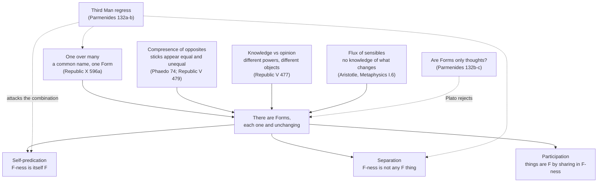

# Ancient & Medieval Philosophy · Lesson 2.1: The Forms, and what goes wrong with them

> ⏱ ~15 min · Module 2: Plato · Builds on: [1.1 Heraclitus and Parmenides](01-01-heraclitus-and-parmenides.md), [1.3 The Sophists and Socrates](01-03-the-sophists-and-socrates.md) · Unlocks: [2.2 Knowledge: recollection, the Line and the Cave](02-02-recollection-the-line-and-the-cave.md)

## Why this matters

Heraclitus said everything flows; Parmenides said real being cannot change; Socrates insisted you cannot know what justice is without a definition that never fails. Plato's Forms are his attempt to honour all three at once. The world we see changes and contradicts itself, yet there is something that does neither, and that is what knowledge and definition are about. Everything later in this course is partly a reply: Aristotle puts form back inside things, Plotinus stacks the Forms in a divine Intellect, and the medieval quarrel over universals is this lesson's question with Latin vocabulary. Plato also wrote the sharpest objection to his own theory, and it is still quoted.

## The idea

Take two sticks that look equal. Hold one against a different stick and it looks unequal. The same stick is equal and not equal, depending on what you set it beside. Yet you know perfectly well what *equal* means, and the thing you mean is never unequal to anything. So what you mean cannot be the stick.

That is the whole engine. Plato notices that the things we point at when we say "beautiful", "large", "just" or "equal" all fall short. Each is F in one respect and not-F in another. A beautiful face is ugly next to a god's; returning borrowed weapons is just, until their owner has gone mad (*Republic* I 331c). If knowledge must be of something that holds without exception, and Socrates' search for definitions (1.3) assumed exactly that, then there must be a Beautiful itself and a Just itself which are simply and always what they are. Plato calls these *eidē* or *ideai*, "looks" or "shapes". The English "Forms" is the convention.

Three more reasons converge on the same place. **One over many:** many things share a name, so there must be one thing they share. **Knowledge versus opinion** (*Republic* V 476e–480a): knowledge and opinion are different powers, so they need different objects. Knowledge is set over what fully is, and opinion over the many things that are F and also not-F. **Flux:** Aristotle reports (*Metaphysics* I.6) that Plato took from Cratylus the Heraclitean view that sensible things are always changing and cannot be known. From Socrates he took the demand for definitions, so the definitions had to be of something else.

Two relations link the Forms to things. Beautiful things are beautiful by **participation** in the Beautiful. In the *Phaedo* (100d) Socrates says it is "the presence and participation of beauty" and admits he is unsure of the manner. And the Forms are **separate**: not identical with, nor located in, any participant. Aristotle makes separation the point of difference from Socrates, who sought universal definitions but did not make them exist apart (*Metaphysics* XIII.4).

## Source

Plato, *Phaedo* 74a–c (Jowett). Socrates is speaking with Simmias:

> And shall we proceed a step further, and affirm that there is such a thing as equality, not of one piece of wood or stone with another, but that, over and above this, there is absolute equality? Shall we say so?
>
> Say so, yes, replied Simmias, and swear to it, with all the confidence in life. …
>
> Or look at the matter in another way:—Do not the same pieces of wood or stone appear at one time equal, and at another time unequal?
>
> That is certain.
>
> But are real equals ever unequal? or is the idea of equality the same as of inequality?
>
> Impossible, Socrates.
>
> Then these (so-called) equals are not the same with the idea of equality?
>
> I should say, clearly not, Socrates.

Jowett's "at one time … at another time" is an interpretive choice. The Greek dative can be read "equal to one, unequal to another", meaning to one observer or when compared with one thing.

## The argument

**A. One over many** (*Republic* X 596a, where Socrates calls it "our usual manner"; Jowett).

1. "Whenever a number of individuals have a common name, we assume them to have also a corresponding idea or form." *In words:* shared names are not accidents, and something one answers to each of them.
2. Each such group of things is many. *In words:* this bed, that bed, the bed in the next room.
3. So for each shared name there is one Form, distinct from the many things that bear the name. *In words:* "bed" names one thing over and above all the beds.

**B. The equal itself** (*Phaedo* 74a–c).

1. There is such a thing as the equal itself, and we know it. *In words:* Simmias will swear to it; our grasp of "equal" is real knowledge.
2. Sensible equals, the same sticks and stones, appear equal and also unequal. *In words:* every equal thing you can see is also, some way, not equal.
3. The equal itself is never unequal. *In words:* equality cannot be inequality.
4. Things that differ in what can be true of them are not the same thing. *In words:* this is the logical hinge (Leibniz's law, anachronistically named).
5. So the equal itself is not any sensible equal. *In words:* what you know when you know "equal" is something no stick is.

The *Phaedo* goes on (74d–75b) to use the conclusion for recollection. Sensible equals "fall short", so we must have known equality before we saw them. That is [2.2](02-02-recollection-the-line-and-the-cave.md)'s business.

## Argument map

Four independent routes lead in, and three commitments come out. The dashed edges show where Plato himself puts pressure on the theory in the *Parmenides*. The regress needs all three dashed targets at once.

## Worked examples

**Example 1 (clean: running the compresence argument on "double").** *Republic* V 479b supplies the case: "the many which are doubles" are "also halves … doubles, that is, of one thing, and halves of another." Take the number of sticks in a bundle of four.

- Four sticks are double two sticks and half of eight. So the bundle is double and not double.
- The double itself is never half of anything, since double is not the same as half.
- So the double itself is not the bundle, or any doubled thing. Premise B4 does the work.

Notice what the argument needs. It needs a predicate that comes with an opposite and applies *relatively*: double/half, large/small, equal/unequal, beautiful/ugly, just/unjust. For these, nothing sensible is F without also being not-F, so the gap between the things and the Form opens without further effort. The one-over-many argument needs only a shared name. Keep the difference in mind; P3 turns on it.

**Example 2 (hard: self-predication and the regress).** Plato's language often treats a Form as a perfect *instance* of itself. Socrates in the *Protagoras* (330c–e) is ready to say that justice is just. The *Phaedo* (100c) speaks of anything beautiful "other than absolute beauty", as if absolute beauty were the first beautiful thing. Call this **self-predication**: the F itself is F. It is attractive, since it explains how a Form can be a standard things "fall short" of. It is also what the *Parmenides* goes after.

In the dialogue a young Socrates meets the aged Parmenides, who draws the regress at 132a–b (Jowett renders "large" as "great"). You posit Greatness because many great things share one character. Now look at Greatness together with the great things. If Greatness is itself great, the same reasoning that gave you one Form over the many now gives you another Greatness over *that* group. Then another, and so on, so "each idea instead of being one will be infinitely multiplied." Socrates' first escape is that the Forms may be thoughts in minds, and Parmenides blocks it at once. A thought must be a thought of something.

Aristotle calls this kind of regress "the third man" (e.g. *Metaphysics* I.9), and the name stuck to the *Parmenides* passage. Gregory Vlastos, in "The Third Man Argument in the *Parmenides*" (1954), argued that the regress runs only on premises Plato never stated. Besides one over many and self-predication, it needs *non-identity*: whatever is F by sharing in a Form is not that Form. Vlastos held that these premises are jointly inconsistent, not merely regress-generating. That made the argument a record of Plato's honest perplexity rather than a refutation he had answered. His reading set the terms of a long debate over whether Plato was really committed to self-predication.

Which premise a defender of the Forms should give up, and what giving it up costs the four routes in, is Boss problem 2. Do the reconstruction there.

## Watch out

- **You might think a Platonic "idea" is something in the mind.** *Idea* and *eidos* mean "look" or "shape". In the *Parmenides* (132b–c) Plato has Socrates try the mental reading and drop it. "Ideas" in Locke's sense is an anachronism.
- **You might think the Forms are just "universals".** "Universal" (*katholou*) is Aristotle's term. Calling Forms universals imports his picture, in which a universal is what is predicated of many. Plato's Forms are also *paradigms*, standards that things resemble and fall short of. Self-predication lives in that second role. Whether universals exist, as a live question, is [`metaphysics` 1.3](../../metaphysics/lessons/01-03-universals-the-realists-case.md) and [1.4](../../metaphysics/lessons/01-04-nominalism-and-tropes.md). This lesson does not argue it.
- **You might read "opinion" (*doxa*) as weakly justified belief about the same things knowledge is about.** *Republic* V distinguishes the two powers by what they are set over. That is exactly why the argument yields separate objects. *Episteme* is also not justified true belief; see [2.2](02-02-recollection-the-line-and-the-cave.md).
- **You might think the *Parmenides* shows Plato abandoned the Forms.** Dialogues usually dated later, such as the *Timaeus*, still use them, and scholars divide over whether the objections were meant to be answered, to revise the theory, or to train the reader.

## One-liner

> Nothing we see is simply equal, beautiful or just, so what we know when we know those things must be something that is: the Form. Make that Form a perfect instance of itself, and it multiplies without end.

## Problems

**P1 (🟢) *(Exegetical.)*** Use the *Phaedo* passage in **Source**. (a) Quote the words that state premise B2 and the words that state premise B3. (b) B2 is about how the sticks *appear*; B3 is about what the equals *are*. Name the exact words where the passage shifts from one to the other, and say in one or two sentences what an objector could do with that shift. (c) Which sentence states the conclusion, and what does "(so-called)" add? 100 words or fewer in total.

**P2 (🟡) *(Exegetical (a) · Evaluative (b).)*** In *Republic* V (Jowett), Socrates asks the lover of sights

> "whether, of all these beautiful things, there is one which will not be found ugly; or of the just, which will not be found unjust; or of the holy, which will not also be unholy?"

and is told that "the beautiful will in some point of view be found ugly; and the same is true of the rest." (a) Reconstruct the argument of 476e–480a that knowledge and opinion have different objects, in numbered premises in Plato's terms (powers, what they are set over, what is, what is not). Show where this passage enters. (b) Flag the weakest premise and say why, any verdict. 150 words or fewer for (b).

**P3 (🔴, optional) *(Exegetical (a) · Evaluative (b).)*** At *Parmenides* 130c–d, Socrates readily grants Forms of the just, the beautiful and the good. He is undecided about man, fire and water. He denies Forms of "hair, mud, dirt", since "visible things like these are such as they appear to us", though he admits he is sometimes tempted to think "there is nothing without an idea". Parmenides tells him that when philosophy has a firmer grasp of him he will "not despise even the meanest things". (a) For each of the reasons for Forms in this lesson (one over many, compresence of opposites, knowledge and opinion, flux), say whether it yields a Form of mud, and which one Socrates' stated reason shows he is relying on. (b) Is Socrates' line drawn in a principled place, or is Parmenides right that his reasons commit him further? Any verdict. 150 words or fewer for (b).

Solutions

**P1** *(Exegetical, strict.)*

**Must hit, strict:**
- (a) B2: "Do not the same pieces of wood or stone appear at one time equal, and at another time unequal?" B3: "are real equals ever unequal?" (With "is the idea of equality the same as of inequality?" as its restatement; "Impossible" is the assent.)
- (b) The shift is at "But are real equals ever unequal?": B2 said "appear", and B3 says "are". An objector can grant the sticks *appear* unequal but deny they *are* unequal: a stick equal in length to one and not another is not both equal and unequal in the same respect. Then no sensible thing is shown to differ from equality in what is true of it, and B4 has nothing to act on. Alternatively, the equal itself is shown only never to *be* unequal, not never to *appear* so, so the comparison is not like with like.
- (c) "Then these (so-called) equals are not the same with the idea of equality?" "(So-called)" marks that the sticks are only called equal. They fall short of being what the name names, which anticipates 74d.

**Wrong turns:** quoting Simmias's oath as B2 (that is B1); reading the shift as merely stylistic.

**Model answer:** (a) B2: "appear at one time equal, and at another time unequal"; B3: "are real equals ever unequal?" (b) "are real equals ever unequal" moves from appearing to being. An objector can say the sticks only appear unequal, or are unequal to something else, and are not both in one respect, so no difference from the equal itself is shown. (c) "Then these (so-called) equals are not the same with the idea of equality"; "so-called" signals they merely bear the name.

---

**P2** *(Exegetical (a) · Evaluative (b).)*

**Must hit, strict (a):**
- P1. Knowledge is of what is; what is not cannot be known (477a).
- P2. Powers are distinguished by what they are set over and what they accomplish (477c–d).
- P3. Knowledge and opinion are different powers, since one is infallible and the other errs (477e).
- P4. So they are set over different things (478a–b).
- P5. Opinion is not of what is not, since an opinion is always of something; and it is not of what is (by P1, P4). So it is of what is intermediate, what both is and is not (478b–e).
- P6. Each of the many beautiful things is also ugly, each just thing also unjust, and so on (479a–b: **this passage**). So the many things both are and are not.
- C. The many beautifuls are objects of opinion; only the Beautiful itself, which is and is not otherwise, is an object of knowledge (479d–480a).

**Must hit, any verdict (b):** name one premise and give a reason that bears on the argument. The strongest candidates are P2 (why should different powers need wholly different objects rather than different grasp of the same objects?) and the equation in P6 of "is F and not-F" with "is and is not". The second slides between predicative "is" (is beautiful) and existential "is" (exists), unless "is" is read throughout as "is F" or as "is true".

**Wrong turns:** treating P3 as a modern claim about degrees of justification; leaving out the intermediate step (P5), without which the passage has nowhere to plug in.

**Model answer (b), one of several:** P2 is weakest. It individuates powers by their objects, and the conclusion depends on it. But sight and touch both reach the same apple. Why couldn't knowledge and opinion be two grips on the same beautiful things, one secure and one not? Plato's reply, if any, would come from P6. What opinion grasps as simply beautiful is not simply beautiful, so a grip that never errs could not be on *that*. Whether that rescues P2 or replaces it is exactly the issue. A reader who instead flags the "is" of P6 has an equally good answer, if the equivocation is shown.

---

**P3** *(Exegetical (a) · Evaluative (b).)*

**Must hit, strict (a):**
- **One over many:** yes. "Mud" is a common name, and *Republic* X applies the principle even to beds.
- **Compresence:** no. Mud is not mud-and-not-mud from different points of view, so no gap between the thing and a Form opens.
- **Knowledge and opinion:** only if mud is an object of knowledge at all. The argument supplies Forms where the many things are F and not-F, which mud is not.
- **Flux:** arguably yes. Sensible mud changes, so any knowledge of what mud is would need an unchanging object.
- Socrates' stated reason, "such as they appear to us", is the compresence reason. For mud, appearance and being do not come apart, so nothing calls for a Form.

**Must hit, any verdict (b):** say which reason each side is relying on (Socrates: compresence; Parmenides: one over many, or flux); state what extending the Forms to mud costs, or what restricting them costs (e.g. Aristotle's complaint in *Metaphysics* I.9 that the arguments yield Forms the Platonists do not want); give a verdict.

**Wrong turns:** answering from disgust ("mud is too lowly"), which is the attitude Parmenides rebukes, not a reason; treating the four reasons as one.

**Model answer (b), one of several:** The line is principled if the Forms are posited to close gaps between appearance and being. Mud has no such gap, and justice does. But that makes the theory a theory of opposites and relatives only, and gives up the one-over-many route. *Republic* X, using that route, posits a Form of bed. Parmenides' teasing points to exactly that inconsistency. So Socrates must either narrow his reasons or accept Forms of mud. I judge the narrowing cheaper, since compresence is the argument that does real work in the *Phaedo* and *Republic* V. But it leaves knowledge of what mud is without an object.

## Flashback

**From Lesson 1.2 (Zeno and the atomists):** *(Exegetical.)* Four invented speakers on what happens if you keep halving a copper rod:

> **(i)** "The pieces just keep getting smaller, and every one of them is still copper. There is no smallest piece, only ever a smaller one."
> **(ii)** "Sooner or later you reach bits that no cut could divide, however fine the blade. Division stops there."
> **(iii)** "The rod does not contain a million halves waiting to come apart. They are there only in the sense that you *could* cut there. Until you do, it is one continuous rod."
> **(iv)** "Grant that you can halve forever. The pieces, a half, a quarter, an eighth and so on, add up to exactly one rod, so nothing absurd follows."

(a) Match each speaker to the position from 1.2 it borrows, and say what that position does with unlimited divisibility. (b) Which speaker hands Zeno the premise his argument needs without saying how to escape it? Which two keep unlimited divisibility and still resist Zeno, and what step does each deny? Three sentences or fewer per part.

Solution

**Must hit, strict (a):** (i) Anaxagoras: there is no smallest, only a smaller (DK 59 B3), so unlimited divisibility is *asserted*, of stuffs. (ii) Leucippus and Democritus: division of bodies stops at atoms, so unlimited divisibility is *denied*. (iii) Aristotle (*Physics* VIII.8): the halves exist only potentially, so unlimited divisibility is *allowed, but never actual*. (iv) the modern series reply: unlimited division is *granted*, and the infinitely many parts have a finite sum.

**Must hit, strict (b):** (i) grants exactly what Zeno borrows from the pluralist and, in what we have, offers no way out of it. (iii) and (iv) both keep unlimited divisibility. (iii) denies that the halves are actual parts or stages, so no actual infinity has to be gone through. (iv) denies the premise that infinitely many stages or parts cannot be completed or add up to something finite. They deny different steps, so they are not two versions of one reply.

**Wrong turns:** matching (iii) to the atomists because both stop something. The atomist stops division itself, while (iii) keeps it possible and only denies that it is actual. Treating (iv) as settling everything: a supertask objector grants the sum and says it does not show how infinitely many *acts* get completed.

**Model answer:** (a) (i) is Anaxagoras, who asserts unlimited divisibility of stuffs. (ii) is the atomists, who deny it for bodies. (iii) is Aristotle, who allows it only potentially, and (iv) is the series reply, which grants it and sums the parts. (b) Speaker (i) gives Zeno his premise with no escape offered. (iii) denies that the halves are actual stages, and (iv) denies that infinitely many parts cannot make a finite, completed whole.

## Connections

- **Backward:** the Forms take [1.1](01-01-heraclitus-and-parmenides.md)'s two giants seriously at once. Heraclitus is right about what we see; Parmenides is right that what truly is does not change. The object of knowledge is the object of Socrates' "what is F?" question in [1.3](01-03-the-sophists-and-socrates.md), now given a home. Reconstructing a dialogue argument in the thinker's terms is [`philosophical-method` 1.3](../../philosophical-method/lessons/01-03-reconstruction-and-charity.md).
- **Forward:** [2.2](02-02-recollection-the-line-and-the-cave.md) asks how we could know the Forms, taking up the *Phaedo*'s next step (recollection), the Line and the Cave. [2.3](02-03-the-soul-its-parts-and-immortality.md) uses a soul akin to the Forms. Aristotle's rejection of separate Forms is [3.4](03-04-substance-and-essence.md), and Boss 3 asks for the crux between Plato and him. Plotinus relocates the Forms in Intellect in [4.4](04-04-plotinus-the-one-intellect-and-soul.md), and Porphyry's questions in [8.1](08-01-porphyrys-questions-universals-to-aquinas.md) reopen this lesson's problem for the Middle Ages.
- **Sideways:** transcendent realism about universals is defended against its rivals in [`metaphysics` 1.3](../../metaphysics/lessons/01-03-universals-the-realists-case.md), whose Boss 1 reads the sail dilemma from the same *Parmenides* page. The claim that the number 2 is not any pair of things descends from the *Phaedo*'s argument; its modern form is [`metaphysics` 1.2](../../metaphysics/lessons/01-02-abstract-objects.md). Whether knowledge requires unchanging objects, as a live question, is [`epistemology`](../../epistemology/syllabus.md)'s.
