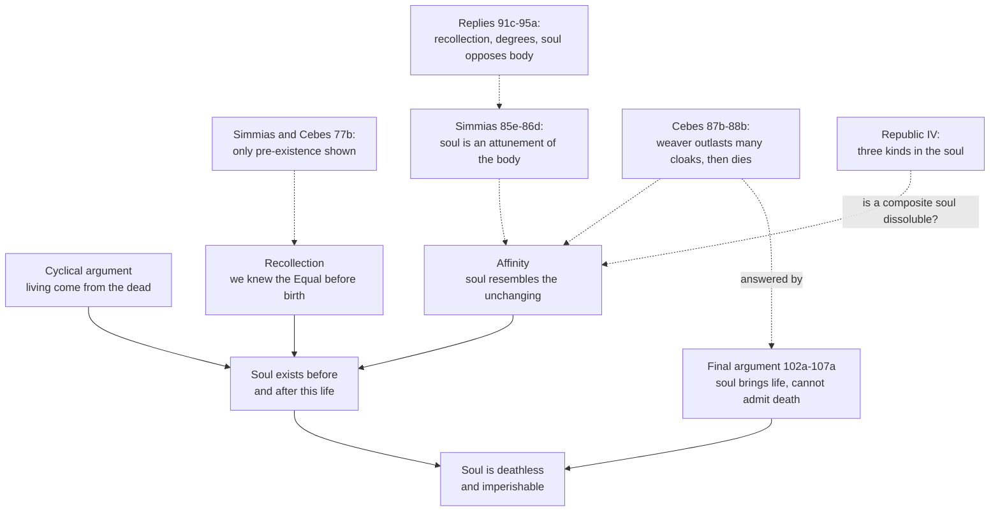

# Ancient & Medieval Philosophy · Lesson 2.3: The soul: its parts and its immortality

> ⏱ ~15 min · Module 2: Plato · Builds on: [2.1 The Forms, and what goes wrong with them](02-01-the-forms-and-what-goes-wrong-with-them.md), [2.2 Knowledge: recollection, the Line and the Cave](02-02-recollection-the-line-and-the-cave.md) · Unlocks: [3.1 Logic: predication, the categories and the syllogism](03-01-predication-categories-and-the-syllogism.md)

## Why this matters

Plato's Forms need a knower, and 2.2 made the knower a soul that recollects what it saw before birth. So two questions follow. Does that soul outlast the body? And if it is one thing, why does it so often fight itself? The *Phaedo* answers the first with four arguments, and the *Republic* answers the second by dividing the soul. Every later theory of the soul, from Aristotle's *De Anima* to Aquinas and Descartes, starts by accepting or refusing one of these two moves. The two answers also pull against each other.

## The idea

First, drop the modern word. Plato's *psyche* is not "consciousness" or "the self". It is **what makes a living thing alive**. A body with *psyche* moves, feeds and perceives, and a body without it is a corpse. The Greeks' ordinary fear, which Cebes voices in the *Phaedo* (70a), was that at death the soul scatters "like breath or smoke". The question is whether the life-principle survives the death of what it animates.

The *Phaedo* is set in prison on Socrates' last day. He argues with two Thebans, Simmias and Cebes, who had heard the Pythagorean Philolaus (61d–e), and each argument answers a doubt raised against the last. Watch the pattern. The arguments are not stacked in parallel. Each one patches the hole the previous one left.

The *Republic* asks something else. A man is thirsty and refuses to drink. If the soul were a single simple thing, it would be going for and away from the same drink at once. Plato treats that as impossible, and concludes that there must be more than one source of motivation in the soul. The *Phaedo* had set the soul against the body. The *Republic* moves the battle inside the soul.

## Source

Plato, *Republic* IV 436b (Jowett, public domain):

> The same thing clearly cannot act or be acted upon in the same part or in relation to the same thing at the same time, in contrary ways; and therefore whenever this contradiction occurs in things apparently the same, we know that they are really not the same, but different.

The principle has three qualifiers: same part, same relation, same time. The division of the soul can go through only if all three are shown to hold in the cases it uses.

## The argument

**A. The *Phaedo*'s four arguments, in order.**

- **Cyclical (70c–72e).** Whatever has an opposite comes to be from that opposite: larger from smaller, waking from sleeping. Being alive and being dead are opposites, so the living come from the dead, and souls must exist somewhere in between. If coming-to-be did not go round in a circle, everything would end up dead (72b–d).
- **Recollection (72e–77a).** 2.2's theory, run on the equal sticks of [2.1](02-01-the-forms-and-what-goes-wrong-with-them.md). We judge sticks deficiently equal, so we already knew the Equal itself, and we knew it before perception began, that is, before birth. Socrates says the Forms and the soul's prior existence stand or fall together (76e). Simmias and Cebes object that this proves the soul existed *before* birth, not that it survives death (77b–c).
- **Affinity (78b–84b).** There are two kinds of things, the visible and changing and the invisible and unchanging, and the soul is more like the second kind. Problem 2 asks you to reconstruct it.
- **Final argument (102a–107a),** the reply to Cebes, set out below.

**The final argument.**

1. **Some things that are not themselves opposites always bring an opposite into whatever they occupy.** Fire brings heat, snow brings cold, three brings oddness (103c–105b). *In words:* besides "hot is hot because of Heat", there is a subtler cause: "hot because of fire".
2. **Such a thing cannot admit the opposite of what it brings.** When heat advances, snow either withdraws or perishes. It never stays and becomes hot snow (103d–e). *In words:* "hot snow" is not a rare kind of snow. It cannot exist.
3. **Soul, whatever it occupies, always brings life** (105c–d). *In words:* this is just what *psyche* means. It is the life-principle, not a passenger in the body.
4. **Death is the opposite of life** (105d).
5. **So soul does not admit death. It is deathless (*athanatos*)** (105e). *In words:* a dead soul is a contradiction, like hot snow.
6. **What is deathless is also imperishable (*anolethron*).** This is agreed on the ground that God and "the form of life itself" never perish (106d). *In words:* whatever cannot be dead cannot cease to exist either.
7. **So when death approaches, the soul withdraws unharmed and does not perish** (106e).

Step 6 is where readers since antiquity have pressed. Socrates himself raises the snow parallel (106a–c): *if* the not-cold were imperishable, snow would withdraw rather than melt. So "cannot be dead while it exists" (5) is a weaker claim than "cannot stop existing" (7). The argument's own text shows that it needs 6.

**B. *Republic* IV: the division (436b–441c).**

1. **Principle of opposites:** the same thing cannot do or undergo opposites in the same part, in relation to the same thing, at the same time (436b). *In words:* genuine opposition in one subject means two subjects.
2. **Going for something and rejecting it are opposites** (437b–c). *In words:* pursuing and avoiding are as opposed as pushing and pulling.
3. **Thirst, as thirst, is for drink simply, not for *good* drink** (437d–439a). *In words:* appetite is not already a judgment about the good. Without this premise, the conflict could be read as one desire for the good weighing two options.
4. **Some thirsty people refuse to drink** (439c). *In words:* the opposition is real, not a change of mind over time.
5. **So what urges and what forbids are distinct: appetite (*epithumetikon*) and reason (*logistikon*)** (439d).
6. **Anger can fight appetite,** as in Leontius (439e–440a), **so spirit (*thumoeides*) is not appetite.**
7. **Spirit appears in children and animals before reason does, and reason can rebuke it,** as when Homer's Odysseus strikes his breast and tells his heart to endure (441a–c). **So spirit is not reason.**

∴ **There are three kinds in the soul.** *In words:* reasoning, spirited indignation and bodily craving are three distinct sources of motivation, because each has been caught opposing another.

For how the three parts map onto the three classes of the city, see [`history-of-political-thought`](../../history-of-political-thought/syllabus.md) 1.1. This lesson reads the division as psychology only.

## Argument map

Solid arrows show support. Dashed arrows show objections, replies and tensions. The bottom edge links the two dialogues and is the subject of Example 2.

## Worked examples

**Example 1 (clean: running 436b).** A hiker has been walking for hours and is parched. She reaches a stream and stops herself, because upstream there is a dead sheep in the water. Run the principle.

- *Same thing?* One soul, hers.
- *Same time?* Yes. The urge and the refusal happen at once. She does not want the water and then, later, stop wanting it.
- *Same object?* Yes, this water, now.
- *Opposites?* Yes, going for it and holding back from it (premise 2).

By 436b, then, what urges and what forbids are two different things. The urge is appetite, and the refusal comes from reasoning about what the water will do to her. Premise 3 is what blocks a rival reading, on which she has a single desire for what is good and is weighing two considerations. Plato insists that thirst as such wants *drink*, not healthy drink. The "healthy" qualification comes from somewhere else.

Now compare cases the principle does *not* divide. She wants the water cold but not salty: that is a different respect, so it proves nothing. She wants it now but not after she remembers the sheep: that is a different time. Socrates himself shows how to dissolve false oppositions. A spinning top stands still at its axis and moves at its circumference, and these are different parts (436d–e). So the principle has slack. The division is only as good as the claim that no redescription could remove the opposition.

**Example 2 (hard: can a divided soul be immortal?).** The affinity argument ties survival to being incomposite, since composite things are the ones that come apart (78c). *Republic* IV makes the soul threefold. So the two dialogues seem to pull against each other.

The texts themselves suggest three ways the tension is handled, and readers disagree about which is Plato's:

- **The conflict belongs to embodiment.** In the *Phaedo*, cravings and fears are the body's, and they fill the soul (66c). *Republic* X (611b–612a) says we see the soul only as the sea-god Glaucus is seen, encrusted with shells and weed. It leaves open whether the soul's true nature has many forms or one. On this reading, the parts are what the soul looks like in a body.
- **Only reason is immortal.** The *Timaeus* gives spirit and appetite to a "mortal kind" of soul housed in the body. Only the rational kind is immortal.
- **Plato changed his mind.** On a developmental reading, the *Republic* revises the *Phaedo*'s simple soul, and no single doctrine unites the two.

Look at what the *Phaedo* already contains, too. Socrates' third reply to Simmias (94b–e) uses a thirsty person who does not drink, which is the *Republic*'s own case, to show that the soul opposes the body. The same observation proves a soul distinct from the body in one dialogue and a divided soul in the other. Which reading is right is exegetical and disputed. Whether any soul survives death is not this course's question. The live debate is in [`metaphysics` 6.5](../../metaphysics/lessons/06-05-what-a-person-is.md) and [`philosophy-of-mind`](../../philosophy-of-mind/syllabus.md), and immortality as Catholic doctrine is in [`creation-grace-last-things`](../../creation-grace-last-things/syllabus.md).

## Watch out

- **You might think the *Phaedo* argues that consciousness survives.** *Anachronism trap.* *Psyche* is the principle of life, and the final argument depends on that: premise 3 would be false of "consciousness", which does not make a body alive. Read "soul" as "self-aware mind" and step 3 stops being true by definition.
- **You might think Simmias's "harmony" is a tune.** A *harmonia* is an attunement: the right tension and blend of a lyre's strings, or of the body's hot, cold, dry and wet (86b–c). It is not a melody floating above the strings. It is also not "functionalism" or "epiphenomenalism". Those resemblances are real, but the labels import a modern physics the dialogue does not have.
- **You might think the three parts are three little people.** Plato calls them "kinds" (*eide*, *gene*) as often as "parts". Some readers press that he makes them agent-like, since reason "rules" and spirit "allies" with it, and that this invites a regress of homunculi. Others read the parts as three sources of desire, each with its own kind of object (truth, honour, bodily satisfaction). The dispute is open, so present the metaphor as a metaphor.
- **You might think recollection alone proves immortality.** By the text's own admission it proves pre-existence (77b–c). Socrates asks that it be combined with the cyclical argument (77c–d).

## One-liner

> For Plato the soul is the life of the body, so it cannot admit death, and it fights itself, so it has parts; much of his later reception turns on how those two claims fit.

## Problems

**P1 (🟢) *(Exegetical.)*** Read *Republic* IV 439e–440a (Jowett):

> The story is, that Leontius, the son of Aglaion, coming up one day from the Piraeus, under the north wall on the outside, observed some dead bodies lying on the ground at the place of execution. He felt a desire to see them, and also a dread and abhorrence of them; for a time he struggled and covered his eyes, but at length the desire got the better of him; and forcing them open, he ran up to the dead bodies, saying, Look, ye wretches, take your fill of the fair sight.
>
> I have heard the story myself, he said.
>
> The moral of the tale is, that anger at times goes to war with desire, as though they were two distinct things.

(a) Which two kinds in the soul does the passage set against each other, and which words fix that it is *not* reason against appetite? (b) Why does Socrates need this story after the thirsty man (439c) has already been told? (c) Which words show the conflict meets the "same time" condition of 436b? 100 words or fewer in total.

**P2 (🟡) *(Exegetical, then a small evaluative step.)*** Here is the lesson's paraphrase of the affinity argument (*Phaedo* 78b–80b). What is composite is liable to be broken up, and what is incomposite is not. Things that are always the same (the Equal itself, the Beautiful itself) are the likeliest to be incomposite, and they are invisible. Changing things are visible. The soul is invisible and the body visible. When the soul investigates through the body it is dragged into the changing, and when it investigates by itself it goes to the unchanging and stays with it. In a living being the soul rules and the body serves, as the divine rules and the mortal serves. So the body is quickly dissoluble, and the soul is indissoluble, or nearly so. Reconstruct the argument in numbered premises in Plato's terms, flag the weakest premise, and say which of the two objections at 85e–88b exploits exactly that premise. 150 words or fewer.

**P3 (🔴, optional) *(Exegetical (a) · Evaluative (b).)*** Simmias gives up the harmony view at 92c–e because it conflicts with recollection, which he accepts. A harmony theorist who rejects recollection would not be moved by that. (a) State the two premises of Socrates' *third* reply (94b–e) that together rule out the soul being an attunement. (b) Name the one premise such a theorist should deny, and say what that denial costs, including what it does to the *Republic* IV argument from the thirsty man. Any verdict. 150 words or fewer in total.

Solutions

**P1** *(Exegetical — strict.)*

**Must hit, strict:**
- (a) **Spirit (anger) against appetite.** The deciding words are "anger at times goes to war with desire", and in the story itself Leontius's "dread and abhorrence" is set against his "desire to see them". He also rebukes his own eyes ("Look, ye wretches"). That is indignation aimed at the craving, not a calculation about what is good.
- (b) The thirsty man separated **reason** from **appetite** only. A second source of opposition to appetite is needed to show that spirit is not appetite. That spirit is not reason is argued separately afterwards (children and animals, Odysseus, 441a–c).
- (c) "for a time he struggled and covered his eyes": desire and disgust are present together while he struggles. He does not stop wanting and then start again.

**Wrong turns:** reading Leontius's disgust as *reason*. The text calls it anger, and Socrates then argues that spirit *allies* with reason, which would make no sense if they were the same thing. Another wrong turn is saying the story proves three parts. It proves only that spirit is distinct from appetite.

**Model answer:** (a) Spirit against appetite: "anger at times goes to war with desire", with "dread and abhorrence" opposed to "desire to see". (b) The thirsty man divided reason from appetite. Leontius is needed to show a second non-appetitive source, spirit, and its distinctness from reason is argued later. (c) "for a time he struggled and covered his eyes": the desire and the revulsion hold at once.

---

**P2** *(Exegetical, strict on the reconstruction · evaluative step on the weakest premise, any defensible choice with the reason given.)*

**Must hit, strict:**
- Premises that cover: composite things are dissoluble and incomposite things are not; the unchanging is invisible and incomposite, and the changing is visible; the soul is invisible, or akin to the unchanging (the investigation point), and rules as the divine does; the body is visible and changing. The conclusion is hedged as in the text: indissoluble, **or nearly so**.
- A weakest premise, flagged. The standard choice is the inference from *resembling* the unchanging to *sharing its indissolubility*. Likeness in one respect (invisibility, kinship with Forms) does not carry over another property.
- **Both objections exploit it, each differently.** Simmias: an attunement is invisible and "divine" too, yet it perishes before the lyre. Cebes: kinship could make the soul longer-lasting than the body without making it everlasting. For full credit, name at least one and say how it uses the likeness step.

**Wrong turns:** dropping "or nearly so", which overstates what Socrates claims. Flagging "the Forms are unchanging", which both interlocutors grant and which neither objection attacks.

**Model answer (one of several acceptable):** P1. The composite can be dissolved, and the incomposite cannot. P2. What is always the same is incomposite and invisible, and what changes is composite and visible. P3. The soul is invisible, is at home with the unchanging, and rules the body as the divine rules the mortal. P4. The body is visible and changing. P5. So the soul is like the unchanging and the body like the changing. ∴ The body is quickly dissoluble, and the soul indissoluble or nearly so. **Weakest:** the step from P5 to the conclusion, because resemblance does not carry indissolubility with it. Simmias exploits it: an attunement is invisible and divine, yet it perishes with the lyre. Cebes's weaver presses the "nearly": more durable is not everlasting.

---

**P3** *(Exegetical (a) · Evaluative (b).)*

**Must hit, strict (a):**
- **(i)** An attunement never leads or opposes its components. It follows the state of what it is the attunement of (93a, 94c).
- **(ii)** The soul does oppose and command the bodily affections. It resists thirst and hunger, and Odysseus rebukes his heart (94b–e).

**Must hit, any verdict (b):**
- Choose (i) or (ii), and state the denial precisely.
- If (i) is denied: an arrangement of parts can govern the parts it arranges, as a structure can regulate its components. Say what this costs: the harmony view no longer follows the lyre model that made it plausible. You then owe an account of how a *harmonia* can resist its own strings.
- If (ii) is denied: apparent opposition is only one bodily state against another. Say what this costs: it removes the very case *Republic* IV uses (thirst refused), so the theorist must either reject the tripartition or rebuild it inside the body.

**Wrong turns:** answering with recollection, which the problem has excluded. Treating the degrees argument (93a–94b) as the third reply. Declaring the soul is or is not an attunement without naming the premise.

**Model answer (one of several acceptable):** (a) (i) An attunement cannot act against the elements it is the attunement of, and follows their condition. (ii) The soul opposes the body, as when the thirsty refuse to drink and Odysseus checks his anger. (b) The theorist should deny (i). A well-ordered system can regulate its parts, so an attunement need not merely follow. Denying (ii) instead would mean the thirsty man is only body against body. That would give up the observation the *Republic* uses to divide the soul, so the theorist could no longer use that argument for a divided soul. The cost of denying (i) is that the lyre analogy stops supporting the view, because strings do not tune themselves. The theorist then needs a model of attunement richer than the one Simmias gave. Whether that is still "harmony" or a different theory is open.

## Flashback

**From Lesson 2.1 (The Forms, and what goes wrong with them):** *(Exegetical.)* Four invented arguments, each ending "so there must be something over and above the many":

> **(i)** "Lukewarm water feels hot to a hand just out of the snow and cold to a hand just out of a bath. Hotness itself cannot be anything in that bowl."
> **(ii)** "A cloud is a different shape every time you look. If anyone knows what a cloud is, what he knows cannot be something that drifts."
> **(iii)** "We call a sapling and a three-hundred-year-old tree by one name, 'oak'. There must be one thing the name answers to in both."
> **(iv)** "Knowing cannot go wrong and believing can. Two capacities that different must be set over different things."

(a) Name the route to the Forms from 2.1 that each argument runs. (b) Aristotle says Socrates sought universal definitions but did not make them exist apart. Which argument could that Socrates accept in full without positing anything separate, and why do (i) and (ii) push further? Three sentences or fewer per part.

Solution

**Must hit, strict (a):** (i) compresence of opposites: the same water is hot and not hot relative to different hands (the *Phaedo* sticks, *Republic* V). (ii) flux: what always changes cannot be known, the Heraclitean premise Aristotle says Plato took from Cratylus (*Metaphysics* I.6). (iii) one over many: a common name, one thing (*Republic* X 596a). (iv) knowledge versus opinion: different powers need different objects (*Republic* V 477).

**Must hit, strict (b):** (iii). It needs only that one thing answers to the name in every case, and a definition true of all oaks and nothing else supplies that without anything existing apart from the oaks. (i) and (ii) instead find a defect in *every* sensible case: each is F and not-F, or each is always changing. What is known must lack that defect, so it cannot be any of the sensible things, and that is the step toward separation. Credit for adding that (iv) also yields separate objects, but in *Republic* V it needs the compresence premise to say which things opinion is set over.

**Wrong turns:** tagging (i) as flux because the water's temperature can change. The argument does not say it changes; it says one bowl at one moment is hot to one hand and cold to the other. Answering (b) with (iv) on the ground that it "only talks about capacities": its whole conclusion is that the objects differ.

**Model answer:** (a) (i) compresence of opposites; (ii) flux; (iii) one over many; (iv) knowledge versus opinion. (b) Socrates could accept (iii), since a universal definition of oak is already the one thing the name answers to and need not exist apart from oaks. (i) and (ii) show that every sensible bearer of the name fails, by being F and not-F or by never holding still, so what is known has to be something other than the sensible things.

## Connections

- **Backward:** The recollection argument reuses [2.2](02-02-recollection-the-line-and-the-cave.md)'s theory and [2.1](02-01-the-forms-and-what-goes-wrong-with-them.md)'s equal sticks. The final argument works only because Forms are causes ("hot by Heat"), the same participation 2.1 introduced. The cyclical argument's "opposites from opposites" echoes the concern with opposites in Heraclitus ([1.1](01-01-heraclitus-and-parmenides.md)). *Republic* IV's divided soul gives up the view of [1.3](01-03-the-sophists-and-socrates.md)'s Socrates that no one knowingly does wrong, because it makes acting against one's own reasoning possible.
- **Forward:** The principle of opposites at 436b is a near relative of Aristotle's principle of non-contradiction ([3.1](03-01-predication-categories-and-the-syllogism.md)). [3.5](03-05-soul-and-intellect.md) keeps *psyche* as the life-principle but makes it the actuality of the body, which is neither a harmony nor a separable passenger. Only the intellect of III.5 is left as a candidate for surviving death. [4.1](04-01-epicurus-atoms-the-swerve-and-death.md) gives Cebes's fear of the soul dispersing like smoke a doctrine, and makes that dispersal a reason not to fear death.
- **Sideways:** Tripartition is the ancestor of the conflict between continence and virtue in [`ethics` 4.2](../../ethics/lessons/04-02-aristotle-virtue-and-practical-wisdom.md). The city-soul analogy belongs to [`history-of-political-thought`](../../history-of-political-thought/syllabus.md) 1.1. Whether anything like a Platonic soul exists is argued in [`philosophy-of-mind`](../../philosophy-of-mind/syllabus.md) (substance dualism, hylomorphism) and [`metaphysics` 6.5](../../metaphysics/lessons/06-05-what-a-person-is.md). Finding the crux in P3 is the method of [`philosophical-method` 4.3](../../philosophical-method/lessons/04-03-finding-the-crux.md).
