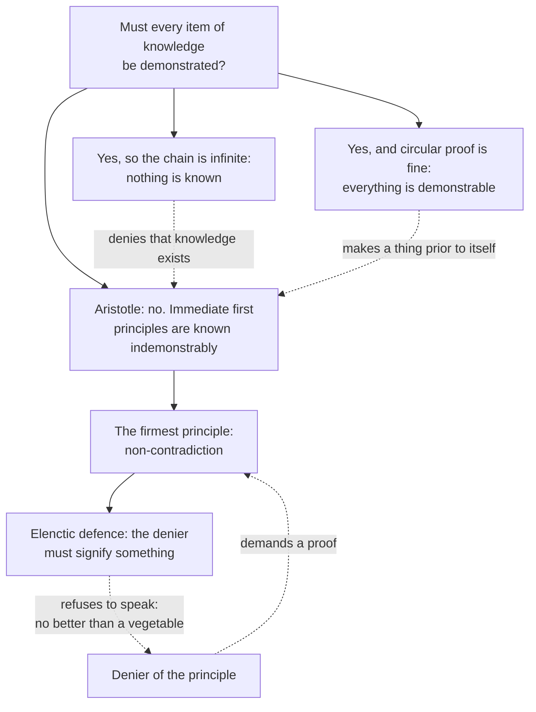

# Ancient & Medieval Philosophy · Lesson 3.1: Logic: predication, the categories and the syllogism

> ⏱ ~15 min · Module 3: Aristotle: logic, nature, substance and the first mover · Builds on: [1.3 The Sophists and Socrates](01-03-the-sophists-and-socrates.md), [2.1 The Forms, and what goes wrong with them](02-01-the-forms-and-what-goes-wrong-with-them.md) · Unlocks: [3.2 Nature and the four causes](03-02-nature-and-the-four-causes.md)

## Why this matters

Socrates asked "what is X?" and Plato answered with Forms. Aristotle asked a prior question: what are we *doing* when we say something of something? His answer, in the works later bundled as the *Organon*, gave the West its formal logic for two thousand years, a map of what can be said, and a model of what it is to *know*. Every scholastic article from Aquinas to Ockham is built on it.

## The idea

Take *Socrates is pale*: a subject, a predicate, and "is" tying them together. Aristotle's logic is a theory of that tie, and three questions fall out of it.

**What kinds of predicate are there?** Ask of Socrates: what is he? A man. How big? Five feet. What sort? Pale. Related to what? Older than Plato. Where? In the agora. Each question gets a different *kind* of answer. Push any predicate upward (pale → colour → quality) and you reach a ceiling. There are ten such ceilings, the **categories**. Being itself is not an eleventh, higher genus; Aristotle holds that being is not a genus at all (*Metaphysics* III.3), which is why "being is said in many ways" (IV.2).

**When does one predication follow from others?** If every animal is mortal and every horse is an animal, every horse is mortal, and this holds whatever "animal," "mortal," "horse" mean. Aristotle replaced the terms with letters (the first variables in logic) and catalogued which patterns always work. That catalogue is the **syllogistic**.

**When does a valid argument give knowledge?** Knowledge in the strong sense, *episteme*, is knowing *why*: deriving the fact from its cause. That is **demonstration**, and it has to start somewhere undemonstrated, deepest of all the **principle of non-contradiction**.

## Source

Aristotle, *Metaphysics* IV.3 1005b19–20 and IV.4 1006a11–22 (W. D. Ross's translation, public domain). The first sentence states the principle; the rest says how it can and cannot be defended.

> For the same attribute cannot at the same time belong and not belong to the same subject and in the same respect. […] We can, however, demonstrate negatively even that this view is impossible, if our opponent will only say something; and if he says nothing, it is absurd to seek to give an account of our views to one who cannot give an account of anything, in so far as he cannot do so. […] The starting-point for all such arguments is not the demand that our opponent shall say that something either is or is not (for this one might perhaps take to be a begging of the question), but that he shall say something which is significant both for himself and for another.

"This view" is the denial of the principle.

## The argument

**1. The ten categories (*Categories* 4).** Each uncombined expression signifies one of: **substance** (man, horse); **quantity** (two cubits long); **quality** (white, grammatical); **relation** (double, half, greater); **place** (in the Lyceum); **time** (yesterday, last year); **position** (lying, sitting); **having** or state (shod, armed); **acting** (cutting, burning); **being acted on** (being cut, being burned). *In words:* every simple thing you can say of a subject falls under exactly one highest kind, and substance, what the thing *is*, comes first because the other nine are said of a substance. (*Topics* I.9 puts "what it is" in first place: these are kinds of *predicate*.)

**2. Four propositions (*De Interpretatione* 7).** Each affirms or denies a predicate P of a subject S, universally or particularly:

| Label | Form | Quantity, quality |
|---|---|---|
| A | Every S is P | universal affirmative |
| E | No S is P | universal negative |
| I | Some S is P | particular affirmative |
| O | Some S is not P | particular negative |

The medieval letters come from the vowels of Latin *AffIrmo* and *nEgO*.

- **Contradictories** (A–O, E–I): exactly one is true. *In words:* to deny "every S is P" is just to say some S is not.
- **Contraries** (A–E): never both true, possibly both false. *In words:* "every swan is white" and "no swan is white" can both fail.
- **Subcontraries** (I–O): never both false.
- **Subalterns** (A→I, E→O): the universal implies the particular.

The last three rest on an assumption Aristotle never flags because his terms always name something: **S is not empty**. Modern first-order logic ([`mathematical-logic` 2.3](../../mathematical-logic/lessons/02-03-translation-quantifier-order.md)) reads A as $\forall x\,(Sx \to Px)$ and I as $\exists x\,(Sx \land Px)$, where $\forall$ is "for all," $\exists$ "there is," $\to$ "if…then," $\land$ "and." Let S be *perpetual-motion machine*. Then A, "every perpetual-motion machine violates thermodynamics," is vacuously true and I is false, so subalternation fails. So do contrariety (A and E both true) and subcontrariety (I and O both false). *In words:* the square is correct for non-empty terms, the only kind Aristotle's logic uses.

**3. The first figure (*Prior Analytics* I.4).** A syllogism is an argument in which, certain things being laid down, something else follows of necessity (I.1, paraphrased). The categorical syllogism has two premises and three terms: the **major** P (predicate of the conclusion), the **minor** S (its subject), and the **middle** M, which appears in both premises and vanishes from the conclusion. In the first figure the middle is subject of the major premise and predicate of the minor:

| Name | Major | Minor | Conclusion | Why it holds (terms as classes) |
|---|---|---|---|---|
| Barbara | Every M is P | Every S is M | Every S is P | $S \subseteq M \subseteq P$ |
| Celarent | No M is P | Every S is M | No S is P | S sits inside M, which is disjoint from P |
| Darii | Every M is P | Some S is M | Some S is P | that S is an M, so a P |
| Ferio | No M is P | Some S is M | Some S is not P | that S is an M, so not a P |

Here $\subseteq$ means "is included in." The vowels give the moods (BArbArA is A, A, A); the names come from thirteenth-century mnemonic verses, not from Aristotle, who writes "A belongs to every B." *In words:* the middle term carries the conclusion across, and the first figure makes this "perfect," obvious on inspection, so Aristotle reduces the other figures to it.

**Validity** is a property of the form: no substitution of terms makes the premises true and the conclusion false. To show a form **invalid**, give one such substitution.

**4. Demonstration (*Posterior Analytics* I.2–3).** We know something scientifically when we know its cause, that it is the cause, and that the fact could not be otherwise. A demonstration is a syllogism producing such knowledge, so its premises must be **true, primary, immediate, better known than, prior to, and causes of** the conclusion (I.2). *In words:* validity is necessary but nowhere near sufficient; the premises must *explain* the conclusion.

**5. The regress (I.3).** If every premise needs demonstrating, either the chain never ends (and nothing is known) or it circles back (and a thing is prior to itself). Aristotle rejects both: not all knowledge is demonstrative; the immediate first principles are known without demonstration (by *nous*, reached through induction from perception, II.19). *In words:* proof has to bottom out in something grasped, not proved.

**6. Non-contradiction (*Metaphysics* IV.3–4).** The firmest first principle is the one in the Source. Aristotle states it about *things* (an attribute cannot belong and not belong), about *belief* (no one can believe the same thing to be and not to be, IV.3) and about *assertions* (contradictories are not true together, IV.6). It cannot be demonstrated without circularity. But it can be defended **elenctically**: get the opponent to say something that means something (let "man" signify, say, two-footed animal). Signifying one thing already excludes its opposite, so the opponent relies on the principle in the act of denying it (IV.4). *In words:* you do not prove non-contradiction to the denier; you show him that he is already using it.

## Argument map

Dashed edges are rivals and what each costs.

## Worked examples

**Example 1 (clean: sort, then test).** Predicates of Theaetetus: *a man*, *snub-nosed*, *younger than Socrates*, *in the gymnasium*, *seated*, *being questioned*. Categories: substance, quality, relation, place, position (not acting: it says how he is disposed), being acted on.

(a) No plant perceives. Every vine is a plant. So no vine perceives. M = plant, P = perceives, S = vine: No M is P, every S is M, so no S is P. **Celarent, valid.**

(b) Every animal perceives. Some living things are animals. So some living things perceive. **Darii, valid.**

(c) Every animal perceives. No plant is an animal. So no plant perceives. True premises, true conclusion, but the form is "every M is P, no S is M, so no S is P." Substitute M = horse, P = animal, S = dog: every horse is an animal, no dog is a horse, so no dog is an animal. **Invalid** (medieval diagnosis: "illicit major"). The true conclusion in (c) was luck, not logic.

**Example 2 (hard: two valid syllogisms, one demonstration).** Aristotle's own case (*Posterior Analytics* I.13). Take two arguments, both in Barbara:

- (i) Whatever does not twinkle is near. The planets do not twinkle. So the planets are near.
- (ii) Whatever is near does not twinkle. The planets are near. So the planets do not twinkle.

Both are valid, and on Aristotle's astronomy all premises are true ("near" and "not twinkling" hold of exactly the same things). But only (ii) is a demonstration. Nearness is the *cause* of not twinkling; not twinkling is only a *sign* of nearness. (i) gives knowledge *that* the planets are near; (ii) gives knowledge *why* they do not twinkle. Its middle term names the cause, as I.2 requires.

The strain: nothing in the logic says which way the causation runs. Deciding which argument is the demonstration needs knowledge of the world the form cannot supply. Logic governs consequence; explanation belongs to the causes, which is where [3.2](03-02-nature-and-the-four-causes.md) picks up.

## Watch out

- **Anachronism: "syllogism" does not mean what modern textbooks mean.** Aristotle's definition (*Prior Analytics* I.1) is any argument whose conclusion follows of necessity. The narrow two-premise categorical form is what he proved things about. And "distributed," "illicit major," and the mood names are medieval tools, not his.
- **Anachronism: calling subalternation "a fallacy."** That imports the modern empty-term convention into a logic whose terms all denote. The accurate claim is that the two systems read A differently.
- **You might think the categories classify words.** They classify what is *signified*: "running" and "runs" both fall under acting. Their status in *reality* is [3.4](03-04-substance-and-essence.md)'s question and, as a live debate, [`metaphysics` 2.1](../../metaphysics/lessons/02-01-substance-and-accident.md)'s.
- **You might think the elenctic defence is a proof of non-contradiction.** Aristotle says it is not: a proof would beg the question. It shows that an opponent who speaks already relies on the principle; an opponent who refuses to speak is not refuted, only silenced.

## One-liner

> Ten kinds of predicate, four kinds of proposition, one middle term that carries the conclusion, and a first principle you defend by getting the denier to talk.

## Problems

**P1 (🟢) *(Exegetical.)*** Assign each predicate of Callias to one of the ten categories of *Categories* 4. One word each.

> (i) is three cubits tall · (ii) is a master (of a slave) · (iii) is armed · (iv) is reclining · (v) is an animal · (vi) is being taught · (vii) is hot · (viii) was in the Lyceum last year (two answers)

**P2 (🟡) *(Formal.)*** Assume, with Aristotle, that every term is non-empty. For (a)–(c), say valid or invalid. If valid and in the first figure, name the mood. If invalid, give a substitution of terms with true premises and a false conclusion. (d) is not a syllogism: say whether the inference holds on Aristotle's square and in modern first-order logic, and name the assumption that makes the difference.

> (a) No reptile nurses its young. Some pets are reptiles. So some pets do not nurse their young.
> (b) Every Sophist is paid for teaching. Some philosophers are paid for teaching. So some philosophers are Sophists.
> (c) Some sailors are not Athenians. Every Athenian is a Greek. So some sailors are not Greeks.
> (d) Every man who has squared the circle with ruler and compass is a geometer. So some man who has squared the circle with ruler and compass is a geometer.

**P3 (🔴, optional) *(Exegetical (a) · Evaluative (b).)*** Use the Source. (a) Which words show that what Aristotle offers is not a demonstration of the principle, and what exactly must the opponent do for it to get started? Why does he refuse to demand that the opponent "say that something either is or is not"? (b) An opponent replies: "I will say 'man,' and I mean two-footed animal. But I do not grant that meaning *this* rules out meaning *not this*." Does the elenctic defence answer this opponent on terms the opponent accepts, or not? 150 words or fewer for (b).

Solutions

**P1** *(Exegetical.)*

**Must hit, strict:** (i) quantity · (ii) relation · (iii) having (state) · (iv) position · (v) substance · (vi) being acted on · (vii) quality · (viii) place *and* time.

**Wrong turns:** (iii) as quality because "armed" describes him; Aristotle's own example of having is "armed." (iv) as acting; reclining is how he is disposed, his posture, and "lying" is Aristotle's example of position. (v) as quality; "animal" says what Callias is, so it is (secondary) substance.

**Model answer:** quantity, relation, having, position, substance, being acted on, quality, place + time.

---

**P2** *(Formal.)*

**Must hit, strict:**
- (a) **Valid, Ferio.** M = reptile, P = nurses its young, S = pet: No M is P, some S is M, so some S is not P. The pet that is a reptile is a non-nurser.
- (b) **Invalid** (undistributed middle): "every P is M, some S is M, so some S is P." Counterexample: every dog is a mammal; some cats are mammals; so some cats are dogs. The S's that are M need not be among the P's that are M.
- (c) **Invalid**: "some S is not M, every M is P, so some S is not P." Counterexample: some mammals are not dogs; every dog is a vertebrate; so some mammals are not vertebrates. The S's outside M may still be inside P.
- (d) **Holds on Aristotle's square** (subalternation, A→I). **Fails in first-order logic**: squaring the circle with ruler and compass is impossible (Lindemann, 1882), so the subject term is empty, the A-form $\forall x\,(Sx \to Gx)$ is vacuously true and the I-form $\exists x\,(Sx \land Gx)$ is false. The difference is **existential import**: whether "every S" presupposes that some S exists. The syllogistic's assumption of non-empty terms is violated here, so the problem's own instruction does not apply to (d).

**Wrong turns:** calling (b) or (c) valid because the conclusion sounds plausible (validity is tested by counterexample, not by the truth of the conclusion); a counterexample whose premises are not both true, or whose conclusion is not false; in (d), saying Aristotle's logic is simply mistaken, instead of naming the assumption the two systems differ on.

**Model answer:** (a) Valid, Ferio. (b) Invalid: every dog is a mammal, some cats are mammals, so some cats are dogs. (c) Invalid: some mammals are not dogs, every dog is a vertebrate, so some mammals are not vertebrates. (d) Valid by subalternation on the square, which assumes the subject term names something; invalid in first-order logic, where the empty subject makes the universal vacuously true and the particular false.

---

**P3** *(Exegetical (a) · Evaluative (b).)*

**Must hit, strict (a):**
- "demonstrate **negatively**": the defence is not demonstration proper. (The next lines of IV.4 draw the distinction outright: in a demonstration one might seem to beg the question.)
- What the opponent must do: "say something which is significant both for himself and for another," a meaningful utterance, not an assent to any proposition.
- Why not demand "that something either is or is not": that is already an assertion with a definite truth-value, close to the principle itself, and demanding it "might perhaps" be taken as "a begging of the question."

**Must hit, any verdict (b):**
- State what the elenctic move needs: that signifying one thing *already* excludes signifying its contradictory (IV.4 argues that to signify "man" and not also "not-man" is what it is to signify one thing).
- Say what this opponent concedes (he signifies something, determinately) and what he withholds (that determinate signification excludes its opposite), and whether the argument needs more than the concession.
- A verdict with the step that decides it.

**Wrong turns:** treating (a) as saying Aristotle proves the principle; in (b), replying that the opponent contradicts himself, which assumes the principle at issue rather than testing whether he has granted it.

**Model answer (b), one of several acceptable:** The elenctic defence needs no premise the opponent rejects outright. It needs only his utterance and what uttering it involves. This opponent grants that "man" signifies two-footed animal. Aristotle's point is that signifying *one* thing is not an extra claim added to speaking but what speaking consists in. If "man" could equally signify not-man, it would signify nothing definite, and the opponent would not have said "man" at all. So the defence meets him on his own ground, *if* he really means something by "man." His withholding is the weak spot either way: if he can mean two-footed animal while leaving open that he also means its denial, he has shown that meaning something and excluding its opposite can come apart, and the defence stalls. Verdict: it answers him, provided determinate meaning just is exclusion, which is the premise the dispute turns on.

## Flashback

**From Lesson 2.2 (Knowledge: recollection, the Line and the Cave):** *(Exegetical.)* Near the end of the education of the guardians, Socrates returns to the Line (*Republic* VII 533e–534a, Jowett). He is "satisfied, as before, to have four divisions; two for intellect and two for opinion", and names them science, understanding, belief and perception of shadows (Greek *episteme*, *dianoia*, *pistis*, *eikasia*; the two pairs are *noesis* and *doxa*), "opinion being concerned with becoming, and intellect with being". Then: "As being is to becoming, so is pure intellect to opinion."

(a) Compare this with the table in 2.2. Which segment has a new name, which name now covers two segments, and on which side of the intellect/opinion divide does the geometer of 2.2's Example 1 fall? (b) Does the passage support the "two worlds" reading of Example 2, on which no opinion about visible things could become knowledge? Say which words favour it and what the passage leaves unsaid. Three sentences or fewer per part.

Solution

**Must hit, strict (a):** the top segment, *noesis* at 511, is now called *episteme* ("science"). *Noesis* ("intellect") has been promoted to cover the top two segments together, and *doxa* ("opinion") covers the bottom two. So *dianoia* counts as intellect, and the geometer, reasoning from hypotheses in segment 3, is on the intellect side, even though he is still short of the top.

**Must hit, strict (b):** the favouring words are "opinion being concerned with becoming, and intellect with being", together with the proportion "as being is to becoming". They pair each state with its own kind of object, which is what the two-worlds reading says. But the passage does not say that one and the same thing can never be both opined and known, or that a true opinion can never be converted into knowledge. "Concerned with" also leaves room for a reading in the spirit of Fine's, on which the contrast is in what each state can secure. So the passage leans toward two worlds without settling the question.

**Wrong turns:** reading Jowett's "understanding" here as the top segment. At 534a it is segment 3, *dianoia*. Putting the geometer under opinion because he uses drawn figures: the passage puts both upper segments under intellect. Treating "why should we dispute about names", which comes just before, as permission to ignore the relabelling. The relabelling is exactly what (a) asks about.

**Model answer:** (a) The top segment is renamed *episteme*, and *noesis*, its old name, now names segments 3 and 4 together, with *doxa* for 1 and 2. The geometer's *dianoia* is therefore intellect, not opinion. (b) "Opinion being concerned with becoming, and intellect with being", and the proportion built on it, tie each state to a distinct kind of object, which favours two worlds. Nothing here says a true opinion about a visible thing can never be tied down into knowledge. "Concerned with" could mark what each state can secure rather than separate domains, so the question stays open.

## Connections

- **Backward:** Socrates' "what is X?" ([1.3](01-03-the-sophists-and-socrates.md)) becomes Aristotle's question about how predicates attach to subjects, and IV.5 goes on to link Protagoras's man-the-measure doctrine to the denial of non-contradiction. The one-over-many problem of [2.1](02-01-the-forms-and-what-goes-wrong-with-them.md) is recast: a universal is what is *predicated* of many, and whether that makes it a thing is left to [3.4](03-04-substance-and-essence.md). Validity and counterexamples are the tools of [`philosophical-method` 1.2](../../philosophical-method/lessons/01-02-validity-and-soundness.md) and [1.4](../../philosophical-method/lessons/01-04-argument-forms-and-formal-fallacies.md).
- **Forward:** demonstration from causes needs an account of causes, which is [3.2](03-02-nature-and-the-four-causes.md). The categories return as the ten ways of being in [3.4](03-04-substance-and-essence.md), and Ockham cuts them down to substance and quality in [8.4](08-04-ockham-nominalism-and-the-razor.md). Every *Summa* article in Module 7 argues in syllogisms, and Aquinas's first principles known *per se* are Aristotle's immediate premises.
- **Sideways:** the Stoics build a rival logic of whole propositions ([4.2](04-02-the-stoics-logos-fate-and-virtue.md)), the ancestor of the propositional calculus in [`mathematical-logic` 1.2](../../mathematical-logic/lessons/01-02-semantics-truth-tables.md). Modern quantification theory ([`mathematical-logic` 2.3](../../mathematical-logic/lessons/02-03-translation-quantifier-order.md)) absorbs the syllogistic as a fragment of monadic first-order logic, at the price of existential import. Aquinas uses non-contradiction as the model for the first precept of practical reason in [`ethics` 4.4](../../ethics/lessons/04-04-natural-law-aquinas.md).
