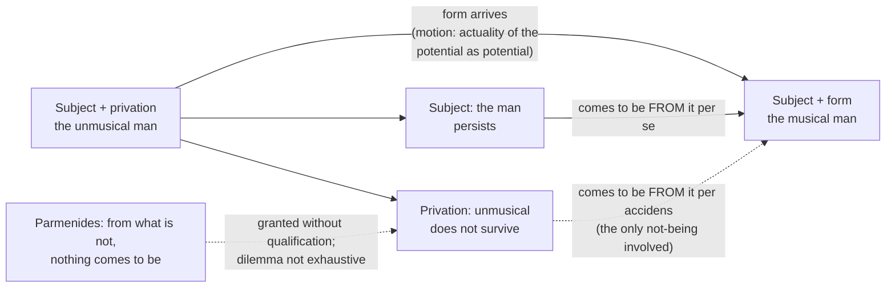

# Ancient & Medieval Philosophy · Lesson 3.3: Change: privation, potency and act

> ⏱ ~15 min · Module 3: Aristotle: logic, nature, substance and the first mover · Builds on: [3.2 Nature and the four causes](03-02-nature-and-the-four-causes.md), [1.1 Heraclitus and Parmenides](01-01-heraclitus-and-parmenides.md) · Unlocks: [3.4 Substance and essence](03-04-substance-and-essence.md)

## Why this matters

[3.2](03-02-nature-and-the-four-causes.md) defined nature as an inner principle of *motion* and rest, and the four causes as the answers to "why did this come to be?" Both assume that things really do come to be. Parmenides ([1.1](01-01-heraclitus-and-parmenides.md)) had argued that they cannot, and the atomists escaped him only by granting that what-is-not exists. *Physics* I.7–8 and III.1 are Aristotle's third way out: keep Parmenides' logic, keep a world that changes, and pay with two new distinctions. Those distinctions (privation, and potency against act) are what the Middle Ages inherited. The first mover of [3.6](03-06-the-unmoved-mover.md), Aquinas's *esse* as act ([7.2](07-02-aquinas-essence-and-existence.md)) and the whole of `thomistic-synthesis` are built on them.

## The idea

Aristotle starts with grammar. Watch how we talk about a man who learns music. We say three things, all true:

- "The man became musical."
- "The unmusical became musical."
- "The unmusical man became a musical man."

Now notice what survives. After the lessons the *man* is still there, so we can say "the man is musical." The *unmusical* is not still there; nobody says "the unmusical is musical." So two things were present at the start that grammar ran together: a subject that persists, and a lack that is removed. Add what arrives, the form (musicality), and you have three principles of every change: **subject**, **privation** and **form** (*Physics* I.7).

Here is why that matters for Parmenides. His dilemma said: anything that comes to be comes from what is or from what is not, and neither works. Aristotle asks: in what sense did the musician come "from what is not"? From the *unmusical*, which as such is a not-being. But that not-being is a feature of something that very much is, namely the man. The musician comes to be from what is not only *per accidens*: by way of the privation, which happens to belong to a real subject. He comes to be *per se* from the subject. Nothing came from sheer nothing, so Parmenides' principle is untouched. It just never applied.

Aristotle then says the same thing a second way (I.8, end). The man was *potentially* musical: not nothing, not yet musical. What comes to be comes from what is potentially it. Book III turns this into a definition of change itself.

## Source

Aristotle, *Physics* I.8, 191a24–33 (Hardie and Gaye translation, 1930):

> We will now proceed to show that the difficulty of the early thinkers, as well as our own, is solved in this way alone. The first of those who studied philosophy were misled in their search for truth and the nature of things by their inexperience, which as it were thrust them into another path. So they say that none of the things that are either comes to be or passes out of existence, because what comes to be must do so either from what is or from what is not, both of which are impossible. For what is cannot come to be (because it is already), and from what is not nothing could have come to be (because something must be underlying).

Two phrases to hold. "In this way alone": the three principles of I.7 are offered as *the* solution, not one option. And the parenthesis "because something must be underlying" is Aristotle's gloss on why nothing comes from what-is-not. He puts his own doctrine of the subject into the mouths of the Eleatics, which tells you where he thinks they were right.

## The argument

**The three principles and the reply to Parmenides (*Physics* I.7–8).**

1. **Every change is from a contrary, or an intermediate, to a contrary.** Not anything comes from anything: the musical comes from the unmusical, not from the pale. *In words:* change has a direction fixed by a pair of opposites.
2. **Contraries cannot act on each other directly, so something must underlie them** (I.6–7). Unmusicality does not turn into musicality; a man goes from one to the other. *In words:* a lack cannot become a presence unless something has first the one and then the other.
3. **So change needs three principles: the underlying subject (*hypokeimenon*), the form, and the privation (*steresis*).** They are two in one sense and three in another, since subject and privation are one thing in number but differ in account. *In words:* "the unmusical man" is one man described two ways.
4. **The subject persists through the change; the privation does not.** *In words:* the man is still there afterwards, the unmusical is gone.
5. **"X comes to be from Y" is said *per se* or *per accidens*.** A doctor builds a house *qua* builder, not *qua* doctor (I.8). *In words:* some descriptions of a cause pick out what does the work, others only what happens to be true of it.
6. **What comes to be comes *per se* from the subject, and *per accidens* from not-being, namely the privation, which "in its own nature is not-being" and does not survive into the result.** *In words:* the only not-being in the story is a lack in a real thing.
7. **So Aristotle agrees that nothing comes to be *without qualification* from what is not, and denies that this rules out change.** *In words:* Parmenides' premise stands; his dilemma was not exhaustive, because it never separated the subject from its privation.
8. **Second route: what comes to be comes from what is potentially it** (I.8, end; worked out in *Metaphysics* IX). *In words:* the man was already, in potency, what he became.

**Potency, act and motion (*Physics* III.1).** *Dynamis* is potency, the capacity to be otherwise. *Energeia* ("being-at-work") and *entelecheia* ("having-its-end-within", Hardie and Gaye's "fulfilment") are the corresponding actuality. Then the definition, 201a10–11 (Hardie and Gaye):

> The fulfilment of what exists potentially, in so far as it exists potentially, is motion.

*In words:* change is the potential being actualized *while it is still potential*: not the lump, not the finished statue, but the being-shaped.

The qualifier does the work. Bronze is potentially a statue, but the bronze's being actually bronze is not a motion. The statue's being finished is not a motion either, since the potency is used up. Motion is the actuality of the bronze *as* shapeable, which lasts exactly as long as the shaping. Readers disagree about how to take *entelecheia* here. The familiar English rendering "actualization" suggests a process. Kosman (*Phronesis*, 1969) argued it must be "actuality", the potential's being present *as* potential, or the definition becomes circular. That dispute over translation is live.

**Two kinds of change.** In **accidental** change a substance persists and gains a quality, quantity or place: the man becomes musical. In **substantial** change, coming-to-be without qualification (*haplos*), a new substance arises. Aristotle's example in I.7 is plants and animals from seed. Here the subject cannot be a substance that persists, since the substance is what comes to be. Something else must underlie it.

## Argument map

Solid arrows are what Aristotle affirms. The dashed edges mark the two places Parmenides' not-being enters: once as a privation, once as the premise Aristotle grants and then confines.

## Worked examples

**Example 1 (clean: a pale man tans).** A pale sailor spends a summer at sea and comes home dark.

- **Subject:** the sailor, who persists. So this is **accidental** change, in the category of quality.
- **Privation:** not-dark, which the sailor had and no longer has.
- **Form:** darkness of skin.
- **Potency:** the sailor was potentially dark. A stone is not "potentially tanned", so the potency is fixed by what the subject actually is. That is why privation is not just any absence: a lack counts as a privation only in a subject apt to have the form (*Metaphysics* V.22).
- **The motion:** the tanning, meaning the sailor's actuality as still-tannable, lasting the summer.
- **Parmenides:** "the dark came from the not-dark" is true *per accidens*. *Per se*, the dark sailor came from the sailor.

The payoff: every ingredient Parmenides forbade (a not-being, a coming-to-be) appears, and none violates his principle.

**Example 2 (hard: an element transforms).** In *On Generation and Corruption* II.4 Aristotle holds that the elements change into one another. Water, cold and moist, can become air, hot and moist. This is substantial change: water ceases and air comes to be. So the three principles ask: **what is the subject?**

It cannot be water, which is gone, or air, which is new. The moist persists, but the moist is a quality, and a quality cannot underlie a substance. Keep asking what underlies each element and the traditional reading answers: **prime matter** (*prote hyle*), a subject with no form of its own, pure potency to every elemental form. Late-ancient commentators read Aristotle this way, and so did the medievals: Aquinas's matter as pure potency is this reading.

The dissent is serious. Hugh King ("Aristotle without *prima materia*", *Journal of the History of Ideas*, 1956) argued that the texts never require a formless substrate. William Charlton (*Aristotle's Physics I and II*, 1970) argued, in his Clarendon translation and commentary, that each substantial change has a proximate subject with some character, such as the moist or the hot, and nothing more is needed. Friedrich Solmsen, among others, replied in defence of the traditional reading. The strain is real on either side. Deny prime matter and you must say what persists when *everything* substantial changes. Affirm it and you owe an account of something that is, in itself, nothing definite: a subject that is almost Parmenides' not-being after all. Whether real potency of this kind exists is not this course's question; it belongs to [`metaphysics` 2.2](../../metaphysics/lessons/02-02-change-act-and-potency.md).

## Watch out

- **You might think "motion" means moving from place to place.** *Kinesis* in III.1 covers alteration (tanning), growth and shrinking, and locomotion, with coming-to-be sometimes grouped alongside. Reading "the fulfilment of the potential" as a claim about trajectories is an anachronism.
- **You might think potency is modern logical possibility.** "Possibly F" costs nothing. A potency belongs to a subject and is bounded by what it actually is. Reading *dynamis* through possible-worlds semantics is the anachronism the syllabus warns about.
- **You might think privation is a fourth thing in the world.** It is not-being *in* a subject, counted as a principle only because the subject differs in account before and after.
- **You might think Aristotle refutes Parmenides' premise.** He grants that nothing comes to be simply from what is not. He attacks the dilemma, not the principle.

## One-liner

> The musician comes from the man *per se* and from the unmusical only *per accidens*, so nothing comes from nothing, change is real, and motion is the potential being actualized while still potential.

## Problems

**P1 (🟢) *(Exegetical.)*** Apply *Physics* I.7 to each change. Name the subject, the privation and the form, say whether the change is accidental or substantial, and say whether the subject persists. One or two sentences each.

> (i) A boy grows from four feet tall to five.
> (ii) A loaf of bread is eaten and becomes part of the man who eats it.
> (iii) A dog dies, leaving a body on the rug.
> (iv) A child who cannot read learns to read.

**P2 (🟡) *(Exegetical.)*** Close-read *Physics* III.1 (Hardie and Gaye, 201a10–11 and 201a29 ff.):

> The fulfilment of what exists potentially, in so far as it exists potentially, is motion. […] Bronze is potentially a statue. But it is not the fulfilment of bronze as bronze which is motion. For "to be bronze" and "to be a certain potentiality" are not the same.

(a) Which words exclude the finished statue from being the motion, and which exclude the lump of bronze just sitting there? (b) Why does Aristotle need the sentence "'to be bronze' and 'to be a certain potentiality' are not the same"? What would follow if they were the same? 150 words or fewer in total.

**P3 (🔴, optional) *(Exegetical (a) · Evaluative (b).)*** (a) Name the crux between Parmenides and Aristotle: the single premise in Parmenides' argument against coming-to-be that Aristotle denies, and one he explicitly accepts. Cite I.8. (b) An Eleatic replies: "Your 'subject' is just what-is, and your 'privation' is just what-is-not, so the musician still comes either from what is or from what is not. You have renamed my dilemma." Does Aristotle's *per se*/*per accidens* distinction answer this on terms Parmenides would have to accept, or does it assume what Parmenides denies? Any verdict. 150 words or fewer for (b).

Solutions

**P1** *(Exegetical, strict.)*

**Must hit, strict:**
- (i) Subject: the boy. Privation: not five feet tall. Form: that height, a quantity. **Accidental** change (growth); the subject persists.
- (ii) The bread ceases to be bread, and its matter comes to be the man's flesh. **Substantial** for the bread: the bread does not persist, and the subject is its matter, not the loaf. The man persists and grows, which is accidental *for him*. Full credit requires seeing both descriptions.
- (iii) **Substantial** change (passing-away): the dog does not persist. On Aristotle's view a corpse, like a dead hand, is so called only homonymously, since it has lost the soul that made it what it was. The subject is the matter, now under a different form. The privation runs the other way: the matter comes to lack the dog's form.
- (iv) Subject: the child. Privation: illiterate. Form: literacy, a quality. **Accidental**; the child persists.

**Wrong turns:** calling (iii) accidental because "the body is still there" misses that for Aristotle the body is no longer a dog's body in the proper sense. In (ii), giving only one of the two changes.

**Model answer:** (i) Boy; not-five-feet; five feet; accidental, persists. (ii) The loaf's matter; not-flesh; flesh; substantial for the bread, which perishes, while the man, who persists, grows accidentally. (iii) The dog's matter; loses the dog's form and takes that of a corpse; substantial, the dog does not persist. (iv) Child; illiterate; literate; accidental, persists.

---

**P2** *(Exegetical, strict.)*

**Must hit, strict (a):** "of what exists potentially" is the part that excludes the finished statue. When it is finished, nothing is potentially the statue any longer; the potency is exhausted. "In so far as it exists potentially" (and "not … bronze as bronze") excludes the idle lump. Its actuality *as bronze* is already complete and is no motion; only its actuality *as able to be shaped* is.

**Must hit, strict (b):** the bronze is one thing under two descriptions, *bronze* and *potentially a statue*, which differ in account, like the man and the unmusical in I.7. If the two were the same, then bronze's merely being bronze would already be motion. All bronze everywhere would always be becoming a statue, and the "in so far as" qualifier would pick out nothing.

**Wrong turns:** saying the finished statue is excluded because "motion must be incomplete" without locating the words that say so; treating (b) as a point about the matter of the statue, the material cause, instead of the difference in account.

**Model answer:** (a) "Of what exists potentially" rules out the finished statue, which is no longer potentially a statue. "In so far as it exists potentially" rules out the lump, whose actuality as bronze is not a change. (b) Motion is the actuality of the bronze under one description only. If being bronze were the same as being potentially a statue, the bronze's ordinary being would count as motion, and every lump would be forever changing into a statue.

---

**P3** *(Exegetical (a) · Evaluative (b).)*

**Must hit, strict (a):** Aristotle denies that the dilemma is **exhaustive**, meaning that "from what is" and "from what is not" are the only, unqualified options. He **accepts** that nothing comes to be *without qualification* from what is not (I.8, and the Source's "because something must be underlying"). Either formulation of the denial passes: disjunction not exhaustive, or "from" ambiguous between *per se* and *per accidens*.

**Must hit, any verdict (b):**
- State the Eleatic objection precisely: the distinction relabels the horns without adding a third option.
- Say what the *per accidens* reply needs Parmenides to grant: that one thing can be both something (a man) and not-something (not musical). That means "is not" can be said of a thing *in a respect*.
- Say whether Parmenides' own premises (1.1) allow "is not" in a respect, or whether his argument trades on refusing exactly that. Then give a verdict.

**Wrong turns:** answering (a) with "Aristotle denies that nothing comes from nothing," which he grants; in (b), citing modern physics.

**Model answer (b), one of several acceptable:** The Eleatic is right that Aristotle's subject *is* and his privation *is not*. But Aristotle's point is that they are one thing: the man is not musical. That requires "is not" to be said in a respect, which Parmenides seems to refuse, treating any not-being as sheer nothing. So the reply does not beat Parmenides on premises he holds. It shows that his dilemma needs an extra premise, that being admits no respects, and invites him to defend it. Verdict: the reply relocates the dispute rather than winning it on Eleatic terms. It is still progress, because the relocated premise is one the Eleatics never argued for.

## Flashback

**From Lesson 3.1 (Logic: predication, the categories and the syllogism):** *(Formal (a) · Exegetical (b).)* In a hill village, a well brings up an empty bucket exactly when its spring has run dry, and it does so *because* the spring has run dry. A villager reasons:

> Every well that brings up an empty bucket has a dry spring. The wells on the east slope bring up empty buckets. So the wells on the east slope have dry springs.

(a) Label the major, middle and minor terms, and name the figure and mood. (b) The premises are true and the form is valid. Say why this is still not a demonstration by the standard of *Posterior Analytics* I.2. Then rebuild it as the demonstration, and say what the rebuilt argument lets you know that the villager's does not. Three sentences or fewer per part, plus the rebuilt syllogism.

Solution

**Must hit, strict (a):** major term P = "has a dry spring", middle M = "brings up an empty bucket", minor S = "the wells on the east slope". The form is every M is P, every S is M, so every S is P: first figure, **Barbara**.

**Must hit, strict (b):** the middle term is a *sign* of the conclusion, not its *cause*. The empty bucket is not prior to the dry spring and does not explain it, so the premises fail I.2's requirement that they be prior to, and causes of, the conclusion. The rebuilt argument swaps the terms: *every well with a dry spring brings up an empty bucket; the wells on the east slope have dry springs; so the wells on the east slope bring up empty buckets.* It is still Barbara, but now the middle term names the cause. The villager's argument gives knowledge *that* the springs are dry; the rebuilt one gives knowledge *why* the buckets come up empty.

**Wrong turns:** keeping the villager's conclusion and only reordering the premises. The conclusion has to change, because what gets demonstrated is the effect. Calling the villager's argument invalid, or saying a premise is false. Both are fine, which is the whole point. Treating the convertibility of the terms as what makes the demonstration. Convertibility is what lets *both* arguments be valid with true premises, and it cannot say which way the explanation runs.

**Model answer:** (a) P: has a dry spring; M: brings up an empty bucket; S: the east-slope wells. First figure, Barbara. (b) An empty bucket is a sign of a dry spring, not its cause, so the premises are not prior to or explanatory of the conclusion. Rebuilt: every well with a dry spring brings up an empty bucket; the east-slope wells have dry springs; so they bring up empty buckets. This gives the reason *why* the buckets are empty, where the villager's argument only shows *that* the springs are dry.

## Connections

- **Backward:** [1.1](01-01-heraclitus-and-parmenides.md) gave Parmenides' dilemma, and [1.2](01-02-zeno-and-the-atomists.md) the atomists' price for escaping it: what-is-not exists. Aristotle's price is smaller. Not-being survives only as privation in a subject. The subject is [3.2](03-02-nature-and-the-four-causes.md)'s material cause, and the form is its formal cause.
- **Forward:** [3.4](03-04-substance-and-essence.md) asks what the persisting subject of accidental change *is* (substance) and what the form of a substance is. [3.5](03-05-soul-and-intellect.md) defines soul as a first actuality. [3.6](03-06-the-unmoved-mover.md) argues that actuality is prior to potency and ends in a mover with no potency at all. [4.4](04-04-plotinus-the-one-intellect-and-soul.md) and [5.2](05-02-augustine-evil-and-the-will.md) reuse "privation" for evil. [7.2](07-02-aquinas-essence-and-existence.md) stretches potency and act to essence and existence, and [`thomistic-synthesis`](../../thomistic-synthesis/syllabus.md) takes both in depth.
- **Sideways:** whether potencies are real features of things (against the Megarians and the Humeans) is argued in [`metaphysics` 2.2](../../metaphysics/lessons/02-02-change-act-and-potency.md). Newton's first law ([`mechanics-refresher` 1.2](../../mechanics-refresher/lessons/01-02-newtons-laws.md)) replaced Aristotle's account of locomotion, in which a moving body needs a continuing mover, with inertia.
