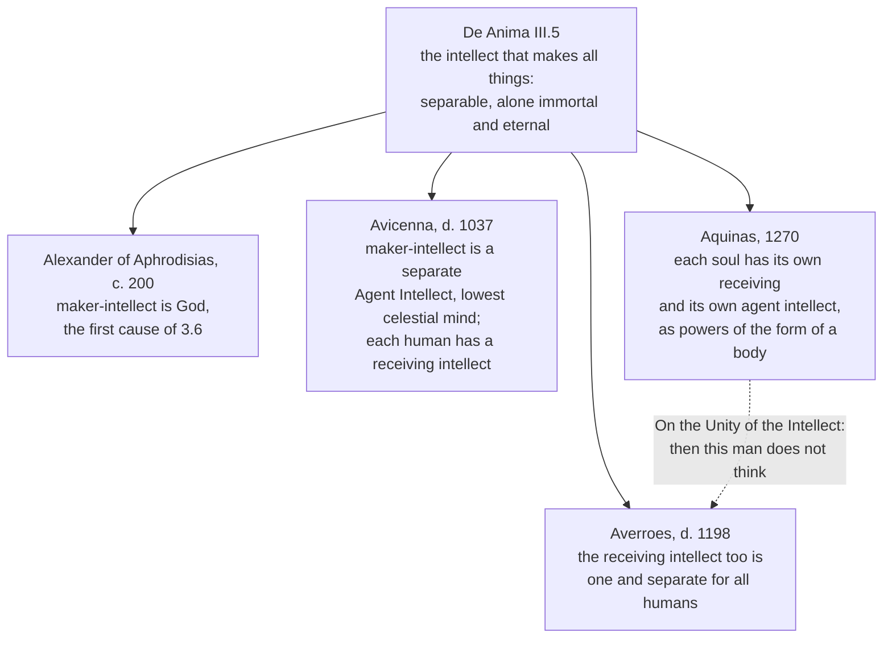

# Ancient & Medieval Philosophy · Lesson 3.5: Soul and intellect

> ⏱ ~15 min · Module 3: Aristotle: logic, nature, substance and the first mover · Builds on: [2.3 The soul: its parts and its immortality](02-03-the-soul-its-parts-and-immortality.md), [3.3 Change: privation, potency and act](03-03-change-privation-potency-and-act.md), [3.4 Substance and essence](03-04-substance-and-essence.md) · Unlocks: [3.6 The unmoved mover](03-06-the-unmoved-mover.md)

## Why this matters

Plato's *Phaedo* gave the West a soul that is a prisoner in the body and longs to get out. Aristotle gives it a soul that is no more a separate thing than the shape of a seal is separate from the wax. *De Anima* II.1 defines it, and the medieval debate about human nature is fought inside that definition. Then, in a chapter of about fifteen lines (III.5), Aristotle says something about an intellect that is "separable" and "alone is immortal and eternal", and never explains it. Alexander, Avicenna, Averroes and Aquinas each read those lines differently, and the Paris crisis of the 1270s turned partly on which reading was right.

## The idea

Start with an axe. What makes this lump of iron and wood an axe is not another ingredient hidden inside it; it is its being able to chop. Take that away (melt it down) and you have iron, and "an axe" only in the sense that a drawing of an axe is one. Aristotle's own illustration: if an axe were a natural body, "its axeity would be its substance, would in fact be its soul" (II.1 412b12–14, Hicks).

Now a better example, because an axe is an artefact: the eye. "If the eye were an animal, eyesight would be its soul." An eye that cannot see, like an eye in a statue, is an eye in name only. Sight is not a thing lodged in the eye; it is what the eye *is* when it is working as an eye.

Scale up: the soul is to the whole living body what sight is to the eye. It is the form of the body in the sense of [3.4](03-04-substance-and-essence.md): the principle that makes this matter one living thing of a kind. So a plant has a soul, because it feeds, grows and reproduces. Soul here is *psychē*, the principle of life, not the seat of consciousness.

Two refinements carry the rest of the lesson.

**First and second actuality.** A sleeping geometer knows geometry; a geometer proving a theorem is *using* it. Soul is the first kind: you have one while asleep.

**Receiving form.** When you see a gold signet ring's pattern pressed into wax, the wax takes the shape without taking the gold. Aristotle says perception works like that, and thinking more so: the mind takes on the form of whatever it thinks, which is why it can have no form of its own to get in the way.

## Source

*De Anima* II.1, 412a19–b7 (R. D. Hicks, 1907, public domain):

> It must follow, then, that soul is substance in the sense that it is the form of a natural body having in it the capacity of life. Such substance is actuality. The soul, therefore, is the actuality of the body above described. But the term 'actuality' is used in two senses; in the one it answers to knowledge, in the other to the exercise of knowledge. Clearly in this case it is analogous to knowledge: for sleep, as well as waking, implies the presence of soul […]. Hence soul is the first actuality of a natural body having in it the capacity of life. […] Hence there is no need to enquire whether soul and body are one, any more than whether the wax and the imprint are one.

"Having in it the capacity of life" is Hicks's rendering of a Greek phrase that reads more literally "having life potentially" (*dunamei zōēn echontos*). That word, *potentially*, links the definition to [3.3](03-03-change-privation-potency-and-act.md): body is to soul as potency to act.

## The argument

**The definition (II.1, 412a6–b9).**

1. **"Substance" is said of matter, of form, and of the compound; matter is potentiality and form is actuality.** *In words:* the vocabulary of [3.3](03-03-change-privation-potency-and-act.md) and [3.4](03-04-substance-and-essence.md) is the toolkit.
2. **Natural bodies are substances above all, and some of them are alive**, where life means self-nourishment, growth and decay. *In words:* start from plants and animals, the clearest cases of things that are really one thing.
3. **A living body is not itself the soul**, because body is the subject that has life, not something had by a subject. *In words:* the body is the matter; so the soul cannot be one more body part.
4. **So soul is substance as form of a natural body that has life potentially, and such form is actuality.** *In words:* soul is what makes a body capable of living actually alive.
5. **Actuality is twofold, like knowledge possessed and knowledge exercised; soul is present in sleep, so it is the first kind.** *In words:* soul is the standing capacity to live, not the activity of living at each moment.
6. **∴ Soul is the first actuality of a natural body that has life potentially, that is, of a body "furnished with organs" (412b5–6).** *In words:* a soul is the way an organized body is alive.
7. **Corollary:** there is no more a question whether soul and body are one than whether wax and imprint are one. *In words:* the *Phaedo*'s problem of how two things get together does not arise if one of them is the form of the other.

Aristotle then leaves a door open: nothing prevents some parts of soul being separable, "if they are not the actualities of any body whatever", and it is not yet clear whether soul is the body's actuality as the sailor is of the ship (413a3–9).

**The powers (II.2–3).** Souls differ by their powers: nutritive (all living things), perceptive (animals, touch first), appetitive and locomotive (most animals), and thinking (humans). They are nested: "the earlier form exists potentially in the later, as, for instance, the triangle potentially in the quadrilateral" (414b28–32).

**The intellect (III.4–5).**

1. **Thinking is like perceiving: the thinker receives the form of its object**, and is "potentially like this form" (429a15–16). *In words:* to think triangle, the mind must become, in a way, triangle.
2. **Mind thinks all things, so it must be "unmixed" (Anaxagoras's word), since its own nature would obstruct what it receives.** *In words:* a lens tinted red cannot show you red.
3. **So it is "nothing at all actually before it thinks", and has no organ, "as the perceptive faculty has"** (429a22–27). *In words:* thought is not the activity of a body part in the way sight is.
4. **Everywhere in nature there is something that is potentially all things of a kind and a cause that makes them all, as art is to its material.** *In words:* wherever there is potency, something actual brings it to act.
5. **So in the soul there is an intellect that "becomes all things" and one that "makes all things", like light, which makes potential colours actual** (430a10–17). *In words:* the mind needs both a receiver and something that lights up the intelligible.
6. **This second intellect is "separable and impassive and unmixed, being in its essential nature an activity"; "only when separated" is it its true self, and this "alone is immortal and eternal"** (430a17–23). *In words:* whatever the maker-intellect is, it does not die.

Aristotle adds that "we do not remember", because this intellect is impassive while the passive intellect perishes (430a23–25). Then the chapter ends.

## Map of positions

Read the four as a scale of how much of III.5 lies *outside* the individual human: Alexander puts the maker outside, Avicenna a created maker outside, Averroes both intellects outside, Aquinas neither. Averroes's position and Aquinas's reply are [7.1](07-01-faith-reason-and-the-paris-crisis.md)'s subject; abstraction by the agent intellect returns in [8.1](08-01-porphyrys-questions-universals-to-aquinas.md).

## Worked examples

**Example 1 (clean: a sleeping dog).** Run the definition. Is a dog a natural body? Yes: it has in itself a source of motion and rest ([3.2](03-02-nature-and-the-four-causes.md)), unlike a kennel. Does it have life potentially, meaning an organized body fit for feeding, growing, perceiving? Yes. So it has a soul, and its soul is the first actuality of that body. Asleep, it is not seeing anything, but it has not lost its sight, just as the sleeping geometer has not lost geometry. The soul is the first actuality; the seeing, when the dog wakes, is second actuality. Its powers are nutritive, perceptive, appetitive and locomotive, with no thinking power, so III.4–5 does not apply.

Now kill the dog. The corpse is not "a body having life potentially" in Aristotle's sense, since he says that phrase means "not the body which has lost its soul, but that which possesses it" (412b25–26). A dead dog is a dog the way a stone eye is an eye: equivocally.

**Example 2 (hard: does the intellect break the definition?).** Run the same test on a human thinking. The definition says soul is the actuality of an organic body, and each power so far has had an organ: sight the eye, nutrition the digestive parts. III.4 says the thinking power has none. So there are three ways to take it.

- **The definition was always partial.** 413a3–7 already allowed parts that "are not the actualities of any body whatever". On this reading the intellect is the planned exception, and II.1 was billed as an "outline or provisional sketch" (413a9–10).
- **The intellect belongs to the soul, but not as an organ's activity.** Thinking still depends on the body, since III.7–8 say the soul never thinks without an image (*phantasma*), and images come from perception. The intellect has no organ of its own but works on what the body supplies.
- **The separable part is not ours.** If the maker-intellect is "separable" and "alone immortal", perhaps it is not a part of the individual soul at all. This is Alexander's route, and in another form Averroes's.

The text does not decide among these. III.5 says the maker-intellect is "in the soul" (the differences "must be found also in the soul", 430a13), which favours the second reading. It also says "we do not remember", which suggests that what survives is not a person with a past, and that favours the third. The dispute is about which of those phrases governs the other.

## Watch out

- **"Soul" is not "mind".** *Psychē* is the principle of life, so plants have one. Read Cartesian consciousness into II.1 and the nutritive soul becomes nonsense. That is an anachronism, and a common one.
- **"Form of the body" is not "shape of the body" or "arrangement of parts".** A corpse keeps its shape for a while and has no soul. Form here is actuality, what makes the matter this kind of living thing with these powers. Whether that makes Aristotle a forerunner of functionalism is disputed: Nussbaum and Putnam ("Changing Aristotle's Mind", 1992) say roughly yes, and Burnyeat (1992) says the physics it rests on is no longer credible. Whether hylomorphism works as a theory of mind today belongs to [`philosophy-of-mind`](../../philosophy-of-mind/syllabus.md) Module 5.
- **Wax without matter is not settled.** Sorabji reads perception as a literal physiological change (the eye-jelly takes on the colour); Burnyeat reads it as awareness with no such change. The wax image fits both.
- **"Agent intellect" is not Aristotle's term.** III.5 speaks of the intellect that "makes" all things, and calls the other the passive intellect (430a24). *Nous poiētikos* and *intellectus agens* are the commentators' labels. And "immortal" in III.5 is not obviously personal immortality: "we do not remember" cuts against that reading.

## One-liner

> The soul is to the living body what sight is to the eye, but the intellect has no organ, and fifteen lines about the part that "alone is immortal" set Alexander, Avicenna, Averroes and Aquinas against each other.

## Problems

**P1 (🟢) *(Exegetical.)*** Reread the II.1 passage in **Source**. Three readers summarize it:

> (A) The soul is a thing distinct from the body that occupies and animates it, as a pilot occupies a ship.
> (B) The soul is the body's physical structure: the arrangement of its organs.
> (C) The soul is the actuality of an organized body, and is present even when the body is doing nothing.

For each of A and B, quote the words in the passage that tell most directly against it, and for C, quote the words that establish the clause "even when the body is doing nothing". One or two sentences each.

**P2 (🟡) *(Exegetical (a) · Evaluative (b).)*** (a) Using II.1 as taught in this lesson, say for each of the following whether Aristotle's definition gives it a soul, and which clause or example decides it: (i) a hibernating bear; (ii) a hand severed in an accident; (iii) a robot lawnmower that steers itself, "feeds" at its charging dock and stops when it is full. One or two sentences each. (b) A classmate says: "The axe passage shows Aristotle was a functionalist: soul is just what a thing does, whatever it is made of." Is that a faithful reading of II.1 and III.4? Any verdict. 150 words or fewer for (b).

**P3 (🔴, optional) *(Exegetical.)*** Averroes held that the receiving intellect of III.4–5 is one separate substance for all humans; Aquinas held that each human soul, the form of its body, has its own receiving and its own agent intellect. Both accept that the intellect uses no bodily organ and that it grasps universals. Name the single premise that one of them affirms and the other denies, and say what text or argument each could cite to support his side of it. 150 words or fewer.

Solutions

**P1** *(Exegetical, strict.)*

**Must hit, strict:**
- **Against A:** "there is no need to enquire whether soul and body are one, any more than whether the wax and the imprint are one." A pilot is a second thing in the ship; an imprint is not a second thing in the wax. Also acceptable: "soul is substance in the sense that it is the form of a natural body."
- **Against B:** "Such substance is actuality" (or "the actuality of the body above described"). A structure could remain in a dead body; an actuality of a body "having in it the capacity of life" does not. Credit for noting that "form" alone does not refute B, since B reads form as shape. "Actuality" is the decisive word.
- **For C:** "for sleep, as well as waking, implies the presence of soul", which is why soul is the *first* actuality, like knowledge possessed but not exercised.

**Wrong turns:** citing the sailor-and-ship sentence against A. It is not in the passage, and in 413a8–9 Aristotle leaves the sailor analogy *open*, so it cannot refute A. Quoting "first actuality" for C without the sleep sentence, which is what grounds "first".

**Model answer:** A: "no need to enquire whether soul and body are one, any more than whether the wax and the imprint are one". An imprint is not a second thing lodged in the wax. B: "Such substance is actuality". An arrangement of parts can survive death, but an actuality of a body having the capacity of life cannot. C: "sleep, as well as waking, implies the presence of soul", so soul is actuality in the sense of knowledge possessed, not exercised: the *first* actuality.

---

**P2** *(Exegetical (a) · Evaluative (b).)*

**Must hit, strict (a):**
- (i) **Soul, yes.** It is a natural organized body with life, and hibernation is the sleep case: first actuality present, second actuality (perceiving, moving) largely idle.
- (ii) **No soul of its own, and a hand only equivocally.** The eye passage decides it: without the power, "no longer an eye, except equivocally, like an eye in stone". The phrase "having life potentially" means the body that possesses soul, "not the body which has lost its soul". The part's actuality came from the whole living body.
- (iii) **No soul.** It is not a *natural* body. The axe clause: the soul is the form "not of a body of this kind" but of a natural body "having in itself the origination of motion and rest". Its steering and charging have their source in a designer's art, not in itself as a natural thing.

**Must hit, any verdict (b):**
- State what the classmate gets right: soul is identified by powers and activities (eyesight is the eye's soul), not by stuff.
- Test it against at least two features that cut the other way: the "natural body" and "furnished with organs" clauses (soul is the actuality of a *particular kind* of body, not of anything that runs the same routine); the axe is offered as a counterfactual precisely because artefacts do *not* have souls; III.4's intellect has no organ, which fits badly with functions as roles realized in some material.
- A verdict, and a note that reading a modern theory into Aristotle is an anachronism risk, with the Nussbaum–Putnam vs Burnyeat dispute as acceptable (not required) support.

**Wrong turns:** in (iii), giving the mower a nutritive soul because it "feeds". The definition turns on *natural* body, not on behaviour that looks like feeding. In (b), answering whether functionalism is *true*. That is not asked, and it belongs to `philosophy-of-mind`.

**Model answer (b), one of several acceptable:** Partly faithful. Like a functionalist, Aristotle individuates soul by what a thing can do: eyesight is the eye's soul, axeity would be the axe's. But the axe is a counterfactual ("if an axe were a natural body") offered because it has no soul. Soul is the actuality of a natural body "furnished with organs", with its own source of motion. So the matter is not incidental in the way "whatever it is made of" implies: not just any material, organized to run the routine, would have a soul. And the thinking power of III.4 has no organ at all, which fits a role-played-by-matter picture poorly. Verdict: functionalism catches one strand, the priority of capacities, but loses the natural-body clause and the intellect. Calling Aristotle a functionalist reads him through a later theory.

---

**P3** *(Exegetical, strict on naming one premise; any defensible statement of it passes.)*

**Must hit, strict:**
- A single premise, e.g.: *a power that uses no bodily organ cannot be multiplied according to the number of bodies* (equivalently: an intellect that receives universals cannot belong to an individual soul that is the form of one body). Averroes affirms it; Aquinas denies it, holding that a soul can be the form of a body and still have a power that exceeds the body, and that souls are many by their relation to many bodies.
- Support for Averroes: III.4's "unmixed", with no organ and "nothing actually before it thinks". An intellect individuated by a body would seem to receive forms as particular, not universal.
- Support for Aquinas: II.1's definition (soul as the form of *this* body) together with the fact that *this man* thinks, the core of *On the Unity of the Intellect* (1270) and ST I q.76 aa.1–2. Also 430a13, where the differences "must be found also in the soul".

**Wrong turns:** naming "whether the intellect uses an organ" or "whether universals are grasped". The problem says both accept these. Naming personal immortality as the crux. It is a consequence of the disagreement, not the premise it turns on. Naming two premises.

**Model answer:** The crux is whether an intellectual power without a bodily organ can be many, one for each human. Averroes denies it. What is unmixed and receives universals cannot be individuated by bodies, or it would receive forms as particulars, so there is one receiving intellect and individuals link to it through their own images. Aquinas affirms it. The soul that is the form of this body has powers that exceed the body, and souls are many through their relation to many bodies. He can cite II.1's definition, 430a13's "in the soul", and the experience that this man thinks (ST I q.76 aa.1–2). Averroes can cite III.4's unmixed, organless intellect.

## Flashback

**From Lesson 3.3 (Change: privation, potency and act):** *(Diagnose (a) · Exegetical (b), (c).)* A blog post, invented for this problem, argues: "Aristotle's 'potency' is empty. A lump of clay on a potter's shelf is potentially a bowl, but it is equally potentially a prime number, a sonnet or a thinking being, since nothing logically rules those out. And 'privation' is just as cheap: the clay lacks roundness, lacks sight, lacks a vote. So by Aristotle's own lights the clay on the shelf is undergoing countless changes at once." (a) What notion is the blogger putting in place of *dynamis*, and what in Aristotle limits what a subject is in potency to? (b) Of the three lacks listed, which count as privations in Aristotle's sense, and why? (c) Grant that the clay really is potentially a bowl. Use *Physics* III.1 to say why it is not changing while it sits on the shelf. Two sentences or fewer per part.

Solution

**Must hit, strict (a):** the blogger has swapped in logical possibility, "nothing rules it out", which is exactly the anachronism the lesson warns about. A potency belongs to a subject and is bounded by what that subject actually is: clay, being clay, is apt to take a shape. It is not apt to be a number or a poem.

**Must hit, strict (b):** only the lack of roundness. A lack counts as a privation only in a subject apt to have the form (*Metaphysics* V.22). Clay can be round, so not-round is a privation in it. Clay is not the kind of thing that sees or votes, so those are mere absences, like the stone that is not "potentially tanned".

**Must hit, strict (c):** motion is "the fulfilment of what exists potentially, in so far as it exists potentially". On the shelf the potency is present but is not being fulfilled: the clay is actual only *as clay*, and that is no motion. Motion begins when the potter works it, and lasts only while it is being shaped.

**Wrong turns:** answering (b) with "all three are privations, since privation is any lack", which is the blogger's own mistake. In (c), saying the clay is not in motion because it has no potency, when the problem grants that it has one. Having a potency is not the same as its being actualized.

**Model answer:** (a) The blogger treats *dynamis* as bare logical possibility. For Aristotle a potency belongs to a subject and is fixed by what the subject actually is, and clay is apt to be shaped, not to be a number or a thinker. (b) Only not-round. A privation is a lack in a subject apt to have the form, and clay can be round but is not the kind of thing that sees or votes. (c) Motion is the actuality of the potential *in so far as it is potential*, and on the shelf that potency is not being exercised: the clay is only actually clay. The change exists only while the potter is shaping it.

## Connections

- **Backward:** [2.3](02-03-the-soul-its-parts-and-immortality.md)'s *Phaedo* soul is a thing that can exist apart and knows best when freed from the body; II.1 makes the soul the body's form and dissolves the question of how the two connect. Simmias's harmony objection is the view Aristotle also rejects (I.4): a harmony is a ratio of parts, while a soul is an actuality. Form as primary substance is [3.4](03-04-substance-and-essence.md), first and second actuality refine [3.3](03-03-change-privation-potency-and-act.md), and "natural body" is [3.2](03-02-nature-and-the-four-causes.md)'s nature as an inner source of motion.
- **Forward:** [3.6](03-06-the-unmoved-mover.md)'s thought thinking itself is what Alexander identified with the maker-intellect. [4.4](04-04-plotinus-the-one-intellect-and-soul.md) makes Intellect a cosmic hypostasis, and Avicenna's flying man ([6.2](06-02-avicenna-essence-existence-and-the-necessary-existent.md)) argues that the soul knows itself without the body. Averroes's unity of the intellect and Aquinas's reply are [7.1](07-01-faith-reason-and-the-paris-crisis.md); abstraction by the agent intellect is [8.1](08-01-porphyrys-questions-universals-to-aquinas.md). `thomistic-synthesis` builds the soul-as-form of a rational animal on this lesson.
- **Sideways:** [`metaphysics` 2.3](../../metaphysics/lessons/02-03-hylomorphism-and-composition.md) tests hylomorphism as a live theory of composition, and [`metaphysics` 6.5](../../metaphysics/lessons/06-05-what-a-person-is.md) sets the hylomorphic view of persons against animalism and dualism. [`philosophy-of-mind`](../../philosophy-of-mind/syllabus.md) Module 5 asks whether soul as form survives modern neuroscience. P3 is the move from [`philosophical-method` 4.3](../../philosophical-method/lessons/04-03-finding-the-crux.md).
