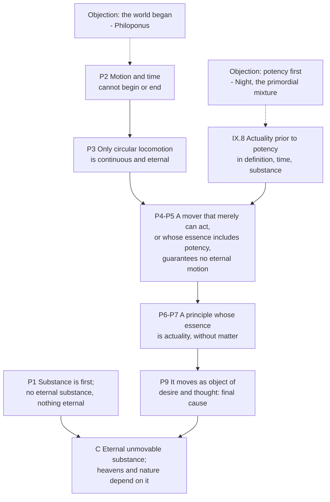

# Ancient & Medieval Philosophy · Lesson 3.6: The unmoved mover

> ⏱ ~15 min · Module 3: Aristotle: logic, nature, substance and the first mover · Builds on: [3.3 Change: privation, potency and act](03-03-change-privation-potency-and-act.md), [3.4 Substance and essence](03-04-substance-and-essence.md), [3.5 Soul and intellect](03-05-soul-and-intellect.md) · Unlocks: [4.1 Epicurus: atoms, the swerve and death](04-01-epicurus-atoms-the-swerve-and-death.md)

## Why this matters

Every piece of Module 3 was built for this. The four causes, act and potency, substance and intellect meet in a few pages of *Metaphysics* XII, where Aristotle argues that an eternally moving cosmos needs an eternal, immaterial substance whose whole being is activity. The Middle Ages read everything after through that argument. Avicenna's Necessary Existent, Averroes on the eternal world, and Aquinas's First Way all start from it. So do Plotinus's claim that something must lie above thought, and Epicurus's gods, who move nothing. You cannot read any of them well without knowing what Aristotle's first mover does, and what it pointedly does not do.

## The idea

Start with a puzzle from [3.3](03-03-change-privation-potency-and-act.md). Change is the actualization of what is potential. But a potency is only a capacity, and a capacity can sit unused forever. Wood does not turn itself into a table. So what keeps the actual world going? If the deepest causes were only *able* to act, nothing guarantees they ever would.

Aristotle's answer comes in two steps.

**Step one: actuality is prior to potency** (*Metaphysics* IX.8). It is prior in three ways:

- **In definition.** "Able to build" can only be defined by pointing to building. The capacity is understood through the activity.
- **In time, in a sense.** This seed comes before this oak. But every seed came from an actual oak, so in the kind the actual comes first. You become a lyre-player by playing the lyre.
- **In substance.** The adult is the end the child grows toward, and the potency exists for the sake of the act. Animals have sight in order to see; they do not see in order to have sight. There is also a stricter sense (around 1050b). Whatever can be can also not be. So nothing eternal is merely potential, and the eternal is prior in substance to the perishable.

**Step two: an eternal motion needs a mover that is nothing but act** (XII.6-7). The heavens turn forever. A mover that merely *could* move them might stop, so their mover's very essence must be activity. Anything with matter has potency, so this mover has no matter.

Then comes the surprise. Such a mover cannot push anything, because pushing means being acted on in return, and it cannot be acted on. It moves the way a thing we love moves us: we go toward it, and it does not change. In Ross's translation it "produces motion by being loved" (XII.7, 1072b3). The first heaven desires it and turns forever. That uniform circling is the closest a body can come to changeless activity. (The idea that the heaven *imitates* the mover is a reader's gloss. XII.7 does not quite say it.)

What does the mover do? It thinks, since thinking is the best activity and needs no body. And what does it think? Only the best object, which is itself (XII.9). Readers have argued ever since over what that leaves it knowing.

**What it does not do.** It does not create. The world, its matter and its motion have no beginning, so nothing was made. It does not choose the world or plan for particular things. It is not a providence that watches over Socrates. Whether it knows the world at all is disputed. The long line that includes Aquinas's commentary on Book XII and Brentano (1867) holds that by knowing itself as the first principle, it knows what depends on it. Many modern readers take XII.9 at its word: its only object is itself. Others, Richard Norman (1969) for one, argue that "thinking on thinking" names what pure thought is, not a mind turned in on itself. Which reading is right is a question for exegesis. Whether any such being exists is a question for [`philosophy-of-religion`](../../philosophy-of-religion/syllabus.md).

## The argument

**XII.6 (1071b3 ff.), with XII.7.** Aristotle's terms throughout: *ousia* (substance), *energeia* (actuality), *dunamis* (potency), *kinesis* (motion, change).

1. **Substances are the first of beings; if every substance were perishable, everything would be perishable.** *In words:* everything else depends on substance ([3.4](03-04-substance-and-essence.md)), so if there were no eternal substance, nothing would be eternal.
2. **But motion cannot come to be or perish, and neither can time.** A "before" motion would already be a time, and time is an attribute of motion. *In words:* asking what happened before the first motion already assumes there was time, and so motion.
3. **The only motion that can be continuous and eternal is locomotion, and among locomotions, circular motion.** *In words:* back-and-forth motion has to stop at the turning points; only a circle can go on forever without a break.
4. **An eternal motion needs a mover that actually moves, not one that merely can.** *In words:* a capacity may never be used, so a mover that only *could* act guarantees nothing. Positing eternal Forms does not help either, since Forms do not act.
5. **Even a mover that acts is not enough if its essence includes potency, for what is potentially may not be.** *In words:* if its activity is something it could lose, the motion is not guaranteed to be eternal.
6. **So there is a principle whose very essence is actuality.** *In words:* the only guarantee of unceasing activity is a thing whose whole being is that activity.
7. **Such substances are without matter.** *In words:* matter is the principle of potency ([3.3](03-03-change-privation-potency-and-act.md)), and this thing has none.
8. **Reply to the priority of potency.** Some cosmologists start from Night or a primordial chaos. But without an actual cause, nothing moves, and IX.8 has already shown the actual to be prior. *In words:* you cannot start from bare possibility.
9. **It moves as an object of desire and thought moves: without being moved** (XII.7). *In words:* it is the heaven's final cause, not a push ([3.2](03-02-nature-and-the-four-causes.md)).
10. **Conclusion.** There is an eternal, unmovable substance, without matter, whose essence is actuality, and "on such a principle, then, depend the heavens and the world of nature" (1072b13-14). Its life is thought, the best life, which we share only briefly. *In words:* the whole cosmos hangs on one immaterial activity. Aristotle calls it *theos*, god.

## Argument map

Two load-bearing premises carry the weight. P2 makes the motion eternal, and IX.8 makes act prior. Later tradition attacked the first. John Philoponus (6th century) argued against it directly. Aquinas held that neither the world's eternity nor its beginning can be demonstrated (ST I q.46 a.1-2), and built the First Way so that it needs neither ([7.3](07-03-the-five-ways-as-text.md)).

## Worked examples

**Example 1 (clean: IX.8 on a lyre-player).** Run the three priorities.

- *Definition.* "Able to play the lyre" means "able to do *that*." You cannot say what the skill is without naming the playing.
- *Time.* Take one student. Her capacity came before her playing. But she got it by playing, badly, under a teacher who already played well. In the kind, actual players come first.
- *Substance.* She acquired the skill *for* playing. The skill is the means and the playing is the end. A skill that is never used is incomplete as a skill.

The pattern generalizes. Wherever a potency exists, an actuality stands behind it as its source and ahead of it as its end. XII.6 pushes that pattern to its limit. If the cosmos's first principle were a potency, something actual would already be needed to explain its acting, so the first principle must be act.

**Example 2 (hard: one mover or fifty-five?).** XII.8 asks how many unmoved substances there are, and answers from astronomy. Each eternal celestial motion needs an eternal mover of its own. Building on the nested-sphere models of Eudoxus and Callippus, Aristotle counts fifty-five spheres, or forty-seven on a variant assumption. Readers since antiquity have questioned the arithmetic, so cite this as Aristotle's count, not a settled number.

Now the strain. In the same chapter (around 1074a31-38), Aristotle argues that the first heaven is one. Things that are many in number have matter, and the first essence has none, so the first mover is one. But the other movers lack matter too. What makes *them* many?

The text offers no clean answer. The usual reconstruction ranks them. One first mover moves the outermost sphere, and the others move the planetary spheres in an order that depends on it. XII.10 pictures the good of the whole as the order of an army, which depends on its general. Aquinas, facing the same problem with angels, made each immaterial being its own species. That repair is his, not Aristotle's.

The lesson of the case: the argument of XII.6 delivers *a* substance that is pure act. Getting from there to *one* god takes further work that XII.8 only half-finishes.

## Watch out

- **"Pure act" and "unmoved mover" are later labels.** Aristotle speaks of a first mover that is itself unmoved, and of a substance whose *ousia* is *energeia*. *Actus purus* is scholastic Latin, and it carries Thomist meanings (being as *esse*, [7.2](07-02-aquinas-essence-and-existence.md)) that Book XII does not have. That is the anachronism trap.
- **Being loved is not loving.** The mover is the object of the heaven's desire. Nothing in XII.7 says it loves, wills or attends to anything below it. Reading "God is love" into 1072b3 reverses the direction of the relation.
- **"Depend" is not "created by."** The heavens and nature depend on the principle for their eternal motion and their ordering toward an end. Nothing in XII says it gives them existence. Whether Aristotle's dependence is richer than final causation is itself disputed. State it as a dispute.
- **Thinking itself is not self-consciousness.** XII.9 is about an intellect whose object is identical with its activity (compare [3.5](03-05-soul-and-intellect.md)). It is not a Cartesian subject reflecting on its inner states, and not yet Hegel's Spirit. Hegel did close his *Encyclopaedia* by quoting XII.7, but that is reception, not the text.

## One-liner

> A world that moves forever needs a cause that never merely *could* act, so Aristotle posits an immaterial activity that thinks itself and moves the heavens only as the thing they love.

## Problems

**P1 (🟢) *(Exegetical.)* Close reading.** *Metaphysics* XII.9 sets out a dilemma. If the divine intellect thought nothing, it would be like a sleeper. If it thought something other than itself, its being would depend on something better, and a change of object would be a change for the worse. Aristotle then concludes, in Ross's translation, that [it is itself that the divine thought thinks] "(since it is the most excellent of things), and its thinking is a thinking on thinking" (1074b33-35; the bracketed words are paraphrase).

(a) Which premise of the dilemma does the parenthesis "since it is the most excellent of things" invoke? (b) Which words most support the reading that the mover knows nothing but itself? (c) What does the sentence leave open that a reader like Aquinas or Brentano needs in order to say the mover knows the world? 150 words or fewer.

**P2 (🟡) *(Exegetical.)* Find the crux.** A student writes: "Aquinas's First Way just *is* Aristotle's argument, so Aristotle's first mover is the Christian creator without the Bible." (a) Name two things Aquinas's God does that Aristotle's first mover does not, citing this lesson's loci. (b) Name the single premise about *what the first cause causes* that separates the two, and say why the eternity of the world is *not* the crux (use [7.3](07-03-the-five-ways-as-text.md) and ST I q.46 a.2). 150 words or fewer.

**P3 (🔴, optional) *(Exegetical.)* Diagnose.** An invented classroom argument:

> "Nothing comes from mere possibility. A universe that was only *able* to exist would have stayed merely able. So before the universe began, something must already have been actual, and actual all the way down, with no possibility in it at all. That's just Aristotle."

(a) Which Aristotelian doctrine is the speaker borrowing, with its locus? (b) Name two places where the speaker's version departs from Aristotle's own. 150 words or fewer.

Solutions

**P1** *(Exegetical, strict.)*

**Must hit, strict (a):** the parenthesis invokes the premise that the divine intellect must think the *best* object. If its object were something else, that object would be better than it, its thinking would be a potency dependent on that object, and a change of object would be a change for the worse. Since the divine intellect is itself the most excellent thing, it must be its own object.

**Must hit, strict (b):** "its thinking is a thinking on thinking." The object of the activity is named as the activity itself, with no second object mentioned. Read with the dilemma's second horn, which rules out an object other than itself, the sentence supports the self-contained reading.

**Must hit, strict (c):** the sentence does not say that thinking itself *excludes* knowing what depends on it. The Aquinas/Brentano reading needs an extra premise: that to know oneself perfectly as the first principle is to know one's effects. That premise is not in the sentence and must be brought in, or argued for from XII.10 or elsewhere.

**Wrong turns:** treating "thinking on thinking" as modern self-consciousness; saying the passage *denies* knowledge of the world in so many words. What it denies is an object other than itself, which is the very point in dispute.

**Model answer:** (a) The premise that the divine intellect must think the most excellent object, since dependence on anything else would make its thinking a potency and any change a change for the worse. (b) "Its thinking is a thinking on thinking": the object is the activity itself, and the dilemma has excluded any other object. (c) Whether knowing itself includes knowing what depends on it. Aquinas and Brentano add the premise that perfect self-knowledge of a first principle includes knowledge of its effects. The sentence neither states nor rules that out.

---

**P2** *(Exegetical, strict.)*

**Must hit, strict (a):** any two of these. Aquinas's God creates, giving existence to things, not only motion. It knows singulars. It wills freely. It exercises providence. Aristotle's mover moves as an object of love (XII.7, 1072b3), does not make matter or begin the world, and by XII.9 has only itself as its explicit object.

**Must hit, strict (b):** the crux is whether the first cause causes only motion and order, as a final cause, or the very existence of what it moves. Aristotle's argument needs only the first. Aquinas affirms the second, resting on the distinction between essence and existence (6.2, 7.2). Eternity is not the crux: Aquinas holds (ST I q.46 a.1-2) that neither eternity nor a beginning can be demonstrated, and argues the First Way without assuming a beginning. An eternal world could still be created, on his view.

**Wrong turns:** naming "the world had a beginning" as the crux; saying Aristotle's mover is merely unknown to revelation, which misses that its causality is a different *kind*.

**Model answer:** (a) Aquinas's God creates, giving being and not only motion, and exercises providence over singulars. Aristotle's mover only moves the heavens as the thing they love (1072b3), and by XII.9 thinks only itself. (b) The crux is whether the first cause causes the existence of things or only their motion and order. Aristotle needs only the latter. Aquinas, using essence and existence, affirms the former. Eternity is not the crux, because Aquinas holds it cannot be refuted by demonstration (ST I q.46 a.2) and builds the First Way so it would hold even in an eternal world.

---

**P3** *(Exegetical, strict.)*

**Must hit, strict (a):** the priority of actuality over potency (*Metaphysics* IX.8), used as XII.6 uses it against the cosmologists who start from Night or chaos. What is only able to be may not be, so an actual cause is required.

**Must hit, strict (b):** any two of these.
- **A beginning.** "Before the universe began" assumes a first moment. Aristotle's argument assumes the reverse: motion and time are eternal (XII.6), and the priority of act is not temporal in that way.
- **"Actual all the way down" as bare existence.** The speaker makes the first cause the cause of the universe's *existing*. Aristotle's mover explains eternal *motion* as a final cause, which is closer to the Avicennian and Thomist transformation (6.2, 7.2).
- **Priority in time.** IX.8 says actuality is prior in time only in a sense. Any given individual's potency comes before its own actuality.

**Wrong turns:** calling it Aristotle's efficient-cause argument without qualification; treating "actual all the way down" as Aristotle's wording rather than the later *actus purus*.

**Model answer:** (a) The priority of act over potency, *Metaphysics* IX.8, as deployed in XII.6 against starting from Night. (b) First, the speaker needs a beginning. Aristotle's argument runs on an eternal motion and time, and IX.8 grants that in any single case the potency comes first in time. Second, the speaker's first cause accounts for the universe's *existing*. Aristotle's accounts for eternal motion as the object of love. That existence-giving version is the later, Avicennian and Thomist, reading.

## Flashback

**From Lesson 3.4 (Substance and essence):** *(Exegetical.)* At dusk a householder thinks, truly, that the lamp in the courtyard is lit. An hour later a neighbour puts it out, and she still thinks so. A classmate argues: "Her opinion stayed numerically one and the same and went from true to false. It admits contraries, so by *Categories* 5's own mark it is a substance." (a) Before we even reach the mark, where does her opinion sit in the *Categories* grid, and which relation keeps it from being a primary substance? (b) Aristotle anticipates this objection in ch. 5 (Edghill): "statements and opinions themselves remain unaltered in all respects: it is by the alteration in the facts of the case that the contrary quality comes to be theirs." Which words decide against the classmate, and what does the mark of substance turn out to require beyond "one thing, contrary qualities"? Two sentences or fewer per part.

Solution

**Must hit, strict (a):** it is **present in** a subject (the householder's soul) and **said of** nothing, so it is an individual accident, in the same cell as *this* whiteness. Being present in something, meaning unable to exist apart from it, is the relation that disqualifies it. Primary substance is neither said of nor present in a subject.

**Must hit, strict (b):** "remain unaltered in all respects" and "by the alteration in the facts of the case". The opinion does not change; the lamp does, and the opinion's truth-value follows. So the mark requires that a substance admit contraries **by itself changing**: the contrary must come about through a change in the thing that bears it.

**Wrong turns:** conceding that the opinion does admit contraries in the substance's way and then rescuing Aristotle by (a) alone. Ch. 5 denies the concession. Saying the change is in the householder: she has not changed either. What altered is the lamp, the "facts of the case".

**Model answer:** (a) Her opinion is present in a subject, her soul, and said of nothing, so it is an individual accident. Its dependence on her rules it out as a primary substance before the mark is even tested. (b) "Remain unaltered in all respects" and "by the alteration in the facts of the case": the opinion stays exactly as it was, and only the lamp goes out. So the mark is not bare "one thing bearing contraries in turn" but taking on contraries *by changing itself*, as a man goes from pale to dark.

## Connections

- **Backward:** motion as the actuality of the potential ([3.3](03-03-change-privation-potency-and-act.md)) sets the puzzle that IX.8 resolves. Substance as first among beings ([3.4](03-04-substance-and-essence.md)) is P1. The final cause ([3.2](03-02-nature-and-the-four-causes.md)) is how the mover moves. The ever-active intellect of *De Anima* III.5 ([3.5](03-05-soul-and-intellect.md)) is the nearest human analogue. Alexander of Aphrodisias, on the usual report, identified the two.
- **Forward:** Epicurus's gods move nothing and care for nothing ([4.1](04-01-epicurus-atoms-the-swerve-and-death.md)). Plotinus puts the One above a thought that thinks itself, because thinking still involves duality ([4.4](04-04-plotinus-the-one-intellect-and-soul.md)). Avicenna turns pure act into the Necessary Existent ([6.2](06-02-avicenna-essence-existence-and-the-necessary-existent.md)). Averroes and Maimonides fight over P2 ([6.3](06-03-averroes-and-maimonides.md)). Aquinas turns act into *esse* ([7.2](07-02-aquinas-essence-and-existence.md)) and motion into the First Way ([7.3](07-03-the-five-ways-as-text.md)). Whether the argument is sound belongs to [`philosophy-of-religion`](../../philosophy-of-religion/syllabus.md). Act and potency as a live theory belong to [`metaphysics` 2.2](../../metaphysics/lessons/02-02-change-act-and-potency.md), and per se ordered series to [`metaphysics` 4.4](../../metaphysics/lessons/04-04-ordered-causal-series.md). [`thomistic-synthesis`](../../thomistic-synthesis/syllabus.md) builds pure act on this lesson.
- **Sideways:** P4 assumes that continuing motion needs a continuing cause. [`mechanics-refresher` 1.2](../../mechanics-refresher/lessons/01-02-newtons-laws.md) removes exactly that: under inertia, uniform straight-line motion needs no mover at all. Newton still needs a force to bend a path into a circle, but the need for a cause of motion as such is gone.
